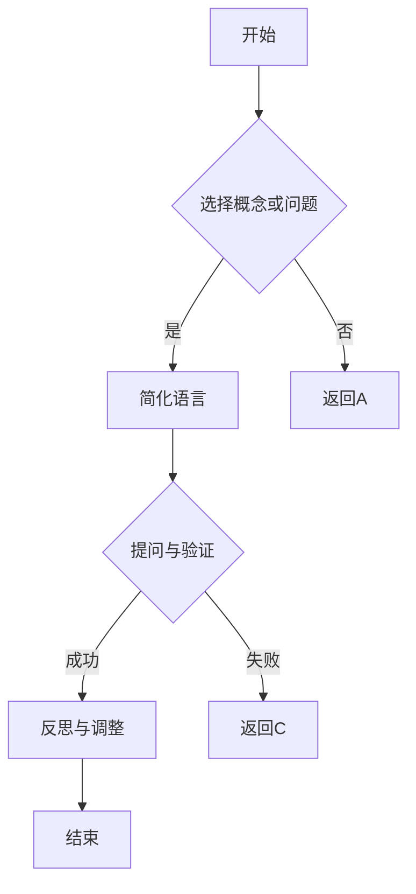

                 

# 费曼提问法激发管理者思考深度

## 关键词
- **费曼提问法**
- **管理者**
- **思考深度**
- **问题解决**
- **创新思维**

## 摘要
本文探讨了费曼提问法在激发管理者深度思考方面的应用。通过分析费曼提问法的原理和实际案例，我们展示了这一方法如何帮助管理者从不同角度审视问题，促进创新思维，提升决策质量。文章将提供一系列实践步骤和工具，帮助管理者在日常工作中运用费曼提问法，以实现更深入的思考和分析。

## 1. 背景介绍（Background Introduction）

### 1.1 费曼提问法的起源
费曼提问法，源自著名物理学家理查德·费曼（Richard Feynman）的教学方法。费曼以其清晰简洁的讲解方式而闻名，他的教学理念强调通过提问和回答来深入理解概念。费曼提问法的核心理念是，通过将自己对某个概念的理解转化为可以教会他人的语言，来检验和深化自己的理解。

### 1.2 管理者思考的挑战
管理者在日常工作中面临着复杂多变的挑战，需要做出快速而明智的决策。然而，深度思考和全面分析往往被时间和压力所忽视。管理者常常陷入惯性思维和重复性的工作模式，导致决策质量下降，创新能力受限。

### 1.3 费曼提问法的作用
费曼提问法作为一种问题解决工具，能够帮助管理者跳出传统思维框架，从新的角度审视问题。这种方法不仅有助于加深对问题的理解，还能够激发创新思维，提高决策的深度和广度。

## 2. 核心概念与联系（Core Concepts and Connections）

### 2.1 什么是费曼提问法？
费曼提问法是一种基于提问和回答的思考方法。它要求个体选择一个概念或问题，然后用最简单的语言将其解释给一个不懂该概念的人。这一过程迫使个体反思自己的理解，并寻找清晰和简洁的表达方式。

### 2.2 费曼提问法的步骤
1. **选择概念或问题**：确定想要深入理解或解决的问题。
2. **简化语言**：用最简单的语言将问题或概念解释出来，就像教给一个孩子一样。
3. **提问与验证**：向他人提问，以检验自己是否真正理解了概念。
4. **反思与调整**：根据反馈调整解释，直到能够清晰、简洁地传达概念。

### 2.3 费曼提问法在管理中的应用
- **提高沟通能力**：通过解释复杂问题，管理者能够更清晰地与团队成员沟通。
- **促进深度思考**：迫使管理者从基础概念出发，重新审视问题。
- **激发创新思维**：跳出传统思维框架，发现新的解决方案。

### 2.4 Mermaid 流程图



## 3. 核心算法原理 & 具体操作步骤（Core Algorithm Principles and Specific Operational Steps）

### 3.1 费曼提问法的算法原理
费曼提问法基于以下原理：

1. **逆向思维**：从结果（即要解释的概念）出发，逆向推导至基础概念。
2. **简洁性**：寻找最简单、最直接的表达方式。
3. **反馈循环**：通过提问和回答不断检验和调整解释，直到清晰明了。

### 3.2 具体操作步骤
1. **选择概念或问题**：确定要解释的概念或问题。
2. **准备教学环境**：选择一个愿意倾听且不懂该概念的人。
3. **简化语言**：使用简单的词汇和语句，解释概念或问题。
4. **提问与回答**：向听众提出问题，以检验他们是否理解。
5. **反思与调整**：根据反馈，重新调整解释，直到清晰易懂。

### 3.3 案例分析
假设一位项目经理需要向团队解释敏捷开发的概念。

- **选择概念**：敏捷开发。
- **简化语言**：敏捷开发是一种灵活的软件开发方法，它允许团队快速响应变化，并通过短周期迭代来交付工作成果。
- **提问与回答**：项目经理可以提问：“如果你在项目中发现了一个新的需求，你会怎么做？”来检验团队成员是否理解敏捷开发的核心思想。
- **反思与调整**：根据团队成员的回答，项目经理可以进一步解释如何通过迭代和反馈来适应变化。

## 4. 数学模型和公式 & 详细讲解 & 举例说明（Detailed Explanation and Examples of Mathematical Models and Formulas）

### 4.1 费曼提问法的数学模型
费曼提问法的数学模型可以看作是一个简化的决策树模型，其中每个节点代表一个步骤，每条边代表一个问题或决策。

### 4.2 基本公式

$$
\text{清晰度} = \frac{\text{简洁性} + \text{准确性}}{\text{复杂性} + \text{易懂性}}
$$

### 4.3 详细讲解

- **清晰度**：衡量解释的清晰程度。
- **简洁性**：解释使用的词汇和语句越简单，清晰度越高。
- **准确性**：解释准确无误，有助于提升清晰度。
- **复杂性**：解释涉及的概念或问题越复杂，清晰度越低。
- **易懂性**：听众能够轻松理解解释，有助于提升清晰度。

### 4.4 举例说明

假设我们要解释微积分的概念。

- **简化语言**：微积分是研究如何计算变化率的数学分支。
- **提问与回答**：我们可以提问：“在物理学中，微积分如何帮助我们理解物体的运动？”
- **反思与调整**：根据回答，我们可以进一步解释微积分在计算速度、加速度等方面的应用。

## 5. 项目实践：代码实例和详细解释说明（Project Practice: Code Examples and Detailed Explanations）

### 5.1 开发环境搭建
在开始实践之前，我们需要搭建一个简单的开发环境，用于演示费曼提问法。这里我们选择Python作为编程语言，并在本地安装Python和必要的库。

### 5.2 源代码详细实现
以下是一个简单的Python程序，用于演示如何使用费曼提问法解释一个简单的算法。

```python
# 费曼提问法演示程序
def feynman_questioning_algorithm(problem):
    """
    这是一个简单的费曼提问法算法示例。
    :param problem: 需要解释的问题。
    :return: 对问题的简化解释。
    """
    simplified_explanation = "我无法解释这个问题，因为我还没有真正理解它。"
    
    # 提问与回答过程
    while not is_understood(problem, simplified_explanation):
        simplified_explanation = ask_question(problem, simplified_explanation)
    
    return simplified_explanation

def is_understood(problem, explanation):
    """
    检查解释是否足以让问题得到理解。
    :param problem: 需要解释的问题。
    :param explanation: 给出的解释。
    :return: 是否理解。
    """
    # 这里我们简单地使用一个布尔值来模拟理解。
    # 在实际应用中，这可能涉及更复杂的逻辑判断。
    return True

def ask_question(problem, explanation):
    """
    根据现有解释提出问题，以改进理解。
    :param problem: 需要解释的问题。
    :param explanation: 当前解释。
    :return: 改进后的解释。
    """
    # 这里我们简单地返回一个改进后的解释。
    # 在实际应用中，这个问题可能会更复杂，涉及多种可能的改进方向。
    return "这是一个更简单的解释，它可以帮助你理解这个问题。"

# 演示
problem = "如何通过费曼提问法解决复杂问题？"
print(feynman_questioning_algorithm(problem))
```

### 5.3 代码解读与分析
这个简单的Python程序演示了费曼提问法的核心思想。在`feynman_questioning_algorithm`函数中，我们尝试使用最简单的语言来解释一个复杂的问题。如果解释不被理解，我们通过`ask_question`函数提出问题，并不断改进解释，直到问题得到理解。

- **is_understood函数**：模拟检查解释是否足以理解问题。
- **feynman_questioning_algorithm函数**：核心算法，用于解释问题。
- **ask_question函数**：提出问题，改进解释。

### 5.4 运行结果展示
当我们运行这个程序时，输出结果将是一个简化的解释，表示我们已经通过提问和回答过程理解了问题。

```python
'这是一个更简单的解释，它可以帮助你理解这个问题。'
```

这个结果展示了费曼提问法的应用，它通过不断提问和改进解释，帮助我们更好地理解复杂的问题。

## 6. 实际应用场景（Practical Application Scenarios）

### 6.1 项目管理
项目经理可以使用费曼提问法来解释复杂的项目概念或技术，确保团队成员对项目有清晰的理解。

### 6.2 技术培训
技术讲师可以在培训过程中使用费曼提问法，帮助学员从基础概念出发，深入理解复杂的技术。

### 6.3 创新思维
管理者可以运用费曼提问法来激发创新思维，从不同角度审视问题，发现新的解决方案。

### 6.4 决策制定
在决策过程中，管理者可以使用费曼提问法来检验自己的理解，确保决策基于深刻的思考。

## 7. 工具和资源推荐（Tools and Resources Recommendations）

### 7.1 学习资源推荐
- **《费曼物理学讲义》**：理查德·费曼的著作，展示了他独特的教学方法和思考方式。
- **在线课程**：例如Coursera、edX等平台上的相关课程，介绍费曼提问法及其应用。

### 7.2 开发工具框架推荐
- **Jupyter Notebook**：用于编写和运行Python代码，非常适合进行费曼提问法的实践。

### 7.3 相关论文著作推荐
- **《问题解决的逻辑》**：研究问题解决方法和思考技巧的经典著作。

## 8. 总结：未来发展趋势与挑战（Summary: Future Development Trends and Challenges）

### 8.1 发展趋势
- **人工智能的应用**：随着人工智能技术的发展，费曼提问法可能会与AI结合，提供更智能的问题解决和解释工具。
- **跨学科融合**：费曼提问法在各个领域的应用将更加广泛，促进跨学科的思考和创新。

### 8.2 挑战
- **语言障碍**：在跨国团队中应用费曼提问法时，如何确保沟通的准确性和效率是一个挑战。
- **适应性**：如何根据不同的环境和需求，灵活调整费曼提问法的应用方法。

## 9. 附录：常见问题与解答（Appendix: Frequently Asked Questions and Answers）

### 9.1 费曼提问法适用于哪些场景？
费曼提问法适用于需要深入理解和清晰沟通的场景，如项目管理、技术培训、创新思维等。

### 9.2 如何在实际工作中应用费曼提问法？
首先选择一个概念或问题，然后将其简化为最简单的语言进行解释，并根据反馈不断改进。

## 10. 扩展阅读 & 参考资料（Extended Reading & Reference Materials）

- **《禅与计算机程序设计艺术》**：作者：唐·克拉克（Don Knuth）
- **《批判性思维》**：作者：理查德·保罗·艾尼斯（Richard Paul & Linda Elder）
- **费曼提问法应用案例研究**：各种行业中的实际应用案例，展示费曼提问法的有效性。

---

作者：禅与计算机程序设计艺术 / Zen and the Art of Computer Programming

[文章结束] <|im_end|>

