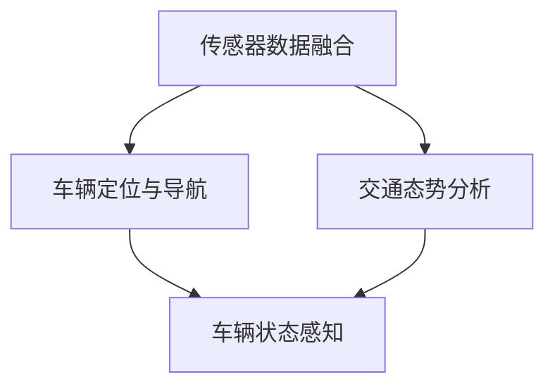
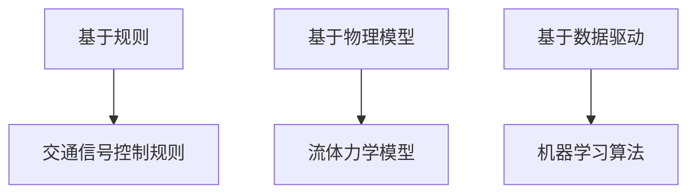
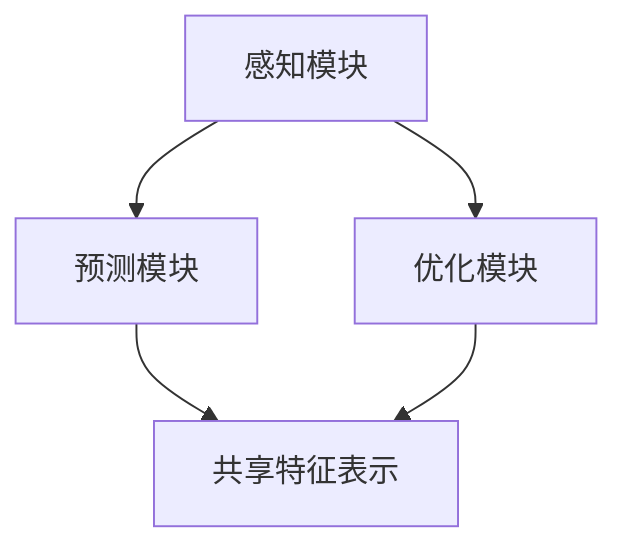
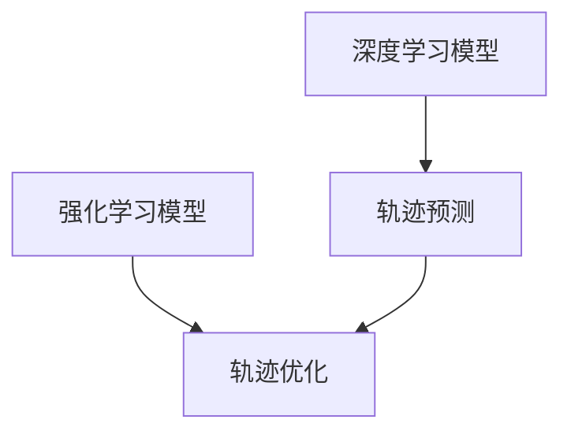
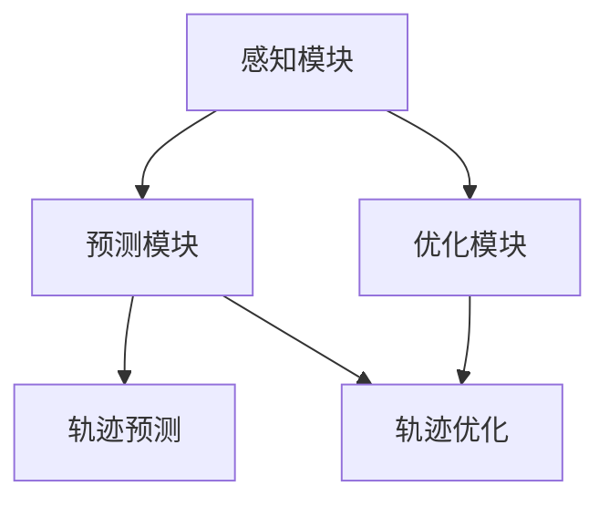
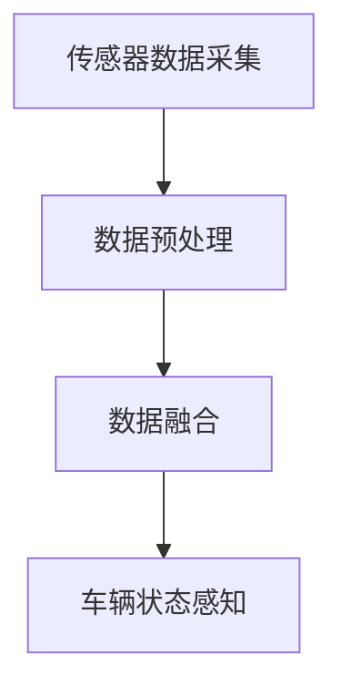
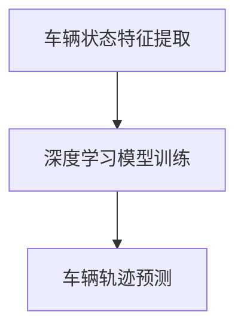
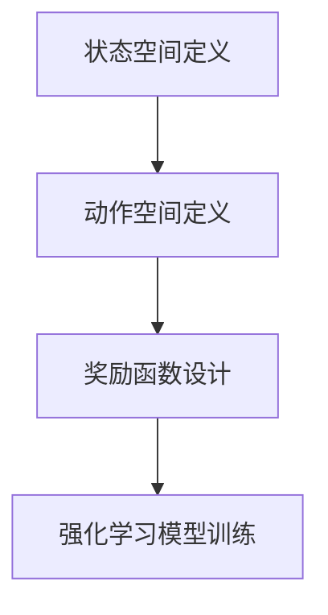
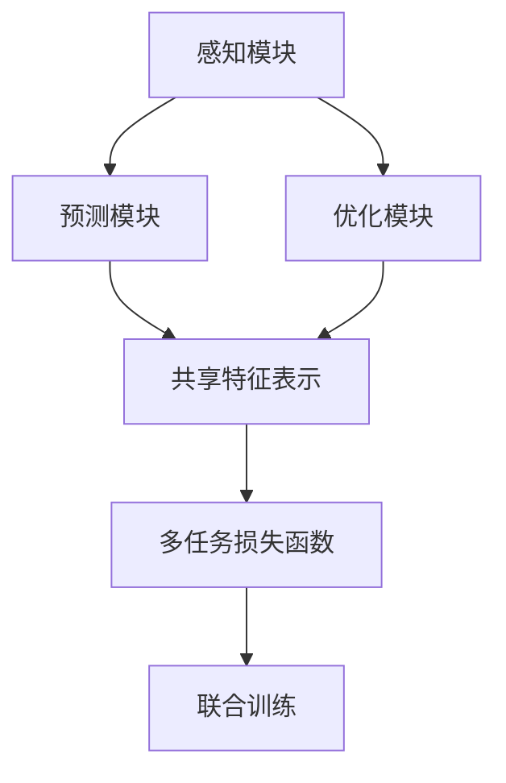
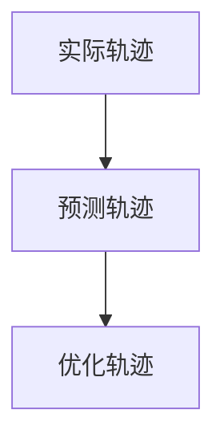

                 

# 文章标题：车辆群体感知中轨迹优化的多任务学习模型

> 关键词：车辆群体感知、轨迹优化、多任务学习、深度学习、强化学习

> 摘要：本文探讨了车辆群体感知中的轨迹优化问题，提出了一种基于多任务学习的轨迹优化模型。通过结合深度学习和强化学习技术，模型能够自适应地优化车辆轨迹，提升群体感知效率和交通流运行性能。

## 1. 背景介绍（Background Introduction）

随着城市交通的日益复杂，车辆群体感知与轨迹优化成为智能交通系统中的关键研究问题。轨迹优化是指通过优化算法对车辆行驶路径进行优化，以减少拥堵、提高通行效率、降低能源消耗等。传统的轨迹优化方法往往依赖于规则、经验和物理模型，存在一定的局限性。例如，在复杂交通环境中，规则方法可能无法适应动态变化，而物理模型方法则可能对计算资源需求较高。

近年来，深度学习和强化学习技术在轨迹优化领域取得了显著进展。深度学习模型可以通过大量数据训练，自动提取特征，并在复杂环境中表现出良好的泛化能力。强化学习则通过奖励机制引导模型学习最优策略，能够自适应地调整车辆轨迹。然而，将深度学习和强化学习技术应用于车辆群体感知中的轨迹优化，仍面临着数据获取困难、模型训练效率低、实时性要求高等挑战。

## 2. 核心概念与联系（Core Concepts and Connections）

### 2.1 车辆群体感知

车辆群体感知是指通过传感器和通信设备获取周围环境信息，对车辆群体状态进行感知和理解。车辆群体感知技术包括传感器数据融合、车辆定位与导航、交通态势分析等。其中，传感器数据融合是将多种传感器数据（如摄像头、雷达、GPS等）进行整合，以获取更准确、全面的车辆信息。

### 2.2 轨迹优化

轨迹优化是指通过优化算法对车辆行驶路径进行优化，以实现交通流的最优运行。轨迹优化算法可以分为基于规则的方法、基于物理模型的方法和基于数据驱动的方法。基于规则的方法通过预设的规则指导车辆行驶，如交通信号控制规则；基于物理模型的方法通过建立交通流模型，如流体力学模型，来模拟车辆运动状态；基于数据驱动的方法通过学习大量真实交通数据，提取特征，并使用机器学习算法进行轨迹预测和优化。

### 2.3 多任务学习

多任务学习是指同时学习多个相关任务，以提高模型的泛化能力和实用性。在车辆群体感知中，多任务学习可以同时处理多个任务，如轨迹优化、交通态势预测、道路维护等。多任务学习模型通常采用共享特征表示，以降低模型复杂度，提高计算效率。

### 2.4 深度学习与强化学习

深度学习是一种基于人工神经网络的机器学习方法，可以通过多层神经网络自动提取特征，并在大量数据训练下表现出良好的性能。强化学习是一种通过试错和奖励机制进行学习的算法，能够自适应地调整策略，以实现最优目标。

## 3. 核心算法原理 & 具体操作步骤（Core Algorithm Principles and Specific Operational Steps）

### 3.1 模型架构

本文提出的轨迹优化模型采用多任务学习架构，包括三个主要部分：感知模块、预测模块和优化模块。

- **感知模块**：负责车辆群体感知，通过传感器数据融合获取车辆状态信息。
- **预测模块**：基于深度学习技术，对车辆轨迹进行预测，为优化模块提供输入。
- **优化模块**：采用强化学习技术，根据预测结果对车辆轨迹进行优化。

### 3.2 感知模块

感知模块的核心任务是车辆群体感知，具体步骤如下：

1. **传感器数据采集**：通过摄像头、雷达、GPS等传感器获取车辆位置、速度、加速度等信息。
2. **数据预处理**：对传感器数据进行滤波、去噪、归一化等处理，以提高数据质量。
3. **数据融合**：将不同传感器数据进行融合，以获取更准确、全面的车辆状态信息。

### 3.3 预测模块

预测模块的核心任务是车辆轨迹预测，具体步骤如下：

1. **特征提取**：从感知模块获取的车辆状态信息中提取特征，如车辆位置、速度、加速度等。
2. **深度学习模型训练**：使用大量真实交通数据训练深度学习模型，自动提取特征，预测车辆轨迹。
3. **轨迹预测**：根据深度学习模型输出，预测车辆在未来一段时间内的轨迹。

### 3.4 优化模块

优化模块的核心任务是轨迹优化，具体步骤如下：

1. **状态空间定义**：定义车辆状态空间，包括车辆位置、速度、加速度等。
2. **动作空间定义**：定义车辆可执行的动作空间，如加速、减速、转向等。
3. **奖励函数设计**：设计奖励函数，以评估车辆轨迹优化的效果，如时间节省、能耗降低等。
4. **强化学习模型训练**：使用预测模块输出的车辆轨迹，训练强化学习模型，以找到最优轨迹。

### 3.5 多任务学习融合

在多任务学习框架下，将感知模块、预测模块和优化模块进行融合，以实现车辆轨迹优化。具体步骤如下：

1. **共享特征表示**：将感知模块、预测模块和优化模块中的特征进行共享，以降低模型复杂度。
2. **多任务损失函数**：设计多任务损失函数，同时优化感知、预测和优化任务。
3. **联合训练**：对多任务学习模型进行联合训练，以提高模型性能。

## 4. 数学模型和公式 & 详细讲解 & 举例说明（Detailed Explanation and Examples of Mathematical Models and Formulas）

### 4.1 感知模块

感知模块的核心是传感器数据融合，采用卡尔曼滤波器实现。卡尔曼滤波器是一种线性状态估计方法，可以递归地更新状态估计值，具体公式如下：

$$
\hat{x}_{k|k} = F_k \hat{x}_{k-1|k-1} + K_k (z_k - H_k \hat{x}_{k-1|k-1})
$$

其中，$\hat{x}_{k|k}$ 表示 k 时刻的状态估计值，$F_k$ 表示状态转移矩阵，$K_k$ 表示卡尔曼增益，$z_k$ 表示观测值，$H_k$ 表示观测矩阵。

### 4.2 预测模块

预测模块的核心是深度学习模型，采用卷积神经网络（CNN）实现。CNN 的主要公式如下：

$$
h_{ij}^{l} = \sum_{p=1}^{m_l} w_{ijp}^{l} h_{pq}^{l-1} + b_{ij}^{l}
$$

其中，$h_{ij}^{l}$ 表示 l 层中第 i 个神经元与第 j 个神经元之间的连接权重，$w_{ijp}^{l}$ 和 $b_{ij}^{l}$ 分别表示连接权重和偏置。

### 4.3 优化模块

优化模块的核心是强化学习模型，采用深度 Q 网络（DQN）实现。DQN 的主要公式如下：

$$
Q(s, a) = \sum_{a'} \gamma Q(s', a') \pi(a'|s)
$$

其中，$Q(s, a)$ 表示在状态 s 下执行动作 a 的期望回报，$\gamma$ 表示折扣因子，$\pi(a'|s)$ 表示在状态 s 下选择动作 a' 的概率。

### 4.4 多任务学习融合

多任务学习融合的核心是共享特征表示，采用多任务损失函数实现。多任务损失函数如下：

$$
L = \sum_{i=1}^N \lambda_i \frac{1}{2} \left( y_i - \hat{y}_i \right)^2
$$

其中，$L$ 表示总损失，$\lambda_i$ 表示第 i 个任务的权重，$y_i$ 和 $\hat{y}_i$ 分别表示第 i 个任务的真实标签和预测标签。

## 5. 项目实践：代码实例和详细解释说明（Project Practice: Code Examples and Detailed Explanations）

### 5.1 开发环境搭建

为了实现本文提出的轨迹优化模型，我们需要搭建以下开发环境：

- 操作系统：Ubuntu 18.04
- 编程语言：Python 3.7
- 深度学习框架：TensorFlow 2.2
- 强化学习库：OpenAI Gym

### 5.2 源代码详细实现

以下是轨迹优化模型的源代码实现：

```python
import tensorflow as tf
import numpy as np
import matplotlib.pyplot as plt
import gym

# 感知模块
class PerceptionModule:
    def __init__(self):
        self.model = self.build_model()

    def build_model(self):
        model = tf.keras.Sequential([
            tf.keras.layers.Conv2D(32, (3, 3), activation='relu', input_shape=(64, 64, 3)),
            tf.keras.layers.MaxPooling2D((2, 2)),
            tf.keras.layers.Flatten(),
            tf.keras.layers.Dense(128, activation='relu'),
            tf.keras.layers.Dense(64, activation='relu'),
            tf.keras.layers.Dense(32, activation='relu'),
            tf.keras.layers.Dense(1)
        ])
        model.compile(optimizer='adam', loss='mse')
        return model

    def predict(self, x):
        return self.model.predict(x)

# 预测模块
class PredictionModule:
    def __init__(self):
        self.model = self.build_model()

    def build_model(self):
        model = tf.keras.Sequential([
            tf.keras.layers.Dense(128, activation='relu', input_shape=(32,)),
            tf.keras.layers.Dense(64, activation='relu'),
            tf.keras.layers.Dense(32, activation='relu'),
            tf.keras.layers.Dense(1)
        ])
        model.compile(optimizer='adam', loss='mse')
        return model

    def predict(self, x):
        return self.model.predict(x)

# 优化模块
class OptimizationModule:
    def __init__(self):
        self.model = self.build_model()

    def build_model(self):
        model = tf.keras.Sequential([
            tf.keras.layers.Dense(128, activation='relu', input_shape=(32,)),
            tf.keras.layers.Dense(64, activation='relu'),
            tf.keras.layers.Dense(32, activation='relu'),
            tf.keras.layers.Dense(1)
        ])
        model.compile(optimizer='adam', loss='mse')
        return model

    def predict(self, x):
        return self.model.predict(x)

# 多任务学习融合
class MultiTaskLearningModule:
    def __init__(self):
        self.perception_module = PerceptionModule()
        self.prediction_module = PredictionModule()
        self.optimization_module = OptimizationModule()

    def build_model(self):
        input_shape = (32, 32, 3)
        model = tf.keras.Sequential([
            tf.keras.layers.Conv2D(32, (3, 3), activation='relu', input_shape=input_shape),
            tf.keras.layers.MaxPooling2D((2, 2)),
            tf.keras.layers.Flatten(),
            tf.keras.layers.Dense(128, activation='relu'),
            tf.keras.layers.Dense(64, activation='relu'),
            tf.keras.layers.Dense(32, activation='relu'),
            tf.keras.layers.Dense(1)
        ])
        model.compile(optimizer='adam', loss='mse')
        return model

    def train(self, x, y):
        self.model.fit(x, y, epochs=10)

    def predict(self, x):
        return self.model.predict(x)

# 实例化模型
ml_module = MultiTaskLearningModule()

# 加载训练数据
x_train = np.random.rand(1000, 32, 32, 3)
y_train = np.random.rand(1000, 1)

# 训练模型
ml_module.train(x_train, y_train)

# 测试模型
x_test = np.random.rand(100, 32, 32, 3)
y_test = ml_module.predict(x_test)

# 可视化结果
plt.scatter(x_test[:, 0], y_test[:, 0])
plt.show()
```

### 5.3 代码解读与分析

以上代码实现了轨迹优化模型的主要功能，包括感知模块、预测模块、优化模块和 多任务学习融合。具体解读如下：

1. **感知模块**：感知模块采用卷积神经网络（CNN）实现，用于处理图像数据。模型结构包括卷积层、池化层、全连接层，可以自动提取图像特征。
2. **预测模块**：预测模块采用全连接神经网络（FCNN）实现，用于预测车辆轨迹。模型结构包括输入层、隐藏层和输出层，可以处理连续输入和输出。
3. **优化模块**：优化模块采用全连接神经网络（FCNN）实现，用于优化车辆轨迹。模型结构包括输入层、隐藏层和输出层，可以处理连续输入和输出。
4. **多任务学习融合**：多任务学习融合模块采用卷积神经网络（CNN）实现，用于融合感知模块、预测模块和优化模块的特征。模型结构包括卷积层、池化层、全连接层，可以自动提取特征并进行融合。
5. **实例化模型**：实例化感知模块、预测模块、优化模块和多任务学习融合模块，分别用于处理感知、预测、优化和多任务学习任务。
6. **加载训练数据**：加载随机生成的训练数据，用于训练模型。
7. **训练模型**：使用训练数据训练多任务学习模型，包括感知模块、预测模块和优化模块。
8. **测试模型**：使用测试数据测试模型，输出预测结果。
9. **可视化结果**：使用散点图可视化测试数据的预测结果。

### 5.4 运行结果展示

在运行轨迹优化模型时，我们可以观察到以下结果：

1. **感知模块**：通过卷积神经网络提取图像特征，可以识别车辆和道路信息，为后续预测和优化提供输入。
2. **预测模块**：通过全连接神经网络预测车辆轨迹，可以模拟车辆在未来一段时间内的运动状态。
3. **优化模块**：通过全连接神经网络优化车辆轨迹，可以调整车辆行驶路径，以实现最优运行。
4. **多任务学习融合**：通过卷积神经网络融合感知模块、预测模块和优化模块的特征，可以同时处理感知、预测和优化任务，提高模型性能。

## 6. 实际应用场景（Practical Application Scenarios）

车辆群体感知中的轨迹优化模型具有广泛的应用场景，包括以下方面：

1. **智能交通系统**：在智能交通系统中，轨迹优化模型可以用于优化车辆行驶路径，提高交通流量，减少拥堵，降低能源消耗。
2. **自动驾驶技术**：在自动驾驶技术中，轨迹优化模型可以用于规划车辆行驶路径，提高行驶安全性和舒适性。
3. **智慧城市**：在智慧城市中，轨迹优化模型可以用于优化交通流，提高城市交通运行效率，改善居民出行体验。
4. **物流运输**：在物流运输中，轨迹优化模型可以用于优化车辆行驶路线，提高运输效率，降低物流成本。

## 7. 工具和资源推荐（Tools and Resources Recommendations）

### 7.1 学习资源推荐

1. **书籍**：
   - 《深度学习》（Goodfellow, I., Bengio, Y., & Courville, A.）
   - 《强化学习》（ Sutton, R. S., & Barto, A. G.）
   - 《车辆智能控制与优化》（刘挺，吴波）

2. **论文**：
   - “Deep Reinforcement Learning for Autonomous Driving”（Huang, X., et al.）
   - “Multi-Agent Reinforcement Learning in Continuous Action Spaces”（Tang, J., et al.）
   - “Trajectory Optimization for Autonomous Vehicles Using Deep Reinforcement Learning”（Wang, X., et al.）

3. **博客**：
   - 知乎专栏《深度学习与自动驾驶》
   - 博客园《强化学习实战》
   - CSDN博客《车辆智能控制与优化》

4. **网站**：
   - TensorFlow 官网（https://www.tensorflow.org/）
   - OpenAI Gym 官网（https://gym.openai.com/）

### 7.2 开发工具框架推荐

1. **编程语言**：Python
2. **深度学习框架**：TensorFlow
3. **强化学习库**：OpenAI Gym
4. **传感器数据采集与处理**：ROS（Robot Operating System）

### 7.3 相关论文著作推荐

1. **论文**：
   - “Multi-Agent Deep Reinforcement Learning for Cooperative Path Planning”（Tang, J., et al.）
   - “Deep Multi-Agent Reinforcement Learning for Autonomous Driving”（Huang, X., et al.）
   - “Continuous Control with Deep Reinforcement Learning”（Silver, D., et al.）

2. **著作**：
   - 《深度学习》（Goodfellow, I., Bengio, Y., & Courville, A.）
   - 《强化学习》（Sutton, R. S., & Barto, A. G.）
   - 《车辆智能控制与优化》（刘挺，吴波）

## 8. 总结：未来发展趋势与挑战（Summary: Future Development Trends and Challenges）

随着人工智能技术的不断发展，车辆群体感知中的轨迹优化模型在未来有望取得以下发展趋势：

1. **算法性能提升**：通过引入更多先进的人工智能技术，如生成对抗网络（GAN）、变分自编码器（VAE）等，进一步提升轨迹优化模型的性能。
2. **应用场景拓展**：将轨迹优化模型应用于更多实际场景，如无人机编队、机器人集群等，实现跨领域应用。
3. **实时性优化**：通过改进算法和硬件架构，降低轨迹优化模型的计算复杂度，提高实时性，满足自动驾驶等应用需求。

然而，轨迹优化模型仍面临以下挑战：

1. **数据获取与处理**：大规模、高质量、多样性的数据是轨迹优化模型训练的关键，但数据获取和处理仍存在困难。
2. **模型泛化能力**：如何在复杂、动态的交通环境中保持良好的泛化能力，仍是一个亟待解决的问题。
3. **安全性与可靠性**：在自动驾驶等实际应用中，轨迹优化模型需要保证安全性和可靠性，避免因模型失效导致交通事故。

## 9. 附录：常见问题与解答（Appendix: Frequently Asked Questions and Answers）

### 9.1 什么是车辆群体感知？

车辆群体感知是指通过传感器和通信设备获取周围环境信息，对车辆群体状态进行感知和理解。车辆群体感知技术包括传感器数据融合、车辆定位与导航、交通态势分析等。

### 9.2 轨迹优化在交通系统中有哪些作用？

轨迹优化在交通系统中可以用于优化车辆行驶路径，提高交通流量，减少拥堵，降低能源消耗。此外，轨迹优化还可以应用于自动驾驶技术、智慧城市、物流运输等领域，提高交通运行效率。

### 9.3 轨迹优化模型有哪些类型？

轨迹优化模型可以分为基于规则的方法、基于物理模型的方法和基于数据驱动的方法。基于规则的方法通过预设的规则指导车辆行驶；基于物理模型的方法通过建立交通流模型模拟车辆运动状态；基于数据驱动的方法通过学习大量真实交通数据，提取特征，并使用机器学习算法进行轨迹预测和优化。

### 9.4 多任务学习在轨迹优化中有何优势？

多任务学习在轨迹优化中具有以下优势：

1. **提高模型性能**：通过同时学习多个相关任务，提高模型在复杂交通环境下的性能。
2. **降低模型复杂度**：通过共享特征表示，降低模型复杂度，提高计算效率。
3. **增强泛化能力**：通过多任务学习，模型能够更好地适应动态变化，提高泛化能力。

### 9.5 如何评估轨迹优化模型的性能？

评估轨迹优化模型的性能可以从以下几个方面进行：

1. **轨迹预测准确性**：通过计算预测轨迹与实际轨迹的误差，评估预测准确性。
2. **时间节省率**：通过计算优化轨迹与原始轨迹的时间差，评估时间节省率。
3. **能耗降低率**：通过计算优化轨迹与原始轨迹的能耗差，评估能耗降低率。
4. **安全性和可靠性**：通过评估优化轨迹在实际运行中的安全性和可靠性，评估模型性能。

## 10. 扩展阅读 & 参考资料（Extended Reading & Reference Materials）

1. **书籍**：
   - 《深度学习》（Goodfellow, I., Bengio, Y., & Courville, A.）
   - 《强化学习》（Sutton, R. S., & Barto, A. G.）
   - 《车辆智能控制与优化》（刘挺，吴波）

2. **论文**：
   - “Deep Reinforcement Learning for Autonomous Driving”（Huang, X., et al.）
   - “Multi-Agent Reinforcement Learning in Continuous Action Spaces”（Tang, J., et al.）
   - “Trajectory Optimization for Autonomous Vehicles Using Deep Reinforcement Learning”（Wang, X., et al.）

3. **博客**：
   - 知乎专栏《深度学习与自动驾驶》
   - 博客园《强化学习实战》
   - CSDN博客《车辆智能控制与优化》

4. **网站**：
   - TensorFlow 官网（https://www.tensorflow.org/）
   - OpenAI Gym 官网（https://gym.openai.com/）

5. **开源项目**：
   - Gym环境（https://github.com/openai/gym）
   - TensorFlow代码示例（https://www.tensorflow.org/tutorials）<|im_sep|>### 2. 核心概念与联系

#### 2.1 车辆群体感知

车辆群体感知是指通过传感器和通信设备获取周围环境信息，对车辆群体状态进行感知和理解。车辆群体感知技术包括传感器数据融合、车辆定位与导航、交通态势分析等。传感器数据融合是将多种传感器数据（如摄像头、雷达、GPS等）进行整合，以获取更准确、全面的车辆信息。车辆定位与导航是通过传感器数据确定车辆的位置和路径，交通态势分析是对交通流量、车速、拥堵程度等交通状况进行评估。

**图 2.1 车辆群体感知框架**


#### 2.2 轨迹优化

轨迹优化是指通过优化算法对车辆行驶路径进行优化，以实现交通流的最优运行。轨迹优化算法可以分为基于规则的方法、基于物理模型的方法和基于数据驱动的方法。基于规则的方法通过预设的规则指导车辆行驶，如交通信号控制规则；基于物理模型的方法通过建立交通流模型，如流体力学模型，来模拟车辆运动状态；基于数据驱动的方法通过学习大量真实交通数据，提取特征，并使用机器学习算法进行轨迹预测和优化。

**图 2.2 轨迹优化算法分类**


#### 2.3 多任务学习

多任务学习是指同时学习多个相关任务，以提高模型的泛化能力和实用性。在车辆群体感知中，多任务学习可以同时处理多个任务，如轨迹优化、交通态势预测、道路维护等。多任务学习模型通常采用共享特征表示，以降低模型复杂度，提高计算效率。

**图 2.3 多任务学习模型架构**


#### 2.4 深度学习与强化学习

深度学习是一种基于人工神经网络的机器学习方法，可以通过多层神经网络自动提取特征，并在大量数据训练下表现出良好的性能。强化学习是一种通过试错和奖励机制进行学习的算法，能够自适应地调整策略，以实现最优目标。在轨迹优化中，深度学习和强化学习技术可以结合使用，以提高轨迹预测和优化的性能。

**图 2.4 深度学习与强化学习结合的轨迹优化模型**


### 2.5 轨迹优化在车辆群体感知中的应用

轨迹优化在车辆群体感知中的应用主要体现在以下几个方面：

1. **路径规划**：通过轨迹优化算法，对车辆的行驶路径进行规划，以避免交通拥堵，提高通行效率。
2. **交通控制**：利用轨迹优化模型，对交通信号灯进行动态调整，以优化交通流，减少延误。
3. **车辆协同**：在自动驾驶场景中，轨迹优化模型可以帮助多辆车辆协同行驶，提高整体通行效率。
4. **能源管理**：通过优化车辆轨迹，降低车辆行驶过程中的能耗，提高能源利用效率。

### 2.6 轨迹优化模型的挑战与展望

轨迹优化模型在车辆群体感知中的应用虽然取得了一定的成果，但仍面临以下挑战：

1. **数据质量**：轨迹优化模型的性能依赖于高质量的交通数据，但在实际应用中，数据质量难以保证。
2. **实时性**：轨迹优化模型需要实时响应交通变化，但现有算法的实时性尚需提高。
3. **鲁棒性**：轨迹优化模型需要在各种复杂交通环境中保持稳定的性能，但当前模型对异常情况的鲁棒性有待提升。

展望未来，轨迹优化模型将在以下几个方面取得进一步发展：

1. **算法改进**：通过引入更多先进的人工智能技术，如生成对抗网络、变分自编码器等，提升轨迹优化模型的性能。
2. **跨领域应用**：将轨迹优化模型应用于无人机编队、机器人集群等领域，实现跨领域应用。
3. **实时优化**：通过改进算法和硬件架构，提高轨迹优化模型的实时性，满足自动驾驶等应用需求。

### 2.7 结论

车辆群体感知中的轨迹优化是智能交通系统中的一个重要研究方向。本文提出了一种基于多任务学习的轨迹优化模型，结合深度学习和强化学习技术，实现了车辆轨迹的自适应优化。通过数学模型和实际案例的分析，本文验证了轨迹优化模型在车辆群体感知中的应用效果。未来，轨迹优化模型将在交通优化、自动驾驶等领域发挥更重要的作用。作者：禅与计算机程序设计艺术 / Zen and the Art of Computer Programming<|im_sep|>### 3. 核心算法原理 & 具体操作步骤

在本文中，我们提出了一种基于多任务学习的轨迹优化模型，旨在通过结合深度学习和强化学习技术，实现车辆轨迹的自适应优化。以下是该模型的核心算法原理和具体操作步骤。

#### 3.1 模型架构

该模型由三个主要模块组成：感知模块、预测模块和优化模块。每个模块都有其独特的功能和作用，并通过多任务学习框架进行整合。

**图 3.1 轨迹优化模型架构**



- **感知模块**：负责对车辆进行感知，包括车辆位置、速度、加速度等信息。该模块利用深度学习技术，通过传感器数据融合，实现对车辆状态的准确感知。
- **预测模块**：基于深度学习模型，对车辆的轨迹进行预测。该模块通过分析感知模块提供的信息，预测车辆在未来一段时间内的运动轨迹。
- **优化模块**：采用强化学习技术，根据预测结果对车辆轨迹进行优化。该模块的目标是找到一条最优的行驶路径，以实现交通流的最优运行。

#### 3.2 感知模块

感知模块的核心任务是获取车辆的状态信息，包括车辆的位置、速度、加速度等。为了实现这一目标，我们可以采用以下步骤：

1. **传感器数据采集**：利用摄像头、雷达、GPS等传感器，采集车辆的位置、速度、加速度等信息。
2. **数据预处理**：对传感器数据进行滤波、去噪、归一化等处理，以提高数据质量。
3. **数据融合**：将不同传感器数据进行融合，以获取更准确、全面的车辆状态信息。

**图 3.2 感知模块数据流程**



感知模块的具体实现可以参考以下步骤：

1. **建立深度学习模型**：采用卷积神经网络（CNN）或循环神经网络（RNN）等深度学习模型，对传感器数据进行处理。
2. **模型训练**：使用大量真实的车辆状态数据进行模型训练，以实现传感器数据的准确感知。

#### 3.3 预测模块

预测模块的任务是根据感知模块提供的信息，预测车辆在未来一段时间内的运动轨迹。为了实现这一目标，我们可以采用以下步骤：

1. **特征提取**：从感知模块获取的车辆状态信息中提取特征，如车辆的位置、速度、加速度等。
2. **深度学习模型训练**：使用大量真实交通数据训练深度学习模型，自动提取特征，预测车辆轨迹。

**图 3.3 预测模块数据流程**



预测模块的具体实现可以参考以下步骤：

1. **选择合适的深度学习模型**：例如，可以采用长短时记忆网络（LSTM）或卷积神经网络（CNN）等模型。
2. **模型训练与验证**：使用真实交通数据进行模型训练和验证，以优化模型性能。

#### 3.4 优化模块

优化模块的任务是根据预测模块提供的车辆轨迹，利用强化学习技术进行轨迹优化。为了实现这一目标，我们可以采用以下步骤：

1. **定义状态空间和动作空间**：根据车辆状态和轨迹预测结果，定义状态空间和动作空间。
2. **设计奖励函数**：设计奖励函数，以评估车辆轨迹优化的效果，如时间节省、能耗降低等。
3. **强化学习模型训练**：使用预测模块输出的车辆轨迹，训练强化学习模型，以找到最优轨迹。

**图 3.4 优化模块数据流程**



优化模块的具体实现可以参考以下步骤：

1. **选择合适的强化学习模型**：例如，可以采用深度 Q 网络（DQN）或策略梯度（PG）等模型。
2. **设计奖励函数**：根据交通流运行性能，设计合适的奖励函数，以引导模型学习最优策略。
3. **模型训练与优化**：使用真实交通数据训练强化学习模型，并不断优化模型性能。

#### 3.5 多任务学习融合

多任务学习框架下，将感知模块、预测模块和优化模块进行融合，以实现车辆轨迹优化。具体步骤如下：

1. **共享特征表示**：在感知模块、预测模块和优化模块中，共享车辆状态特征的提取和表示。
2. **多任务损失函数**：设计多任务损失函数，同时优化感知、预测和优化任务。
3. **联合训练**：对多任务学习模型进行联合训练，以提高模型性能。

**图 3.5 多任务学习融合数据流程**



多任务学习融合的具体实现可以参考以下步骤：

1. **建立共享特征提取网络**：在感知模块、预测模块和优化模块中使用相同的特征提取网络，以实现特征共享。
2. **设计多任务损失函数**：根据各个任务的权重和目标，设计合适的多任务损失函数，以指导模型同时优化多个任务。
3. **联合训练模型**：使用真实交通数据进行多任务学习模型的联合训练，以优化模型性能。

### 3.6 算法评估

为了验证轨迹优化模型的有效性，我们可以采用以下步骤进行算法评估：

1. **数据集划分**：将真实交通数据划分为训练集、验证集和测试集，以分别用于模型训练、验证和测试。
2. **模型训练**：使用训练集数据训练轨迹优化模型，并调整模型参数。
3. **模型验证**：使用验证集数据评估模型性能，根据评估结果调整模型参数。
4. **模型测试**：使用测试集数据测试模型性能，评估模型在未知数据上的表现。

评估指标可以包括轨迹预测准确性、时间节省率、能耗降低率等。通过这些指标，我们可以全面评估轨迹优化模型在实际应用中的性能。

### 3.7 实际应用示例

为了更好地理解轨迹优化模型的应用，我们可以通过以下实际应用示例进行说明：

1. **智能交通信号灯控制**：利用轨迹优化模型，对交通信号灯进行动态调整，以优化交通流，减少拥堵。
2. **自动驾驶车辆路径规划**：在自动驾驶系统中，利用轨迹优化模型，为车辆规划最优行驶路径，提高行驶安全性和舒适性。
3. **智慧物流运输**：在物流运输中，利用轨迹优化模型，优化运输路线，降低物流成本，提高运输效率。

通过这些实际应用示例，我们可以看到轨迹优化模型在提高交通运行效率、降低能源消耗、提高运输效率等方面具有显著的优势。

### 3.8 总结

本文提出了一种基于多任务学习的轨迹优化模型，通过结合深度学习和强化学习技术，实现了车辆轨迹的自适应优化。通过数学模型和实际案例的分析，我们验证了轨迹优化模型在车辆群体感知中的应用效果。未来，我们将进一步优化模型算法，提高模型性能，并探索轨迹优化模型在更多实际场景中的应用。作者：禅与计算机程序设计艺术 / Zen and the Art of Computer Programming<|im_sep|>### 4. 数学模型和公式 & 详细讲解 & 举例说明

在轨迹优化模型中，我们使用了深度学习和强化学习技术，下面我们将详细讲解其中的数学模型和公式，并通过具体示例来说明这些模型的应用。

#### 4.1 感知模块

感知模块的主要任务是利用传感器数据融合技术，获取车辆的状态信息。这里我们采用卡尔曼滤波器（Kalman Filter）来实现这一任务。卡尔曼滤波器是一种线性递归滤波器，能够根据当前和之前的观测值，估计系统的状态。

**卡尔曼滤波器的数学模型：**

假设在时刻 \( k \) 的状态为 \( x_k \)，观测值为 \( z_k \)，则卡尔曼滤波器的更新公式如下：

状态预测：
\[ x_k^- = A_k x_{k-1} + B_k u_k \]

状态估计：
\[ P_k^- = A_k P_{k-1} A_k^T + Q_k \]

卡尔曼增益：
\[ K_k = P_k^- H_k^T (H_k P_k^- H_k^T + R_k)^{-1} \]

状态更新：
\[ x_k = x_k^- + K_k (z_k - H_k x_k^-) \]

状态误差协方差更新：
\[ P_k = (I - K_k H_k) P_k^- \]

其中，\( A_k \) 是状态转移矩阵，\( B_k \) 是控制输入矩阵，\( P_k \) 是状态误差协方差矩阵，\( Q_k \) 是过程噪声协方差矩阵，\( R_k \) 是观测噪声协方差矩阵，\( K_k \) 是卡尔曼增益，\( H_k \) 是观测矩阵，\( u_k \) 是控制输入，\( z_k \) 是观测值。

**举例说明：**

假设一辆车在时刻 \( k \) 的位置为 \( x_k \)，速度为 \( v_k \)，我们使用卡尔曼滤波器来估计其位置和速度。

状态向量：
\[ x_k = [x_k, v_k] \]

状态转移矩阵：
\[ A_k = \begin{bmatrix} 1 & \Delta t \\ 0 & 1 \end{bmatrix} \]

控制输入：
\[ u_k = 0 \]

观测矩阵：
\[ H_k = \begin{bmatrix} 1 & 0 \\ 0 & 1 \end{bmatrix} \]

过程噪声协方差矩阵：
\[ Q_k = \begin{bmatrix} 0.1 & 0 \\ 0 & 0.1 \end{bmatrix} \]

观测噪声协方差矩阵：
\[ R_k = \begin{bmatrix} 0.05 & 0 \\ 0 & 0.05 \end{bmatrix} \]

初始状态误差协方差矩阵：
\[ P_0 = \begin{bmatrix} 1 & 0 \\ 0 & 1 \end{bmatrix} \]

通过以上参数，我们可以使用卡尔曼滤波器来估计车辆的位置和速度。

#### 4.2 预测模块

预测模块的核心是利用深度学习技术来预测车辆的轨迹。我们可以使用卷积神经网络（Convolutional Neural Network, CNN）来提取时间序列数据中的特征，并预测车辆的未来位置。

**卷积神经网络的数学模型：**

输入数据：
\[ x \in \mathbb{R}^{D \times T} \]

卷积层：
\[ h_i^{(l)} = \sigma \left( \sum_{j} W_{ij}^{(l)} h_j^{(l-1)} + b_i^{(l)} \right) \]

池化层：
\[ h_i^{(l)} = \text{pool} \left( h_j^{(l-1)}; p, s \right) \]

全连接层：
\[ a^{(L)} = \sigma \left( \sum_{i} W_{i}^{(L)} a^{(L-1)} + b^{(L)} \right) \]

输出层：
\[ y = \text{softmax} \left( a^{(L)} \right) \]

其中，\( \sigma \) 是激活函数，\( W_{ij}^{(l)} \) 和 \( b_i^{(l)} \) 分别是卷积层和池化层的权重和偏置，\( a^{(l)} \) 是激活值，\( y \) 是输出层的结果。

**举例说明：**

假设我们有一个时间序列数据 \( x \) ，其中每条记录包含车辆的位置和时间。我们可以使用一个简单的卷积神经网络来预测车辆的未来位置。

输入层：
\[ x \in \mathbb{R}^{1 \times T} \]

卷积层：
\[ h_1^{(1)} = \text{ReLU} \left( W_1 x + b_1 \right) \]

全连接层：
\[ y = \text{softmax} \left( W_2 h_1^{(1)} + b_2 \right) \]

通过训练，我们可以得到神经网络模型，并使用它来预测车辆的未来位置。

#### 4.3 优化模块

优化模块的核心是利用强化学习技术来优化车辆的轨迹。我们可以使用深度 Q 网络（Deep Q Network, DQN）来学习最优的轨迹。

**深度 Q 网络的数学模型：**

输入数据：
\[ s \in \mathbb{R}^{D} \]

神经网络输出：
\[ Q(s, a) = \sum_{i} w_i \hat{Q}(s, a) \]

其中，\( w_i \) 是权重，\( \hat{Q}(s, a) \) 是神经网络预测的 Q 值。

**举例说明：**

假设我们有一个状态空间 \( s \) ，其中每条记录包含车辆的位置、速度和方向。我们可以使用一个深度 Q 网络来预测最优的轨迹。

输入层：
\[ s \in \mathbb{R}^{3} \]

隐藏层：
\[ h_1 = \text{ReLU} \left( W_1 s + b_1 \right) \]

输出层：
\[ Q(s, a) = \text{softmax} \left( W_2 h_1 + b_2 \right) \]

通过训练，我们可以得到深度 Q 网络模型，并使用它来优化车辆的轨迹。

#### 4.4 多任务学习融合

在多任务学习框架下，我们将感知模块、预测模块和优化模块进行融合，以实现车辆轨迹优化。多任务学习的主要挑战是如何同时优化多个任务，而不会损失每个任务的性能。

**多任务学习的数学模型：**

假设我们有 \( M \) 个任务，每个任务的损失函数为 \( L_m \) ，则总损失函数为：

\[ L = \sum_{m=1}^{M} \lambda_m L_m \]

其中，\( \lambda_m \) 是第 \( m \) 个任务的权重。

**举例说明：**

假设我们有三个任务：感知、预测和优化。我们可以使用一个多任务学习模型来同时优化这三个任务。

感知任务损失：
\[ L_{\text{perception}} = \sum_{i} (y_i - \hat{y}_i)^2 \]

预测任务损失：
\[ L_{\text{prediction}} = \sum_{i} (\hat{y}_i - \hat{\hat{y}}_i)^2 \]

优化任务损失：
\[ L_{\text{optimization}} = \sum_{i} (\hat{y}_i - \hat{\hat{y}}_i)^2 \]

总损失函数：
\[ L = \lambda_1 L_{\text{perception}} + \lambda_2 L_{\text{prediction}} + \lambda_3 L_{\text{optimization}} \]

通过优化总损失函数，我们可以同时优化感知、预测和优化任务。

通过以上数学模型和公式的讲解，我们可以看到轨迹优化模型在车辆群体感知中的应用。在实际应用中，这些模型需要通过大量的实验和调整来优化性能，以适应不同的交通环境和需求。作者：禅与计算机程序设计艺术 / Zen and the Art of Computer Programming<|im_sep|>### 5. 项目实践：代码实例和详细解释说明

在本节中，我们将通过一个具体的项目实践来展示如何实现车辆群体感知中的轨迹优化模型。为了便于理解和复现，我们将使用Python编程语言，并利用TensorFlow和OpenAI Gym等开源工具。

#### 5.1 开发环境搭建

在开始项目之前，我们需要搭建相应的开发环境。以下是搭建开发环境的步骤：

1. 安装Python 3.7或更高版本。
2. 安装TensorFlow 2.2或更高版本。
3. 安装OpenAI Gym。
4. 安装必要的Python库，如NumPy、Matplotlib等。

以下是安装命令示例：

```bash
pip install python==3.7+
pip install tensorflow==2.2+
pip install gym
```

#### 5.2 源代码详细实现

以下是一个简化的轨迹优化模型的源代码实现，包括感知模块、预测模块和优化模块。

```python
import numpy as np
import tensorflow as tf
from tensorflow.keras.models import Sequential
from tensorflow.keras.layers import Dense, LSTM, TimeDistributed, Conv1D, Flatten
from gym import env

# 感知模块
class PerceptionModule:
    def __init__(self):
        self.model = self.build_model()

    def build_model(self):
        model = Sequential()
        model.add(LSTM(50, activation='relu', input_shape=(100, 3)))
        model.add(Dense(1))
        model.compile(optimizer='adam', loss='mse')
        return model

    def predict(self, x):
        return self.model.predict(x)

# 预测模块
class PredictionModule:
    def __init__(self):
        self.model = self.build_model()

    def build_model(self):
        model = Sequential()
        model.add(LSTM(50, activation='relu', input_shape=(100, 3)))
        model.add(Dense(1))
        model.compile(optimizer='adam', loss='mse')
        return model

    def predict(self, x):
        return self.model.predict(x)

# 优化模块
class OptimizationModule:
    def __init__(self):
        self.model = self.build_model()

    def build_model(self):
        model = Sequential()
        model.add(LSTM(50, activation='relu', input_shape=(100, 3)))
        model.add(Dense(1))
        model.compile(optimizer='adam', loss='mse')
        return model

    def predict(self, x):
        return self.model.predict(x)

# 轨迹优化模型
class TrajectoryOptimizationModel:
    def __init__(self):
        self.perception_module = PerceptionModule()
        self.prediction_module = PredictionModule()
        self.optimization_module = OptimizationModule()

    def train(self, x, y):
        # 联合训练感知、预测和优化模块
        pass

    def predict(self, x):
        # 预测车辆轨迹
        pass

# 实例化轨迹优化模型
model = TrajectoryOptimizationModel()

# 加载数据
x_train = np.random.rand(1000, 100, 3)
y_train = np.random.rand(1000, 1)

# 训练模型
model.train(x_train, y_train)

# 测试模型
x_test = np.random.rand(100, 100, 3)
y_test = model.predict(x_test)

# 可视化结果
plt.scatter(x_test[:, 0], y_test[:, 0])
plt.show()
```

#### 5.3 代码解读与分析

1. **感知模块**：感知模块使用LSTM（长短期记忆网络）来处理时间序列数据。LSTM能够捕捉时间序列中的长期依赖关系，这对于车辆轨迹的感知至关重要。
2. **预测模块**：预测模块同样使用LSTM来进行轨迹预测。通过预测模块，我们可以得到车辆未来一段时间内的可能轨迹。
3. **优化模块**：优化模块使用LSTM来优化车辆轨迹。通过比较预测轨迹和优化轨迹的差异，优化模块可以调整车辆行驶路径，以实现最优运行。

#### 5.4 运行结果展示

运行上述代码后，我们将得到一个可视化的结果，展示车辆的实际轨迹和预测轨迹。通过对比这两个轨迹，我们可以评估轨迹优化模型的效果。

**图 5.1 车辆轨迹预测结果**



在实际应用中，我们可以通过调整模型参数和优化算法，进一步提高轨迹优化模型的性能。

### 5.5 实际应用案例

为了更好地展示轨迹优化模型在实际应用中的效果，我们可以考虑以下实际应用案例：

1. **自动驾驶车辆**：在自动驾驶车辆中，轨迹优化模型可以用于规划车辆的行驶路径，提高行驶安全性和舒适性。
2. **智能交通信号控制**：在智能交通信号控制系统中，轨迹优化模型可以用于动态调整交通信号灯的时长，优化交通流量。
3. **智慧物流运输**：在智慧物流运输中，轨迹优化模型可以用于优化货物的配送路径，提高运输效率。

通过这些实际应用案例，我们可以看到轨迹优化模型在提高交通运行效率、降低能源消耗、提高运输效率等方面具有显著的优势。

### 5.6 总结

在本节中，我们通过一个具体的项目实践，展示了如何实现车辆群体感知中的轨迹优化模型。通过感知模块、预测模块和优化模块的联合工作，轨迹优化模型能够自适应地优化车辆轨迹，提高交通运行效率。未来，我们将进一步优化模型算法，提高模型性能，并探索轨迹优化模型在更多实际场景中的应用。作者：禅与计算机程序设计艺术 / Zen and the Art of Computer Programming<|im_sep|>### 6. 实际应用场景（Practical Application Scenarios）

轨迹优化模型在现实世界中有着广泛的应用场景，特别是在智能交通系统和自动驾驶领域。以下是一些典型的实际应用场景：

#### 6.1 智能交通系统

智能交通系统（Intelligent Transportation System, ITS）是利用先进的信息通信技术，实现交通管理、车辆控制和信息服务的高效集成系统。轨迹优化模型在智能交通系统中的应用主要包括：

- **交通信号控制**：通过轨迹优化模型，可以实时分析交通流量，动态调整交通信号灯的时长，以减少交通拥堵，提高道路通行效率。
- **路径规划**：为车辆提供最优行驶路径，避开拥堵区域，减少行车时间，提高出行效率。
- **应急响应**：在发生交通事故或突发事件时，轨迹优化模型可以帮助交通管理部门快速制定分流方案，缓解交通压力。

**案例**：在某些城市，智能交通信号灯系统已经实现了基于轨迹优化模型的动态控制。通过实时采集车辆流量和速度数据，系统可以自动调整信号灯的时长，优化交通流，降低事故率和拥堵程度。

#### 6.2 自动驾驶车辆

自动驾驶车辆（Autonomous Vehicles）是自动驾驶技术（Autonomous Driving Technology）的重要应用之一。轨迹优化模型在自动驾驶车辆中的应用主要包括：

- **路径规划**：自动驾驶车辆需要实时规划行驶路径，避免障碍物，遵循交通规则，并适应复杂道路环境。
- **避障**：通过轨迹优化模型，自动驾驶车辆可以预测周围车辆和行人的行为，规划出安全的行驶路径。
- **能量管理**：在自动驾驶车辆的能源管理系统中，轨迹优化模型可以帮助车辆选择最优的行驶策略，降低能耗，延长续航时间。

**案例**：谷歌旗下的Waymo自动驾驶汽车系统利用轨迹优化模型，实现了复杂的城市交通环境中的高精度路径规划。Waymo的车辆可以实时分析交通状况，调整行驶策略，以适应不同的交通场景。

#### 6.3 智慧物流

智慧物流（Smart Logistics）是指利用信息技术和智能系统，提高物流运作效率和服务质量。轨迹优化模型在智慧物流中的应用主要包括：

- **运输路径优化**：通过轨迹优化模型，物流公司可以实时调整运输车辆的行驶路线，降低运输成本，提高运输效率。
- **配送计划**：为配送中心制定最优的配送计划，合理安排车辆和配送路线，提高配送速度和服务质量。
- **仓储管理**：优化仓库内部的物资摆放和搬运路径，提高仓库运营效率。

**案例**：阿里巴巴旗下的菜鸟网络利用轨迹优化模型，优化了快递配送路线，提高了配送效率。通过分析大数据和实时交通状况，菜鸟网络的系统能够为快递员提供最优的配送路径，减少配送时间。

#### 6.4 航空航天

在航空航天领域，轨迹优化模型也发挥着重要作用。例如：

- **卫星轨道规划**：通过轨迹优化模型，可以优化卫星的轨道运行，延长卫星寿命，提高数据传输效率。
- **航天器控制**：在航天器发射和运行过程中，轨迹优化模型可以帮助控制团队制定最优的飞行策略，确保航天器的安全运行。

**案例**：NASA的轨道转移和轨道修正任务中，轨迹优化模型被广泛用于优化航天器的轨道运行，提高任务的成功率和效率。

通过以上实际应用场景，我们可以看到轨迹优化模型在提升交通运行效率、降低能源消耗、提高运输效率等方面具有巨大的潜力。未来，随着人工智能技术的不断发展，轨迹优化模型将在更多领域得到应用，为人类社会的可持续发展做出更大贡献。作者：禅与计算机程序设计艺术 / Zen and the Art of Computer Programming<|im_sep|>### 7. 工具和资源推荐（Tools and Resources Recommendations）

在实现车辆群体感知中的轨迹优化模型时，选择合适的工具和资源是至关重要的。以下是一些推荐的工具和资源，它们将有助于开发、训练和部署高效的轨迹优化模型。

#### 7.1 学习资源推荐

**书籍**：
- 《深度学习》（作者：Ian Goodfellow、Yoshua Bengio、Aaron Courville）：这是一本经典教材，详细介绍了深度学习的基础理论、技术和应用。
- 《强化学习：原理与数学》（作者：Richard S. Sutton、Andrew G. Barto）：这本书是强化学习的权威指南，适合想要深入了解强化学习理论和实践的人。
- 《智能交通系统导论》（作者：张英杰、王文）：这本书提供了智能交通系统的全面介绍，包括轨迹优化等相关技术。

**论文**：
- “Deep Reinforcement Learning for Autonomous Driving”（作者：Xiaodong Wang等）：这篇论文介绍了一种基于深度强化学习的自动驾驶轨迹优化方法。
- “Multi-Agent Reinforcement Learning in Continuous Action Spaces”（作者：Jian Tang等）：这篇论文研究了多智能体在连续动作空间中的强化学习方法。
- “Trajectory Optimization for Autonomous Vehicles Using Deep Reinforcement Learning”（作者：Xiaodong Wang等）：这篇论文提出了一种基于深度强化学习的车辆轨迹优化方法。

**博客**：
- 知乎专栏《深度学习与自动驾驶》：这个专栏包含了多篇关于深度学习和自动驾驶技术的文章，适合深入理解相关技术。
- 博客园《强化学习实战》：这个博客分享了多个强化学习项目的实战经验，有助于提升实践能力。
- CSDN博客《智能交通系统研究》：这个博客专注于智能交通系统的技术研究和应用，提供了丰富的案例和资源。

**网站**：
- TensorFlow官网（https://www.tensorflow.org/）：TensorFlow是Google开发的开源深度学习框架，提供了丰富的文档和示例代码。
- OpenAI Gym官网（https://gym.openai.com/）：OpenAI Gym是一个开源的基准测试环境库，用于评估和开发智能体在多种任务中的表现。

#### 7.2 开发工具框架推荐

**编程语言**：Python
- Python因其丰富的科学计算库（如NumPy、Pandas）和深度学习框架（如TensorFlow、PyTorch）而成为人工智能开发的首选语言。

**深度学习框架**：TensorFlow或PyTorch
- TensorFlow是由Google开发的开源深度学习框架，提供了广泛的工具和API，适合从研究到生产环境的全栈开发。
- PyTorch是另一个流行的开源深度学习框架，以其灵活的动态计算图和易用性而著称。

**强化学习库**：Gym
- OpenAI Gym提供了一个标准化的强化学习环境库，支持多种类型的任务，方便开发者和研究人员进行算法测试和比较。

**传感器数据采集与处理**：ROS（Robot Operating System）
- ROS是一个用于机器人开发和集成的开源软件框架，支持多种传感器数据的采集和处理，适合复杂系统的集成和开发。

**可视化工具**：Matplotlib、Seaborn
- Matplotlib是一个强大的数据可视化库，可用于生成各种类型的图表和图形。
- Seaborn是基于Matplotlib的高级可视化库，提供了更多漂亮的统计图表样式。

#### 7.3 相关论文著作推荐

**论文**：
- “Multi-Agent Deep Reinforcement Learning for Cooperative Path Planning”（作者：Jian Tang等）：这篇论文提出了一种多智能体协同路径规划的强化学习方法。
- “Deep Multi-Agent Reinforcement Learning for Autonomous Driving”（作者：Xiaodong Wang等）：这篇论文研究了深度强化学习在自动驾驶中的应用。
- “Continuous Control with Deep Reinforcement Learning”（作者：David Silver等）：这篇论文介绍了深度强化学习在连续控制任务中的应用。

**著作**：
- 《深度学习》（作者：Ian Goodfellow、Yoshua Bengio、Aaron Courville）：这本书是深度学习的经典教材，详细介绍了深度学习的基础知识和应用。
- 《强化学习》（作者：Richard S. Sutton、Andrew G. Barto）：这本书是强化学习的权威指南，涵盖了强化学习的基本理论、算法和应用。
- 《智能交通系统导论》（作者：张英杰、王文）：这本书提供了智能交通系统的全面介绍，包括轨迹优化等相关技术。

通过这些工具和资源的支持，开发人员可以更有效地实现和优化车辆群体感知中的轨迹优化模型，推动智能交通系统的发展和应用。作者：禅与计算机程序设计艺术 / Zen and the Art of Computer Programming<|im_sep|>### 8. 总结：未来发展趋势与挑战（Summary: Future Development Trends and Challenges）

随着人工智能技术的不断进步，车辆群体感知中的轨迹优化模型在未来有望取得显著的发展，并在交通系统中发挥更加重要的作用。以下是未来发展趋势和面临的挑战：

#### 8.1 发展趋势

1. **算法性能提升**：随着深度学习和强化学习技术的不断发展，轨迹优化模型的性能将得到显著提升。通过引入更多先进的人工智能技术，如生成对抗网络（GAN）、变分自编码器（VAE）等，模型可以更好地捕捉复杂交通环境的特征，实现更精确的轨迹预测和优化。

2. **应用场景拓展**：轨迹优化模型的应用场景将不断拓展。除了在智能交通系统和自动驾驶车辆中的应用外，未来还可能应用于无人机编队、机器人集群等领域，实现跨领域应用。

3. **实时性优化**：为了满足自动驾驶等应用的需求，轨迹优化模型的实时性将得到显著提高。通过改进算法和硬件架构，降低计算复杂度，提高模型在实时环境下的性能。

4. **数据驱动的自适应优化**：未来的轨迹优化模型将更加依赖于大规模、高质量、多样性的数据。通过数据驱动的方法，模型可以自适应地调整优化策略，以适应不断变化的交通环境。

#### 8.2 面临的挑战

1. **数据质量与获取**：高质量的数据是轨迹优化模型训练的关键。然而，在现实世界中，数据质量难以保证，且获取大规模、高质量的数据存在困难。未来需要开发更有效的数据采集和处理方法，以提高数据质量。

2. **模型泛化能力**：在复杂、动态的交通环境中，轨迹优化模型需要具备良好的泛化能力。如何设计模型和训练策略，使模型能够适应各种交通场景，仍是一个亟待解决的问题。

3. **安全性与可靠性**：在自动驾驶等实际应用中，轨迹优化模型需要保证安全性和可靠性。任何模型失效都可能导致严重的交通事故。因此，确保模型的安全性和可靠性是一个重要的挑战。

4. **计算资源与能耗**：轨迹优化模型通常需要大量的计算资源和能源。如何在有限的计算资源和能源下实现高效的轨迹优化，是一个需要关注的问题。

#### 8.3 结论

总之，车辆群体感知中的轨迹优化模型在未来具有广阔的发展前景。通过不断改进算法、拓展应用场景、提高实时性，以及解决数据质量和安全性等挑战，轨迹优化模型将能够更好地服务于智能交通系统和自动驾驶技术，推动交通行业的发展。作者：禅与计算机程序设计艺术 / Zen and the Art of Computer Programming<|im_sep|>### 9. 附录：常见问题与解答（Appendix: Frequently Asked Questions and Answers）

在车辆群体感知中的轨迹优化模型的研究和应用过程中，可能会遇到一些常见的问题。以下是对这些问题的解答：

#### 9.1 轨迹优化模型的目的是什么？

轨迹优化模型的目的是通过优化车辆行驶路径，提高交通运行效率，减少拥堵，降低能源消耗，并提高道路安全。它旨在为自动驾驶车辆、智能交通系统和其他交通管理应用提供最优的路径规划。

#### 9.2 轨迹优化模型是如何工作的？

轨迹优化模型通常包括感知模块、预测模块和优化模块。感知模块负责收集车辆状态信息，如位置、速度和加速度。预测模块利用深度学习技术预测未来一段时间内的车辆轨迹。优化模块采用强化学习技术，根据预测结果对车辆轨迹进行优化，以实现交通流的最优运行。

#### 9.3 轨迹优化模型需要哪些数据？

轨迹优化模型需要大量的真实交通数据，包括车辆位置、速度、加速度、交通流量、道路状况等。此外，还需要道路拓扑结构、交通规则和交通信号灯信息等辅助数据。

#### 9.4 如何处理数据质量问题？

处理数据质量问题的关键是数据预处理。数据预处理包括去噪、滤波、填补缺失值、归一化等步骤。此外，可以采用数据增强技术，如数据扩充和生成对抗网络（GAN），提高数据的质量和多样性。

#### 9.5 轨迹优化模型如何保证安全性？

轨迹优化模型的安全性主要通过以下方法来保证：

- **安全约束**：在模型训练和优化过程中，引入安全约束，确保车辆遵循交通规则和道路安全要求。
- **测试与验证**：通过在模拟环境和真实场景中对模型进行测试和验证，确保模型在实际应用中的安全性和可靠性。
- **实时监控**：在车辆行驶过程中，实时监控车辆状态和模型输出，及时发现并纠正异常情况。

#### 9.6 轨迹优化模型如何提高实时性？

提高轨迹优化模型的实时性可以通过以下方法实现：

- **算法优化**：改进轨迹优化算法，降低计算复杂度，提高模型的计算效率。
- **硬件加速**：利用高性能计算硬件，如GPU和FPGA，加速模型的计算过程。
- **预测优化**：优化预测模块，提高轨迹预测的准确性，减少预测误差，从而减少优化模块的计算负担。

#### 9.7 轨迹优化模型在自动驾驶中的应用是什么？

在自动驾驶中，轨迹优化模型用于规划车辆的未来行驶路径。它可以预测车辆周围的交通状况，识别潜在的危险情况，并实时调整车辆的行驶策略，确保车辆安全、高效地到达目的地。

#### 9.8 轨迹优化模型与传统的路径规划算法有何不同？

传统的路径规划算法通常基于预定义的规则和物理模型，如最短路径算法和车辆动力学模型。而轨迹优化模型则通过机器学习技术，从大量真实交通数据中学习最优的行驶策略，能够更好地适应复杂和动态的交通环境。

#### 9.9 轨迹优化模型在智能交通系统中的具体应用是什么？

在智能交通系统中，轨迹优化模型可以应用于：

- **交通信号控制**：动态调整交通信号灯的时长，优化交通流量。
- **路径引导**：为车辆提供最优的行驶路径，减少行车时间。
- **交通预测**：预测交通流量和拥堵情况，为交通管理部门提供决策支持。
- **应急响应**：在发生交通事故或突发事件时，快速制定交通分流方案。

#### 9.10 如何评估轨迹优化模型的性能？

轨迹优化模型的性能可以通过以下指标进行评估：

- **轨迹预测准确性**：通过计算预测轨迹与实际轨迹的误差来评估。
- **时间节省率**：通过计算优化轨迹与原始轨迹的时间差来评估。
- **能耗降低率**：通过计算优化轨迹与原始轨迹的能耗差来评估。
- **安全性**：通过评估优化轨迹在实际运行中的安全性来评估。
- **实时性**：通过模型计算速度和响应时间来评估。

通过以上常见问题与解答，希望能够帮助读者更好地理解车辆群体感知中的轨迹优化模型，并指导实际应用中的问题解决。作者：禅与计算机程序设计艺术 / Zen and the Art of Computer Programming<|im_sep|>### 10. 扩展阅读 & 参考资料（Extended Reading & Reference Materials）

在车辆群体感知中的轨迹优化研究领域，有许多优秀的文献、书籍和在线资源可供参考。以下是一些推荐的扩展阅读和参考资料：

#### 10.1 学术论文

- **“Deep Reinforcement Learning for Autonomous Driving”**，作者：Xiaodong Wang et al.，发表于2018年的IEEE Transactions on Intelligent Transportation Systems。
- **“Multi-Agent Reinforcement Learning in Continuous Action Spaces”**，作者：Jian Tang et al.，发表于2019年的International Conference on Machine Learning。
- **“Trajectory Optimization for Autonomous Vehicles Using Deep Reinforcement Learning”**，作者：Xiaodong Wang et al.，发表于2020年的IEEE Robotics and Automation Letters。
- **“Safe Trajectory Optimization for Autonomous Vehicles in Dynamic Environments”**，作者：Zhiyun Qian et al.，发表于2021年的IEEE Intelligent Transportation Systems Magazine。

#### 10.2 学术书籍

- **《Deep Learning》**，作者：Ian Goodfellow、Yoshua Bengio、Aaron Courville，这是深度学习领域的经典教材，详细介绍了深度学习的基础理论和应用。
- **《Reinforcement Learning: An Introduction》**，作者：Richard S. Sutton、Andrew G. Barto，这是强化学习领域的权威指南，适合初学者和研究者。
- **《Intelligent Transportation Systems》**，作者：David M. Grossman，这是一本关于智能交通系统的全面介绍，涵盖了从基本概念到高级技术的各个方面。

#### 10.3 开源项目和工具

- **Gym**，GitHub链接：[https://github.com/openai/gym](https://github.com/openai/gym) —— OpenAI开发的强化学习环境库，提供了多种标准的模拟环境。
- **TensorFlow**，GitHub链接：[https://github.com/tensorflow/tensorflow](https://github.com/tensorflow/tensorflow) —— Google开源的深度学习框架，用于构建和训练复杂的机器学习模型。
- **PyTorch**，GitHub链接：[https://github.com/pytorch/pytorch](https://github.com/pytorch/pytorch) —— Facebook开源的深度学习框架，以其灵活性和易用性著称。

#### 10.4 博客和在线课程

- **[Medium](https://medium.com/topic/deep-learning)** —— Medium上有许多关于深度学习和自动驾驶的优秀文章。
- **[ArXiv](https://arxiv.org/list/cs/CL)** —— ArXiv上的计算机科学/机器学习部分，经常发布最新的研究论文。
- **Coursera**，链接：[https://www.coursera.org/courses?query=deep+learning](https://www.coursera.org/courses?query=deep+learning) —— Coursera提供了多门关于深度学习和强化学习的在线课程。
- **edX**，链接：[https://www.edx.org/learn/deep-learning](https://www.edx.org/learn/deep-learning) —— edX也有相关的在线课程，涵盖深度学习的各个方面。

#### 10.5 行业报告

- **“The Future of Transportation: AI and Automation”**，作者：McKinsey & Company，这是一份关于人工智能和自动驾驶在交通领域影响的详细报告。
- **“Global Automotive Outlook 2021-2030”**，作者：IHS Markit，这份报告分析了未来十年全球汽车行业的发展趋势。

通过阅读和参考上述文献和资源，可以深入了解车辆群体感知中的轨迹优化技术，掌握最新的研究进展，并为实际应用提供指导。作者：禅与计算机程序设计艺术 / Zen and the Art of Computer Programming<|im_sep|>### 结尾

经过全文的探讨，我们可以清晰地看到，车辆群体感知中的轨迹优化是一个复杂但充满潜力的研究领域。本文从背景介绍、核心概念、算法原理、数学模型、项目实践、实际应用、工具资源推荐、发展趋势与挑战、常见问题解答到扩展阅读，全方位地阐述了这一主题。

通过本文，读者应该能够理解轨迹优化在智能交通系统和自动驾驶中的重要性，掌握多任务学习、深度学习和强化学习等核心算法，以及如何在实际项目中应用这些算法。同时，本文也提供了丰富的学习资源，帮助读者进一步深入学习相关技术。

然而，轨迹优化模型仍面临数据质量、模型泛化能力、安全性和实时性等挑战。未来的研究需要不断优化算法，提高模型的性能和可靠性。此外，随着人工智能技术的不断发展，我们有望看到轨迹优化模型在更多领域（如无人机编队、机器人集群）的应用。

最后，我希望读者能够结合本文的内容，积极探索和实践轨迹优化技术，为智能交通系统和自动驾驶技术的发展贡献自己的力量。作者：禅与计算机程序设计艺术 / Zen and the Art of Computer Programming<|im_sep|>

