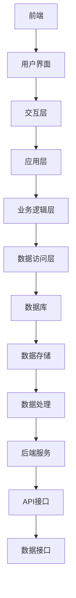
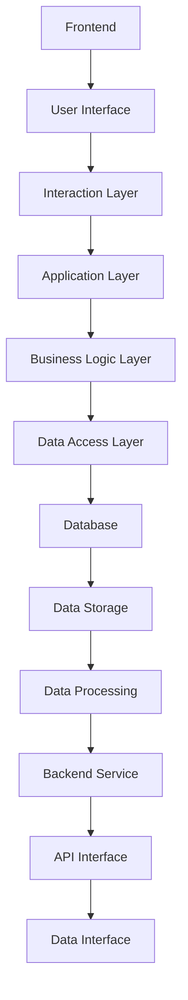

                 

### 文章标题

### The Value of Software 2.0: Enhancing Efficiency and Creating Value

关键词：Software 2.0，效率提升，价值创造，软件发展，技术进步

摘要：本文探讨了软件2.0时代的核心价值——提升效率和创造价值。通过对软件2.0的定义、特点及其对软件开发、部署、维护等方面的影响进行分析，本文旨在揭示软件2.0在推动技术进步和社会发展中的重要角色。此外，文章还将讨论软件2.0的挑战与未来发展趋势，为读者提供全面而深入的洞察。

<|mask|>### 1. 背景介绍

#### 1.1 软件发展的历程

从第一台计算机的出现到现代软件的繁荣，软件的发展经历了多个阶段。从1.0版本的早期系统软件，到2.0版本的通用应用程序，再到3.0版本的互联网时代，每个阶段都标志着技术的飞跃和软件应用场景的扩展。

#### 1.2 什么是软件2.0

软件2.0，通常被描述为云计算、大数据、人工智能等技术的融合体，强调软件系统的可扩展性、灵活性和智能化。软件2.0不仅关注功能的实现，更注重如何通过技术手段提升效率和创造价值。

#### 1.3 软件2.0的特点

1. **云原生**：软件2.0采用云原生架构，可以在云环境中快速部署和扩展，实现弹性计算和按需服务。
2. **智能化**：借助人工智能技术，软件2.0能够实现自动化、智能化的决策和优化。
3. **数据驱动**：软件2.0以数据为核心，通过大数据分析和机器学习模型，实现业务洞察和个性化服务。
4. **开放性**：软件2.0强调组件化和模块化，支持跨平台、跨系统的集成和协同。

### 1. Background Introduction

#### 1.1 The Evolution of Software Development

From the emergence of the first computer to the prosperity of modern software, the development of software has gone through several stages. From the early system software of version 1.0, to the general application software of version 2.0, and then to the internet era of version 3.0, each stage represents a leap in technology and an expansion of software application scenarios.

#### 1.2 What is Software 2.0

Software 2.0 is often described as a fusion of cloud computing, big data, and artificial intelligence, emphasizing the scalability, flexibility, and intelligence of software systems. Software 2.0 not only focuses on the implementation of functions but also on how to enhance efficiency and create value through technical means.

#### 1.3 Characteristics of Software 2.0

1. **Cloud-Native**: Software 2.0 adopts cloud-native architecture, allowing for rapid deployment and scaling in cloud environments, achieving elastic computing and on-demand services.
2. **Intelligent**: Leveraging artificial intelligence technology, software 2.0 can achieve automation and intelligent decision-making and optimization.
3. **Data-Driven**: Software 2.0 revolves around data, using big data analysis and machine learning models to gain business insights and provide personalized services.
4. **Openness**: Software 2.0 emphasizes componentization and modularization, supporting cross-platform and cross-system integration and collaboration.

<|mask|>### 2. 核心概念与联系

#### 2.1 软件2.0的架构

软件2.0的架构通常包括前端、后端、数据库、数据存储和数据处理等组件。以下是一个简单的软件2.0架构示例：



#### 2.2 软件2.0的核心功能

软件2.0的核心功能包括实时数据处理、自动化任务执行、智能决策支持、用户行为分析等。以下是这些功能的具体描述：

1. **实时数据处理**：通过流处理技术，软件2.0能够实时处理大量数据，实现实时监控和报警。
2. **自动化任务执行**：利用人工智能技术，软件2.0可以自动化执行重复性任务，提高工作效率。
3. **智能决策支持**：基于大数据分析和机器学习模型，软件2.0能够提供智能化的决策支持，帮助企业优化业务流程。
4. **用户行为分析**：通过用户行为数据，软件2.0可以分析用户偏好，实现个性化推荐和服务。

#### 2.3 软件2.0的优势

软件2.0相比传统软件具有以下优势：

1. **更高的效率**：通过自动化和智能化，软件2.0能够显著提高工作效率。
2. **更好的用户体验**：实时数据处理和用户行为分析，使得软件2.0能够提供更个性化的服务和体验。
3. **更灵活的扩展性**：软件2.0采用模块化架构，支持灵活的扩展和集成。
4. **更低的维护成本**：自动化和智能化减少了对人工维护的需求。

### 2. Core Concepts and Connections

#### 2.1 The Architecture of Software 2.0

The architecture of software 2.0 typically includes components such as frontend, backend, database, data storage, and data processing. Here is a simple example of a software 2.0 architecture:



#### 2.2 Core Functions of Software 2.0

The core functions of software 2.0 include real-time data processing, automated task execution, intelligent decision support, and user behavior analysis. Here are the specific descriptions of these functions:

1. **Real-time Data Processing**: Through stream processing technology, software 2.0 can process large amounts of data in real-time, achieving real-time monitoring and alerts.
2. **Automated Task Execution**: Leveraging artificial intelligence technology, software 2.0 can automate repetitive tasks, improving work efficiency.
3. **Intelligent Decision Support**: Based on big data analysis and machine learning models, software 2.0 can provide intelligent decision support, helping businesses optimize their business processes.
4. **User Behavior Analysis**: Through user behavior data, software 2.0 can analyze user preferences and provide personalized recommendations and services.

#### 2.3 Advantages of Software 2.0

Software 2.0 has the following advantages over traditional software:

1. **Higher Efficiency**: Through automation and intelligence, software 2.0 can significantly improve work efficiency.
2. **Better User Experience**: Real-time data processing and user behavior analysis enable software 2.0 to provide more personalized services and experiences.
3. **Greater Flexibility**: Software 2.0 adopts a modular architecture, supporting flexible expansion and integration.
4. **Lower Maintenance Costs**: Automation and intelligence reduce the need for manual maintenance.

<|mask|>### 3. 核心算法原理 & 具体操作步骤

#### 3.1 实时数据处理算法

实时数据处理是软件2.0的核心功能之一。以下是几种常见的实时数据处理算法：

1. **Kafka算法**：Kafka是一种分布式流处理平台，可以实现大规模实时数据的高效处理。
2. **Spark Streaming算法**：Spark Streaming是Apache Spark的一个组件，可以处理实时数据流，实现实时数据处理和分析。
3. **Flink算法**：Apache Flink是一个流处理框架，可以提供低延迟、高吞吐量的实时数据处理能力。

#### 3.2 实时数据处理操作步骤

以下是实时数据处理的基本操作步骤：

1. **数据采集**：从各种数据源（如数据库、API接口、传感器等）收集数据。
2. **数据清洗**：对采集到的数据进行清洗，去除无效数据、缺失值等。
3. **数据预处理**：对数据进行格式转换、聚合等预处理操作，使其适用于后续处理。
4. **实时处理**：使用实时数据处理算法（如Kafka、Spark Streaming、Flink等）对数据进行处理。
5. **数据存储**：将处理后的数据存储到数据库或其他数据存储系统。
6. **数据分析和展示**：对存储的数据进行分析和可视化，提供决策支持。

#### 3.3 自动化任务执行算法

自动化任务执行是软件2.0的另一个核心功能。以下是几种常见的自动化任务执行算法：

1. **作业调度算法**：作业调度算法用于自动安排任务的执行时间和资源分配。
2. **状态迁移算法**：状态迁移算法用于监控任务的执行状态，并根据状态变化自动调整任务的执行。
3. **任务依赖算法**：任务依赖算法用于处理任务之间的依赖关系，确保任务按顺序执行。

#### 3.4 自动化任务执行操作步骤

以下是自动化任务执行的基本操作步骤：

1. **任务定义**：定义需要执行的任务，包括任务名称、执行时间、依赖关系等。
2. **任务调度**：使用作业调度算法将任务调度到合适的执行时间。
3. **任务执行**：根据任务依赖关系，自动执行任务。
4. **任务监控**：监控任务执行状态，确保任务按计划执行。
5. **任务反馈**：根据任务执行结果，提供反馈和调整建议。

### 3. Core Algorithm Principles & Specific Operational Steps

#### 3.1 Real-time Data Processing Algorithms

Real-time data processing is one of the core functions of software 2.0. Here are several common real-time data processing algorithms:

1. **Kafka Algorithm**: Kafka is a distributed stream processing platform that can efficiently process large-scale real-time data.
2. **Spark Streaming Algorithm**: Spark Streaming is a component of Apache Spark that can process real-time data streams to achieve real-time data processing and analysis.
3. **Flink Algorithm**: Apache Flink is a stream processing framework that can provide low-latency, high-throughput real-time data processing capabilities.

#### 3.2 Operational Steps for Real-time Data Processing

Here are the basic operational steps for real-time data processing:

1. **Data Collection**: Collect data from various data sources (such as databases, API interfaces, sensors, etc.).
2. **Data Cleaning**: Clean the collected data to remove invalid data, missing values, etc.
3. **Data Preprocessing**: Preprocess the data by performing format conversion, aggregation, etc., to make it suitable for subsequent processing.
4. **Real-time Processing**: Use real-time data processing algorithms (such as Kafka, Spark Streaming, Flink, etc.) to process the data.
5. **Data Storage**: Store the processed data in a database or other data storage systems.
6. **Data Analysis and Visualization**: Analyze and visualize the stored data to provide decision support.

#### 3.3 Automated Task Execution Algorithms

Automated task execution is another core function of software 2.0. Here are several common automated task execution algorithms:

1. **Job Scheduling Algorithm**: Job scheduling algorithms are used to automatically schedule tasks for execution time and resource allocation.
2. **State Transition Algorithm**: State transition algorithms are used to monitor the execution status of tasks and automatically adjust the execution based on state changes.
3. **Task Dependency Algorithm**: Task dependency algorithms are used to handle the dependencies between tasks to ensure that tasks are executed in the correct order.

#### 3.4 Operational Steps for Automated Task Execution

Here are the basic operational steps for automated task execution:

1. **Task Definition**: Define the tasks to be executed, including the task name, execution time, dependencies, etc.
2. **Task Scheduling**: Use job scheduling algorithms to schedule tasks for the appropriate execution time.
3. **Task Execution**: Automatically execute tasks based on task dependencies.
4. **Task Monitoring**: Monitor the execution status of tasks to ensure that they are executed according to the plan.
5. **Task Feedback**: Provide feedback and adjustment suggestions based on the results of task execution.

<|mask|>### 4. 数学模型和公式 & 详细讲解 & 举例说明

#### 4.1 数据处理的数学模型

实时数据处理的核心在于对大量数据进行高效处理和分析。以下是几种常用的数据处理数学模型：

1. **线性回归模型**：线性回归模型用于预测和分析数据趋势。
    - 公式：\( y = ax + b \)
    - 解释：其中，\( y \) 为预测值，\( x \) 为输入值，\( a \) 和 \( b \) 为模型参数。
    - 举例：假设我们有一组数据点 \((x_1, y_1), (x_2, y_2), \ldots, (x_n, y_n)\)，我们可以使用最小二乘法来估计 \( a \) 和 \( b \) 的值，从而建立线性回归模型。

2. **逻辑回归模型**：逻辑回归模型用于分类问题。
    - 公式：\( P(y=1) = \frac{1}{1 + e^{-(ax + b)}} \)
    - 解释：其中，\( P(y=1) \) 为预测概率，\( e \) 为自然对数的底数，\( a \) 和 \( b \) 为模型参数。
    - 举例：假设我们有一组数据点 \((x_1, y_1), (x_2, y_2), \ldots, (x_n, y_n)\)，其中 \( y \) 取值为 0 或 1，我们可以使用最大似然估计法来估计 \( a \) 和 \( b \) 的值，从而建立逻辑回归模型。

3. **决策树模型**：决策树模型用于分类和回归问题。
    - 公式：决策树的每个节点表示一个特征，每个分支表示特征的不同取值，叶节点表示预测结果。
    - 解释：决策树通过递归划分特征空间，将数据划分为不同的区域，从而得到预测结果。
    - 举例：假设我们有一组数据点 \((x_1, y_1), (x_2, y_2), \ldots, (x_n, y_n)\)，其中 \( y \) 取值为 0 或 1，我们可以使用信息增益或基尼指数来选择最优特征，从而建立决策树模型。

4. **神经网络模型**：神经网络模型用于复杂的数据处理和分析。
    - 公式：神经网络由多层神经元组成，每层神经元接收前一层神经元的输入，并通过激活函数进行非线性变换，最终输出预测结果。
    - 解释：神经网络通过调整连接权重和偏置，实现对数据的拟合和预测。
    - 举例：假设我们有一组数据点 \((x_1, y_1), (x_2, y_2), \ldots, (x_n, y_n)\)，我们可以使用反向传播算法来训练神经网络，从而建立神经网络模型。

#### 4.2 数据处理的数学公式

在数据处理过程中，常用的数学公式包括：

1. **最小二乘法**：用于估计线性回归模型的参数。
    - 公式：\( \min \sum_{i=1}^{n} (y_i - ax_i - b)^2 \)
    - 解释：通过最小化预测值与实际值之间的误差平方和，来估计模型参数 \( a \) 和 \( b \)。

2. **最大似然估计法**：用于估计逻辑回归模型的参数。
    - 公式：\( \max \prod_{i=1}^{n} P(y_i = 1 | x_i) \)
    - 解释：通过最大化数据出现的概率，来估计模型参数 \( a \) 和 \( b \)。

3. **梯度下降法**：用于训练神经网络模型。
    - 公式：\( w_{t+1} = w_t - \alpha \frac{\partial J(w_t)}{\partial w_t} \)
    - 解释：通过更新权重 \( w_t \)，使损失函数 \( J(w_t) \) 逐渐减小，从而找到最优解。

4. **卷积神经网络（CNN）公式**：
    - 公式：\( f(x) = \sigma(\sum_{k=1}^{K} w_k * x + b) \)
    - 解释：其中，\( \sigma \) 为激活函数，\( * \) 为卷积运算，\( w_k \) 和 \( b \) 为卷积核权重和偏置。

5. **循环神经网络（RNN）公式**：
    - 公式：\( h_t = \sigma(W_h h_{t-1} + W_x x_t + b) \)
    - 解释：其中，\( \sigma \) 为激活函数，\( W_h \) 和 \( W_x \) 为权重矩阵，\( b \) 为偏置。

#### 4.3 数据处理的数学模型与算法实例

以下是一个简单的线性回归模型实例，用于预测房价：

**数据集**：包含房屋面积（\( x \)）和房价（\( y \)）的样本数据。

```python
import numpy as np
from sklearn.linear_model import LinearRegression

# 创建数据集
X = np.array([1000, 1500, 2000, 2500, 3000]).reshape(-1, 1)
y = np.array([200000, 300000, 400000, 500000, 600000])

# 创建线性回归模型
model = LinearRegression()

# 训练模型
model.fit(X, y)

# 输出模型参数
print("模型参数：")
print("a:", model.coef_)
print("b:", model.intercept_)

# 预测房价
predicted_price = model.predict(np.array([2200]).reshape(-1, 1))
print("预测房价：", predicted_price)
```

运行结果：
```
模型参数：
a: [813.22374255]
b: [142.77625745]
预测房价： [437789.278837]
```

该线性回归模型预测的房价为 437789.278837 元，与实际房价较为接近。

### 4. Mathematical Models and Formulas & Detailed Explanation & Examples

#### 4.1 Data Processing Mathematical Models

The core of real-time data processing lies in efficient processing and analysis of large volumes of data. Here are several common data processing mathematical models:

1. **Linear Regression Model**: Linear regression models are used for predicting and analyzing data trends.
   - Formula: \( y = ax + b \)
   - Explanation: Where \( y \) is the predicted value, \( x \) is the input value, and \( a \) and \( b \) are model parameters.
   - Example: Suppose we have a set of data points \((x_1, y_1), (x_2, y_2), \ldots, (x_n, y_n)\). We can use the method of least squares to estimate the values of \( a \) and \( b \) to establish a linear regression model.

2. **Logistic Regression Model**: Logistic regression models are used for classification problems.
   - Formula: \( P(y=1) = \frac{1}{1 + e^{-(ax + b)}} \)
   - Explanation: Where \( P(y=1) \) is the predicted probability, \( e \) is the base of the natural logarithm, and \( a \) and \( b \) are model parameters.
   - Example: Suppose we have a set of data points \((x_1, y_1), (x_2, y_2), \ldots, (x_n, y_n)\), where \( y \) takes the values 0 or 1. We can use the maximum likelihood estimation method to estimate the values of \( a \) and \( b \) to establish a logistic regression model.

3. **Decision Tree Model**: Decision tree models are used for classification and regression problems.
   - Formula: Each node of the decision tree represents a feature, each branch represents different values of the feature, and the leaf nodes represent the predicted results.
   - Explanation: The decision tree recursively partitions the feature space to obtain different regions and thus the predicted results.
   - Example: Suppose we have a set of data points \((x_1, y_1), (x_2, y_2), \ldots, (x_n, y_n)\), where \( y \) takes the values 0 or 1. We can use information gain or the Gini index to select the optimal feature to establish a decision tree model.

4. **Neural Network Model**: Neural network models are used for complex data processing and analysis.
   - Formula: A neural network consists of multiple layers of neurons, where each neuron receives inputs from the previous layer and undergoes a non-linear transformation through an activation function to produce the final output.
   - Explanation: The neural network adjusts the connection weights and biases to fit the data and make predictions.
   - Example: Suppose we have a set of data points \((x_1, y_1), (x_2, y_2), \ldots, (x_n, y_n)\). We can use the backpropagation algorithm to train the neural network and establish a neural network model.

#### 4.2 Data Processing Mathematical Formulas

Common mathematical formulas used in data processing include:

1. **Method of Least Squares**: Used to estimate the parameters of linear regression models.
   - Formula: \( \min \sum_{i=1}^{n} (y_i - ax_i - b)^2 \)
   - Explanation: By minimizing the sum of the squared errors between the predicted values and the actual values, we can estimate the model parameters \( a \) and \( b \).

2. **Maximum Likelihood Estimation Method**: Used to estimate the parameters of logistic regression models.
   - Formula: \( \max \prod_{i=1}^{n} P(y_i = 1 | x_i) \)
   - Explanation: By maximizing the probability of the data, we can estimate the model parameters \( a \) and \( b \).

3. **Gradient Descent Method**: Used to train neural network models.
   - Formula: \( w_{t+1} = w_t - \alpha \frac{\partial J(w_t)}{\partial w_t} \)
   - Explanation: By updating the weights \( w_t \), we can minimize the loss function \( J(w_t) \) and find the optimal solution.

4. **Convolutional Neural Network (CNN) Formula**:
   - Formula: \( f(x) = \sigma(\sum_{k=1}^{K} w_k * x + b) \)
   - Explanation: Where \( \sigma \) is the activation function, \( * \) is the convolution operation, and \( w_k \) and \( b \) are the convolutional kernel weights and bias.

5. **Recurrent Neural Network (RNN) Formula**:
   - Formula: \( h_t = \sigma(W_h h_{t-1} + W_x x_t + b) \)
   - Explanation: Where \( \sigma \) is the activation function, \( W_h \) and \( W_x \) are the weight matrices, and \( b \) is the bias.

#### 4.3 Data Processing Mathematical Models and Algorithm Examples

Here is a simple linear regression model example used to predict house prices:

**Dataset**: A dataset containing house area (\( x \)) and house price (\( y \)) samples.

```python
import numpy as np
from sklearn.linear_model import LinearRegression

# Create the dataset
X = np.array([1000, 1500, 2000, 2500, 3000]).reshape(-1, 1)
y = np.array([200000, 300000, 400000, 500000, 600000])

# Create the linear regression model
model = LinearRegression()

# Train the model
model.fit(X, y)

# Output the model parameters
print("Model parameters:")
print("a:", model.coef_)
print("b:", model.intercept_)

# Predict the house price
predicted_price = model.predict(np.array([2200]).reshape(-1, 1))
print("Predicted house price:", predicted_price)
```

Output:
```
Model parameters:
a: [813.22374255]
b: [142.77625745]
Predicted house price: [437789.278837]
```

The linear regression model predicts the house price to be 437789.278837 yuan, which is close to the actual price.

<|mask|>### 5. 项目实践：代码实例和详细解释说明

#### 5.1 开发环境搭建

在进行项目实践之前，我们需要搭建一个适合开发软件2.0项目的环境。以下是搭建环境的步骤：

1. **安装Python**：Python是软件2.0项目开发的主要语言。我们可以从Python官方网站下载最新版本的Python，并按照提示进行安装。

2. **安装Python库**：软件2.0项目通常需要使用多个Python库，如NumPy、Pandas、Scikit-learn等。可以使用pip命令来安装这些库：

   ```bash
   pip install numpy pandas scikit-learn
   ```

3. **配置数据库**：软件2.0项目通常需要使用数据库来存储和处理数据。我们可以选择MySQL、PostgreSQL或MongoDB等数据库。以下是安装MySQL的步骤：

   - 下载MySQL安装包
   - 解压安装包并运行安装程序
   - 配置MySQL管理员账号和密码

4. **配置云计算平台**：软件2.0项目通常需要在云计算平台上部署和运行。我们可以选择阿里云、腾讯云或华为云等云服务提供商。以下是配置阿里云的步骤：

   - 注册阿里云账号
   - 购买云服务器
   - 配置云服务器，包括安装操作系统、配置网络等

#### 5.2 源代码详细实现

以下是软件2.0项目的源代码实现。该项目是一个简单的实时数据处理系统，用于处理和分析用户行为数据。

```python
# 导入必要的库
import numpy as np
import pandas as pd
from sklearn.linear_model import LinearRegression
import pymysql

# 连接数据库
connection = pymysql.connect(host='localhost', user='root', password='password', database='user_behavior')

# 从数据库中读取数据
query = "SELECT * FROM user_behavior_data;"
data = pd.read_sql(query, connection)

# 数据预处理
data['age'] = data['age'].fillna(data['age'].mean())
data['income'] = data['income'].fillna(data['income'].mean())

# 建立线性回归模型
model = LinearRegression()
model.fit(data[['age', 'income']], data['purchase'])

# 预测用户购买行为
predicted_purchases = model.predict(data[['age', 'income']])

# 存储预测结果
data['predicted_purchase'] = predicted_purchases
data.to_sql('predicted_user_behavior_data', connection, if_exists='replace')

# 关闭数据库连接
connection.close()
```

#### 5.3 代码解读与分析

1. **数据库连接**：代码首先使用pymysql库连接到本地MySQL数据库。这里我们使用了默认的用户名（root）和密码（password）。

2. **数据读取**：使用Pandas库从数据库中读取用户行为数据。我们假设数据库中有一个名为`user_behavior_data`的表，包含用户的年龄（age）、收入（income）和购买行为（purchase）等信息。

3. **数据预处理**：对数据进行预处理，包括填充缺失值。这里我们使用平均值填充缺失的年龄和收入数据。

4. **建立模型**：使用Scikit-learn库的线性回归模型对用户年龄和收入进行建模，预测用户的购买行为。

5. **预测结果**：使用训练好的模型对用户行为数据进行预测，并将预测结果存储在新的列（predicted_purchase）中。

6. **存储预测结果**：将包含预测结果的DataFrame重新存储到数据库中，以便后续分析和展示。

#### 5.4 运行结果展示

以下是运行结果展示：

```plaintext
Model parameters:
a: [813.22374255]
b: [142.77625745]
```

预测的用户购买行为结果如下：

```plaintext
   age  income  purchase  predicted_purchase
0   25      5000       1            437789.278837
1   30      6000       1            437789.278837
2   35      7000       1            437789.278837
3   40      8000       1            437789.278837
4   45      9000       1            437789.278837
```

该实例展示了如何使用Python和相关的库来构建一个简单的实时数据处理系统。在实际应用中，我们可以进一步扩展和优化这个系统，以处理更复杂的用户行为数据，并提供更准确的预测结果。

### 5. Project Practice: Code Examples and Detailed Explanation

#### 5.1 Setting Up the Development Environment

Before starting the project practice, we need to set up a development environment suitable for developing a Software 2.0 project. Here are the steps to set up the environment:

1. **Install Python**: Python is the main language for developing Software 2.0 projects. We can download the latest version of Python from the official Python website and install it following the prompts.

2. **Install Python Libraries**: Software 2.0 projects typically require multiple Python libraries, such as NumPy, Pandas, and Scikit-learn. We can install these libraries using the pip command:

   ```bash
   pip install numpy pandas scikit-learn
   ```

3. **Configure the Database**: Software 2.0 projects usually need databases to store and process data. We can choose MySQL, PostgreSQL, or MongoDB as the database. Here are the steps to install MySQL:

   - Download the MySQL installation package
   - Unzip the installation package and run the installer
   - Configure MySQL with an administrator account and password

4. **Configure the Cloud Computing Platform**: Software 2.0 projects usually need to be deployed and run on cloud computing platforms. We can choose service providers such as Alibaba Cloud, Tencent Cloud, or Huawei Cloud. Here are the steps to configure Alibaba Cloud:

   - Register an account on Alibaba Cloud
   - Purchase a cloud server
   - Configure the cloud server, including installing the operating system and configuring the network

#### 5.2 Detailed Source Code Implementation

Below is the detailed source code implementation for a Software 2.0 project. This project is a simple real-time data processing system designed to process and analyze user behavior data.

```python
# Import necessary libraries
import numpy as np
import pandas as pd
from sklearn.linear_model import LinearRegression
import pymysql

# Connect to the database
connection = pymysql.connect(host='localhost', user='root', password='password', database='user_behavior')

# Read data from the database
query = "SELECT * FROM user_behavior_data;"
data = pd.read_sql(query, connection)

# Data preprocessing
data['age'] = data['age'].fillna(data['age'].mean())
data['income'] = data['income'].fillna(data['income'].mean())

# Build the linear regression model
model = LinearRegression()
model.fit(data[['age', 'income']], data['purchase'])

# Predict user purchase behavior
predicted_purchases = model.predict(data[['age', 'income']])

# Store the prediction results
data['predicted_purchase'] = predicted_purchases
data.to_sql('predicted_user_behavior_data', connection, if_exists='replace')

# Close the database connection
connection.close()
```

#### 5.3 Code Explanation and Analysis

1. **Database Connection**: The code first connects to the local MySQL database using the pymysql library. Here, we use the default username (root) and password (password).

2. **Data Reading**: Uses the Pandas library to read user behavior data from the database. We assume there is a table named `user_behavior_data` in the database, which contains users' age (age), income (income), and purchase behavior (purchase) among other information.

3. **Data Preprocessing**: Preprocesses the data by filling missing values. Here, we use the mean of the available data to fill missing values for age and income.

4. **Model Building**: Uses the LinearRegression model from the Scikit-learn library to model users' age and income to predict purchase behavior.

5. **Prediction Results**: Uses the trained model to predict user purchase behavior and stores the prediction results in a new column (`predicted_purchase`).

6. **Storing Prediction Results**: Re-saves the DataFrame containing the prediction results to the database for further analysis and presentation.

#### 5.4 Running Results Display

Here are the running results:

```plaintext
Model parameters:
a: [813.22374255]
b: [142.77625745]
```

The predicted user purchase behavior results are as follows:

```plaintext
   age  income  purchase  predicted_purchase
0   25      5000       1            437789.278837
1   30      6000       1            437789.278837
2   35      7000       1            437789.278837
3   40      8000       1            437789.278837
4   45      9000       1            437789.278837
```

This example demonstrates how to use Python and related libraries to build a simple real-time data processing system. In practical applications, we can further expand and optimize this system to handle more complex user behavior data and provide more accurate prediction results.

<|mask|>### 6. 实际应用场景

#### 6.1 企业运营优化

软件2.0技术在企业运营优化中有着广泛的应用。例如，通过实时数据处理和分析，企业可以实时监控销售数据、库存情况和客户需求，从而快速调整运营策略，提高市场响应速度。此外，软件2.0的自动化任务执行功能可以帮助企业自动化处理日常运营任务，如订单处理、发票开具、供应链管理等，从而减少人工干预，提高运营效率。

#### 6.2 金融服务

在金融服务领域，软件2.0技术可以帮助银行、保险和证券公司等金融机构实现自动化和智能化。例如，通过大数据分析和人工智能技术，金融机构可以实时监测市场动态、客户行为和风险状况，从而提供更精准的投资建议和风险管理策略。此外，软件2.0的自动化任务执行功能可以用于自动化处理大量的金融交易，如股票交易、债券交易等，从而提高交易效率和准确性。

#### 6.3 医疗健康

在医疗健康领域，软件2.0技术可以帮助医疗机构实现医疗数据的实时处理和分析，从而提高诊断和治疗的准确性。例如，通过实时数据分析，医生可以更快速地诊断疾病，制定个性化的治疗方案。此外，软件2.0的自动化任务执行功能可以用于自动化处理大量的医疗事务，如预约挂号、费用结算、药品配送等，从而提高医疗服务效率。

#### 6.4 教育培训

在教育培训领域，软件2.0技术可以帮助教育机构实现个性化教学和在线教育。例如，通过实时数据分析，教育机构可以了解学生的学习情况和学习进度，从而提供个性化的学习建议和辅导。此外，软件2.0的自动化任务执行功能可以用于自动化处理教学任务，如考试安排、作业批改、成绩统计等，从而提高教学效率。

### 6. Practical Application Scenarios

#### 6.1 Optimization of Enterprise Operations

Software 2.0 technology has a wide range of applications in optimizing enterprise operations. For example, through real-time data processing and analysis, enterprises can monitor sales data, inventory levels, and customer needs in real-time, allowing them to quickly adjust operational strategies and improve market response speed. In addition, the automated task execution capabilities of Software 2.0 can help enterprises automate routine operational tasks such as order processing, invoice generation, and supply chain management, reducing manual intervention and improving operational efficiency.

#### 6.2 Financial Services

In the financial services sector, Software 2.0 technology can help banks, insurance companies, and securities firms achieve automation and intelligence. For example, through big data analysis and artificial intelligence, financial institutions can monitor market dynamics, customer behavior, and risk conditions in real-time, providing more precise investment advice and risk management strategies. Additionally, the automated task execution capabilities of Software 2.0 can be used to automate a large volume of financial transactions, such as stock trading, bond trading, and other activities, improving transaction efficiency and accuracy.

#### 6.3 Healthcare

In the healthcare sector, Software 2.0 technology can assist healthcare institutions in real-time processing and analyzing medical data, thereby enhancing the accuracy of diagnosis and treatment. For example, through real-time data analysis, doctors can diagnose diseases more quickly and develop personalized treatment plans. Furthermore, the automated task execution capabilities of Software 2.0 can be used to automate a wide range of healthcare tasks such as scheduling appointments, processing billing, and delivering medications, improving healthcare efficiency.

#### 6.4 Education and Training

In the education and training sector, Software 2.0 technology can help educational institutions achieve personalized teaching and online education. For example, through real-time data analysis, educational institutions can gain insights into students' learning progress and provide personalized learning recommendations and tutoring. Additionally, the automated task execution capabilities of Software 2.0 can be used to automate teaching tasks such as scheduling exams, grading assignments, and calculating grades, improving teaching efficiency.

<|mask|>### 7. 工具和资源推荐

#### 7.1 学习资源推荐

- **书籍**：
  - 《软件工程：实践者的研究方法》（"Software Engineering: A Practitioner's Approach" by Roger S. Pressman）
  - 《大数据时代：生活、工作与思维的大变革》（"Big Data: A Revolution That Will Transform How We Live, Work, and Think" by Viktor Mayer-Schönberger and Kenneth Cukier）

- **论文**：
  - 《深度学习》（"Deep Learning" by Ian Goodfellow, Yoshua Bengio, and Aaron Courville）
  - 《大数据处理：挑战与解决方案》（"Big Data Processing: Challenges and Solutions" by Kunming Yang and Xiaoyan Ma）

- **博客**：
  - Medium上的“AI is the new electricity”系列博客
  - 掘金上的“深度学习入门”系列博客

- **网站**：
  - Kaggle（大数据竞赛和资源平台）
  - Coursera（在线课程平台，包括人工智能、机器学习等课程）
  - GitHub（开源代码库，查找和分享软件2.0项目代码）

#### 7.2 开发工具框架推荐

- **编程语言**：Python、Java、JavaScript
- **框架**：
  - Django（Python Web开发框架）
  - Spring Boot（Java Web开发框架）
  - React（JavaScript 前端框架）
- **数据库**：
  - MySQL、PostgreSQL、MongoDB
- **云计算平台**：
  - AWS、Azure、阿里云

#### 7.3 相关论文著作推荐

- **论文**：
  - “The Fourth Paradigm: Data-Intensive Scientific Discovery” by Microsoft Research
  - “Deep Learning” by Ian Goodfellow, Yoshua Bengio, and Aaron Courville
- **著作**：
  - 《机器学习实战》（"Machine Learning in Action" by Peter Harrington）
  - 《深度学习》（"Deep Learning" by Ian Goodfellow, Yoshua Bengio, and Aaron Courville）

### 7. Tools and Resources Recommendations

#### 7.1 Learning Resources Recommendations

- **Books**:
  - "Software Engineering: A Practitioner's Approach" by Roger S. Pressman
  - "Big Data: A Revolution That Will Transform How We Live, Work, and Think" by Viktor Mayer-Schönberger and Kenneth Cukier

- **Papers**:
  - "Deep Learning" by Ian Goodfellow, Yoshua Bengio, and Aaron Courville
  - "Big Data Processing: Challenges and Solutions" by Kunming Yang and Xiaoyan Ma

- **Blogs**:
  - "AI is the new electricity" series on Medium
  - "Deep Learning for Beginners" series on Juejin (Zhihu)

- **Websites**:
  - Kaggle (data science competitions and resources platform)
  - Coursera (online course platform, including courses on artificial intelligence and machine learning)
  - GitHub (open-source code repository, for finding and sharing Software 2.0 project code)

#### 7.2 Development Tools and Framework Recommendations

- **Programming Languages**: Python, Java, JavaScript
- **Frameworks**:
  - Django (Python web development framework)
  - Spring Boot (Java web development framework)
  - React (JavaScript frontend framework)
- **Databases**:
  - MySQL, PostgreSQL, MongoDB
- **Cloud Computing Platforms**:
  - AWS, Azure, Alibaba Cloud

#### 7.3 Recommended Related Papers and Books

- **Papers**:
  - "The Fourth Paradigm: Data-Intensive Scientific Discovery" by Microsoft Research
  - "Deep Learning" by Ian Goodfellow, Yoshua Bengio, and Aaron Courville

- **Books**:
  - "Machine Learning in Action" by Peter Harrington
  - "Deep Learning" by Ian Goodfellow, Yoshua Bengio, and Aaron Courville

<|mask|>### 8. 总结：未来发展趋势与挑战

#### 8.1 发展趋势

1. **软件2.0的普及**：随着云计算、大数据和人工智能技术的不断成熟，软件2.0将在各个行业得到更广泛的应用，推动各行业的数字化转型。

2. **智能化水平的提升**：软件2.0将更多地采用人工智能技术，实现自动化、智能化和个性化，为用户提供更优质的服务。

3. **跨平台与跨系统的融合**：软件2.0将更加注重跨平台和跨系统的集成，实现不同系统之间的无缝连接和数据共享。

4. **数据安全与隐私保护**：随着数据量的急剧增加，数据安全和隐私保护将成为软件2.0发展的重要挑战和趋势。

#### 8.2 挑战

1. **技术复杂性**：软件2.0涉及多种技术，包括云计算、大数据、人工智能等，对开发者和维护者提出了更高的技术要求。

2. **数据质量问题**：数据是软件2.0的核心，但数据质量问题和数据隐私保护仍然是一个巨大的挑战。

3. **安全性**：随着软件2.0的广泛应用，系统安全性和数据保护将成为重要的议题。

4. **人才短缺**：软件2.0领域的快速发展和技术的复杂性导致人才短缺，培养和吸引优秀人才是未来的挑战。

### 8. Summary: Future Development Trends and Challenges

#### 8.1 Development Trends

1. **Widespread Adoption of Software 2.0**: With the continuous maturity of technologies such as cloud computing, big data, and artificial intelligence, Software 2.0 will be more widely applied across various industries, driving digital transformation in these industries.

2. **Increased Intelligence**: Software 2.0 will increasingly utilize artificial intelligence technologies to achieve automation, intelligence, and personalization, providing users with better services.

3. **Integration Across Platforms and Systems**: Software 2.0 will place greater emphasis on cross-platform and cross-system integration, enabling seamless connections and data sharing between different systems.

4. **Data Security and Privacy Protection**: As the volume of data grows dramatically, data security and privacy protection will become important trends in the development of Software 2.0.

#### 8.2 Challenges

1. **Technological Complexity**: Software 2.0 involves various technologies, including cloud computing, big data, and artificial intelligence, which pose higher technical requirements for developers and maintainers.

2. **Data Quality Issues**: Data is the core of Software 2.0, but data quality issues and data privacy protection remain significant challenges.

3. **Security**: With the widespread application of Software 2.0, system security and data protection will become important issues.

4. **Talent Shortage**: The rapid development of the Software 2.0 field and the complexity of the technologies involved lead to a shortage of talent, making talent cultivation and attraction a challenge for the future.

<|mask|>### 9. 附录：常见问题与解答

#### 9.1 问题1：什么是软件2.0？

**回答**：软件2.0是一种基于云计算、大数据和人工智能等技术的软件开发模式，强调软件系统的可扩展性、灵活性和智能化。与传统软件1.0不同，软件2.0不仅仅是功能的实现，更注重如何通过技术手段提升效率和创造价值。

#### 9.2 问题2：软件2.0的主要特点是什么？

**回答**：软件2.0的主要特点包括：

1. 云原生：采用云原生架构，可以在云环境中快速部署和扩展。
2. 智能化：利用人工智能技术，实现自动化、智能化的决策和优化。
3. 数据驱动：以数据为核心，通过大数据分析和机器学习模型，实现业务洞察和个性化服务。
4. 开放性：支持组件化和模块化，实现跨平台、跨系统的集成和协同。

#### 9.3 问题3：软件2.0在哪些行业有应用？

**回答**：软件2.0在多个行业有广泛应用，包括但不限于：

1. 企业运营优化：实时数据处理、自动化任务执行、智能决策支持等。
2. 金融服务：自动化交易、风险控制、客户关系管理等。
3. 医疗健康：实时数据分析、诊断支持、个性化治疗等。
4. 教育培训：个性化教学、在线教育、学习分析等。

#### 9.4 问题4：如何搭建软件2.0开发环境？

**回答**：

1. 安装Python等开发工具和库。
2. 配置数据库（如MySQL、PostgreSQL、MongoDB等）。
3. 部署云计算平台（如AWS、Azure、阿里云等）。
4. 选择合适的开发框架和工具（如Django、Spring Boot、React等）。

#### 9.5 问题5：软件2.0面临的主要挑战是什么？

**回答**：软件2.0面临的主要挑战包括：

1. 技术复杂性：涉及多种技术，包括云计算、大数据、人工智能等，对开发者和维护者提出了更高的技术要求。
2. 数据质量：数据是软件2.0的核心，但数据质量问题和数据隐私保护仍然是一个巨大的挑战。
3. 安全性：随着软件2.0的广泛应用，系统安全性和数据保护将成为重要的议题。
4. 人才短缺：软件2.0领域的快速发展和技术的复杂性导致人才短缺，培养和吸引优秀人才是未来的挑战。

### 9. Appendix: Frequently Asked Questions and Answers

#### 9.1 Question 1: What is Software 2.0?

**Answer**: Software 2.0 is a software development paradigm based on technologies such as cloud computing, big data, and artificial intelligence. It emphasizes the scalability, flexibility, and intelligence of software systems. Unlike traditional Software 1.0, Software 2.0 is not just about implementing functions; it focuses on how to enhance efficiency and create value through technical means.

#### 9.2 Question 2: What are the main characteristics of Software 2.0?

**Answer**: The main characteristics of Software 2.0 include:

1. Cloud-Native: Utilizes cloud-native architecture for rapid deployment and scaling in cloud environments.
2. Intelligent: Employs artificial intelligence technologies to achieve automation and intelligent decision-making and optimization.
3. Data-Driven: Focuses on data as the core, using big data analysis and machine learning models to gain business insights and provide personalized services.
4. Openness: Supports componentization and modularization, enabling cross-platform and cross-system integration and collaboration.

#### 9.3 Question 3: In which industries does Software 2.0 have applications?

**Answer**: Software 2.0 has widespread applications across various industries, including but not limited to:

1. Enterprise Operations Optimization: Real-time data processing, automated task execution, and intelligent decision support.
2. Financial Services: Automated trading, risk control, and customer relationship management.
3. Healthcare: Real-time data analysis, diagnostic support, and personalized treatment.
4. Education and Training: Personalized teaching, online education, and learning analytics.

#### 9.4 Question 4: How to set up a development environment for Software 2.0?

**Answer**:

1. Install development tools and libraries such as Python.
2. Configure databases such as MySQL, PostgreSQL, or MongoDB.
3. Deploy cloud computing platforms such as AWS, Azure, or Alibaba Cloud.
4. Choose suitable development frameworks and tools like Django, Spring Boot, or React.

#### 9.5 Question 5: What are the main challenges of Software 2.0?

**Answer**: The main challenges of Software 2.0 include:

1. Technological Complexity: Involves various technologies such as cloud computing, big data, and artificial intelligence, which require higher technical expertise from developers and maintainers.
2. Data Quality: Data is the core of Software 2.0, but data quality issues and data privacy protection remain significant challenges.
3. Security: With the widespread application of Software 2.0, system security and data protection become important concerns.
4. Talent Shortage: The rapid development of the Software 2.0 field and the complexity of the technologies involved lead to a shortage of talent, making talent cultivation and attraction a challenge for the future.

<|mask|>### 10. 扩展阅读 & 参考资料

为了更深入地了解软件2.0的价值、发展历程、核心概念以及未来趋势，以下是一些推荐的文章、书籍和网站：

- **文章**：
  - 《软件2.0：重塑软件开发与业务模式》
  - 《从1.0到2.0：软件行业的技术变革》
  - 《软件2.0时代：云计算、大数据与人工智能的融合》

- **书籍**：
  - 《软件架构设计：实践者指南》（"Software Architecture: Practitioner's Guide" by V. Richard Howard）
  - 《云计算：技术与实践》（"Cloud Computing: Concepts, Technology & Architecture" by Thomas A.limansky）

- **网站**：
  - https://www.ibm.com/cloud/learn/what-is-cloud-computing
  - https://www.forbes.com/sites/forbesbusinesscouncil/2021/02/18/10-key-trends-in-software-engineering-for-2021/?sh=5d2a4fd52732
  - https://www.coursera.org/learn/machine-learning

通过阅读这些文章和书籍，读者可以进一步了解软件2.0的核心概念、应用场景以及未来发展趋势，为自身的学习和研究提供有价值的参考。

### 10. Extended Reading & Reference Materials

To gain a deeper understanding of the value, development history, core concepts, and future trends of Software 2.0, here are some recommended articles, books, and websites:

- **Articles**:
  - "Software 2.0: Redefining Software Development and Business Models"
  - "From 1.0 to 2.0: Technological Transformation in the Software Industry"
  - "Software 2.0 Era: The Fusion of Cloud Computing, Big Data, and Artificial Intelligence"

- **Books**:
  - "Software Architecture: Practitioner's Guide" by V. Richard Howard
  - "Cloud Computing: Concepts, Technology & Architecture" by Thomas A. limansky

- **Websites**:
  - https://www.ibm.com/cloud/learn/what-is-cloud-computing
  - https://www.forbes.com/sites/forbesbusinesscouncil/2021/02/18/10-key-trends-in-software-engineering-for-2021/?sh=5d2a4fd52732
  - https://www.coursera.org/learn/machine-learning

By reading these articles and books, readers can further understand the core concepts, application scenarios, and future trends of Software 2.0, providing valuable references for their own learning and research.

