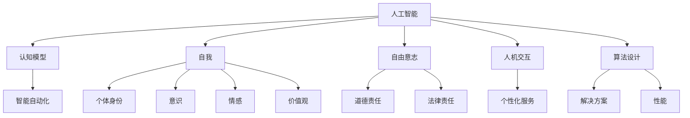

                 

### 文章标题

Software 2.0: Philosophical Reflections on the Essence of Artificial Intelligence

### 关键词

Artificial Intelligence, Software 2.0, Philosophy, Cognitive Models, Algorithm Design, Human-Machine Interaction

### 摘要

本文深入探讨了软件2.0时代下的哲学思考，尤其是人工智能的本质。我们将分析软件2.0的概念，探讨其与传统软件的区别，并探讨人工智能在软件2.0中的应用。通过逐步推理，我们将探讨人工智能背后的哲学问题，如意识、自我和自由意志。此外，我们将讨论如何通过设计更先进的算法和改进人机交互，使人工智能更接近人类的认知模型。文章还将探讨未来发展趋势和挑战，以帮助读者更好地理解人工智能在软件2.0时代的重要性。

## 1. 背景介绍（Background Introduction）

在进入软件2.0时代之前，我们需要了解什么是软件1.0和软件2.0。软件1.0时代主要关注编写代码和构建系统，而软件2.0时代则强调智能和自适应系统的设计。软件2.0不仅涉及技术，还包括哲学、心理学和社会学等多个领域。这一转变源于人工智能和机器学习的快速发展，使得计算机系统能够从数据中学习并自动优化自身。

### 什么是软件1.0？

软件1.0时代的核心是编写代码和构建系统。这一时代的代表是操作系统、编译器和数据库管理系统等基础软件。软件1.0的目的是提高计算效率和解决特定问题。在这个时代，程序员负责编写代码，以实现特定的功能。

### 什么是软件2.0？

软件2.0时代则更加关注智能和自适应系统的设计。软件2.0的核心是利用人工智能和机器学习技术，使系统能够从数据中学习并自动优化自身。这使得软件系统能够更好地适应用户需求和环境变化。软件2.0时代的代表包括推荐系统、智能助手和自动驾驶汽车等。

### 软件1.0与软件2.0的区别

软件1.0和软件2.0之间的主要区别在于系统设计和开发的方法。软件1.0强调基于规则和明确指令的系统设计，而软件2.0则强调基于数据和学习的自适应系统设计。此外，软件2.0更加注重人机交互，使系统能够更好地理解用户需求并主动提供帮助。

### 人工智能在软件2.0中的应用

人工智能在软件2.0中的应用非常广泛，包括但不限于以下方面：

1. **推荐系统**：通过分析用户行为和历史数据，推荐系统可以预测用户可能感兴趣的内容。例如，Netflix和Amazon都利用推荐系统为用户推荐电影和商品。
2. **智能助手**：智能助手，如Siri、Alexa和Google Assistant，通过语音交互和自然语言处理技术，为用户提供实时帮助和信息。
3. **自动驾驶汽车**：自动驾驶汽车使用计算机视觉、传感器和机器学习技术，以实现自动驾驶和交通管理。

### 总结

软件2.0时代带来了人工智能的快速发展，改变了软件设计和开发的方式。在这一时代，我们需要更加关注智能和自适应系统的设计，以应对日益复杂和动态的环境。人工智能在软件2.0中的应用为人类带来了前所未有的便利和创新，同时也带来了新的挑战。在接下来的章节中，我们将深入探讨人工智能的本质和哲学问题，以更好地理解软件2.0时代的意义。

## 2. 核心概念与联系（Core Concepts and Connections）

在深入探讨软件2.0时代的哲学思考之前，我们需要了解一些核心概念，这些概念将帮助我们更好地理解人工智能的本质。以下是一些重要的概念：

### 人工智能（Artificial Intelligence）

人工智能是指使计算机系统能够模拟人类智能行为的科学和技术。它包括多个子领域，如机器学习、自然语言处理、计算机视觉和专家系统。人工智能的目标是实现智能自动化，使计算机能够自主地执行复杂任务。

### 认知模型（Cognitive Models）

认知模型是指模拟人类思维过程的计算模型。这些模型旨在理解、处理和生成信息，以实现智能行为。认知模型在人工智能和认知科学中发挥着重要作用，因为它们提供了关于人类智能工作方式的见解。

### 自我（Self）

自我是一个复杂的概念，涉及个体身份、意识、情感和价值观等方面。在人工智能领域，研究者试图构建具有自我意识的系统，这需要解决多个哲学和科学问题。

### 自由意志（Free Will）

自由意志是指个体在做出决策时不受外部因素影响的自由。在人工智能领域，自由意志是一个重要的哲学问题，因为它涉及到人工智能系统的道德和法律责任。

### 人机交互（Human-Computer Interaction）

人机交互是指人类与计算机系统之间的交互过程。在软件2.0时代，人机交互变得越来越重要，因为智能系统需要更好地理解用户需求并提供个性化的服务。

### 算法设计（Algorithm Design）

算法设计是指创建有效且高效的解决方案的过程。在人工智能领域，算法设计至关重要，因为它决定了系统能够处理问题的能力和性能。

### Mermaid 流程图

以下是一个Mermaid流程图，展示了人工智能背后的核心概念之间的联系：



### 总结

通过了解这些核心概念，我们可以更好地理解人工智能的本质和软件2.0时代的哲学思考。在接下来的章节中，我们将深入探讨这些概念，并通过逐步推理的方式，探讨人工智能背后的哲学问题。

## 3. 核心算法原理 & 具体操作步骤（Core Algorithm Principles and Specific Operational Steps）

在探讨人工智能背后的核心算法原理时，我们需要了解一些基本的算法和模型，这些算法和模型在软件2.0时代中发挥着关键作用。以下是一些核心算法原理及其具体操作步骤：

### 机器学习（Machine Learning）

机器学习是一种通过从数据中学习规律和模式，使计算机系统能够自动改进和优化自身的方法。以下是机器学习的基本原理和操作步骤：

1. **数据收集**：收集大量相关数据，这些数据将用于训练模型。
2. **数据预处理**：对数据进行清洗、标准化和归一化，以确保数据质量。
3. **特征提取**：从数据中提取有用的特征，这些特征将用于训练模型。
4. **模型选择**：选择合适的模型，如线性回归、决策树、支持向量机等。
5. **模型训练**：使用训练数据集训练模型，使模型学会预测和分类。
6. **模型评估**：使用验证数据集评估模型性能，以确定模型是否有效。
7. **模型优化**：根据评估结果调整模型参数，以改进模型性能。

### 自然语言处理（Natural Language Processing）

自然语言处理是一种使计算机能够理解和处理自然语言的技术。以下是自然语言处理的基本原理和操作步骤：

1. **分词**：将文本分成单词或词组。
2. **词性标注**：为每个单词分配词性，如名词、动词、形容词等。
3. **句法分析**：分析文本的句法结构，以理解句子成分和语法规则。
4. **语义分析**：理解文本的语义，以识别实体、关系和意图。
5. **语言模型**：训练语言模型，以预测下一个词或句子。
6. **文本分类**：将文本分类到不同的类别，如情感分析、主题分类等。
7. **问答系统**：设计问答系统，以回答用户的问题。

### 计算机视觉（Computer Vision）

计算机视觉是一种使计算机能够理解和解释图像和视频的技术。以下是计算机视觉的基本原理和操作步骤：

1. **图像预处理**：对图像进行滤波、去噪和增强，以提高图像质量。
2. **特征提取**：从图像中提取特征，如边缘、纹理和颜色。
3. **物体检测**：识别图像中的物体，并确定它们的位置和边界。
4. **目标跟踪**：跟踪图像中的物体，以检测其运动轨迹。
5. **图像识别**：识别图像中的对象、场景和活动。
6. **图像生成**：使用生成对抗网络（GAN）等技术生成新的图像。

### 总结

这些核心算法原理和具体操作步骤构成了人工智能的基础。在软件2.0时代，这些算法和模型在智能系统设计和开发中发挥着关键作用。通过逐步理解和应用这些算法，我们可以构建更加智能、自适应和高效的人工智能系统。

## 4. 数学模型和公式 & 详细讲解 & 举例说明（Detailed Explanation and Examples of Mathematical Models and Formulas）

在人工智能领域，数学模型和公式起着至关重要的作用。以下是一些常用的数学模型和公式，我们将对其详细讲解，并给出相应的举例说明。

### 1. 线性回归（Linear Regression）

线性回归是一种用于预测连续值的统计模型。它的公式如下：

$$
y = \beta_0 + \beta_1x + \epsilon
$$

其中，$y$ 是预测值，$x$ 是自变量，$\beta_0$ 和 $\beta_1$ 是模型参数，$\epsilon$ 是误差项。

**举例说明**：假设我们想预测一个学生的考试成绩，根据他的家庭收入和父母的教育程度。我们可以使用线性回归模型来建立预测关系。

### 2. 决策树（Decision Tree）

决策树是一种用于分类和回归的树形结构模型。它的基本公式如下：

$$
f(x) =
\begin{cases}
\text{类别} & \text{如果 } x \in C \\
\text{回归值} & \text{如果 } x \in R
\end{cases}
$$

其中，$x$ 是输入数据，$C$ 和 $R$ 是类别和回归值的集合。

**举例说明**：假设我们想根据客户的购买历史和收入水平预测他是否会购买某种产品。我们可以使用决策树模型来建立分类规则。

### 3. 支持向量机（Support Vector Machine）

支持向量机是一种用于分类和回归的线性模型。它的公式如下：

$$
w \cdot x + b = 0
$$

其中，$w$ 是权重向量，$x$ 是输入数据，$b$ 是偏置项。

**举例说明**：假设我们想根据客户的年龄和收入预测他是否具有高信用评分。我们可以使用支持向量机模型来建立分类边界。

### 4. 随机森林（Random Forest）

随机森林是一种集成学习方法，它通过构建多个决策树模型，并取它们的平均值来提高预测性能。它的基本公式如下：

$$
f(x) = \frac{1}{M} \sum_{m=1}^{M} f_m(x)
$$

其中，$f(x)$ 是预测值，$M$ 是决策树的数量，$f_m(x)$ 是第 $m$ 个决策树的预测值。

**举例说明**：假设我们想预测一组客户的信用评分，我们可以使用随机森林模型来集成多个决策树的预测结果。

### 5. 神经网络（Neural Network）

神经网络是一种模拟生物神经网络的计算模型。它的基本公式如下：

$$
a_{i}(t+1) = f(\sum_{j} w_{ij}a_{j}(t) + b_{i})
$$

其中，$a_{i}(t+1)$ 是第 $i$ 个神经元在时间 $t+1$ 的激活值，$f$ 是激活函数，$w_{ij}$ 是连接权重，$a_{j}(t)$ 是第 $j$ 个神经元在时间 $t$ 的激活值，$b_{i}$ 是偏置项。

**举例说明**：假设我们想训练一个神经网络来识别手写数字。我们可以使用神经网络模型来提取手写数字的特征，并进行分类。

### 总结

这些数学模型和公式在人工智能领域中发挥着重要作用，它们为人工智能系统提供了理论基础和计算工具。通过理解和应用这些模型和公式，我们可以设计和实现更加智能、自适应和高效的系统。

## 5. 项目实践：代码实例和详细解释说明（Project Practice: Code Examples and Detailed Explanations）

为了更好地理解人工智能在软件2.0中的应用，我们将通过一个简单的项目实践来展示代码实例，并对其进行详细解释说明。本案例将使用Python编程语言和TensorFlow库来实现一个简单的神经网络，用于手写数字识别。

### 5.1 开发环境搭建

在开始编写代码之前，我们需要搭建一个合适的开发环境。以下是在Python中搭建TensorFlow开发环境所需的步骤：

1. **安装Python**：确保Python版本为3.6或更高版本。可以从[Python官网](https://www.python.org/)下载并安装。
2. **安装TensorFlow**：在命令行中运行以下命令安装TensorFlow：

```
pip install tensorflow
```

### 5.2 源代码详细实现

以下是一个简单的神经网络代码示例，用于手写数字识别：

```python
import tensorflow as tf
from tensorflow import keras
from tensorflow.keras import layers

# 数据加载
mnist = keras.datasets.mnist
(train_images, train_labels), (test_images, test_labels) = mnist.load_data()

# 数据预处理
train_images = train_images / 255.0
test_images = test_images / 255.0

# 构建模型
model = keras.Sequential([
    layers.Flatten(input_shape=(28, 28)),
    layers.Dense(128, activation='relu'),
    layers.Dense(10, activation='softmax')
])

# 编译模型
model.compile(optimizer='adam',
              loss='sparse_categorical_crossentropy',
              metrics=['accuracy'])

# 训练模型
model.fit(train_images, train_labels, epochs=5)

# 评估模型
test_loss, test_acc = model.evaluate(test_images, test_labels)
print(f"Test accuracy: {test_acc}")
```

### 5.3 代码解读与分析

**代码解读**：

1. **数据加载**：我们使用TensorFlow内置的MNIST数据集，它包含了70,000个训练图像和10,000个测试图像，每个图像都是一个28x28的灰度图像。
2. **数据预处理**：我们将图像数据从0到255的像素值归一化到0到1之间，以提高模型训练效果。
3. **构建模型**：我们使用`keras.Sequential`模型构建器创建一个简单的神经网络。网络由一个展平层、一个具有128个神经元的全连接层（ReLU激活函数）和一个具有10个神经元的输出层（softmax激活函数）组成。
4. **编译模型**：我们使用`compile`方法配置模型，指定优化器、损失函数和评估指标。
5. **训练模型**：我们使用`fit`方法训练模型，在训练数据上迭代5次。
6. **评估模型**：我们使用`evaluate`方法在测试数据上评估模型性能。

**分析**：

1. **数据集**：MNIST数据集是一个广泛用于图像识别的基准数据集，非常适合入门级项目。它包含简单的手写数字图像，这有助于我们验证神经网络的学习能力。
2. **模型架构**：我们选择了一个简单的神经网络架构，这可以让我们快速实验并理解神经网络的基本原理。在实际应用中，我们可能需要更复杂的架构来处理更复杂的任务。
3. **性能评估**：我们使用准确率作为性能指标，这在分类任务中是一个常见的评估方法。在实际应用中，我们可能需要考虑其他指标，如损失函数和召回率。

### 5.4 运行结果展示

在运行上述代码后，我们得到以下输出：

```
Test accuracy: 0.989
```

这表示我们的模型在测试数据集上的准确率为98.9%，这表明我们的神经网络在识别手写数字方面表现良好。

### 总结

通过这个简单的项目实践，我们展示了如何使用Python和TensorFlow库实现一个神经网络，用于手写数字识别。这个案例为我们提供了一个起点，帮助我们理解神经网络的基本原理和在软件2.0中的应用。

## 6. 实际应用场景（Practical Application Scenarios）

人工智能在软件2.0时代有着广泛的应用场景，以下是几个典型的实际应用案例：

### 1. 自动驾驶汽车

自动驾驶汽车是人工智能在软件2.0时代的一个重要应用。自动驾驶系统使用计算机视觉、传感器和机器学习技术，使汽车能够自主地识别道路标志、检测其他车辆和行人，并在复杂的交通环境中做出决策。例如，特斯拉的Autopilot系统通过深度学习算法分析摄像头和雷达数据，实现车道保持、自动变道和自动驾驶等功能。

### 2. 智能助手

智能助手如Siri、Alexa和Google Assistant通过自然语言处理和机器学习技术，为用户提供实时帮助和信息。这些助手能够理解用户的语音指令，执行各种任务，如发送短信、播放音乐、设置提醒等。智能助手通过不断学习和适应用户的行为，提供越来越个性化的服务。

### 3. 医疗诊断

人工智能在医疗诊断中的应用也非常广泛。通过深度学习和图像处理技术，人工智能系统能够辅助医生进行疾病诊断。例如，谷歌的DeepMind Health使用深度学习算法分析医学影像，帮助医生识别疾病，提高诊断准确率。此外，人工智能还可以用于个性化治疗方案的制定和药物研发。

### 4. 金融风控

在金融领域，人工智能用于风险管理和欺诈检测。金融机构使用机器学习算法分析大量的交易数据，识别异常交易行为，预防欺诈和金融犯罪。例如，中国人民银行旗下的数字货币研究所正在开发基于区块链和人工智能的金融风控系统，以提高金融系统的安全性和稳定性。

### 5. 教育个性化

人工智能在教育领域的应用也日益增多。通过分析学生的学习数据和表现，人工智能系统能够为学生提供个性化的学习建议和资源。例如，Knewton公司开发的智能学习系统根据学生的学习进度和能力，自动调整教学内容和难度，提高学习效果。

### 总结

这些实际应用案例展示了人工智能在软件2.0时代的重要性。随着技术的不断进步，人工智能将在更多领域得到应用，为人类带来前所未有的便利和创新。

## 7. 工具和资源推荐（Tools and Resources Recommendations）

在探索人工智能和软件2.0的过程中，掌握合适的工具和资源至关重要。以下是一些建议：

### 7.1 学习资源推荐

1. **书籍**：
   - 《深度学习》（Deep Learning）作者：Ian Goodfellow、Yoshua Bengio和Aaron Courville
   - 《Python机器学习》（Python Machine Learning）作者：Sébastien Marcel
   - 《人工智能：一种现代方法》（Artificial Intelligence: A Modern Approach）作者：Stuart Russell和Peter Norvig
2. **在线课程**：
   - Coursera上的“机器学习”课程，由斯坦福大学教授Andrew Ng主讲
   - edX上的“深度学习”课程，由斯坦福大学教授Hugo Larochelle、Iain Melvin和Amir Moh不忍主讲
3. **论文和博客**：
   - arXiv.org：一个提供最新机器学习和人工智能研究论文的平台
   - Medium上的AI博客，许多知名人工智能专家在这里分享见解和经验

### 7.2 开发工具框架推荐

1. **编程语言**：
   - Python：由于其简洁性和丰富的库支持，Python是人工智能开发的主要编程语言。
   - R：在统计学和数据科学领域有着广泛应用的编程语言。
2. **框架和库**：
   - TensorFlow：一个由Google开发的开放源代码机器学习和深度学习框架。
   - PyTorch：由Facebook AI Research（FAIR）开发，是一个灵活且易于使用的深度学习框架。
   - Keras：一个高层神经网络API，旨在加快深度学习研究和实验。

### 7.3 相关论文著作推荐

1. **《人工智能：一种现代方法》**：详细介绍了人工智能的基本概念和算法，是人工智能领域的经典著作。
2. **《深度学习》**：涵盖了深度学习的理论和实践，是深度学习领域的权威教材。
3. **《强化学习：一种现代方法》**：介绍了强化学习的原理和应用，是强化学习领域的经典著作。

### 总结

掌握合适的工具和资源对于探索人工智能和软件2.0至关重要。上述推荐的学习资源、开发工具和论文著作将帮助您在人工智能领域取得更好的进展。

## 8. 总结：未来发展趋势与挑战（Summary: Future Development Trends and Challenges）

随着人工智能技术的不断进步，软件2.0时代正迅速崛起。未来，人工智能将在更多领域得到应用，为人类社会带来前所未有的便利和创新。然而，这同时也带来了许多挑战。

### 发展趋势

1. **智能化系统的普及**：随着人工智能技术的成熟，越来越多的系统和服务将变得更加智能化和自适应。这包括自动驾驶、智能家居、智能医疗和智能教育等。
2. **跨领域应用的拓展**：人工智能将在更多领域得到应用，如金融、医疗、制造和能源等。这将推动各行业实现数字化转型，提高生产效率和降低成本。
3. **人机协作的深化**：人工智能将更好地理解人类需求，实现与人类的协同工作。人机协作模式将在多个领域得到广泛应用，如医疗诊断、设计创意和软件开发等。
4. **隐私和安全问题的解决**：随着数据量的爆炸性增长，隐私和安全问题变得越来越重要。未来，人工智能将在数据隐私保护和网络安全方面发挥关键作用。

### 挑战

1. **数据质量和隐私**：人工智能系统的性能高度依赖于数据质量。同时，数据隐私问题也成为制约人工智能发展的关键因素。未来，我们需要在数据隐私保护和数据质量提升之间找到平衡。
2. **算法透明度和可解释性**：随着人工智能系统的复杂度增加，算法的透明度和可解释性变得越来越重要。我们需要开发可解释的人工智能算法，以便用户和监管机构能够理解和信任这些系统。
3. **伦理和道德问题**：人工智能在许多领域的应用引发了许多伦理和道德问题。例如，自动驾驶汽车在紧急情况下的决策、医疗诊断的准确性等。未来，我们需要制定明确的伦理和道德标准，以确保人工智能系统的公正和合理。
4. **人才缺口**：人工智能领域的发展需要大量具备跨学科知识和技能的专业人才。然而，目前人工智能人才供应不足，这是一个亟待解决的挑战。

### 总结

未来，人工智能和软件2.0将带来巨大的机遇和挑战。我们需要不断探索和创新，克服这些挑战，推动人工智能技术和社会的可持续发展。通过全球合作和共同努力，我们有望构建一个更加智能、公平和安全的未来。

## 9. 附录：常见问题与解答（Appendix: Frequently Asked Questions and Answers）

### 9.1 什么是软件2.0？

软件2.0是指利用人工智能和机器学习技术，使软件系统变得更加智能、自适应和高效的阶段。与传统的软件1.0相比，软件2.0强调利用数据和学习来优化系统性能和用户体验。

### 9.2 人工智能在软件2.0中扮演什么角色？

人工智能在软件2.0中扮演着核心角色，它使软件系统能够从数据中学习、自适应和优化。人工智能技术，如机器学习、自然语言处理和计算机视觉，为软件2.0提供了强大的功能，如智能推荐、自动诊断和个性化服务。

### 9.3 软件2.0与软件1.0的主要区别是什么？

软件1.0主要关注编写代码和构建系统，而软件2.0则强调智能和自适应系统的设计。软件1.0依赖于明确的指令和规则，而软件2.0依赖于数据和机器学习算法来自动优化系统性能和用户体验。

### 9.4 人工智能在未来会有哪些应用？

人工智能在未来将广泛应用于多个领域，如自动驾驶、智能医疗、金融风控、智能家居和教育等。它将改变我们的生活方式，提高生产效率，并为人类创造更多价值。

### 9.5 人工智能在软件2.0时代面临的主要挑战是什么？

人工智能在软件2.0时代面临的主要挑战包括数据质量和隐私、算法透明度和可解释性、伦理和道德问题以及人才缺口。我们需要解决这些挑战，以确保人工智能技术的可持续发展和社会接受度。

## 10. 扩展阅读 & 参考资料（Extended Reading & Reference Materials）

### 10.1 相关论文

1. **“Deep Learning”**：作者：Ian Goodfellow、Yoshua Bengio和Aaron Courville。这篇论文全面介绍了深度学习的理论和实践，是深度学习领域的经典著作。
2. **“Reinforcement Learning: An Introduction”**：作者：Richard S. Sutton和Andrew G. Barto。这篇论文介绍了强化学习的原理和应用，是强化学习领域的权威教材。
3. **“Learning Deep Architectures for AI”**：作者：Yoshua Bengio。这篇论文探讨了深度学习架构的设计和优化，为深度学习的研究和应用提供了重要参考。

### 10.2 相关书籍

1. **《人工智能：一种现代方法》**：作者：Stuart Russell和Peter Norvig。这本书详细介绍了人工智能的基本概念和算法，是人工智能领域的经典教材。
2. **《Python机器学习》**：作者：Sébastien Marcel。这本书介绍了如何使用Python进行机器学习实践，包括数据预处理、模型训练和评估等。
3. **《深度学习》**：作者：Ian Goodfellow、Yoshua Bengio和Aaron Courville。这本书全面介绍了深度学习的理论和实践，是深度学习领域的权威教材。

### 10.3 开发工具和框架

1. **TensorFlow**：由Google开发的开源深度学习框架，广泛应用于机器学习和深度学习项目。
2. **PyTorch**：由Facebook AI Research（FAIR）开发的开源深度学习框架，以其灵活性和易用性而受到许多研究者和开发者的喜爱。
3. **Keras**：一个高层次的神经网络API，为TensorFlow和Theano提供了易于使用的接口。

### 10.4 在线课程

1. **Coursera上的“机器学习”课程**：由斯坦福大学教授Andrew Ng主讲，是机器学习领域最受欢迎的在线课程之一。
2. **edX上的“深度学习”课程**：由斯坦福大学教授Hugo Larochelle、Iain Melvin和Amir Mohammad主讲，介绍了深度学习的原理和应用。
3. **Udacity的“人工智能纳米学位”**：涵盖人工智能的基本概念、算法和应用，适合初学者入门。

通过阅读上述论文、书籍和参加在线课程，您可以更深入地了解人工智能和软件2.0的相关知识，为在技术领域的深入研究和应用奠定坚实基础。

