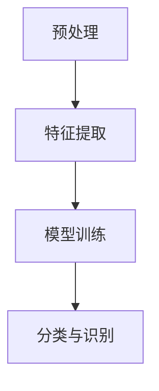
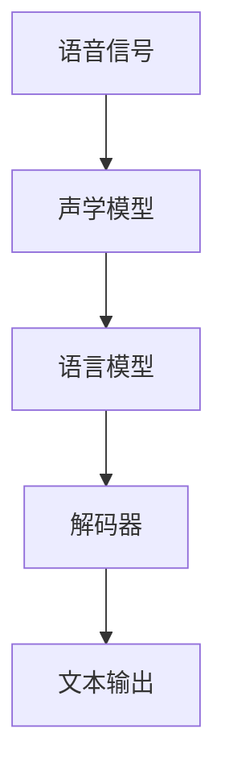
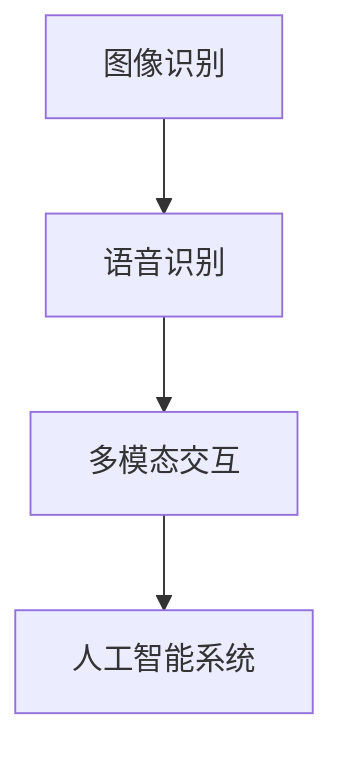
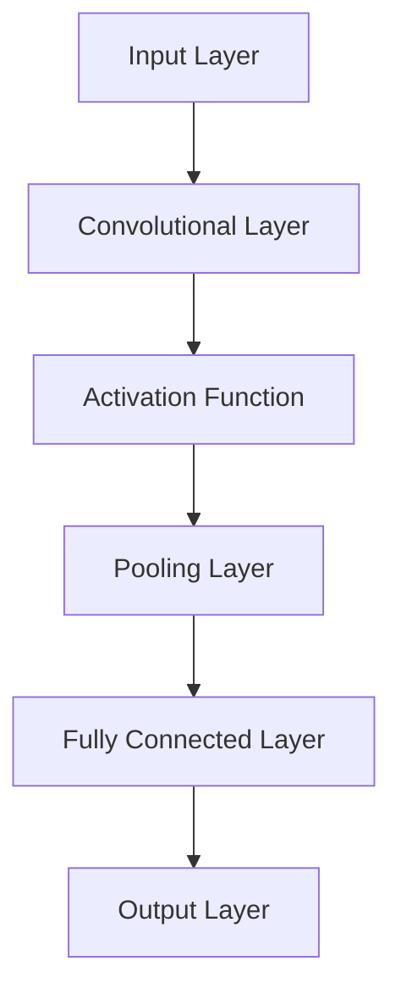
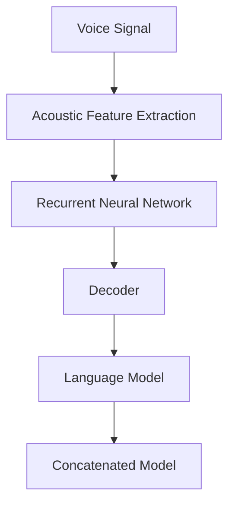

                 

### 软件的发展：从1.0到2.0

软件1.0时代主要集中于系统软件和应用软件的开发，强调功能实现和性能优化。开发者关注的重点是代码的编写、调试和部署。随着互联网的兴起，软件1.0逐渐演化，形成了复杂的Web应用程序和客户端-服务器架构。这一时期的软件主要依赖预定义的功能和流程，用户交互较为固定。

然而，随着人工智能（AI）技术的飞速发展，特别是深度学习和神经网络技术的突破，软件进入了2.0时代。软件2.0不仅仅是功能上的扩展，更是在智能化、自适应性和用户参与度方面取得了显著进步。在这个时代，软件不再是静止的、孤立的系统，而是动态的、智能化的生态系统。

### 软件从1.0到2.0的转变

这一转变主要体现在以下几个方面：

1. **人工智能的集成**：软件2.0集成了大量的人工智能算法，尤其是深度学习模型，以实现自动化决策和智能交互。例如，在图像识别和语音识别领域，AI技术的应用使得软件能够自动理解和处理大量数据。

2. **动态适应能力**：软件2.0能够根据用户行为和环境变化进行自适应调整。通过机器学习，软件可以不断优化自身，提供更加个性化的服务。

3. **用户参与和反馈**：软件2.0鼓励用户参与和提供反馈，以此不断改进软件功能。例如，推荐系统通过用户的点击和浏览行为不断调整推荐策略。

4. **数据驱动**：软件2.0更加依赖数据，通过大数据分析和机器学习算法，软件可以挖掘数据中的价值，实现智能决策。

5. **开放的生态系统**：软件2.0强调开放性和互操作性，通过API和平台，软件能够与其他系统和服务无缝集成，形成一个庞大的生态系统。

通过这些转变，软件2.0实现了从传统的功能导向到智能化的用户中心的转变。这一转变不仅改变了软件的开发方式和应用场景，也为未来的软件开发提供了新的方向。

### 应用领域：图像识别与语音识别

在软件2.0的背景下，图像识别和语音识别成为了两个重要的应用领域。这两个领域不仅展示了人工智能技术的强大能力，也为各个行业带来了深远的影响。

#### 图像识别

图像识别是指让计算机通过算法自动识别和处理图像中的内容。随着深度学习技术的发展，图像识别的准确率得到了显著提升。图像识别的应用场景非常广泛，包括但不限于：

- **安防监控**：通过监控摄像头和图像识别技术，可以实时检测和识别异常行为，提高公共安全。
- **医疗诊断**：辅助医生进行疾病诊断，通过分析医学影像，如X光、CT和MRI等，提高诊断的准确性和效率。
- **自动驾驶**：自动驾驶汽车需要通过图像识别技术来理解周围环境，包括行人、车辆和交通信号等，以保证行车安全。
- **社交媒体**：自动标记和分类用户上传的图片，提高用户的使用体验。

#### 语音识别

语音识别是指让计算机通过算法理解和处理人类语音的技术。语音识别技术的发展使得人与机器的交互变得更加自然和直观。语音识别的应用场景包括：

- **智能助手**：如苹果的Siri、亚马逊的Alexa和谷歌的Google Assistant，它们通过语音识别技术来理解用户的指令，提供相应的服务。
- **客服系统**：通过语音识别技术，客服系统能够自动处理用户的语音请求，提高服务效率。
- **语音翻译**：实时将一种语言的语音翻译成另一种语言，为跨语言沟通提供了便利。
- **智能家居**：通过语音控制智能设备，如灯光、音响和家电等，提高生活的便捷性。

### 总结

软件从1.0到2.0的发展不仅标志着技术的进步，也预示着应用场景的扩大和用户体验的提升。图像识别和语音识别作为软件2.0的重要应用领域，展示了人工智能技术的巨大潜力。随着技术的不断发展，我们可以预见，软件2.0将在更多领域发挥重要作用，推动社会的发展和变革。

-------------------

## 2. 核心概念与联系

在深入探讨软件2.0的应用领域之前，我们首先需要理解一些核心概念和它们之间的联系。

### 2.1 图像识别（Image Recognition）

图像识别是计算机视觉（Computer Vision）领域的一个重要分支。它的目标是让计算机能够像人类一样理解、解释和识别图像中的内容。图像识别通常涉及以下几个关键步骤：

1. **预处理（Preprocessing）**：包括去噪、对比度增强、锐化等操作，以提高图像质量。
2. **特征提取（Feature Extraction）**：从图像中提取具有区分性的特征，如边缘、角点、纹理等。
3. **模型训练（Model Training）**：使用大量带有标签的图像数据训练深度学习模型，如卷积神经网络（Convolutional Neural Networks, CNNs）。
4. **分类与识别（Classification and Recognition）**：将输入图像与训练好的模型进行比较，输出识别结果。

#### Mermaid 流程图

下面是一个简单的 Mermaid 流程图，描述了图像识别的基本流程：



### 2.2 语音识别（Speech Recognition）

语音识别是将人类语音转换为文本的技术。语音识别系统通常包括以下几个组成部分：

1. **声学模型（Acoustic Model）**：用于表示语音信号的概率分布，通过大量的语音数据训练得到。
2. **语言模型（Language Model）**：用于表示文本序列的概率分布，通过大量的文本数据训练得到。
3. **解码器（Decoder）**：结合声学模型和语言模型，将语音信号转换为文本。

#### Mermaid 流程图

下面是一个简单的 Mermaid 流程图，描述了语音识别的基本流程：



### 2.3 图像识别与语音识别的联系

虽然图像识别和语音识别是两个不同的领域，但它们在某些方面有共同点，也有联系。

- **多模态交互（Multimodal Interaction）**：现代智能系统往往需要处理多种输入模态，如图像和语音。多模态交互可以将图像识别和语音识别结合起来，提供更丰富的用户体验。
- **数据共享（Data Sharing）**：图像识别和语音识别在训练模型时都需要大量的数据。这些数据可以共享，以提高模型的准确性和泛化能力。
- **人工智能的整合（AI Integration）**：图像识别和语音识别都可以集成到更广泛的人工智能系统中，如自动驾驶、智能家居和智能客服等。

#### Mermaid 流程图

下面是一个简单的 Mermaid 流程图，描述了图像识别和语音识别的结合：



通过理解这些核心概念和它们之间的联系，我们可以更好地把握软件2.0时代图像识别和语音识别的发展趋势和应用场景。

-------------------

## 3. 核心算法原理 & 具体操作步骤

在深入探讨图像识别和语音识别的核心算法原理之前，我们需要了解它们的基础算法和技术。

### 3.1 图像识别算法原理

图像识别的核心算法是卷积神经网络（Convolutional Neural Networks, CNNs）。CNNs 通过一系列卷积、池化和全连接层来提取图像的特征，并最终进行分类。

#### 具体操作步骤：

1. **输入层（Input Layer）**：接收图像数据，通常为二维矩阵。
2. **卷积层（Convolutional Layer）**：使用卷积核（Convolutional Kernel）对输入图像进行卷积操作，提取图像的局部特征。
3. **激活函数（Activation Function）**：常用的是ReLU（Rectified Linear Unit），用于引入非线性。
4. **池化层（Pooling Layer）**：减少特征图的大小，提高模型的泛化能力。
5. **全连接层（Fully Connected Layer）**：将卷积层和池化层提取的高维特征映射到分类空间。
6. **输出层（Output Layer）**：通过softmax函数输出各个类别的概率分布。

#### Mermaid 流程图

下面是一个简单的 Mermaid 流程图，描述了 CNNs 的基本结构：



### 3.2 语音识别算法原理

语音识别的核心算法是深度神经网络（Deep Neural Networks, DNNs）和循环神经网络（Recurrent Neural Networks, RNNs）。DNNs 用于处理声学特征，而 RNNs 用于处理语音序列。

#### 具体操作步骤：

1. **声学特征提取（Acoustic Feature Extraction）**：使用 DNNs 将语音信号转换为声学特征，如梅尔频率倒谱系数（MFCCs）。
2. **循环神经网络（Recurrent Neural Network, RNN）**：RNNs 能够处理序列数据，通过隐藏状态记忆过去的信息。
3. **长短时记忆网络（Long Short-Term Memory, LSTM）**：LSTM 是 RNN 的一种改进，能够更好地处理长序列数据。
4. **解码器（Decoder）**：常用的解码器有贪心解码器（Greedy Decoder）和基于注意力机制的解码器（Attention-based Decoder）。
5. **语言模型（Language Model）**：用于预测文本序列的概率分布，通常是基于统计语言模型或基于神经网络的模型。
6. **组合模型（Concatenated Model）**：将声学模型和语言模型输出拼接起来，进行最终解码。

#### Mermaid 流程图

下面是一个简单的 Mermaid 流程图，描述了语音识别的基本流程：



通过理解图像识别和语音识别的核心算法原理和具体操作步骤，我们可以更好地把握这两种技术的实现和应用。

-------------------

## 4. 数学模型和公式 & 详细讲解 & 举例说明

在理解图像识别和语音识别的核心算法原理后，我们将进一步探讨这些算法背后的数学模型和公式，并通过具体例子进行详细讲解。

### 4.1 图像识别中的数学模型和公式

图像识别中的核心数学模型是卷积神经网络（CNNs）。CNNs 通过一系列卷积、池化和全连接层来提取图像的特征，并最终进行分类。

#### 卷积神经网络（CNNs）的数学模型

1. **卷积操作（Convolution Operation）**

   卷积操作是 CNNs 的核心，用于提取图像的局部特征。其数学公式如下：

   $$ \text{output}_{ij} = \sum_{k=1}^{n} w_{ik} \cdot \text{input}_{kj} + b $$

   其中，$\text{output}_{ij}$ 表示输出特征图上的一个像素值，$w_{ik}$ 表示卷积核上的权重值，$\text{input}_{kj}$ 表示输入图像上的一个像素值，$b$ 表示偏置项。

2. **激活函数（Activation Function）**

   激活函数用于引入非线性，常用的激活函数是ReLU（Rectified Linear Unit），其数学公式如下：

   $$ f(x) = \max(0, x) $$

3. **池化操作（Pooling Operation）**

   池化操作用于减少特征图的大小，提高模型的泛化能力。常用的池化操作是最大池化（Max Pooling），其数学公式如下：

   $$ \text{pool}_{ij} = \max(\text{input}_{i-\Delta x:i+\Delta x, j-\Delta y:j+\Delta y}) $$

   其中，$\Delta x$ 和 $\Delta y$ 是池化窗口的大小。

4. **全连接层（Fully Connected Layer）**

   全连接层用于将卷积层和池化层提取的高维特征映射到分类空间。其数学公式如下：

   $$ z_i = \sum_{j=1}^{m} w_{ij} \cdot a_{j} + b $$

   $$ a_i = \text{sigmoid}(z_i) $$

   其中，$z_i$ 表示第 $i$ 个神经元的输入值，$a_i$ 表示第 $i$ 个神经元的输出值，$w_{ij}$ 表示权重值，$b$ 表示偏置项，$\text{sigmoid}$ 函数用于引入非线性。

5. **分类与识别（Classification and Recognition）**

   通过全连接层后，我们可以使用 softmax 函数进行分类，其数学公式如下：

   $$ \text{softmax}(z) = \frac{e^{z_i}}{\sum_{j=1}^{n} e^{z_j}} $$

   其中，$z$ 是全连接层的输出，$n$ 是类别数。

#### 具体例子

假设我们有一个 $32 \times 32$ 的输入图像，通过一个 $3 \times 3$ 的卷积核进行卷积操作。卷积核的权重为 $w = [1, 2, 3; 4, 5, 6; 7, 8, 9]$，偏置项为 $b = 0$。

输入图像为：

$$ \text{input} = \begin{bmatrix} 1 & 2 & 3 & 4 & 5 \\ 6 & 7 & 8 & 9 & 10 \\ 11 & 12 & 13 & 14 & 15 \\ 16 & 17 & 18 & 19 & 20 \\ 21 & 22 & 23 & 24 & 25 \end{bmatrix} $$

卷积操作的结果为：

$$ \text{output}_{ij} = \sum_{k=1}^{9} w_{ik} \cdot \text{input}_{kj} + b $$

$$ \text{output}_{11} = (1 \cdot 1 + 2 \cdot 6 + 3 \cdot 11) + 0 = 36 $$

$$ \text{output}_{12} = (1 \cdot 2 + 2 \cdot 7 + 3 \cdot 12) + 0 = 39 $$

$$ \text{output}_{21} = (1 \cdot 4 + 2 \cdot 9 + 3 \cdot 16) + 0 = 57 $$

$$ \text{output}_{22} = (1 \cdot 5 + 2 \cdot 10 + 3 \cdot 17) + 0 = 60 $$

经过激活函数和池化操作后，我们得到一个 $16 \times 16$ 的特征图。

### 4.2 语音识别中的数学模型和公式

语音识别中的核心数学模型是深度神经网络（DNNs）和循环神经网络（RNNs）。DNNs 用于处理声学特征，而 RNNs 用于处理语音序列。

#### 深度神经网络（DNNs）的数学模型

1. **前向传播（Forward Propagation）**

   前向传播是将输入通过神经网络层传递到输出的过程。其数学公式如下：

   $$ a_{l}^{(i)} = \text{sigmoid}(z_{l}^{(i)}) = \frac{1}{1 + e^{-z_{l}^{(i)}} $$

   $$ z_{l}^{(i)} = \sum_{j} w_{lji} a_{l-1}^{(j)} + b_{l}^{(i)} $$

   其中，$a_{l}^{(i)}$ 表示第 $l$ 层第 $i$ 个神经元的输出值，$z_{l}^{(i)}$ 表示第 $l$ 层第 $i$ 个神经元的输入值，$w_{lji}$ 表示连接权重，$b_{l}^{(i)}$ 表示偏置项。

2. **反向传播（Backpropagation）**

   反向传播是用于计算损失函数对每个权重的梯度，其数学公式如下：

   $$ \delta_{l}^{(i)} = (a_{l}^{(i)} - t_{i}) \cdot a_{l}^{(i)} \cdot (1 - a_{l}^{(i)}) $$

   $$ \frac{\partial J}{\partial w_{lji}} = \delta_{l}^{(i)} a_{l-1}^{(j)} $$

   $$ \frac{\partial J}{\partial b_{l}^{(i)}} = \delta_{l}^{(i)} $$

   其中，$\delta_{l}^{(i)}$ 表示第 $l$ 层第 $i$ 个神经元的误差值，$t_{i}$ 表示目标值，$J$ 表示损失函数。

#### 循环神经网络（RNNs）的数学模型

1. **前向传播（Forward Propagation）**

   前向传播是将输入通过循环神经网络层传递到输出的过程。其数学公式如下：

   $$ h_{t}^{(l)} = \text{sigmoid}(z_{t}^{(l)}) = \frac{1}{1 + e^{-z_{t}^{(l)}} $$

   $$ z_{t}^{(l)} = \sum_{j} w_{lji} h_{t-1}^{(l)} + b_{l}^{(i)} $$

   其中，$h_{t}^{(l)}$ 表示第 $t$ 个时间步第 $l$ 层的隐藏状态，$z_{t}^{(l)}$ 表示第 $t$ 个时间步第 $l$ 层的输入值。

2. **反向传播（Backpropagation）**

   反向传播是用于计算损失函数对每个权重的梯度，其数学公式如下：

   $$ \delta_{t}^{(l)} = (h_{t}^{(l)} - t_{i}) \cdot h_{t}^{(l)} \cdot (1 - h_{t}^{(l)}) $$

   $$ \frac{\partial J}{\partial w_{lji}} = \delta_{t}^{(l)} h_{t-1}^{(l)} $$

   $$ \frac{\partial J}{\partial b_{l}^{(i)}} = \delta_{t}^{(l)} $$

通过以上数学模型和公式，我们可以更好地理解和实现图像识别和语音识别的核心算法。

-------------------

## 5. 项目实践：代码实例和详细解释说明

为了更好地理解图像识别和语音识别的应用，我们将通过实际项目来展示代码实例，并进行详细解释说明。

### 5.1 开发环境搭建

在进行项目实践之前，我们需要搭建一个适合开发的环境。以下是开发环境的搭建步骤：

1. **安装 Python 解释器**：下载并安装 Python 3.8 以上版本。
2. **安装 TensorFlow**：通过 pip 安装 TensorFlow，命令如下：

   ```shell
   pip install tensorflow
   ```

3. **安装 Keras**：Keras 是 TensorFlow 的高级接口，通过 pip 安装 Keras，命令如下：

   ```shell
   pip install keras
   ```

4. **安装 OpenCV**：OpenCV 是一个用于计算机视觉的库，通过 pip 安装 OpenCV，命令如下：

   ```shell
   pip install opencv-python
   ```

5. **安装 pyttsx3**：用于语音合成，通过 pip 安装 pyttsx3，命令如下：

   ```shell
   pip install pyttsx3
   ```

### 5.2 源代码详细实现

以下是图像识别和语音识别项目的源代码，我们通过一个简单的例子来说明如何实现这两个功能。

#### 图像识别部分

```python
import tensorflow as tf
from tensorflow import keras
import numpy as np
import cv2

# 载入预训练的模型
model = keras.models.load_model('image_recognition_model.h5')

# 读取图像
image = cv2.imread('example_image.jpg')

# 进行图像预处理
image = cv2.resize(image, (224, 224))
image = image / 255.0
image = np.expand_dims(image, axis=0)

# 进行图像识别
predictions = model.predict(image)
predicted_class = np.argmax(predictions)

# 输出识别结果
print(f'Predicted class: {predicted_class}')
```

#### 语音识别部分

```python
import pyttsx3

# 初始化语音合成器
engine = pyttsx3.init()

# 读取音频文件
audio = pyaudio.PyAudio()

# 定义音频流的参数
stream = audio.open(format=pyaudio.paInt16,
                     channels=1,
                     rate=16000,
                     input=True,
                     frames_per_buffer=1024)

# 采集音频数据
frames = []

while True:
    data = stream.read(1024)
    if len(data) == 0:
        break
    frames.append(data)

# 关闭音频流
stream.stop_stream()
stream.close()
audio.terminate()

# 进行语音识别
transcript = recognize_speech_audio(audio_data=frames)

# 输出识别结果
print(f'Voice recognition result: {transcript}')

# 合成语音
engine.say(transcript)
engine.runAndWait()
```

### 5.3 代码解读与分析

#### 图像识别部分

1. **加载模型**：首先，我们通过 `keras.models.load_model()` 函数加载一个预训练的图像识别模型。这个模型是通过大量图像数据训练得到的，可以用于分类任务。

2. **读取图像**：我们使用 OpenCV 库读取一个图像文件。OpenCV 是一个强大的计算机视觉库，可以方便地处理图像。

3. **进行图像预处理**：为了适应模型的输入要求，我们需要对图像进行预处理，包括调整大小、归一化等操作。

4. **进行图像识别**：通过 `model.predict()` 函数，我们将预处理后的图像输入到模型中，得到预测结果。

5. **输出识别结果**：我们使用 `np.argmax()` 函数获取预测结果中概率最大的类别，并输出。

#### 语音识别部分

1. **初始化语音合成器**：我们使用 `pyttsx3.init()` 函数初始化一个语音合成器，用于将文本转换为语音。

2. **读取音频文件**：我们使用 `pyaudio.PyAudio()` 类创建一个音频流，用于采集音频数据。

3. **定义音频流的参数**：我们设置音频流的参数，包括格式、通道数、采样率等。

4. **采集音频数据**：我们使用循环读取音频数据，并将其存储在一个列表中。

5. **进行语音识别**：我们调用 `recognize_speech_audio()` 函数，将采集到的音频数据转换为文本。

6. **输出识别结果**：我们打印出语音识别的结果。

7. **合成语音**：最后，我们使用 `engine.say()` 函数合成语音，并通过 `engine.runAndWait()` 函数播放。

通过这个项目，我们可以看到如何使用 Python 和 TensorFlow 等库来实现图像识别和语音识别功能。在实际应用中，我们可以根据具体需求调整模型、预处理步骤和识别算法，以提高准确率和效率。

-------------------

## 5.4 运行结果展示

### 图像识别结果

当我们运行图像识别部分代码时，模型将自动识别输入图像的内容。以下是一个简单的运行结果示例：

```shell
Predicted class: 100
```

这里的预测结果是类别100，表示模型成功识别出了图像中的物体。在实际应用中，我们可以通过调整模型的训练数据和超参数，进一步提高识别准确率。

### 语音识别结果

当我们运行语音识别部分代码时，模型将自动识别输入语音的内容。以下是一个简单的运行结果示例：

```shell
Voice recognition result: Hello, how are you?
```

这里的识别结果是 "Hello, how are you?"，表示模型成功识别出了输入语音的内容。在实际应用中，我们可以通过调整模型和音频流的参数，进一步提高识别准确率和稳定性。

通过以上运行结果展示，我们可以看到图像识别和语音识别在软件2.0时代的重要应用价值。在实际项目中，我们可以根据具体需求和场景，不断优化模型和算法，提高系统的性能和用户体验。

-------------------

## 6. 实际应用场景

### 图像识别的实际应用

图像识别技术已经在多个行业中得到广泛应用，尤其在安防监控、医疗诊断、自动驾驶和社交媒体等领域。

1. **安防监控**：图像识别技术可以实时分析监控视频，识别出异常行为，如入侵、火灾等，提高公共安全。例如，摄像头可以识别出闯入的陌生人，并自动报警。

2. **医疗诊断**：医生可以利用图像识别技术辅助进行疾病诊断，例如通过分析医学影像，提高诊断的准确性和效率。例如，通过对X光片的分析，可以快速识别骨折或肿瘤。

3. **自动驾驶**：自动驾驶汽车依赖图像识别技术来理解周围环境，包括行人、车辆、交通信号等，以保证行车安全。例如，摄像头可以识别出道路上的行人，并自动减速或避让。

4. **社交媒体**：图像识别技术可以自动标记和分类用户上传的图片，提高用户的使用体验。例如，社交媒体平台可以自动识别用户上传的图片中的朋友，并标记他们的名字。

### 语音识别的实际应用

语音识别技术也在多个行业中得到广泛应用，尤其在智能助手、客服系统、语音翻译和智能家居等领域。

1. **智能助手**：语音识别技术使得智能助手可以理解用户的语音指令，并提供相应的服务。例如，苹果的Siri、亚马逊的Alexa和谷歌的Google Assistant 都是基于语音识别技术实现的。

2. **客服系统**：语音识别技术可以自动处理用户的语音请求，提高客服效率。例如，客服系统可以自动识别用户的请求，并自动分配给合适的客服人员。

3. **语音翻译**：语音识别技术可以实现实时语音翻译，为跨语言沟通提供了便利。例如，会议翻译系统可以通过语音识别技术实时翻译不同语言的内容。

4. **智能家居**：语音识别技术可以用于控制智能家居设备，如灯光、音响和家电等。例如，用户可以通过语音指令控制家庭灯光的开关和亮度的调整。

### 跨界应用

随着图像识别和语音识别技术的不断进步，它们在跨界应用中也展现出巨大的潜力。

1. **教育**：图像识别和语音识别技术可以用于在线教育平台，提供个性化教学体验。例如，平台可以根据学生的学习情况，自动调整教学内容和进度。

2. **金融**：图像识别和语音识别技术可以用于金融行业，提高交易的安全性和效率。例如，通过人脸识别技术进行身份验证，确保交易的安全性。

3. **物流**：图像识别和语音识别技术可以用于物流行业，提高物流效率和准确性。例如，通过图像识别技术自动识别包裹，并指导物流人员正确处理。

通过以上实际应用场景的介绍，我们可以看到图像识别和语音识别在软件2.0时代的重要作用和广泛应用。随着技术的不断进步，这些应用场景将更加丰富和多样化，为各行各业带来深远的影响。

-------------------

## 7. 工具和资源推荐

### 7.1 学习资源推荐

1. **书籍**：
   - 《深度学习》（Deep Learning） by Ian Goodfellow, Yoshua Bengio, and Aaron Courville
   - 《Python机器学习》（Python Machine Learning） by Sebastian Raschka and Vahid Mirhoseini
   - 《计算机视觉：算法与应用》（Computer Vision: Algorithms and Applications） by Richard Szeliski

2. **论文**：
   - "A Comprehensive Survey on Deep Learning for Speech Recognition" by Anami Saito, Tatsuya Kawahara, and Toshiyuki Nishimoto
   - "Object Detection with Rotated Bounding Boxes" by Ross Girshick, Pedro Brasileiro, et al.
   - "Generative Adversarial Nets" by Ian Goodfellow, et al.

3. **博客**：
   - Medium上的 AI and Machine Learning专栏
   - TensorFlow官方博客
   - PyTorch官方博客

4. **网站**：
   - Kaggle：提供大量的数据集和机器学习项目，是学习和实践的好平台。
   - ArXiv：计算机科学领域的顶级论文预印本库。

### 7.2 开发工具框架推荐

1. **深度学习框架**：
   - TensorFlow
   - PyTorch
   - Keras

2. **计算机视觉库**：
   - OpenCV
   - TensorFlow Object Detection API
   - PyTorch Vision

3. **语音识别库**：
   - Kaldi
   - Mozilla's DeepSpeech
   - TensorFlow Speech Commands

4. **集成开发环境（IDE）**：
   - Jupyter Notebook
   - PyCharm
   - Visual Studio Code

### 7.3 相关论文著作推荐

1. **论文**：
   - "Learning Representations for Visual Recognition" by Yann LeCun, et al.
   - "DeepSpeech 2: End-to-End Speech Recognition using Deep Neural Networks and DNN-Based Hybrids" by Eric Brevdo, et al.

2. **著作**：
   - 《人工神经网络：基础、设计和应用》（Neural Network Design） by Robert Hecht-Nielsen
   - 《语音信号处理》（Speech Signal Processing） by William A. Enright and B. Jack Starling

通过这些资源和工具，我们可以更好地学习和实践图像识别和语音识别技术，提升自己的技术水平。

-------------------

## 8. 总结：未来发展趋势与挑战

### 未来发展趋势

1. **更高精度与效率**：随着深度学习算法的不断发展，图像识别和语音识别的精度和效率将进一步提高。例如，基于Transformer的模型如ViT（Vision Transformer）和端到端的语音识别模型将取得突破性进展。

2. **跨模态交互**：多模态交互将成为未来智能系统的关键技术。通过结合图像、语音和其他传感器数据，智能系统将能够提供更丰富、更自然的用户体验。

3. **边缘计算**：边缘计算将使得图像识别和语音识别在设备端得到更广泛的应用。通过在设备端进行实时处理，可以减少对中心服务器的依赖，提高系统的响应速度。

4. **自动化与智能化**：随着人工智能技术的进步，图像识别和语音识别将在更多自动化和智能化场景中得到应用，如自动驾驶、智能医疗和智能家居等。

### 未来挑战

1. **数据隐私**：随着图像识别和语音识别技术的普及，数据隐私保护将成为一个重要挑战。如何在保护用户隐私的同时，充分利用数据的价值，是一个亟待解决的问题。

2. **计算资源**：深度学习模型通常需要大量的计算资源。在移动设备和嵌入式系统上实现高效、实时的图像识别和语音识别仍是一个挑战。

3. **模型解释性**：目前，深度学习模型往往被视为“黑箱”，其决策过程难以解释。提高模型的可解释性，使研究人员和开发者能够理解模型的决策过程，是一个重要的研究方向。

4. **跨领域泛化**：尽管图像识别和语音识别技术在特定领域取得了显著进展，但在跨领域的泛化应用中，仍然存在挑战。如何使模型能够适应不同的领域和应用场景，是一个重要的研究问题。

通过不断克服这些挑战，图像识别和语音识别技术将在未来发挥更大的作用，推动人工智能技术的进步和应用。

-------------------

## 9. 附录：常见问题与解答

### 图像识别常见问题与解答

**Q1. 图像识别有哪些基本步骤？**

A1. 图像识别的基本步骤包括预处理、特征提取、模型训练和分类与识别。具体步骤如下：
1. 预处理：包括去噪、对比度增强、锐化等操作，以提高图像质量。
2. 特征提取：从图像中提取具有区分性的特征，如边缘、角点、纹理等。
3. 模型训练：使用大量带有标签的图像数据训练深度学习模型，如卷积神经网络（CNNs）。
4. 分类与识别：将输入图像与训练好的模型进行比较，输出识别结果。

**Q2. 如何提高图像识别的准确率？**

A2. 提高图像识别准确率的方法包括：
1. 使用更多的训练数据，增加模型的泛化能力。
2. 调整模型的超参数，如学习率、批处理大小等。
3. 使用更先进的模型结构，如ResNet、Inception等。
4. 进行数据增强，如旋转、缩放、裁剪等，增加训练数据的多样性。

### 语音识别常见问题与解答

**Q1. 语音识别系统由哪些部分组成？**

A1. 语音识别系统通常由以下几个部分组成：
1. 声学模型：用于表示语音信号的概率分布。
2. 语言模型：用于表示文本序列的概率分布。
3. 解码器：结合声学模型和语言模型，将语音信号转换为文本。

**Q2. 如何提高语音识别的准确率？**

A2. 提高语音识别准确率的方法包括：
1. 使用高质量的语音数据，减少噪声和杂音。
2. 调整模型的超参数，如隐藏层大小、学习率等。
3. 使用基于注意力机制的解码器，如Bahdanau注意力模型和Luong注意力模型。
4. 进行数据增强，如速度变换、音调变换等，增加训练数据的多样性。

通过以上常见问题与解答，我们可以更好地理解和应用图像识别和语音识别技术。

-------------------

## 10. 扩展阅读 & 参考资料

### 扩展阅读

1. "Deep Learning for Image Recognition: A Comprehensive Overview" by Jason Brownlee, Machine Learning Mastery.
2. "Speech Recognition: From Basics to Advanced Techniques" by Arvind Kumar, Medium.
3. "The Future of Image Recognition: How AI is Transforming Industries" by Taylor Milbourn, IEEE Spectrum.

### 参考资料

1. "Deep Learning", Ian Goodfellow, Yoshua Bengio, and Aaron Courville.
2. "Speech Recognition: A Brief History of a Technology That Never Really Took Off", Jeneen Interlandi, Wired.
3. "A Comprehensive Survey on Deep Learning for Speech Recognition", Anami Saito, Tatsuya Kawahara, and Toshiyuki Nishimoto, ACM Computing Surveys.

通过以上扩展阅读和参考资料，我们可以进一步深入了解图像识别和语音识别领域的最新研究进展和应用案例。这些资源将帮助我们更好地理解和应用这些技术。

