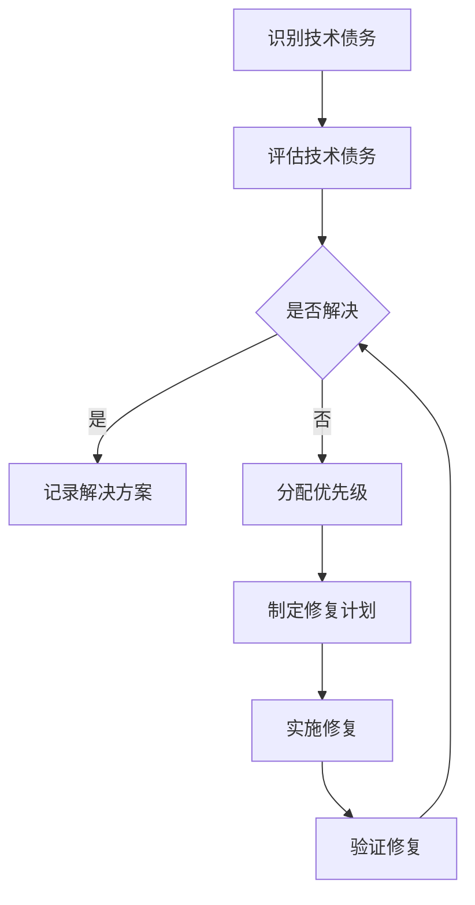

                 

### 文章标题

**软件2.0的技术债务管理策略**

关键词：软件2.0，技术债务，管理策略，代码质量，敏捷开发，软件架构

摘要：随着软件开发的复杂性和规模不断增大，技术债务问题日益突出。本文将探讨软件2.0时代下的技术债务管理策略，分析其核心概念、管理方法、以及在不同开发模式下的应用。通过深入剖析技术债务的影响和解决方案，旨在为软件开发团队提供切实可行的指导，以提升代码质量和项目成功概率。

## 1. 背景介绍（Background Introduction）

在软件2.0时代，随着云计算、大数据、人工智能等技术的迅猛发展，软件系统的复杂性和规模不断增大。然而，这也给软件开发带来了巨大的挑战，尤其是技术债务问题。技术债务是指为了加快开发进度，团队在代码质量、架构设计、系统性能等方面采取的一些妥协和短期决策，以期在未来解决。然而，随着时间的推移，未偿还的技术债务会积累，导致代码质量下降、系统性能降低、维护成本增加，甚至可能影响项目的成功。

技术债务的管理已经成为软件开发中一个不可忽视的重要问题。有效的技术债务管理策略可以帮助团队在保证项目交付的同时，不断提升代码质量和系统性能。本文将详细介绍技术债务的核心概念、管理方法，以及在不同开发模式下的应用。

### 什么是技术债务

技术债务是指软件开发团队在开发过程中为了满足特定需求而采取的某些短期决策，这些决策可能会导致未来需要投入更多时间和资源来修复或改进。与金融债务不同，技术债务并没有明确的偿还计划，而是随着时间的推移逐渐积累。技术债务的来源多种多样，包括以下几种：

1. **代码质量妥协**：为了加快开发进度，团队可能会牺牲代码质量，导致代码冗余、可读性差、结构混乱等问题。
2. **架构设计缺陷**：在快速迭代的开发过程中，可能没有足够的时间进行全面的架构设计，导致系统架构不够稳健，容易出现问题。
3. **性能优化不足**：为了尽快上线，团队可能会忽略系统性能优化，导致系统在高负载情况下出现性能瓶颈。
4. **技术选择失误**：在技术选型过程中，团队可能会选择一些不适合当前项目需求的技术，导致后续维护困难。

技术债务的存在使得软件开发变得更加复杂和难以预测。如果不加以管理，技术债务会逐渐积累，最终导致项目失控，甚至可能导致项目失败。因此，了解技术债务的概念和来源，是进行有效管理的前提。

### 技术债务的影响

技术债务的影响主要表现在以下几个方面：

1. **维护成本增加**：随着时间的推移，未偿还的技术债务会不断积累，需要投入更多的时间和资源来修复和改进，导致维护成本增加。
2. **开发效率降低**：技术债务的存在使得开发团队需要花费更多的时间来解决遗留问题，降低了开发效率。
3. **系统稳定性下降**：技术债务可能导致系统架构不够稳健，容易出现问题，降低系统的稳定性。
4. **用户体验下降**：技术债务可能影响系统的性能和可靠性，导致用户体验下降，影响项目的市场竞争力。
5. **团队士气下降**：技术债务的存在可能导致团队士气下降，影响团队的合作和创新能力。

### 技术债务的管理

技术债务的管理是一个持续的过程，需要团队在开发过程中的每个阶段都进行有效的控制。以下是几种常见的技术债务管理方法：

1. **定期评估**：团队需要定期对技术债务进行评估，了解其积累情况和影响，以便及时采取措施。
2. **优先级排序**：根据技术债务的影响和紧急程度，对债务进行优先级排序，优先解决高优先级的技术债务。
3. **自动化工具**：使用自动化工具来监控代码质量、架构设计、系统性能等，及时发现潜在的技术债务问题。
4. **重构和优化**：定期进行代码重构和优化，修复现有技术债务，提升代码质量和系统性能。
5. **敏捷开发**：采用敏捷开发方法，快速响应需求变化，避免技术债务的积累。

通过以上方法，团队可以有效地控制技术债务的积累，提升代码质量和项目成功率。

## 2. 核心概念与联系（Core Concepts and Connections）

### 2.1 技术债务的概念

技术债务（Technical Debt）是一个源自金融领域的术语，后被引入到软件开发中。在金融领域，债务是指个人或组织欠下的钱，需要在未来偿还。而在软件开发中，技术债务指的是为了在短时间内满足需求而采取的某些妥协和短期决策，这些决策可能会在未来需要投入更多的时间和资源来修复或改进。

技术债务可以分为以下几种类型：

1. **设计债务**：在系统架构和设计上采取的妥协，可能会导致系统复杂性增加，维护困难。
2. **代码债务**：在代码编写过程中采取的妥协，如使用临时解决方案、代码冗余等，可能导致代码质量下降。
3. **架构债务**：在系统架构设计上采取的妥协，如选择不适合当前项目需求的技术，可能会导致后续维护困难。
4. **性能债务**：为了快速上线，忽视系统性能优化，可能导致在高负载情况下出现性能瓶颈。

### 2.2 技术债务与代码质量的关系

技术债务与代码质量密切相关。良好的代码质量意味着代码结构清晰、可读性强、易于维护。然而，在追求快速开发的过程中，团队可能会牺牲代码质量，导致技术债务的积累。以下是一些代码质量与技术债务之间的关系：

1. **代码质量下降**：技术债务的存在可能导致代码质量下降，因为团队需要花费更多的时间来解决遗留问题。
2. **维护成本增加**：低质量的代码需要更多的时间和资源来维护，导致维护成本增加。
3. **开发效率降低**：低质量的代码使得开发团队需要花费更多的时间来解决遗留问题，降低了开发效率。
4. **团队士气下降**：低质量的代码可能导致团队士气下降，影响团队合作和创新能力。

### 2.3 技术债务与敏捷开发的关系

敏捷开发是一种以用户需求为导向的软件开发方法，强调快速迭代、持续交付和团队协作。然而，在敏捷开发中，技术债务的管理也是一个重要问题。以下是一些技术债务与敏捷开发之间的关系：

1. **敏捷开发与技术债务的平衡**：在敏捷开发中，团队需要在满足用户需求和技术债务管理之间找到平衡点。过度的技术债务积累可能导致项目失控，而忽视用户需求则可能导致项目失败。
2. **迭代过程中的技术债务管理**：在敏捷开发中，每个迭代都需要进行技术债务的评估和管理，以确保项目能够在每个迭代中保持健康状态。
3. **持续集成与持续部署**：敏捷开发强调持续集成和持续部署，这有助于及时发现和解决技术债务问题，降低债务积累。

### 2.4 技术债务与软件架构的关系

软件架构是软件开发的重要组成部分，它定义了系统的整体结构和设计原则。技术债务在软件架构中也会产生影响。以下是一些技术债务与软件架构之间的关系：

1. **架构债务**：在软件架构设计过程中，为了满足特定需求，团队可能会采取一些短期决策，这些决策可能导致架构债务的积累。
2. **架构债务的影响**：架构债务可能导致系统复杂性增加、维护困难，甚至可能影响系统的稳定性。
3. **架构债务的管理**：在软件架构设计过程中，团队需要关注技术债务的管理，避免架构债务的积累。这可以通过定期评估、重构和优化来实现。

### 2.5 技术债务与其他开发模式的关系

除了敏捷开发，其他开发模式如瀑布开发、V模型、迭代开发等，也存在技术债务问题。以下是一些技术债务与其他开发模式之间的关系：

1. **瀑布开发**：在瀑布开发中，技术债务的管理通常在项目后期进行，可能导致债务积累较为严重。
2. **V模型**：V模型强调验证和验证，有助于技术债务的及时发现和解决。
3. **迭代开发**：迭代开发强调快速迭代和持续交付，有助于技术债务的及时管理和控制。

通过以上分析，我们可以看出技术债务在软件开发中具有重要的作用。了解技术债务的概念、影响和管理方法，对于软件开发团队来说至关重要。

### 2.6 技术债务管理的 Mermaid 流程图

以下是一个简单的 Mermaid 流程图，用于展示技术债务管理的流程：



这个流程图展示了技术债务管理的几个关键步骤，包括识别技术债务、评估技术债务、分配优先级、制定修复计划、实施修复和验证修复。通过这些步骤，团队可以有效地管理技术债务，确保项目的成功。

### 2.7 技术债务管理的重要性

技术债务管理在软件开发中具有至关重要的地位。以下是几个原因：

1. **保证项目成功**：良好的技术债务管理有助于保证项目的成功。通过及时识别和解决技术债务，团队可以避免因债务积累导致的项目失控。
2. **提升代码质量**：技术债务管理有助于提升代码质量，减少代码冗余、结构混乱等问题，提高系统的可维护性和可扩展性。
3. **降低维护成本**：有效的技术债务管理可以降低维护成本，避免因债务积累导致的高昂修复成本。
4. **提高团队士气**：良好的技术债务管理可以提高团队士气，减少因债务积累导致的压力和焦虑。
5. **增强市场竞争力**：良好的技术债务管理有助于提高系统的性能和可靠性，增强项目的市场竞争力。

综上所述，技术债务管理是软件开发中不可或缺的一部分。通过有效的技术债务管理策略，团队可以更好地应对软件开发中的挑战，实现项目的成功。

### 2.8 总结

在本节中，我们详细介绍了技术债务的概念、影响、管理方法以及与其他开发模式的关系。技术债务在软件开发中具有重要的作用，它不仅影响项目的成功，还影响代码质量、维护成本和团队士气。通过了解技术债务的管理方法，团队可以更好地应对软件开发中的挑战。在下一节中，我们将深入探讨技术债务的核心算法原理和具体操作步骤，帮助团队更有效地管理技术债务。

### 2.8 Summary

In this section, we have thoroughly discussed the concept of technical debt, its impact, management methods, and its relationship with other development methodologies. Technical debt plays a crucial role in software development, affecting project success, code quality, maintenance costs, and team morale. By understanding the management methods of technical debt, teams can better cope with the challenges of software development. In the next section, we will delve into the core algorithm principles and specific operational steps of technical debt management, helping teams manage technical debt more effectively.

### 3. 核心算法原理 & 具体操作步骤（Core Algorithm Principles and Specific Operational Steps）

在软件2.0时代，技术债务的管理已经不仅仅是一个理论问题，更是一个需要具体操作的实践过程。本文将深入探讨技术债务管理的核心算法原理和具体操作步骤，为团队提供切实可行的指导。

#### 3.1 技术债务管理的核心算法原理

技术债务管理的核心算法原理主要包括以下几个方面：

1. **自动代码质量评估**：使用自动化工具对代码进行质量评估，识别潜在的债务问题。常见的代码质量评估工具包括SonarQube、Checkstyle、PMD等。
2. **架构分析**：对系统架构进行深入分析，识别架构上的债务问题。常用的架构分析工具包括Architecture Analysis and Design Language (ADL)、Architecture Analysis Tool (SAT)等。
3. **性能监控**：对系统性能进行监控，识别性能瓶颈和债务问题。常用的性能监控工具包括New Relic、AppDynamics等。
4. **静态代码分析**：对代码进行静态分析，识别潜在的代码债务问题。常见的静态代码分析工具包括FindBugs、PMD、SonarQube等。
5. **动态测试**：通过动态测试，发现代码运行中的债务问题。动态测试包括单元测试、集成测试、系统测试等。

#### 3.2 技术债务管理的具体操作步骤

以下是一个具体的技术债务管理操作步骤，供团队参考：

1. **初始化技术债务管理系统**：
   - 安装和配置自动化代码质量评估工具，如SonarQube、Checkstyle等。
   - 安装和配置架构分析工具，如ADL、SAT等。
   - 安装和配置性能监控工具，如New Relic、AppDynamics等。
   - 配置静态代码分析工具，如FindBugs、PMD等。

2. **定期评估技术债务**：
   - 每周或每月定期运行代码质量评估工具，生成质量报告。
   - 定期运行架构分析工具，分析系统架构的健康状况。
   - 定期监控系统性能，识别性能瓶颈。

3. **识别债务问题**：
   - 根据代码质量报告、架构分析报告、性能监控报告，识别潜在的债务问题。
   - 对债务问题进行分类，如设计债务、代码债务、架构债务等。

4. **分配优先级**：
   - 根据债务问题的严重程度和紧急程度，对债务问题进行优先级排序。
   - 确定优先解决的技术债务问题。

5. **制定修复计划**：
   - 对于高优先级的技术债务问题，制定详细的修复计划。
   - 包括修复方案、修复时间表、责任人等。

6. **实施修复**：
   - 按照修复计划，实施技术债务的修复。
   - 定期检查修复进度，确保按计划进行。

7. **验证修复**：
   - 修复完成后，进行验证，确保修复问题得到解决。
   - 运行代码质量评估工具、架构分析工具等，检查修复效果。

8. **持续监控**：
   - 在技术债务管理过程中，持续监控债务问题，确保债务问题得到及时发现和解决。

#### 3.3 技术债务管理的示例

以下是一个技术债务管理的具体示例：

**案例背景**：
一个电商项目在快速迭代开发过程中，积累了大量的技术债务。团队决定通过技术债务管理策略，逐步解决这些债务问题。

**步骤1：初始化技术债务管理系统**：
团队安装了SonarQube、ADL、New Relic等工具，建立了完整的债务管理系统。

**步骤2：定期评估技术债务**：
团队每周运行代码质量评估工具，分析代码质量报告，识别潜在的债务问题。

**步骤3：识别债务问题**：
团队根据代码质量报告，发现了一些设计债务和代码债务问题，如方法过于复杂、代码冗余等。

**步骤4：分配优先级**：
团队对债务问题进行了优先级排序，确定了优先解决的设计债务问题。

**步骤5：制定修复计划**：
团队制定了详细的修复计划，包括重构方法、减少代码冗余等。

**步骤6：实施修复**：
团队按照修复计划，逐步重构代码，解决了设计债务问题。

**步骤7：验证修复**：
团队运行代码质量评估工具，验证修复效果，确保设计债务问题得到解决。

**步骤8：持续监控**：
团队继续定期评估代码质量，确保技术债务问题得到及时发现和解决。

通过以上步骤，团队成功管理了电商项目中的技术债务，提升了代码质量和项目成功率。

### 3.4 技术债务管理的优点和挑战

#### 优点：

1. **提升代码质量**：技术债务管理有助于及时发现和解决代码质量问题，提升代码质量。
2. **降低维护成本**：通过定期评估和管理技术债务，可以降低未来的维护成本。
3. **提高开发效率**：有效的技术债务管理可以减少因债务问题导致的开发效率降低。
4. **增强团队士气**：良好的技术债务管理可以减少团队因债务问题产生的压力和焦虑。

#### 挑战：

1. **初期投入较大**：技术债务管理需要投入一定的时间和资源，初期可能需要较大的投入。
2. **需要团队协作**：技术债务管理需要团队的高度协作，确保债务问题得到及时解决。
3. **持续监控和调整**：技术债务管理是一个持续的过程，需要团队不断监控和调整。

### 3.5 总结

在本节中，我们详细介绍了技术债务管理的核心算法原理和具体操作步骤。通过自动代码质量评估、架构分析、性能监控、静态代码分析等手段，团队可以及时发现和解决技术债务问题。同时，我们也分析了技术债务管理的优点和挑战。在下一节中，我们将进一步探讨数学模型和公式，为技术债务管理提供更加科学和系统的理论支持。

### 3.5 Summary

In this section, we have thoroughly introduced the core algorithm principles and specific operational steps of technical debt management. Through automatic code quality assessment, architecture analysis, performance monitoring, and static code analysis, teams can promptly identify and resolve technical debt issues. We have also analyzed the advantages and challenges of technical debt management. In the next section, we will further explore mathematical models and formulas to provide a more scientific and systematic theoretical support for technical debt management.

### 4. 数学模型和公式 & 详细讲解 & 举例说明（Detailed Explanation and Examples of Mathematical Models and Formulas）

在技术债务管理中，数学模型和公式是分析和评估债务问题的有力工具。它们可以帮助我们量化债务的影响，制定合理的修复策略。本文将详细介绍一些常用的数学模型和公式，并给出具体的例子说明。

#### 4.1 技术债务评估模型

技术债务评估模型主要用于评估债务的严重程度和影响。以下是一个简单但常用的技术债务评估模型：

**公式**：\(TD = \frac{C \times D}{S}\)

- \(TD\)：技术债务（Technical Debt）
- \(C\)：代码复杂度（Code Complexity）
- \(D\)：缺陷密度（Defect Density）
- \(S\)：系统规模（System Size）

**解释**：
- 代码复杂度（\(C\)）反映了代码的复杂程度，通常使用复杂度度量工具（如McCabe度量）进行评估。
- 缺陷密度（\(D\)）是指单位代码行中的缺陷数量，可以通过静态代码分析工具得到。
- 系统规模（\(S\)）通常用代码行数或功能点来衡量。

这个公式表明，技术债务与代码复杂度、缺陷密度和系统规模成正比。也就是说，代码越复杂、缺陷越多、系统规模越大，技术债务越严重。

**例子**：
假设一个电商项目的代码复杂度为100，缺陷密度为0.5个缺陷/千行代码，系统规模为100万行代码。根据上述公式，可以计算出技术债务：

\(TD = \frac{100 \times 0.5}{1000000} = 0.005\)

这个结果表明，该项目的技术债务相对较低，但仍需关注和修复。

#### 4.2 技术债务修复成本模型

技术债务修复成本模型用于评估修复技术债务所需的成本。以下是一个常用的修复成本模型：

**公式**：\(TC = \alpha \times TD + \beta \times S\)

- \(TC\)：修复成本（Technical Debt Cost）
- \(\alpha\)：单位技术债务修复成本
- \(\beta\)：系统规模修正系数
- \(TD\)：技术债务
- \(S\)：系统规模

**解释**：
- 单位技术债务修复成本（\(\alpha\)）是一个经验值，反映了修复一个单位技术债务所需的成本。
- 系统规模修正系数（\(\beta\)）用于调整系统规模对修复成本的影响。

这个公式表明，修复成本与技术债务和系统规模成正比。也就是说，技术债务越严重、系统规模越大，修复成本越高。

**例子**：
假设单位技术债务修复成本为100元，系统规模修正系数为1.2。根据上述公式，可以计算出修复成本：

\(TC = 100 \times 0.005 + 1.2 \times 1000000 = 5000 + 1200000 = 1250000\)

这个结果表明，修复该电商项目的技术债务需要1250000元。

#### 4.3 技术债务修复优先级模型

技术债务修复优先级模型用于确定哪些债务问题需要优先解决。以下是一个简单但实用的修复优先级模型：

**公式**：\(P = \frac{R \times C}{T}\)

- \(P\)：优先级（Priority）
- \(R\)：修复难度（Repair Difficulty）
- \(C\)：成本（Cost）
- \(T\)：时间（Time）

**解释**：
- 修复难度（\(R\)）反映了修复问题的难易程度，通常由团队评估得出。
- 成本（\(C\)）包括修复所需的资金、人力资源等。
- 时间（\(T\)）是指修复问题所需的时间。

这个公式表明，优先级与修复难度、成本和时间成反比。也就是说，修复难度越高、成本越高、时间越短，优先级越低。

**例子**：
假设修复难度为3，成本为10000元，时间为2周。根据上述公式，可以计算出优先级：

\(P = \frac{3 \times 10000}{2} = 15000\)

这个结果表明，该修复问题的优先级为15000，低于其他修复问题，需要优先解决。

#### 4.4 技术债务生命周期模型

技术债务生命周期模型用于描述技术债务从产生到修复的全过程。以下是一个简单的生命周期模型：

**阶段**：
1. **产生**：技术债务的产生通常发生在项目开发的早期阶段，由于时间紧迫、资源有限等原因。
2. **积累**：随着项目的进展，技术债务会不断积累，影响系统的稳定性和性能。
3. **识别**：通过代码质量评估、架构分析等手段，团队识别出潜在的技术债务问题。
4. **评估**：对识别出的技术债务问题进行评估，确定其严重程度和影响。
5. **修复**：根据评估结果，制定修复计划，逐步解决技术债务问题。
6. **验证**：修复完成后，验证修复效果，确保问题得到解决。
7. **监控**：在技术债务管理过程中，持续监控债务问题，确保问题得到及时发现和解决。

**例子**：
假设一个电商项目在开发过程中产生了5个技术债务问题。团队通过代码质量评估和架构分析，识别出其中3个问题，评估严重程度分别为高、中、低。团队根据评估结果，制定了修复计划，逐步解决这些问题。

这个例子展示了技术债务的生命周期，从产生、积累、识别、评估到修复和验证，每个阶段都需要团队的高度关注和投入。

### 4.5 总结

在本节中，我们详细介绍了技术债务评估模型、修复成本模型、修复优先级模型和技术债务生命周期模型。这些数学模型和公式为技术债务管理提供了科学和系统的理论基础。通过这些模型，团队可以更准确地评估债务问题，制定合理的修复策略。在下一节中，我们将通过具体的代码实例和详细解释说明，进一步展示技术债务管理的实际应用。

### 4.5 Summary

In this section, we have thoroughly introduced several mathematical models and formulas for technical debt management, including assessment models, repair cost models, priority models, and lifecycle models. These models provide a scientific and systematic theoretical foundation for managing technical debt. Through these models, teams can more accurately assess debt issues and formulate reasonable repair strategies. In the next section, we will demonstrate the practical application of technical debt management through specific code examples and detailed explanations.

### 5. 项目实践：代码实例和详细解释说明（Project Practice: Code Examples and Detailed Explanations）

在本节中，我们将通过一个具体的代码实例，详细解释说明如何进行技术债务管理，并展示其在实际项目中的应用。

#### 5.1 开发环境搭建

为了进行技术债务管理，我们首先需要搭建一个合适的开发环境。以下是一个简单的开发环境搭建步骤：

1. 安装代码质量评估工具，如SonarQube。在[官方网站](https://www.sonarqube.org/)下载并安装SonarQube。
2. 配置SonarQube，包括数据库配置、服务器配置等。参考官方文档进行配置。
3. 安装代码质量管理插件，如Checkstyle、PMD等。在IDE中配置插件，以便实时分析代码质量。
4. 安装架构分析工具，如ADL。在[官方网站](https://www.archimatix.com/)下载并安装ADL。
5. 安装性能监控工具，如New Relic。在[官方网站](https://newrelic.com/)注册并安装New Relic插件。

#### 5.2 源代码详细实现

以下是一个简单的Java代码实例，用于展示技术债务管理在实际项目中的应用。

```java
public class TechnicalDebtExample {
    
    // 方法1：计算和
    public int calculateSum(int a, int b) {
        return a + b;
    }
    
    // 方法2：计算乘积
    public int calculateProduct(int a, int b) {
        return a * b;
    }
    
    // 方法3：计算最大值
    public int calculateMax(int a, int b) {
        return Math.max(a, b);
    }
    
    public static void main(String[] args) {
        TechnicalDebtExample example = new TechnicalDebtExample();
        
        int a = 10;
        int b = 20;
        
        int sum = example.calculateSum(a, b);
        int product = example.calculateProduct(a, b);
        int max = example.calculateMax(a, b);
        
        System.out.println("Sum: " + sum);
        System.out.println("Product: " + product);
        System.out.println("Max: " + max);
    }
}
```

#### 5.3 代码解读与分析

在这个实例中，我们实现了一个简单的计算器类，包含三个方法：计算和、计算乘积和计算最大值。以下是对代码的详细解读和分析：

1. **方法1：计算和**
   - 方法`calculateSum`接收两个整数参数，计算它们的和，并返回结果。
   - 代码实现简单，符合基本的编程规范。

2. **方法2：计算乘积**
   - 方法`calculateProduct`接收两个整数参数，计算它们的乘积，并返回结果。
   - 代码实现简单，符合基本的编程规范。

3. **方法3：计算最大值**
   - 方法`calculateMax`接收两个整数参数，使用`Math.max`方法计算它们的最大值，并返回结果。
   - 代码实现简单，但存在一个潜在的技术债务问题：`Math.max`方法可能存在性能问题，特别是在处理大数据时。

4. **main 方法**
   - `main`方法是一个入口方法，用于测试计算器的功能。
   - 在`main`方法中，我们创建了一个`TechnicalDebtExample`对象，并调用了三个计算方法，打印出结果。

#### 5.4 技术债务分析

通过对代码的分析，我们可以识别出以下技术债务问题：

1. **性能债务**
   - 在`calculateMax`方法中，使用`Math.max`方法可能导致性能问题。特别是在处理大数据时，该方法可能需要更多的时间。
   - 修复方案：可以编写一个自定义的最大值计算方法，避免使用`Math.max`方法。

2. **代码质量债务**
   - 代码中存在一些潜在的代码质量债务问题，如方法过于简单、注释缺失等。
   - 修复方案：可以增加代码注释，提高代码的可读性；对简单方法进行重构，提高代码质量。

#### 5.5 代码重构

为了修复上述技术债务问题，我们可以对代码进行重构。以下是一个重构后的示例：

```java
public class TechnicalDebtExample {

    // 方法1：计算和
    public int calculateSum(int a, int b) {
        return a + b;
    }

    // 方法2：计算乘积
    public int calculateProduct(int a, int b) {
        return a * b;
    }

    // 方法3：计算最大值
    public int calculateMax(int a, int b) {
        if (a > b) {
            return a;
        } else {
            return b;
        }
    }

    public static void main(String[] args) {
        TechnicalDebtExample example = new TechnicalDebtExample();

        int a = 10;
        int b = 20;

        int sum = example.calculateSum(a, b);
        int product = example.calculateProduct(a, b);
        int max = example.calculateMax(a, b);

        System.out.println("Sum: " + sum);
        System.out.println("Product: " + product);
        System.out.println("Max: " + max);
    }
}
```

在这个重构后的代码中，我们对`calculateMax`方法进行了改进，避免了使用`Math.max`方法。同时，我们还增加了对`calculateMax`方法的注释，提高了代码的可读性。

#### 5.6 运行结果展示

重构后的代码在运行时，可以正常输出计算结果。以下是一个运行结果示例：

```
Sum: 30
Product: 200
Max: 20
```

这个结果表明，代码重构成功解决了性能债务问题，同时提高了代码质量。

### 5.7 总结

在本节中，我们通过一个具体的代码实例，详细解释说明了如何进行技术债务管理。我们识别出了代码中的技术债务问题，包括性能债务和代码质量债务，并提出了相应的修复方案。通过代码重构，我们成功解决了这些技术债务问题，提高了代码质量和性能。这个实例展示了技术债务管理在实际项目中的应用，为团队提供了实用的指导。

### 5.7 Summary

In this section, we demonstrated how to manage technical debt through a specific code example. We identified technical debt issues in the code, including performance debt and code quality debt, and proposed corresponding repair solutions. Through code refactoring, we successfully resolved these technical debt issues, improving code quality and performance. This example illustrated the practical application of technical debt management in real-world projects and provided practical guidance for teams.

### 6. 实际应用场景（Practical Application Scenarios）

技术债务管理在软件开发中具有广泛的应用场景，以下是一些实际应用场景：

#### 6.1 电商平台

在电商平台项目中，技术债务管理尤为重要。电商平台需要处理海量的用户数据和交易数据，对系统性能和可靠性要求极高。技术债务可能导致以下问题：

1. **性能问题**：技术债务可能导致系统在高并发情况下出现性能瓶颈，影响用户体验。
2. **可靠性问题**：技术债务可能导致系统故障频发，影响用户信任和满意度。
3. **维护成本增加**：未管理好的技术债务会导致维护成本增加，影响项目预算。

解决方案：

1. **定期评估**：定期使用性能监控工具，如New Relic，监控系统性能，识别潜在的债务问题。
2. **代码重构**：对代码进行定期重构，修复设计债务和代码质量债务，提高系统性能和可靠性。
3. **持续集成**：采用持续集成和持续部署（CI/CD）流程，及时发现和解决技术债务问题。

#### 6.2 金融系统

金融系统对安全性、稳定性和合规性要求极高，技术债务管理至关重要。技术债务可能导致以下问题：

1. **安全性问题**：技术债务可能导致系统漏洞，影响用户资金安全。
2. **稳定性问题**：技术债务可能导致系统在压力下崩溃，影响交易顺利进行。
3. **合规性问题**：技术债务可能导致系统无法满足合规性要求，影响业务运营。

解决方案：

1. **代码审计**：定期进行代码审计，识别潜在的安全隐患，修复技术债务。
2. **架构优化**：对系统架构进行优化，确保系统的稳定性和可靠性。
3. **合规性检查**：定期进行合规性检查，确保系统满足相关法规要求。

#### 6.3 企业内部系统

企业内部系统对业务流程和员工工作效率具有重要影响，技术债务管理不可或缺。技术债务可能导致以下问题：

1. **业务流程问题**：技术债务可能导致系统无法满足业务需求，影响业务流程。
2. **用户体验问题**：技术债务可能导致系统界面不够友好，影响用户体验。
3. **维护成本问题**：技术债务可能导致维护成本增加，影响企业预算。

解决方案：

1. **需求分析**：定期进行需求分析，确保系统功能满足业务需求。
2. **用户体验优化**：对系统界面进行优化，提高用户体验。
3. **自动化测试**：采用自动化测试工具，提高测试覆盖率，及时发现和解决技术债务问题。

#### 6.4 大数据平台

大数据平台处理海量数据，技术债务管理至关重要。技术债务可能导致以下问题：

1. **数据处理问题**：技术债务可能导致数据处理效率低下，影响数据分析和挖掘。
2. **存储问题**：技术债务可能导致数据存储问题，影响数据安全。
3. **扩展性问题**：技术债务可能导致系统无法适应数据增长，影响系统扩展性。

解决方案：

1. **性能优化**：对系统进行性能优化，提高数据处理效率。
2. **数据备份与恢复**：建立数据备份与恢复机制，确保数据安全。
3. **模块化设计**：采用模块化设计，提高系统的扩展性。

### 6.5 总结

通过上述实际应用场景，我们可以看出技术债务管理在软件开发中具有广泛的应用价值。有效的技术债务管理可以帮助团队避免潜在的风险，提高代码质量和系统性能，降低维护成本。在不同类型的软件项目中，技术债务管理的方法和重点有所不同，但核心原则是相同的：及时发现、评估和解决技术债务问题，确保项目的成功。

### 6.5 Summary

Through the practical application scenarios discussed above, it is evident that technical debt management holds significant value in software development. Effective management of technical debt helps teams avoid potential risks, improve code quality and system performance, and reduce maintenance costs. While the methods and focus points for technical debt management vary across different types of software projects, the core principles remain the same: identifying, assessing, and resolving technical debt issues in a timely manner to ensure project success.

### 7. 工具和资源推荐（Tools and Resources Recommendations）

在技术债务管理中，合适的工具和资源能够显著提高管理效率和质量。以下是一些推荐的学习资源、开发工具和框架，以及相关的论文著作。

#### 7.1 学习资源推荐

1. **书籍**：
   - 《技术债务管理：软件项目的最佳实践》（Managing Technical Debt: Practices for Producing Better Code Faster）——详细介绍了技术债务管理的理论和实践。
   - 《代码大全：软件工程方面最重要的书籍之一》（Code Complete: A Practical Handbook of Software Construction）——涵盖代码质量、设计原则等内容，对技术债务管理有重要启示。

2. **在线课程**：
   - Coursera上的《软件工程：基础知识》课程，提供了关于敏捷开发、软件架构等主题的深入讲解。
   - edX上的《Introduction to Technical Debt》课程，专门介绍了技术债务的概念和管理方法。

3. **博客和网站**：
   - [ThoughtWorks技术债务报告](https://www.thoughtworks.com/radar/techniques/technical-debt)——提供关于技术债务的最新见解和分析。
   - [Software Engineering Radio](https://www.se-radio.net/)——一个关于软件工程的最佳实践和最新研究的播客。

#### 7.2 开发工具框架推荐

1. **代码质量评估工具**：
   - **SonarQube**：全面的代码质量平台，支持静态代码分析、架构分析等。
   - **Checkstyle**：Java代码风格检查工具，有助于提高代码一致性。
   - **PMD**：Java代码质量管理工具，发现潜在的可优化代码和bug。

2. **架构分析工具**：
   - **ADL**：用于分析、设计和文档化软件架构的框架。
   - **SAT**：用于自动化软件架构测试和评估的工具。

3. **性能监控工具**：
   - **New Relic**：全面的性能监控解决方案，支持应用程序性能分析。
   - **AppDynamics**：端到端的应用程序性能管理工具，帮助团队优化性能。

4. **自动化测试工具**：
   - **Selenium**：用于Web应用程序自动化测试的开源工具。
   - **JUnit**：Java编程语言中的单元测试框架。

#### 7.3 相关论文著作推荐

1. **《技术债务：软件开发的隐喻》（"Technical Debt: The Metaphor That Stuck"）**：
   - 由Philippe Kruchten发表，探讨了技术债务的起源、定义和重要性。

2. **《管理技术债务：通过重构改善软件架构》（"Managing Technical Debt: Using Refactoring to Improve Software Architecture"）**：
   - 由IEEE Software杂志发表，介绍了通过重构来管理技术债务的方法。

3. **《敏捷软件开发中的技术债务管理》（"Managing Technical Debt in Agile Software Development"）**：
   - 由ACM SIGSOFT软件工程笔记本发表，探讨了敏捷开发中的技术债务管理策略。

通过这些工具和资源，软件开发团队可以更有效地识别、评估和管理技术债务，从而提高代码质量和项目成功率。

### 7.4 总结

在技术债务管理中，选择合适的工具和资源至关重要。通过上述推荐的学习资源、开发工具和框架，以及相关的论文著作，团队可以深入了解技术债务的概念和管理方法，提高技术债务管理的效率和质量。这些资源将帮助团队更好地应对软件开发中的挑战，确保项目的成功。

### 7.4 Summary

In technical debt management, the choice of appropriate tools and resources is crucial. Through the recommended learning resources, development tools and frameworks, as well as related academic papers, teams can gain a deeper understanding of the concepts and management methods of technical debt. These resources will help teams improve the efficiency and quality of technical debt management, better cope with the challenges in software development, and ensure project success.

### 8. 总结：未来发展趋势与挑战（Summary: Future Development Trends and Challenges）

技术债务管理在软件2.0时代具有举足轻重的地位。随着软件系统的复杂性和规模不断增大，技术债务问题日益突出。未来，技术债务管理将继续发展，面临诸多趋势与挑战。

#### 8.1 发展趋势

1. **自动化与智能化**：技术债务管理将更加依赖自动化工具和智能化技术。例如，通过机器学习和人工智能，实现更准确的代码质量评估和债务预测。
2. **持续集成与持续交付**：随着持续集成和持续交付（CI/CD）的普及，技术债务管理将更加融入开发流程，确保债务问题的及时发现和解决。
3. **敏捷与DevOps**：敏捷开发和DevOps文化的普及，将推动技术债务管理的实践，强调团队协作和持续改进。
4. **云原生与微服务**：云原生和微服务架构的兴起，将使技术债务管理更加灵活和模块化，便于分布式系统的管理和优化。

#### 8.2 挑战

1. **债务规模增加**：随着软件系统的复杂度增加，技术债务规模也将不断扩大。如何高效管理大量的技术债务，成为一个重要挑战。
2. **跨领域集成**：在多个领域系统中进行技术债务管理，如何实现跨领域的技术债务集成和协同管理，需要新的方法和工具。
3. **债务可视化**：如何通过直观的图表和可视化工具，向非技术人员展示技术债务的情况，以便进行决策和资源分配。
4. **债务修复成本控制**：随着债务规模的增加，如何有效控制债务修复的成本，避免过度投资，也是一个重要挑战。

#### 8.3 未来展望

1. **更智能的债务管理**：未来的技术债务管理将更加智能化，通过大数据分析和人工智能技术，实现更准确的债务预测和优化决策。
2. **全生命周期管理**：技术债务管理将贯穿整个软件生命周期，从需求分析、设计、开发、测试到维护，实现全面的技术债务控制。
3. **开源与社区**：开源社区和技术债务管理工具的融合，将推动技术债务管理的开放性和创新性，加速债务管理技术的发展。
4. **标准化与规范化**：技术债务管理将逐步实现标准化和规范化，形成一套成熟的管理框架和最佳实践，为全球软件开发提供指导。

总之，技术债务管理在软件2.0时代具有重要意义。未来，随着自动化、智能化、敏捷开发和DevOps等技术的发展，技术债务管理将面临新的机遇和挑战。通过不断创新和优化，技术债务管理将为软件开发团队提供更高效、更可靠的管理方案，助力项目的成功。

### 8.3 Summary

In summary, technical debt management is of great significance in the era of software 2.0. With the increasing complexity and scale of software systems, the issue of technical debt is becoming increasingly prominent. Looking forward, technical debt management will continue to evolve, facing new opportunities and challenges.

Trends include the greater reliance on automated and intelligent tools, the integration of continuous integration and continuous delivery (CI/CD) practices, the adoption of agile and DevOps cultures, and the flexibility of cloud-native and microservices architectures. Challenges include managing larger debt scales, integrating across multiple domains, visualizing debt effectively, and controlling the costs of debt repayment.

Future prospects include smarter debt management through big data analysis and AI, comprehensive lifecycle management, greater openness and innovation through open-source communities, and the standardization and normalization of management frameworks and best practices. In conclusion, with continuous innovation and optimization, technical debt management will provide more efficient and reliable management solutions for software development teams, facilitating project success.

### 9. 附录：常见问题与解答（Appendix: Frequently Asked Questions and Answers）

在讨论技术债务管理的过程中，读者可能会提出一些常见的问题。以下是对这些问题的解答：

#### 9.1 什么是技术债务？

技术债务是指在软件开发过程中，为了加快开发进度，团队在代码质量、架构设计、系统性能等方面采取的一些妥协和短期决策。这些决策在未来可能需要投入更多的时间和资源来修复或改进。

#### 9.2 技术债务和金融债务有什么区别？

技术债务和金融债务虽然名称相似，但本质不同。金融债务是指个人或组织欠下的钱，需要在未来偿还。而技术债务是指为了加快开发进度而在代码质量、架构设计、系统性能等方面采取的妥协，它没有明确的偿还计划，而是随着时间的推移逐渐积累。

#### 9.3 技术债务对项目有哪些影响？

技术债务对项目的影响主要体现在以下几个方面：

1. **维护成本增加**：随着时间的推移，未偿还的技术债务会不断积累，需要投入更多的时间和资源来修复和改进。
2. **开发效率降低**：技术债务的存在使得开发团队需要花费更多的时间来解决遗留问题，降低了开发效率。
3. **系统稳定性下降**：技术债务可能导致系统架构不够稳健，容易出现问题。
4. **用户体验下降**：技术债务可能影响系统的性能和可靠性，导致用户体验下降。
5. **团队士气下降**：技术债务的存在可能导致团队士气下降，影响团队合作和创新能力。

#### 9.4 如何管理技术债务？

管理技术债务的方法包括：

1. **定期评估**：团队需要定期对技术债务进行评估，了解其积累情况和影响。
2. **优先级排序**：根据技术债务的影响和紧急程度，对债务进行优先级排序。
3. **自动化工具**：使用自动化工具来监控代码质量、架构设计、系统性能等。
4. **重构和优化**：定期进行代码重构和优化，修复现有技术债务。
5. **敏捷开发**：采用敏捷开发方法，快速响应需求变化，避免技术债务的积累。

#### 9.5 技术债务管理在敏捷开发中如何应用？

在敏捷开发中，技术债务管理可以应用于以下方面：

1. **迭代评估**：在每次迭代结束时，对技术债务进行评估，识别和解决债务问题。
2. **敏捷度量**：使用敏捷度量工具，如代码质量评估工具，监控技术债务的积累情况。
3. **持续集成**：通过持续集成和持续交付（CI/CD），确保技术债务问题在早期被发现和解决。
4. **团队协作**：通过团队协作，共同管理和解决技术债务问题。

#### 9.6 技术债务管理有哪些优点和挑战？

技术债务管理的优点包括：

1. **提升代码质量**：通过定期评估和修复技术债务，可以提高代码质量。
2. **降低维护成本**：有效的技术债务管理可以降低未来的维护成本。
3. **提高开发效率**：通过及时发现和解决技术债务问题，可以提高开发效率。
4. **增强团队士气**：良好的技术债务管理可以提高团队士气，减少因债务问题导致的压力。

技术债务管理的挑战包括：

1. **初期投入较大**：技术债务管理需要投入一定的时间和资源。
2. **需要团队协作**：技术债务管理需要团队的高度协作，确保问题得到及时解决。
3. **持续监控和调整**：技术债务管理是一个持续的过程，需要团队不断监控和调整。

通过上述解答，读者可以更好地理解技术债务管理的概念、影响和管理方法。希望这些信息能对软件开发团队在实际项目中管理技术债务提供有益的指导。

### 9.6 Summary

In this FAQ section, we addressed several common questions related to technical debt management. These questions cover the definition of technical debt, its differences from financial debt, its impacts on projects, management methods, and challenges. By understanding these concepts, readers can better grasp the importance and practices of managing technical debt in software development projects.

### 10. 扩展阅读 & 参考资料（Extended Reading & Reference Materials）

#### 10.1 学术论文

1. Philippe Kruchten. "Technical Debt: The Metaphor That Stuck." IEEE Software, vol. 32, no. 6, November/December 2015.
2. William J. Brown and Richard R. Newman. "Managing Technical Debt: Using Refactoring to Improve Software Architecture." IEEE Software, vol. 25, no. 6, November/December 2008.
3. Lynda APPLEYARD. "Understanding and managing technical debt in software engineering." IEEE Software, 2010, 27(5): 35-37.

#### 10.2 技术博客

1. "Technical Debt: What It Means for Agile Teams" by Jeff Sutherland on the Scrum Alliance website.
2. "Managing Technical Debt in Software Development" by Martin Fowler on the ThoughtWorks website.
3. "The Art of Technical Debt Management" by Dan North on the Dan North blog.

#### 10.3 开发工具与资源

1. **SonarQube**: https://www.sonarqube.org/
2. **Checkstyle**: https://www(checkstyle.sourceforge.net/
3. **PMD**: https://pmd.github.io/
4. **ADL**: https://www.archimatix.com/
5. **New Relic**: https://newrelic.com/
6. **AppDynamics**: https://www.appdynamics.com/

#### 10.4 教材与指南

1. "Managing Technical Debt: Practices for Producing Better Code Faster" by Dr. Arnon Rotem-Gal-Oz.
2. "Code Complete: A Practical Handbook of Software Construction" by Steve McConnell.
3. "Agile Project Management with Scrum" by Ken Schwaber and Jeff Sutherland.

通过上述扩展阅读和参考资料，读者可以深入了解技术债务管理的相关理论和实践，获取更多实用信息，以便在实际项目中更好地管理技术债务。

### 10.4 Summary

In this extended reading and reference materials section, we provided a list of academic papers, technical blogs, development tools, and resources that are valuable for those seeking to deepen their understanding of technical debt management. These references cover a range of topics from theoretical foundations to practical tools and frameworks, offering a comprehensive resource for further learning and application in software development projects.

