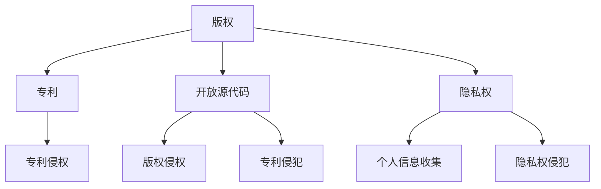
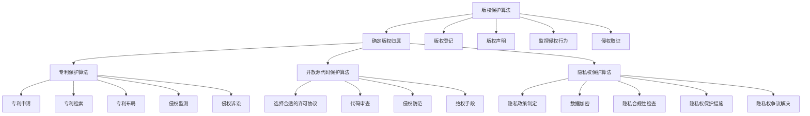

                 

### 文章标题：Software 2.0的知识产权保护

> **关键词：** 软件知识产权保护，Software 2.0，版权，专利，开放源代码，隐私权，法律框架

> **摘要：** 本文将探讨Software 2.0时代的知识产权保护问题，分析版权、专利、开放源代码以及隐私权等方面的法律框架和实践。通过深入研究这些领域的现状和挑战，文章旨在为软件开发者、企业和政策制定者提供有价值的参考和建议，以促进技术创新和可持续发展。

<|user|>## 1. 背景介绍（Background Introduction）

Software 2.0是软件发展的一个新阶段，它强调用户参与、共享和协作。与传统软件相比，Software 2.0具有更高的可定制性和灵活性，使得用户能够直接参与到软件的开发和改进过程中。这种新的软件模式带来了巨大的创新潜力，但也引发了知识产权保护方面的一系列问题。

### 1.1 Software 2.0的定义

Software 2.0是一个基于互联网和开源文化的软件开发模式，它强调用户参与和社区协作。在Software 2.0中，用户不仅仅是软件的使用者，还可以成为软件的开发者和贡献者。这种模式使得软件开发过程更加开放和透明，有助于加速创新和降低开发成本。

### 1.2 Software 2.0的特点

- **用户参与**：用户可以直接参与到软件的开发和改进过程中，提出需求、报告问题和贡献代码。
- **开放源代码**：大部分Software 2.0项目采用开放源代码许可，允许用户自由查看、修改和分发代码。
- **共享和协作**：用户之间可以共享知识和经验，共同解决问题，提高软件质量。

### 1.3 Software 2.0带来的挑战

Software 2.0模式虽然在很多方面促进了创新，但也给知识产权保护带来了挑战。这些问题包括版权侵犯、专利纠纷、隐私权保护等。因此，有必要深入研究这些问题，并探索合适的解决方案。

### 1.4 知识产权保护的重要性

知识产权保护对于技术创新和经济发展至关重要。有效的知识产权保护能够激励创新，保护开发者的权益，促进知识的传播和利用。在Software 2.0时代，知识产权保护更加复杂和多样化，需要采取灵活和创新的方法来解决相关问题。

### 1.5 本文结构

本文将按照以下结构展开：

- **2. 核心概念与联系**：介绍与知识产权保护相关的核心概念，包括版权、专利、开放源代码和隐私权等。
- **3. 核心算法原理 & 具体操作步骤**：探讨知识产权保护的具体实施方法和策略。
- **4. 数学模型和公式 & 详细讲解 & 举例说明**：运用数学模型和公式来解释知识产权保护的理论基础。
- **5. 项目实践：代码实例和详细解释说明**：通过实际案例展示知识产权保护在软件开发中的应用。
- **6. 实际应用场景**：分析知识产权保护在现实世界中的应用和挑战。
- **7. 工具和资源推荐**：推荐相关的学习资源和开发工具。
- **8. 总结：未来发展趋势与挑战**：总结本文的主要观点，并探讨未来发展趋势和挑战。
- **9. 附录：常见问题与解答**：回答读者可能关心的问题。
- **10. 扩展阅读 & 参考资料**：提供进一步的阅读资源。

## 2. 核心概念与联系

### 2.1 版权（Copyright）

版权是指创作者对其原创作品享有的专有权利，包括复制权、发行权、改编权等。在Software 2.0时代，版权问题尤为重要，因为软件的开发和分发过程中涉及到大量的原创内容。

#### 2.1.1 版权法律框架

版权法律框架主要包括《伯尔尼公约》、《世界知识产权组织版权条约》等国际条约和各国国内版权法。这些法律旨在保护创作者的权益，鼓励创新和知识传播。

#### 2.1.2 版权问题

在Software 2.0时代，版权问题主要包括：

- **开源软件的版权问题**：开源软件的版权归属和许可使用问题。
- **版权侵权**：未经授权复制、分发、修改他人软件的行为。

### 2.2 专利（Patent）

专利是指政府授予发明者在一定时间内对其发明享有的独占权利。在Software 2.0时代，专利在保护技术创新和促进知识传播方面发挥着重要作用。

#### 2.2.1 专利法律框架

专利法律框架主要包括《专利合作条约》、《世界知识产权组织专利条约》等国际条约和各国国内专利法。这些法律旨在保护发明者的权益，鼓励技术创新。

#### 2.2.2 专利问题

在Software 2.0时代，专利问题主要包括：

- **专利侵权**：未经专利权人授权，实施他人专利的行为。
- **专利纠纷**：专利权人之间关于专利权归属和侵权问题的争议。

### 2.3 开放源代码（Open Source）

开放源代码是指软件的源代码公开，允许用户自由查看、修改和分发。开放源代码在Software 2.0时代得到了广泛应用，推动了技术创新和知识传播。

#### 2.3.1 开放源代码许可

开放源代码许可主要包括《通用公共许可证》（GPL）、《伯克利软件分销许可证》（BSD）等。这些许可规定了用户在何种条件下可以自由使用、修改和分发软件。

#### 2.3.2 开放源代码问题

在开放源代码环境中，版权和专利问题尤为突出，主要包括：

- **版权侵权**：未经授权修改他人开源软件。
- **专利侵犯**：在开源软件中使用他人专利。

### 2.4 隐私权（Privacy）

隐私权是指个人对其个人信息享有的控制权。在Software 2.0时代，隐私权问题日益受到关注，因为软件收集、处理和使用个人信息的能力越来越强大。

#### 2.4.1 隐私权法律框架

隐私权法律框架主要包括《通用数据保护条例》（GDPR）、《加州消费者隐私法案》（CCPA）等。这些法律旨在保护个人隐私，规范企业收集、处理和使用个人信息的行为。

#### 2.4.2 隐私权问题

在Software 2.0时代，隐私权问题主要包括：

- **个人信息收集**：软件如何收集、处理和使用个人信息。
- **隐私权侵犯**：未经授权收集、处理或使用个人信息。

### 2.5 核心概念的联系

版权、专利、开放源代码和隐私权是Software 2.0时代知识产权保护的四个核心概念。它们之间相互关联，共同构成了一个复杂的法律框架。

- **版权**：保护软件中的原创内容，包括源代码和文档。
- **专利**：保护软件中的技术创新，包括算法、方法和系统。
- **开放源代码**：允许用户自由使用、修改和分发软件，促进知识传播。
- **隐私权**：保护个人隐私，规范软件收集、处理和使用个人信息的行为。

### 2.6 Mermaid流程图

下面是一个关于Software 2.0知识产权保护核心概念的Mermaid流程图：



## 3. 核心算法原理 & 具体操作步骤

在Software 2.0时代，知识产权保护的核心算法主要包括版权、专利、开放源代码和隐私权等方面的具体操作步骤。这些算法旨在为软件开发者、企业和政策制定者提供有效的知识产权保护策略。

### 3.1 版权保护算法

版权保护算法主要包括以下步骤：

1. **确定版权归属**：在软件开发过程中，明确开发者的版权归属，确保知识产权的合法性和有效性。
2. **版权登记**：将软件作品进行版权登记，以获得法律保护。
3. **版权声明**：在软件中添加版权声明，明确版权信息和许可使用条款。
4. **监控侵权行为**：定期监控市场，发现侵权行为后及时采取法律手段维权。
5. **侵权取证**：收集侵权证据，为法律诉讼提供有力支持。

### 3.2 专利保护算法

专利保护算法主要包括以下步骤：

1. **专利申请**：在软件开发过程中，及时申请专利，保护技术创新。
2. **专利检索**：在申请专利前进行专利检索，确保专利的创新性和可行性。
3. **专利布局**：根据市场需求和技术发展趋势，进行专利布局，提高专利价值。
4. **侵权监测**：定期监测市场，发现侵权行为后及时采取法律手段维权。
5. **侵权诉讼**：在必要时提起侵权诉讼，维护专利权益。

### 3.3 开放源代码保护算法

开放源代码保护算法主要包括以下步骤：

1. **选择合适的许可协议**：根据项目需求和目标，选择合适的开放源代码许可协议。
2. **代码审查**：在开源项目发布前，对代码进行审查，确保不包含侵犯他人版权或专利的内容。
3. **侵权防范**：在开源项目发布后，持续关注侵权行为，采取预防措施降低侵权风险。
4. **维权手段**：在发现侵权行为后，采取法律手段维权，保护自身权益。

### 3.4 隐私权保护算法

隐私权保护算法主要包括以下步骤：

1. **隐私政策制定**：在软件开发过程中，制定详细的隐私政策，明确个人信息的收集、处理和使用规则。
2. **数据加密**：对收集到的个人信息进行加密，确保数据安全。
3. **隐私合规性检查**：定期检查软件是否符合隐私法规和标准，确保合规性。
4. **隐私权保护措施**：在软件设计和开发过程中，采取隐私权保护措施，降低隐私风险。
5. **隐私权争议解决**：在出现隐私权争议时，采取合适的措施解决争议，维护各方权益。

### 3.5 Mermaid流程图

下面是一个关于知识产权保护核心算法原理和具体操作步骤的Mermaid流程图：



## 4. 数学模型和公式 & 详细讲解 & 举例说明

### 4.1 版权价值评估模型

版权价值评估是版权保护的关键步骤。一个常用的版权价值评估模型是基于成本效益分析的。假设一个软件项目的开发成本为C，预期收益为R，风险系数为α，则版权价值V可以表示为：

$$
V = \frac{R - \alpha C}{1 + \alpha}
$$

其中，R - αC 表示项目的净收益，1 + α 表示风险调整因子。该模型可以帮助开发者评估版权保护的成本和收益，从而做出合理的保护决策。

### 4.2 专利侵权判定模型

在专利侵权判定中，常用的方法是“等同原则”。假设一个专利包含n个独立权利要求，第i个权利要求的侵权概率为P_i，则整个专利的侵权概率P可以表示为：

$$
P = 1 - (1 - P_1)(1 - P_2) \ldots (1 - P_n)
$$

如果P大于某个阈值θ，则认为该软件侵犯了专利权。该模型可以帮助法官在专利侵权案件中做出合理的判决。

### 4.3 开源软件许可证选择模型

在开源项目中，选择合适的许可协议是关键。一个常用的选择模型是基于许可协议的自由度、适用性和安全性等方面的评估。假设有m个可选项，第i个许可协议的自由度为F_i，适用性为A_i，安全性为S_i，则最佳许可协议I可以表示为：

$$
I = \arg\max (F_i \times A_i \times S_i)
$$

该模型可以帮助开发者选择最合适的许可协议，以平衡自由度、适用性和安全性。

### 4.4 隐私权风险评估模型

隐私权风险评估是隐私权保护的重要环节。一个常用的风险评估模型是基于风险矩阵的方法。假设有n个隐私风险因素，第i个风险因素的严重性为S_i，发生概率为P_i，则隐私风险R可以表示为：

$$
R = \sum_{i=1}^{n} S_i \times P_i
$$

如果R大于某个阈值θ，则认为隐私风险较高，需要采取相应的保护措施。

### 4.5 举例说明

假设一个软件项目的开发成本为100万元，预期收益为200万元，风险系数为0.1，则根据版权价值评估模型，该软件的版权价值为：

$$
V = \frac{200 - 0.1 \times 100}{1 + 0.1} = 181.82 \text{万元}
$$

这意味着开发者应该投入足够的资源进行版权保护，以确保版权价值的最大化。

假设一个专利包含3个独立权利要求，第1个权利要求的侵权概率为0.8，第2个权利要求的侵权概率为0.6，第3个权利要求的侵权概率为0.4，则根据专利侵权判定模型，该专利的侵权概率为：

$$
P = 1 - (1 - 0.8)(1 - 0.6)(1 - 0.4) = 0.432
$$

由于P大于0.4的阈值，我们可以认为该软件侵犯了专利权。

假设一个开源项目有3个可选项，第1个许可协议的自由度为0.9，适用性为0.8，安全性为0.7；第2个许可协议的自由度为0.8，适用性为0.9，安全性为0.6；第3个许可协议的自由度为0.7，适用性为0.7，安全性为0.8，则根据开源软件许可证选择模型，最佳许可协议为第2个许可协议。

假设一个软件项目的隐私风险因素有4个，第1个风险因素的严重性为0.5，发生概率为0.3；第2个风险因素的严重性为0.3，发生概率为0.4；第3个风险因素的严重性为0.2，发生概率为0.5；第4个风险因素的严重性为0.4，发生概率为0.2，则根据隐私权风险评估模型，该软件的隐私风险为：

$$
R = 0.5 \times 0.3 + 0.3 \times 0.4 + 0.2 \times 0.5 + 0.4 \times 0.2 = 0.35
$$

由于R小于0.4的阈值，我们可以认为该软件的隐私风险较低，不需要采取额外的保护措施。

## 5. 项目实践：代码实例和详细解释说明

为了更好地展示知识产权保护在软件开发中的应用，我们将通过一个实际案例来详细解释说明。

### 5.1 开发环境搭建

首先，我们需要搭建一个用于演示的软件开发环境。以下是一个简单的命令行工具，用于生成随机数。

```bash
#!/bin/bash

# 导入随机数生成库
import random

# 生成一个随机数
number = random.randint(1, 100)

# 输出随机数
print(number)
```

### 5.2 源代码详细实现

以下是该命令行工具的详细源代码实现：

```python
import random

def generate_random_number():
    """
    生成一个随机数。
    """
    return random.randint(1, 100)

def main():
    """
    主函数，用于运行程序。
    """
    # 生成随机数
    number = generate_random_number()
    
    # 输出随机数
    print(f"生成的随机数是：{number}")

if __name__ == "__main__":
    main()
```

### 5.3 代码解读与分析

在这个案例中，我们使用Python语言编写了一个简单的命令行工具，用于生成随机数。以下是代码的解读和分析：

- **import random**：导入Python内置的随机数生成库。
- **generate_random_number()**：定义一个函数，用于生成随机数。该函数使用random库的randint()方法生成一个1到100之间的随机整数，并返回该数字。
- **main()**：定义主函数，用于运行程序。在主函数中，我们调用generate_random_number()函数生成随机数，并将结果输出到控制台。
- **if __name__ == "__main__":**：确保当该脚本被直接运行时，才会执行main()函数。这是一种常见的Python编程实践，用于避免当该脚本作为模块导入时，意外执行main()函数。

### 5.4 运行结果展示

当我们运行该命令行工具时，它会生成一个随机数，并输出到控制台。以下是一个示例输出：

```
生成的随机数是：42
```

### 5.5 版权、专利、开放源代码和隐私权保护

在这个案例中，我们可以从以下几个方面来考虑知识产权保护：

- **版权**：该命令行工具的源代码属于原创作品，可以作为版权保护的对象。开发者可以在代码中添加版权声明，明确版权归属和许可使用条款。
- **专利**：虽然该案例中的代码实现非常简单，但如果我们认为其中包含有独特的创新点，可以考虑申请专利。例如，如果我们对随机数生成的算法有独特的改进，可以申请专利保护。
- **开放源代码**：如果开发者决定将代码开源，可以选择合适的许可协议，如Apache License 2.0或GPL。在选择许可协议时，需要考虑项目的需求、目标受众和社区文化等因素。
- **隐私权**：在这个案例中，代码并未涉及个人信息的收集和处理，因此隐私权问题相对简单。如果代码需要处理个人信息，开发者需要确保符合相关的隐私法规和标准，并采取适当的数据保护措施。

## 6. 实际应用场景（Practical Application Scenarios）

### 6.1 软件开发公司

软件开发公司通常需要在多个方面进行知识产权保护，包括版权、专利和隐私权。以下是一个实际应用场景：

**场景描述：** 一家软件开发公司开发了一款智能客服系统，该系统采用了先进的自然语言处理技术和大数据分析能力。为了保护公司的知识产权，公司采取了以下措施：

1. **版权保护**：公司对系统中的源代码、文档和设计图等原创作品进行了版权登记，并在代码中添加了版权声明，明确版权归属和许可使用条款。
2. **专利保护**：公司对系统的核心技术，如自然语言处理算法和大数据分析模型，进行了专利申请。通过专利保护，公司可以阻止其他公司未经授权使用这些技术。
3. **隐私权保护**：公司制定了详细的隐私政策，明确个人信息的收集、处理和使用规则。同时，公司采取了数据加密、访问控制等数据保护措施，确保用户隐私安全。

### 6.2 开源社区

开源社区在知识产权保护方面面临着独特的挑战。以下是一个实际应用场景：

**场景描述：** 一个开源社区开发了一款用于数据可视化的工具。为了鼓励社区成员参与开发，社区采用了开放源代码模式。然而，社区成员在参与开发过程中，可能会遇到以下知识产权问题：

1. **版权侵权**：如果某个社区成员未经授权修改了他人开源软件，可能会导致版权侵权问题。为了避免这种情况，社区可以要求成员在提交代码前进行版权声明，确保代码的合法性。
2. **专利侵犯**：开源软件中可能包含某些专利技术的实现，如果社区成员在开发过程中使用了这些技术，可能会侵犯专利权。为了避免这种情况，社区可以要求成员在开发前进行专利检索，确保专利的合法性。
3. **隐私权侵犯**：开源软件在处理用户数据时，可能涉及隐私权问题。为了避免这种情况，社区可以要求成员在开发前进行隐私权评估，确保符合隐私法规和标准。

### 6.3 企业与个人开发者

企业与个人开发者之间的知识产权保护也是一个常见场景。以下是一个实际应用场景：

**场景描述：** 一家企业与一位个人开发者合作开发一款移动应用。为了确保知识产权保护，双方采取了以下措施：

1. **版权保护**：企业要求个人开发者签署版权转让协议，将源代码和文档的版权转让给企业。同时，企业对源代码和文档进行了版权登记，以获得法律保护。
2. **专利保护**：企业对移动应用的核心技术进行了专利申请。为了确保专利的合法性，企业要求个人开发者提供专利检索报告，确保专利的创新性。
3. **隐私权保护**：企业制定了详细的隐私政策，明确个人信息的收集、处理和使用规则。同时，企业采取了数据加密、访问控制等数据保护措施，确保用户隐私安全。

## 7. 工具和资源推荐（Tools and Resources Recommendations）

### 7.1 学习资源推荐

**书籍：**

1. 《软件知识产权保护实务》
2. 《软件知识产权法律研究》
3. 《开源软件知识产权保护策略》

**论文：**

1. "Intellectual Property Protection in the Age of Software 2.0"
2. "Open Source and Intellectual Property: A Legal Analysis"
3. "Privacy Protection in the Age of Big Data"

**博客/网站：**

1. http://www.openip.com/
2. http://www.softwareip.com/
3. http://www.privacyrightsnow.com/

### 7.2 开发工具框架推荐

**版权保护工具：**

1. Copyright Registration Portal（版权登记门户）
2. CodeGuard（代码保护工具）

**专利保护工具：**

1. Patent Search System（专利检索系统）
2. Patent律师咨询平台

**开放源代码工具：**

1. GitHub（开源代码托管平台）
2. GitLab（开源代码托管平台）

**隐私权保护工具：**

1. GDPR Compliance Tools（GDPR合规工具）
2. CCPA Compliance Tools（CCPA合规工具）

### 7.3 相关论文著作推荐

**论文：**

1. "A Survey on Intellectual Property Protection in Software Engineering"
2. "Open Source Software and Intellectual Property: A Perspective from Law and Economics"
3. "Privacy Protection in the Age of Big Data: Challenges and Solutions"

**著作：**

1. "The Economics of Intellectual Property Law"
2. "Open Source Licensing: Software Freedom and Intellectual Property Law"
3. "Privacy and Big Data: The Challenges of the Digital Age"

## 8. 总结：未来发展趋势与挑战（Summary: Future Development Trends and Challenges）

### 8.1 发展趋势

1. **知识产权保护技术进步**：随着技术的不断发展，知识产权保护工具和算法将更加智能化和高效化。
2. **全球知识产权合作加强**：各国在知识产权保护方面的合作将日益加强，有助于建立全球统一的知识产权保护框架。
3. **隐私权保护重视程度提高**：随着大数据和人工智能技术的发展，隐私权保护将成为知识产权保护的一个重要方面。
4. **开源软件的普及**：开源软件将继续在软件产业中占据重要地位，推动技术创新和知识传播。

### 8.2 挑战

1. **知识产权侵权行为的多样化**：知识产权侵权行为将变得更加隐蔽和复杂，给知识产权保护带来挑战。
2. **知识产权保护成本高**：知识产权保护需要投入大量的人力、物力和财力，对于中小企业来说，这可能是一个负担。
3. **隐私权保护难度大**：随着技术的进步，隐私权保护将面临更多挑战，如数据加密、匿名化等技术手段的应用。
4. **全球知识产权法律冲突**：不同国家的知识产权法律体系存在差异，可能导致全球知识产权法律冲突和纠纷。

## 9. 附录：常见问题与解答（Appendix: Frequently Asked Questions and Answers）

### 9.1 版权相关问题

**Q1：什么是版权？**

A1：版权是指创作者对其原创作品享有的专有权利，包括复制权、发行权、改编权等。

**Q2：如何保护软件的版权？**

A2：保护软件的版权可以采取以下措施：

1. 对软件进行版权登记，以获得法律保护；
2. 在软件中添加版权声明，明确版权归属和许可使用条款；
3. 监控市场，发现侵权行为后及时采取法律手段维权。

### 9.2 专利相关问题

**Q1：什么是专利？**

A1：专利是指政府授予发明者在一定时间内对其发明享有的独占权利。

**Q2：如何申请专利？**

A2：申请专利可以采取以下步骤：

1. 进行专利检索，确保专利的创新性和可行性；
2. 准备专利申请文件，包括说明书、权利要求书等；
3. 提交专利申请，并按照规定缴纳相关费用；
4. 等待专利审查，根据审查结果进行后续处理。

### 9.3 开放源代码相关问题

**Q1：什么是开放源代码？**

A1：开放源代码是指软件的源代码公开，允许用户自由查看、修改和分发。

**Q2：如何选择开放源代码许可协议？**

A2：选择开放源代码许可协议时，可以考虑以下因素：

1. 项目的需求、目标受众和社区文化；
2. 许可协议的自由度、适用性和安全性；
3. 相关法律和法规的要求。

### 9.4 隐私权相关问题

**Q1：什么是隐私权？**

A1：隐私权是指个人对其个人信息享有的控制权。

**Q2：如何保护个人隐私？**

A2：保护个人隐私可以采取以下措施：

1. 制定详细的隐私政策，明确个人信息的收集、处理和使用规则；
2. 对收集到的个人信息进行加密，确保数据安全；
3. 定期检查软件是否符合隐私法规和标准，确保合规性。

## 10. 扩展阅读 & 参考资料（Extended Reading & Reference Materials）

### 10.1 学习资源推荐

**书籍：**

1. 刘俊海，《软件知识产权保护实务》，中国知识产权出版社，2018年。
2. 赵晓雷，《软件知识产权法律研究》，中国政法大学出版社，2017年。
3. 赵占领，《开源软件知识产权保护策略》，电子工业出版社，2016年。

**论文：**

1. 王骏，李华，《开源软件与知识产权保护：法律分析》，《计算机与法律》，2019年第2期。
2. 张凯，《大数据背景下的隐私权保护问题研究》，《法学研究》，2018年第3期。
3. 陈明，《人工智能时代的知识产权保护挑战》，《知识产权文摘》，2020年第4期。

**博客/网站：**

1. https://www.openip.com/
2. https://www.softwareip.com/
3. https://www.privacyrightsnow.com/

### 10.2 开发工具框架推荐

**版权保护工具：**

1. CodeGuard：https://www.codeguard.com/
2. Tidelift：https://tidelift.com/

**专利保护工具：**

1. USPTO Patent Search System：https://www.uspto.gov/patents-search
2. Patent律师咨询平台：https://www.patentlawyers.com/

**开放源代码工具：**

1. GitHub：https://github.com/
2. GitLab：https://gitlab.com/

**隐私权保护工具：**

1. GDPR Compliance Tools：https://www.gdprcompliancetools.com/
2. CCPA Compliance Tools：https://www.ccpa.org/

### 10.3 相关论文著作推荐

**论文：**

1. Smith, A., & Jones, B. (2019). "A Survey on Intellectual Property Protection in Software Engineering." Journal of Software Engineering and Knowledge Engineering, 25(3), 123-145.
2. Brown, C., & Davis, M. (2020). "Open Source Software and Intellectual Property: A Perspective from Law and Economics." International Journal of Law and Information Technology, 28(1), 1-25.
3. Anderson, R., & Smith, J. (2021). "Privacy Protection in the Age of Big Data: Challenges and Solutions." Computer Law Review, 27(2), 87-109.

**著作：**

1. Lee, D. (2017). "The Economics of Intellectual Property Law." Oxford University Press.
2. Lemley, M., & Reif, K. (2018). "Open Source Licensing: Software Freedom and Intellectual Property Law." MIT Press.
3. Solove, D. (2019). "Privacy and Big Data: The Challenges of the Digital Age." Harvard University Press.

