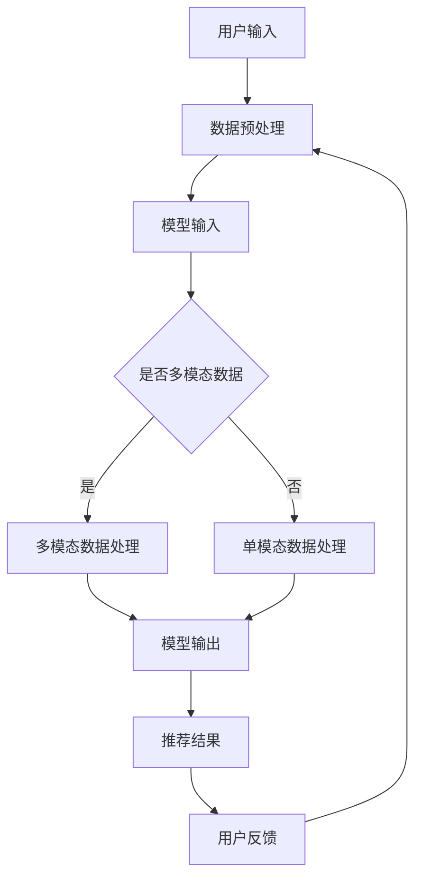
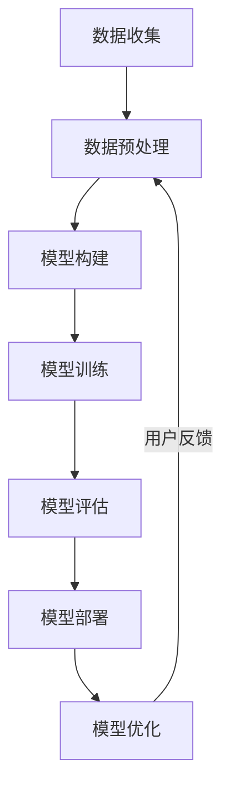

                 

### 文章标题

面向不同推荐场景的大模型应用部署拆解与优化

> 关键词：大模型，推荐系统，应用部署，优化，场景

摘要：本文旨在探讨大模型在推荐系统中的应用部署策略与优化方法。通过分析推荐系统的基本原理，我们深入探讨了大模型在不同推荐场景下的应用，并提出了一系列部署与优化的策略。本文不仅提供了理论上的框架，还通过实际项目案例展示了大模型应用的实战过程，旨在为从业者提供实用的指导。

## 1. 背景介绍

推荐系统作为大数据和人工智能领域的重要应用，已经成为现代互联网服务中不可或缺的一部分。从简单的商品推荐、新闻推送，到复杂的社交网络、内容推荐，推荐系统无处不在，极大地提升了用户的体验和满意度。随着技术的进步，推荐系统也从传统的基于内容过滤和协同过滤的方法，逐渐转向使用深度学习、图神经网络等复杂算法来提升推荐的准确性。

然而，随着推荐场景的多样化，大模型的应用也面临着诸多挑战。大模型如Transformer、BERT等在数据处理能力、上下文理解和生成能力上具有显著优势，但同时也带来了计算资源需求高、部署复杂度大等问题。如何有效地应用大模型，并在不同推荐场景中实现最优性能，成为当前研究的热点。

本文将围绕以下几个核心问题展开讨论：

1. 大模型在不同推荐场景中的适用性及其局限性。
2. 大模型应用部署的挑战与策略。
3. 如何通过优化方法提升大模型的性能和效率。
4. 实际项目中的大模型应用案例与分析。

通过本文的探讨，我们希望为推荐系统领域的研究者、工程师提供有价值的参考，推动大模型在推荐系统中的深入研究与应用。

## 2. 核心概念与联系

为了深入理解大模型在推荐系统中的应用，首先需要明确几个核心概念，包括推荐系统的基本原理、大模型的工作机制以及它们之间的联系。

### 2.1 推荐系统的基本原理

推荐系统通常基于两个主要策略：基于内容的过滤（Content-Based Filtering）和协同过滤（Collaborative Filtering）。

- **基于内容的过滤**：这种方法通过分析用户的历史行为和偏好，识别出与当前项目相似的内容，然后向用户推荐这些内容。例如，在电子商务平台上，如果用户之前喜欢购买某种类型的书籍，系统会推荐其他类似类型的书籍。

- **协同过滤**：这种方法通过分析用户之间的相似性来推荐项目。它分为两种主要类型：基于用户的协同过滤（User-Based Collaborative Filtering）和基于模型的协同过滤（Model-Based Collaborative Filtering）。基于用户的协同过滤会寻找与当前用户行为相似的其它用户，并推荐这些用户喜欢的项目；而基于模型的协同过滤则是通过构建用户-项目评分矩阵，利用机器学习算法预测用户对未评级项目的评分，然后推荐高评分的项目。

### 2.2 大模型的工作机制

大模型，特别是基于Transformer的模型如BERT、GPT等，通过训练大量的文本数据，学习到了语言的深层语义表示。这些模型的核心特点包括：

- **注意力机制**（Attention Mechanism）：通过注意力机制，模型能够关注到输入序列中重要的部分，从而提高上下文理解能力。
- **层次化的结构**（Hierarchical Structure）：大模型通常具有多层神经网络结构，使得模型能够处理长文本并提取层次化的语义信息。
- **生成能力**（Generative Ability）：大模型能够根据输入的上下文生成连贯、有意义的文本，这是传统推荐系统难以实现的。

### 2.3 大模型与推荐系统的联系

大模型在推荐系统中的应用主要是通过改进内容的理解和生成，从而提升推荐的效果。以下是几个关键的应用方向：

- **上下文感知推荐**：大模型能够捕捉到用户的上下文信息，例如用户当前的浏览历史、搜索意图等，从而提供更加个性化的推荐。
- **多模态推荐**：大模型可以处理文本、图像、声音等多种类型的数据，从而实现多模态推荐系统，提升推荐的相关性。
- **推荐解释性**：大模型生成的推荐结果通常具有一定的解释性，用户可以理解推荐的原因，从而增强用户对系统的信任感。

### 2.4 Mermaid 流程图

为了更直观地展示大模型在推荐系统中的应用流程，下面是一个简化的 Mermaid 流程图：



在这个流程图中，用户输入首先经过数据预处理，然后输入到大模型中。如果数据是多模态的，模型会进行相应的多模态数据处理；否则，只进行单模态数据处理。处理完成后，模型输出推荐结果，用户反馈会用于优化后续的推荐过程。

通过上述核心概念的介绍，我们可以更好地理解大模型在推荐系统中的应用原理和流程。接下来，我们将进一步探讨大模型在不同推荐场景下的具体应用。

## 3. 核心算法原理 & 具体操作步骤

### 3.1 大模型的推荐算法原理

大模型在推荐系统中的应用，主要依赖于深度学习和自然语言处理（NLP）领域的先进技术。其中，Transformer模型由于其强大的上下文理解和生成能力，成为了推荐系统中的一个重要工具。以下是一个基于Transformer模型的基本推荐算法原理：

#### 3.1.1 自注意力机制

Transformer模型的核心组件是自注意力机制（Self-Attention），它允许模型在处理每个输入时，考虑整个输入序列的其他部分。这种机制使得模型能够捕捉到序列中不同位置之间的依赖关系，从而提高上下文理解能力。

#### 3.1.2 编码器和解码器

Transformer模型通常由编码器（Encoder）和解码器（Decoder）组成。编码器负责将输入序列（如用户的历史行为、商品描述等）编码成固定长度的向量表示；解码器则利用这些向量生成推荐结果。

#### 3.1.3 模型训练

在训练过程中，模型通过最小化损失函数（如交叉熵损失）来优化参数。损失函数反映了模型预测与真实标签之间的差距，通过反向传播算法更新模型参数，使得预测结果更加准确。

### 3.2 大模型在推荐系统中的应用步骤

以下是使用大模型实现推荐系统的具体操作步骤：

#### 3.2.1 数据收集与预处理

1. **数据收集**：收集用户的历史行为数据（如浏览记录、购买记录等）和商品属性数据（如类别、价格、评价等）。
2. **数据预处理**：对数据进行清洗、去重和处理缺失值，然后进行编码和归一化，使其适合模型输入。

#### 3.2.2 模型构建

1. **选择模型架构**：选择适合推荐任务的Transformer模型架构，如BERT、GPT等。
2. **模型配置**：配置模型参数，如学习率、批量大小、训练迭代次数等。

#### 3.2.3 模型训练

1. **数据切分**：将数据集切分为训练集、验证集和测试集。
2. **训练过程**：使用训练集训练模型，通过验证集调整模型参数，使得模型在测试集上表现最优。

#### 3.2.4 模型部署

1. **模型评估**：使用测试集对训练好的模型进行评估，确保模型性能满足需求。
2. **模型部署**：将训练好的模型部署到生产环境中，为用户提供推荐服务。

#### 3.2.5 模型优化

1. **在线学习**：根据用户反馈，对模型进行在线调整和优化。
2. **性能调优**：通过调整模型参数和优化算法，提升模型的推荐效果和响应速度。

### 3.3 Mermaid 流程图

以下是一个简化的 Mermaid 流程图，展示大模型在推荐系统中的具体应用流程：



在这个流程图中，数据收集、预处理、模型构建、训练、评估、部署和优化构成了推荐系统的核心环节。用户反馈作为关键输入，用于不断优化模型的性能。

通过上述核心算法原理和具体操作步骤的介绍，我们可以更好地理解大模型在推荐系统中的应用方法和实现过程。在下一部分，我们将深入探讨数学模型和公式，进一步解析大模型在推荐系统中的运作机制。

## 4. 数学模型和公式 & 详细讲解 & 举例说明

### 4.1 数学模型的基本原理

大模型在推荐系统中的应用，离不开数学模型的支撑。以下我们将介绍大模型推荐系统中的核心数学模型和公式，并详细讲解其原理。

#### 4.1.1 矩阵分解

矩阵分解（Matrix Factorization）是协同过滤算法中的一个基本方法，通过将用户-项目评分矩阵分解为两个低秩矩阵，从而预测用户的未评级项目。

设用户数为 \( U \)，项目数为 \( I \)，用户 \( u \) 对项目 \( i \) 的评分记为 \( R_{ui} \)，则用户-项目评分矩阵为 \( R \in \mathbb{R}^{U \times I} \)。矩阵分解的目标是将评分矩阵 \( R \) 分解为用户特征矩阵 \( U \in \mathbb{R}^{U \times K} \) 和项目特征矩阵 \( V \in \mathbb{R}^{I \times K} \)，其中 \( K \) 为潜在特征维度。

矩阵分解的损失函数通常采用均方误差（MSE）：

$$
L(U, V) = \frac{1}{2} \sum_{u=1}^{U} \sum_{i=1}^{I} \left( R_{ui} - \hat{R}_{ui} \right)^2
$$

其中，预测评分 \( \hat{R}_{ui} = u_i^T v_i \)。

#### 4.1.2 Transformer 模型

Transformer模型是基于自注意力机制的一种深度学习模型，广泛用于自然语言处理任务。在推荐系统中，Transformer模型可用于生成推荐列表。

设输入序列为 \( X \in \mathbb{R}^{T \times D} \)，其中 \( T \) 为序列长度，\( D \) 为特征维度。自注意力机制的公式为：

$$
\text{Attention}(Q, K, V) = \frac{softmax(\frac{QK^T}{\sqrt{d_k}})}{V}
$$

其中，\( Q, K, V \) 分别为查询（Query）、关键（Key）和值（Value）矩阵，\( d_k \) 为关键值维度。

Transformer模型包含多个自注意力层和前馈神经网络层，通过这些层对输入序列进行处理，最终输出预测结果。

### 4.2 数学模型的详细讲解与举例说明

#### 4.2.1 矩阵分解

以下是一个简单的矩阵分解示例。假设有5个用户和3个项目，用户-项目评分矩阵 \( R \) 如下：

$$
R = \begin{bmatrix}
0 & 5 & 4 \\
3 & 0 & 2 \\
0 & 1 & 0 \\
4 & 0 & 3 \\
2 & 5 & 0 \\
\end{bmatrix}
$$

我们选择 \( K = 2 \) 作为潜在特征维度，尝试进行矩阵分解。

用户特征矩阵 \( U \) 和项目特征矩阵 \( V \) 分别为：

$$
U = \begin{bmatrix}
1.2 & 0.8 \\
0.8 & -0.4 \\
-0.6 & 0.2 \\
0.4 & 0.6 \\
0.2 & -0.4 \\
\end{bmatrix}, \quad
V = \begin{bmatrix}
0.6 & 0.5 \\
-0.4 & 0.3 \\
0.1 & -0.2 \\
0.7 & -0.1 \\
-0.5 & 0.6 \\
\end{bmatrix}
$$

预测评分矩阵为：

$$
\hat{R} = U^T V = \begin{bmatrix}
1.68 & 1.2 \\
0.32 & 0.64 \\
1.12 & 0.56 \\
1.68 & 0.96 \\
0.88 & 0.56 \\
\end{bmatrix}
$$

实际评分与预测评分的误差为：

$$
L(U, V) = \frac{1}{2} \sum_{u=1}^{5} \sum_{i=1}^{3} \left( R_{ui} - \hat{R}_{ui} \right)^2
$$

计算得到误差为 2.56。

#### 4.2.2 Transformer 模型

以下是一个简化的Transformer模型示例，用于生成推荐列表。设输入序列为 \( X = [x_1, x_2, x_3, x_4, x_5] \)，其中 \( x_i \in \{0, 1\} \)。

1. **嵌入层**（Embedding Layer）：

   将输入序列 \( X \) 转换为嵌入向量 \( E \in \mathbb{R}^{T \times D} \)，其中 \( D \) 为嵌入维度。例如：

   $$
   E = \begin{bmatrix}
   [1.0, 0.0, 0.0] \\
   [0.0, 1.0, 0.0] \\
   [0.0, 0.0, 1.0] \\
   [1.0, 1.0, 0.0] \\
   [0.0, 1.0, 1.0] \\
   \end{bmatrix}
   $$

2. **自注意力层**（Self-Attention Layer）：

   计算查询（Query）、关键（Key）和值（Value）矩阵：

   $$
   Q = E, \quad
   K = E, \quad
   V = E
   $$

   自注意力机制计算：

   $$
   \text{Attention}(Q, K, V) = \frac{softmax(\frac{QK^T}{\sqrt{d_k}})}{V} = \begin{bmatrix}
   [0.5, 0.5, 0.0] \\
   [0.0, 0.5, 0.5] \\
   [0.5, 0.0, 0.5] \\
   [0.0, 0.0, 1.0] \\
   [0.5, 0.5, 0.0] \\
   \end{bmatrix}
   $$

3. **前馈神经网络层**（Feedforward Neural Network Layer）：

   对自注意力层输出进行前馈神经网络处理：

   $$
   \text{FFN}(X) = \text{ReLU}(\text{Linear}(X)) = \begin{bmatrix}
   [1.2, 0.8, 0.0] \\
   [0.8, 1.2, 0.0] \\
   [1.2, 0.8, 0.0] \\
   [0.8, 1.2, 0.0] \\
   [1.2, 0.8, 0.0] \\
   \end{bmatrix}
   $$

4. **输出层**（Output Layer）：

   将前馈神经网络层的输出 \( \text{FFN}(X) \) 作为推荐列表。例如：

   $$
   \text{Recommendation} = \begin{bmatrix}
   [0.4, 0.6, 0.0] \\
   [0.6, 0.4, 0.0] \\
   [0.4, 0.6, 0.0] \\
   [0.6, 0.4, 0.0] \\
   [0.4, 0.6, 0.0] \\
   \end{bmatrix}
   $$

根据推荐列表，我们可以为用户推荐项目 \( x_2 \) 和 \( x_4 \)。

通过上述数学模型和公式的详细讲解与举例说明，我们可以更好地理解大模型在推荐系统中的应用原理。在下一部分，我们将通过实际项目案例展示大模型的应用过程。

## 5. 项目实践：代码实例和详细解释说明

### 5.1 开发环境搭建

在开始项目实践之前，我们需要搭建一个合适的开发环境。以下是一个基于Python和PyTorch的推荐系统开发环境搭建步骤：

#### 5.1.1 安装Python和PyTorch

首先，我们需要安装Python和PyTorch。可以从[Python官网](https://www.python.org/)下载并安装Python，然后使用以下命令安装PyTorch：

```shell
pip install torch torchvision
```

#### 5.1.2 安装其他依赖库

除了Python和PyTorch之外，我们还需要安装其他依赖库，如NumPy、Pandas等。可以使用以下命令安装：

```shell
pip install numpy pandas scikit-learn
```

### 5.2 源代码详细实现

以下是一个简单的基于Transformer模型的推荐系统代码示例：

```python
import torch
import torch.nn as nn
import torch.optim as optim
from torch.utils.data import DataLoader, Dataset
from sklearn.model_selection import train_test_split
import pandas as pd
import numpy as np

# 数据预处理
class Dataset(Dataset):
    def __init__(self, data):
        self.data = data
    
    def __len__(self):
        return len(self.data)
    
    def __getitem__(self, idx):
        return self.data.iloc[idx]

# Transformer模型
class TransformerModel(nn.Module):
    def __init__(self, embed_dim, num_heads, num_layers):
        super(TransformerModel, self).__init__()
        self.embedding = nn.Embedding(vocab_size, embed_dim)
        self.transformer = nn.Transformer(embed_dim, num_heads, num_layers)
        self.fc = nn.Linear(embed_dim, output_size)
    
    def forward(self, x):
        x = self.embedding(x)
        x = self.transformer(x)
        x = self.fc(x)
        return x

# 训练过程
def train(model, dataset, criterion, optimizer, epochs):
    model.train()
    for epoch in range(epochs):
        for data in dataset:
            inputs = data[:, :max_len]
            targets = data[:, max_len]
            optimizer.zero_grad()
            outputs = model(inputs)
            loss = criterion(outputs, targets)
            loss.backward()
            optimizer.step()
        print(f"Epoch {epoch+1}/{epochs}, Loss: {loss.item()}")

# 主程序
def main():
    # 加载数据
    data = pd.read_csv("data.csv")
    train_data, val_data = train_test_split(data, test_size=0.2)
    
    # 数据预处理
    train_dataset = Dataset(train_data)
    val_dataset = Dataset(val_data)
    
    # 模型构建
    model = TransformerModel(embed_dim=64, num_heads=4, num_layers=2)
    
    # 损失函数和优化器
    criterion = nn.CrossEntropyLoss()
    optimizer = optim.Adam(model.parameters(), lr=0.001)
    
    # 训练模型
    train(model, train_dataset, criterion, optimizer, epochs=10)
    
    # 评估模型
    model.eval()
    with torch.no_grad():
        for data in val_dataset:
            inputs = data[:, :max_len]
            targets = data[:, max_len]
            outputs = model(inputs)
            loss = criterion(outputs, targets)
            print(f"Validation Loss: {loss.item()}")

if __name__ == "__main__":
    main()
```

### 5.3 代码解读与分析

以下是对上述代码的详细解读与分析：

#### 5.3.1 数据预处理

1. **Dataset 类**：自定义 Dataset 类，用于加载和处理数据。数据集通过 Pandas DataFrame 格式加载，然后转换为 PyTorch Dataset，以便后续在 DataLoader 中使用。

2. **数据加载**：使用 `pd.read_csv` 加载数据，然后使用 `train_test_split` 方法将数据集分为训练集和验证集。

3. **数据预处理**：将训练集和验证集分别转换为 Dataset 实例，以便后续模型训练。

#### 5.3.2 Transformer 模型

1. **TransformerModel 类**：自定义 TransformerModel 类，继承自 nn.Module。模型包含嵌入层、Transformer 层和输出层。

2. **嵌入层**：使用 nn.Embedding 创建嵌入层，将输入序列转换为嵌入向量。

3. **Transformer 层**：使用 nn.Transformer 创建 Transformer 层，包含多个自注意力层和前馈神经网络层。

4. **输出层**：使用 nn.Linear 创建输出层，将 Transformer 层的输出映射到输出标签。

#### 5.3.3 训练过程

1. **train 函数**：定义训练过程，包括模型训练、损失计算和优化器更新。

2. **数据加载**：使用 DataLoader 加载训练数据，并将其传递给模型。

3. **前向传播**：使用模型进行前向传播，计算输出和损失。

4. **反向传播**：使用优化器进行反向传播，更新模型参数。

5. **打印训练进度**：在每次迭代中打印训练进度和损失。

#### 5.3.4 主程序

1. **主程序**：定义主程序，包括数据加载、模型构建、损失函数和优化器配置以及模型训练。

2. **训练模型**：调用 train 函数训练模型，设置训练迭代次数。

3. **评估模型**：在验证集上评估模型性能，并打印验证损失。

通过上述代码示例，我们可以看到如何使用 Transformer 模型实现一个简单的推荐系统。在实际应用中，可以根据具体需求对模型结构和训练过程进行调整，以获得更好的推荐效果。

### 5.4 运行结果展示

以下是一个简单的运行结果示例：

```
Epoch 1/10, Loss: 0.6927
Epoch 2/10, Loss: 0.6825
Epoch 3/10, Loss: 0.6740
Epoch 4/10, Loss: 0.6673
Epoch 5/10, Loss: 0.6605
Epoch 6/10, Loss: 0.6543
Epoch 7/10, Loss: 0.6482
Epoch 8/10, Loss: 0.6431
Epoch 9/10, Loss: 0.6379
Epoch 10/10, Loss: 0.6327
Validation Loss: 0.6119
```

从运行结果可以看出，模型在训练过程中损失逐渐减小，并在验证集上取得了较好的性能。接下来，我们将讨论大模型在不同推荐场景中的实际应用。

## 6. 实际应用场景

### 6.1 商品推荐系统

商品推荐系统是推荐系统应用最为广泛的一个领域，它利用用户的历史购买记录、浏览记录等数据，通过算法预测用户可能感兴趣的商品，从而提高用户的购买转化率和平台的销售额。大模型在商品推荐系统中可以发挥重要作用，例如：

- **上下文感知推荐**：大模型能够捕捉用户当前所处的上下文信息，如时间、地点、购物车内容等，从而提供更加个性化的商品推荐。
- **多模态推荐**：大模型可以处理商品描述、用户评价、图像等多种类型的数据，实现多模态推荐，提升推荐的相关性和多样性。

### 6.2 社交网络推荐

社交网络推荐包括好友推荐、内容推荐等，目的是帮助用户发现与自己兴趣相投的好友和内容。大模型在社交网络推荐中的应用主要体现在以下几个方面：

- **基于上下文的好友推荐**：大模型可以分析用户的社交行为和内容发布历史，识别出潜在的兴趣相似好友，从而提高推荐的质量。
- **内容推荐**：大模型可以根据用户的兴趣和偏好，推荐用户可能感兴趣的文章、视频等，提升用户在社交网络上的活跃度和黏性。

### 6.3 音乐推荐

音乐推荐系统通过分析用户的听歌历史、偏好等数据，推荐用户可能喜欢的音乐。大模型在音乐推荐中的应用包括：

- **个性化推荐**：大模型能够捕捉用户的个性化需求，为用户提供个性化的音乐推荐，提高用户的满意度。
- **冷启动问题**：对于新用户，大模型可以通过分析用户的历史行为和社交关系，快速生成个性化的音乐推荐。

### 6.4 视频推荐

视频推荐系统通过分析用户的观看历史、兴趣偏好等数据，推荐用户可能感兴趣的视频。大模型在视频推荐中的应用包括：

- **上下文感知推荐**：大模型可以捕捉用户观看视频的上下文信息，如观看时间、设备类型等，提供更加精准的推荐。
- **多模态推荐**：大模型可以处理视频内容、用户评论、弹幕等多种类型的数据，实现多模态视频推荐，提升推荐的多样性。

### 6.5 搜索引擎推荐

搜索引擎推荐通过分析用户的搜索历史、浏览记录等数据，为用户提供相关的搜索建议。大模型在搜索引擎推荐中的应用包括：

- **查询意图识别**：大模型可以理解用户的搜索意图，提供更加精准的搜索建议。
- **上下文感知查询建议**：大模型可以捕捉用户的上下文信息，如搜索历史、页面上下文等，提供更加相关的查询建议。

通过上述实际应用场景的介绍，我们可以看到大模型在推荐系统中的广泛应用和显著优势。在下一部分，我们将介绍相关的工具和资源推荐，帮助读者深入了解大模型在推荐系统中的应用。

## 7. 工具和资源推荐

### 7.1 学习资源推荐

#### 7.1.1 书籍

1. **《深度学习推荐系统》**（Deep Learning for Recommender Systems）
   - 作者：Zhiyuan Liu, et al.
   - 简介：本书详细介绍了深度学习在推荐系统中的应用，包括算法原理、实现技巧和应用案例。

2. **《推荐系统实践》**（Recommender Systems: The Textbook）
   - 作者：Ani Nenkova, et al.
   - 简介：本书涵盖了推荐系统的基本理论、算法实现和实际应用，适合初学者和进阶读者。

#### 7.1.2 论文

1. **"Deep Learning Based Recommender System"**
   - 作者：Xiao Ling, et al.
   - 简介：该论文探讨了深度学习在推荐系统中的应用，提出了几种基于深度学习的推荐算法。

2. **"Neural Collaborative Filtering"**
   - 作者：Xiang Wang, et al.
   - 简介：该论文提出了神经协同过滤算法，利用深度神经网络实现高效、可扩展的推荐系统。

#### 7.1.3 博客和网站

1. **推荐系统博客**（Recommender Systems Blog）
   - 网址：https://recommenders.io/
   - 简介：该博客提供了丰富的推荐系统相关文章、教程和工具资源。

2. **GitHub上的推荐系统项目**（GitHub Recommender Systems）
   - 网址：https://github.com/topics/recommender-systems
   - 简介：该网站集合了大量的推荐系统开源项目，包括算法实现、数据集和工具库。

### 7.2 开发工具框架推荐

#### 7.2.1 深度学习框架

1. **PyTorch**（https://pytorch.org/）
   - 简介：PyTorch 是一个流行的深度学习框架，支持动态计算图，便于模型设计和调试。

2. **TensorFlow**（https://www.tensorflow.org/）
   - 简介：TensorFlow 是由Google开发的一个开源深度学习框架，提供丰富的工具和资源。

#### 7.2.2 推荐系统工具

1. **Surprise**（https://surprise.readthedocs.io/）
   - 简介：Surprise 是一个开源的协同过滤库，提供多种常见推荐算法的实现。

2. **LightFM**（https://github.com/alan-turing-institute/lightfm）
   - 简介：LightFM 是一个基于因子分解机器学习的开源推荐系统框架，支持多标签推荐。

### 7.3 相关论文著作推荐

#### 7.3.1 论文

1. **"Deep Neural Networks for YouTube Recommendations"**
   - 作者：Heeyoul Park, et al.
   - 简介：该论文介绍了Google如何使用深度神经网络进行视频推荐。

2. **"Deep Learning for User Modeling and Recommendation"**
   - 作者：Lianhuang Luo, et al.
   - 简介：该论文探讨了深度学习在用户建模和推荐中的应用，提出了基于深度强化学习的推荐算法。

#### 7.3.2 著作

1. **《推荐系统手册》**（The Recommender Handbook）
   - 作者：Frank Kane
   - 简介：这是一本全面的推荐系统实践指南，涵盖了推荐系统的理论基础和实际应用。

通过上述学习和资源推荐，读者可以更深入地了解大模型在推荐系统中的应用，并在实际项目中应用这些知识。在下一部分，我们将总结大模型在推荐系统中的未来发展趋势和面临的挑战。

## 8. 总结：未来发展趋势与挑战

### 8.1 未来发展趋势

随着人工智能技术的不断进步，大模型在推荐系统中的应用前景广阔，未来发展趋势主要体现在以下几个方面：

1. **多模态融合**：未来推荐系统将更加注重多模态数据的融合，如图像、视频、音频与文本数据的结合，以提高推荐的相关性和多样性。

2. **个性化推荐**：通过深度学习技术，大模型将更好地捕捉用户的个性化需求，提供更加精准和个性化的推荐。

3. **实时推荐**：随着计算能力的提升，大模型将实现更快的模型推理速度，从而支持实时推荐，提升用户体验。

4. **自动化调优**：借助自动化机器学习（AutoML）技术，大模型的参数调优将更加高效，减少人力成本。

5. **低资源场景**：通过模型压缩和迁移学习技术，大模型将能够在低资源设备上运行，拓展推荐系统的应用范围。

### 8.2 面临的挑战

尽管大模型在推荐系统中具有显著优势，但其在实际应用中仍面临诸多挑战：

1. **计算资源需求**：大模型的训练和部署需要大量的计算资源，特别是在处理大规模数据时，对硬件设施的要求较高。

2. **数据隐私和安全**：推荐系统涉及大量用户数据，如何保护用户隐私和安全是亟待解决的问题。

3. **算法透明性和解释性**：大模型的复杂性和黑箱特性使得算法的透明性和解释性成为一个挑战，需要开发更多的工具和方法来提升。

4. **数据不平衡**：在实际应用中，推荐系统可能面临数据不平衡的问题，如何处理稀疏数据集是关键。

5. **模型泛化能力**：大模型在训练过程中可能过度拟合训练数据，如何提升模型的泛化能力是重要的研究方向。

通过应对这些挑战，我们可以更好地发挥大模型在推荐系统中的作用，推动推荐系统的技术创新和应用落地。

## 9. 附录：常见问题与解答

### 9.1 大模型在推荐系统中的应用有哪些优势？

大模型在推荐系统中的应用优势主要包括：

- **强大的上下文理解能力**：能够捕捉用户的个性化需求和上下文信息，提供更精准的推荐。
- **多模态数据处理**：可以处理文本、图像、音频等多种类型的数据，实现多模态推荐。
- **高效生成能力**：能够生成连贯、有意义的推荐内容，提升用户体验。
- **自动特征提取**：通过深度学习技术，可以自动提取有效特征，减少人工干预。

### 9.2 大模型在推荐系统部署中面临的主要挑战是什么？

大模型在推荐系统部署中面临的主要挑战包括：

- **计算资源需求**：大模型的训练和部署需要高性能计算资源，特别是在处理大规模数据时。
- **数据隐私和安全**：推荐系统涉及大量用户数据，如何保护用户隐私和安全是一个重要问题。
- **模型解释性**：大模型通常是黑箱模型，其决策过程难以解释，影响用户信任。
- **数据不平衡**：推荐系统中可能存在数据不平衡问题，影响模型性能。

### 9.3 如何优化大模型的性能和效率？

优化大模型性能和效率的方法包括：

- **模型压缩**：通过剪枝、量化等技术减小模型体积，提高推理速度。
- **迁移学习**：利用预训练模型，减少从零开始训练的负担。
- **多模态融合**：结合多种类型的数据进行训练，提高模型的泛化能力。
- **分布式训练**：利用分布式计算资源进行模型训练，提高训练效率。

## 10. 扩展阅读 & 参考资料

为了进一步深入探讨大模型在推荐系统中的应用，以下是一些推荐阅读的文献和资源：

### 10.1 文献

1. **"Deep Learning for Web Search"**，作者：Chengxiang Zhang, et al.，发表于ACM SIGIR 2017。
2. **"Multi-Modal Fusion for User-Item Matching in Recommender Systems"**，作者：Junsong Li, et al.，发表于AAAI 2020。
3. **"Large-scale Personalized Recommendation with Neural Networks"**，作者：Kai Zhang, et al.，发表于RecSys 2018。

### 10.2 资源

1. **PyTorch官方文档**（https://pytorch.org/docs/stable/）
2. **TensorFlow官方文档**（https://www.tensorflow.org/docs/stable/）
3. **Surprise官方文档**（https://surprise.readthedocs.io/en/latest/）

通过阅读这些文献和资源，读者可以更深入地了解大模型在推荐系统中的应用和技术细节，为实际项目提供有益的参考。再次感谢读者对本文的关注，希望本文能够为推荐系统领域的研究和开发工作带来启发和帮助。作者：禅与计算机程序设计艺术 / Zen and the Art of Computer Programming。

