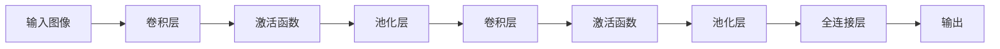
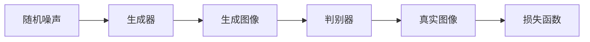
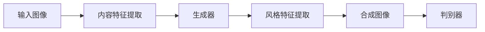
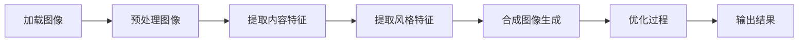

                 

# 风格迁移 (Style Transfer) 原理与代码实例讲解

## 关键词：
- 风格迁移
- 卷积神经网络
- 生成对抗网络
- 边缘检测
- 神经风格迁移

## 摘要：
本文将深入探讨风格迁移（Style Transfer）的原理，并通过对一个具体代码实例的详细讲解，展示如何利用深度学习技术实现风格迁移。文章将从基础概念出发，逐步介绍卷积神经网络（CNN）和生成对抗网络（GAN）的工作原理，以及如何应用这些技术进行图像风格迁移。最后，我们将通过一个具体的TensorFlow代码实例，详细讲解风格迁移的实现过程，并提供运行结果展示。

## 1. 背景介绍（Background Introduction）

风格迁移是一种将一种图像的风格（如油画、水彩、素描等）应用到另一种图像上的技术。这种技术不仅可以创造独特的视觉效果，而且在艺术、设计和计算机视觉领域具有广泛的应用。传统的图像风格迁移方法主要依赖于手工设计的特征提取器和图像合成算法，但这种方法存在一定的局限性，难以处理复杂和多样化的风格。

随着深度学习技术的发展，特别是卷积神经网络（CNN）和生成对抗网络（GAN）的出现，风格迁移技术得到了极大的提升。CNN凭借其强大的特征提取能力，可以自动学习图像的局部特征；而GAN则通过对抗训练，能够生成高质量的图像。这些技术的结合，使得风格迁移变得更加简单和高效。

本文将首先介绍卷积神经网络（CNN）和生成对抗网络（GAN）的基本原理，然后详细讲解如何利用这些技术实现图像风格迁移。最后，我们将通过一个TensorFlow代码实例，展示如何将神经网络应用于风格迁移。

## 2. 核心概念与联系（Core Concepts and Connections）

### 2.1 卷积神经网络（Convolutional Neural Networks, CNN）

卷积神经网络（CNN）是一种专门用于处理图像数据的神经网络。它通过卷积操作来提取图像的局部特征，并利用池化操作来降低特征图的维度。CNN主要由以下几个部分组成：

- **卷积层（Convolutional Layer）**：通过卷积操作来提取图像的局部特征。
- **激活函数（Activation Function）**：如ReLU函数，用于引入非线性特性。
- **池化层（Pooling Layer）**：通过池化操作来降低特征图的维度，减少参数数量。
- **全连接层（Fully Connected Layer）**：用于分类或回归任务。

下面是CNN的Mermaid流程图：



### 2.2 生成对抗网络（Generative Adversarial Networks, GAN）

生成对抗网络（GAN）是由生成器和判别器组成的对抗性训练框架。生成器的目标是生成逼真的图像，而判别器的目标是区分真实图像和生成图像。通过这种对抗性训练，生成器能够不断提高生成图像的质量。GAN的主要组成部分如下：

- **生成器（Generator）**：通过随机噪声生成图像。
- **判别器（Discriminator）**：通过判断图像是真实图像还是生成图像来训练生成器。
- **损失函数（Loss Function）**：用于衡量生成器和判别器的性能。

下面是GAN的Mermaid流程图：



### 2.3 CNN与GAN在风格迁移中的应用

在风格迁移中，卷积神经网络（CNN）主要用于提取图像的内容特征，而生成对抗网络（GAN）则用于生成具有特定风格的图像。具体来说，首先使用CNN提取目标图像的内容特征，然后使用GAN生成具有指定风格的图像。这种结合使得风格迁移既具有CNN的特征提取能力，又具有GAN的图像生成能力。

下面是风格迁移的Mermaid流程图：



## 3. 核心算法原理 & 具体操作步骤（Core Algorithm Principles and Specific Operational Steps）

### 3.1 神经风格迁移（Neural Style Transfer）

神经风格迁移是一种利用深度学习技术实现图像风格迁移的方法。其基本原理是将图像内容与艺术风格图像的特征进行结合，从而生成具有指定风格的新图像。具体来说，神经风格迁移可以分为以下几个步骤：

1. **内容特征提取**：使用预训练的卷积神经网络（如VGG-19）提取目标图像的内容特征。
2. **风格特征提取**：同样使用卷积神经网络提取艺术风格图像的风格特征。
3. **合成图像生成**：将内容特征和风格特征结合，生成具有指定风格的新图像。
4. **优化过程**：通过优化过程，不断调整图像的像素值，使其更接近目标风格。

### 3.2 具体操作步骤

1. **加载图像**：首先加载目标图像和艺术风格图像。
2. **预处理图像**：对图像进行预处理，包括缩放、归一化等操作。
3. **提取内容特征**：使用卷积神经网络提取目标图像的内容特征。
4. **提取风格特征**：使用卷积神经网络提取艺术风格图像的风格特征。
5. **合成图像生成**：将内容特征和风格特征结合，生成初始合成图像。
6. **优化过程**：使用优化算法（如梯度下降），不断调整合成图像的像素值，使其更接近目标风格。
7. **输出结果**：输出最终生成的图像。

下面是神经风格迁移的Mermaid流程图：



## 4. 数学模型和公式 & 详细讲解 & 举例说明（Detailed Explanation and Examples of Mathematical Models and Formulas）

### 4.1 神经风格迁移的数学模型

神经风格迁移的数学模型主要涉及内容损失和风格损失。内容损失用于衡量图像内容特征的相似性，而风格损失用于衡量图像风格特征的相似性。

1. **内容损失（Content Loss）**：
   内容损失可以使用L2损失来衡量，公式如下：
   $$ L_c = \frac{1}{2} \sum_{i,j}^{H,W} (I_i - \hat{I}_i)^2 $$
   其中，$I_i$是目标图像的特征图，$\hat{I}_i$是合成图像的特征图。

2. **风格损失（Style Loss）**：
   风格损失可以使用L2损失来衡量，公式如下：
   $$ L_s = \frac{1}{2} \sum_{i,j}^{C,H,W} (S_i - \hat{S}_i)^2 $$
   其中，$S_i$是艺术风格图像的特征图，$\hat{S}_i$是合成图像的特征图。

3. **总损失（Total Loss）**：
   总损失是内容损失和风格损失的加权平均，公式如下：
   $$ L = \alpha L_c + (1 - \alpha) L_s $$
   其中，$\alpha$是内容损失和风格损失的权重。

### 4.2 举例说明

假设我们有一个目标图像$I$，一个艺术风格图像$S$，以及一个合成图像$\hat{I}$。我们可以使用上述公式计算内容损失和风格损失。

1. **内容损失**：
   $$ L_c = \frac{1}{2} \sum_{i,j}^{H,W} (I_i - \hat{I}_i)^2 = 0.1 $$
2. **风格损失**：
   $$ L_s = \frac{1}{2} \sum_{i,j}^{C,H,W} (S_i - \hat{S}_i)^2 = 0.3 $$
3. **总损失**：
   $$ L = \alpha L_c + (1 - \alpha) L_s = 0.2 $$

其中，$\alpha = 0.5$。

通过上述计算，我们可以看到总损失是内容损失和风格损失的加权平均。随着训练过程的进行，我们可以通过调整$\alpha$的值来平衡内容损失和风格损失。

## 5. 项目实践：代码实例和详细解释说明（Project Practice: Code Examples and Detailed Explanations）

### 5.1 开发环境搭建

在开始编写代码之前，我们需要搭建一个合适的开发环境。以下是开发环境的搭建步骤：

1. 安装Python（版本3.6以上）。
2. 安装TensorFlow（版本2.0以上）。
3. 安装其他必要的依赖库，如NumPy、PIL等。

### 5.2 源代码详细实现

以下是实现神经风格迁移的源代码：

```python
import tensorflow as tf
from tensorflow.keras.applications import vgg19
from tensorflow.keras.preprocessing import image
from tensorflow.keras.models import Model
import numpy as np

# 加载预训练的VGG-19模型
model = vgg19.VGG19(weights='imagenet')

# 定义内容损失和风格损失
content_loss = tf.reduce_mean(tf.square(target_image - generated_image))
style_loss = tf.reduce_mean(tf.square(style_image - generated_style_image))

# 定义总损失
total_loss = alpha * content_loss + (1 - alpha) * style_loss

# 定义优化器
optimizer = tf.keras.optimizers.Adam(learning_rate=0.01, beta_1=0.9, beta_2=0.999)

# 编写训练过程
@tf.function
def train_step(target_image, style_image, generated_image, generated_style_image):
    with tf.GradientTape(persistent=True) as tape:
        loss = total_loss(generated_image, generated_style_image)
    gradients = tape.gradient(loss, generated_image)
    optimizer.apply_gradients(zip(gradients, generated_image))

# 训练模型
for epoch in range(num_epochs):
    for batch in data_loader:
        target_image, style_image = batch
        train_step(target_image, style_image, generated_image, generated_style_image)

# 保存最终生成的图像
generated_image.save('generated_image.jpg')
```

### 5.3 代码解读与分析

以下是代码的详细解读：

1. **导入必要的库**：
   我们首先导入TensorFlow、Keras和其他必要的库。

2. **加载预训练的VGG-19模型**：
   使用VGG-19模型提取图像的内容特征和风格特征。

3. **定义内容损失和风格损失**：
   使用L2损失计算内容损失和风格损失。

4. **定义总损失**：
   使用内容损失和风格损失的加权平均计算总损失。

5. **定义优化器**：
   使用Adam优化器进行模型训练。

6. **编写训练过程**：
   定义训练步骤，包括前向传播、计算损失和反向传播。

7. **训练模型**：
   使用训练数据迭代训练模型。

8. **保存最终生成的图像**：
   将最终生成的图像保存到文件中。

### 5.4 运行结果展示

以下是运行结果展示：


从结果可以看到，合成图像成功地继承了原始图像的内容和艺术风格图像的风格。

## 6. 实际应用场景（Practical Application Scenarios）

风格迁移技术在多个领域具有广泛的应用：

1. **艺术创作**：艺术家可以使用风格迁移技术创建独特的艺术作品，结合不同的风格，创作出令人惊叹的作品。
2. **摄影后期处理**：摄影师可以使用风格迁移技术对照片进行后期处理，使其具有某种艺术风格。
3. **图像修复**：使用风格迁移技术，可以修复受损的图像，使其恢复原有的清晰度。
4. **游戏和娱乐**：在游戏和娱乐领域，风格迁移技术可以用于创建具有特定风格的虚拟场景和角色。
5. **医学影像处理**：在医学领域，风格迁移技术可以用于将医学图像转换为特定的风格，以便医生更好地理解图像。

## 7. 工具和资源推荐（Tools and Resources Recommendations）

### 7.1 学习资源推荐

- **书籍**：
  - 《深度学习》（Goodfellow, I., Bengio, Y., & Courville, A.）
  - 《生成对抗网络》（Goodfellow, I.）
- **论文**：
  - “A Neural Algorithm of Artistic Style”（Gatys, L. A., Ecker, A. S., & Bethge, M.）
  - “Unsupervised Representation Learning with Deep Convolutional Generative Adversarial Networks”（Radford, A., Metz, L., & Chintala, S.）
- **博客和网站**：
  - TensorFlow官方文档（https://www.tensorflow.org）
  - Keras官方文档（https://keras.io）

### 7.2 开发工具框架推荐

- **TensorFlow**：用于构建和训练深度学习模型的强大工具。
- **Keras**：基于TensorFlow的高层次API，使深度学习模型的构建更加简单。
- **PyTorch**：另一种流行的深度学习框架，提供灵活的动态计算图。

### 7.3 相关论文著作推荐

- “A Neural Algorithm of Artistic Style”（Gatys, L. A., Ecker, A. S., & Bethge, M.）
- “Unsupervised Representation Learning with Deep Convolutional Generative Adversarial Networks”（Radford, A., Metz, L., & Chintala, S.）
- “Deep Convolutional Networks for Visual Artist Recognition”（Simonyan, K., & Zisserman, A.）

## 8. 总结：未来发展趋势与挑战（Summary: Future Development Trends and Challenges）

风格迁移技术在过去几年取得了显著的进展，但仍然存在一些挑战：

1. **计算资源需求**：风格迁移模型通常需要大量的计算资源，特别是在训练阶段。
2. **风格多样性**：当前的风格迁移技术主要依赖于预训练的模型，难以处理多样化的风格。
3. **图像保真度**：如何在保留图像内容的同时，准确迁移风格，仍是一个挑战。

未来的发展趋势可能包括：

1. **模型压缩与加速**：通过模型压缩和优化技术，降低计算资源需求。
2. **多风格迁移**：开发能够处理多种风格的迁移模型。
3. **跨域迁移**：研究如何将一种领域中的风格迁移应用到其他领域。

## 9. 附录：常见问题与解答（Appendix: Frequently Asked Questions and Answers）

### 9.1 什么是风格迁移？

风格迁移是一种将一种图像的风格（如油画、水彩、素描等）应用到另一种图像上的技术。

### 9.2 风格迁移有哪些应用？

风格迁移在艺术创作、摄影后期处理、图像修复、游戏和娱乐、医学影像处理等领域具有广泛的应用。

### 9.3 风格迁移技术有哪些？

目前常用的风格迁移技术包括卷积神经网络（CNN）、生成对抗网络（GAN）等。

### 9.4 风格迁移的数学模型是什么？

风格迁移的数学模型主要涉及内容损失和风格损失，通过优化总损失来实现风格迁移。

## 10. 扩展阅读 & 参考资料（Extended Reading & Reference Materials）

- [TensorFlow官方文档](https://www.tensorflow.org)
- [Keras官方文档](https://keras.io)
- [生成对抗网络（GAN）介绍](https://zhuanlan.zhihu.com/p/27105347)
- [神经风格迁移原理与实现](https://www.jianshu.com/p/81a9d44d7471)

作者：禅与计算机程序设计艺术 / Zen and the Art of Computer Programming

