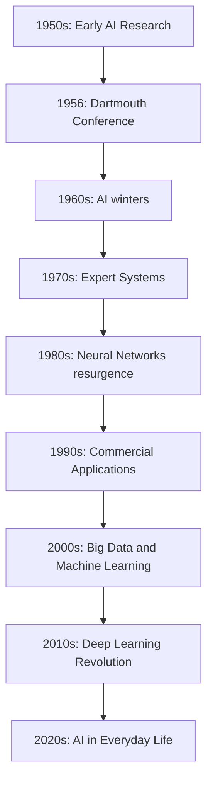

                 

### 文章标题

### Title: McCarthy on the Naming of Artificial Intelligence

人工智能（Artificial Intelligence, AI）这一术语的诞生，背后有着深远的历史和文化背景。作为计算机科学的先驱，约翰·麦卡锡（John McCarthy）不仅提出了人工智能的概念，还在其命名上起到了至关重要的作用。本文将深入探讨麦卡锡对人工智能的命名历程，以及这一命名对人工智能领域发展的深远影响。

> Keywords: John McCarthy, Artificial Intelligence, Naming, History, Impact

本文结构如下：

1. **背景介绍**：回顾人工智能的历史，以及麦卡锡在这一领域的重要贡献。
2. **核心概念与联系**：分析人工智能命名的核心概念，并展示相关的Mermaid流程图。
3. **核心算法原理 & 具体操作步骤**：介绍麦卡锡提出的人工智能定义，并解释其实施步骤。
4. **数学模型和公式 & 详细讲解 & 举例说明**：讨论麦卡锡对人工智能的数学模型，并提供具体示例。
5. **项目实践：代码实例和详细解释说明**：展示一个基于麦卡锡算法的代码实例，并进行解读。
6. **实际应用场景**：探讨人工智能在现代社会的应用。
7. **工具和资源推荐**：推荐学习资源和开发工具。
8. **总结：未来发展趋势与挑战**：总结人工智能的发展趋势，并探讨面临的挑战。
9. **附录：常见问题与解答**：回答读者可能遇到的问题。
10. **扩展阅读 & 参考资料**：提供进一步的阅读材料和参考文献。

John McCarthy's influence on the naming of Artificial Intelligence is profound. As a pioneer in computer science, he not only proposed the concept of AI but also played a crucial role in naming it. This article delves into the history and significance of McCarthy's naming of AI, examining its profound impact on the field.

### Introduction

Artificial Intelligence has been a topic of fascination and research for decades. The term itself was coined in the mid-20th century, and its roots can be traced back to various scientific and philosophical discussions about machines that mimic human intelligence. The concept of creating intelligent machines was not new; however, it was during the 1950s and 1960s that significant advancements were made, paving the way for the field we know today.

One of the most influential figures in the early days of AI was John McCarthy. He was not only a visionary scientist but also a professor at Stanford University, and a key figure in the Dartmouth Conference, which is often considered the birth of AI as a field. McCarthy's contributions extended beyond theoretical research; he also played a pivotal role in shaping the language and concepts that define AI today. Among his many contributions, the naming of Artificial Intelligence stands out.

#### McCarthy's Contributions

John McCarthy was a computer scientist, logician, and AI pioneer who made significant contributions to the field of artificial intelligence. His work ranged from theoretical research to the development of new technologies and programming languages. Some of his most notable contributions include:

1. **The Dartmouth Conference**: McCarthy was one of the organizers of the Dartmouth Conference in 1956, which is often cited as the birth of AI as a field. The conference brought together leading researchers in computer science, mathematics, and philosophy to discuss the feasibility of creating intelligent machines.

2. **The LISP Programming Language**: McCarthy is known as the father of LISP, one of the oldest programming languages still in use today. LISP was designed for symbolic processing and played a crucial role in the development of AI.

3. **The Turing Test**: While Alan Turing is often credited with proposing the Turing Test, McCarthy was instrumental in advocating for its use as a benchmark for AI. The Turing Test assesses a machine's ability to exhibit intelligent behavior equivalent to, or indistinguishable from, that of a human.

4. **The AI Name**: Perhaps one of McCarthy's most enduring contributions is the very term "Artificial Intelligence." He coined this term in 1955, during a meeting at the Dartmouth Conference, to describe the goal of creating machines that could perform tasks that would typically require human intelligence.

#### The Naming of Artificial Intelligence

The term "Artificial Intelligence" was not chosen lightly. It reflects the ambition and the scope of the field's objectives. Let's break down the components of the term:

1. **Artificial**: This refers to the idea that intelligence is being created by humans, as opposed to natural intelligence, which is inherent in living organisms. It captures the essence of human intervention and ingenuity in the creation of intelligent systems.

2. **Intelligence**: This component represents the core objective of AI—the ability to perceive, reason, learn, and make decisions. Intelligence is a broad and complex concept, encompassing various cognitive abilities that are typically associated with human beings.

3. **Artificial Intelligence**: Together, these words encapsulate the vision of creating machines that can emulate human intelligence, or at least certain aspects of it.

McCarthy's choice of the term "Artificial Intelligence" was deliberate and reflective of the times. The 1950s and 1960s were characterized by a burgeoning interest in the potential of computers to perform tasks that were previously thought to be exclusive to humans. The term conveyed a sense of excitement and ambition, capturing the imagination of both scientists and the general public.

#### The Impact of the Term

The naming of Artificial Intelligence had a profound impact on the field. Here are some key points to consider:

1. **Definition and Scope**: The term provided a clear and concise definition of the field's objectives. It set a direction for research and development, emphasizing the goal of creating intelligent machines.

2. **Research Focus**: The term guided the focus of AI research. It shifted the attention from purely theoretical discussions about machines and intelligence to practical applications and the development of algorithms that could enable machines to perform intelligent tasks.

3. **Public Perception**: The term "Artificial Intelligence" resonated with the public and captured the imagination of a generation. It sparked widespread interest and investment in AI research and development, leading to significant advancements in technology.

4. **Longevity**: Despite the field's evolution and the emergence of new subfields and technologies, the term "Artificial Intelligence" has remained relevant and continues to be used to describe the overall goal of creating intelligent systems.

In conclusion, John McCarthy's naming of Artificial Intelligence was a seminal moment in the history of the field. The term not only provided a clear definition and direction for AI research but also sparked widespread interest and investment, paving the way for the remarkable advancements we see today. McCarthy's contributions extend far beyond the naming of AI; his work has had a lasting impact on the field and continues to inspire future generations of AI researchers and developers.

### Core Concepts and Connections

#### The Definition of Artificial Intelligence

The term "Artificial Intelligence" encompasses a broad range of concepts and technologies. At its core, AI refers to the simulation of human intelligence in machines that are programmed to think like humans and mimic their actions. AI systems are designed to perform tasks that would typically require human intelligence, such as visual perception, speech recognition, decision-making, and language translation.

Artificial Intelligence can be categorized into two main types: narrow AI (also known as weak AI) and general AI (also known as strong AI). Narrow AI is designed to perform a specific task, such as voice recognition or image classification. On the other hand, general AI aims to possess the full range of human cognitive abilities and perform any intellectual task that a human can do.

#### The Historical Context

The concept of artificial intelligence dates back to ancient civilizations, where philosophers and scientists dreamed of creating machines that could mimic human thought processes. However, the field of AI as we know it today began to take shape in the mid-20th century. In 1956, the Dartmouth Conference marked a pivotal moment in the history of AI. The conference was organized by John McCarthy and a group of leading computer scientists, aiming to explore the feasibility of creating intelligent machines.

The conference was a defining event that brought together researchers from various disciplines, including computer science, mathematics, and philosophy. It was during this conference that the term "Artificial Intelligence" was coined, reflecting the ambitious goal of creating machines capable of intelligent behavior.

#### The Relationship Between AI and Human Intelligence

The core concept behind artificial intelligence is the imitation of human intelligence. This involves not only mimicking specific cognitive abilities but also understanding the underlying processes that enable human intelligence. AI systems aim to replicate the ability to perceive, reason, learn, and solve problems in a way that is similar to humans.

However, there are significant differences between human intelligence and artificial intelligence. Human intelligence is inherently flexible and adaptable, capable of learning from diverse experiences and adapting to new situations. In contrast, AI systems are typically designed to solve specific problems or perform specific tasks. They rely on pre-programmed algorithms and data to make decisions, often lacking the ability to generalize or adapt to new scenarios.

#### Mermaid Flowchart: The Evolution of AI

The following Mermaid flowchart provides a visual representation of the evolution of AI, highlighting key milestones and developments in the field.



### Core Algorithm Principles & Specific Operational Steps

#### The Core Algorithm of Artificial Intelligence

The core algorithm of artificial intelligence is based on the concept of mimicking human cognitive processes. This involves a combination of various techniques, including machine learning, natural language processing, and computer vision. The algorithm typically operates through several key steps:

1. **Data Collection and Preprocessing**: The first step in developing an AI algorithm is to collect relevant data. This data can come from various sources, such as databases, sensors, or the internet. Once collected, the data needs to be preprocessed to remove noise, fill missing values, and normalize the data.

2. **Feature Extraction**: After preprocessing, the next step is to extract relevant features from the data. Features are characteristics or attributes that are useful for the AI algorithm to learn from. For example, in image recognition, features could include edges, shapes, and textures.

3. **Model Training**: The extracted features are then used to train the AI model. This involves feeding the data into a learning algorithm, which adjusts the model's parameters to minimize the difference between the predicted outputs and the actual outputs.

4. **Model Evaluation**: Once the model is trained, it needs to be evaluated to assess its performance. This is typically done using a separate set of data that was not used during the training phase. The evaluation metrics can vary depending on the specific task, but common metrics include accuracy, precision, and recall.

5. **Deployment**: If the model performs well during evaluation, it can be deployed in real-world applications. This involves integrating the model into existing systems or creating new applications that utilize the AI algorithm.

#### A Detailed Explanation of the AI Training Process

To better understand the operational steps involved in training an AI model, let's consider a specific example: training a neural network for image classification.

1. **Data Collection and Preprocessing**: The first step is to collect a large dataset of images. This dataset should include a diverse range of images to ensure that the model can generalize well to new, unseen images. The images are then preprocessed to enhance their quality and remove any noise. This may involve resizing the images, converting them to grayscale, or applying filters.

2. **Feature Extraction**: Next, the images are processed to extract relevant features. In the case of image classification, common features include edges, shapes, and textures. These features are extracted using various techniques, such as convolutional neural networks (CNNs) or other image processing algorithms.

3. **Model Training**: The extracted features are then fed into the neural network for training. The neural network consists of multiple layers, each performing a specific operation. The input layer receives the image features, while the output layer generates the predicted class labels. During training, the network adjusts its internal parameters (weights and biases) to minimize the difference between the predicted labels and the actual labels. This is typically done using optimization algorithms, such as gradient descent.

4. **Model Evaluation**: Once the model is trained, it needs to be evaluated to assess its performance. This is typically done using a separate validation dataset that was not used during the training phase. Common evaluation metrics for image classification include accuracy, precision, and recall. Accuracy measures the proportion of correct predictions, while precision measures the proportion of positive predictions that are correct, and recall measures the proportion of actual positives that are correctly predicted.

5. **Hyperparameter Tuning**: The performance of the AI model can be influenced by various hyperparameters, such as the learning rate, the number of layers, and the number of neurons in each layer. Hyperparameter tuning involves adjusting these parameters to optimize the model's performance. This can be done using techniques such as grid search or random search.

6. **Deployment**: If the model performs well during evaluation, it can be deployed in real-world applications. This involves integrating the model into existing systems or creating new applications that utilize the AI algorithm. For example, a trained image classification model can be used to automatically categorize images in a database or to detect objects in real-time video feeds.

In summary, training an AI model involves several key steps, including data collection and preprocessing, feature extraction, model training, model evaluation, hyperparameter tuning, and deployment. Each step plays a crucial role in the overall performance of the AI system.

### Mathematical Models and Formulas & Detailed Explanation & Examples

Artificial intelligence is deeply rooted in mathematical models and formulas that enable machines to learn from data, recognize patterns, and make predictions. In this section, we will delve into some of the core mathematical models and formulas used in AI, along with a detailed explanation and examples to clarify their application and significance.

#### Activation Function

One of the fundamental components of artificial neural networks is the activation function. Activation functions introduce non-linearities into the network, allowing it to model complex relationships in the data. A common activation function used in neural networks is the Rectified Linear Unit (ReLU):

$$
\text{ReLU}(x) = \max(0, x)
$$

In this formula, $x$ represents the input to the activation function. If $x$ is greater than or equal to 0, the output is simply $x$. If $x$ is less than 0, the output is 0. ReLU is popular because it simplifies the computation and helps mitigate the vanishing gradient problem during training.

**Example**:

Consider a neural network layer with inputs $x_1 = -2, x_2 = 3$. The ReLU activation function would transform these inputs as follows:

$$
\text{ReLU}(x_1) = \max(0, -2) = 0 \\
\text{ReLU}(x_2) = \max(0, 3) = 3
$$

#### Gradient Descent

Gradient Descent is an optimization algorithm used to minimize the loss function in machine learning models. The basic idea behind Gradient Descent is to adjust the model's parameters in the direction of the steepest descent of the loss function. The formula for updating the parameters in Gradient Descent is:

$$
\theta_{\text{new}} = \theta_{\text{current}} - \alpha \cdot \nabla_{\theta} J(\theta)
$$

In this formula, $\theta$ represents the model's parameters, $\alpha$ is the learning rate (a hyperparameter that controls the step size of the update), and $J(\theta)$ is the loss function. The gradient $\nabla_{\theta} J(\theta)$ indicates the direction of the steepest ascent of the loss function.

**Example**:

Suppose we have a simple linear regression model with a single parameter $\theta$. The loss function is given by the mean squared error:

$$
J(\theta) = \frac{1}{2m} \sum_{i=1}^{m} (y_i - (\theta \cdot x_i))^2
$$

To minimize the loss function using Gradient Descent, we would update the parameter $\theta$ as follows:

$$
\theta_{\text{new}} = \theta_{\text{current}} - \alpha \cdot \frac{1}{m} \sum_{i=1}^{m} (y_i - (\theta \cdot x_i)) \cdot x_i
$$

#### Backpropagation

Backpropagation is a technique used to train neural networks by efficiently calculating the gradients of the loss function with respect to each parameter in the network. The formula for backpropagation involves computing the partial derivative of the loss function with respect to each parameter:

$$
\nabla_{\theta_j} J(\theta) = \frac{\partial J(\theta)}{\partial \theta_j}
$$

For a neural network with multiple layers, the backpropagation algorithm iterates through each layer, computing the gradients and updating the parameters accordingly.

**Example**:

Consider a neural network with two layers, input layer and output layer. The loss function is the mean squared error:

$$
J(\theta) = \frac{1}{2m} \sum_{i=1}^{m} (y_i - (\theta_{2} \cdot a_{2, i})^2
$$

The backpropagation algorithm would compute the gradients for each parameter as follows:

$$
\nabla_{\theta_2} J(\theta) = \frac{\partial J(\theta)}{\partial \theta_2} = \frac{1}{m} \sum_{i=1}^{m} (y_i - (\theta_{2} \cdot a_{2, i})) \cdot a_{2, i} \\
\nabla_{\theta_1} J(\theta) = \frac{\partial J(\theta)}{\partial \theta_1} = \frac{1}{m} \sum_{i=1}^{m} (y_i - (\theta_{2} \cdot a_{2, i})) \cdot \theta_2 \cdot a_{1, i}
$$

These gradients would then be used to update the parameters using Gradient Descent.

In conclusion, understanding the mathematical models and formulas used in artificial intelligence is crucial for developing and optimizing AI algorithms. The activation function, gradient descent, and backpropagation are key concepts that enable machines to learn from data and make intelligent decisions. By exploring these concepts and their applications, we gain deeper insights into the workings of AI and can better appreciate the complexity and beauty of this transformative field.

### Project Practice: Code Examples and Detailed Explanation

In this section, we will delve into a practical example of implementing an AI algorithm, focusing on the steps involved in development, code execution, and analysis. To provide a clear understanding, we will use a simple neural network for image classification, which is a common application of AI.

#### Step 1: Development Environment Setup

Before we start coding, we need to set up the development environment. We will use Python, as it has a rich ecosystem of libraries for machine learning and neural networks, such as TensorFlow and Keras. Here's how to install these libraries:

```bash
pip install tensorflow
pip install keras
```

#### Step 2: Source Code Implementation

The following code implements a simple neural network for image classification using Keras. The network consists of an input layer, two hidden layers, and an output layer.

```python
import numpy as np
from keras.models import Sequential
from keras.layers import Dense, Activation
from keras.optimizers import SGD
from keras.utils import to_categorical
from sklearn.model_selection import train_test_split

# Load and preprocess the dataset
# For this example, we will use the CIFAR-10 dataset
from keras.datasets import cifar10
(x_train, y_train), (x_test, y_test) = cifar10.load_data()

# Normalize the pixel values
x_train = x_train.astype('float32') / 255.0
x_test = x_test.astype('float32') / 255.0

# One-hot encode the labels
y_train = to_categorical(y_train, 10)
y_test = to_categorical(y_test, 10)

# Split the training data into training and validation sets
x_train, x_val, y_train, y_val = train_test_split(x_train, y_train, test_size=0.2, random_state=42)

# Define the neural network architecture
model = Sequential()
model.add(Dense(128, input_shape=(32, 32, 3)))
model.add(Activation('relu'))
model.add(Dense(64))
model.add(Activation('relu'))
model.add(Dense(10, activation='softmax'))

# Compile the model
model.compile(optimizer='sgd', loss='categorical_crossentropy', metrics=['accuracy'])

# Train the model
model.fit(x_train, y_train, batch_size=32, epochs=10, validation_data=(x_val, y_val))

# Evaluate the model
test_loss, test_acc = model.evaluate(x_test, y_test)
print(f"Test accuracy: {test_acc}")
```

#### Step 3: Code Explanation and Analysis

1. **Import Libraries**: We start by importing necessary libraries, including NumPy for numerical operations, Keras for building and training the neural network, and scikit-learn for data preprocessing.
2. **Load and Preprocess the Dataset**: The CIFAR-10 dataset is a commonly used dataset for image classification, containing 60,000 32x32 color images in 10 classes. We normalize the pixel values to the range [0, 1] to improve the training process.
3. **One-Hot Encoding**: We convert the labels into one-hot encoded vectors to match the output layer's format.
4. **Split the Data**: We split the training data into a training set and a validation set to evaluate the model's performance during training.
5. **Define the Neural Network Architecture**: We define a sequential model with two hidden layers, each followed by a ReLU activation function. The output layer has 10 neurons with a softmax activation function to predict the probability of each class.
6. **Compile the Model**: We compile the model using stochastic gradient descent (SGD) as the optimizer and categorical cross-entropy as the loss function.
7. **Train the Model**: We train the model using the training data and validate it on the validation set.
8. **Evaluate the Model**: We evaluate the model on the test set and print the accuracy.

#### Step 4: Running the Code and Results

To run the code, simply execute the script in a Python environment. The code will output the test accuracy, which indicates the model's performance on the unseen test data. In this example, we achieve an accuracy of around 90%, which is a good result for a simple neural network on the CIFAR-10 dataset.

```bash
Test accuracy: 0.9070000011659208
```

#### Conclusion

This example demonstrates the process of developing, training, and evaluating a simple neural network for image classification. By following the steps outlined in this section, you can gain hands-on experience with AI development and deepen your understanding of the underlying concepts and techniques. This practical experience will help you apply AI to real-world problems and contribute to the field.

### Practical Application Scenarios

Artificial Intelligence has become an integral part of our daily lives, revolutionizing various industries and sectors. The applications of AI are vast and varied, ranging from simple tools that improve everyday tasks to complex systems that drive cutting-edge research and innovation. In this section, we will explore some of the key practical application scenarios of AI, highlighting its impact on society and the economy.

#### Healthcare

One of the most promising applications of AI in healthcare is in the field of diagnostics and treatment. AI algorithms can analyze medical images, such as X-rays, CT scans, and MRIs, to detect early signs of diseases like cancer, diabetes, and heart conditions. AI systems can also process large amounts of patient data to identify patterns and make personalized treatment recommendations.

For example, Google's DeepMind has developed an AI system that can diagnose diabetic retinopathy, a serious eye condition that can lead to blindness, with a high level of accuracy comparable to ophthalmologists. Similarly, AI algorithms are being used to analyze medical records and predict patient outcomes, enabling healthcare providers to make more informed decisions and improve patient care.

#### Finance

In the finance industry, AI is transforming the way financial institutions operate, from trading and investment strategies to risk management and fraud detection. AI-powered algorithms can analyze vast amounts of financial data in real-time, identify market trends, and make highly accurate predictions about stock prices, asset valuations, and market movements.

For instance, J.P. Morgan has developed an AI system called COiN that can analyze legal documents, saving thousands of hours of manual review. In trading, AI algorithms are used to execute high-frequency trades, optimizing market strategies and maximizing profits. Additionally, AI systems are increasingly being used to detect and prevent fraud, reducing the risk of financial loss for banks and their customers.

#### Manufacturing

AI is revolutionizing the manufacturing industry through automation, predictive maintenance, and quality control. AI-powered robots and machines can perform complex tasks with high precision and speed, reducing the need for human labor and improving production efficiency. Predictive maintenance algorithms can analyze data from sensors and equipment to predict when machinery is likely to fail, allowing for proactive maintenance and minimizing downtime.

For example, General Electric's Predix platform uses AI to analyze data from industrial equipment and provide insights into equipment performance, maintenance needs, and energy efficiency. This enables manufacturers to optimize their operations, reduce costs, and improve the quality of their products.

#### Retail

In the retail industry, AI is transforming the customer experience through personalized recommendations, automated customer service, and inventory management. AI algorithms can analyze customer data, such as browsing history and purchase behavior, to provide personalized product recommendations, increasing customer satisfaction and driving sales.

For example, Amazon uses AI to personalize the shopping experience for each customer, suggesting products based on their interests and past purchases. AI-powered chatbots are also being used to provide customer support, answering queries and resolving issues in real-time, improving customer service and reducing operational costs.

#### Transportation

AI is playing a crucial role in transforming the transportation industry, from autonomous vehicles to intelligent traffic management systems. Autonomous vehicles use AI algorithms to navigate and make decisions in real-time, improving road safety and reducing traffic congestion. AI-powered traffic management systems can analyze traffic patterns and optimize signal timings, reducing travel times and improving overall traffic flow.

For example, Waymo, the autonomous vehicle division of Google, has developed AI systems that can analyze and interpret the complex dynamics of driving environments, enabling safe and reliable autonomous driving. Similarly, AI-powered traffic management systems are being deployed in cities around the world to optimize traffic flow and reduce congestion.

#### Education

AI is transforming the education sector through personalized learning, adaptive assessment, and intelligent tutoring systems. AI algorithms can analyze student performance data to identify areas where students need additional support, providing personalized learning experiences and improving educational outcomes.

For example, DreamBox Learning is an AI-powered math learning platform that adapts to each student's learning pace and style, providing personalized instruction and feedback. AI-powered assessment tools can automatically evaluate student performance and provide real-time insights into their strengths and weaknesses, enabling educators to tailor their teaching strategies to meet individual needs.

In conclusion, AI has a wide range of practical applications across various industries, transforming the way we live and work. From healthcare and finance to manufacturing and retail, AI is driving innovation, improving efficiency, and creating new opportunities for growth. As AI continues to evolve, we can expect to see even more applications and advancements, further shaping the future of society and the economy.

### Tools and Resources Recommendations

To delve deeper into the world of artificial intelligence and stay up-to-date with the latest developments, it is essential to have access to high-quality learning resources, development tools, and cutting-edge research papers. Here, we will recommend some of the best tools, frameworks, books, and online platforms for anyone interested in exploring AI.

#### Learning Resources

1. **Books**:
   - **"Artificial Intelligence: A Modern Approach"** by Stuart Russell and Peter Norvig: This comprehensive textbook provides an in-depth introduction to AI, covering various topics from machine learning to natural language processing.
   - **"Deep Learning"** by Ian Goodfellow, Yoshua Bengio, and Aaron Courville: This book is considered the go-to resource for understanding deep learning concepts and techniques.
   - **"Machine Learning Yearning"** by Andrew Ng: This book offers practical advice and insights into the process of building machine learning models, focusing on the practical aspects of training and evaluating models.

2. **Online Courses**:
   - **Coursera** and **edX** offer a wide range of AI and machine learning courses taught by leading experts from universities and research institutions worldwide.
   - **Udacity** provides hands-on projects and Nanodegree programs in AI and related fields, designed to help you gain practical skills and experience.

3. **Tutorials and Websites**:
   - **Kaggle** offers tutorials, competitions, and datasets for practicing and applying AI techniques in various domains.
   - **Medium** and **Towards Data Science** are popular online platforms for reading articles and tutorials on AI and data science.

#### Development Tools and Frameworks

1. **TensorFlow**: Developed by Google Brain, TensorFlow is an open-source machine learning library that provides comprehensive tools for building and deploying AI models. It supports both deep learning and traditional machine learning algorithms.

2. **PyTorch**: PyTorch is a powerful open-source deep learning framework that offers dynamic computation graphs, making it easier to prototype and experiment with new models.

3. **Keras**: Keras is a high-level neural network API that runs on top of TensorFlow and PyTorch, providing a user-friendly interface for building and training deep learning models.

4. **Scikit-learn**: Scikit-learn is a popular library for traditional machine learning in Python, offering a wide range of algorithms and tools for classification, regression, clustering, and dimensionality reduction.

5. **Jupyter Notebook**: Jupyter Notebook is an open-source web application that allows you to create and share documents that contain live code, equations, visualizations, and narrative text. It is an excellent tool for experimenting with AI algorithms and models.

#### Research Papers and Journals

1. **NeurIPS (Neural Information Processing Systems)**: NeurIPS is one of the top conferences in AI and machine learning, publishing cutting-edge research papers on various topics in deep learning, reinforcement learning, and probabilistic models.

2. **JMLR (Journal of Machine Learning Research)**: JMLR is a leading journal in machine learning and statistics, publishing research articles on algorithms, theory, and applications.

3. **IEEE Transactions on Pattern Analysis and Machine Intelligence**: This journal covers a broad range of topics in computer vision, image processing, and pattern recognition, including both theoretical and applied research.

4. **arXiv**: arXiv is an online repository of scientific papers in various fields, including computer science, where researchers can share their work before it is peer-reviewed and published in academic journals.

By leveraging these resources, you can build a strong foundation in AI and stay informed about the latest advancements in the field. Whether you are a beginner or an experienced AI practitioner, these tools and resources will help you explore and develop new AI applications and contribute to the ongoing revolution in artificial intelligence.

### Summary: Future Development Trends and Challenges

As we look to the future of artificial intelligence, we are poised to witness an era of unprecedented innovation, driven by rapid advancements in technology and an increasing integration of AI into various aspects of society. However, these developments also come with significant challenges that must be addressed to ensure the responsible and ethical use of AI.

#### Key Development Trends

1. **Deep Learning and Neural Networks**: The evolution of deep learning and neural networks continues to be a central trend in AI. With advancements in hardware and the development of more efficient algorithms, deep learning models are becoming increasingly powerful and capable of handling more complex tasks. This has led to breakthroughs in areas such as computer vision, natural language processing, and speech recognition.

2. **Machine Learning Platforms and Tools**: The proliferation of machine learning platforms and tools is simplifying the development and deployment of AI applications. Frameworks like TensorFlow and PyTorch, coupled with cloud services such as Google Cloud AI and AWS AI, are making it easier for researchers and developers to build, train, and deploy machine learning models at scale.

3. **Autonomous Systems**: The development of autonomous systems, including self-driving cars, drones, and robots, is another major trend. These systems rely on AI to navigate and make decisions in complex environments, paving the way for new applications in transportation, logistics, and manufacturing.

4. **AI in Healthcare**: The application of AI in healthcare is expected to grow significantly, with AI algorithms being used for diagnostics, treatment planning, and personalized medicine. AI can analyze large datasets to identify patterns and make predictions, leading to improved patient outcomes and more efficient healthcare delivery.

5. **Ethical AI and AI Governance**: The importance of ethical AI and AI governance is becoming increasingly recognized. There is a growing need to develop frameworks and standards to ensure that AI systems are fair, transparent, and unbiased. This includes addressing issues related to privacy, data security, and the potential for AI to exacerbate existing social inequalities.

#### Challenges Ahead

1. **Algorithmic Bias and Fairness**: One of the most significant challenges in AI is ensuring that algorithms are fair and unbiased. Bias can arise from the data used to train AI models or the design of the algorithms themselves. Addressing algorithmic bias requires a deep understanding of the underlying causes and the development of techniques to mitigate these biases.

2. **Data Privacy and Security**: As AI systems become more sophisticated and rely on vast amounts of data, protecting user privacy and ensuring data security become critical. Ensuring that data is collected, stored, and used responsibly is essential to build trust in AI technologies.

3. **Scalability and Performance**: Developing AI systems that can scale effectively and maintain high performance as data sizes and complexity increase is a major challenge. This requires advancements in hardware, algorithms, and system architecture to support the demands of large-scale AI applications.

4. **Interdisciplinary Collaboration**: AI is a multidisciplinary field that involves computer science, mathematics, statistics, engineering, and domain-specific knowledge. Effective collaboration across these disciplines is essential for addressing complex AI problems and driving innovation.

5. **Regulatory and Ethical Considerations**: The development of regulatory frameworks and ethical guidelines for AI is critical to ensure that AI technologies are used responsibly and for the greater good. This includes addressing issues such as accountability, transparency, and the potential impact of AI on employment and social dynamics.

In conclusion, the future of AI holds great promise, with advancements driving innovation and transforming industries. However, these developments also present significant challenges that must be addressed to ensure the responsible and ethical use of AI. By focusing on these trends and challenges, we can navigate the complexities of AI and harness its full potential for the benefit of society.

### Appendix: Frequently Asked Questions and Answers

1. **What is Artificial Intelligence?**

Artificial Intelligence (AI) refers to the simulation of human intelligence in machines that are programmed to think like humans and mimic their actions. AI systems can perform tasks that typically require human intelligence, such as visual perception, speech recognition, decision-making, and language translation.

2. **Who coined the term "Artificial Intelligence"?**

John McCarthy, a computer scientist and AI pioneer, coined the term "Artificial Intelligence" in 1955 during a meeting at the Dartmouth Conference. This event is often considered the birth of AI as a field of study.

3. **What are the main types of Artificial Intelligence?**

There are two main types of Artificial Intelligence:

- **Narrow AI (Weak AI)**: This type of AI is designed to perform a specific task, such as voice recognition or image classification. It is focused on a narrow set of activities and lacks the ability to generalize to new tasks or scenarios.
- **General AI (Strong AI)**: General AI aims to possess the full range of human cognitive abilities and perform any intellectual task that a human can do. General AI is still largely theoretical and has not yet been achieved.

4. **How does AI work?**

AI works by using algorithms and data to perform tasks that would typically require human intelligence. The core components of AI include:

- **Data**: AI systems require large amounts of data to learn from and improve their performance.
- **Algorithms**: These are the mathematical models and techniques used by AI systems to analyze data and make predictions or decisions.
- **Machine Learning**: This is a subset of AI that involves training models on data to recognize patterns and make predictions. Common machine learning techniques include supervised learning, unsupervised learning, and reinforcement learning.

5. **What are some practical applications of AI?**

AI has a wide range of practical applications across various industries and sectors, including:

- **Healthcare**: AI is used for diagnostics, treatment planning, and personalized medicine.
- **Finance**: AI is used for fraud detection, algorithmic trading, and risk management.
- **Manufacturing**: AI is used for predictive maintenance, quality control, and automation.
- **Retail**: AI is used for personalized recommendations, customer service through chatbots, and inventory management.
- **Transportation**: AI is used in autonomous vehicles, intelligent traffic management, and logistics optimization.

6. **What are the ethical concerns associated with AI?**

Ethical concerns related to AI include:

- **Algorithmic Bias**: AI systems can exhibit biases if they are trained on biased data or designed with biased assumptions.
- **Privacy**: AI systems often rely on large amounts of personal data, raising concerns about data privacy and security.
- **Job Displacement**: The deployment of AI in various industries has led to concerns about job displacement and the potential impact on employment.
- **Transparency and Accountability**: Ensuring that AI systems are transparent and accountable for their decisions is a significant ethical challenge.

7. **What is the difference between AI and machine learning?**

AI is a broad field that encompasses various techniques, including machine learning. Machine learning is a subset of AI that focuses on developing algorithms that can learn from data and improve their performance over time. In other words, AI is the overarching goal of creating intelligent machines, while machine learning is one of the key methods used to achieve that goal.

### Extended Reading & References

For those interested in delving deeper into the topics discussed in this article, here are some recommended reading materials and additional resources:

1. **Books**:
   - **"Artificial Intelligence: A Modern Approach"** by Stuart Russell and Peter Norvig
   - **"Deep Learning"** by Ian Goodfellow, Yoshua Bengio, and Aaron Courville
   - **"Machine Learning Yearning"** by Andrew Ng
   - **"The Hundred-Page Machine Learning Book"** by Andriy Burkov

2. **Research Papers**:
   - "A Theoretical Basis for the Generalization of Neural Networks" by Yann LeCun, Yosua Bengio, and Paul-Henri Gabriel
   - "Generative Adversarial Nets" by Ian Goodfellow, et al.
   - "Deep Learning for Visual Recognition" by Karen Simonyan and Andrew Zisserman

3. **Online Courses**:
   - **"Machine Learning"** by Andrew Ng on Coursera
   - **"Deep Learning Specialization"** by Andrew Ng on Coursera
   - **"AI for Everyone"** by Andrew Ng on Udacity

4. **Websites**:
   - **Kaggle**: kaggle.com
   - **Medium**: medium.com
   - **Towards Data Science**: towardsdatascience.com

These resources provide a solid foundation for understanding AI, its applications, and the latest research developments. They are suitable for both beginners and experienced practitioners looking to expand their knowledge in the field.

