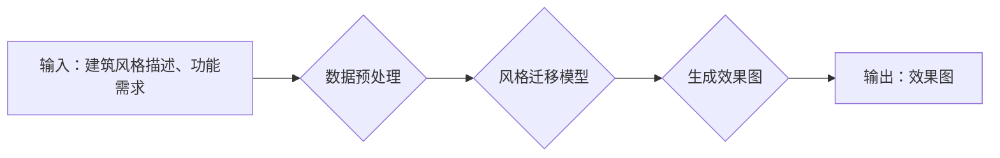

## AIGC从入门到实战：掌握建筑设计要领，创建各种大师风格的效果图

> 关键词：AIGC, 建筑设计, 效果图, 生成式模型, 深度学习, 风格迁移, 计算机视觉

### 1. 背景介绍

建筑设计是一个充满创意和技术的领域，它需要设计师具备丰富的专业知识、审美眼光和空间构思能力。传统的建筑设计流程通常需要花费大量的时间和人力，从草图绘制到模型制作再到最终的施工图，每个环节都充满挑战。近年来，随着人工智能技术的飞速发展，特别是生成式人工智能（AIGC）的兴起，为建筑设计领域带来了革命性的变革。

AIGC能够利用深度学习算法从海量建筑数据中学习，并生成新的建筑设计方案、效果图和模型。它可以帮助设计师快速探索不同的设计方案，提高设计效率，并激发新的设计灵感。

### 2. 核心概念与联系

**2.1 核心概念**

* **生成式模型 (Generative Model):**  一种机器学习模型，能够从输入数据中学习并生成新的数据，例如图像、文本、音频等。
* **深度学习 (Deep Learning):**  一种机器学习的子领域，利用多层神经网络来模拟人类大脑的学习过程，能够处理复杂的数据模式。
* **风格迁移 (Style Transfer):**  一种计算机视觉技术，能够将一种图像的风格迁移到另一幅图像上，例如将梵高的绘画风格应用到一张照片上。
* **建筑设计数据:** 包括建筑图纸、模型、照片、文献等各种形式的建筑相关信息。

**2.2 架构流程图**



**2.3 联系**

AIGC在建筑设计领域的核心原理是利用生成式模型，特别是风格迁移技术，从已有的建筑数据中学习各种建筑风格和设计元素，并根据用户的输入需求生成新的建筑效果图。

### 3. 核心算法原理 & 具体操作步骤

**3.1 算法原理概述**

AIGC生成建筑效果图的核心算法通常基于深度学习的生成对抗网络 (GAN)。GAN由两个网络组成：生成器 (Generator) 和鉴别器 (Discriminator)。

* **生成器:**  负责根据输入的文本描述或其他数据生成新的建筑效果图。
* **鉴别器:**  负责判断生成的图像是否为真实建筑效果图，或者是由生成器生成的伪造图像。

生成器和鉴别器之间进行对抗训练，生成器不断改进生成图像的质量，而鉴别器则不断提高识别伪造图像的能力。最终，生成器能够生成逼真的建筑效果图，满足用户的需求。

**3.2 算法步骤详解**

1. **数据收集和预处理:** 收集大量的建筑效果图数据，并进行预处理，例如裁剪、缩放、增强等操作，以提高模型训练的效率和效果。
2. **模型构建:**  构建GAN模型，包括生成器和鉴别器网络结构。
3. **模型训练:**  利用收集的数据进行模型训练，生成器和鉴别器之间进行对抗训练，直到生成器能够生成逼真的建筑效果图。
4. **效果图生成:**  根据用户的输入需求，例如建筑风格、功能、尺寸等，利用训练好的生成器模型生成新的建筑效果图。

**3.3 算法优缺点**

* **优点:** 
    * 可以生成逼真的建筑效果图，满足用户的个性化需求。
    * 可以提高建筑设计效率，节省时间和人力成本。
    * 可以激发新的设计灵感，帮助设计师突破传统的设计模式。
* **缺点:** 
    * 需要大量的训练数据，数据质量直接影响模型效果。
    * 模型训练过程复杂，需要专业的技术人员进行操作。
    * 生成的效果图可能缺乏创意和独特性，需要设计师进行后期修改和完善。

**3.4 算法应用领域**

* **建筑设计:** 生成建筑效果图、模型、平面图等。
* **室内设计:** 生成室内效果图、家具布局方案等。
* **城市规划:** 生成城市景观效果图、建筑群布局方案等。
* **游戏开发:** 生成游戏场景、建筑模型等。

### 4. 数学模型和公式 & 详细讲解 & 举例说明

**4.1 数学模型构建**

GAN模型的核心是生成器和鉴别器之间的对抗训练过程。

* **生成器:**  使用神经网络结构，输入随机噪声向量，输出生成的建筑效果图。
* **鉴别器:**  使用神经网络结构，输入建筑效果图，判断其是否为真实图像或生成图像。

**4.2 公式推导过程**

* **生成器损失函数:**  生成器希望生成逼真的图像，使其被鉴别器误判为真实图像。损失函数定义为鉴别器对生成图像的判别概率的负值。

$$
L_G = -log(D(G(z)))
$$

* **鉴别器损失函数:**  鉴别器希望能够正确区分真实图像和生成图像。损失函数定义为真实图像和生成图像的判别概率之差的平方和。

$$
L_D = -log(D(x)) - log(1 - D(G(z)))
$$

其中：

* $G(z)$: 生成器生成的图像
* $D(x)$: 鉴别器对真实图像的判别概率
* $D(G(z))$: 鉴别器对生成图像的判别概率
* $x$: 真实图像
* $z$: 随机噪声向量

**4.3 案例分析与讲解**

例如，可以使用GAN模型生成不同风格的建筑效果图。可以训练多个生成器，每个生成器学习不同的建筑风格，例如哥特式、巴洛克式、现代主义等。用户可以根据自己的需求选择不同的生成器，生成符合自己审美偏好的建筑效果图。

### 5. 项目实践：代码实例和详细解释说明

**5.1 开发环境搭建**

* **操作系统:**  Windows, macOS, Linux
* **编程语言:**  Python
* **深度学习框架:**  TensorFlow, PyTorch
* **其他工具:**  Git, Jupyter Notebook

**5.2 源代码详细实现**

```python
# 使用 TensorFlow 构建 GAN 模型
import tensorflow as tf

# 定义生成器网络结构
def generator(z):
  #...

# 定义鉴别器网络结构
def discriminator(x):
  #...

# 定义损失函数和优化器
optimizer_G = tf.keras.optimizers.Adam(learning_rate=0.0002)
optimizer_D = tf.keras.optimizers.Adam(learning_rate=0.0002)
loss_fn = tf.keras.losses.BinaryCrossentropy()

# 训练循环
for epoch in range(num_epochs):
  for batch in dataset:
    #...

# 生成效果图
generated_image = generator(random_noise)
```

**5.3 代码解读与分析**

* 代码首先定义了生成器和鉴别器的网络结构，可以使用卷积神经网络 (CNN) 或其他类型的网络结构。
* 然后定义了损失函数和优化器，用于训练模型。
* 训练循环中，将真实图像和生成图像输入到鉴别器中，计算损失函数，并使用优化器更新鉴别器的参数。
* 同时，将生成器生成的图像输入到鉴别器中，计算损失函数，并使用优化器更新生成器的参数。
* 最后，使用训练好的生成器模型生成新的建筑效果图。

**5.4 运行结果展示**

运行代码后，可以生成各种风格的建筑效果图，例如：

* **哥特式建筑效果图:**  具有尖顶、飞扶壁和彩色玻璃窗等特征。
* **巴洛克式建筑效果图:**  具有曲线、雕刻和装饰性元素等特征。
* **现代主义建筑效果图:**  具有简洁、几何和功能主义等特征。

### 6. 实际应用场景

**6.1 建筑设计初稿**

AIGC可以根据用户的建筑风格和功能需求，快速生成多个建筑设计方案的初稿，帮助设计师节省时间和精力，并从众多方案中选择最优方案。

**6.2 效果图渲染**

AIGC可以生成逼真的建筑效果图，帮助设计师更好地展示建筑设计方案，并与客户进行沟通和协商。

**6.3 室内设计布局**

AIGC可以根据用户的空间需求和家具尺寸，生成不同的室内设计布局方案，帮助设计师优化空间利用率，并提高室内设计的效率。

**6.4 城市规划模拟**

AIGC可以生成城市景观效果图，帮助城市规划师模拟不同建筑布局和城市规划方案的效果，并做出更合理的规划决策。

**6.5 未来应用展望**

随着AIGC技术的不断发展，未来在建筑设计领域将有更广泛的应用场景，例如：

* **个性化建筑设计:**  根据用户的个性化需求，生成独一无二的建筑设计方案。
* **智能建筑设计:**  利用人工智能算法，自动优化建筑的结构、能源效率和舒适度等方面。
* **虚拟现实建筑体验:**  利用VR技术，让用户身临其境地体验建筑设计方案。

### 7. 工具和资源推荐

**7.1 学习资源推荐**

* **书籍:**
    * 《深度学习》
    * 《生成对抗网络》
* **在线课程:**
    * Coursera: 深度学习
    * Udacity: 生成对抗网络
* **博客和论坛:**
    * TensorFlow Blog
    * PyTorch Blog
    * Kaggle

**7.2 开发工具推荐**

* **深度学习框架:** TensorFlow, PyTorch
* **图像处理库:** OpenCV
* **数据可视化工具:** Matplotlib, Seaborn

**7.3 相关论文推荐**

* 《Generative Adversarial Networks》
* 《Style Transfer Using Convolutional Neural Networks》
* 《Progressive Growing of GANs for Improved Quality, Stability, and Variation》

### 8. 总结：未来发展趋势与挑战

**8.1 研究成果总结**

AIGC在建筑设计领域取得了显著的成果，能够生成逼真的建筑效果图，提高设计效率，并激发新的设计灵感。

**8.2 未来发展趋势**

* **模型性能提升:**  研究更强大的生成模型，提高生成图像的质量和逼真度。
* **多模态生成:**  结合文本、图像、声音等多模态数据，生成更丰富的建筑设计方案。
* **个性化定制:**  根据用户的个性化需求，生成独一无二的建筑设计方案。
* **智能化设计:**  利用人工智能算法，自动优化建筑的结构、能源效率和舒适度等方面。

**8.3 面临的挑战**

* **数据质量:**  AIGC模型的性能直接依赖于训练数据的质量，需要收集和整理大量的优质建筑数据。
* **模型复杂度:**  训练和部署大型生成模型需要强大的计算资源和技术支持。
* **伦理问题:**  AIGC技术可能会带来一些伦理问题，例如版权问题、设计风格的单一化等，需要进行深入的探讨和研究。

**8.4 研究展望**

未来，AIGC技术将在建筑设计领域发挥越来越重要的作用，将推动建筑设计行业向智能化、个性化和可持续发展方向迈进。


### 9. 附录：常见问题与解答

**9.1 如何选择合适的 AIGC 模型？**

选择合适的 AIGC 模型需要根据具体的应用场景和需求进行考虑。例如，如果需要生成逼真的建筑效果图，可以选择性能较好的 GAN 模型；如果需要快速生成多个设计方案的初稿，可以选择效率较高的 VAEs 模型。

**9.2 如何提高 AIGC 模型的生成质量？**

提高 AIGC 模型的生成质量需要从以下几个方面入手：

* **收集高质量