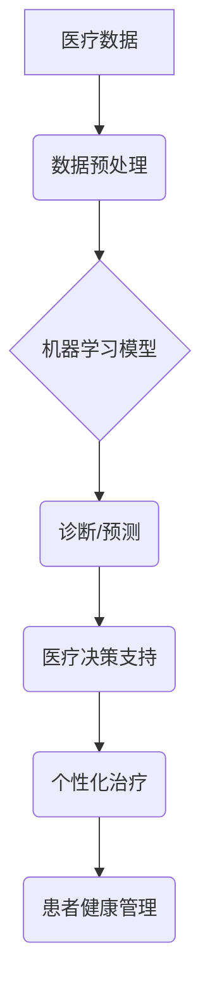

## AI驱动的智能医疗:降低医疗成本

> 关键词：人工智能、医疗成本、机器学习、深度学习、诊断、预测、个性化医疗

## 1. 背景介绍

医疗成本的持续攀升已成为全球范围内的严峻挑战。随着人口老龄化和慢性病的增加，医疗需求不断增长，而医疗资源的供给相对滞后，导致医疗费用居高不下。传统的医疗模式难以有效应对这一挑战，迫切需要探索新的解决方案。

人工智能（AI）作为一门新兴技术，凭借其强大的数据处理能力和学习能力，在医疗领域展现出巨大的潜力。AI驱动的智能医疗能够通过自动化流程、提高诊断准确率、个性化治疗方案等方式，有效降低医疗成本，提高医疗效率和患者体验。

## 2. 核心概念与联系

**2.1 核心概念**

* **人工智能 (AI):**  指模拟人类智能行为的计算机系统，包括机器学习、深度学习、自然语言处理等技术。
* **机器学习 (ML):**  一种人工智能技术，通过算法训练模型，使模型能够从数据中学习并做出预测或决策。
* **深度学习 (DL):**  一种机器学习的子集，利用多层神经网络模拟人类大脑的学习过程，能够处理复杂的数据模式。
* **智能医疗:**  利用人工智能技术辅助医疗诊断、治疗、管理等环节，提高医疗效率和质量。

**2.2 架构关系**



**2.3 联系**

AI驱动的智能医疗的核心是利用机器学习算法从海量医疗数据中学习，建立预测模型，辅助医生进行诊断、预测疾病风险、制定个性化治疗方案，最终降低医疗成本。

## 3. 核心算法原理 & 具体操作步骤

**3.1 算法原理概述**

常见的AI算法应用于智能医疗包括：

* **监督学习:** 利用标记数据训练模型，例如图像分类、疾病预测。
* **无监督学习:**  从未标记数据中发现模式，例如患者群体的聚类分析。
* **强化学习:**  通过奖励机制训练模型，例如机器人辅助手术。

**3.2 算法步骤详解**

以监督学习为例，其步骤如下：

1. **数据收集:** 收集相关医疗数据，例如患者病历、影像数据、基因数据等。
2. **数据预处理:** 清洗、转换、归一化数据，使其适合模型训练。
3. **模型选择:** 根据任务需求选择合适的机器学习模型，例如支持向量机、决策树、神经网络等。
4. **模型训练:** 利用标记数据训练模型，调整模型参数，使其能够准确预测目标变量。
5. **模型评估:** 利用测试数据评估模型的性能，例如准确率、召回率、F1-score等。
6. **模型部署:** 将训练好的模型部署到实际应用场景中，例如医疗诊断系统、疾病风险预测系统等。

**3.3 算法优缺点**

* **优点:** 能够自动学习数据模式，提高诊断准确率、预测精度，自动化流程，提高效率。
* **缺点:** 需要大量高质量数据进行训练，模型解释性较差，存在算法偏差和伦理问题。

**3.4 算法应用领域**

* **疾病诊断:**  利用图像识别、自然语言处理等技术辅助医生诊断疾病。
* **疾病预测:**  预测患者患病风险，进行早期干预。
* **个性化治疗:**  根据患者基因、生活方式等信息，制定个性化治疗方案。
* **药物研发:**  加速药物研发过程，降低研发成本。
* **医疗资源管理:**  优化医疗资源分配，提高医疗效率。

## 4. 数学模型和公式 & 详细讲解 & 举例说明

**4.1 数学模型构建**

在机器学习中，常用的数学模型包括线性回归、逻辑回归、支持向量机等。

* **线性回归:** 用于预测连续变量，假设目标变量与输入变量之间存在线性关系。

$$
y = \beta_0 + \beta_1x_1 + \beta_2x_2 +... + \beta_nx_n + \epsilon
$$

其中：

* $y$ 是目标变量
* $x_1, x_2,..., x_n$ 是输入变量
* $\beta_0, \beta_1,..., \beta_n$ 是模型参数
* $\epsilon$ 是误差项

* **逻辑回归:** 用于预测分类变量，将线性回归模型的输出映射到0到1之间的概率值。

$$
P(y=1|x) = \frac{1}{1 + e^{-( \beta_0 + \beta_1x_1 + \beta_2x_2 +... + \beta_nx_n )}}
$$

其中：

* $P(y=1|x)$ 是预测目标变量为1的概率
* $x_1, x_2,..., x_n$ 是输入变量
* $\beta_0, \beta_1,..., \beta_n$ 是模型参数

**4.2 公式推导过程**

模型参数的学习过程通常使用梯度下降算法，通过不断调整参数，使模型预测结果与实际结果之间的误差最小化。

**4.3 案例分析与讲解**

例如，利用线性回归模型预测患者的住院天数，输入变量包括患者年龄、性别、疾病类型等，输出变量是住院天数。通过训练模型，可以得到每个输入变量对住院天数的影响程度，并预测新患者的住院天数。

## 5. 项目实践：代码实例和详细解释说明

**5.1 开发环境搭建**

* Python 3.x
* TensorFlow/PyTorch 等深度学习框架
* Jupyter Notebook 等开发环境

**5.2 源代码详细实现**

```python
import tensorflow as tf

# 定义模型
model = tf.keras.models.Sequential([
  tf.keras.layers.Dense(64, activation='relu', input_shape=(n_features,)),
  tf.keras.layers.Dense(32, activation='relu'),
  tf.keras.layers.Dense(1)
])

# 编译模型
model.compile(loss='mean_squared_error', optimizer='adam')

# 训练模型
model.fit(X_train, y_train, epochs=100)

# 评估模型
loss = model.evaluate(X_test, y_test)
```

**5.3 代码解读与分析**

* 代码首先定义了一个简单的深度学习模型，包含三个全连接层。
* 每个全连接层都使用ReLU激活函数，除了最后一层使用线性激活函数。
* 模型使用均方误差作为损失函数，Adam优化器进行训练。
* 模型训练了100个epochs，并使用测试数据评估模型性能。

**5.4 运行结果展示**

训练完成后，可以查看模型的损失函数值，以及在测试数据上的预测准确率等指标。

## 6. 实际应用场景

**6.1 疾病诊断**

* **图像识别:** 利用深度学习算法识别医学影像中的异常，辅助医生诊断肿瘤、骨折、心血管疾病等。
* **自然语言处理:**  分析患者病历、症状描述等文本信息，辅助医生诊断疾病。

**6.2 疾病预测**

* **风险评估:**  根据患者的个人信息、生活方式、病史等数据，预测患者患病风险，进行早期干预。
* **疾病进展预测:**  预测疾病的进展情况，帮助医生制定治疗方案。

**6.3 个性化治疗**

* **基因检测:**  分析患者的基因信息，制定个性化的药物治疗方案。
* **药物组合推荐:**  根据患者的疾病类型、药物反应等信息，推荐最佳的药物组合。

**6.4 未来应用展望**

* **远程医疗:**  利用AI技术实现远程医疗诊断和治疗，提高医疗服务的可及性。
* **机器人辅助手术:**  利用AI技术辅助医生进行手术，提高手术精度和安全性。
* **虚拟医疗助手:**  开发AI驱动的虚拟医疗助手，为患者提供24小时的健康咨询和管理服务。

## 7. 工具和资源推荐

**7.1 学习资源推荐**

* **在线课程:** Coursera、edX、Udacity 等平台提供丰富的AI和机器学习课程。
* **书籍:** 《深度学习》、《机器学习实战》等书籍。
* **开源项目:** TensorFlow、PyTorch 等深度学习框架的官方文档和示例代码。

**7.2 开发工具推荐**

* **Python:**  AI开发的主要编程语言。
* **Jupyter Notebook:**  交互式编程环境，方便进行数据分析和模型开发。
* **TensorFlow/PyTorch:**  主流的深度学习框架。

**7.3 相关论文推荐**

* **AlphaFold:**  预测蛋白质结构的AI模型。
* **GPT-3:**  强大的文本生成模型。
* **BERT:**  用于自然语言理解的预训练模型。

## 8. 总结：未来发展趋势与挑战

**8.1 研究成果总结**

AI技术在医疗领域的应用取得了显著进展，例如疾病诊断、预测、个性化治疗等方面都取得了突破。

**8.2 未来发展趋势**

* **模型更加精准:**  随着数据量的增加和算法的改进，AI模型的预测精度将进一步提高。
* **应用场景更加广泛:**  AI技术将应用于更多医疗领域，例如远程医疗、机器人辅助手术等。
* **伦理问题更加突出:**  随着AI技术的应用越来越广泛，伦理问题将更加突出，需要制定相应的规范和政策。

**8.3 面临的挑战**

* **数据安全和隐私保护:**  医疗数据是高度敏感的信息，需要采取有效的措施保障数据安全和隐私。
* **算法解释性和可信度:**  AI模型的决策过程往往难以解释，需要提高算法的透明度和可信度。
* **医疗资源分配:**  AI技术可能会导致医疗资源分配不均，需要制定相应的政策和机制。

**8.4 研究展望**

未来，AI技术将继续推动医疗领域的变革，降低医疗成本，提高医疗效率和患者体验。需要加强基础研究，解决算法解释性、数据安全等问题，并制定相应的政策和规范，确保AI技术在医疗领域的健康发展。

## 9. 附录：常见问题与解答

**9.1 AI是否会取代医生？**

AI技术可以辅助医生工作，提高诊断和治疗效率，但不会取代医生。医生需要根据患者的具体情况，综合考虑多种因素，做出最终的诊断和治疗方案。

**9.2 AI驱动的医疗诊断是否准确？**

AI驱动的医疗诊断的准确率已经很高，但仍存在一定的误差。需要医生进行最终的判断和确认。

**9.3 AI驱动的医疗数据安全如何保障？**

医疗数据是高度敏感的信息，需要采取有效的措施保障数据安全和隐私。例如，使用加密技术保护数据传输，建立完善的数据安全管理体系等。


作者：禅与计算机程序设计艺术 / Zen and the Art of Computer Programming 
