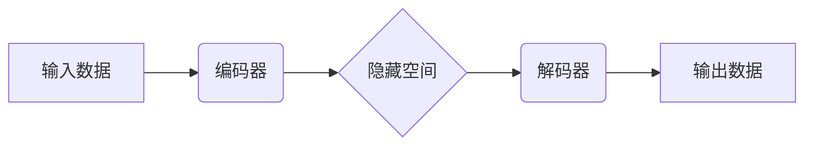

## Autoencoders 原理与代码实战案例讲解

> 关键词：Autoencoders, 深度学习, 无监督学习, 降维, 重建, 编码器, 解码器, 压缩, 异常检测

### 1. 背景介绍

在深度学习领域，无监督学习方法因其无需人工标注数据而备受关注。Autoencoders（自编码器）作为一种强大的无监督学习模型，在数据压缩、降维、异常检测等领域展现出巨大的潜力。

自编码器是一种神经网络架构，其核心思想是通过学习数据自身的特征表示来实现数据压缩和重构。它由两个主要部分组成：编码器和解码器。编码器负责将输入数据映射到一个低维的隐藏空间，而解码器则负责将隐藏空间中的表示映射回原始数据空间。

自编码器的训练目标是使解码器输出尽可能接近原始输入数据。通过这个过程，自编码器学习到了数据的本质特征，并能够对数据进行压缩和重构。

### 2. 核心概念与联系

自编码器的核心概念是将数据压缩到一个低维空间，并将其恢复到原始维度。

**Mermaid 流程图:**



**核心概念:**

* **编码器:** 将输入数据映射到一个低维的隐藏空间。
* **解码器:** 将隐藏空间中的表示映射回原始数据空间。
* **隐藏空间:**  一个低维空间，用于存储数据的本质特征。
* **重构误差:**  解码器输出与原始输入数据之间的差异。

### 3. 核心算法原理 & 具体操作步骤

#### 3.1 算法原理概述

自编码器的训练过程基于最小化重构误差。

1. **编码:** 输入数据通过编码器进行处理，得到一个低维的隐藏表示。
2. **解码:** 隐藏表示通过解码器进行处理，得到一个输出数据。
3. **损失函数:** 计算输出数据与原始输入数据之间的差异，即重构误差。
4. **反向传播:** 使用梯度下降算法，更新编码器和解码器的参数，以最小化重构误差。

#### 3.2 算法步骤详解

1. **初始化:** 初始化编码器和解码器的参数。
2. **前向传播:** 将输入数据输入到编码器，得到隐藏表示。将隐藏表示输入到解码器，得到输出数据。
3. **计算损失:** 使用损失函数计算输出数据与原始输入数据之间的差异。常用的损失函数包括均方误差（MSE）和交叉熵损失（Cross-Entropy Loss）。
4. **反向传播:** 计算梯度，并使用梯度下降算法更新编码器和解码器的参数。
5. **重复步骤2-4:** 迭代训练，直到重构误差达到最小值。

#### 3.3 算法优缺点

**优点:**

* 无需人工标注数据，适合于无监督学习任务。
* 可以有效地对数据进行压缩和降维。
* 能够学习到数据的本质特征，并用于其他机器学习任务。

**缺点:**

* 训练过程可能比较复杂，需要大量的计算资源。
* 对于复杂的数据集，可能难以学习到有效的特征表示。

#### 3.4 算法应用领域

* **数据压缩:** 将数据压缩到一个更小的空间，节省存储空间和传输带宽。
* **降维:** 将高维数据降维到低维空间，用于可视化和数据分析。
* **异常检测:** 识别数据中的异常值，用于安全和质量控制。
* **图像生成:** 生成新的图像，用于艺术创作和图像修复。
* **自然语言处理:** 用于文本摘要、主题提取和机器翻译等任务。

### 4. 数学模型和公式 & 详细讲解 & 举例说明

#### 4.1 数学模型构建

自编码器的数学模型可以表示为：

* **编码器:**  $h = f(x; \theta_e)$
* **解码器:**  $\hat{x} = g(h; \theta_d)$

其中：

* $x$ 是输入数据。
* $h$ 是隐藏空间中的表示。
* $\hat{x}$ 是解码器输出的数据。
* $f$ 是编码器的激活函数。
* $g$ 是解码器的激活函数。
* $\theta_e$ 和 $\theta_d$ 分别是编码器和解码器的参数。

#### 4.2 公式推导过程

自编码器的训练目标是最小化重构误差，常用的损失函数是均方误差（MSE）：

$$
L = \frac{1}{N} \sum_{i=1}^{N} ||x_i - \hat{x}_i||^2
$$

其中：

* $N$ 是训练数据的数量。
* $x_i$ 是第 $i$ 个训练数据。
* $\hat{x}_i$ 是解码器输出的第 $i$ 个训练数据。

通过梯度下降算法，更新编码器和解码器的参数：

$$
\theta_e = \theta_e - \alpha \frac{\partial L}{\partial \theta_e}
$$

$$
\theta_d = \theta_d - \alpha \frac{\partial L}{\partial \theta_d}
$$

其中：

* $\alpha$ 是学习率。

#### 4.3 案例分析与讲解

假设我们有一个图像数据集，想要使用自编码器进行图像压缩。

1. **编码器:** 可以使用卷积神经网络（CNN）作为编码器，学习图像的特征表示。
2. **解码器:** 可以使用转置卷积神经网络（DeconvNet）作为解码器，将隐藏空间中的表示映射回原始图像大小。
3. **训练:** 使用 MSE 损失函数，训练编码器和解码器，使解码器输出的图像尽可能接近原始图像。

经过训练，自编码器能够学习到图像的本质特征，并将其压缩到一个更小的空间。

### 5. 项目实践：代码实例和详细解释说明

#### 5.1 开发环境搭建

* Python 3.6+
* TensorFlow 或 PyTorch

#### 5.2 源代码详细实现

```python
import tensorflow as tf

# 定义编码器
encoder = tf.keras.Sequential([
    tf.keras.layers.Input(shape=(28, 28, 1)),
    tf.keras.layers.Conv2D(32, (3, 3), activation='relu'),
    tf.keras.layers.MaxPooling2D((2, 2)),
    tf.keras.layers.Conv2D(64, (3, 3), activation='relu'),
    tf.keras.layers.MaxPooling2D((2, 2)),
    tf.keras.layers.Flatten(),
    tf.keras.layers.Dense(128, activation='relu'),
])

# 定义解码器
decoder = tf.keras.Sequential([
    tf.keras.layers.Input(shape=(128,)),
    tf.keras.layers.Dense(7 * 7 * 64, activation='relu'),
    tf.keras.layers.Reshape((7, 7, 64)),
    tf.keras.layers.Conv2DTranspose(64, (3, 3), strides=(2, 2), activation='relu'),
    tf.keras.layers.Conv2DTranspose(32, (3, 3), strides=(2, 2), activation='relu'),
    tf.keras.layers.Conv2D(1, (3, 3), activation='sigmoid'),
])

# 定义自编码器模型
autoencoder = tf.keras.Model(inputs=encoder.input, outputs=decoder(encoder.output))

# 编译模型
autoencoder.compile(optimizer='adam', loss='binary_crossentropy')

# 训练模型
autoencoder.fit(x_train, x_train, epochs=10)

# 保存模型
autoencoder.save('autoencoder_model.h5')
```

#### 5.3 代码解读与分析

* **编码器:** 使用卷积神经网络提取图像特征，并将其压缩到一个低维空间。
* **解码器:** 使用转置卷积神经网络将低维空间的表示映射回原始图像大小。
* **自编码器模型:** 将编码器和解码器组合在一起，形成完整的自编码器模型。
* **编译模型:** 使用 Adam 优化器和二进制交叉熵损失函数编译模型。
* **训练模型:** 使用训练数据训练自编码器模型。
* **保存模型:** 保存训练好的自编码器模型。

#### 5.4 运行结果展示

训练完成后，可以使用自编码器模型对新的图像进行压缩和重构。

### 6. 实际应用场景

#### 6.1 数据压缩

自编码器可以用于压缩图像、音频、文本等各种类型的数据。

#### 6.2 降维

自编码器可以将高维数据降维到低维空间，用于可视化和数据分析。

#### 6.3 异常检测

自编码器可以学习到数据的正常模式，并识别数据中的异常值。

#### 6.4 未来应用展望

* **生成对抗网络 (GAN):** 自编码器可以作为 GAN 的生成器部分，用于生成新的数据。
* **强化学习:** 自编码器可以用于强化学习中的状态表示和奖励函数设计。
* **医疗图像分析:** 自编码器可以用于医学图像的分割、分类和异常检测。

### 7. 工具和资源推荐

#### 7.1 学习资源推荐

* **书籍:**
    * Deep Learning by Ian Goodfellow, Yoshua Bengio, and Aaron Courville
    * Hands-On Machine Learning with Scikit-Learn, Keras & TensorFlow by Aurélien Géron
* **在线课程:**
    * Deep Learning Specialization by Andrew Ng (Coursera)
    * Fast.ai Practical Deep Learning for Coders

#### 7.2 开发工具推荐

* **TensorFlow:** https://www.tensorflow.org/
* **PyTorch:** https://pytorch.org/

#### 7.3 相关论文推荐

* Auto-Encoding Variational Bayes by Kingma and Welling (2013)
* Convolutional Autoencoders for Dimensionality Reduction by Vincent et al. (2008)
* Stacked Autoencoders for Sparse Representation by Hinton and Salakhutdinov (2006)

### 8. 总结：未来发展趋势与挑战

#### 8.1 研究成果总结

自编码器作为一种强大的无监督学习模型，在数据压缩、降维、异常检测等领域取得了显著的成果。

#### 8.2 未来发展趋势

* **更深层次的网络结构:** 使用更深层次的网络结构，学习到更复杂的特征表示。
* **新的激活函数和损失函数:** 探索新的激活函数和损失函数，提高模型的性能。
* **结合其他机器学习方法:** 将自编码器与其他机器学习方法结合，例如 GAN 和强化学习，开发更强大的模型。

#### 8.3 面临的挑战

* **训练效率:** 自编码器的训练过程可能比较耗时，需要大量的计算资源。
* **过拟合:** 自编码器容易过拟合训练数据，需要使用正则化技术来缓解这个问题。
* **可解释性:** 自编码器的内部机制比较复杂，难以解释模型的决策过程。

#### 8.4 研究展望

未来，研究者将继续探索自编码器的新的应用场景和改进方法，使其在更多领域发挥更大的作用。

### 9. 附录：常见问题与解答

* **什么是自编码器的隐藏空间？**

隐藏空间是一个低维空间，用于存储数据的本质特征。

* **自编码器如何进行数据压缩？**

自编码器通过编码器将数据映射到一个低维空间，从而实现数据压缩。

* **自编码器有哪些应用场景？**

自编码器的应用场景包括数据压缩、降维、异常检测、图像生成等。


作者：禅与计算机程序设计艺术