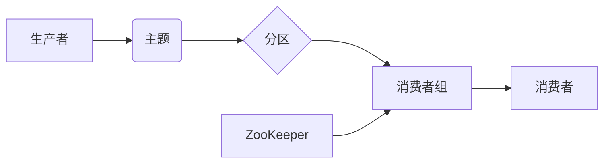

## Kafka Group原理与代码实例讲解

> 关键词：Kafka, Group, 分区, 消费, 负载均衡, 协调, 消费者组, ZooKeeper

## 1. 背景介绍

Apache Kafka 作为一款高性能、分布式、可扩展的消息队列系统，在处理海量数据流和构建实时数据处理系统方面发挥着至关重要的作用。Kafka 的核心功能之一是消息消费，它通过消费者组机制实现消息的均衡分配和可靠消费。

消费者组（Consumer Group）是 Kafka 中用于管理消费者并实现消息负载均衡的关键概念。它允许多个消费者协同消费同一主题的消息，并确保消息不会被重复消费。

## 2. 核心概念与联系

### 2.1 消费者组概念

消费者组是一个由多个消费者组成的逻辑集合。每个消费者组都订阅同一个主题，并负责消费该主题的消息。

### 2.2 分区概念

Kafka 主题被划分为多个分区，每个分区都是一个独立的消息队列。消费者组可以订阅一个或多个主题的分区。

### 2.3 消费者协调

消费者组的协调由 ZooKeeper 负责。ZooKeeper 维护着消费者组的状态信息，包括消费者组成员、每个消费者负责的分区等。

**Kafka Group 核心架构流程图**



## 3. 核心算法原理 & 具体操作步骤

### 3.1 算法原理概述

Kafka 消费者组的负载均衡算法基于 **Range Assignment** 和 **Rebalance** 机制。

* **Range Assignment:** 消费者组成员根据其 ID 和主题分区数量，分配到不同的分区范围。
* **Rebalance:** 当消费者组成员发生变化（加入或离开）时，Kafka 会触发重新分配（Rebalance）过程，重新分配分区到消费者组成员。

### 3.2 算法步骤详解

1. **消费者加入消费者组:** 消费者向 ZooKeeper 注册，加入到指定的消费者组。
2. **分配分区:** Kafka 根据 Range Assignment 算法，将主题分区分配给消费者组成员。
3. **消费消息:** 消费者从分配到的分区中消费消息。
4. **消费者离开消费者组:** 消费者向 ZooKeeper 注销，离开消费者组。
5. **重新分配分区:** 当消费者组成员发生变化时，Kafka 会触发 Rebalance 过程，重新分配分区到消费者组成员。

### 3.3 算法优缺点

**优点:**

* **负载均衡:** 消费者组成员可以均衡地消费消息，提高消息处理效率。
* **容错性:** 当消费者出现故障时，其他消费者组成员可以继续消费消息，保证消息的可靠性。
* **可扩展性:** 消费者组可以动态添加或移除成员，方便系统扩展。

**缺点:**

* **复杂性:** 消费者组的协调机制相对复杂，需要依赖 ZooKeeper。
* **性能开销:** Rebalance 过程会带来一定的性能开销。

### 3.4 算法应用领域

Kafka 消费者组的负载均衡算法广泛应用于各种实时数据处理系统，例如：

* **日志分析:** 将日志消息分发到不同的消费者组，进行实时分析和告警。
* **数据流处理:** 将数据流消息分发到不同的消费者组，进行数据清洗、转换和加载。
* **实时监控:** 将监控数据分发到不同的消费者组，进行实时监控和报警。

## 4. 数学模型和公式 & 详细讲解 & 举例说明

### 4.1 数学模型构建

Kafka 消费者组的负载均衡算法可以抽象为一个数学模型，其中：

* **N:** 主题分区数量
* **M:** 消费者组成员数量
* **i:** 消费者组成员 ID (1 ≤ i ≤ M)
* **j:** 主题分区 ID (1 ≤ j ≤ N)

### 4.2 公式推导过程

**Range Assignment 算法:**

每个消费者组成员的负责分区范围可以计算为：

```latex
range_i = \left\lfloor \frac{N}{M} * i \right\rfloor - \left\lfloor \frac{N}{M} * (i - 1) \right\rfloor
```

其中，$\lfloor x \rfloor$ 表示向下取整函数。

**Rebalance 算法:**

当消费者组成员发生变化时，Kafka 会重新分配分区。Rebalance 算法通常基于以下原则：

* **尽量保持分区分配均衡:** 重新分配分区后，每个消费者组成员负责的分区数量尽量接近。
* **最小化数据迁移:** 尽量减少消息在分区之间的迁移，降低系统性能影响。

### 4.3 案例分析与讲解

假设一个主题有 10 个分区，有 3 个消费者组成员。

根据 Range Assignment 算法，每个消费者组成员的负责分区范围为：

* 消费者组成员 1: 分区 0-3
* 消费者组成员 2: 分区 4-6
* 消费者组成员 3: 分区 7-9

如果消费者组成员 2 离开消费者组，Kafka 会触发 Rebalance 过程，重新分配分区。

重新分配后的分区范围可能为：

* 消费者组成员 1: 分区 0-3
* 消费者组成员 3: 分区 4-9

## 5. 项目实践：代码实例和详细解释说明

### 5.1 开发环境搭建

* Java Development Kit (JDK) 8 或以上
* Apache Kafka 集群
* ZooKeeper 集群
* Maven 或 Gradle 构建工具

### 5.2 源代码详细实现

```java
import org.apache.kafka.clients.consumer.*;
import org.apache.kafka.common.serialization.StringDeserializer;

import java.time.Duration;
import java.util.Collections;
import java.util.Properties;

public class KafkaConsumerExample {

    public static void main(String[] args) {
        // 配置消费者属性
        Properties props = new Properties();
        props.put(ConsumerConfig.BOOTSTRAP_SERVERS_CONFIG, "localhost:9092");
        props.put(ConsumerConfig.GROUP_ID_CONFIG, "my-group");
        props.put(ConsumerConfig.KEY_DESERIALIZER_CLASS_CONFIG, StringDeserializer.class.getName());
        props.put(ConsumerConfig.VALUE_DESERIALIZER_CLASS_CONFIG, StringDeserializer.class.getName());

        // 创建消费者实例
        KafkaConsumer<String, String> consumer = new KafkaConsumer<>(props);

        // 订阅主题
        consumer.subscribe(Collections.singletonList("my-topic"));

        // 消费消息
        while (true) {
            ConsumerRecords<String, String> records = consumer.poll(Duration.ofMillis(100));
            for (ConsumerRecord<String, String> record : records) {
                System.out.println("Partition: " + record.partition() + ", Offset: " + record.offset() + ", Key: " + record.key() + ", Value: " + record.value());
            }
        }
    }
}
```

### 5.3 代码解读与分析

* **配置消费者属性:** 设置 Kafka 集群地址、消费者组 ID、键和值反序列化器等属性。
* **创建消费者实例:** 使用配置属性创建 KafkaConsumer 实例。
* **订阅主题:** 使用 subscribe 方法订阅指定的主题。
* **消费消息:** 使用 poll 方法从主题中拉取消息，并处理消息内容。

### 5.4 运行结果展示

当消费者运行时，它会从订阅的主题中拉取消息，并打印消息的 partition、offset、key 和 value。

## 6. 实际应用场景

### 6.1 实时数据分析

Kafka 消费者组可以用于实时分析日志、监控数据等海量数据流。

### 6.2 数据流处理

Kafka 消费者组可以用于将数据流消息分发到不同的处理节点，进行数据清洗、转换和加载。

### 6.3 实时监控

Kafka 消费者组可以用于将监控数据分发到不同的监控系统，进行实时监控和报警。

### 6.4 未来应用展望

随着数据量的不断增长和实时数据处理需求的增加，Kafka 消费者组将在未来应用场景中发挥更加重要的作用。例如：

* **物联网数据处理:** 处理海量物联网设备产生的数据，进行实时分析和控制。
* **金融交易监控:** 实时监控金融交易数据，进行风险控制和欺诈检测。
* **个性化推荐:** 基于用户行为数据，进行个性化推荐。

## 7. 工具和资源推荐

### 7.1 学习资源推荐

* **Apache Kafka 官方文档:** https://kafka.apache.org/documentation/
* **Kafka 入门教程:** https://www.tutorialspoint.com/kafka/index.htm
* **Kafka 消费者组详解:** https://www.confluent.io/blog/understanding-kafka-consumer-groups/

### 7.2 开发工具推荐

* **Kafka Console Producer/Consumer:** 用于测试和调试 Kafka 消息生产和消费。
* **Kafka Manager:** 用于管理 Kafka 集群和主题。
* **Confluent Platform:** 基于 Apache Kafka 的商业平台，提供更丰富的功能和支持。

### 7.3 相关论文推荐

* **Kafka: A Distributed Streaming Platform:** https://static.confluent.io/downloads/white-papers/Kafka-Whitepaper.pdf
* **Consumer Groups in Apache Kafka:** https://cwiki.apache.org/confluence/display/KAFKA/Consumer+Groups

## 8. 总结：未来发展趋势与挑战

### 8.1 研究成果总结

Kafka 消费者组机制为构建高性能、可靠的实时数据处理系统提供了强大的工具。

### 8.2 未来发展趋势

* **更智能的负载均衡算法:** 基于机器学习等技术，实现更智能的负载均衡算法，提高消息处理效率。
* **更强大的容错机制:** 提高消费者组的容错能力，确保消息的可靠消费。
* **更丰富的应用场景:** Kafka 消费者组将应用于更多领域，例如物联网、金融、医疗等。

### 8.3 面临的挑战

* **复杂性:** 消费者组的协调机制相对复杂，需要不断优化和简化。
* **性能开销:** Rebalance 过程会带来一定的性能开销，需要进一步降低开销。
* **安全问题:** 消费者组需要考虑安全问题，防止消息被篡改或泄露。

### 8.4 研究展望

未来，我们将继续研究 Kafka 消费者组机制，探索更智能、更可靠、更安全的消费者组解决方案，推动实时数据处理技术的进步。

## 9. 附录：常见问题与解答

### 9.1 消费者组成员数量如何确定？

消费者组成员数量应根据主题分区数量和消息处理能力进行确定。一般来说，消费者组成员数量应与主题分区数量相等或接近。

### 9.2 如何解决消费者组成员故障问题？

Kafka 消费者组具有自动故障恢复机制，当消费者组成员出现故障时，其他消费者组成员会自动接管其负责的分区，保证消息的可靠消费。

### 9.3 如何监控消费者组的运行状态？

可以使用 Kafka Manager 等工具监控消费者组的运行状态，包括消费者组成员数量、分区分配情况、消息消费进度等。


作者：禅与计算机程序设计艺术 / Zen and the Art of Computer Programming 
