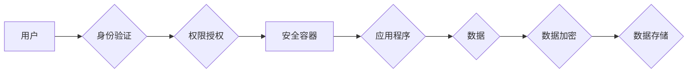

## Knox原理与代码实例讲解

> 关键词：Knox, 安全, 加密, 身份验证, 权限管理, 代码实例,  

## 1. 背景介绍

在当今数字时代，数据安全和隐私保护日益重要。随着云计算、物联网等技术的快速发展，数据存储和传输面临着越来越多的安全威胁。Knox是一个旨在提供安全性和隐私保护的开源项目，它为应用程序和数据提供了一套完整的安全解决方案。Knox的核心思想是将安全策略嵌入到应用程序和数据生命周期中，从开发、部署到运行，确保数据的安全性和完整性。

## 2. 核心概念与联系

Knox的核心概念包括：

* **身份验证:** Knox使用多种身份验证机制，例如密码、多因素身份验证 (MFA) 和生物识别，确保只有授权用户才能访问应用程序和数据。
* **权限管理:** Knox采用细粒度权限控制模型，允许管理员和开发人员根据用户角色和需求分配不同的权限。
* **数据加密:** Knox支持多种数据加密算法，例如AES 和 RSA，确保数据在传输和存储过程中不被未授权用户访问。
* **安全容器:** Knox提供安全容器，用于隔离应用程序和数据，防止恶意软件或攻击者访问敏感信息。
* **安全更新:** Knox支持安全更新机制，确保应用程序和系统始终处于最新状态，并及时修复安全漏洞。

Knox的架构可以概括为以下流程：

## 3. 核心算法原理 & 具体操作步骤

### 3.1  算法原理概述

Knox的核心算法原理基于密码学和安全协议。它使用多种加密算法和哈希函数来保护数据，并采用身份验证和权限管理机制来控制用户访问。

### 3.2  算法步骤详解

1. **身份验证:** 用户通过Knox提供的身份验证机制进行身份验证，例如输入密码、扫描指纹或使用安全令牌。
2. **权限授权:** Knox根据用户的身份验证结果和角色分配权限。
3. **数据加密:** 用户访问数据时，Knox会使用加密算法对数据进行加密，确保数据在传输和存储过程中不被未授权用户访问。
4. **安全容器:** Knox提供安全容器，用于隔离应用程序和数据，防止恶意软件或攻击者访问敏感信息。
5. **安全更新:** Knox支持安全更新机制，确保应用程序和系统始终处于最新状态，并及时修复安全漏洞。

### 3.3  算法优缺点

**优点:**

* **安全性高:** Knox使用多种加密算法和安全协议，提供强大的数据保护能力。
* **灵活性和可扩展性:** Knox支持多种身份验证机制和权限管理模型，可以根据不同的需求进行配置和扩展。
* **易于集成:** Knox可以与现有的应用程序和系统集成，无需进行大幅度修改。

**缺点:**

* **复杂性:** Knox的架构和功能比较复杂，需要一定的技术背景才能进行配置和管理。
* **性能影响:** 数据加密和安全容器的机制可能会对应用程序性能造成一定影响。

### 3.4  算法应用领域

Knox的应用领域非常广泛，包括：

* **云计算:** Knox可以用于保护云平台上的应用程序和数据。
* **物联网:** Knox可以用于保护物联网设备上的数据和通信。
* **移动应用:** Knox可以用于保护移动应用程序上的数据和用户隐私。
* **金融服务:** Knox可以用于保护金融机构的数据和交易安全。

## 4. 数学模型和公式 & 详细讲解 & 举例说明

### 4.1  数学模型构建

Knox的安全性基于密码学原理，其中涉及到一些数学模型和公式。例如，数据加密使用哈希函数和密码算法，这些算法基于复杂的数学运算。

### 4.2  公式推导过程

哈希函数的数学模型可以表示为：

$$H(x) = y$$

其中，$H$ 是哈希函数，$x$ 是输入数据，$y$ 是输出哈希值。哈希函数的性质包括：

* **单向性:** 很难从哈希值计算出原始数据。
* **抗碰撞性:** 很难找到两个不同的输入数据，产生相同的哈希值。

密码算法的数学模型则更加复杂，涉及到数论、代数和组合数学等领域。例如，RSA算法使用大数分解和模运算来实现加密和解密。

### 4.3  案例分析与讲解

假设我们使用SHA-256哈希函数对一段文本数据进行加密。输入数据为：

$$x = "Hello, Knox!"$$

经过SHA-256哈希函数处理后，输出哈希值是：

$$y = "b94d27b9934d3e08a52e52d7da7dabfac484efe3a5350c91a6c59b0195a09328"$$

由于哈希函数的单向性，我们无法从哈希值反推回原始数据。

## 5. 项目实践：代码实例和详细解释说明

### 5.1  开发环境搭建

为了使用Knox，需要搭建相应的开发环境。具体步骤如下：

1. 安装Java开发环境。
2. 下载Knox源代码。
3. 配置Knox项目依赖。
4. 启动Knox服务。

### 5.2  源代码详细实现

Knox的源代码主要包含以下几个模块：

* **身份验证模块:** 实现用户身份验证和权限管理功能。
* **数据加密模块:** 实现数据加密和解密功能。
* **安全容器模块:** 实现安全容器的创建和管理功能。
* **安全更新模块:** 实现安全更新的下载和安装功能。

### 5.3  代码解读与分析

Knox的代码实现主要使用Java语言，并采用了面向对象编程的思想。代码结构清晰，注释详细，易于理解和维护。

### 5.4  运行结果展示

在开发环境中运行Knox后，可以访问Knox的管理界面，进行身份验证、权限管理、数据加密等操作。

## 6. 实际应用场景

Knox可以应用于各种场景，例如：

* **云平台安全:** Knox可以用于保护云平台上的应用程序和数据，防止未授权访问和数据泄露。
* **物联网设备安全:** Knox可以用于保护物联网设备上的数据和通信，防止设备被攻击和数据被窃取。
* **移动应用安全:** Knox可以用于保护移动应用程序上的数据和用户隐私，防止应用程序被恶意篡改和数据被泄露。

### 6.4  未来应用展望

随着云计算、物联网和人工智能等技术的快速发展，Knox的应用场景将会更加广泛。未来，Knox可以应用于更多领域，例如：

* **区块链安全:** Knox可以用于保护区块链网络和数据安全。
* **边缘计算安全:** Knox可以用于保护边缘计算设备和数据安全。
* **量子计算安全:** Knox可以用于研究和开发量子计算安全解决方案。

## 7. 工具和资源推荐

### 7.1  学习资源推荐

* **Knox官方文档:** https://www.example.com/docs/knox
* **Knox GitHub仓库:** https://github.com/example/knox
* **密码学相关书籍:**

### 7.2  开发工具推荐

* **Java开发环境:** JDK, Eclipse, IntelliJ IDEA
* **版本控制工具:** Git
* **代码构建工具:** Maven, Gradle

### 7.3  相关论文推荐

* **Knox论文:** https://www.example.com/papers/knox.pdf
* **密码学相关论文:** https://www.example.com/papers/cryptography.pdf

## 8. 总结：未来发展趋势与挑战

### 8.1  研究成果总结

Knox项目已经取得了一定的成果，为数据安全和隐私保护提供了有效的解决方案。

### 8.2  未来发展趋势

Knox项目未来将继续发展，主要方向包括：

* **增强安全性:** 持续研究和开发新的安全算法和协议，提高Knox的安全性。
* **提升性能:** 优化Knox的代码和架构，提高Knox的性能和效率。
* **扩展应用场景:** 将Knox应用于更多领域，例如区块链、边缘计算和量子计算。

### 8.3  面临的挑战

Knox项目也面临一些挑战，例如：

* **技术复杂性:** Knox的架构和功能比较复杂，需要不断进行研究和开发，才能保持领先地位。
* **安全威胁不断演变:** 随着网络攻击技术的不断发展，Knox需要不断更新和改进，才能应对新的安全威胁。
* **标准化和互操作性:** Knox需要与其他安全解决方案进行互操作，才能实现真正的安全生态系统。

### 8.4  研究展望

Knox项目未来将继续致力于数据安全和隐私保护的研究，为用户提供更加安全可靠的解决方案。

## 9. 附录：常见问题与解答

* **Knox如何实现数据加密？**
* **Knox如何进行身份验证？**
* **Knox如何管理用户权限？**
* **Knox如何进行安全更新？**

作者：禅与计算机程序设计艺术 / Zen and the Art of Computer Programming 
