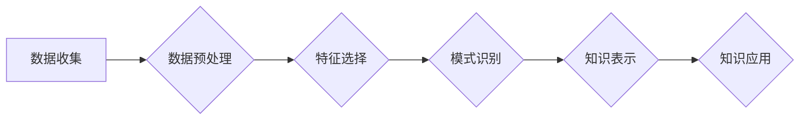

## 【AI大数据计算原理与代码实例讲解】数据挖掘

> 关键词：数据挖掘、机器学习、算法、数据分析、数据可视化、Python、Scikit-learn

## 1. 背景介绍

在海量数据的时代，数据挖掘作为一种从海量数据中发现隐藏模式、规律和知识的科学方法，显得尤为重要。它为我们提供了洞察数据本质、揭示数据背后的故事的强大工具。数据挖掘技术广泛应用于各个领域，例如商业分析、金融预测、医疗诊断、科学研究等，帮助人们做出更明智的决策，提升效率和效益。

随着人工智能技术的快速发展，数据挖掘也迎来了新的机遇和挑战。深度学习、强化学习等新兴技术为数据挖掘提供了更强大的工具和方法，使得数据挖掘能够处理更复杂的数据，发现更深层次的知识。

## 2. 核心概念与联系

数据挖掘的核心概念包括：

* **数据预处理:**  对原始数据进行清洗、转换、整合等操作，使其适合进行挖掘分析。
* **特征选择:**  从原始数据中选择最具代表性和预测力的特征，提高模型的准确性和效率。
* **模式识别:**  利用算法从数据中发现模式、规律和异常值。
* **知识表示:**  将挖掘出的知识以可理解的形式表示出来，例如规则、模型、图表等。

数据挖掘流程通常包括以下几个步骤：



## 3. 核心算法原理 & 具体操作步骤

### 3.1  算法原理概述

**分类算法**

分类算法的目标是将数据点划分为不同的类别。常见的分类算法包括：

* **决策树:**  通过一系列的规则，将数据点分层分类。
* **支持向量机 (SVM):**  寻找一个最佳的超平面，将不同类别的数据点分开。
* **逻辑回归:**  使用逻辑函数对数据进行分类。

**聚类算法**

聚类算法的目标是将数据点根据相似性进行分组。常见的聚类算法包括：

* **K-means:**  将数据点划分为K个簇，每个簇的中心点是该簇中所有数据点的平均值。
* **层次聚类:**  将数据点逐步合并成簇，直到所有数据点都属于同一个簇。
* **DBSCAN:**  根据数据点的密度来划分簇。

### 3.2  算法步骤详解

**决策树算法步骤:**

1. 选择一个最优特征作为根节点。
2. 根据该特征将数据点分成不同的子集。
3. 对每个子集重复步骤1和步骤2，直到满足停止条件。
4. 将每个叶子节点标记为一个类别。

**K-means算法步骤:**

1. 随机选择K个数据点作为初始的簇中心。
2. 将每个数据点分配到距离其最近的簇中心。
3. 计算每个簇的中心点。
4. 将每个数据点重新分配到距离其最近的簇中心。
5. 重复步骤3和步骤4，直到簇中心不再变化。

### 3.3  算法优缺点

**决策树算法:**

* **优点:** 易于理解和解释，可以处理不同类型的数据。
* **缺点:** 容易过拟合，对数据噪声敏感。

**K-means算法:**

* **优点:** 算法简单，计算效率高。
* **缺点:** 需要预先指定簇的数量，对初始簇中心的选择敏感。

### 3.4  算法应用领域

**决策树算法:**

* 医疗诊断
* 欺诈检测
* 客户关系管理

**K-means算法:**

* 市场细分
* 图像压缩
* 文本聚类

## 4. 数学模型和公式 & 详细讲解 & 举例说明

### 4.1  数学模型构建

**决策树模型:**

决策树可以表示为一棵树形结构，其中每个节点代表一个特征，每个分支代表一个特征的取值，每个叶子节点代表一个类别。

**K-means模型:**

K-means模型的目标是找到K个簇中心，使得每个数据点到其所属簇中心的距离最小。

### 4.2  公式推导过程

**K-means算法的目标函数:**

$$
J = \sum_{i=1}^{K} \sum_{x \in C_i} ||x - \mu_i||^2
$$

其中:

* $J$ 是目标函数
* $K$ 是簇的数量
* $C_i$ 是第 $i$ 个簇
* $x$ 是数据点
* $\mu_i$ 是第 $i$ 个簇的中心点

**目标函数的最小化:**

K-means算法通过迭代更新簇中心点来最小化目标函数。

### 4.3  案例分析与讲解

**决策树案例:**

假设我们想要预测一个学生的成绩，根据其学习时间和考试次数进行分类。我们可以构建一个决策树模型，其中学习时间和考试次数作为特征，成绩分为优秀、良好、及格三个类别。

**K-means案例:**

假设我们想要将客户群体进行市场细分，根据其消费金额和购买频率进行聚类。我们可以使用K-means算法将客户分为不同的消费群体，例如高消费群体、中消费群体、低消费群体。

## 5. 项目实践：代码实例和详细解释说明

### 5.1  开发环境搭建

* Python 3.x
* Scikit-learn

### 5.2  源代码详细实现

```python
from sklearn.tree import DecisionTreeClassifier
from sklearn.cluster import KMeans
from sklearn.datasets import load_iris

# 加载iris数据集
iris = load_iris()
X = iris.data
y = iris.target

# 决策树分类
clf = DecisionTreeClassifier()
clf.fit(X, y)

# K-means聚类
kmeans = KMeans(n_clusters=3)
kmeans.fit(X)

# 预测
y_pred = clf.predict(X)

# 聚类结果
labels = kmeans.labels_
```

### 5.3  代码解读与分析

* **决策树分类:**

```python
clf = DecisionTreeClassifier()
clf.fit(X, y)
```

* 创建一个决策树分类器对象 `clf`。
* 使用 `fit()` 方法训练决策树模型，输入特征数据 `X` 和标签数据 `y`。

* **K-means聚类:**

```python
kmeans = KMeans(n_clusters=3)
kmeans.fit(X)
```

* 创建一个K-means聚类器对象 `kmeans`，指定聚类数量为3。
* 使用 `fit()` 方法训练K-means模型，输入特征数据 `X`。

* **预测:**

```python
y_pred = clf.predict(X)
```

* 使用训练好的决策树模型 `clf` 对特征数据 `X` 进行预测，得到预测结果 `y_pred`。

* **聚类结果:**

```python
labels = kmeans.labels_
```

* 获取K-means模型的聚类结果 `labels`，每个数据点对应一个簇标签。

### 5.4  运行结果展示

运行代码后，可以得到决策树分类的预测结果和K-means聚类的簇标签。

## 6. 实际应用场景

### 6.1  商业分析

* **客户行为分析:**  分析客户的购买行为、浏览习惯等，进行精准营销。
* **市场趋势预测:**  分析市场数据，预测未来市场趋势，帮助企业制定战略决策。
* **产品推荐:**  根据用户的购买历史和兴趣爱好，推荐相关的产品。

### 6.2  金融预测

* **信用风险评估:**  评估客户的信用风险，帮助银行进行贷款审批。
* **股票价格预测:**  分析股票市场数据，预测股票价格走势。
* **欺诈检测:**  检测金融交易中的欺诈行为。

### 6.3  医疗诊断

* **疾病诊断:**  根据患者的症状和检查结果，辅助医生进行疾病诊断。
* **药物研发:**  分析药物的疗效和副作用，加速药物研发过程。
* **患者风险评估:**  评估患者的健康风险，帮助医生制定个性化治疗方案。

### 6.4  未来应用展望

随着人工智能技术的不断发展，数据挖掘将在更多领域得到应用，例如：

* **个性化教育:**  根据学生的学习情况，提供个性化的学习方案。
* **智能交通:**  优化交通流量，提高交通效率。
* **智能制造:**  提高生产效率，降低生产成本。

## 7. 工具和资源推荐

### 7.1  学习资源推荐

* **书籍:**
    * 《数据挖掘：概念与技术》
    * 《机器学习》
* **在线课程:**
    * Coursera: 数据挖掘
    * edX: 机器学习
* **网站:**
    * scikit-learn: https://scikit-learn.org/
    * Kaggle: https://www.kaggle.com/

### 7.2  开发工具推荐

* **Python:**  数据挖掘的常用编程语言。
* **Scikit-learn:**  Python机器学习库。
* **Pandas:**  Python数据分析库。
* **NumPy:**  Python数值计算库。

### 7.3  相关论文推荐

* **《The Elements of Statistical Learning》**
* **《Introduction to Machine Learning》**

## 8. 总结：未来发展趋势与挑战

### 8.1  研究成果总结

数据挖掘技术取得了显著的成果，在各个领域得到了广泛应用。

### 8.2  未来发展趋势

* **深度学习:**  深度学习算法能够处理更复杂的数据，发现更深层次的知识。
* **云计算:**  云计算平台为数据挖掘提供了强大的计算资源和存储空间。
* **大数据:**  大数据时代，数据挖掘技术将面临更大的挑战和机遇。

### 8.3  面临的挑战

* **数据质量:**  数据挖掘的准确性依赖于数据质量，如何处理脏数据和缺失数据是一个挑战。
* **算法 interpretability:**  许多数据挖掘算法难以解释，如何提高算法的透明度和可解释性是一个重要问题。
* **隐私保护:**  数据挖掘涉及到大量个人数据，如何保护用户隐私是一个重要的伦理问题。

### 8.4  研究展望

未来，数据挖掘技术将继续发展，朝着更智能、更可解释、更安全的方向发展。


## 9. 附录：常见问题与解答

* **什么是数据挖掘？**

数据挖掘是一种从数据中发现隐藏模式、规律和知识的科学方法。

* **数据挖掘有哪些常用算法？**

常见的分类算法包括决策树、支持向量机、逻辑回归。常见的聚类算法包括K-means、层次聚类、DBSCAN。

* **如何选择合适的算法？**

选择合适的算法需要根据具体的数据特点和业务需求进行考虑。

* **数据挖掘的应用场景有哪些？**

数据挖掘广泛应用于各个领域，例如商业分析、金融预测、医疗诊断、科学研究等。


作者：禅与计算机程序设计艺术 / Zen and the Art of Computer Programming 
