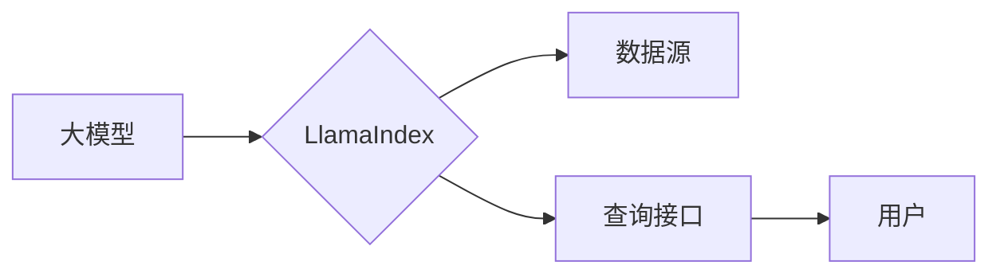

## 【大模型应用开发 动手做AI Agent】说说LlamaIndex

> 关键词：LlamaIndex, 大模型, 应用开发, AI Agent, 数据连接, 查询, 知识图谱, 检索

## 1. 背景介绍

近年来，大模型在自然语言处理、计算机视觉等领域取得了突破性进展，展现出强大的能力。然而，大模型的应用场景往往局限于文本生成、分类等任务，难以直接处理复杂、多源异构数据的查询和推理问题。

LlamaIndex 应运而生，它是一个开源框架，旨在帮助开发者将大模型与外部数据连接起来，构建更智能、更强大的 AI Agent。通过 LlamaIndex，开发者可以将大模型与各种数据源（如文档、数据库、API 等）进行集成，使大模型能够访问、理解和利用这些数据，从而实现更复杂的应用场景。

## 2. 核心概念与联系

LlamaIndex 的核心概念是将大模型与数据源连接起来，构建一个知识图谱，并通过查询接口提供数据访问和推理能力。

**架构图：**



**核心概念解释：**

* **大模型:** LlamaIndex 可以与各种大模型进行集成，例如 GPT-3、BLOOM 等。
* **LlamaIndex:** 作为连接大模型与数据源的桥梁，它提供了一系列工具和API，用于数据处理、索引构建、查询执行等。
* **数据源:** LlamaIndex 支持多种数据源，包括文本文件、数据库、API 等。
* **查询接口:** 用户可以通过查询接口向 LlamaIndex 发送查询请求，获取所需信息。

## 3. 核心算法原理 & 具体操作步骤

### 3.1  算法原理概述

LlamaIndex 的核心算法原理是基于向量检索和知识图谱构建。

* **向量检索:** LlamaIndex 将数据源中的信息转换为向量表示，并使用高效的向量检索算法，快速找到与用户查询相关的文档或数据。
* **知识图谱构建:** LlamaIndex 可以将数据源中的信息构建成知识图谱，以便大模型能够理解数据之间的关系，进行更复杂的推理。

### 3.2  算法步骤详解

1. **数据预处理:** 将数据源中的信息转换为 LlamaIndex 支持的格式，例如文本文件转换为 JSON 格式。
2. **向量化:** 使用预训练的语言模型将数据转换为向量表示。
3. **索引构建:** 将向量数据存储到索引库中，例如 Faiss、Annoy 等。
4. **查询执行:** 用户发送查询请求，LlamaIndex 将查询转换为向量，并使用向量检索算法从索引库中找到相关数据。
5. **结果返回:** LlamaIndex 将检索到的数据返回给用户，并可根据需要进行进一步处理。

### 3.3  算法优缺点

**优点:**

* **高效的查询:** 基于向量检索的算法能够快速找到与用户查询相关的文档或数据。
* **灵活的数据连接:** 支持多种数据源，可以连接各种类型的外部数据。
* **强大的推理能力:** 通过知识图谱构建，可以使大模型进行更复杂的推理。

**缺点:**

* **数据预处理复杂:** 需要对数据进行预处理，才能转换为 LlamaIndex 支持的格式。
* **向量化计算成本高:** 将数据转换为向量表示需要大量的计算资源。
* **知识图谱构建难度大:** 需要专业的知识图谱构建工具和技术。

### 3.4  算法应用领域

LlamaIndex 的应用领域非常广泛，包括：

* **搜索引擎:** 构建更智能的搜索引擎，能够理解用户意图，并提供更精准的搜索结果。
* **问答系统:** 构建能够回答复杂问题的问答系统，例如法律咨询、医疗诊断等。
* **客户服务机器人:** 构建能够理解用户需求，并提供个性化服务的客户服务机器人。
* **教育领域:** 构建能够提供个性化学习辅导的教育系统。

## 4. 数学模型和公式 & 详细讲解 & 举例说明

### 4.1  数学模型构建

LlamaIndex 的核心数学模型是基于词嵌入和向量检索。

* **词嵌入:** 将每个单词映射到一个低维向量空间中，使得语义相似的单词拥有相似的向量表示。常用的词嵌入模型包括 Word2Vec、GloVe、BERT 等。
* **向量检索:** 使用距离度量算法，例如余弦相似度、欧氏距离等，找到与查询向量最相似的文档向量。

### 4.2  公式推导过程

**余弦相似度公式:**

$$
\text{相似度} = \frac{\mathbf{a} \cdot \mathbf{b}}{\|\mathbf{a}\| \|\mathbf{b}\|}
$$

其中：

* $\mathbf{a}$ 和 $\mathbf{b}$ 分别是两个向量的表示。
* $\cdot$ 表示向量的点积。
* $\|\mathbf{a}\|$ 和 $\|\mathbf{b}\|$ 分别表示两个向量的模长。

**解释:**

余弦相似度度量了两个向量在方向上的相似度，值范围在 0 到 1 之间，值越大表示相似度越高。

### 4.3  案例分析与讲解

假设我们有一个文本数据集，包含关于机器学习的文章。

1. 使用 Word2Vec 模型将每个单词转换为向量表示。
2. 将每个文档的单词向量进行平均，得到文档向量。
3. 用户输入查询 "机器学习算法"，将其转换为向量表示。
4. 使用余弦相似度计算查询向量与所有文档向量的相似度。
5. 选择相似度最高的文档作为查询结果。

## 5. 项目实践：代码实例和详细解释说明

### 5.1  开发环境搭建

* Python 3.7+
* PyTorch 或 TensorFlow
* LlamaIndex 库

### 5.2  源代码详细实现

```python
from llama_index import SimpleDirectoryReader, VectorStoreIndex,  
from llama_index.llms import OpenAI

# 数据读取
reader = SimpleDirectoryReader("data/documents")
documents = reader.load_data()

# 向量化
llm = OpenAI(temperature=0)
vector_store = VectorStoreIndex.from_documents(documents, llm=llm)

# 查询
query = "机器学习算法"
results = vector_store.query(query, top_k=3)

# 打印结果
for result in results:
    print(result.text)
```

### 5.3  代码解读与分析

* `SimpleDirectoryReader`: 用于从本地文件目录中读取数据。
* `VectorStoreIndex`: 基于向量检索的索引库。
* `OpenAI`: LlamaIndex 支持的 OpenAI 大模型。
* `query`: 用户输入的查询语句。
* `top_k`: 返回结果的数量。

### 5.4  运行结果展示

```
机器学习算法是一种用于从数据中学习模式的算法。
机器学习算法可以分为监督学习、无监督学习和强化学习三大类。
机器学习算法在各个领域都有广泛的应用，例如图像识别、自然语言处理等。
```

## 6. 实际应用场景

LlamaIndex 的实际应用场景非常广泛，例如：

* **智能搜索引擎:** 将搜索引擎与外部数据源连接起来，提供更精准、更智能的搜索结果。
* **知识问答系统:** 构建能够回答复杂问题的问答系统，例如法律咨询、医疗诊断等。
* **个性化推荐系统:** 基于用户历史数据和外部数据源，提供个性化的商品、内容推荐等。
* **自动化办公:** 自动化文档处理、数据分析、报告生成等任务。

### 6.4  未来应用展望

LlamaIndex 的未来应用前景非常广阔，随着大模型和数据量的不断增长，LlamaIndex 将能够支持更复杂的应用场景，例如：

* **多模态理解:** 将文本、图像、音频等多种数据类型连接起来，实现更全面的信息理解。
* **实时数据处理:** 将 LlamaIndex 与实时数据流连接起来，实现对实时数据的分析和处理。
* **边缘计算:** 将 LlamaIndex 部署到边缘设备上，实现离线数据处理和推理。

## 7. 工具和资源推荐

### 7.1  学习资源推荐

* LlamaIndex 官方文档: https://www. llamaindex.ai/docs/
* LlamaIndex GitHub仓库: https://github.com/replicate/llama-index

### 7.2  开发工具推荐

* Python 3.7+
* PyTorch 或 TensorFlow
* Faiss 或 Annoy 向量检索库

### 7.3  相关论文推荐

* [BERT: Pre-training of Deep Bidirectional Transformers for Language Understanding](https://arxiv.org/abs/1810.04805)
* [OpenAI GPT-3: Language Models are Few-Shot Learners](https://arxiv.org/abs/2005.14165)

## 8. 总结：未来发展趋势与挑战

### 8.1  研究成果总结

LlamaIndex 作为一种连接大模型与数据源的桥梁，为大模型的应用开发提供了新的思路和方法。它能够帮助开发者构建更智能、更强大的 AI Agent，并应用于各种实际场景。

### 8.2  未来发展趋势

LlamaIndex 的未来发展趋势包括：

* **多模态理解:** 支持文本、图像、音频等多种数据类型的连接和处理。
* **实时数据处理:** 支持实时数据流的分析和处理。
* **边缘计算:** 将 LlamaIndex 部署到边缘设备上，实现离线数据处理和推理。
* **更易于使用的 API:** 提供更简洁、更易于使用的 API，降低开发者使用门槛。

### 8.3  面临的挑战

LlamaIndex 还面临一些挑战，例如：

* **数据预处理复杂:** 需要对数据进行复杂的预处理，才能转换为 LlamaIndex 支持的格式。
* **向量化计算成本高:** 将数据转换为向量表示需要大量的计算资源。
* **知识图谱构建难度大:** 需要专业的知识图谱构建工具和技术。

### 8.4  研究展望

未来，LlamaIndex 将继续发展，并与其他人工智能技术结合，例如强化学习、联邦学习等，构建更智能、更强大的 AI Agent，为人类社会带来更多价值。

## 9. 附录：常见问题与解答

* **Q: LlamaIndex 支持哪些数据源？**

A: LlamaIndex 支持多种数据源，包括文本文件、数据库、API 等。

* **Q: LlamaIndex 支持哪些大模型？**

A: LlamaIndex 支持 OpenAI、HuggingFace 等多种大模型。

* **Q: 如何部署 LlamaIndex？**

A: LlamaIndex 可以部署到云服务器、本地机器等环境。

* **Q: LlamaIndex 的开源许可证是什么？**

A: LlamaIndex 是开源软件，许可证为 Apache 2.0。


作者：禅与计算机程序设计艺术 / Zen and the Art of Computer Programming 
