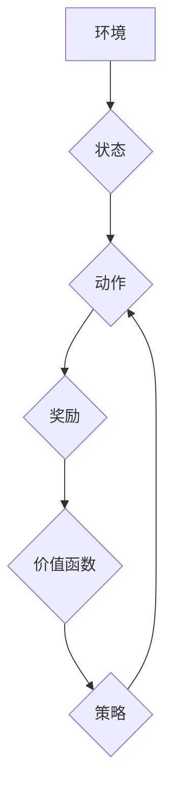

## 一切皆是映射：AI Q-learning价值函数神经网络实现

> 关键词：Q-learning, 价值函数, 神经网络, 强化学习, 映射, AI, 算法

## 1. 背景介绍

在人工智能领域，强化学习 (Reinforcement Learning, RL) 作为一种模仿人类学习方式的算法，近年来取得了显著进展。它通过在环境中与环境交互，学习最优策略来最大化奖励，在游戏、机器人控制、推荐系统等领域展现出强大的应用潜力。

其中，Q-learning 作为 RL 的经典算法，通过学习一个 Q 函数来评估在特定状态下采取特定动作的价值，并根据经验不断更新 Q 函数，最终找到最优策略。然而，传统的 Q-learning 算法受限于状态空间的维度，难以处理复杂的环境。

为了解决这一问题，价值函数神经网络 (Value Function Neural Network, VFNN) 应运而生。VFNN 将 Q 函数表示为神经网络，利用神经网络强大的非线性拟合能力，能够有效地学习复杂环境下的 Q 函数，从而提升强化学习算法的性能。

## 2. 核心概念与联系

### 2.1 强化学习基本概念

强化学习的核心在于**代理 (Agent)** 与**环境 (Environment)**之间的交互。代理通过与环境交互，采取**动作 (Action)**，从而改变环境状态，并获得**奖励 (Reward)**。代理的目标是学习一个策略，使得在与环境交互的过程中获得最大的总奖励。

* **状态 (State)**：环境的当前状态。
* **动作 (Action)**：代理可以采取的行动。
* **奖励 (Reward)**：代理在采取特定动作后获得的反馈。
* **策略 (Policy)**：代理根据当前状态选择动作的规则。

### 2.2 Q-learning算法

Q-learning 是一种基于价值函数的强化学习算法。其核心思想是学习一个 Q 函数，该函数将状态-动作对映射到一个价值值，表示在当前状态采取特定动作的长期价值。

Q 函数的更新规则如下：

$$Q(s, a) \leftarrow Q(s, a) + \alpha [r + \gamma \max_{a'} Q(s', a') - Q(s, a)]$$

其中：

* $Q(s, a)$：状态 $s$ 下采取动作 $a$ 的价值。
* $\alpha$：学习率，控制学习速度。
* $r$：当前状态下获得的奖励。
* $\gamma$：折扣因子，控制未来奖励的权重。
* $s'$：采取动作 $a$ 后进入的下一个状态。
* $a'$：在下一个状态 $s'$ 中可以采取的动作。

### 2.3 价值函数神经网络

价值函数神经网络 (VFNN) 将 Q 函数表示为一个神经网络，利用神经网络强大的非线性拟合能力，能够学习复杂环境下的 Q 函数。

VFNN 的结构通常包括输入层、隐藏层和输出层。输入层接收状态信息，隐藏层进行特征提取和非线性变换，输出层输出 Q 函数的值。

**Mermaid 流程图**



## 3. 核心算法原理 & 具体操作步骤

### 3.1 算法原理概述

价值函数神经网络 (VFNN) 结合了 Q-learning 算法的价值函数思想和神经网络的非线性拟合能力，实现对复杂环境下 Q 函数的学习。

VFNN 的核心步骤如下：

1. **初始化神经网络参数:** 将神经网络的权重和偏置随机初始化。
2. **收集经验数据:** 通过与环境交互，收集状态、动作、奖励和下一个状态的经验数据。
3. **计算 Q 值预测:** 将当前状态输入到神经网络中，得到 Q 值的预测值。
4. **计算 Q 值目标:** 根据 Q-learning 更新规则，计算 Q 值的目标值。
5. **更新神经网络参数:** 使用梯度下降算法，根据 Q 值预测值和目标值之间的误差，更新神经网络的参数。
6. **重复步骤 2-5:** 持续收集经验数据，更新神经网络参数，直到 Q 函数收敛。

### 3.2 算法步骤详解

1. **环境初始化:** 设置环境参数，例如状态空间、动作空间、奖励函数等。
2. **代理初始化:** 初始化代理的策略，例如随机策略或贪婪策略。
3. **经验收集:** 代理与环境交互，采取动作，获得奖励和下一个状态。将这些信息存储为经验数据。
4. **数据批处理:** 将收集到的经验数据分成多个批次，用于训练神经网络。
5. **神经网络训练:** 对于每个数据批次，执行以下步骤:
    * 将状态信息输入到神经网络中，得到 Q 值预测值。
    * 根据 Q-learning 更新规则，计算 Q 值目标值。
    * 使用梯度下降算法，更新神经网络的参数，使得 Q 值预测值与目标值之间的误差最小化。
6. **策略更新:** 根据训练好的神经网络，更新代理的策略。
7. **重复步骤 3-6:** 持续收集经验数据，训练神经网络，更新策略，直到达到预设的目标。

### 3.3 算法优缺点

**优点:**

* **能够处理高维状态空间:** 神经网络的非线性拟合能力可以有效地学习复杂环境下的 Q 函数。
* **学习效率高:** 利用梯度下降算法，可以快速地更新神经网络参数。
* **可扩展性强:** VFNN 可以应用于各种强化学习任务，例如游戏、机器人控制、推荐系统等。

**缺点:**

* **训练数据需求量大:** VFNN 需要大量的经验数据才能有效地学习。
* **参数量大:** 神经网络的参数量较大，需要更多的计算资源进行训练。
* **容易陷入局部最优:** 梯度下降算法可能会陷入局部最优，导致学习效果不佳。

### 3.4 算法应用领域

VFNN 在以下领域具有广泛的应用前景:

* **游戏:** 学习游戏策略，例如 AlphaGo、AlphaZero 等。
* **机器人控制:** 学习机器人控制策略，例如自主导航、目标抓取等。
* **推荐系统:** 学习用户偏好，推荐个性化内容。
* **金融交易:** 学习交易策略，进行自动交易。
* **医疗诊断:** 学习疾病诊断策略，辅助医生诊断。

## 4. 数学模型和公式 & 详细讲解 & 举例说明

### 4.1 数学模型构建

VFNN 的数学模型可以表示为一个多层感知机 (Multi-Layer Perceptron, MLP)，其中每个神经元都具有激活函数。

假设状态空间为 S，动作空间为 A， Q 函数为 Q(s, a)，则 VFNN 的输出层神经元数量为 |A|，每个神经元对应一个动作。

### 4.2 公式推导过程

VFNN 的训练目标是最小化 Q 值预测值与目标值之间的误差。常用的损失函数为均方误差 (Mean Squared Error, MSE)。

$$Loss = \frac{1}{N} \sum_{i=1}^{N} (Q(s_i, a_i) - Q_i)^2$$

其中：

* $N$：经验数据数量。
* $Q(s_i, a_i)$：神经网络预测的 Q 值。
* $Q_i$：经验数据中对应的 Q 值目标值。

使用梯度下降算法，可以更新神经网络的参数，使得损失函数最小化。

### 4.3 案例分析与讲解

假设我们有一个简单的环境，状态空间为 {“高”，“低”}, 动作空间为 {“上”，“下”}, 奖励函数为：

* 在“高”状态下采取“下”动作获得奖励 1。
* 在“低”状态下采取“上”动作获得奖励 1。

我们可以使用 VFNN 学习 Q 函数，并根据 Q 函数选择最优动作。

## 5. 项目实践：代码实例和详细解释说明

### 5.1 开发环境搭建

* Python 3.x
* TensorFlow 或 PyTorch

### 5.2 源代码详细实现

```python
import tensorflow as tf

# 定义神经网络模型
model = tf.keras.models.Sequential([
    tf.keras.layers.Dense(128, activation='relu', input_shape=(2,)),
    tf.keras.layers.Dense(64, activation='relu'),
    tf.keras.layers.Dense(2)
])

# 定义损失函数和优化器
loss_fn = tf.keras.losses.MeanSquaredError()
optimizer = tf.keras.optimizers.Adam()

# 训练模型
for epoch in range(100):
    for state, action, reward, next_state in dataset:
        with tf.GradientTape() as tape:
            q_values = model(state)
            target_q_values = reward + gamma * tf.reduce_max(model(next_state), axis=1)
            loss = loss_fn(target_q_values, q_values[:, action])
        gradients = tape.gradient(loss, model.trainable_variables)
        optimizer.apply_gradients(zip(gradients, model.trainable_variables))

# 使用训练好的模型预测 Q 值
state = tf.constant([[1, 0]])
q_values = model(state)
print(q_values)
```

### 5.3 代码解读与分析

* 代码首先定义了一个简单的 VFNN 模型，包含三个全连接层。
* 然后定义了损失函数和优化器，用于训练神经网络。
* 训练过程循环遍历经验数据，计算损失值，并使用梯度下降算法更新神经网络参数。
* 最后，使用训练好的模型预测 Q 值。

### 5.4 运行结果展示

运行代码后，会输出神经网络预测的 Q 值。

## 6. 实际应用场景

VFNN 在实际应用场景中具有广泛的应用前景，例如：

* **游戏 AI:** 学习游戏策略，例如 AlphaGo、AlphaZero 等。
* **机器人控制:** 学习机器人控制策略，例如自主导航、目标抓取等。
* **推荐系统:** 学习用户偏好，推荐个性化内容。
* **金融交易:** 学习交易策略，进行自动交易。
* **医疗诊断:** 学习疾病诊断策略，辅助医生诊断。

### 6.4 未来应用展望

随着人工智能技术的不断发展，VFNN 的应用场景将会更加广泛。未来，VFNN 可能应用于以下领域：

* **自动驾驶:** 学习驾驶策略，实现自动驾驶。
* **个性化教育:** 学习学生的学习风格，提供个性化教育方案。
* **药物研发:** 学习药物作用机制，加速药物研发。

## 7. 工具和资源推荐

### 7.1 学习资源推荐

* **书籍:**
    * Reinforcement Learning: An Introduction by Richard S. Sutton and Andrew G. Barto
    * Deep Reinforcement Learning Hands-On by Maxim Lapan
* **在线课程:**
    * Deep Reinforcement Learning Specialization by DeepLearning.AI
    * Reinforcement Learning by David Silver (University of DeepMind)

### 7.2 开发工具推荐

* **TensorFlow:** https://www.tensorflow.org/
* **PyTorch:** https://pytorch.org/

### 7.3 相关论文推荐

* Deep Q-Network (DQN)
* Dueling Network Architectures for Deep Reinforcement Learning
* Proximal Policy Optimization Algorithms

## 8. 总结：未来发展趋势与挑战

### 8.1 研究成果总结

VFNN 结合了 Q-learning 算法的价值函数思想和神经网络的非线性拟合能力，有效地解决了传统 Q-learning 算法在高维状态空间下的学习问题。VFNN 在游戏、机器人控制、推荐系统等领域取得了显著的成果，展现出强大的应用潜力。

### 8.2 未来发展趋势

未来 VFNN 的发展趋势包括：

* **探索更有效的网络架构:** 设计更深、