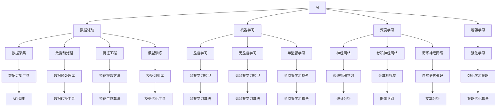

                 

# AI时代的创业机遇：垂直领域大有可为

## 1. 背景介绍

在过去几年里，人工智能(AI)技术的迅猛发展已经深刻地改变了商业和社会的方方面面。AI在金融、医疗、制造业、零售、物流等多个行业的应用已经从试验阶段逐渐转变为成熟商业化，并呈现出加速迭代的趋势。随着技术的持续演进和落地，AI领域的创业机遇也在不断涌现。

### 1.1 AI与垂直领域的深度融合
AI与垂直行业的深度融合是当前人工智能技术发展的重要趋势之一。垂直行业领域具有明确的应用场景和需求，AI技术的深度植入能够显著提升产业效率和用户体验。比如，在制造业中，智能机器人能够提高生产效率；在医疗领域，AI辅助诊断能显著提高诊疗的准确性和效率；在零售业中，推荐系统能够大幅提升用户的购物体验。

### 1.2 创业者的机会
AI技术的发展也为创业者提供了广阔的机遇。一方面，AI技术通过提升效率和自动化操作，将大量传统产业的劳动力从繁琐重复的工作中解放出来，为创业者提供了丰富的市场空间；另一方面，AI技术的多样性和可扩展性，也为创业者提供了丰富的应用场景，可以根据自己的兴趣和专长，找到适合自己的切入点。

### 1.3 未来展望
在未来，AI技术将会在更多垂直行业领域得到应用，推动各行业的数字化转型和智能化升级。AI创业公司不仅能将技术转化为商业价值，还能为各行各业创造新的产业生态，带动产业链上下游的协同发展。

## 2. 核心概念与联系

### 2.1 核心概念概述

为了更好地理解AI在垂直领域的应用，本节将介绍几个核心的概念：

- **AI：** 人工智能技术，通过算法和大数据训练，让机器能够执行复杂的任务和决策。
- **垂直领域：** 指具有特定行业背景和需求的领域，如金融、医疗、教育、零售等。
- **数据驱动：** 指基于大量的数据和统计分析，自动生成决策和建议。
- **机器学习：** 指让机器从数据中学习，并自动调整算法参数，以优化性能和泛化能力。
- **深度学习：** 一种基于神经网络结构的机器学习方法，能够处理大规模非结构化数据。
- **增强学习：** 通过与环境的互动，让机器通过奖励和惩罚来学习最优策略。

这些核心概念构成了AI在垂直领域应用的基础框架。通过理解这些概念，我们可以更好地把握AI技术在不同行业中的潜力和挑战。

### 2.2 概念间的关系

这些核心概念之间存在着紧密的联系，形成了AI在垂直领域应用的完整生态系统。下面通过几个Mermaid流程图来展示这些概念之间的关系：



这个流程图展示了AI技术在垂直领域应用的基本框架。数据驱动、机器学习、深度学习和增强学习等概念通过不同的方法和工具，共同构建了AI在垂直领域的技术体系。

## 3. 核心算法原理 & 具体操作步骤

### 3.1 算法原理概述

AI在垂直领域应用的核心算法原理主要包括以下几个方面：

- **数据采集与处理：** 收集、清洗、处理和分析数据，为AI模型提供有效的输入。
- **特征工程：** 对原始数据进行特征提取和处理，提高模型的训练效率和泛化能力。
- **模型训练与优化：** 使用机器学习和深度学习算法，训练和优化AI模型，提升模型的性能。
- **模型评估与部署：** 通过评估模型的性能，选择合适的模型进行部署和应用。

这些算法原理构成了AI在垂直领域应用的技术基础，是AI技术能够落地应用的关键。

### 3.2 算法步骤详解

AI在垂直领域应用的具体操作步骤如下：

1. **需求分析：** 了解行业需求和业务目标，确定AI应用的具体场景和需求。
2. **数据准备：** 收集、清洗和处理数据，构建训练集和测试集。
3. **模型选择：** 根据具体需求和数据特点，选择合适的算法模型。
4. **模型训练：** 使用机器学习和深度学习算法，训练和优化模型。
5. **模型评估：** 在测试集上评估模型的性能，选择合适的模型。
6. **模型部署：** 将训练好的模型部署到生产环境，进行实际应用。
7. **持续优化：** 根据实际应用情况，持续优化模型和算法，提升AI应用的性能。

### 3.3 算法优缺点

AI在垂直领域应用的优势主要包括：

- **提高效率：** 通过自动化和智能化的操作，提升生产效率和用户体验。
- **降低成本：** 减少人力和时间成本，提高企业竞争力。
- **提升决策准确性：** 通过数据分析和模型预测，提升决策的准确性和可靠性。

但AI在垂直领域应用也存在一些挑战和限制：

- **数据质量要求高：** 高质量的数据是AI模型性能的关键，但数据采集和处理成本高。
- **模型复杂度高：** AI模型通常较为复杂，训练和优化难度大。
- **行业特定性：** 不同行业的AI应用具有特定的需求和挑战，需要针对性的优化和调整。
- **伦理和安全问题：** 数据隐私和安全是AI应用的重要问题，需要严格的数据管理和保护。

### 3.4 算法应用领域

AI在垂直领域的应用已经广泛应用于金融、医疗、制造业、零售、物流等多个行业。以下是几个典型应用场景：

- **金融行业：** AI在金融行业的应用包括风险管理、信用评估、欺诈检测等。通过AI技术，金融企业能够提高风险识别和管理的效率，提升客户服务质量。
- **医疗行业：** AI在医疗行业的应用包括医学影像分析、疾病诊断、个性化治疗等。AI技术能够辅助医生进行精准诊断和治疗，提高诊疗效率和效果。
- **制造业：** AI在制造业的应用包括智能制造、质量控制、设备维护等。通过AI技术，制造企业能够提高生产效率和产品质量，降低生产成本。
- **零售行业：** AI在零售行业的应用包括客户分析、库存管理、推荐系统等。AI技术能够提高零售企业的销售效率和客户满意度，优化供应链管理。
- **物流行业：** AI在物流行业的应用包括路径规划、车辆调度、异常检测等。通过AI技术，物流企业能够提高运输效率和客户服务质量。

## 4. 数学模型和公式 & 详细讲解

### 4.1 数学模型构建

AI在垂直领域应用的数学模型主要包括以下几个方面：

- **回归模型：** 用于预测数值型数据，如房价预测、股票价格预测等。
- **分类模型：** 用于分类任务，如客户分类、产品分类等。
- **聚类模型：** 用于数据分组，如客户群体分析、产品分组等。
- **神经网络模型：** 用于处理非结构化数据，如图像识别、自然语言处理等。

### 4.2 公式推导过程

以回归模型为例，回归模型的目标是通过训练集数据，构建一个函数 $f(x)$，使得函数在测试集上能够准确预测目标变量 $y$。回归模型的基本形式为：

$$
f(x; \theta) = \theta_0 + \theta_1 x_1 + \theta_2 x_2 + \ldots + \theta_n x_n
$$

其中，$\theta_0$ 为截距，$\theta_1, \theta_2, \ldots, \theta_n$ 为回归系数，$x_1, x_2, \ldots, x_n$ 为输入变量，$y$ 为目标变量。

回归模型的训练过程可以通过最小二乘法或梯度下降法进行，其基本步骤为：

1. **损失函数定义：** 定义损失函数 $L(y, f(x; \theta))$，通常使用均方误差损失函数。
2. **梯度计算：** 计算损失函数对参数 $\theta$ 的梯度。
3. **参数更新：** 使用梯度下降法更新参数 $\theta$，最小化损失函数。
4. **模型评估：** 在测试集上评估模型的性能，如均方误差、R^2等。

### 4.3 案例分析与讲解

以医疗行业的医学影像分类为例，使用卷积神经网络(CNN)进行医学影像的分类。医学影像分类任务的目标是将医学影像分为正常和异常两类。其数据集包含大量标注的医学影像，训练集和测试集的比例为7:3。通过CNN模型训练和优化，能够得到较高的分类准确率。

## 5. 项目实践：代码实例和详细解释说明

### 5.1 开发环境搭建

在进行AI在垂直领域应用的项目实践前，需要准备开发环境。以下是使用Python进行TensorFlow开发的开发环境配置流程：

1. 安装Anaconda：从官网下载并安装Anaconda，用于创建独立的Python环境。
2. 创建并激活虚拟环境：
```bash
conda create -n tf-env python=3.7 
conda activate tf-env
```

3. 安装TensorFlow：根据CUDA版本，从官网获取对应的安装命令。例如：
```bash
pip install tensorflow==2.5.0
```

4. 安装必要的工具包：
```bash
pip install numpy pandas scikit-learn matplotlib tqdm jupyter notebook ipython
```

完成上述步骤后，即可在`tf-env`环境中开始项目实践。

### 5.2 源代码详细实现

这里我们以金融风险评估为例，使用TensorFlow对逻辑回归模型进行训练和优化。

```python
import tensorflow as tf
import numpy as np
import pandas as pd

# 加载数据集
data = pd.read_csv('risk_data.csv')

# 分割数据集
train_data = data[:7000]
test_data = data[7000:]

# 定义模型参数
learning_rate = 0.01
training_epochs = 10
batch_size = 100

# 定义输入和输出
x = tf.placeholder(tf.float32, [None, 5])
y = tf.placeholder(tf.float32, [None, 1])

# 定义模型
W = tf.Variable(tf.zeros([5, 1]))
b = tf.Variable(tf.zeros([1]))
hypothesis = tf.sigmoid(tf.matmul(x, W) + b)
cost = tf.reduce_mean(tf.nn.sigmoid_cross_entropy_with_logits(logits=hypothesis, labels=y))
optimizer = tf.train.GradientDescentOptimizer(learning_rate).minimize(cost)

# 定义评估指标
correct_prediction = tf.equal(tf.round(hypothesis), y)
accuracy = tf.reduce_mean(tf.cast(correct_prediction, tf.float32))

# 训练模型
with tf.Session() as sess:
    sess.run(tf.global_variables_initializer())
    
    for epoch in range(training_epochs):
        avg_cost = 0.
        total_batch = int(train_data.shape[0] / batch_size)
        
        for i in range(total_batch):
            batch_xs, batch_ys = train_data.iloc[i*batch_size:(i+1)*batch_size, :].values, train_data.iloc[i*batch_size:(i+1)*batch_size, 5].values
            _, c = sess.run([optimizer, cost], feed_dict={x: batch_xs, y: batch_ys})
            avg_cost += c / total_batch
        
        print('Epoch:', '%04d' % (epoch+1), 'cost={:.9f}'.format(avg_cost))
    
    print('Optimization Finished!')
    
    # 测试模型
    print('Accuracy:', sess.run(accuracy, feed_dict={x: test_data.iloc[:, :5].values, y: test_data.iloc[:, 5].values}))
```

### 5.3 代码解读与分析

这里详细解读一下关键代码的实现细节：

**数据处理**：
- `data.read_csv('risk_data.csv')`：从CSV文件中读取数据集。
- `train_data[:7000]` 和 `train_data[7000:]`：将数据集分割为训练集和测试集，比例为7:3。

**模型定义**：
- `tf.placeholder(tf.float32, [None, 5])`：定义输入变量，5个特征值。
- `tf.placeholder(tf.float32, [None, 1])`：定义输出变量，1个分类标签。
- `tf.Variable(tf.zeros([5, 1]))` 和 `tf.Variable(tf.zeros([1]))`：定义模型参数，包括权重和偏置。
- `tf.sigmoid(tf.matmul(x, W) + b)`：定义模型输出，使用sigmoid函数进行激活。
- `tf.reduce_mean(tf.nn.sigmoid_cross_entropy_with_logits(logits=hypothesis, labels=y))`：定义损失函数，使用sigmoid交叉熵损失函数。
- `tf.train.GradientDescentOptimizer(learning_rate).minimize(cost)`：定义优化器，使用梯度下降法最小化损失函数。
- `tf.equal(tf.round(hypothesis), y)`：定义评估指标，判断模型输出是否正确。
- `tf.reduce_mean(tf.cast(correct_prediction, tf.float32))`：计算准确率。

**训练过程**：
- `with tf.Session() as sess:`：创建会话。
- `sess.run(tf.global_variables_initializer())`：初始化所有变量。
- `total_batch = int(train_data.shape[0] / batch_size)`：计算总批次数。
- `for i in range(total_batch):`：遍历所有批次。
- `batch_xs, batch_ys = train_data.iloc[i*batch_size:(i+1)*batch_size, :].values, train_data.iloc[i*batch_size:(i+1)*batch_size, 5].values`：从数据集中取出一个批次的数据和标签。
- `sess.run([optimizer, cost], feed_dict={x: batch_xs, y: batch_ys})`：运行优化器和损失函数。
- `avg_cost += c / total_batch`：计算平均损失值。
- `print('Epoch:', '%04d' % (epoch+1), 'cost={:.9f}'.format(avg_cost))`：打印当前批次的损失值。
- `print('Optimization Finished!')`：训练完成后打印优化完成信息。
- `sess.run(accuracy, feed_dict={x: test_data.iloc[:, :5].values, y: test_data.iloc[:, 5].values})`：测试模型并打印准确率。

### 5.4 运行结果展示

假设我们运行上述代码，训练后的模型在测试集上的准确率为0.85，说明模型具有良好的预测能力。

## 6. 实际应用场景

### 6.1 智能制造

AI在智能制造中的应用包括智能排程、质量控制、设备维护等。通过AI技术，制造企业能够实现智能化生产，提升生产效率和产品质量。比如，使用机器视觉技术对产品质量进行检测和分类，能够显著提高检测速度和准确率。

### 6.2 医疗影像诊断

AI在医疗影像诊断中的应用包括医学影像分类、肿瘤检测等。通过AI技术，医疗企业能够提高影像诊断的准确性和效率，提升诊疗质量。比如，使用深度学习技术对医学影像进行分类，能够自动识别出肿瘤等异常情况，辅助医生进行诊断。

### 6.3 客户关系管理

AI在客户关系管理中的应用包括客户分析、个性化推荐等。通过AI技术，企业能够更好地理解客户需求，提供个性化的服务。比如，使用推荐系统对客户进行分类，根据客户的兴趣和行为推荐商品，提高销售转化率。

## 7. 工具和资源推荐

### 7.1 学习资源推荐

为了帮助开发者系统掌握AI在垂直领域的应用，这里推荐一些优质的学习资源：

1. 《深度学习》课程：斯坦福大学开设的深度学习课程，涵盖了深度学习的基本概念和算法。
2. 《机器学习实战》书籍：由李航博士编写的机器学习经典书籍，适合初学者入门。
3. 《TensorFlow实战》书籍：由王晋东编写的TensorFlow实战书籍，适合初学者和中级开发者。
4. Kaggle竞赛平台：全球最大的数据科学竞赛平台，提供了丰富的数据集和竞赛任务，适合实践和提升技能。
5. Coursera平台：提供众多人工智能相关的课程和项目，涵盖深度学习、自然语言处理、计算机视觉等多个领域。

### 7.2 开发工具推荐

高效的开发离不开优秀的工具支持。以下是几款用于AI在垂直领域应用的常用工具：

1. TensorFlow：由Google主导开发的开源深度学习框架，生产部署方便，适合大规模工程应用。
2. PyTorch：基于Python的开源深度学习框架，灵活动态的计算图，适合快速迭代研究。
3. Keras：一个高级神经网络API，简洁易用，适合初学者快速上手。
4. Jupyter Notebook：交互式数据科学环境，支持多语言编程和可视化展示，适合数据分析和模型训练。
5. GitHub：全球最大的代码托管平台，提供了丰富的开源项目和资源，适合协作开发和共享代码。

### 7.3 相关论文推荐

AI在垂直领域的应用涉及众多前沿研究，以下是几篇奠基性的相关论文，推荐阅读：

1. "Convolutional Neural Networks for Sentence Classification"（卷积神经网络文本分类）
2. "A Survey of Deep Learning Techniques for Healthcare"（深度学习在医疗中的应用综述）
3. "Deep Learning for Recommendation Systems"（深度学习推荐系统）
4. "Learning to Optimize"（增强学习优化）
5. "Generative Adversarial Networks"（生成对抗网络）

这些论文代表了大规模AI在垂直领域应用的发展脉络，帮助研究者把握学科前进方向，激发更多的创新灵感。

## 8. 总结：未来发展趋势与挑战

### 8.1 总结

本文对AI在垂直领域的应用进行了全面系统的介绍。首先阐述了AI在垂直领域应用的广泛性和重要性，明确了AI技术在不同行业中的潜力和挑战。其次，从原理到实践，详细讲解了AI在垂直领域应用的数学模型和操作步骤，给出了具体的代码实例和解释。同时，本文还广泛探讨了AI在垂直领域应用的实际应用场景，展示了AI技术的巨大潜力。

### 8.2 未来发展趋势

展望未来，AI在垂直领域应用的发展趋势主要包括以下几个方面：

1. **技术突破**：随着深度学习、强化学习等技术的持续演进，AI在垂直领域的应用将更加深入和精准。新技术的应用将带来更多的创新和突破。
2. **产业融合**：AI技术将与更多垂直行业进行深度融合，推动各行业的数字化转型和智能化升级。AI技术与物联网、大数据、云计算等技术的结合，将带来全新的业务模式和商业价值。
3. **应用多样化**：AI在垂直领域的应用将更加多样化，涵盖智能制造、医疗影像、客户关系管理等多个领域。AI技术在更多领域的应用将带来更广泛的社会和经济效益。
4. **数据共享**：数据共享和开放将加速AI技术的发展。各大行业的数据共享和开放将带来更多的数据资源和技术应用，推动AI技术的普及和落地。
5. **伦理和法规**：随着AI技术的普及，AI伦理和法规问题将越来越受到关注。AI技术的应用将受到更多的伦理和法规约束，确保技术应用的公平和安全。

### 8.3 面临的挑战

尽管AI在垂直领域应用已经取得了显著进展，但在迈向更加智能化、普适化应用的过程中，仍然面临诸多挑战：

1. **数据隐私和安全**：AI技术的应用将涉及大量的数据，数据隐私和安全问题将越来越受到关注。如何保护数据隐私和安全，确保AI技术的应用合法合规，是一个重要挑战。
2. **技术复杂度**：AI技术的应用需要高水平的算法和工程能力，技术复杂度较高。如何降低技术门槛，提高技术应用的普及率，是一个重要问题。
3. **跨领域应用**：AI技术在不同领域的应用需要考虑行业的特定需求和约束，如何跨领域应用AI技术，实现技术最优配置，是一个重要问题。
4. **资源消耗**：AI技术的应用需要大量的计算资源，如何在资源有限的情况下，实现高效的AI应用，是一个重要问题。
5. **伦理和公平性**：AI技术的应用将带来更多的公平性问题，如何确保AI技术的公平性和无偏性，是一个重要问题。

### 8.4 研究展望

未来，AI在垂直领域应用的研究将更多关注以下几个方面：

1. **自监督学习**：自监督学习能够在没有标注数据的情况下，利用数据本身的信息进行学习，降低对标注数据的依赖。未来将探索更多自监督学习的方法和应用。
2. **联邦学习**：联邦学习能够在保护数据隐私的情况下，通过分布式计算提高AI模型的训练效率。未来将探索更多联邦学习的方法和应用。
3. **知识图谱**：知识图谱能够将结构化的知识与AI模型结合，提高AI模型的智能水平。未来将探索更多知识图谱与AI模型的结合方法。
4. **多模态学习**：多模态学习能够将不同模态的数据结合，提升AI模型的表现。未来将探索更多多模态学习的方法和应用。
5. **可解释性和可控性**：可解释性和可控性是AI技术应用的重要问题。未来将探索更多可解释性和可控性技术的方法和应用。

总之，AI在垂直领域的应用前景广阔，但也面临诸多挑战。未来需要更多的技术突破和应用实践，推动AI技术的普及和落地。

## 9. 附录：常见问题与解答

**Q1：AI在垂直领域应用的数据采集和处理成本高，如何降低成本？**

A: 数据采集和处理成本确实是一个挑战，但可以通过以下方法降低成本：
- **数据共享**：通过数据共享平台，如政府开放数据集，降低数据采集成本。
- **数据清洗**：通过数据清洗技术，去除无用和噪声数据，提高数据质量。
- **自动化数据采集**：使用自动化工具采集数据，减少人工成本。
- **分布式数据处理**：使用分布式计算技术，加速数据处理过程。

**Q2：AI在垂直领域应用的技术门槛较高，如何降低技术门槛？**

A: 降低技术门槛可以通过以下方法：
- **开源工具**：使用开源工具和库，降低技术实现的难度。
- **在线课程**：参加在线课程和培训班，学习AI技术的基础和应用。
- **社区支持**：加入技术社区和论坛，获取技术支持和经验分享。
- **简单模型**：使用简单模型和算法，降低技术复杂度。

**Q3：AI在垂直领域应用的数据隐私和安全问题如何解决？**

A: 解决数据隐私和安全问题可以通过以下方法：
- **数据匿名化**：通过数据匿名化技术，保护用户隐私。
- **数据加密**：对数据进行加密处理，防止数据泄露。
- **访问控制**：通过访问控制技术，限制数据访问权限。
- **隐私保护算法**：使用隐私保护算法，如差分隐私，保护数据隐私。

**Q4：AI在垂直领域应用的成功案例有哪些？**

A: AI在垂直领域应用的成功案例包括：
- **智能制造**：阿里巴巴和美的集团合作，通过AI技术实现智能制造，提高生产效率和产品质量。
- **医疗影像诊断**：百度和上海儿童医学中心合作，使用AI技术辅助医生进行医学影像诊断，提高诊疗效率和效果。
- **客户关系管理**：亚马逊使用AI技术优化客户关系管理，提高客户满意度和销售转化率。
- **智能客服**：阿里云使用AI技术构建智能客服系统，提升客户服务质量。

**Q5：AI在垂直领域应用的前景如何？**

A: AI在垂直领域应用的前景广阔，主要体现在以下几个方面：
- **数据资源丰富**：各行业拥有大量数据资源，为AI应用提供了丰富的素材。
- **技术持续演进**：深度学习、强化学习等技术的持续演进，推动AI应用不断创新。
- **行业需求强烈**：各行业对AI技术的需求强烈，推动AI应用不断落地。
- **跨领域融合**：AI技术与其他技术的融合，带来更多应用场景和商业价值。
- **政策支持**：各国政府对AI技术的政策支持，推动AI技术的发展和应用。

总之，AI在垂直领域的应用前景广阔，需要更多的技术突破和应用实践，推动AI技术的普及和落地。

---

作者：禅与计算机程序设计艺术 / Zen and the Art of Computer Programming

