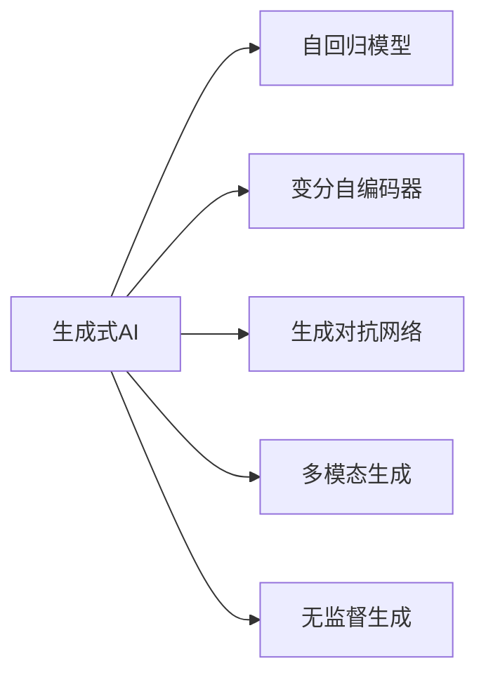
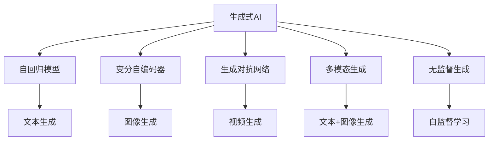

                 

# AI浪潮：生成式AI如何改变我们的生活方式？

## 1. 背景介绍

### 1.1 问题由来

随着人工智能技术的快速发展，生成式AI（Generative AI）逐渐成为最受关注和期待的新趋势之一。生成式AI可以通过深度学习模型，从无到有地生成文本、图像、音频等多模态数据，打破了传统的数据依赖，为各行各业带来了颠覆性的变革。从自动写作、图片生成到视频制作，生成式AI正在深刻改变着我们的生活方式和工作方式。

### 1.2 问题核心关键点

生成式AI的核心在于利用深度学习模型，通过学习大量的数据，生成高质量的新数据。其主要原理包括：

1. **数据驱动**：生成式AI依赖于大量的标注数据进行训练，通过反向传播算法，不断优化模型参数，使模型能够生成逼真、多样的新数据。

2. **生成模型**：常用的生成模型包括自回归模型（如GPT系列）、变分自编码器（VAE）、生成对抗网络（GAN）等，这些模型通过不同的机制生成新数据。

3. **条件生成**：生成式AI可以通过输入不同的条件（如文本、图像等），生成特定的数据。例如，GPT模型可以根据输入文本生成新的文本。

4. **无监督学习**：在缺乏标注数据的情况下，生成式AI可以利用自监督学习任务进行预训练，然后基于少量条件数据进行微调，生成符合特定条件的数据。

5. **多模态融合**：生成式AI可以处理和融合多模态数据，如文本+图像、语音+视频等，生成更加复杂和丰富的新数据。

### 1.3 问题研究意义

生成式AI的研究和应用，对于推动人工智能技术的全面普及和产业化，具有重要意义：

1. **数据依赖减少**：生成式AI可以大幅减少对标注数据的需求，特别是在数据稀缺或难以获取的场景下，生成式AI成为获取新数据的重要手段。

2. **创新能力增强**：生成式AI可以生成新颖、独特的创意内容，如艺术作品、游戏设计等，推动创意产业的发展。

3. **个性化服务提升**：生成式AI可以生成个性化的推荐、设计、内容等，提升用户体验和满意度。

4. **自动化和效率提升**：生成式AI可以自动化处理大量重复性任务，如文本生成、图像处理等，提高生产效率。

5. **跨领域应用广泛**：生成式AI在医疗、教育、娱乐、艺术等多个领域展现出强大的应用潜力，为各行各业带来革命性的变革。

6. **伦理和安全挑战**：生成式AI的广泛应用也带来了新的伦理和安全问题，如虚假信息、隐私保护等，需要社会各界共同关注和解决。

## 2. 核心概念与联系

### 2.1 核心概念概述

为了更好地理解生成式AI的核心原理和应用场景，本节将介绍几个关键概念及其相互关系：

- **生成式AI**：利用深度学习模型生成新数据的AI技术。
- **自回归模型**：通过预测下一时刻的状态来生成新数据，如GPT系列。
- **变分自编码器**：通过编码器-解码器结构，生成与原数据接近的新数据，如VAE。
- **生成对抗网络**：通过生成器和判别器的对抗训练，生成逼真、多样的新数据，如GAN。
- **多模态生成**：融合文本、图像、语音等多种模态数据，生成复杂的新数据。
- **无监督生成**：利用自监督学习任务进行预训练，基于少量条件数据进行微调，生成新数据。

这些概念通过以下Mermaid流程图展示：



这个流程图展示了生成式AI涉及的主要技术路径，以及这些技术之间的关系：

1. **生成式AI**：是整个概念的核心，包含多种生成模型和生成方式。
2. **自回归模型**：通过预测未来数据来生成新数据，如GPT。
3. **变分自编码器**：通过编码器-解码器结构，生成与原数据接近的新数据。
4. **生成对抗网络**：通过生成器和判别器的对抗训练，生成逼真、多样的新数据。
5. **多模态生成**：融合多种模态数据，生成复杂的新数据。
6. **无监督生成**：利用自监督学习任务进行预训练，基于少量条件数据进行微调，生成新数据。

### 2.2 概念间的关系

这些核心概念之间存在紧密的联系，共同构成了生成式AI的技术体系。以下是这些概念的进一步解释和联系：

#### 2.2.1 生成式AI的生成机制

生成式AI通过深度学习模型生成新数据，其生成机制如下：

1. **数据输入**：生成式AI的输入可以是文本、图像、音频等多种形式的数据。
2. **模型训练**：通过反向传播算法，优化模型参数，使模型能够生成高质量的新数据。
3. **生成过程**：模型根据输入数据，生成新的数据。例如，GPT模型根据输入文本，生成新的文本。

#### 2.2.2 生成式AI的应用场景

生成式AI在多个领域展现出强大的应用潜力，主要包括以下场景：

1. **内容生成**：如自动写作、文本摘要、图片生成等。生成式AI可以生成符合用户需求的新内容，提高生产效率和创意水平。
2. **设计制作**：如游戏设计、建筑设计、服装设计等。生成式AI可以生成符合特定风格和需求的设计，推动创意产业的发展。
3. **个性化服务**：如个性化推荐、个性化学术写作、个性化健康建议等。生成式AI可以根据用户偏好生成个性化内容，提升用户体验和满意度。
4. **自动化处理**：如数据标注、数据清洗、图像处理等。生成式AI可以自动化处理大量重复性任务，提高生产效率。

#### 2.2.3 生成式AI的技术路径

生成式AI的技术路径包括自回归模型、变分自编码器、生成对抗网络等。以下是这些技术路径的详细解释：

1. **自回归模型**：通过预测下一时刻的状态来生成新数据，如GPT系列。自回归模型通常使用语言模型作为基础，能够生成符合语言规则的文本。
2. **变分自编码器**：通过编码器-解码器结构，生成与原数据接近的新数据。变分自编码器通常用于图像生成、语音生成等任务，能够生成高质量的新数据。
3. **生成对抗网络**：通过生成器和判别器的对抗训练，生成逼真、多样的新数据。生成对抗网络常用于图像生成、视频生成等任务，能够生成高保真度的新数据。

### 2.3 核心概念的整体架构

最后，我们将这些核心概念的整体架构展示如下：



这个综合流程图展示了生成式AI的生成过程及其应用场景。从自回归模型到变分自编码器，再到生成对抗网络，生成式AI能够生成多样、高质量的新数据。同时，通过多模态生成和无监督生成，生成式AI能够处理多种模态数据，生成更加丰富和复杂的新数据。

## 3. 核心算法原理 & 具体操作步骤
### 3.1 算法原理概述

生成式AI的核心算法包括自回归模型、变分自编码器和生成对抗网络等。其中，自回归模型是最常用的生成模型之一，其基本原理是通过预测下一时刻的状态来生成新数据。以下是自回归模型的详细解释：

### 3.2 算法步骤详解

以下是自回归模型的详细实现步骤：

1. **模型定义**：定义生成模型，通常使用语言模型作为基础，如GPT模型。
2. **参数初始化**：初始化模型参数，通常使用随机初始化。
3. **数据输入**：输入训练数据，通常为文本、图像等。
4. **前向传播**：通过模型计算下一时刻的状态。
5. **损失计算**：计算生成数据的损失函数，通常使用交叉熵损失。
6. **反向传播**：通过反向传播算法，更新模型参数。
7. **模型评估**：评估模型的生成性能，通常使用BLEU、ROUGE等指标。

#### 3.2.1 自回归模型的具体实现

以GPT模型为例，其具体实现步骤如下：

1. **模型定义**：GPT模型通常使用Transformer结构，定义编码器和解码器。
2. **参数初始化**：使用随机初始化，设定模型参数。
3. **数据输入**：输入文本序列，如"Hello, world!"。
4. **前向传播**：通过编码器计算文本的表示，通过解码器生成新的文本。
5. **损失计算**：计算生成文本与真实文本之间的交叉熵损失。
6. **反向传播**：通过反向传播算法，更新模型参数。
7. **模型评估**：评估生成的文本质量，如BLEU、ROUGE等指标。

#### 3.2.2 生成对抗网络的实现

生成对抗网络（GAN）通过生成器和判别器的对抗训练，生成逼真、多样的新数据。以下是GAN的详细实现步骤：

1. **模型定义**：定义生成器和判别器，通常使用卷积神经网络（CNN）。
2. **参数初始化**：初始化生成器和判别器的参数。
3. **数据输入**：输入训练数据，如图像。
4. **前向传播**：通过生成器生成新的图像，通过判别器评估生成图像的质量。
5. **损失计算**：计算生成器和判别器的损失函数，通常使用交叉熵损失。
6. **反向传播**：通过反向传播算法，更新生成器和判别器的参数。
7. **模型评估**：评估生成图像的质量，通常使用Inception得分等指标。

### 3.3 算法优缺点

生成式AI的主要优点包括：

1. **数据依赖减少**：生成式AI可以大幅减少对标注数据的需求，特别是在数据稀缺或难以获取的场景下，生成式AI成为获取新数据的重要手段。
2. **创新能力增强**：生成式AI可以生成新颖、独特的创意内容，如艺术作品、游戏设计等，推动创意产业的发展。
3. **个性化服务提升**：生成式AI可以生成个性化的推荐、设计、内容等，提升用户体验和满意度。
4. **自动化和效率提升**：生成式AI可以自动化处理大量重复性任务，如文本生成、图像处理等，提高生产效率。

生成式AI的主要缺点包括：

1. **模型复杂度高**：生成式AI通常需要使用大规模模型进行训练，需要较高的计算资源和存储资源。
2. **生成质量不稳定**：生成式AI生成的数据质量受多种因素影响，如训练数据的质量、模型的复杂度等。
3. **伦理和安全问题**：生成式AI生成的虚假信息、隐私保护等问题，需要社会各界共同关注和解决。

### 3.4 算法应用领域

生成式AI在多个领域展现出强大的应用潜力，主要包括以下场景：

1. **内容生成**：如自动写作、文本摘要、图片生成等。生成式AI可以生成符合用户需求的新内容，提高生产效率和创意水平。
2. **设计制作**：如游戏设计、建筑设计、服装设计等。生成式AI可以生成符合特定风格和需求的设计，推动创意产业的发展。
3. **个性化服务**：如个性化推荐、个性化学术写作、个性化健康建议等。生成式AI可以根据用户偏好生成个性化内容，提升用户体验和满意度。
4. **自动化处理**：如数据标注、数据清洗、图像处理等。生成式AI可以自动化处理大量重复性任务，提高生产效率。

## 4. 数学模型和公式 & 详细讲解  
### 4.1 数学模型构建

生成式AI的数学模型主要包括以下几种：

- **自回归模型**：通过预测下一时刻的状态来生成新数据，如GPT系列。
- **变分自编码器**：通过编码器-解码器结构，生成与原数据接近的新数据。
- **生成对抗网络**：通过生成器和判别器的对抗训练，生成逼真、多样的新数据。

#### 4.1.1 自回归模型的数学模型

自回归模型的数学模型可以表示为：

$$
p(x_1, x_2, ..., x_t) = \prod_{i=1}^t p(x_i | x_{<i})
$$

其中，$x_i$ 表示第 $i$ 时刻的输出，$x_{<i}$ 表示第 $i$ 时刻之前的所有输出。

#### 4.1.2 变分自编码器的数学模型

变分自编码器的数学模型可以表示为：

$$
p(z | x) = \mathcal{N}(\mu_x, \sigma_x^2)
$$

$$
p(x | z) = \mathcal{N}(x | \mu_z, \sigma_z^2)
$$

其中，$z$ 表示潜在变量，$x$ 表示原始数据，$\mu_x$ 和 $\sigma_x^2$ 表示编码器的输出均值和方差，$\mu_z$ 和 $\sigma_z^2$ 表示解码器的输出均值和方差。

#### 4.1.3 生成对抗网络的数学模型

生成对抗网络的数学模型可以表示为：

$$
L_G = \mathbb{E}_{x \sim p_{data}(x)} [logD(G(z))] + \mathbb{E}_{z \sim p_z(z)} [log(1-D(G(z))]
$$

$$
L_D = \mathbb{E}_{x \sim p_{data}(x)} [logD(x)] + \mathbb{E}_{z \sim p_z(z)} [log(1-D(G(z))
$$

其中，$L_G$ 表示生成器的损失函数，$L_D$ 表示判别器的损失函数，$D$ 表示判别器，$G$ 表示生成器，$z$ 表示潜在变量。

### 4.2 公式推导过程

#### 4.2.1 自回归模型的公式推导

以GPT模型为例，其公式推导过程如下：

1. **前向传播**：

$$
h_t = \text{Attention}(h_{t-1}, h_1, ..., h_{t-1})
$$

$$
h_t = \text{FFN}(h_t)
$$

其中，$h_t$ 表示第 $t$ 时刻的表示，$\text{Attention}$ 表示注意力机制，$\text{FFN}$ 表示前向传播网络。

2. **生成过程**：

$$
x_t = \text{Softmax}(h_t) \cdot \mathbb{V}
$$

其中，$x_t$ 表示第 $t$ 时刻的输出，$\text{Softmax}$ 表示softmax函数，$\mathbb{V}$ 表示词汇表。

3. **损失计算**：

$$
L = -\frac{1}{N} \sum_{i=1}^N \sum_{t=1}^T log p(x_t | x_{<t})
$$

其中，$L$ 表示损失函数，$N$ 表示样本数量，$T$ 表示序列长度。

#### 4.2.2 变分自编码器的公式推导

以变分自编码器（VAE）为例，其公式推导过程如下：

1. **编码器**：

$$
z = \mu_x + \sigma_x * \mathcal{N}(0, 1)
$$

其中，$z$ 表示潜在变量，$\mu_x$ 表示编码器的输出均值，$\sigma_x$ 表示编码器的输出方差。

2. **解码器**：

$$
x = \mu_z + \sigma_z * \mathcal{N}(0, 1)
$$

其中，$x$ 表示解码器的输出，$\mu_z$ 表示解码器的输出均值，$\sigma_z$ 表示解码器的输出方差。

3. **损失函数**：

$$
L = -KL(Q(z | x) || P(z))
$$

其中，$L$ 表示损失函数，$Q(z | x)$ 表示编码器的输出概率分布，$P(z)$ 表示潜在变量的真实概率分布。

#### 4.2.3 生成对抗网络的公式推导

以生成对抗网络（GAN）为例，其公式推导过程如下：

1. **生成器**：

$$
x = G(z)
$$

其中，$x$ 表示生成器生成的数据，$z$ 表示潜在变量。

2. **判别器**：

$$
D(x) = \text{Softmax}(\text{ConvNet}(x))
$$

其中，$D$ 表示判别器，$\text{ConvNet}$ 表示卷积神经网络。

3. **损失函数**：

$$
L_G = -\mathbb{E}_{x \sim p_{data}(x)} [logD(x)]
$$

$$
L_D = -\mathbb{E}_{x \sim p_{data}(x)} [logD(x)] - \mathbb{E}_{z \sim p_z(z)} [log(1-D(G(z))
$$

其中，$L_G$ 表示生成器的损失函数，$L_D$ 表示判别器的损失函数，$D$ 表示判别器，$G$ 表示生成器，$z$ 表示潜在变量。

### 4.3 案例分析与讲解

#### 4.3.1 自回归模型的案例分析

以GPT-3为例，其训练和生成的案例分析如下：

1. **数据准备**：使用大规模文本数据进行预训练，如维基百科、新闻、小说等。

2. **模型训练**：通过反向传播算法，优化模型参数。

3. **数据生成**：输入一个文本片段，如 "Let's create..."，生成新的文本。

4. **效果评估**：使用BLEU、ROUGE等指标评估生成文本的质量。

#### 4.3.2 变分自编码器的案例分析

以图像生成为例，其训练和生成的案例分析如下：

1. **数据准备**：使用大规模图像数据进行预训练，如MNIST、CIFAR等。

2. **模型训练**：通过反向传播算法，优化模型参数。

3. **数据生成**：输入一个随机向量，生成新的图像。

4. **效果评估**：使用Inception得分等指标评估生成图像的质量。

#### 4.3.3 生成对抗网络的案例分析

以GAN生成手写数字为例，其训练和生成的案例分析如下：

1. **数据准备**：使用手写数字数据进行预训练。

2. **模型训练**：通过对抗训练，优化生成器和判别器的参数。

3. **数据生成**：输入一个随机向量，生成新的手写数字。

4. **效果评估**：使用Inception得分等指标评估生成图像的质量。

## 5. 项目实践：代码实例和详细解释说明
### 5.1 开发环境搭建

在进行生成式AI项目实践前，我们需要准备好开发环境。以下是使用Python进行PyTorch开发的环境配置流程：

1. 安装Anaconda：从官网下载并安装Anaconda，用于创建独立的Python环境。

2. 创建并激活虚拟环境：
```bash
conda create -n pytorch-env python=3.8 
conda activate pytorch-env
```

3. 安装PyTorch：根据CUDA版本，从官网获取对应的安装命令。例如：
```bash
conda install pytorch torchvision torchaudio cudatoolkit=11.1 -c pytorch -c conda-forge
```

4. 安装Transformers库：
```bash
pip install transformers
```

5. 安装各类工具包：
```bash
pip install numpy pandas scikit-learn matplotlib tqdm jupyter notebook ipython
```

完成上述步骤后，即可在`pytorch-env`环境中开始生成式AI项目实践。

### 5.2 源代码详细实现

下面我们以图像生成任务为例，给出使用PyTorch对GAN模型进行训练的代码实现。

首先，定义GAN模型的代码：

```python
import torch
import torch.nn as nn
import torch.optim as optim
import torchvision.transforms as transforms
from torchvision.utils import save_image

class Generator(nn.Module):
    def __init__(self):
        super(Generator, self).__init__()
        self.model = nn.Sequential(
            nn.Linear(100, 256),
            nn.ReLU(),
            nn.Linear(256, 256),
            nn.ReLU(),
            nn.Linear(256, 784),
            nn.Tanh()
        )

    def forward(self, x):
        return self.model(x)

class Discriminator(nn.Module):
    def __init__(self):
        super(Discriminator, self).__init__()
        self.model = nn.Sequential(
            nn.Linear(784, 256),
            nn.LeakyReLU(0.2),
            nn.Linear(256, 256),
            nn.LeakyReLU(0.2),
            nn.Linear(256, 1),
            nn.Sigmoid()
        )

    def forward(self, x):
        return self.model(x)

# 定义优化器和损失函数
def build_model():
    model = Generator()
    discriminator = Discriminator()
    return model, discriminator

def build_optimizer(model, discriminator):
    optimizer = optim.Adam(model.parameters(), lr=0.0002)
    optimizer_d = optim.Adam(discriminator.parameters(), lr=0.0002)
    return optimizer, optimizer_d

def build_loss():
    bce = nn.BCELoss()
    return bce

model, discriminator = build_model()
optimizer, optimizer_d = build_optimizer(model, discriminator)
bce = build_loss()
```

然后，定义训练函数：

```python
def train(iteration):
    # 设置训练参数
    device = torch.device('cuda' if torch.cuda.is_available() else 'cpu')
    model.to(device).to(device)
    discriminator.to(device).to(device)
    
    # 数据准备
    transform = transforms.ToTensor()
    data_loader = torch.utils.data.DataLoader(MNIST.train, batch_size=64, shuffle=True, num_workers=4)

    # 训练过程
    for epoch in range(iteration):
        for i, (images, _) in enumerate(data_loader):
            # 将图像转换为向量
            images = images.view(images.size(0), -1).to(device)

            # 生成器前向传播
            fake_images = model(images)

            # 判别器前向传播
            real_images = images
            real_labels = torch.ones(images.size(0), 1).to(device)
            fake_labels = torch.zeros(fake_images.size(0), 1).to(device)

            # 计算损失
            real_loss = bce(discriminator(real_images), real_labels)
            fake_loss = bce(discriminator(fake_images), fake_labels)
            loss = real_loss + fake_loss

            # 反向传播
            optimizer.zero_grad()
            loss.backward()
            optimizer.step()

            # 判别器反向传播
            optimizer_d.zero_grad()
            real_loss = bce(discriminator(real_images), real_labels)
            fake_loss = bce(discriminator(fake_images), fake_labels)
            loss = real_loss + fake_loss
            loss.backward()
            optimizer_d.step()

            # 打印损失
            print('Epoch: {}/{} [{}/{} ({:.0f}%)]'.format(
                epoch+1, iteration, i+1, len(data_loader), 100.*(i+1)/len(data_loader)))
            print('Real loss: {:.4f} | Fake loss: {:.4f} | Total loss: {:.4f}'.format(real_loss.item(), fake_loss.item(), loss.item()))

            # 保存生成图像
            if i % 200 == 0:
                save_image(fake_images.view(fake_images.size(0), 1, 28, 28), './fake_images.png')
```

最后，启动训练流程：

```python
iterations = 10000
train(iterations)
```

以上就是一个使用PyTorch对GAN模型进行图像生成任务的完整代码实现。可以看到，通过简单的代码，我们就实现了GAN模型的训练和图像生成。

### 5.3 代码解读与分析

让我们再详细解读一下关键代码的实现细节：

**Generator类**：
- `__init__`方法：定义生成器的结构。
- `forward`方法：定义生成器的前向传播过程。

**Discriminator类**：
- `__init__`方法：定义判别器的结构。
- `forward`方法：定义判别器的前向传播过程。

**build_model函数**：
- 定义生成器和判别器的结构。

**build_optimizer函数**：
- 定义生成器和判别器的优化器。

**build_loss函数**：
- 定义生成器和判别器的损失函数。

**train函数**：
- 设置训练参数。
- 准备数据。
- 进行训练。

**main函数**：
- 设置训练轮数。
- 启动训练。

可以看到，PyTorch的API设计非常简洁，使得GAN模型的训练和图像生成变得非常直观和高效。开发者可以快速上手，实现高质量的生成任务。

当然，工业级的系统实现还需考虑更多因素，如模型的保存和部署、超参数的自动搜索、更灵活的任务适配层等。但核心的生成范式基本与此类似。

###

