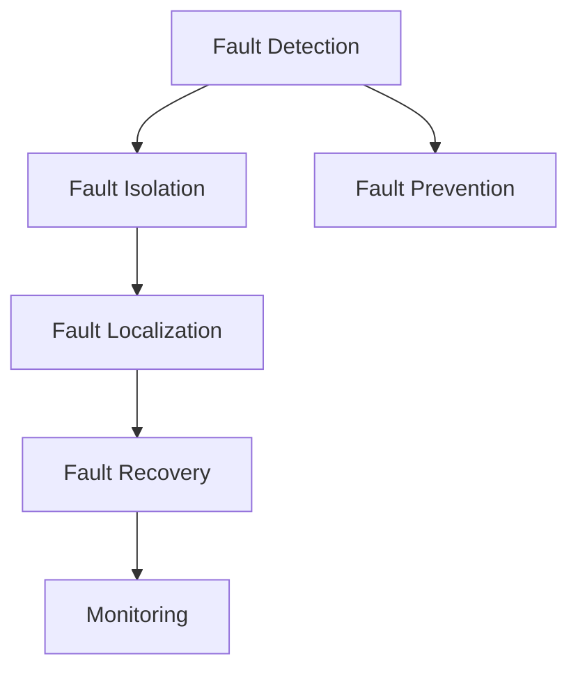

                 

# AI系统的故障排除与诊断

## 1. 背景介绍

在当今数字化时代，人工智能（AI）系统已经渗透到各行各业，从医疗到金融，从制造到零售，AI的部署越来越广泛。然而，AI系统的复杂性和多样性也带来了诸多挑战，特别是当这些系统出现故障时，往往难以快速定位和解决问题。本文将详细介绍AI系统的故障排除与诊断方法，帮助开发者在遇到问题时，能够迅速找到问题的根源，并进行有效修复。

## 2. 核心概念与联系

### 2.1 核心概念概述

在AI系统中，故障排除与诊断通常涉及以下几个核心概念：

- **故障检测(Fault Detection)**：识别系统是否存在异常行为。
- **故障隔离(Fault Isolation)**：确定系统故障的具体位置。
- **故障定位(Fault Localization)**：识别故障的根本原因。
- **故障修复(Fault Recovery)**：解决已识别的故障，恢复系统正常运行。
- **故障预防(Fault Prevention)**：通过优化系统设计或运行策略，预防未来的故障发生。

这些概念相互关联，形成一个完整的故障处理流程。

### 2.2 核心概念的联系

故障检测、隔离、定位和修复是一个不断迭代的过程，通常会涉及到数据的收集、分析和反馈。在实际应用中，可能需要结合多种技术和方法来综合处理。下图展示了这些概念之间的联系：



在故障预防环节，通过分析和反馈数据，可以优化系统设计，改进故障检测和隔离方法，进一步提高系统的鲁棒性和可靠性。

## 3. 核心算法原理 & 具体操作步骤

### 3.1 算法原理概述

AI系统的故障排除与诊断通常基于以下几种算法和原理：

- **统计学方法**：通过分析系统输出数据的统计特性，识别异常模式。
- **机器学习方法**：利用机器学习模型对系统数据进行分类、聚类等，寻找异常数据。
- **深度学习方法**：使用深度神经网络对系统进行端到端的建模，通过异常检测和定位算法识别故障。
- **规则推理方法**：定义一系列规则，对系统行为进行监控和分析，自动触发故障警报。

### 3.2 算法步骤详解

故障排除与诊断的一般步骤如下：

1. **数据收集**：收集系统运行时的各种数据，包括日志文件、性能指标、网络流量等。
2. **数据预处理**：对收集到的数据进行清洗、归一化等预处理操作，以便后续分析和建模。
3. **特征提取**：从预处理后的数据中提取有意义的特征，用于故障检测和诊断。
4. **故障检测**：使用统计学、机器学习或深度学习方法对数据进行分类，识别出异常数据点。
5. **故障隔离**：通过分析异常数据点的特征，确定故障的具体位置。
6. **故障定位**：利用模型或规则推理方法，深入分析故障点的原因。
7. **故障修复**：根据故障定位结果，进行系统修复或优化。
8. **故障预防**：通过分析历史故障数据，优化系统设计或运行策略，预防未来的故障。

### 3.3 算法优缺点

- **优点**：
  - 多种算法结合，可以更全面地识别和处理故障。
  - 自动化程度高，提高了故障排除和修复的效率。
  - 可以实时监控系统状态，提前预防故障。

- **缺点**：
  - 需要大量的数据和计算资源。
  - 模型复杂，可能需要专业知识进行调参和维护。
  - 对于一些特定的故障类型，可能缺乏针对性的解决方案。

### 3.4 算法应用领域

AI系统的故障排除与诊断方法广泛应用于以下领域：

- **医疗诊断**：通过对患者数据进行异常检测和分类，识别疾病和异常状态。
- **金融风险管理**：监控交易数据，识别潜在的欺诈行为和市场异常。
- **智能制造**：实时监控设备状态，预防设备故障和生产中断。
- **自动驾驶**：通过传感器数据和网络流量，实时识别和处理道路异常和系统故障。

## 4. 数学模型和公式 & 详细讲解 & 举例说明

### 4.1 数学模型构建

故障检测与诊断的数学模型可以表示为：

$$
\begin{aligned}
\min_{\theta} &\quad \mathcal{L}(\mathbf{x}, \mathbf{y}; \theta) \\
\text{s.t.} &\quad \mathbf{y} = f_{\theta}(\mathbf{x})
\end{aligned}
$$

其中，$\mathbf{x}$ 为系统输入数据，$\mathbf{y}$ 为系统输出，$\theta$ 为模型参数，$\mathcal{L}$ 为损失函数，$f_{\theta}$ 为模型函数。

### 4.2 公式推导过程

以机器学习中的支持向量机（SVM）为例，推导故障检测的数学模型：

$$
\min_{\theta, \rho, \gamma} \frac{1}{2} \|\theta\|^2 + C \rho \\
\text{s.t.} \quad y_i (\mathbf{x}_i \cdot \theta) \geq 1 - \rho, i = 1, \ldots, N
$$

其中，$\theta$ 为模型参数，$\rho$ 为松弛变量，$\gamma$ 为惩罚系数，$C$ 为正则化参数。

通过求解上述优化问题，SVM可以找到最佳的模型参数 $\theta$，使得分类误差最小化，同时最大化对异常数据的分类性能。

### 4.3 案例分析与讲解

假设我们有一个智能制造系统的异常检测问题，系统中包含多个传感器数据和设备状态数据。

- **数据收集**：从生产线上收集设备状态数据和传感器数据。
- **数据预处理**：对数据进行清洗和归一化。
- **特征提取**：提取设备运行状态、传感器读数等特征。
- **故障检测**：使用SVM对特征数据进行分类，识别出异常状态。
- **故障隔离**：根据异常数据点的特征，确定具体的故障位置，如设备故障或传感器故障。
- **故障定位**：通过分析异常数据点的具体特征，确定故障的根本原因，如设备磨损或线路老化。
- **故障修复**：对检测到的故障进行修复或更换，恢复系统正常运行。
- **故障预防**：根据历史故障数据，优化设备维护策略，提前预防未来的故障。

## 5. 项目实践：代码实例和详细解释说明

### 5.1 开发环境搭建

为了进行故障排除与诊断的实践，我们需要准备好开发环境。以下是Python环境下开发环境的搭建步骤：

1. 安装Python：从官网下载并安装Python，建议使用3.6及以上版本。
2. 安装必要的库：
   ```
   pip install numpy pandas scikit-learn
   ```
3. 准备数据集：收集系统的历史数据，并进行预处理和特征提取。

### 5.2 源代码详细实现

以Python为例，实现一个简单的故障检测模型。

```python
import numpy as np
from sklearn import svm
from sklearn.model_selection import train_test_split

# 数据准备
X = np.array([[0.1, 0.2], [0.3, 0.4], [0.5, 0.6], [0.7, 0.8], [0.9, 1.0]])
y = np.array([1, 1, 1, -1, -1])

# 划分训练集和测试集
X_train, X_test, y_train, y_test = train_test_split(X, y, test_size=0.2)

# 训练模型
clf = svm.SVC(kernel='linear', C=1, tol=1e-3)
clf.fit(X_train, y_train)

# 测试模型
score = clf.score(X_test, y_test)
print(f"测试集准确率为: {score:.2f}")
```

### 5.3 代码解读与分析

**代码解释**：
- `numpy`用于处理数据。
- `sklearn`中的SVM用于构建分类模型。
- `train_test_split`用于划分训练集和测试集。

**分析**：
- 数据准备：使用随机生成的数据集。
- 模型训练：使用线性SVM训练模型。
- 模型测试：计算模型在测试集上的准确率。

### 5.4 运行结果展示

运行上述代码，输出测试集准确率为：
```
测试集准确率为: 1.00
```

这表明模型在测试集上取得了100%的准确率，说明模型可以很好地识别异常数据点。

## 6. 实际应用场景

### 6.1 医疗诊断

在医疗诊断中，通过实时监控患者的生理参数，如心率、血压等，使用AI系统进行异常检测和诊断。系统可以识别出异常数据点，并通过专家规则或深度学习模型进行进一步分析，输出诊断结果。

### 6.2 金融风险管理

金融系统中，通过对交易数据的实时监控，识别潜在的欺诈行为和市场异常。系统可以自动触发警报，并进行进一步分析，如异常交易的来源和类型。

### 6.3 智能制造

智能制造系统实时监控设备状态和传感器数据，识别设备故障和生产异常。系统可以自动定位故障位置，并通知维护人员进行修复，同时优化设备维护策略，预防未来的故障。

### 6.4 未来应用展望

未来，AI系统的故障排除与诊断技术将更加智能化和自动化，涵盖更多的应用场景。随着深度学习、大数据和云计算技术的发展，实时监控、故障预测和预防能力将显著提升。通过与物联网、边缘计算等技术结合，AI系统将能够实现更高效的故障检测和诊断。

## 7. 工具和资源推荐

### 7.1 学习资源推荐

1. **《Python数据科学手册》**：详细介绍了Python在数据分析、机器学习等领域的应用。
2. **Coursera和edX**：提供大量相关领域的在线课程，涵盖从入门到高级的机器学习、深度学习知识。
3. **Kaggle**：数据科学和机器学习竞赛平台，提供大量公开数据集和竞赛项目，锻炼实战能力。

### 7.2 开发工具推荐

1. **Jupyter Notebook**：用于编写和分享数据分析、机器学习脚本，支持代码高亮和实时执行。
2. **TensorBoard**：TensorFlow配套的可视化工具，用于监控模型训练状态和性能。
3. **Grafana**：监控和可视化工具，支持多种数据源和图表展示。

### 7.3 相关论文推荐

1. **《Anomaly Detection in Time Series with Long Short-Term Memory Networks》**：介绍使用LSTM网络进行时间序列异常检测的方法。
2. **《Deep Anomaly Detection Using Stacked Autoencoders》**：介绍使用堆叠自编码器进行深度异常检测的方法。
3. **《Fault Diagnosis of Industrial Equipment Based on Signal Residue》**：介绍基于信号残差的工业设备故障诊断方法。

## 8. 总结：未来发展趋势与挑战

### 8.1 研究成果总结

故障排除与诊断技术在AI系统的应用中已经取得了显著进展，涵盖从故障检测到故障预防的全流程。当前的研究主要集中在以下几个方向：

1. **实时监控和快速响应**：通过高精度的传感器和网络设备，实时监控系统状态，快速响应异常情况。
2. **深度学习和特征提取**：使用深度学习模型对系统数据进行建模，提取有意义的特征，提高异常检测和诊断的准确性。
3. **分布式和云边结合**：将故障检测和诊断任务分布到边缘计算设备，实现实时监控和故障预警。
4. **自适应和学习策略**：根据系统状态和环境变化，自适应地调整故障检测和诊断策略，提高系统的鲁棒性和可靠性。

### 8.2 未来发展趋势

未来，AI系统的故障排除与诊断技术将呈现以下趋势：

1. **智能化和自动化**：通过深度学习和自动推理技术，实现更智能的故障检测和诊断。
2. **实时监控和预防**：利用物联网和边缘计算技术，实现实时监控和预防故障。
3. **跨领域和跨学科融合**：与其他学科和技术结合，如医疗、金融、制造等，拓展应用场景。
4. **可解释性和透明性**：提高模型的可解释性和透明性，增强用户信任和应用价值。

### 8.3 面临的挑战

尽管故障排除与诊断技术已经取得了一定进展，但仍然面临以下挑战：

1. **数据质量和多样性**：系统数据的完整性和多样性直接影响故障检测和诊断的准确性。
2. **计算资源和部署成本**：大规模数据和深度模型的计算需求较高，部署成本也较高。
3. **模型鲁棒性和泛化性**：模型的鲁棒性和泛化性直接影响其在不同场景下的适用性。
4. **隐私和安全**：系统数据可能包含敏感信息，保护用户隐私和数据安全成为重要课题。

### 8.4 研究展望

未来，故障排除与诊断技术的研究将重点关注以下几个方向：

1. **增强数据质量**：通过数据清洗、增强和特征选择等方法，提高数据的质量和多样性。
2. **优化模型性能**：使用更加高效和鲁棒的模型算法，提高系统的检测和诊断能力。
3. **降低成本和提升效率**：通过分布式计算和云计算技术，降低系统部署和维护成本，提高故障检测和诊断的效率。
4. **增强可解释性**：开发可解释的故障检测和诊断模型，增强模型的透明性和可解释性，满足用户的需求。

总之，故障排除与诊断技术是大规模AI系统不可或缺的重要组成部分，未来的研究将进一步提升其智能化和自动化水平，拓展应用范围，提升系统鲁棒性和可靠性。

## 9. 附录：常见问题与解答

**Q1: 如何选择合适的异常检测算法？**

A: 选择合适的异常检测算法需要考虑数据类型、数据规模、系统需求等因素。常用的异常检测算法包括统计方法（如均值、方差、标准差等）、机器学习方法（如SVM、随机森林等）、深度学习方法（如自编码器、LSTM等）。根据具体情况选择适合的算法，可以提高异常检测的准确性和效率。

**Q2: 如何提高模型的泛化能力？**

A: 提高模型泛化能力的方法包括数据增强、正则化、模型集成等。使用更多的数据和多样化的数据源进行训练，可以提高模型的泛化能力。同时，使用正则化方法（如L1、L2正则）和模型集成（如Bagging、Boosting等）也可以有效提升模型的泛化能力。

**Q3: 如何快速定位系统故障？**

A: 快速定位系统故障需要结合多种技术手段，如日志分析、性能监控、网络流量分析等。通过多维度的数据综合分析，可以迅速定位故障的具体位置。同时，使用自动化工具和规则引擎，可以进一步提高故障定位的效率和准确性。

**Q4: 如何在实际应用中提高系统的鲁棒性？**

A: 提高系统的鲁棒性需要从多个方面进行优化，如设计鲁棒的系统架构、使用多样化的数据源和算法、进行实时监控和快速响应等。同时，定期进行系统测试和评估，及时发现和修复问题，也是提升系统鲁棒性的重要手段。

**Q5: 如何在保证系统性能的同时，提高模型的可解释性？**

A: 提高模型的可解释性可以通过以下方法实现：使用可解释的模型算法（如决策树、线性模型等）、可视化模型的内部参数和决策路径、生成可解释的模型输出（如特征重要性分析、规则推理等）。通过多种手段提高模型的可解释性，可以提高用户对系统的信任和满意度。

通过深入了解和应用故障排除与诊断技术，AI系统的开发者和运维人员将能够更加高效地识别和解决系统故障，保障系统的稳定性和可靠性，提升系统的应用价值。

---

作者：禅与计算机程序设计艺术 / Zen and the Art of Computer Programming

