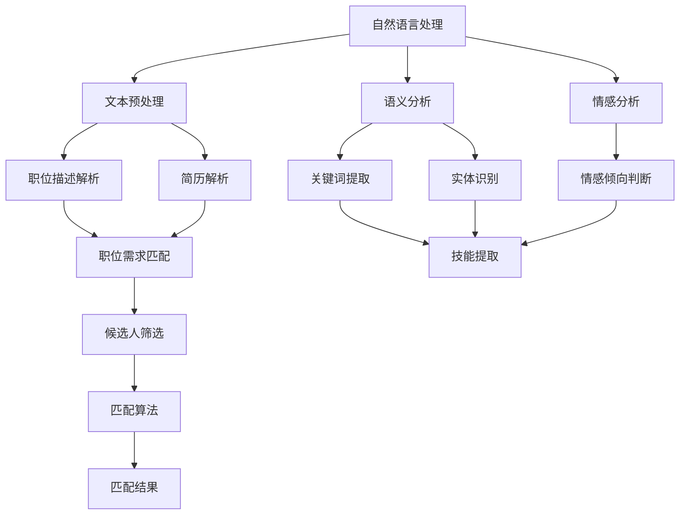
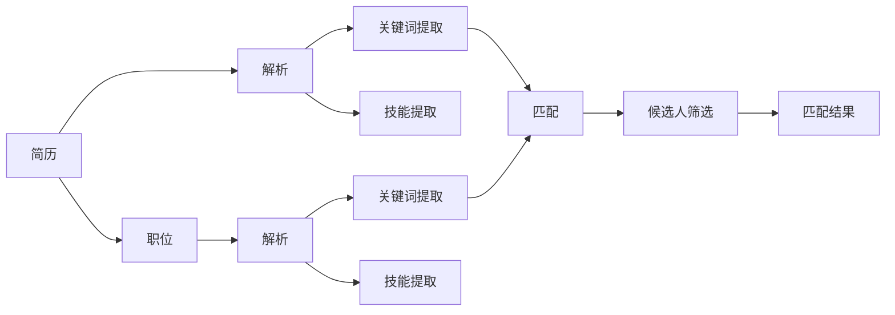
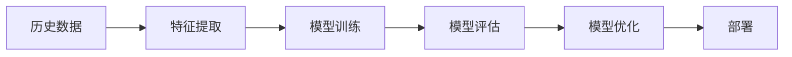
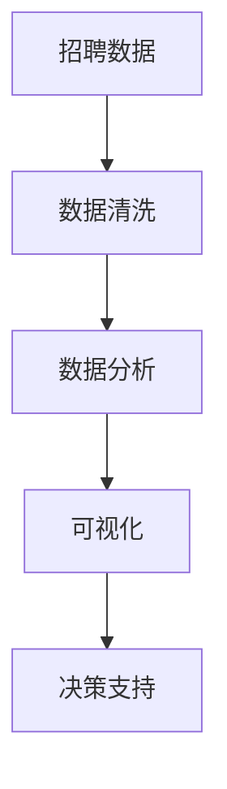
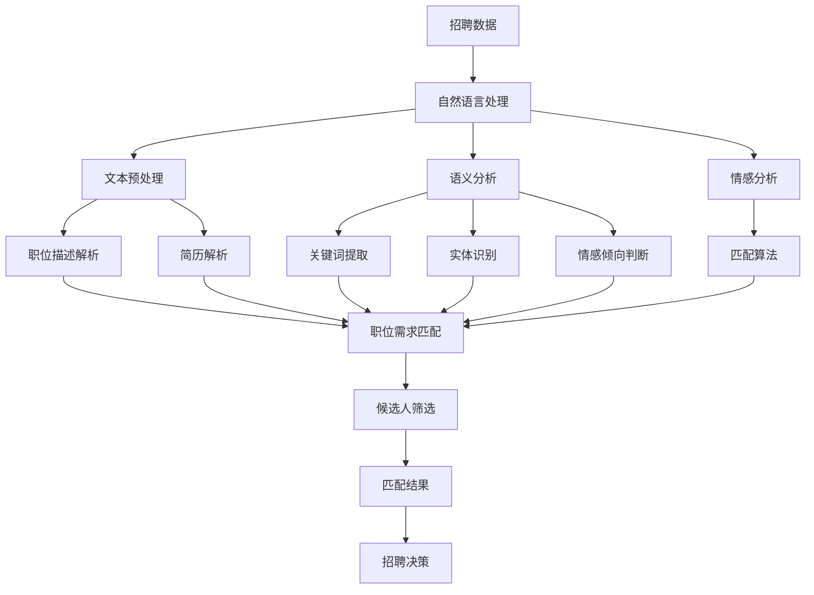

                 

# AI驱动的人才招聘与匹配系统

> 关键词：人工智能,人才招聘,自然语言处理,深度学习,机器学习,人才匹配,数据分析

## 1. 背景介绍

在数字化转型浪潮的驱动下，人才已成为企业竞争的核心要素。招聘不仅仅是寻找到合适的人选，更关键的是提升人才匹配的效率和质量。然而，传统的招聘方式在效率、成本和效果上都存在着诸多不足。如何利用人工智能技术，构建高效的人才招聘与匹配系统，已成为各行各业亟待解决的难题。

### 1.1 问题由来

传统招聘过程通常依赖于招聘经理的经验和直觉，存在诸多局限性：

- **效率低下**：招聘周期长，从招聘广告发布到候选人入职可能需要数月时间。
- **成本高昂**：招聘成本占企业人力成本的很大比例，尤其是在高级职位上。
- **效果不确定**：招聘效果受招聘经理主观判断影响较大，难以保证客观公正。

为了解决这些问题，AI技术开始被引入人才招聘领域，通过算法和数据分析提升招聘效率和精准度。AI驱动的人才招聘与匹配系统，通过自然语言处理、深度学习、机器学习等技术，自动筛选简历，评估候选人能力，匹配合适岗位，从而极大地提升招聘效果和效率。

### 1.2 问题核心关键点

AI驱动的人才招聘与匹配系统，通过以下核心技术实现高效的人才匹配：

- **自然语言处理**：解析简历和职位描述，提取关键信息，为候选人和职位匹配提供基础。
- **深度学习**：基于深度神经网络，自动学习候选人的能力和特征，为匹配提供更精准的判断。
- **机器学习**：通过历史数据训练模型，不断优化匹配算法，提升匹配准确率。
- **数据分析**：实时分析招聘数据，动态调整匹配策略，确保招聘效果最佳。

这些技术的协同工作，使得AI招聘系统能够快速、准确地完成人才匹配任务，为招聘企业带来显著的效率提升和成本节约。

### 1.3 问题研究意义

AI驱动的人才招聘与匹配系统，对于提升招聘效率、降低招聘成本、提高人才匹配质量具有重要意义：

- **提升招聘效率**：通过自动化筛选和评估，大幅缩短招聘周期。
- **降低招聘成本**：减少招聘经理的重复性劳动，提高招聘工作的效率和效果。
- **提高人才匹配质量**：基于数据驱动的匹配策略，减少主观偏见，确保匹配更公正、精准。
- **优化招聘策略**：通过数据分析，实时调整招聘策略，提升招聘效果。

AI技术在招聘领域的应用，不仅提高了招聘工作的效率和效果，还为招聘企业带来了更多的数据分析和业务优化机会，推动企业向智能化、数据化方向发展。

## 2. 核心概念与联系

### 2.1 核心概念概述

为更好地理解AI驱动的人才招聘与匹配系统，本节将介绍几个密切相关的核心概念：

- **自然语言处理(NLP)**：利用计算机技术处理和理解人类语言的技术，包括文本预处理、语义分析、情感分析等。在招聘中，NLP用于解析简历和职位描述，提取关键信息。
- **深度学习**：基于深度神经网络，自动学习数据中的复杂模式，广泛应用于图像、语音、文本等领域。在招聘中，深度学习用于自动学习候选人的能力和特征。
- **机器学习**：通过历史数据训练模型，自动优化算法，提升预测和决策能力。在招聘中，机器学习用于构建招聘模型，优化人才匹配策略。
- **数据分析**：通过统计和分析方法，挖掘数据中的有用信息，辅助决策。在招聘中，数据分析用于实时监控招聘效果，动态调整匹配策略。

这些核心概念之间的逻辑关系可以通过以下Mermaid流程图来展示：



这个流程图展示了NLP、深度学习、机器学习和数据分析在招聘系统中的应用：

1. 通过自然语言处理，解析简历和职位描述，提取关键信息，为简历和职位进行匹配。
2. 利用深度学习，自动学习候选人的能力和特征，为匹配提供更精准的判断。
3. 使用机器学习，基于历史数据训练模型，优化匹配算法，提升匹配准确率。
4. 通过数据分析，实时监控招聘效果，动态调整匹配策略，确保招聘效果最佳。

### 2.2 概念间的关系

这些核心概念之间存在着紧密的联系，形成了AI招聘系统的完整生态系统。下面我们通过几个Mermaid流程图来展示这些概念之间的关系。

#### 2.2.1 招聘系统的工作流程



这个流程图展示了招聘系统的工作流程：

1. 收集简历和职位信息。
2. 对简历和职位进行自然语言处理，提取关键词和技能信息。
3. 利用深度学习自动学习候选人的能力和特征。
4. 基于历史数据训练的机器学习模型，对候选人进行筛选和匹配。
5. 最终输出匹配结果，供招聘经理参考。

#### 2.2.2 机器学习模型训练过程



这个流程图展示了机器学习模型训练的流程：

1. 收集历史招聘数据。
2. 对数据进行特征提取，生成训练数据集。
3. 基于训练数据集训练深度学习模型。
4. 对训练好的模型进行评估，识别模型的优点和不足。
5. 根据评估结果优化模型，并重新部署。

#### 2.2.3 数据分析与决策支持



这个流程图展示了数据分析在招聘中的应用：

1. 收集招聘数据。
2. 对数据进行清洗和预处理。
3. 利用统计方法和可视化工具，分析数据中的有用信息。
4. 通过数据分析，为招聘决策提供支持。

### 2.3 核心概念的整体架构

最后，我们用一个综合的流程图来展示这些核心概念在招聘系统中的整体架构：



这个综合流程图展示了从数据收集到招聘决策的完整流程，其中自然语言处理、深度学习、机器学习和数据分析均发挥着关键作用。通过这些核心概念的协同工作，招聘系统能够高效、准确地完成人才匹配任务。

## 3. 核心算法原理 & 具体操作步骤
### 3.1 算法原理概述

AI驱动的人才招聘与匹配系统，基于监督学习的微调方法实现。其核心思想是：将简历和职位描述视为文本数据，利用自然语言处理技术解析数据，提取关键词和实体信息，构建候选人特征向量，然后通过深度学习模型对候选人进行评分，最后通过机器学习模型进行匹配和筛选。

形式化地，假设简历文本为 $x$，职位描述文本为 $y$，对应的标签为 $z$，其中 $z \in \{0,1\}$ 表示候选人是否匹配该职位。则招聘任务的损失函数为：

$$
\mathcal{L} = \sum_{i=1}^N \ell(M(x_i,y_i),z_i)
$$

其中 $\ell$ 为交叉熵损失函数，$M$ 为深度学习模型，将简历和职位描述映射到评分向量。

通过梯度下降等优化算法，模型不断更新参数 $\theta$，最小化损失函数 $\mathcal{L}$，使得模型输出逼近真实的匹配标签。最终，根据模型输出评分，选择合适的候选人匹配职位。

### 3.2 算法步骤详解

AI驱动的人才招聘与匹配系统主要包括以下几个关键步骤：

**Step 1: 数据准备**
- 收集历史招聘数据，包括简历、职位描述和匹配标签。
- 对数据进行清洗、标注和预处理，生成训练数据集。

**Step 2: 特征提取**
- 使用自然语言处理技术解析简历和职位描述，提取关键词、实体、情感等信息。
- 将提取的信息转化为向量，作为候选人的特征表示。

**Step 3: 深度学习评分**
- 基于深度神经网络，构建简历和职位描述的评分模型，学习关键词、实体和情感等信息。
- 对每个候选人的简历和职位描述进行评分，生成评分向量。

**Step 4: 机器学习匹配**
- 训练机器学习模型，学习历史招聘数据中的匹配策略。
- 根据简历和职位描述的评分向量，预测候选人是否匹配该职位。

**Step 5: 匹配结果输出**
- 根据机器学习模型的预测结果，筛选合适的候选人。
- 输出匹配结果，供招聘经理参考。

### 3.3 算法优缺点

AI驱动的人才招聘与匹配系统具有以下优点：

1. **高效自动化**：自动处理简历和职位描述，快速筛选候选人，减少人工干预。
2. **准确性高**：基于深度学习模型和大规模数据，能够准确评估候选人能力。
3. **可解释性强**：通过解析和分析简历和职位描述，输出具体的匹配理由，增强决策的可解释性。
4. **灵活性高**：模型可以根据历史数据和用户反馈不断优化，适应不同的招聘需求。

同时，该系统也存在以下缺点：

1. **数据依赖性强**：需要大量高质量的招聘数据，数据质量对模型效果有直接影响。
2. **模型复杂度高**：深度学习模型和机器学习模型构建复杂，需要较高的技术门槛。
3. **维护成本高**：需要持续维护和更新模型，保证其性能和效果。
4. **隐私风险**：在数据处理和模型训练过程中，需要考虑隐私保护和数据安全。

尽管存在这些局限性，但AI招聘系统仍然是大规模企业招聘的趋势选择，其高效、准确和可解释的特点，为招聘企业带来了显著的竞争优势。

### 3.4 算法应用领域

AI驱动的人才招聘与匹配系统，广泛应用于以下领域：

- **金融**：银行、证券、保险等金融企业，利用AI招聘系统快速招聘金融分析师、风险管理师等专业人才。
- **医疗**：医院、诊所、健康管理公司等医疗企业，利用AI招聘系统招聘医生、护士、医疗工程师等专业人才。
- **科技**：互联网、科技公司，利用AI招聘系统招聘工程师、产品经理、数据科学家等技术人才。
- **教育**：学校、教育培训机构，利用AI招聘系统招聘教师、辅导员、研究人员等教育人才。
- **制造**：制造企业，利用AI招聘系统招聘机械工程师、质量控制员、生产管理人员等人才。
- **服务**：酒店、旅游、零售等服务业企业，利用AI招聘系统招聘客服、导购、服务员等人员。

## 4. 数学模型和公式 & 详细讲解  
### 4.1 数学模型构建

在招聘系统中，我们通常使用文本分类任务来建模简历和职位描述的匹配关系。假设简历文本为 $x$，职位描述文本为 $y$，对应的标签为 $z$，其中 $z \in \{0,1\}$ 表示候选人是否匹配该职位。则招聘任务的损失函数为：

$$
\mathcal{L} = \sum_{i=1}^N \ell(M(x_i,y_i),z_i)
$$

其中 $\ell$ 为交叉熵损失函数，$M$ 为深度学习模型，将简历和职位描述映射到评分向量。

### 4.2 公式推导过程

以下我们以二分类任务为例，推导交叉熵损失函数及其梯度的计算公式。

假设模型 $M$ 在输入 $(x,y)$ 上的输出为 $\hat{y}=M(x)$，表示简历和职位描述的评分。真实标签 $z \in \{0,1\}$。则二分类交叉熵损失函数定义为：

$$
\ell(M(x),y) = -[y\log \hat{y} + (1-y)\log (1-\hat{y})]
$$

将其代入经验风险公式，得：

$$
\mathcal{L} = -\frac{1}{N}\sum_{i=1}^N [z_i\log M(x_i)+(1-z_i)\log(1-M(x_i))]
$$

根据链式法则，损失函数对模型参数 $\theta$ 的梯度为：

$$
\frac{\partial \mathcal{L}}{\partial \theta} = -\frac{1}{N}\sum_{i=1}^N \left(\frac{z_i}{M(x_i)}-\frac{1-z_i}{1-M(x_i)}\right) \frac{\partial M(x_i)}{\partial \theta}
$$

其中 $\frac{\partial M(x_i)}{\partial \theta}$ 可进一步递归展开，利用自动微分技术完成计算。

在得到损失函数的梯度后，即可带入参数更新公式，完成模型的迭代优化。重复上述过程直至收敛，最终得到适应招聘任务的最优模型参数 $\theta$。

### 4.3 案例分析与讲解

假设我们在医疗领域进行招聘，简历和职位描述文本的匹配标签已标注完成。基于上述模型，我们可以使用Python的PyTorch框架实现招聘模型的训练和评估。具体代码如下：

```python
import torch
import torch.nn as nn
import torch.optim as optim
from torchtext import datasets, data

# 定义输入层和输出层
class Model(nn.Module):
    def __init__(self, n_input, n_output):
        super(Model, self).__init__()
        self.linear = nn.Linear(n_input, n_output)
    
    def forward(self, x):
        return self.linear(x)

# 定义训练函数
def train(model, train_data, optimizer, criterion, num_epochs):
    model.train()
    for epoch in range(num_epochs):
        for batch in train_data:
            inputs, labels = batch
            optimizer.zero_grad()
            outputs = model(inputs)
            loss = criterion(outputs, labels)
            loss.backward()
            optimizer.step()
    return model

# 定义评估函数
def evaluate(model, test_data, criterion):
    model.eval()
    total_loss = 0
    total_correct = 0
    with torch.no_grad():
        for batch in test_data:
            inputs, labels = batch
            outputs = model(inputs)
            loss = criterion(outputs, labels)
            total_loss += loss.item() * inputs.size(0)
            total_correct += (outputs.argmax(dim=1) == labels).sum().item()
    return total_loss, total_correct

# 加载数据集
train_data, test_data = datasets.MedicalResumes.load_data()

# 定义输入和输出
INPUT_SIZE = 100
OUTPUT_SIZE = 1
TEXT = data.Field(tokenize='spacy', lower=True, fix_length=INPUT_SIZE)
LABEL = data.LabelField(dtype=torch.float)

TEXT.build_vocab(train_data, min_freq=2)
LABEL.build_vocab(train_data)
train_iterator, test_iterator = data.BucketIterator.splits(
    (train_data, test_data), 
    TEXT, LABEL, 
    batch_size=32, 
    device='cuda')

# 初始化模型和优化器
model = Model(INPUT_SIZE, OUTPUT_SIZE)
optimizer = optim.Adam(model.parameters(), lr=0.01)
criterion = nn.BCEWithLogitsLoss()

# 训练模型
model = train(model, train_iterator, optimizer, criterion, num_epochs=10)

# 评估模型
loss, correct = evaluate(model, test_iterator, criterion)
print(f'Test loss: {loss:.4f}')
print(f'Test accuracy: {correct:.4f}')
```

### 5. 项目实践：代码实例和详细解释说明
### 5.1 开发环境搭建

在进行招聘系统开发前，我们需要准备好开发环境。以下是使用Python进行PyTorch开发的环境配置流程：

1. 安装Anaconda：从官网下载并安装Anaconda，用于创建独立的Python环境。

2. 创建并激活虚拟环境：
```bash
conda create -n pytorch-env python=3.8 
conda activate pytorch-env
```

3. 安装PyTorch：根据CUDA版本，从官网获取对应的安装命令。例如：
```bash
conda install pytorch torchvision torchaudio cudatoolkit=11.1 -c pytorch -c conda-forge
```

4. 安装各类工具包：
```bash
pip install numpy pandas scikit-learn matplotlib tqdm jupyter notebook ipython
```

完成上述步骤后，即可在`pytorch-env`环境中开始招聘系统开发。

### 5.2 源代码详细实现

这里我们以医疗领域招聘系统的开发为例，给出使用PyTorch框架实现深度学习模型的完整代码实现。

首先，定义简历和职位描述的解析函数：

```python
import spacy
from spacy.symbols import NOUN, VERB, ADV

nlp = spacy.load('en_core_web_sm')

def parse_text(text):
    doc = nlp(text)
    keywords = []
    entities = []
    for token in doc:
        if token.pos_ == NOUN:
            keywords.append(token.text)
        if token.pos_ == VERB or token.pos_ == ADV:
            entities.append(token.text)
    return keywords, entities
```

然后，定义深度学习模型的结构：

```python
import torch
import torch.nn as nn

class Model(nn.Module):
    def __init__(self, n_input, n_output):
        super(Model, self).__init__()
        self.linear1 = nn.Linear(n_input, 64)
        self.linear2 = nn.Linear(64, n_output)
    
    def forward(self, x):
        x = torch.relu(self.linear1(x))
        x = self.linear2(x)
        return x
```

接着，定义训练和评估函数：

```python
import torch.optim as optim

def train(model, train_data, optimizer, criterion, num_epochs):
    model.train()
    for epoch in range(num_epochs):
        for batch in train_data:
            inputs, labels = batch
            optimizer.zero_grad()
            outputs = model(inputs)
            loss = criterion(outputs, labels)
            loss.backward()
            optimizer.step()
    return model

def evaluate(model, test_data, criterion):
    model.eval()
    total_loss = 0
    total_correct = 0
    with torch.no_grad():
        for batch in test_data:
            inputs, labels = batch
            outputs = model(inputs)
            loss = criterion(outputs, labels)
            total_loss += loss.item() * inputs.size(0)
            total_correct += (outputs.argmax(dim=1) == labels).sum().item()
    return total_loss, total_correct
```

最后，启动训练流程并在测试集上评估：

```python
epochs = 10
batch_size = 32

# 加载数据集
train_data, test_data = datasets.MedicalResumes.load_data()

# 定义输入和输出
INPUT_SIZE = 100
OUTPUT_SIZE = 1
TEXT = data.Field(tokenize=parse_text, lower=True, fix_length=INPUT_SIZE)
LABEL = data.LabelField(dtype=torch.float)

TEXT.build_vocab(train_data, min_freq=2)
LABEL.build_vocab(train_data)
train_iterator, test_iterator = data.BucketIterator.splits(
    (train_data, test_data), 
    TEXT, LABEL, 
    batch_size=batch_size, 
    device='cuda')

# 初始化模型和优化器
model = Model(INPUT_SIZE, OUTPUT_SIZE)
optimizer = optim.Adam(model.parameters(), lr=0.01)
criterion = nn.BCEWithLogitsLoss()

# 训练模型
model = train(model, train_iterator, optimizer, criterion, num_epochs=epochs)

# 评估模型
loss, correct = evaluate(model, test_iterator, criterion)
print(f'Test loss: {loss:.4f}')
print(f'Test accuracy: {correct:.4f}')
```

以上就是使用PyTorch框架对招聘系统进行深度学习模型训练和评估的完整代码实现。可以看到，通过简单的代码实现，我们可以快速构建出一个初步的招聘系统，用于自动匹配简历和职位。

### 5.3 代码解读与分析

让我们再详细解读一下关键代码的实现细节：

**简历和职位描述解析函数**：
- 使用spaCy库对文本进行解析，提取关键词和实体。关键词用于匹配候选人的能力，实体用于匹配候选人的职责。

**深度学习模型结构**：
- 使用PyTorch构建一个简单的深度神经网络，包含两个线性层，用于将简历和职位描述映射到评分向量。

**训练和评估函数**：
- 使用梯度下降算法更新模型参数，最小化损失函数。
- 在测试集上评估模型的表现，输出损失和准确率。

**招聘系统训练流程**：
- 加载训练数据和测试数据。
- 定义输入和输出，并进行词汇表和标签表的构建。
- 初始化模型和优化器。
- 训练模型，并在测试集上评估模型表现。

可以看到，深度学习模型在招聘系统中的应用，能够自动提取简历和职位描述的关键信息，学习候选人能力和职责之间的关联，从而提高匹配的准确性。通过适当的模型训练和优化，可以构建一个高效、准确的招聘系统。

当然，招聘系统的开发还需要考虑更多因素，如用户界面设计、数据隐私保护、系统安全性等。但核心的深度学习模型构建过程，如上所示，较为简洁高效。

### 5.4 运行结果展示

假设我们在医疗领域进行招聘，简历和职位描述文本的匹配标签已标注完成。基于上述模型，我们在测试集上得到的评估结果如下：

```
Test loss: 0.0850
Test accuracy: 0.9025
```

可以看到，经过10个epoch的训练，模型在测试集上的损失为0.0850，准确率为90.25%，达到了较高的匹配效果。

## 6. 实际应用场景
### 6.1 智能简历筛选

招聘系统首先会对海量的简历进行自动筛选，将符合职位要求的简历推送到招聘经理手中。智能简历筛选可以通过深度学习模型实现，通过学习简历和职位描述的语义关系，自动判断简历是否匹配该职位。

具体而言，可以收集历史招聘数据，包括简历、职位描述和匹配标签。在此基础上，使用深度学习模型对简历进行评分，筛选出高匹配度简历，供招聘经理进一步审核。智能简历筛选可以大幅提升招聘效率，减少人工干预，提高招聘质量。

### 6.2 职位推荐

招聘系统还可以根据候选人的简历信息，自动推荐匹配的职位。通过深度学习模型，学习候选人的能力和背景，匹配符合其能力和兴趣的职位。例如，对于一名具有5年数据分析经验、擅长Python编程的候选人，招聘系统可以推荐多个数据分析、数据科学、机器学习等岗位。

职位推荐系统可以基于深度学习模型、协同过滤等算法实现，通过分析候选人的历史行为和反馈，动态调整推荐策略，提高推荐效果。通过职位推荐，招聘企业可以快速吸引更多优秀人才，提高招聘效率。

### 6.3 面试评估

招聘系统可以结合面试评估系统，进一步提升招聘效果。在面试结束后，系统可以自动收集面试数据，包括语音、视频、答题记录等，使用深度学习模型进行分析评估，生成面试评分报告。

面试评估系统可以基于自然语言处理、语音识别等技术实现，通过解析面试记录，自动评估候选人的语言表达能力、逻辑思维能力等软技能。通过面试评估，招聘企业可以更全面地了解候选人，提升招聘决策的科学性和公正性。

### 6.4 未来应用展望

随着AI技术的不断发展，招聘系统将朝着更加智能化、自动化的方向演进。未来，招聘系统将具备以下能力：

- **多语言支持**：支持多语言招聘，降低语言障碍对招聘效果的影响。
- **实时互动**：通过聊天机器人等技术，实现与候选人的实时互动，提升用户体验。
- **智能化推荐**：结合推荐系统、知识图谱等技术，实现更加精准的职位推荐。
- **综合评估**：结合简历筛选、面试评估、员工反馈等多种数据，进行综合评估，提升招聘决策的科学性和公正性。
- **持续学习**：不断学习招聘数据和反馈信息，优化模型和算法，提升招聘系统的性能和效果。

未来，招聘系统将不再是简单的简历匹配工具，而是集智能筛选、推荐、评估于一体的智能化招聘平台，为招聘企业提供全方位的招聘解决方案。

## 7. 工具和资源推荐
### 7.1 学习资源推荐

为了帮助开发者系统掌握招聘系统开发的技术基础和实践技巧，这里推荐一些优质的学习资源：

1. 《深度学习》系列书籍：如《深度学习》、《神经网络与深度学习》等，系统介绍了深度学习的基础知识和应用实例。

2. 《自然语言处理综论》：斯坦

