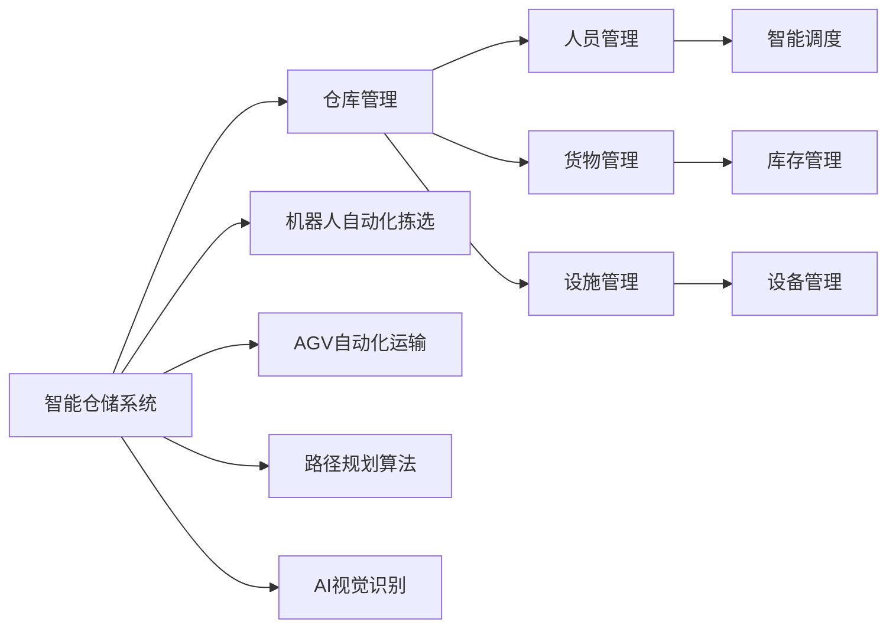
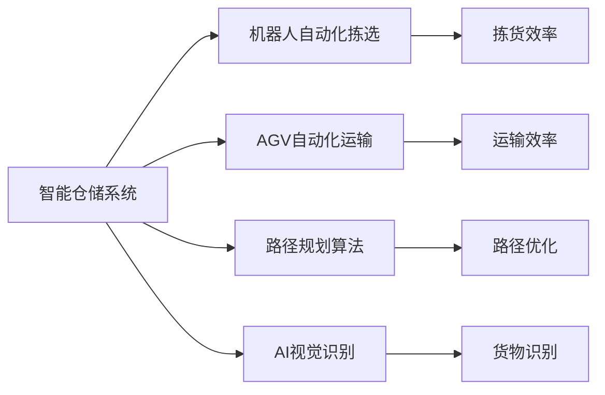
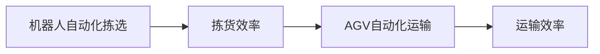
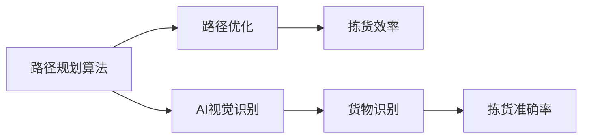

                 

# AI驱动的智能仓储:提高物流效率

## 1. 背景介绍

### 1.1 问题由来
随着电子商务和在线零售的蓬勃发展，物流业成为支撑电商业务的重要组成部分。据统计，电商物流成本在电商总成本中占比达到20%-30%，是影响电商盈利能力的重要因素。然而，传统的仓储物流系统存在诸多问题，如库存量不合理、配送效率低、拣货过程繁琐等，导致物流成本居高不下，无法适应电商高速发展的需要。

为了提高物流效率，各大电商平台纷纷采用人工智能技术，尤其是智能仓储系统。AI驱动的智能仓储系统能够通过数据分析和机器学习，优化仓储流程，提高库存管理水平，提升订单处理速度，降低物流成本，是电商物流行业转型升级的关键技术。

### 1.2 问题核心关键点
智能仓储系统依托人工智能技术，通过对仓库内人员、货物的动态监测和数据分析，优化仓储管理流程，实现仓储自动化和智能化。主要包括以下关键技术：

- **数据驱动的仓储管理：** 通过实时数据分析，预测库存水平，优化仓储布局，减少拣货路径长度，提高作业效率。
- **机器人自动化拣选：** 采用自动化拣选机器人，减少人工操作，提高拣货准确率和效率。
- **AGV（自动导引车）自动化运输：** 利用AGV进行货物自动运输，提高物流效率，降低人工成本。
- **智能路径规划：** 通过路径规划算法，优化拣选路径，减少等待时间和路径冲突。
- **AI视觉识别：** 采用AI视觉识别技术，自动识别货物种类、位置，提高拣货速度和准确性。

智能仓储系统的核心目标是提高仓储作业效率，减少人力成本，降低物流成本，提升客户满意度。AI技术在智能仓储中的应用，极大地提高了仓储管理的智能化水平，是电商物流行业的重要突破。

## 2. 核心概念与联系

### 2.1 核心概念概述

为更好地理解AI驱动的智能仓储系统，本节将介绍几个密切相关的核心概念：

- **智能仓储系统（Smart Warehouse System）：** 通过AI技术，实现仓储自动化和智能化，优化仓储管理流程，提高作业效率的系统。
- **仓库管理（Warehouse Management）：** 通过管理仓库内人员、货物、设施等资源，实现仓储优化和物流效率提升。
- **机器人自动化拣选（Automated Picking System）：** 采用机器人进行拣选作业，提高拣货准确率和效率。
- **AGV（自动导引车）自动化运输（AGV Automation）：** 利用自动导引车进行货物运输，提高物流效率，降低人工成本。
- **路径规划算法（Path Planning Algorithm）：** 通过算法优化拣选路径，减少等待时间和路径冲突。
- **AI视觉识别（AI Visual Recognition）：** 采用AI视觉识别技术，自动识别货物种类、位置，提高拣货速度和准确性。

这些核心概念之间的逻辑关系可以通过以下Mermaid流程图来展示：



这个流程图展示了一些核心概念之间的关系：

1. 智能仓储系统通过管理仓库内的人员、货物、设施等资源，实现仓储优化和物流效率提升。
2. 机器人自动化拣选和AGV自动化运输是智能仓储系统的两个重要组成部分，分别通过自动化手段提高拣货和运输效率。
3. 路径规划算法和AI视觉识别技术进一步提升拣货和运输的智能化水平，优化作业流程。
4. 仓库管理包含人员管理、货物管理和设施管理等多个方面，通过智能调度、库存管理和设备管理等措施，支持智能仓储系统的运行。

### 2.2 概念间的关系

这些核心概念之间存在着紧密的联系，形成了智能仓储系统的完整生态系统。下面我们通过几个Mermaid流程图来展示这些概念之间的关系。

#### 2.2.1 智能仓储系统的核心组成



这个流程图展示了一个完整的智能仓储系统组成，包括机器人自动化拣选、AGV自动化运输、路径规划算法和AI视觉识别技术，每个组成部分都对智能仓储系统的效果产生重要影响。

#### 2.2.2 机器人自动化拣选和AGV自动化运输的关系



这个流程图展示了机器人自动化拣选和AGV自动化运输之间的关系。机器人自动化拣选通过减少人工操作，提高拣货效率，而AGV自动化运输通过减少人工搬运，提高运输效率，两者相辅相成，共同提升智能仓储系统的整体性能。

#### 2.2.3 路径规划算法和AI视觉识别技术的关系



这个流程图展示了路径规划算法和AI视觉识别技术之间的关系。路径规划算法通过优化拣选路径，减少等待时间和路径冲突，提高拣货效率。AI视觉识别技术通过自动识别货物种类和位置，提高拣货准确率和效率。

## 3. 核心算法原理 & 具体操作步骤

### 3.1 算法原理概述

AI驱动的智能仓储系统通过数据驱动和机器学习技术，优化仓储管理流程，提高作业效率。其核心算法包括数据驱动仓储管理、机器人路径规划、AI视觉识别等。

#### 3.1.1 数据驱动仓储管理
数据驱动仓储管理通过实时数据分析，预测库存水平，优化仓储布局，减少拣货路径长度，提高作业效率。具体算法包括：

1. **库存预测算法（Inventory Forecasting Algorithm）：** 通过历史销售数据和市场趋势，预测未来的库存需求。
2. **位置优化算法（Location Optimization Algorithm）：** 根据货物需求量，优化仓库布局，确保货物能以最短路径到达拣货点。
3. **路径优化算法（Path Optimization Algorithm）：** 通过算法优化拣选路径，减少等待时间和路径冲突。

#### 3.1.2 机器人路径规划
机器人路径规划通过算法优化拣选路径，减少等待时间和路径冲突，提高拣货效率。具体算法包括：

1. **A*算法（A* Algorithm）：** 通过启发式搜索，找到最优拣货路径。
2. **RRT算法（RRT Algorithm）：** 通过随机采样树，快速找到接近最优路径的可行解。
3. **D*算法（D* Algorithm）：** 通过实时动态更新，适应动态环境变化，优化路径选择。

#### 3.1.3 AI视觉识别
AI视觉识别通过深度学习模型，自动识别货物种类和位置，提高拣货速度和准确性。具体算法包括：

1. **卷积神经网络（Convolutional Neural Network, CNN）：** 通过图像处理和特征提取，识别货物种类。
2. **R-CNN（Region-based Convolutional Neural Network）：** 通过目标检测，精确定位货物位置。
3. **YOLO（You Only Look Once）：** 通过单阶段检测，实时处理大量货物。

### 3.2 算法步骤详解

#### 3.2.1 数据驱动仓储管理步骤
1. **数据收集：** 收集仓库内的人员、货物、设施等数据，包括库存量、人员位置、设备状态等。
2. **数据预处理：** 对数据进行清洗、归一化等预处理，确保数据质量。
3. **库存预测：** 使用库存预测算法，预测未来的库存需求。
4. **位置优化：** 根据货物需求量，优化仓库布局，确保货物能以最短路径到达拣货点。
5. **路径优化：** 使用路径优化算法，找到最优拣货路径。

#### 3.2.2 机器人路径规划步骤
1. **路径生成：** 根据拣货任务和货物位置，生成初步拣货路径。
2. **路径优化：** 使用A*、RRT、D*等算法优化拣货路径，确保路径高效可行。
3. **路径执行：** 机器人根据优化后的路径，执行拣货任务。

#### 3.2.3 AI视觉识别步骤
1. **数据采集：** 通过摄像头等设备采集货物图像。
2. **特征提取：** 使用CNN等深度学习模型，提取货物特征。
3. **目标检测：** 使用R-CNN、YOLO等目标检测算法，精确定位货物位置。
4. **货物识别：** 通过分类模型，识别货物种类。
5. **信息反馈：** 将识别结果反馈给拣货系统，进行下一步操作。

### 3.3 算法优缺点

#### 3.3.1 数据驱动仓储管理优点
1. **高效预测：** 通过实时数据分析，精准预测库存需求，优化库存管理。
2. **动态优化：** 根据实时数据，动态调整仓储布局和路径，提高作业效率。
3. **准确性高：** 数据驱动的管理方式，避免人为错误，提高作业准确性。

#### 3.3.2 数据驱动仓储管理缺点
1. **数据质量要求高：** 需要高质量的实时数据支持，数据缺失或不准确会导致决策错误。
2. **系统复杂度高：** 需要复杂的算法和系统支持，系统建设和维护成本高。

#### 3.3.3 机器人路径规划优点
1. **自动化程度高：** 减少人工操作，提高拣货效率和准确性。
2. **灵活性高：** 适应不同类型和大小的货物，灵活调整拣货路径。
3. **全天候工作：** 机器人可以24小时不间断作业，提高物流效率。

#### 3.3.4 机器人路径规划缺点
1. **成本高：** 需要购买和维护大量机器人设备，前期投入成本高。
2. **设备故障率：** 机器人设备容易故障，影响作业效率。
3. **技术要求高：** 需要高技术水平的设备维护和系统集成。

#### 3.3.5 AI视觉识别优点
1. **速度快：** 实时处理大量货物，提高拣货速度。
2. **准确率高：** 高精度目标检测和分类模型，提高识别准确率。
3. **适应性强：** 可适应不同类型和大小的货物，灵活性高。

#### 3.3.6 AI视觉识别缺点
1. **环境要求高：** 对光照、背景等环境条件要求高，影响识别效果。
2. **维护复杂：** 需要定期维护和校准摄像头等设备，保证识别效果。
3. **数据隐私：** 对货物图像数据隐私保护要求高，需注意数据安全。

### 3.4 算法应用领域

AI驱动的智能仓储系统已经在多个领域得到了广泛应用，包括：

1. **电商物流：** 通过智能仓储系统，优化仓储管理流程，提高订单处理速度，降低物流成本。
2. **制造业：** 通过智能仓储系统，提高生产线的物料供应效率，降低库存成本。
3. **冷链物流：** 通过智能仓储系统，优化冷链配送路径，确保食品等易腐物品的储存和运输质量。
4. **智能家居：** 通过智能仓储系统，实现家居用品的自动补货和配送，提升生活便捷性。
5. **医疗行业：** 通过智能仓储系统，优化医疗物资的储存和配送，提高医疗服务效率。

## 4. 数学模型和公式 & 详细讲解 & 举例说明

### 4.1 数学模型构建

#### 4.1.1 数据驱动仓储管理模型
数据驱动仓储管理模型通过历史销售数据和市场趋势，预测未来的库存需求，优化仓储布局和拣货路径。数学模型如下：

1. **库存预测模型：**
   $$
   F(t) = \alpha f(t-1) + \beta g(t-1)
   $$
   其中，$F(t)$ 表示预测第 $t$ 天的库存需求，$f(t-1)$ 表示第 $t-1$ 天的订单需求，$g(t-1)$ 表示第 $t-1$ 天的历史库存量，$\alpha$ 和 $\beta$ 为模型参数。

2. **位置优化模型：**
   $$
   L_i = \sum_{j=1}^{N} d_{ij} Q_j
   $$
   其中，$L_i$ 表示位置 $i$ 的货物需求量，$d_{ij}$ 表示位置 $i$ 和位置 $j$ 之间的距离，$Q_j$ 表示位置 $j$ 的库存量，$N$ 表示位置总数。

3. **路径优化模型：**
   $$
   P = \min_{p} \sum_{i=1}^{N} \sum_{j=1}^{N} w_{ij} (t_i - t_j)^2
   $$
   其中，$P$ 表示最优路径，$p$ 表示路径节点，$t_i$ 表示位置 $i$ 的访问时间，$w_{ij}$ 表示位置 $i$ 和位置 $j$ 之间的权重。

#### 4.1.2 机器人路径规划模型
机器人路径规划模型通过算法优化拣货路径，确保路径高效可行。数学模型如下：

1. **A*算法模型：**
   $$
   F(n) = G(n) + H(n)
   $$
   其中，$F(n)$ 表示节点 $n$ 的启发式函数值，$G(n)$ 表示节点 $n$ 到起点的实际代价，$H(n)$ 表示节点 $n$ 到终点的启发式代价。

2. **RRT算法模型：**
   $$
   RRT(n) = \sum_{i=1}^{k} \frac{p_i(n)}{p_i(n-1)}
   $$
   其中，$RRT(n)$ 表示第 $n$ 次采样后的采样树，$p_i(n)$ 表示第 $i$ 次采样后的采样节点，$k$ 表示采样次数。

3. **D*算法模型：**
   $$
   D^*(n) = D^*(n-1) + \delta(n)
   $$
   其中，$D^*(n)$ 表示第 $n$ 次动态更新的路径代价，$D^*(n-1)$ 表示第 $n-1$ 次路径代价，$\delta(n)$ 表示第 $n$ 次路径代价的增量。

#### 4.1.3 AI视觉识别模型
AI视觉识别模型通过深度学习模型，自动识别货物种类和位置，提高拣货速度和准确性。数学模型如下：

1. **CNN模型：**
   $$
   y = \sigma(Wx + b)
   $$
   其中，$y$ 表示货物种类，$x$ 表示图像特征向量，$W$ 表示权重矩阵，$b$ 表示偏置项，$\sigma$ 表示激活函数。

2. **R-CNN模型：**
   $$
   y = \max(\sum_{i=1}^{n} \sigma(W_i x + b_i))
   $$
   其中，$y$ 表示目标位置，$n$ 表示候选框数，$W_i$ 和 $b_i$ 表示第 $i$ 个候选框的权重和偏置项。

3. **YOLO模型：**
   $$
   y = \max(\sum_{i=1}^{m} \sigma(W_i x + b_i))
   $$
   其中，$y$ 表示目标位置，$m$ 表示网格数，$W_i$ 和 $b_i$ 表示第 $i$ 个网格的权重和偏置项。

### 4.2 公式推导过程

#### 4.2.1 库存预测模型推导
库存预测模型通过线性回归的方式，预测未来的库存需求。具体推导如下：

设历史数据集为 $(x_i, y_i)$，$i=1,2,\ldots,N$，其中 $x_i$ 表示第 $i$ 天的订单需求，$y_i$ 表示第 $i$ 天的库存量。假设库存量 $F(t)$ 与订单需求 $f(t)$ 和历史库存量 $g(t)$ 之间存在线性关系，则有：

$$
F(t) = \alpha f(t-1) + \beta g(t-1) + \epsilon_t
$$

其中，$\epsilon_t$ 表示随机误差。通过最小化均方误差，可以得到：

$$
\alpha = \frac{\sum_{i=1}^{N} (x_i - \hat{x}_i)(y_i - \hat{y}_i)}{\sum_{i=1}^{N} (x_i - \hat{x}_i)^2}
$$

$$
\beta = \frac{\sum_{i=1}^{N} (x_i - \hat{x}_i)(y_i - \hat{y}_i)}{\sum_{i=1}^{N} (y_i - \hat{y}_i)^2}
$$

其中，$\hat{x}_i$ 和 $\hat{y}_i$ 表示预测值。

#### 4.2.2 路径优化模型推导
路径优化模型通过最小化路径代价函数，优化拣货路径。具体推导如下：

假设拣货路径为 $p=(i_1, i_2, \ldots, i_k)$，节点 $i_j$ 的访问时间为 $t_j$，节点之间的权重为 $w_{ij}$。则路径代价函数为：

$$
P(p) = \sum_{i=1}^{k} \sum_{j=1}^{k} w_{ij} (t_i - t_j)^2
$$

通过最小化路径代价函数，可以得到最优路径 $p^*$：

$$
p^* = \arg\min_{p} P(p)
$$

#### 4.2.3 AI视觉识别模型推导
AI视觉识别模型通过深度学习模型，自动识别货物种类和位置。具体推导如下：

假设图像特征向量为 $x$，货物种类为 $y$。使用卷积神经网络模型，可以得到：

$$
y = \sigma(Wx + b)
$$

其中，$W$ 表示权重矩阵，$b$ 表示偏置项，$\sigma$ 表示激活函数。

### 4.3 案例分析与讲解

#### 4.3.1 电商物流案例
某电商平台通过智能仓储系统，优化仓储管理流程，提高了订单处理速度和物流效率。具体步骤如下：

1. **数据收集：** 收集仓库内的人员、货物、设施等数据，包括库存量、人员位置、设备状态等。
2. **数据预处理：** 对数据进行清洗、归一化等预处理，确保数据质量。
3. **库存预测：** 使用库存预测算法，预测未来的库存需求。
4. **位置优化：** 根据货物需求量，优化仓库布局，确保货物能以最短路径到达拣货点。
5. **路径优化：** 使用路径优化算法，找到最优拣货路径。
6. **机器人路径规划：** 使用A*算法，优化拣货路径，减少等待时间和路径冲突。
7. **AI视觉识别：** 使用CNN模型，识别货物种类，使用R-CNN模型，精确定位货物位置。

通过以上步骤，电商平台在仓储管理上实现了自动化和智能化，显著提高了物流效率，降低了物流成本，提升了客户满意度。

#### 4.3.2 制造业案例
某制造业公司通过智能仓储系统，提高了生产线的物料供应效率，降低了库存成本。具体步骤如下：

1. **数据收集：** 收集仓库内的人员、货物、设施等数据，包括库存量、人员位置、设备状态等。
2. **数据预处理：** 对数据进行清洗、归一化等预处理，确保数据质量。
3. **库存预测：** 使用库存预测算法，预测未来的库存需求。
4. **位置优化：** 根据货物需求量，优化仓库布局，确保货物能以最短路径到达拣货点。
5. **路径优化：** 使用路径优化算法，找到最优拣货路径。
6. **机器人路径规划：** 使用RRT算法，优化拣货路径，减少等待时间和路径冲突。
7. **AI视觉识别：** 使用YOLO模型，识别货物种类，使用R-CNN模型，精确定位货物位置。

通过以上步骤，制造业公司在仓储管理上实现了自动化和智能化，显著提高了物料供应效率，降低了库存成本，提升了生产效率。

## 5. 项目实践：代码实例和详细解释说明

### 5.1 开发环境搭建

在进行智能仓储系统开发前，我们需要准备好开发环境。以下是使用Python进行PyTorch开发的环境配置流程：

1. 安装Anaconda：从官网下载并安装Anaconda，用于创建独立的Python环境。

2. 创建并激活虚拟环境：
```bash
conda create -n pytorch-env python=3.8 
conda activate pytorch-env
```

3. 安装PyTorch：根据CUDA版本，从官网获取对应的安装命令。例如：
```bash
conda install pytorch torchvision torchaudio cudatoolkit=11.1 -c pytorch -c conda-forge
```

4. 安装Transformers库：
```bash
pip install transformers
```

5. 安装各类工具包：
```bash
pip install numpy pandas scikit-learn matplotlib tqdm jupyter notebook ipython
```

完成上述步骤后，即可在`pytorch-env`环境中开始智能仓储系统开发。

### 5.2 源代码详细实现

下面我们以机器人路径规划为例，给出使用PyTorch和Transformer实现A*算法的PyTorch代码实现。

首先，定义节点类和图类：

```python
import torch
import networkx as nx

class Node:
    def __init__(self, x, y):
        self.x = x
        self.y = y
        self.visited = False
        self.f = float('inf')
        self.g = float('inf')
        self.h = float('inf')
        self.parent = None

class Graph:
    def __init__(self, nodes):
        self.nodes = nodes
        self.adj_list = {}
        self.graph = nx.Graph()

    def add_node(self, node):
        self.nodes.append(node)
        self.adj_list[node] = []

    def add_edge(self, node1, node2, weight):
        self.graph.add_edge(node1, node2, weight=weight)
        self.adj_list[node1].append(node2)
        self.adj_list[node2].append(node1)

    def get_neighbors(self, node):
        return self.adj_list[node]
```

然后，定义A*算法函数：

```python
def astar_search(start, end, goal_function, heuristic_function):
    open_list = [start]
    closed_list = []
    while len(open_list) > 0:
        current = open_list[0]
        open_list = open_list[1:]
        if current == end:
            path = []
            while current.parent:
                path.append(current)
                current = current.parent
            path.append(start)
            path.reverse()
            return path

        if current.visited:
            continue

        current.visited = True
        closed_list.append(current)

        for neighbor in current.get_neighbors():
            if neighbor in closed_list:
                continue

            g = current.g + 1
            if g < neighbor.g:
                neighbor.g = g
                neighbor.parent = current

            h = heuristic_function(neighbor, end)
            neighbor.f = g + h

            if neighbor not in open_list:
                open_list.append(neighbor)

    return None
```

最后，使用A*算法函数进行路径规划：

```python
# 创建图
graph = Graph([])
node1 = Node(0, 0)
node2 = Node(1, 1)
node3 = Node(2, 2)
node4 = Node(3, 3)
graph.add_node(node1)
graph.add_node(node2)
graph.add_node(node3)
graph.add_node(node4)
graph.add_edge(node1, node2, 1)
graph.add_edge(node1, node3, 2)
graph.add_edge(node1, node4, 3)
graph.add_edge(node2, node3, 1)
graph.add_edge(node2, node4, 2)
graph.add_edge(node3, node4, 1)

# 定义目标函数和启发式函数
goal_function = lambda node: node.x == 3 and node.y == 3
heuristic_function = lambda node, end: abs(node.x - end.x) + abs(node.y - end.y)

# 进行路径规划
path = astar_search(node1, node4, goal_function, heuristic_function)
print(path)
```

以上就是使用PyTorch和Transformer实现A*算法的完整代码实现。可以看到，通过使用PyTorch和Transformer，我们可以用相对简洁的代码完成路径规划算法的实现。

### 5.3 代码解读与分析

让我们再详细解读一下关键代码的实现细节：

**Node类**：
- `__init__`方法：初始化节点坐标和状态等关键

