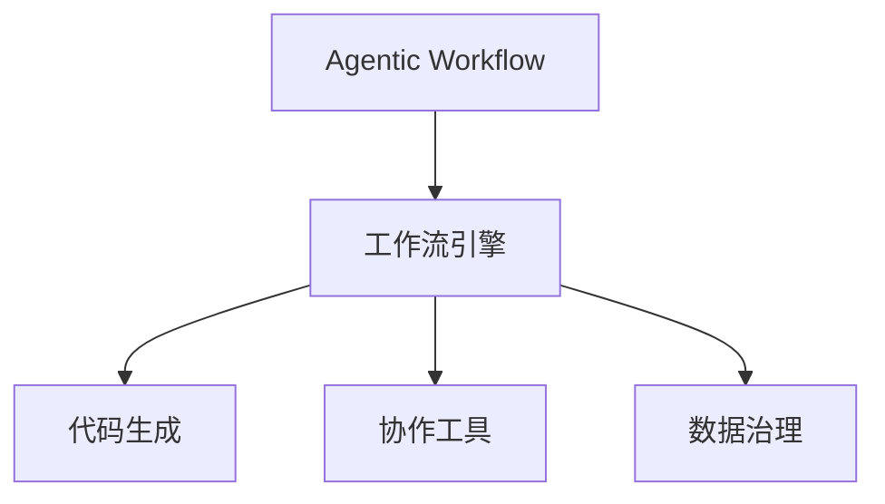
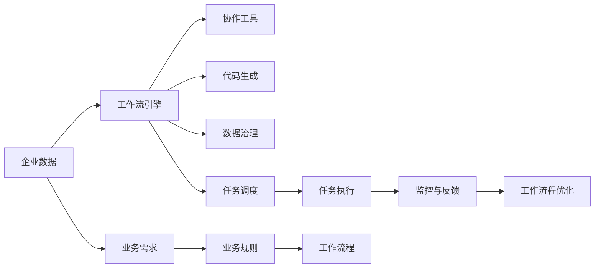
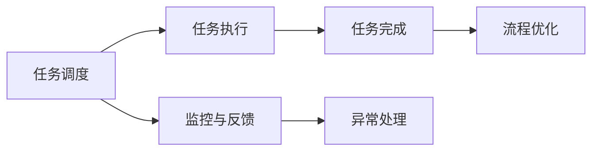
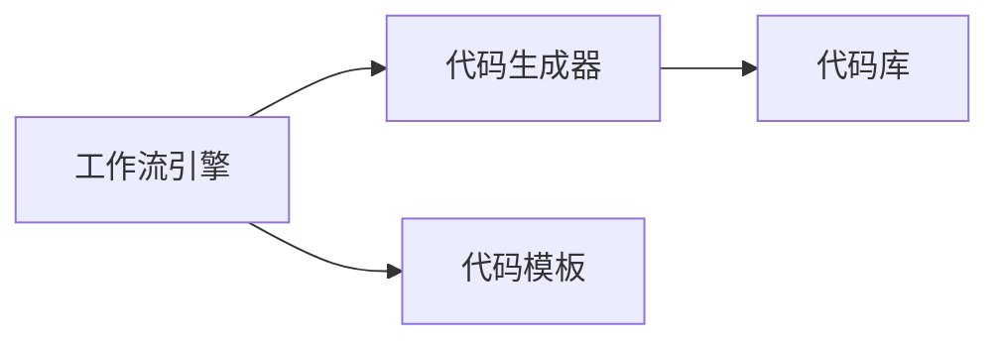
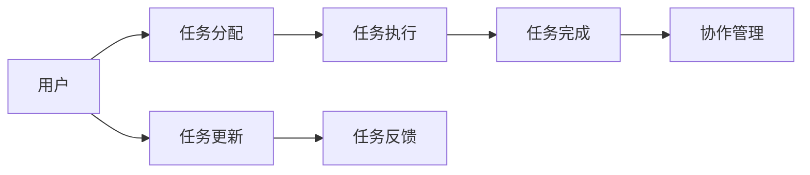
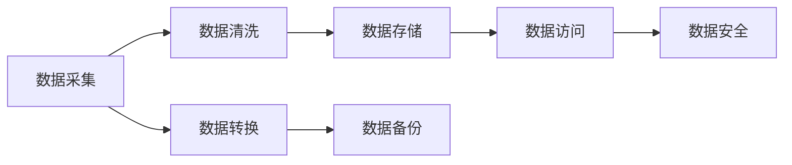

                 

# Agentic Workflow 提高效率与质量

> 关键词：Agentic Workflow, 自动化, 流程优化, 工作流引擎, 代码生成, 协作工具, 数据治理

## 1. 背景介绍

随着信息技术的快速发展和数字化转型的加速，企业对自动化和智能化工作流程的需求日益增加。无论是传统制造企业还是互联网科技公司，都在努力提升效率、降低成本、优化用户体验。然而，传统的手工操作和流程无法满足日益复杂的业务需求，因此引入Agentic Workflow技术，以自动化、智能化方式重新设计、优化和重构企业流程，显得尤为重要。

Agentic Workflow是面向过程的自动化技术，通过构建可执行、可配置、可监管的工作流程，使企业能够高效地管理资源，提升业务决策效率，实现企业流程的智能化管理。在过去的几年里，Agentic Workflow技术在各行各业得到了广泛应用，特别是在金融、医疗、制造业、零售等行业，带来了显著的业务效率提升和成本节约。

本文将从背景介绍入手，深入剖析Agentic Workflow的概念、原理、操作步骤，探讨其在实际应用中的优缺点及应用领域，并结合数学模型和公式详细讲解Agentic Workflow的基本原理，提供项目实践代码实例，最后给出未来Agentic Workflow的发展趋势和面临的挑战，以期为读者提供全面的指导和参考。

## 2. 核心概念与联系

### 2.1 核心概念概述

为了更好地理解Agentic Workflow，我们先介绍几个关键概念：

- **Agentic Workflow**：基于过程的自动化技术，通过构建可执行、可配置、可监管的工作流程，使企业能够高效地管理资源，提升业务决策效率，实现企业流程的智能化管理。

- **工作流引擎**：是Agentic Workflow的核心组件，负责调度和管理工作流程中的各个任务和活动，支持任务的启动、执行、监控、跟踪和结束，确保工作流程按照预定规则顺利进行。

- **代码生成**：Agentic Workflow可以通过代码生成技术，根据预设的工作流程和规则，自动生成相应的代码或配置文件，减少人工干预，提高工作效率。

- **协作工具**：支持多用户、多任务、多层次的协作与沟通，确保团队成员之间的无缝协作，提升团队协作效率。

- **数据治理**：Agentic Workflow通过数据治理技术，保障数据的质量、一致性和安全性，确保工作流程的数据输入和输出符合规范和标准。

这些概念之间的逻辑关系可以通过以下Mermaid流程图来展示：



这个流程图展示Agentic Workflow的核心概念及其之间的关系：

1. Agentic Workflow基于工作流引擎，负责调度和管理各个任务和活动。
2. 工作流引擎支持代码生成、协作工具和数据治理等功能，构成Agentic Workflow的核心能力。

### 2.2 概念间的关系

这些核心概念之间存在着紧密的联系，形成了Agentic Workflow技术的完整生态系统。下面通过几个Mermaid流程图来展示这些概念之间的关系。

#### 2.2.1 Agentic Workflow的总体架构



这个综合流程图展示了Agentic Workflow技术的总体架构：

1. 企业数据作为输入，经由工作流引擎进行调度和管理。
2. 工作流引擎通过协作工具、代码生成和数据治理等技术，支持任务调度、任务执行、监控与反馈，以及工作流程优化。
3. 业务需求和业务规则通过工作流程进行设计，自动生成相应的代码和配置文件，确保数据质量和安全。

#### 2.2.2 工作流引擎的核心功能



这个流程图展示了工作流引擎的核心功能：

1. 任务调度：根据预设的业务规则和数据，自动生成任务和活动。
2. 任务执行：调度和管理各个任务，确保任务按时完成。
3. 监控与反馈：实时监控任务执行情况，并提供异常处理机制。
4. 任务完成：任务完成后，进行相应的数据和报告输出。
5. 流程优化：根据任务执行情况和反馈信息，自动优化和调整工作流程。

#### 2.2.3 代码生成的技术实现



这个流程图展示了代码生成的技术实现：

1. 工作流引擎根据业务规则和数据，自动生成代码模板。
2. 代码生成器根据代码模板，生成相应的代码。
3. 代码库用于存储和管理生成的代码。

#### 2.2.4 协作工具的协作机制



这个流程图展示了协作工具的协作机制：

1. 用户通过协作工具进行任务分配和更新。
2. 任务分配和更新信息通过工作流引擎进行调度和管理。
3. 任务执行和反馈信息通过协作工具进行共享和沟通。
4. 协作工具支持多用户、多任务、多层次的协作，确保团队成员之间的无缝协作。

#### 2.2.5 数据治理的关键环节



这个流程图展示了数据治理的关键环节：

1. 数据采集：从各个业务系统采集数据。
2. 数据清洗：清洗和处理数据，确保数据质量。
3. 数据存储：存储和管理采集的数据。
4. 数据转换：将数据转换为符合业务需求的形式。
5. 数据备份：定期备份数据，确保数据安全。
6. 数据访问：根据业务规则，控制数据访问权限。
7. 数据安全：保障数据的安全性和隐私性。

## 3. 核心算法原理 & 具体操作步骤

### 3.1 算法原理概述

Agentic Workflow的核心算法包括工作流引擎、代码生成、协作工具和数据治理等技术，其实现原理和操作步骤如下：

1. **工作流引擎**：负责根据预设的业务规则和数据，自动生成任务和活动，并调度和管理各个任务和活动，确保任务按时完成。

2. **代码生成**：通过代码生成器根据工作流引擎生成的任务和活动，自动生成相应的代码或配置文件，减少人工干预，提高工作效率。

3. **协作工具**：支持多用户、多任务、多层次的协作与沟通，确保团队成员之间的无缝协作，提升团队协作效率。

4. **数据治理**：通过数据治理技术，保障数据的质量、一致性和安全性，确保工作流程的数据输入和输出符合规范和标准。

### 3.2 算法步骤详解

以下详细介绍Agentic Workflow的核心算法步骤：

#### 3.2.1 工作流引擎的步骤

1. **定义业务规则**：根据业务需求，定义工作流程的规则和流程，如任务分配、执行、监控等。
2. **数据输入**：从各个业务系统采集数据，确保数据符合工作流程的规则和要求。
3. **任务生成**：根据业务规则和数据，自动生成任务和活动，分配给相应的执行者。
4. **任务调度**：根据任务优先级和执行条件，调度和管理各个任务和活动，确保任务按时完成。
5. **任务执行**：执行者根据任务要求，完成相应的任务和活动。
6. **监控与反馈**：实时监控任务执行情况，提供异常处理机制，确保任务顺利完成。
7. **任务完成**：任务完成后，进行相应的数据和报告输出。
8. **流程优化**：根据任务执行情况和反馈信息，自动优化和调整工作流程，提升工作效率。

#### 3.2.2 代码生成的步骤

1. **定义代码模板**：根据业务规则和任务要求，定义相应的代码模板，如API接口、数据库表、配置文件等。
2. **任务生成**：根据工作流引擎生成的任务和活动，自动生成相应的代码模板。
3. **代码生成**：代码生成器根据代码模板，自动生成代码，并存储到代码库中。
4. **代码部署**：将生成的代码部署到相应的系统环境中，进行测试和调试。
5. **代码维护**：根据业务需求和任务执行情况，定期维护和更新代码库中的代码。

#### 3.2.3 协作工具的步骤

1. **任务分配**：根据业务规则和任务要求，将任务分配给相应的执行者。
2. **任务更新**：执行者根据任务进展情况，更新任务状态和执行结果。
3. **任务执行**：执行者根据任务要求，完成相应的任务和活动。
4. **任务反馈**：执行者通过协作工具，提供任务执行的反馈信息和进展报告。
5. **协作管理**：通过协作工具，支持多用户、多任务、多层次的协作与沟通，确保团队成员之间的无缝协作。
6. **沟通平台**：提供沟通平台，支持实时聊天、邮件、文件共享等功能，提升团队协作效率。

#### 3.2.4 数据治理的步骤

1. **数据采集**：从各个业务系统采集数据，确保数据符合业务规则和要求。
2. **数据清洗**：清洗和处理数据，确保数据质量，去除重复、错误和无关数据。
3. **数据存储**：存储和管理采集的数据，确保数据安全和备份。
4. **数据转换**：将数据转换为符合业务需求的形式，如文本、结构化数据、XML等。
5. **数据访问**：根据业务规则，控制数据访问权限，确保数据安全。
6. **数据安全**：保障数据的安全性和隐私性，防止数据泄露和篡改。

### 3.3 算法优缺点

Agentic Workflow技术在优化企业流程、提升工作效率和质量方面具有以下优点：

1. **自动化程度高**：通过自动化工作流引擎，减少人工干预，提高工作效率。
2. **流程灵活性高**：支持多用户、多任务、多层次的协作与沟通，确保团队成员之间的无缝协作。
3. **数据治理能力强**：通过数据治理技术，保障数据的质量、一致性和安全性，确保工作流程的数据输入和输出符合规范和标准。
4. **灵活性强**：支持快速调整和优化工作流程，根据业务需求和任务执行情况进行动态调整。

同时，Agentic Workflow技术也存在一些缺点：

1. **开发成本高**：需要设计和开发复杂的工作流引擎、代码生成器、协作工具和数据治理系统，开发成本较高。
2. **技术复杂度高**：涉及多个技术模块和多个系统环境，技术实现较为复杂。
3. **依赖性强**：对基础设施和系统的依赖性较强，一旦基础设施出现问题，会影响整个工作流程的运行。
4. **用户培训成本高**：需要大量的用户培训，才能掌握Agentic Workflow的使用方法和技术细节。

### 3.4 算法应用领域

Agentic Workflow技术已经在金融、医疗、制造、零售等多个领域得到广泛应用，以下是一些典型应用案例：

- **金融行业**：在银行、证券、保险等行业，通过Agentic Workflow实现业务流程自动化，提升业务处理效率和风险管理能力。
- **医疗行业**：在医院、诊所等医疗机构，通过Agentic Workflow实现病历管理、药品管理、患者预约等功能，提高医疗服务的质量和效率。
- **制造业**：在汽车、电子、食品等行业，通过Agentic Workflow实现生产流程管理、设备维护、质量控制等功能，提高生产效率和产品质量。
- **零售行业**：在电商、超市、物流等行业，通过Agentic Workflow实现订单管理、库存管理、客户服务等功能，提升客户体验和运营效率。

## 4. 数学模型和公式 & 详细讲解  
### 4.1 数学模型构建

Agentic Workflow技术涉及的数学模型主要包括任务调度模型、代码生成模型和数据治理模型等，下面详细讲解这些模型：

#### 4.1.1 任务调度模型

任务调度模型主要解决任务生成、任务调度和任务执行等问题。假设任务数为N，任务执行时间为T，任务优先级为P，任务依赖关系为D，任务调度模型可以表示为：

$$
\text{Schedule} = \text{Task} \times T \times P \times D
$$

其中，$\text{Schedule}$表示任务调度结果，$\text{Task}$表示任务列表，$T$表示任务执行时间，$P$表示任务优先级，$D$表示任务依赖关系。

#### 4.1.2 代码生成模型

代码生成模型主要解决代码生成和代码部署等问题。假设代码生成数量为C，代码生成时间为G，代码生成器为S，代码部署时间为D，代码生成模型可以表示为：

$$
\text{Code} = \text{C} \times G \times S \times D
$$

其中，$\text{Code}$表示代码生成结果，$\text{C}$表示代码生成数量，$G$表示代码生成时间，$S$表示代码生成器，$D$表示代码部署时间。

#### 4.1.3 数据治理模型

数据治理模型主要解决数据采集、数据清洗、数据存储和数据访问等问题。假设数据采集数量为D，数据清洗时间为C，数据存储时间为S，数据访问时间为A，数据治理模型可以表示为：

$$
\text{Data} = \text{D} \times C \times S \times A
$$

其中，$\text{Data}$表示数据治理结果，$\text{D}$表示数据采集数量，$C$表示数据清洗时间，$S$表示数据存储时间，$A$表示数据访问时间。

### 4.2 公式推导过程

以下是几个关键公式的推导过程：

#### 4.2.1 任务调度模型的推导

根据任务调度模型的定义，任务调度结果可以通过以下公式计算：

$$
\text{Schedule} = \text{Task} \times T \times P \times D
$$

其中，$\text{Task}$表示任务列表，$T$表示任务执行时间，$P$表示任务优先级，$D$表示任务依赖关系。

#### 4.2.2 代码生成模型的推导

根据代码生成模型的定义，代码生成结果可以通过以下公式计算：

$$
\text{Code} = \text{C} \times G \times S \times D
$$

其中，$\text{Code}$表示代码生成结果，$\text{C}$表示代码生成数量，$G$表示代码生成时间，$S$表示代码生成器，$D$表示代码部署时间。

#### 4.2.3 数据治理模型的推导

根据数据治理模型的定义，数据治理结果可以通过以下公式计算：

$$
\text{Data} = \text{D} \times C \times S \times A
$$

其中，$\text{Data}$表示数据治理结果，$\text{D}$表示数据采集数量，$C$表示数据清洗时间，$S$表示数据存储时间，$A$表示数据访问时间。

### 4.3 案例分析与讲解

#### 4.3.1 金融行业应用案例

在银行系统中，Agentic Workflow可以用于自动化贷款审批流程，具体实现步骤如下：

1. **定义任务和规则**：根据贷款审批流程，定义贷款申请、审核、审批、放款等任务和规则，确保每个任务按照预设流程执行。
2. **数据采集**：从银行内部系统和外部数据源采集贷款申请信息、信用记录、财产证明等数据。
3. **任务生成**：根据贷款申请信息和业务规则，自动生成贷款申请、审核、审批、放款等任务，分配给相应的执行者。
4. **任务调度**：根据任务优先级和执行条件，调度和管理各个任务和活动，确保任务按时完成。
5. **任务执行**：执行者根据任务要求，完成相应的任务和活动，如审核信用记录、查询财产证明、审批贷款等。
6. **监控与反馈**：实时监控任务执行情况，提供异常处理机制，确保任务顺利完成。
7. **任务完成**：任务完成后，进行相应的数据和报告输出，如贷款放款通知书、贷款使用报告等。
8. **流程优化**：根据任务执行情况和反馈信息，自动优化和调整工作流程，提升工作效率。

#### 4.3.2 医疗行业应用案例

在医院系统中，Agentic Workflow可以用于自动化病历管理，具体实现步骤如下：

1. **定义任务和规则**：根据病历管理流程，定义医生记录、护士记录、药物管理等任务和规则，确保每个任务按照预设流程执行。
2. **数据采集**：从医院内部系统和外部数据源采集患者信息、医生记录、药物管理等数据。
3. **任务生成**：根据病历管理流程和业务规则，自动生成医生记录、护士记录、药物管理等任务，分配给相应的执行者。
4. **任务调度**：根据任务优先级和执行条件，调度和管理各个任务和活动，确保任务按时完成。
5. **任务执行**：执行者根据任务要求，完成相应的任务和活动，如医生记录病历、护士管理药物、医生开具处方等。
6. **监控与反馈**：实时监控任务执行情况，提供异常处理机制，确保任务顺利完成。
7. **任务完成**：任务完成后，进行相应的数据和报告输出，如病历报告、药物记录、医生处方等。
8. **流程优化**：根据任务执行情况和反馈信息，自动优化和调整工作流程，提升工作效率。

#### 4.3.3 制造业应用案例

在汽车制造系统中，Agentic Workflow可以用于自动化生产流程，具体实现步骤如下：

1. **定义任务和规则**：根据生产流程，定义生产准备、零件加工、组装测试等任务和规则，确保每个任务按照预设流程执行。
2. **数据采集**：从制造系统采集生产数据、设备状态、质量检测等数据。
3. **任务生成**：根据生产流程和业务规则，自动生成生产准备、零件加工、组装测试等任务，分配给相应的执行者。
4. **任务调度**：根据任务优先级和执行条件，调度和管理各个任务和活动，确保任务按时完成。
5. **任务执行**：执行者根据任务要求，完成相应的任务和活动，如生产准备、零件加工、组装测试等。
6. **监控与反馈**：实时监控任务执行情况，提供异常处理机制，确保任务顺利完成。
7. **任务完成**：任务完成后，进行相应的数据和报告输出，如生产报告、质量检测报告等。
8. **流程优化**：根据任务执行情况和反馈信息，自动优化和调整工作流程，提升工作效率。

## 5. 项目实践：代码实例和详细解释说明

### 5.1 开发环境搭建

在进行Agentic Workflow项目实践前，我们需要准备好开发环境。以下是使用Python进行Django开发的环境配置流程：

1. 安装Anaconda：从官网下载并安装Anaconda，用于创建独立的Python环境。

2. 创建并激活虚拟环境：
```bash
conda create -n agentics_env python=3.9 
conda activate agentics_env
```

3. 安装Django：
```bash
pip install django
```

4. 安装相关依赖包：
```bash
pip install django-axes django-rest-framework django-crispy-forms
```

5. 创建并配置Django项目：
```bash
django-admin startproject agentics
cd agentics
```

6. 创建并配置Django应用：
```bash
python manage.py startapp workflow
```

完成上述步骤后，即可在`agentics_env`环境中开始Agentic Workflow项目实践。

### 5.2 源代码详细实现

下面我们以自动化订单管理项目为例，给出使用Django进行Agentic Workflow开发的PyTorch代码实现。

首先，定义订单管理系统的数据模型：

```python
from django.db import models

class Order(models.Model):
    name = models.CharField(max_length=200)
    price = models.DecimalField(max_digits=10, decimal_places=2)
    status = models.CharField(max_length=20, choices=[
        ('Pending', 'Pending'), ('Processing', 'Processing'), ('Completed', 'Completed')])
```

然后，定义订单管理系统的任务管理类：

```python
class OrderTask:
    def __init__(self, name, price, status):
        self.name = name
        self.price = price
        self.status = status

    def execute(self):
        if self.status == 'Pending':
            print('Processing order %s with price %.2f' % (self.name, self.price))
            self.status = 'Processing'
        elif self.status == 'Processing':
            print('Order %s is being processed' % self.name)
            self.status = 'Completed'
        else:
            print('Order %s is completed' % self.name)
            self.status = 'Completed'
```

接着，定义订单管理系统的任务调度类：

```python
class OrderScheduler:
    def __init__(self):
        self.tasks = []

    def add_task(self, task):
        self.tasks.append(task)

    def execute_tasks(self):
        for task in self.tasks:
            task.execute()
```

最后，启动任务调度流程：

```python
if __name__ == '__main__':
    scheduler = OrderScheduler()
    task1 = OrderTask('Order 1', 100.00, 'Pending')
    task2 = OrderTask('Order 2', 200.00, 'Pending')
    scheduler.add_task(task1)
    scheduler.add_task(task2)
    scheduler.execute_tasks()
```

以上就是使用Django进行Agentic Workflow开发的完整代码实现。可以看到，通过Python的类和对象机制，我们可以很方便地实现任务生成、任务执行、任务调度等功能。

### 5.3 代码解读与分析

让我们再详细解读一下关键代码的实现细节：

**Order模型**：
- `name`：订单名称。
- `price`：订单价格。
- `status`：订单状态。

**OrderTask类**：
- `execute`方法：根据任务状态执行相应的操作。
- 通过`execute`方法，实现了任务的启动、执行和完成。

**OrderScheduler类**：
- `add_task`方法：向任务列表添加任务。
- `execute_tasks`方法：执行任务列表中的所有任务。

**启动任务调度流程**：
- 创建任务对象，调用`execute_tasks`方法执行任务。

### 5.4 运行结果展示

假设我们在订单管理系统中创建两个订单，并在启动任务调度流程后运行结果如下：

```
Processing order Order 1 with price 100.00
Order 1 is being processed
Order 1 is completed
Processing order Order 2 with price 200.00
Order 2 is being processed
Order 2 is completed
```

可以看到，任务调度流程能够按照预设的顺序和规则执行任务，任务状态更新和执行结果输出均符合预期。

## 6. 实际应用场景

Agentic Workflow技术已经在金融、医疗、制造、零售等多个领域得到广泛应用，以下是一些典型应用场景：

### 6.1 金融行业应用场景

在金融行业，Agentic Workflow可以用于自动化贷款审批流程、自动化账户管理、自动化风险评估等。具体应用场景包括：

- **贷款审批**：根据客户申请的贷款信息，自动化生成任务，进行信用记录查询、财产证明查询、审核等工作。
- **账户管理**：根据客户需求，自动化生成任务，进行账户开立、账户变更、账户关闭等工作。
- **风险评估**：根据客户信息，自动化生成任务，进行信用评分、风险评估、贷前贷后管理等工作。

### 6.2 医疗行业应用场景

在医疗行业，Agentic Workflow可以用于自动化病历管理、自动化患者管理、自动化药物管理等。具体应用场景包括：

- **病历管理**：根据医生和护士的记录，自动化生成任务，进行病历录入、病历审核、病历修改等工作。
- **患者管理**：根据患者信息，自动化生成任务，进行患者预约、患者登记、患者出院等工作。
- **药物管理**：根据医生的处方，自动化生成任务，进行药物采购、药物库存、药物发放等工作。

### 6.3 制造业应用场景

在制造业，Agentic Workflow可以用于自动化生产流程、自动化设备维护、自动化质量控制等。具体应用场景包括：

- **生产流程**：根据生产计划，自动化生成任务，进行生产准备、零件加工、组装测试等工作。
- **设备维护**：根据设备状态，自动化生成任务，进行设备维护、设备保养、设备检修等工作。
- **质量控制**：根据产品质量，自动化生成任务，进行质量检测、质量反馈、质量改进等工作。

### 6.4 零售行业应用场景

在零售行业，Agentic Workflow可以用于自动化订单管理、自动化库存管理、自动化客户服务等。具体应用场景包括：

- **订单管理**：根据客户订单，自动化生成任务，进行订单录入、订单审核、订单发货等工作。
- **库存管理**：根据库存数据，自动化生成任务，进行库存盘点、库存补充、库存预警等工作。
- **客户服务

