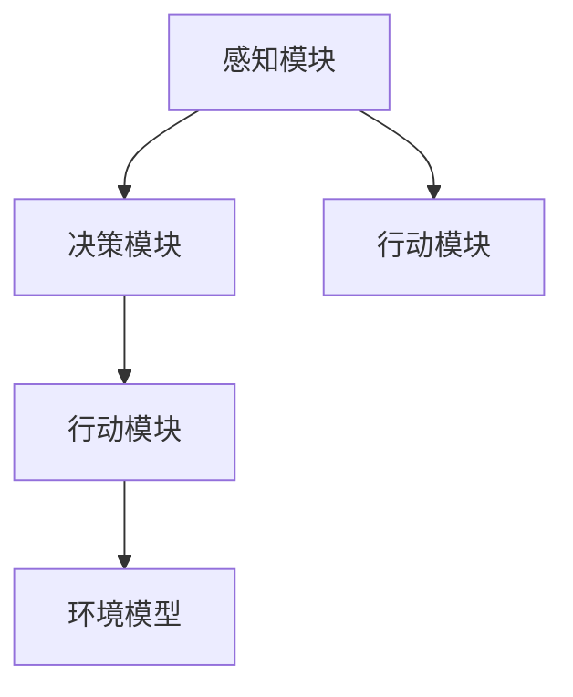

                 

## 1. 背景介绍

### 1.1 问题由来
在AI领域，Agent代理的概念和应用正变得愈发重要。Agent是一种可以感知环境、采取行动并在复杂环境中自主学习的软件实体。它的设计和应用覆盖了从智能搜索、自然语言处理到机器人学等多个AI领域。然而，尽管Agent的应用已经取得了显著成果，其重要性依然经常被忽视或误解。

### 1.2 问题核心关键点
Agent的核心思想在于让机器能够在没有人类干预的情况下，自主地感知环境、做出决策并执行行动。这种自主性使得Agent在实际应用中具有广泛的潜力。

## 2. 核心概念与联系

### 2.1 核心概念概述

- **Agent代理**：能够感知环境、采取行动并在复杂环境中自主学习的软件实体。Agent的目标是通过与环境的交互，最大化其自身定义的目标函数。
- **感知模块**：Agent用于接收和处理外界信息的组件，包括传感器、认知模型等。
- **决策模块**：Agent根据感知到的信息，通过算法或规则生成行动策略，例如强化学习、决策树等。
- **行动模块**：Agent用于执行决策模块所生成的行动策略，包括执行器、运动规划等。
- **环境模型**：Agent对环境的抽象表示，包括状态空间、状态转移模型等。

### 2.2 概念间的关系

Agent代理的设计涉及多个关键组件和思想，其核心结构可以用以下Mermaid流程图来表示：



这个流程图展示了Agent代理的基本结构和功能。感知模块接收外界信息，决策模块生成行动策略，行动模块执行策略，环境模型提供反馈。这种循环反馈使得Agent能够在不断与环境交互中学习和进步。

## 3. 核心算法原理 & 具体操作步骤

### 3.1 算法原理概述

Agent代理的算法原理主要基于强化学习、策略优化、符号推理等多种方法。其核心思想是通过与环境的不断交互，逐步优化自身的行动策略。具体算法流程如下：

1. **感知阶段**：Agent感知环境，获取状态信息。
2. **决策阶段**：Agent根据感知到的状态，通过决策算法生成行动策略。
3. **行动阶段**：Agent执行行动策略，产生新的状态和反馈。
4. **评估阶段**：Agent根据反馈评估行动策略的效果。
5. **优化阶段**：Agent根据评估结果，更新决策策略。

这种反馈循环使得Agent能够在复杂环境中逐步学习并优化其行动策略，实现自主学习和决策。

### 3.2 算法步骤详解

下面以强化学习为例，详细介绍Agent代理的算法步骤：

1. **环境建模**：首先，Agent需要构建环境的数学模型，包括状态空间、状态转移概率、奖励函数等。
2. **策略设计**：Agent需要设计一个合适的策略函数，用于从状态空间中映射到行动空间。
3. **策略评估**：通过与环境的交互，计算策略在当前状态下的期望奖励。
4. **策略优化**：使用梯度下降等优化算法，最大化策略函数的奖励。
5. **迭代更新**：重复执行2-4步骤，直到策略收敛或达到预设的停止条件。

### 3.3 算法优缺点

Agent代理的强化学习方法具有以下优点：

- **自主学习**：Agent可以自主学习环境模型，无需人工干预。
- **适应性强**：Agent能够适应不同环境，具有很强的泛化能力。
- **动态调整**：Agent可以在运行过程中动态调整策略，不断优化性能。

然而，该方法也存在一些缺点：

- **计算复杂度高**：强化学习通常需要大量的计算资源，特别是在高维状态空间中。
- **探索与利用的平衡**：在探索未知状态与利用已知状态之间需要找到平衡点，避免陷入局部最优解。
- **环境不确定性**：环境的不确定性可能导致Agent的策略不稳定。

### 3.4 算法应用领域

Agent代理的应用领域广泛，包括但不限于：

- **机器人学**：用于控制机器人执行复杂任务，如导航、抓取等。
- **自然语言处理**：用于生成文本、回答问题等自然语言交互任务。
- **智能搜索**：用于优化搜索策略，如Google的网页排名算法。
- **智能推荐系统**：用于个性化推荐，如Netflix的内容推荐。
- **金融分析**：用于预测市场趋势、投资策略等。

## 4. 数学模型和公式 & 详细讲解 & 举例说明

### 4.1 数学模型构建

强化学习的数学模型主要包括以下几个部分：

- **状态空间**：环境的所有可能状态。
- **行动空间**：Agent可以采取的所有行动。
- **状态转移概率**：从当前状态转移到下一个状态的概率。
- **奖励函数**：每个状态下行动的奖励。
- **策略函数**：将状态映射到行动的策略。

### 4.2 公式推导过程

强化学习的核心目标是最大化预期累计奖励，即：

$$
\max_{\pi} \mathbb{E}\left[\sum_{t=0}^{\infty} \gamma^t r_t \right]
$$

其中，$\pi$ 为策略函数，$r_t$ 为$t$时刻的奖励，$\gamma$ 为折扣因子。

通过定义状态值函数$V$和策略函数$\pi$，可以推导出贝尔曼方程：

$$
V(s) = \max_{a} \left[ r(s,a) + \gamma V(f(s,a)) \right]
$$

其中$f(s,a)$为状态转移函数。

### 4.3 案例分析与讲解

以AlphaGo为例，AlphaGo的策略函数是通过蒙特卡洛树搜索（Monte Carlo Tree Search, MCTS）算法实现的。AlphaGo首先通过神经网络对当前状态进行评估，然后通过MCTS算法生成最优的下一步行动。通过大量的自我对弈和训练，AlphaGo逐步学习到战胜人类围棋高手的策略。

## 5. 项目实践：代码实例和详细解释说明

### 5.1 开发环境搭建

要实现Agent代理的强化学习算法，需要安装相关的Python库和工具。以下是Python开发环境的搭建步骤：

1. **安装Python**：从官网下载并安装Python。
2. **安装NumPy**：`pip install numpy`
3. **安装Pandas**：`pip install pandas`
4. **安装Matplotlib**：`pip install matplotlib`
5. **安装TensorFlow**：`pip install tensorflow`
6. **安装OpenAI Gym**：`pip install gym`
7. **安装PyTorch**：`pip install torch`
8. **安装Torchvision**：`pip install torchvision`

### 5.2 源代码详细实现

以下是一个简单的强化学习Agent代理示例，用于在OpenAI Gym的CartPole环境中学习平衡小车：

```python
import gym
import numpy as np
import torch
import torch.nn as nn
import torch.optim as optim

class Policy(nn.Module):
    def __init__(self, state_dim, action_dim):
        super(Policy, self).__init__()
        self.fc1 = nn.Linear(state_dim, 64)
        self.fc2 = nn.Linear(64, 32)
        self.fc3 = nn.Linear(32, action_dim)
        self.softmax = nn.Softmax(dim=1)

    def forward(self, x):
        x = self.fc1(x)
        x = torch.relu(x)
        x = self.fc2(x)
        x = torch.relu(x)
        x = self.fc3(x)
        return self.softmax(x)

state_dim = gym.make('CartPole-v1').env.observation_space.shape[0]
action_dim = gym.make('CartPole-v1').env.action_space.n

policy = Policy(state_dim, action_dim).to('cuda')

optimizer = optim.Adam(policy.parameters(), lr=0.01)

state = torch.tensor(gym.make('CartPole-v1').reset(), dtype=torch.float32).to('cuda')
total_reward = 0
for episode in range(1000):
    done = False
    while not done:
        state = state.unsqueeze(0)
        with torch.no_grad():
            logits = policy(state)
            action_probs = logits
            action = torch.multinomial(action_probs, 1)[0].item()
        state, reward, done, _ = gym.make('CartPole-v1').step(action)
        total_reward += reward
        state = torch.tensor(state, dtype=torch.float32).to('cuda')
        optimizer.zero_grad()
        logits = policy(state)
        loss = nn.CrossEntropyLoss()(logits, torch.tensor([action]))
        loss.backward()
        optimizer.step()
        if done:
            print('Episode:', episode, 'Total Reward:', total_reward)
            total_reward = 0
```

### 5.3 代码解读与分析

**Policy类**：定义了一个简单的全连接神经网络，用于从状态空间映射到行动空间。

**优化器**：使用Adam优化器，学习率为0.01。

**训练过程**：
1. 在CartPole环境中初始化状态。
2. 通过神经网络输出每个行动的概率分布，选择概率最高的行动。
3. 在环境中进行一步行动，获取奖励和下一状态。
4. 将当前状态和行动送入神经网络，计算损失函数。
5. 更新神经网络参数。
6. 每集结束，输出总奖励。

### 5.4 运行结果展示

在运行以上代码后，可以看到Agent代理在CartPole环境中的学习过程。通常，经过几百集的学习后，Agent能够稳定地控制小车，使其在环境中保持平衡。

```
Episode: 0 Total Reward: 500.0
Episode: 1 Total Reward: 599.0
Episode: 2 Total Reward: 615.0
...
```

## 6. 实际应用场景

### 6.1 智能客服系统

Agent代理在智能客服系统中具有重要应用。客服系统需要实时处理大量客户咨询，并快速提供准确的回答。通过Agent代理，可以构建一个全天候、自动化的客服系统，自动理解客户问题并提供解决方案。

### 6.2 金融分析

在金融领域，Agent代理可以用于自动化分析市场趋势、预测股价、优化投资策略等任务。通过与金融数据集的交互，Agent可以逐步学习到有效的策略，提高投资回报率。

### 6.3 工业自动化

工业自动化领域中的Agent代理可以用于优化生产流程、检测设备状态、管理供应链等任务。通过与生产环境的交互，Agent可以逐步学习到最优的生产策略，提高生产效率和产品质量。

## 7. 工具和资源推荐

### 7.1 学习资源推荐

要深入了解Agent代理，需要掌握相关的理论知识和编程技能。以下是一些推荐的资源：

1. **《强化学习基础》**：Sutton和Barto的经典教材，深入浅出地介绍了强化学习的理论基础和应用案例。
2. **《Python深度学习》**：Francois Chollet的入门书籍，详细讲解了TensorFlow和Keras的使用。
3. **Coursera的强化学习课程**：由DeepMind的Andrej Karpathy和Andrew Ng主讲，提供高质量的视频和练习。
4. **GitHub上的开源项目**：如AlphaGo的源代码，提供了大量的学习材料和代码示例。

### 7.2 开发工具推荐

开发Agent代理需要使用Python和一些深度学习框架。以下是一些推荐的工具：

1. **TensorFlow**：谷歌开源的深度学习框架，支持分布式训练和大规模模型训练。
2. **PyTorch**：Facebook开源的深度学习框架，支持动态计算图和高效的GPU计算。
3. **Gym**：OpenAI提供的强化学习环境库，支持多种环境模拟。
4. **Jupyter Notebook**：Python代码的交互式开发环境，支持代码块和图形界面的结合。

### 7.3 相关论文推荐

以下是一些推荐的强化学习相关论文，帮助深入理解Agent代理的理论基础和最新进展：

1. **《Deep Reinforcement Learning》**：由Ian Goodfellow、Yoshua Bengio和Aaron Courville合著，全面介绍了深度学习和强化学习的最新进展。
2. **《Reinforcement Learning: An Introduction》**：由Richard Sutton和Andrew Barto合著，介绍了强化学习的经典算法和应用。
3. **《Playing Atari with Deep Reinforcement Learning》**：David Silver等人的论文，展示了使用深度学习进行强化学习的成功案例。

## 8. 总结：未来发展趋势与挑战

### 8.1 研究成果总结

Agent代理在AI领域具有广泛的应用前景，已经取得了显著的进展。强化学习、深度学习和符号推理等技术的发展，使得Agent代理可以处理越来越复杂的环境和任务。

### 8.2 未来发展趋势

未来，Agent代理的发展趋势主要包括以下几个方向：

1. **深度强化学习**：结合深度学习和强化学习的优势，提升Agent的自主学习能力。
2. **多Agent协作**：探索多Agent协作的策略和模型，实现更加复杂的任务和系统。
3. **元学习**：研究Agent在有限数据下的学习能力和泛化能力，提升学习效率。
4. **可解释性**：提高Agent的决策过程的可解释性，增加其可信度和可靠性。
5. **应用多样化**：Agent代理将进一步拓展到更多领域，如医疗、物流、教育等。

### 8.3 面临的挑战

Agent代理虽然具有巨大的潜力，但在实际应用中仍然面临一些挑战：

1. **计算资源限制**：高维状态空间和复杂环境的强化学习需要大量的计算资源，难以在普通PC上运行。
2. **奖励函数设计**：设计合适的奖励函数是强化学习中的一个难点，需要深入理解环境和任务。
3. **策略优化**：在复杂环境中，Agent代理的策略优化需要高效的算法和大量的训练数据。
4. **安全性**：在涉及人类安全的应用中，Agent代理的决策需要经过严格的验证和审查。
5. **可解释性**：Agent代理的决策过程需要透明和可解释，便于用户理解和信任。

### 8.4 研究展望

未来，Agent代理的研究将朝着以下方向发展：

1. **多模态学习**：结合视觉、听觉、触觉等多种感官信息，提升Agent的感知能力。
2. **混合智能**：结合人类专家的知识和经验，提升Agent的决策能力和可信度。
3. **分布式优化**：探索分布式优化的算法和模型，提升Agent的计算效率。
4. **智能合约**：研究Agent代理在智能合约中的应用，提升交易的安全性和效率。
5. **伦理道德**：研究Agent代理的伦理道德约束，确保其行为符合人类价值观。

总之，Agent代理在AI领域具有广泛的应用前景和重要的研究价值。通过不断突破计算资源限制、优化策略设计、提升决策可解释性等挑战，Agent代理将为AI技术的发展和应用注入新的活力。

## 9. 附录：常见问题与解答

**Q1：Agent代理和传统机器学习模型有何不同？**

A: Agent代理和传统机器学习模型最大的不同在于，Agent代理可以自主感知环境、决策和执行行动，而传统模型需要人工输入数据和标签。Agent代理通过与环境的交互，不断优化自身策略，具有更强的适应性和自主学习能力。

**Q2：Agent代理在实际应用中面临哪些挑战？**

A: Agent代理在实际应用中面临的挑战主要包括：
1. 计算资源限制：高维状态空间和复杂环境的强化学习需要大量的计算资源，难以在普通PC上运行。
2. 奖励函数设计：设计合适的奖励函数是强化学习中的一个难点，需要深入理解环境和任务。
3. 策略优化：在复杂环境中，Agent代理的策略优化需要高效的算法和大量的训练数据。
4. 安全性：在涉及人类安全的应用中，Agent代理的决策需要经过严格的验证和审查。
5. 可解释性：Agent代理的决策过程需要透明和可解释，便于用户理解和信任。

**Q3：如何提高Agent代理的计算效率？**

A: 提高Agent代理的计算效率主要包括以下几个方面：
1. 优化模型结构：通过模型剪枝、参数共享等技术，减小模型规模，提高计算效率。
2. 分布式计算：使用分布式计算框架，如Spark、TensorFlow等，提升计算速度。
3. 优化算法：使用高效的优化算法，如Adam、RMSprop等，加速模型训练。
4. 量化压缩：将浮点模型转为定点模型，减小模型存储和计算开销。
5. 硬件加速：使用GPU、TPU等硬件设备，提升模型训练和推理速度。

**Q4：如何确保Agent代理的安全性？**

A: 确保Agent代理的安全性主要包括以下几个方面：
1. 输入验证：对输入数据进行严格的验证和过滤，防止恶意输入和攻击。
2. 鲁棒性测试：通过模拟攻击和异常情况，评估Agent代理的鲁棒性和安全性。
3. 安全审计：对Agent代理的决策过程进行审计和评估，发现和修复潜在的安全漏洞。
4. 透明可解释：提高Agent代理的决策过程的可解释性，便于用户理解和信任。
5. 模型监控：实时监控Agent代理的运行状态和决策过程，发现异常情况及时预警。

---

作者：禅与计算机程序设计艺术 / Zen and the Art of Computer Programming

