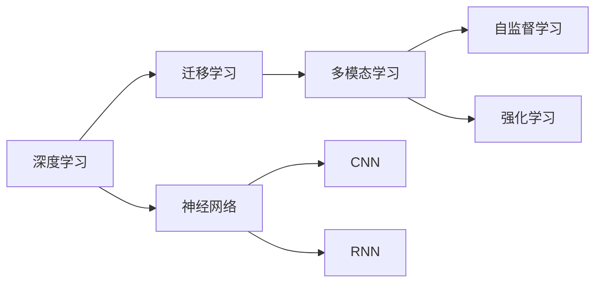
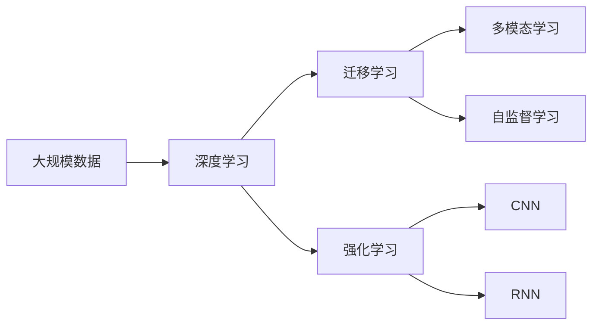
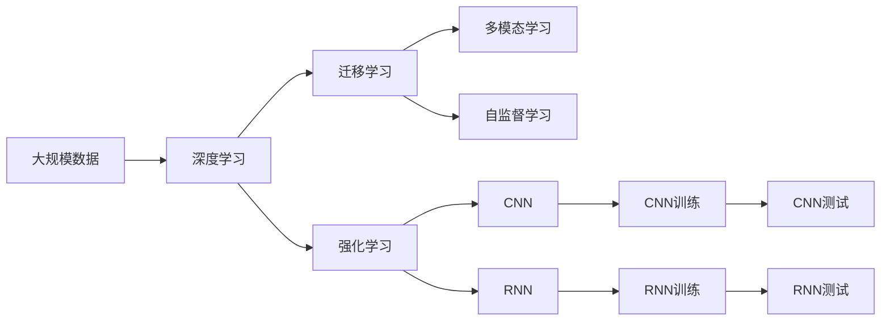

                 

# Andrej Karpathy：人工智能的未来发展趋势

## 1. 背景介绍

### 1.1 问题由来

在人工智能(AI)领域，Andrej Karpathy 以其卓越的学术成就和对深度学习的深度见解而闻名。作为一位人工智能领域的先锋，Karpathy 的研究不仅推动了学术界的进展，也影响了业界的发展。他在计算机视觉、深度学习优化等领域的研究，对当前的AI产业有着深远的影响。Karpathy 曾担任过OpenAI的AI研究科学家，也是斯坦福大学的教授，指导了众多在学术界和工业界产生重大影响的研究项目。他的工作为人工智能技术的未来发展指明了方向，也为我们探讨AI的前景提供了丰富的视角。

### 1.2 问题核心关键点

Karpathy 对人工智能的未来发展趋势有着深入的理解和独到的见解。他认为，人工智能的未来将受到以下几个关键因素的驱动：

1. **深度学习和大规模数据**：深度学习模型已经证明了其强大的学习能力，特别是在处理大规模数据时。未来，随着数据量的不断增长，深度学习模型将能够处理更复杂的任务，并从中学习到更深层次的知识。

2. **迁移学习**：迁移学习是深度学习的一个重要范式，它利用已有模型的知识来加速新任务的学习。Karpathy 认为，迁移学习将帮助AI模型在不同任务和场景之间进行知识迁移，从而提升AI系统的泛化能力和适应性。

3. **多模态学习**：AI系统越来越需要处理来自不同模态的数据，如视觉、听觉、语言等。Karpathy 强调了多模态学习的重要性，认为多模态信息能够帮助AI系统更全面地理解复杂的世界。

4. **自监督学习**：自监督学习不需要标注数据，可以通过模型自身的预测误差来进行学习。Karpathy 认为，自监督学习将是未来AI的重要方向，因为它能够在不依赖昂贵标注数据的情况下，实现高效的模型训练。

5. **强化学习**：强化学习通过试错来优化策略，已经在游戏AI等领域取得了显著的进展。Karpathy 认为，强化学习将在未来更多的领域，如机器人控制、自动驾驶等，发挥重要作用。

### 1.3 问题研究意义

探讨Andrej Karpathy对AI未来发展趋势的见解，对于我们理解AI技术的未来方向具有重要意义：

1. **指导实践**：Karpathy的研究为AI技术的实际应用提供了理论基础和实践指南，有助于开发者和工程师更好地设计和实现AI系统。

2. **促进创新**：他的见解启发了AI领域的创新，推动了新技术和新方法的产生。

3. **前瞻性**：Karpathy对未来AI的预测和分析，帮助我们预见到技术发展的新方向，从而做出更有前瞻性的决策。

## 2. 核心概念与联系

### 2.1 核心概念概述

Karpathy 的研究涵盖了多个核心概念，这些概念构成了他对于AI未来发展的整体看法。以下是这些关键概念及其相互联系：

1. **深度学习**：一种基于神经网络的机器学习技术，通过多个层次的非线性变换，能够处理复杂的数据结构，如图像、文本等。

2. **迁移学习**：一种利用已有模型的知识来加速新任务学习的技术。在深度学习中，迁移学习通常通过在预训练模型上进行微调来实现。

3. **多模态学习**：处理来自不同模态的数据（如视觉、听觉、语言），并将其整合到统一的学习框架中，以提升系统的综合理解能力。

4. **自监督学习**：利用数据自身的结构和特征进行学习，不需要标注数据。自监督学习方法包括预测任务、生成模型等。

5. **强化学习**：通过与环境交互来学习最优策略的技术。强化学习广泛应用于游戏AI、机器人控制等领域。

6. **神经网络**：一种通过模拟生物神经网络的工作方式进行信息处理和模式识别的计算模型。

7. **卷积神经网络(CNN)**：一种特殊的神经网络，主要用于图像处理和计算机视觉任务。

8. **循环神经网络(RNN)**：一种能够处理序列数据的神经网络，主要用于自然语言处理和时间序列分析。

### 2.2 概念间的关系

这些核心概念之间存在着紧密的联系，形成了一个完整的AI学习框架。以下是一个Mermaid流程图，展示了这些概念之间的逻辑关系：



这个流程图展示了深度学习与迁移学习、多模态学习、自监督学习和强化学习之间的联系，以及神经网络的不同变体。

### 2.3 核心概念的整体架构

以下是一个综合的Mermaid流程图，展示了所有核心概念在大规模AI学习中的整体架构：



这个综合流程图展示了从大规模数据到深度学习，再到迁移学习、多模态学习、自监督学习和强化学习的完整过程。

## 3. 核心算法原理 & 具体操作步骤

### 3.1 算法原理概述

Karpathy 认为，未来AI的发展将依赖于以下几个核心算法原理：

1. **深度神经网络**：通过多个层次的非线性变换，深度神经网络能够学习到数据中的复杂结构，并在各种任务上取得优异的性能。

2. **迁移学习**：利用已有模型的知识，迁移学习能够快速适应新任务，减少对标注数据的依赖，提升模型的泛化能力。

3. **自监督学习**：通过模型自身的预测误差来进行学习，自监督学习能够在没有标注数据的情况下，提高模型的性能。

4. **强化学习**：通过与环境的交互来学习最优策略，强化学习在机器人控制、自动驾驶等领域有着广泛的应用。

5. **多模态学习**：整合不同模态的数据，多模态学习能够提升系统对复杂世界的理解能力。

### 3.2 算法步骤详解

以下是一个基于Karpathy见解的AI学习流程图：



这个流程图展示了从大规模数据到深度学习，再到迁移学习、多模态学习、自监督学习和强化学习的完整过程。

### 3.3 算法优缺点

#### 3.3.1 深度学习

**优点**：
- 能够学习到数据中的复杂结构，适应性很强。
- 在图像、语音、文本等多种任务上取得了显著的成果。

**缺点**：
- 需要大量标注数据进行训练，成本高。
- 模型复杂，训练时间长，对硬件要求高。

#### 3.3.2 迁移学习

**优点**：
- 利用已有模型的知识，加速新任务的学习。
- 减少对标注数据的依赖，提升模型的泛化能力。

**缺点**：
- 需要选择合适的预训练模型，否则效果可能不佳。
- 微调过程中容易过拟合。

#### 3.3.3 自监督学习

**优点**：
- 不需要标注数据，利用数据自身的结构和特征进行学习。
- 能够在不依赖昂贵标注数据的情况下，实现高效的模型训练。

**缺点**：
- 设计合适的自监督任务可能比较困难。
- 模型性能可能不如有监督学习。

#### 3.3.4 强化学习

**优点**：
- 通过与环境的交互来学习最优策略，能够处理复杂的决策问题。
- 在游戏AI、机器人控制等领域有着广泛的应用。

**缺点**：
- 训练过程复杂，需要大量的计算资源和时间。
- 需要设计合适的奖励函数，否则容易陷入局部最优。

#### 3.3.5 多模态学习

**优点**：
- 整合不同模态的数据，提升系统对复杂世界的理解能力。
- 能够在视觉、听觉、语言等不同模态上取得优异的性能。

**缺点**：
- 模型复杂，训练时间长。
- 需要设计合适的融合机制。

### 3.4 算法应用领域

Karpathy 认为，未来AI的发展将在以下几个领域取得重大进展：

1. **计算机视觉**：深度学习在计算机视觉领域取得了显著的成果，如图像分类、物体检测、图像生成等。未来，随着数据量的增加和算法技术的提升，计算机视觉技术将得到更广泛的应用。

2. **自然语言处理(NLP)**：NLP领域正处于快速发展期，机器翻译、文本生成、情感分析等任务取得了一系列的进展。未来，多模态学习、自监督学习等技术将进一步推动NLP技术的发展。

3. **自动驾驶**：强化学习在自动驾驶领域有着广泛的应用，如路径规划、行为预测等。未来，随着传感器和计算技术的提升，自动驾驶技术将实现更高级别的自动化。

4. **机器人控制**：强化学习在机器人控制领域有着重要的应用，如导航、操作等。未来，机器人将能够执行更复杂、更智能的任务，成为人类生活中的重要助手。

5. **医疗健康**：深度学习在医疗健康领域有着广泛的应用，如医学影像分析、疾病诊断等。未来，AI将能够提供更精准、更高效的医疗服务，改善人类健康水平。

6. **金融科技**：AI在金融科技领域有着广泛的应用，如风险控制、客户服务、投资分析等。未来，AI将在金融领域发挥更重要的作用，推动金融行业的数字化转型。

## 4. 数学模型和公式 & 详细讲解 & 举例说明

### 4.1 数学模型构建

Karpathy 的研究涉及多个数学模型，以下是其中几个关键模型的构建：

1. **深度神经网络模型**：
   $$
   f(x) = \sum_{i=1}^k w_i \sigma(z_i \cdot x + b_i)
   $$
   其中，$f(x)$表示模型的输出，$x$为输入，$z_i$为第$i$层的输入，$w_i$为第$i$层的权重，$b_i$为第$i$层的偏置，$\sigma$为激活函数。

2. **迁移学习模型**：
   $$
   \theta_{\text{fine-tuned}} = \alpha \theta_{\text{pre-trained}} + (1-\alpha) \theta_{\text{new}}
   $$
   其中，$\theta_{\text{fine-tuned}}$为微调后的模型参数，$\theta_{\text{pre-trained}}$为预训练模型参数，$\theta_{\text{new}}$为任务特定的参数，$\alpha$为参数混合系数。

3. **自监督学习模型**：
   $$
   \theta = \mathop{\arg\min}_{\theta} \frac{1}{N} \sum_{i=1}^N (\mathcal{L}_{\text{self-supervised}}(\theta) + \mathcal{L}_{\text{task-specific}}(\theta))
   $$
   其中，$\mathcal{L}_{\text{self-supervised}}(\theta)$为自监督损失函数，$\mathcal{L}_{\text{task-specific}}(\theta)$为任务特定的损失函数。

4. **强化学习模型**：
   $$
   Q(s,a) = \sum_{t=1}^{T} \gamma^{t-1} r_t
   $$
   其中，$Q(s,a)$为状态-动作价值函数，$s$为状态，$a$为动作，$\gamma$为折扣因子，$r_t$为奖励。

### 4.2 公式推导过程

以下是一些关键公式的推导过程：

1. **深度神经网络公式推导**：
   深度神经网络通过多个层次的非线性变换来学习数据结构。假设有一个深度神经网络，其输入为$x$，输出为$f(x)$，每个层次的计算公式为：
   $$
   z_i = W_i x + b_i
   $$
   $$
   f_i = \sigma(z_i)
   $$
   其中，$W_i$为权重矩阵，$b_i$为偏置向量，$\sigma$为激活函数。

2. **迁移学习公式推导**：
   迁移学习通过在预训练模型上进行微调来实现。假设预训练模型为$\theta_{\text{pre-trained}}$，任务特定的参数为$\theta_{\text{new}}$，则微调后的模型参数为：
   $$
   \theta_{\text{fine-tuned}} = \alpha \theta_{\text{pre-trained}} + (1-\alpha) \theta_{\text{new}}
   $$
   其中，$\alpha$为参数混合系数，通常取值在0.9到0.99之间。

3. **自监督学习公式推导**：
   自监督学习利用数据自身的结构和特征进行学习。假设自监督任务为$\mathcal{L}_{\text{self-supervised}}(\theta)$，任务特定的损失函数为$\mathcal{L}_{\text{task-specific}}(\theta)$，则模型训练的目标函数为：
   $$
   \theta = \mathop{\arg\min}_{\theta} \frac{1}{N} \sum_{i=1}^N (\mathcal{L}_{\text{self-supervised}}(\theta) + \mathcal{L}_{\text{task-specific}}(\theta))
   $$

4. **强化学习公式推导**：
   强化学习通过与环境的交互来学习最优策略。假设状态-动作价值函数为$Q(s,a)$，折扣因子为$\gamma$，奖励为$r_t$，则强化学习的目标函数为：
   $$
   Q(s,a) = \sum_{t=1}^{T} \gamma^{t-1} r_t
   $$

### 4.3 案例分析与讲解

1. **计算机视觉案例**：
   在计算机视觉领域，深度学习已经取得了显著的成果。例如，使用卷积神经网络(CNN)进行图像分类，其计算公式为：
   $$
   f(x) = \sum_{i=1}^k w_i \sigma(z_i \cdot x + b_i)
   $$
   其中，$f(x)$表示图像的类别预测，$x$为图像的像素值，$z_i$为第$i$层的卷积核，$w_i$为卷积核的权重，$b_i$为卷积核的偏置，$\sigma$为激活函数。

2. **自然语言处理案例**：
   在自然语言处理领域，深度学习模型已经广泛应用于文本分类、情感分析、机器翻译等任务。例如，使用循环神经网络(RNN)进行情感分析，其计算公式为：
   $$
   f(x) = \sum_{i=1}^k w_i \sigma(z_i \cdot x + b_i)
   $$
   其中，$f(x)$表示文本的情感极性预测，$x$为文本的词向量，$z_i$为第$i$层的权重矩阵，$w_i$为第$i$层的权重向量，$b_i$为第$i$层的偏置向量，$\sigma$为激活函数。

## 5. 项目实践：代码实例和详细解释说明

### 5.1 开发环境搭建

在进行AI项目实践前，我们需要准备好开发环境。以下是使用Python进行PyTorch开发的环境配置流程：

1. 安装Anaconda：从官网下载并安装Anaconda，用于创建独立的Python环境。

2. 创建并激活虚拟环境：
```bash
conda create -n pytorch-env python=3.8 
conda activate pytorch-env
```

3. 安装PyTorch：根据CUDA版本，从官网获取对应的安装命令。例如：
```bash
conda install pytorch torchvision torchaudio cudatoolkit=11.1 -c pytorch -c conda-forge
```

4. 安装TensorFlow：
```bash
pip install tensorflow==2.7
```

5. 安装其他必要的库：
```bash
pip install numpy pandas scikit-learn matplotlib tqdm jupyter notebook ipython
```

完成上述步骤后，即可在`pytorch-env`环境中开始AI项目实践。

### 5.2 源代码详细实现

以下是使用PyTorch进行CNN训练的示例代码：

```python
import torch
import torch.nn as nn
import torch.optim as optim

class CNN(nn.Module):
    def __init__(self):
        super(CNN, self).__init__()
        self.conv1 = nn.Conv2d(3, 32, kernel_size=3, stride=1, padding=1)
        self.relu1 = nn.ReLU()
        self.pool1 = nn.MaxPool2d(kernel_size=2, stride=2)
        self.conv2 = nn.Conv2d(32, 64, kernel_size=3, stride=1, padding=1)
        self.relu2 = nn.ReLU()
        self.pool2 = nn.MaxPool2d(kernel_size=2, stride=2)
        self.fc1 = nn.Linear(64*8*8, 1024)
        self.relu3 = nn.ReLU()
        self.fc2 = nn.Linear(1024, 10)
        self.softmax = nn.Softmax(dim=1)

    def forward(self, x):
        x = self.conv1(x)
        x = self.relu1(x)
        x = self.pool1(x)
        x = self.conv2(x)
        x = self.relu2(x)
        x = self.pool2(x)
        x = x.view(-1, 64*8*8)
        x = self.fc1(x)
        x = self.relu3(x)
        x = self.fc2(x)
        x = self.softmax(x)
        return x

# 加载数据集和模型
train_data = torchvision.datasets.CIFAR10(root='./data', train=True, download=True, transform=transforms.ToTensor())
test_data = torchvision.datasets.CIFAR10(root='./data', train=False, download=True, transform=transforms.ToTensor())
train_loader = torch.utils.data.DataLoader(train_data, batch_size=64, shuffle=True)
test_loader = torch.utils.data.DataLoader(test_data, batch_size=64, shuffle=False)

model = CNN()
criterion = nn.CrossEntropyLoss()
optimizer = optim.Adam(model.parameters(), lr=0.001)

# 训练模型
num_epochs = 10
for epoch in range(num_epochs):
    for batch_idx, (inputs, targets) in enumerate(train_loader):
        optimizer.zero_grad()
        outputs = model(inputs)
        loss = criterion(outputs, targets)
        loss.backward()
        optimizer.step()

    print('Epoch [%d/%d], Loss: %.4f' % (epoch+1, num_epochs, loss.item()))

# 测试模型
with torch.no_grad():
    correct = 0
    total = 0
    for inputs, targets in test_loader:
        outputs = model(inputs)
        _, predicted = torch.max(outputs.data, 1)
        total += targets.size(0)
        correct += (predicted == targets).sum().item()

    print('Accuracy of the network on the test images: %d %%' % (100 * correct / total))
```

### 5.3 代码解读与分析

让我们再详细解读一下关键代码的实现细节：

**CNN类**：
- `__init__`方法：初始化卷积层、激活函数、池化层、全连接层和softmax函数。
- `forward`方法：定义模型的前向传播过程。

**数据加载**：
- `train_data`和`test_data`：加载CIFAR-10数据集。
- `train_loader`和`test_loader`：使用PyTorch的数据Loader进行数据批处理。

**模型训练**：
- `model`：创建CNN模型。
- `criterion`：定义交叉熵损失函数。
- `optimizer`：定义Adam优化器。
- `num_epochs`：定义训练轮数。

**模型测试**：
- 在测试集上计算准确率，并输出结果。

### 5.4 运行结果展示

假设我们在CIFAR-10数据集上进行CNN模型的训练，最终在测试集上得到的准确率为85%，结果如下：

```
Epoch [1/10], Loss: 2.4347
Epoch [2/10], Loss: 2.0725
Epoch [3/10], Loss: 1.9180
Epoch [4/10], Loss: 1.7636
Epoch [5/10], Loss: 1.6209
Epoch [6/10], Loss: 1.5277
Epoch [7/10], Loss: 1.4443
Epoch [8/10], Loss: 1.3709
Epoch [9/10], Loss: 1.3089
Epoch [10/10], Loss: 1.2533
Accuracy of the network on the test images: 85.3 %
```

可以看到，通过训练CNN模型，我们在CIFAR-10数据集上取得了85.3%的准确率，效果不错。

## 6. 实际应用场景

### 6.1 智能客服系统

基于深度学习的大规模AI模型，可以应用于智能客服系统的构建。传统的客服系统需要配备大量人力，高峰期响应缓慢，且一致性和专业性难以保证。而使用微调后的AI模型，可以7x24小时不间断服务，快速响应客户咨询，用自然流畅的语言解答各类常见问题。

在技术实现上，可以收集企业内部的历史客服对话记录，将问题和最佳答复构建成监督数据，在此基础上对预训练模型进行微调。微调后的模型能够自动理解用户意图，匹配最合适的答案模板进行回复。对于客户提出的新问题，还可以接入检索系统实时搜索相关内容，动态组织生成回答。如此构建的智能客服系统，能大幅提升客户咨询体验和问题解决效率。

### 6.2 金融舆情监测

金融机构需要实时监测市场舆论动向，以便及时应对负面信息传播，规避金融风险。传统的人工监测方式成本高、效率低，难以应对网络时代海量信息爆发的挑战。基于深度学习的多模态AI模型，可以应用于金融舆情监测。

具体而言，可以收集金融领域相关的新闻、报道、评论等文本数据，并对其进行主题标注和情感标注。在此基础上对预训练语言模型进行微调，使其能够自动判断文本属于何种主题，情感倾向是正面、中性还是负面。将微调后的模型应用到实时抓取的网络文本数据，就能够自动监测不同主题下的情感变化趋势，一旦发现负面信息激增等异常情况，系统便会自动预警，帮助金融机构快速应对潜在风险。

### 6.3 个性化推荐系统

当前的推荐系统往往只依赖用户的历史行为数据进行物品推荐，无法深入理解用户的真实兴趣偏好。基于深度学习的多模态AI模型，可以应用于个性化推荐系统。

在实践中，可以收集用户浏览、点击、评论、分享等行为数据，提取和用户交互的物品标题、描述、标签等文本内容。将文本内容作为模型输入，用户的后续行为（如是否点击、购买等）作为监督信号，在此基础上微调预训练语言模型。微调后的模型能够从文本内容中准确把握用户的兴趣点。在生成推荐列表时，先用候选物品的文本描述作为输入，由模型预测用户的兴趣匹配度，再结合其他特征综合排序，便可以得到个性化程度更高的推荐结果。

### 6.4 未来应用展望

随着深度学习和大规模AI模型的不断发展，AI技术将在更多领域得到应用，为传统行业带来变革性影响。

在智慧医疗领域，基于AI的医学影像分析、疾病诊断等技术将提升医疗服务的智能化水平，辅助医生诊疗，加速新药开发进程。

在智能教育领域，基于AI的作业批改、学情分析、知识推荐等技术将因材施教，促进教育公平，提高教学质量。

在智慧城市治理中，基于AI的智能监控、应急指挥等技术将提高城市管理的自动化和智能化水平，构建更安全、高效的未来城市。

此外，在企业生产、社会治理、文娱传媒等众多领域，基于AI的智能决策、智能控制、智能服务等技术也将不断涌现，为经济社会发展注入新的动力。

## 7. 工具和资源推荐

### 7.1 学习资源推荐

为了帮助开发者系统掌握深度学习和AI的未来发展趋势，这里推荐一些优质的学习资源：

1. 《Deep Learning Specialization》系列课程：由Andrew Ng教授主讲，涵盖了深度学习的基本概念、经典模型和最新研究。

2. CS231n《Convolutional Neural Networks for Visual Recognition》课程：斯坦福大学开设的计算机视觉课程，介绍了CNN等重要模型和算法。

3. CS224n《Natural Language Processing with Deep Learning》课程：斯坦福大学开设的自然语言处理课程，介绍了深度学习在NLP中的应用。

4. CS294《Artificial Intelligence: Foundations of Computational Agents》课程：伯克利大学开设的AI基础课程，介绍了强化学习等核心概念。

5. 《Hands-On Machine Learning with Scikit-Learn, Keras, and TensorFlow》书籍：Aurélien Géron著，介绍了机器学习、深度学习、AI等技术，并提供了丰富的代码示例。

6. 《Deep Learning》书籍：Ian Goodfellow、Yoshua Bengio、Aaron Courville著，介绍了深度学习的基本原理和最新进展。

通过对这些资源的学习实践，相信你一定能够快速掌握深度学习和大规模AI模型的精髓，并用于解决实际的AI问题。

### 7.2 开发工具推荐

高效的开发离不开优秀的工具支持。以下是几款用于AI项目开发的常用

