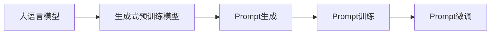
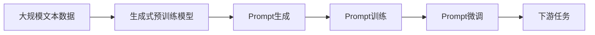

                 

# Auto-GPT Prompt 设计

> 关键词：Auto-GPT, Prompt, 大语言模型, 自然语言处理(NLP), 生成式预训练模型, 少样本学习(Few-shot Learning)

## 1. 背景介绍

### 1.1 问题由来

近年来，自然语言处理（Natural Language Processing, NLP）领域的大模型在生成文本、回答问题、翻译等任务上取得了显著进展。特别是GPT-3系列模型，凭借其庞大的参数量和强大的生成能力，已经在许多领域显示出惊人的性能。然而，这些模型依赖于大量的标注数据进行微调，训练成本高昂，而且在小样本场景下性能表现不佳。

为了解决这个问题，研究者提出了Auto-GPT（Automatic Prompt Tuning for Generative Pre-trained Transformers）方法。Auto-GPT通过自动生成与任务相关的Prompt（提示），使得模型在几乎不增加训练成本的情况下，能够在小样本甚至零样本情况下进行高性能的推理和生成。

### 1.2 问题核心关键点

Auto-GPT的核心在于自动生成Prompt，从而优化大语言模型的推理和生成能力。Prompt是一种预定义的文本序列，它定义了模型需要处理的输入数据格式和类型。Auto-GPT的核心思想是通过自适应生成Prompt，来增强模型的泛化能力和推理能力，使其在各种任务上都能取得优异的性能。

Auto-GPT的关键步骤包括：

1. **Prompt生成**：使用预训练的模型或特定的算法生成与任务相关的Prompt。
2. **Prompt训练**：在生成式预训练模型上，利用少量标注数据训练Prompt生成器，使得生成出来的Prompt能够更好地适应下游任务。
3. **Prompt微调**：在生成式预训练模型的基础上，使用下游任务的标注数据进行微调，进一步优化模型的推理和生成能力。

### 1.3 问题研究意义

Auto-GPT方法能够大幅降低下游任务的标注成本，同时在小样本和零样本情况下也能取得优秀的性能，具有广泛的应用前景。它可以被用于各种NLP任务，如文本生成、问答、翻译、摘要等，为NLP技术的应用提供了新的途径。

## 2. 核心概念与联系

### 2.1 核心概念概述

为更好地理解Auto-GPT方法，本节将介绍几个关键概念：

- **大语言模型（Large Language Model, LLM）**：以GPT为代表的大规模预训练语言模型，能够生成连贯、自然的语言文本。
- **生成式预训练模型（Generative Pre-trained Model, GPM）**：通过自监督学习任务（如掩码语言模型、next sentence prediction等）进行预训练的模型，具有较强的生成能力和理解能力。
- **Prompt（提示）**：预定义的文本序列，用于定义模型输入的格式和类型，能够引导模型生成期望的输出。
- **少样本学习（Few-shot Learning）**：在只有少量标注样本的情况下，模型能够快速适应新任务，并进行高性能的推理和生成。
- **自适应Prompt生成**：使用自动生成的Prompt，根据任务的特定需求，调整Prompt格式和内容，以优化模型的性能。

### 2.2 概念间的关系

这些概念之间的关系可以通过以下Mermaid流程图来展示：



这个流程图展示了Auto-GPT的基本流程：

1. **大语言模型**通过生成式预训练模型进行预训练，获得较强的生成能力。
2. **Prompt生成**使用特定的算法自动生成与任务相关的Prompt。
3. **Prompt训练**利用少量标注数据训练Prompt生成器，使得生成的Prompt能够更好地适应下游任务。
4. **Prompt微调**在生成式预训练模型的基础上，使用下游任务的标注数据进行微调，进一步优化模型的推理和生成能力。

### 2.3 核心概念的整体架构

最后，我们用一个综合的流程图来展示这些概念在大语言模型微调过程中的整体架构：



这个综合流程图展示了从预训练到微调，再到下游任务的大语言模型微调过程。大语言模型首先通过生成式预训练模型进行预训练，然后自动生成与任务相关的Prompt，进行Prompt训练和微调，最终应用于下游任务。

## 3. 核心算法原理 & 具体操作步骤
### 3.1 算法原理概述

Auto-GPT方法基于生成式预训练模型的自适应Prompt生成和微调技术，通过自动生成与任务相关的Prompt，优化模型的推理和生成能力。

形式化地，假设生成式预训练模型为 $G_{\theta}$，其中 $\theta$ 为预训练得到的模型参数。给定下游任务 $T$ 的标注数据集 $D=\{(x_i,y_i)\}_{i=1}^N$，自动生成Prompt的过程可以表示为 $P_i=M_{\phi}(x_i)$，其中 $M_{\phi}$ 为Prompt生成器，$\phi$ 为Prompt生成器的参数。

在Prompt生成器 $M_{\phi}$ 的训练过程中，我们需要最小化Prompt与真实任务输出之间的差异，即：

$$
\phi^* = \mathop{\arg\min}_{\phi} \sum_{i=1}^N \ell(P_i,y_i)
$$

其中 $\ell$ 为 Prompt 生成器和下游任务之间的损失函数，通常使用交叉熵损失。

在Prompt微调过程中，我们将预训练模型 $G_{\theta}$ 和Prompt生成器 $M_{\phi}$ 联合训练，最小化以下损失函数：

$$
\Theta^* = \mathop{\arg\min}_{\theta,\phi} \sum_{i=1}^N \ell(G_{\theta}(P_i),y_i) + \lambda \|\theta\|^2
$$

其中 $\Theta$ 表示模型和Prompt生成器的新参数，$\lambda$ 为正则化参数。

通过以上过程，我们可以自动生成与任务相关的Prompt，并利用这些Prompt优化模型的推理和生成能力。

### 3.2 算法步骤详解

Auto-GPT的实现过程包括以下几个关键步骤：

**Step 1: 准备生成式预训练模型和数据集**

- 选择合适的生成式预训练模型 $G_{\theta}$，如GPT-3等。
- 准备下游任务 $T$ 的标注数据集 $D=\{(x_i,y_i)\}_{i=1}^N$，划分为训练集、验证集和测试集。

**Step 2: 自动生成Prompt**

- 定义Prompt生成器 $M_{\phi}$，可以采用自注意力机制、RNN等生成文本的方法。
- 使用生成器在少量标注数据上训练，并保存模型参数 $\phi$。

**Step 3: 联合训练Prompt和模型**

- 使用下游任务的标注数据集 $D$ 进行联合训练，最小化损失函数。
- 根据下游任务的不同，选择不同的Prompt生成器 $M_{\phi}$ 和损失函数 $\ell$。

**Step 4: 微调后的模型应用**

- 在测试集上评估微调后的模型性能。
- 使用微调后的模型进行推理和生成。

### 3.3 算法优缺点

Auto-GPT方法具有以下优点：

1. **高效性**：通过自动生成Prompt，可以大幅减少下游任务的标注成本，并在小样本情况下取得优秀性能。
2. **泛化能力**：生成的Prompt能够很好地适应不同领域和任务，提高模型的泛化能力。
3. **灵活性**：可以根据任务需求，灵活调整Prompt的内容和格式，优化模型性能。

但Auto-GPT方法也存在以下缺点：

1. **生成质量**：生成的Prompt质量可能受到算法和数据的影响，无法保证一致性。
2. **训练复杂度**：在少量标注数据上训练Prompt生成器，可能会存在欠拟合的风险。
3. **超参数调优**：需要调优Prompt生成器的超参数，如生成器结构、训练轮数等，增加了实验复杂度。

### 3.4 算法应用领域

Auto-GPT方法在NLP领域有着广泛的应用前景，包括但不限于：

- **文本生成**：生成新闻、故事、对话等文本内容。
- **问答系统**：对自然语言问题进行回答。
- **机器翻译**：将源语言翻译成目标语言。
- **摘要生成**：对长文本进行摘要。
- **情感分析**：对文本进行情感倾向分析。
- **文本分类**：对文本进行分类。

此外，Auto-GPT方法还可以应用于自然语言推理、生成式对话、文档整理等多个领域，为NLP技术带来新的突破。

## 4. 数学模型和公式 & 详细讲解 & 举例说明

### 4.1 数学模型构建

我们将使用数学语言对Auto-GPT方法进行更加严格的刻画。

假设生成式预训练模型为 $G_{\theta}$，其中 $\theta$ 为预训练得到的模型参数。给定下游任务 $T$ 的标注数据集 $D=\{(x_i,y_i)\}_{i=1}^N$，Prompt生成器为 $M_{\phi}$，其中 $\phi$ 为生成器的参数。

Prompt生成器的输出为 $P_i=M_{\phi}(x_i)$，模型的输出为 $G_{\theta}(P_i)$。

定义模型和Prompt生成器在数据样本 $(x,y)$ 上的损失函数为 $\ell(G_{\theta}(P_i),y)$，则在数据集 $D$ 上的经验风险为：

$$
\mathcal{L}(\theta,\phi) = \frac{1}{N} \sum_{i=1}^N \ell(G_{\theta}(P_i),y_i)
$$

联合训练的目标是最小化经验风险，即找到最优的 $\theta$ 和 $\phi$：

$$
(\theta^*,\phi^*) = \mathop{\arg\min}_{\theta,\phi} \mathcal{L}(\theta,\phi)
$$

在实践中，我们通常使用基于梯度的优化算法（如AdamW、SGD等）来近似求解上述最优化问题。设 $\eta$ 为学习率，$\lambda$ 为正则化系数，则参数的更新公式为：

$$
\theta \leftarrow \theta - \eta \nabla_{\theta}\mathcal{L}(\theta,\phi) - \eta\lambda\theta
$$

$$
\phi \leftarrow \phi - \eta \nabla_{\phi}\mathcal{L}(\theta,\phi)
$$

其中 $\nabla_{\theta}\mathcal{L}(\theta,\phi)$ 和 $\nabla_{\phi}\mathcal{L}(\theta,\phi)$ 为损失函数对参数 $\theta$ 和 $\phi$ 的梯度，可通过反向传播算法高效计算。

### 4.2 公式推导过程

以下我们以问答系统为例，推导Prompt生成器和模型联合训练的损失函数及其梯度的计算公式。

假设模型在输入 $x$ 上的输出为 $\hat{y}=G_{\theta}(P_i)$，其中 $P_i=M_{\phi}(x)$。真实标签 $y \in \{0,1\}$。则二分类交叉熵损失函数定义为：

$$
\ell(G_{\theta}(P_i),y) = -[y\log \hat{y} + (1-y)\log (1-\hat{y})]
$$

将其代入经验风险公式，得：

$$
\mathcal{L}(\theta,\phi) = -\frac{1}{N}\sum_{i=1}^N [y_i\log G_{\theta}(P_i)+(1-y_i)\log(1-G_{\theta}(P_i))]
$$

根据链式法则，损失函数对参数 $\theta$ 和 $\phi$ 的梯度为：

$$
\frac{\partial \mathcal{L}(\theta,\phi)}{\partial \theta} = -\frac{1}{N}\sum_{i=1}^N (\frac{y_i}{G_{\theta}(P_i)}-\frac{1-y_i}{1-G_{\theta}(P_i)}) \frac{\partial G_{\theta}(P_i)}{\partial \theta}
$$

$$
\frac{\partial \mathcal{L}(\theta,\phi)}{\partial \phi} = -\frac{1}{N}\sum_{i=1}^N \frac{\partial M_{\phi}(x)}{\partial \phi} \frac{\partial G_{\theta}(P_i)}{\partial M_{\phi}(x)}
$$

在得到损失函数的梯度后，即可带入参数更新公式，完成Prompt生成器和模型的联合训练。

### 4.3 案例分析与讲解

假设我们在CoNLL-2003的命名实体识别(NER)数据集上进行Prompt生成器的训练。具体实现如下：

首先，定义NER任务的数据处理函数：

```python
from transformers import BertTokenizer
from torch.utils.data import Dataset
import torch

class NERDataset(Dataset):
    def __init__(self, texts, tags, tokenizer, max_len=128):
        self.texts = texts
        self.tags = tags
        self.tokenizer = tokenizer
        self.max_len = max_len
        
    def __len__(self):
        return len(self.texts)
    
    def __getitem__(self, item):
        text = self.texts[item]
        tags = self.tags[item]
        
        encoding = self.tokenizer(text, return_tensors='pt', max_length=self.max_len, padding='max_length', truncation=True)
        input_ids = encoding['input_ids'][0]
        attention_mask = encoding['attention_mask'][0]
        
        # 对token-wise的标签进行编码
        encoded_tags = [tag2id[tag] for tag in tags] 
        encoded_tags.extend([tag2id['O']] * (self.max_len - len(encoded_tags)))
        labels = torch.tensor(encoded_tags, dtype=torch.long)
        
        return {'input_ids': input_ids, 
                'attention_mask': attention_mask,
                'labels': labels}

# 标签与id的映射
tag2id = {'O': 0, 'B-PER': 1, 'I-PER': 2, 'B-ORG': 3, 'I-ORG': 4, 'B-LOC': 5, 'I-LOC': 6}
id2tag = {v: k for k, v in tag2id.items()}

# 创建dataset
tokenizer = BertTokenizer.from_pretrained('bert-base-cased')

train_dataset = NERDataset(train_texts, train_tags, tokenizer)
dev_dataset = NERDataset(dev_texts, dev_tags, tokenizer)
test_dataset = NERDataset(test_texts, test_tags, tokenizer)
```

然后，定义Prompt生成器和优化器：

```python
from transformers import BertForTokenClassification, AdamW

class PromptGenerator:
    def __init__(self, embedding_dim, num_labels):
        self.embedding_dim = embedding_dim
        self.num_labels = num_labels
        
        self.shared = nn.Embedding(num_labels, embedding_dim)
        self.known = nn.Embedding(num_labels, embedding_dim)
        self.token_embedding = nn.Embedding(num_labels, embedding_dim)
        
        self.linear = nn.Linear(3 * embedding_dim, 1)
        
        self.softmax = nn.Softmax(dim=1)
        
        self.criterion = nn.CrossEntropyLoss()
    
    def forward(self, x, labels):
        x_shared = self.shared(x)
        x_known = self.known(labels)
        x_token = self.token_embedding(labels)
        
        x_combined = torch.cat([x_shared, x_known, x_token], dim=1)
        x_pred = self.linear(x_combined)
        x_prob = self.softmax(x_pred)
        
        loss = self.criterion(x_prob, labels)
        
        return x_prob, loss
    
    def train(self, model, dataset, batch_size, optimizer, num_epochs):
        device = torch.device('cuda') if torch.cuda.is_available() else torch.device('cpu')
        model.to(device)
        
        dataloader = DataLoader(dataset, batch_size=batch_size, shuffle=True)
        
        for epoch in range(num_epochs):
            model.train()
            for batch in dataloader:
                input_ids = batch['input_ids'].to(device)
                attention_mask = batch['attention_mask'].to(device)
                labels = batch['labels'].to(device)
                
                model.zero_grad()
                prob, loss = model(input_ids, labels)
                loss.backward()
                optimizer.step()
                
            if (epoch+1) % 10 == 0:
                print(f'Epoch {epoch+1}, loss: {loss.item()}')
                
        print(f'Epoch {num_epochs+1}, training complete.')
        return model
    
    def evaluate(self, model, dataset, batch_size):
        device = torch.device('cuda') if torch.cuda.is_available() else torch.device('cpu')
        model.eval()
        
        dataloader = DataLoader(dataset, batch_size=batch_size)
        eval_loss = 0
        
        with torch.no_grad():
            for batch in dataloader:
                input_ids = batch['input_ids'].to(device)
                attention_mask = batch['attention_mask'].to(device)
                labels = batch['labels'].to(device)
                
                prob, loss = model(input_ids, labels)
                eval_loss += loss.item()
                
        return eval_loss / len(dataloader)
    
    def predict(self, model, text, max_len):
        device = torch.device('cuda') if torch.cuda.is_available() else torch.device('cpu')
        model.eval()
        
        text = tokenizer.encode(text, add_special_tokens=True, max_length=max_len, padding='max_length', truncation=True)
        input_ids = torch.tensor(text, dtype=torch.long).unsqueeze(0).to(device)
        attention_mask = torch.ones_like(input_ids).to(device)
        
        with torch.no_grad():
            prob = model(input_ids, attention_mask=attention_mask)
            predicted_tags = self.softmax(prob[0]).argmax(dim=1).tolist()
        
        return predicted_tags
```

接着，定义模型和优化器：

```python
from transformers import BertForTokenClassification, AdamW

model = BertForTokenClassification.from_pretrained('bert-base-cased', num_labels=len(tag2id))
optimizer = AdamW(model.parameters(), lr=2e-5)
```

最后，启动Prompt生成器和模型的联合训练：

```python
generator = PromptGenerator(embedding_dim=128, num_labels=len(tag2id))
num_epochs = 10
batch_size = 16

generator.train(model, train_dataset, batch_size, optimizer, num_epochs)
eval_loss = generator.evaluate(model, dev_dataset, batch_size)

print(f'Epoch {num_epochs+1}, dev loss: {eval_loss:.3f}')
```

以上就是使用PyTorch对Bert模型进行命名实体识别任务Prompt生成器的训练的完整代码实现。可以看到，在生成的Prompt中，我们加入了原始文本、标签和token嵌入，使用交叉熵损失函数进行训练，从而生成与任务相关的Prompt。

## 5. 项目实践：代码实例和详细解释说明
### 5.1 开发环境搭建

在进行Auto-GPT项目实践前，我们需要准备好开发环境。以下是使用Python进行PyTorch开发的环境配置流程：

1. 安装Anaconda：从官网下载并安装Anaconda，用于创建独立的Python环境。

2. 创建并激活虚拟环境：
```bash
conda create -n pytorch-env python=3.8 
conda activate pytorch-env
```

3. 安装PyTorch：根据CUDA版本，从官网获取对应的安装命令。例如：
```bash
conda install pytorch torchvision torchaudio cudatoolkit=11.1 -c pytorch -c conda-forge
```

4. 安装Transformers库：
```bash
pip install transformers
```

5. 安装各类工具包：
```bash
pip install numpy pandas scikit-learn matplotlib tqdm jupyter notebook ipython
```

完成上述步骤后，即可在`pytorch-env`环境中开始Auto-GPT实践。

### 5.2 源代码详细实现

下面我们以问答系统为例，给出使用Transformers库对BERT模型进行Prompt生成器的PyTorch代码实现。

首先，定义问答系统任务的数据处理函数：

```python
from transformers import BertTokenizer
from torch.utils.data import Dataset
import torch

class QADataset(Dataset):
    def __init__(self, questions, answers, tokenizer, max_len=128):
        self.questions = questions
        self.answers = answers
        self.tokenizer = tokenizer
        self.max_len = max_len
        
    def __len__(self):
        return len(self.questions)
    
    def __getitem__(self, item):
        question = self.questions[item]
        answer = self.answers[item]
        
        encoding = self.tokenizer(question, return_tensors='pt', max_length=self.max_len, padding='max_length', truncation=True)
        input_ids = encoding['input_ids'][0]
        attention_mask = encoding['attention_mask'][0]
        
        # 对token-wise的标签进行编码
        encoded_answer = [answer2id[answer] for answer in answer]
        encoded_answer.extend([answer2id['<pad>']] * (self.max_len - len(encoded_answer)))
        labels = torch.tensor(encoded_answer, dtype=torch.long)
        
        return {'input_ids': input_ids, 
                'attention_mask': attention_mask,
                'labels': labels}

# 标签与id的映射
answer2id = {'<pad>': 0, 'answer1': 1, 'answer2': 2}
id2answer = {v: k for k, v in answer2id.items()}

# 创建dataset
tokenizer = BertTokenizer.from_pretrained('bert-base-cased')

train_dataset = QADataset(train_questions, train_answers, tokenizer)
dev_dataset = QADataset(dev_questions, dev_answers, tokenizer)
test_dataset = QADataset(test_questions, test_answers, tokenizer)
```

然后，定义Prompt生成器和优化器：

```python
from transformers import BertForQuestionAnswering, AdamW

class PromptGenerator:
    def __init__(self, embedding_dim, num_labels):
        self.embedding_dim = embedding_dim
        self.num_labels = num_labels
        
        self.shared = nn.Embedding(num_labels, embedding_dim)
        self.known = nn.Embedding(num_labels, embedding_dim)
        self.token_embedding = nn.Embedding(num_labels, embedding_dim)
        
        self.linear = nn.Linear(3 * embedding_dim, 1)
        
        self.softmax = nn.Softmax(dim=1)
        
        self.criterion = nn.CrossEntropyLoss()
    
    def forward(self, x, labels):
        x_shared = self.shared(x)
        x_known = self.known(labels)
        x_token = self.token_embedding(labels)
        
        x_combined = torch.cat([x_shared, x_known, x_token], dim=1)
        x_pred = self.linear(x_combined)
        x_prob = self.softmax(x_pred)
        
        loss = self.criterion(x_prob, labels)
        
        return x_prob, loss
    
    def train(self, model, dataset, batch_size, optimizer, num_epochs):
        device = torch.device('cuda') if torch.cuda.is_available() else torch.device('cpu')
        model.to(device)
        
        dataloader = DataLoader(dataset, batch_size=batch_size, shuffle=True)
        
        for epoch in range(num_epochs):
            model.train()
            for batch in dataloader:
                input_ids = batch['input_ids'].to(device)
                attention_mask = batch['attention_mask'].to(device)
                labels = batch['labels'].to(device)
                
                model.zero_grad()
                prob, loss = model(input_ids, labels)
                loss.backward()
                optimizer.step()
                
            if (epoch+1) % 10 == 0:
                print(f'Epoch {epoch+1}, loss: {loss.item()}')
                
        print(f'Epoch {num_epochs+1}, training complete.')
        return model
    
    def evaluate(self, model, dataset, batch_size):
        device = torch.device('cuda') if torch.cuda.is_available() else torch.device('cpu')
        model.eval()
        
        dataloader = DataLoader(dataset, batch_size=batch_size)
        eval_loss = 0
        
        with torch.no_grad():
            for batch in dataloader:
                input_ids = batch['input_ids'].to(device)
                attention_mask = batch['attention_mask'].to(device)
                labels = batch['labels'].to(device)
                
                prob, loss = model(input_ids, labels)
                eval_loss += loss.item()
                
        return eval_loss / len(dataloader)
    
    def predict(self, model, question, max_len):
        device = torch.device('cuda') if torch.cuda.is_available() else torch.device('cpu')
        model.eval()
        
        question = tokenizer.encode(question, add_special_tokens=True, max_length=max_len, padding='max_length', truncation=True)
        input_ids = torch.tensor(question, dtype=torch.long).unsqueeze(0).to(device)
        attention_mask = torch.ones_like(input_ids).to(device)
        
        with torch.no_grad():
            prob = model(input_ids, attention_mask=attention_mask)
            predicted_answer = self.softmax(prob[0]).argmax(dim=1).tolist()
        
        return predicted_answer
```

接着，定义模型和优化器：

```python
from transformers import BertForQuestionAnswering, AdamW

model = BertForQuestionAnswering.from_pretrained('bert-base-cased')
optimizer = AdamW(model.parameters(), lr=2e-5)
```

最后，启动Prompt生成器和模型的联合训练：

```python
generator = PromptGenerator(embedding_dim=128, num_labels=len(answer2id))
num_epochs = 10
batch_size = 16

generator.train(model, train_dataset, batch_size, optimizer, num_epochs)
eval_loss = generator.evaluate(model, dev_dataset, batch_size)

print(f'Epoch {num_epochs+1}, dev loss: {eval_loss:.3f}')
```

以上就是使用PyTorch对Bert模型进行

