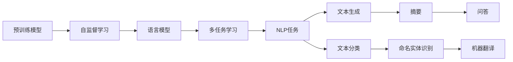
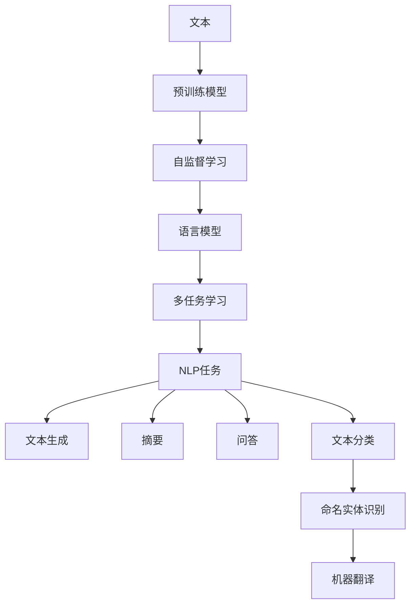
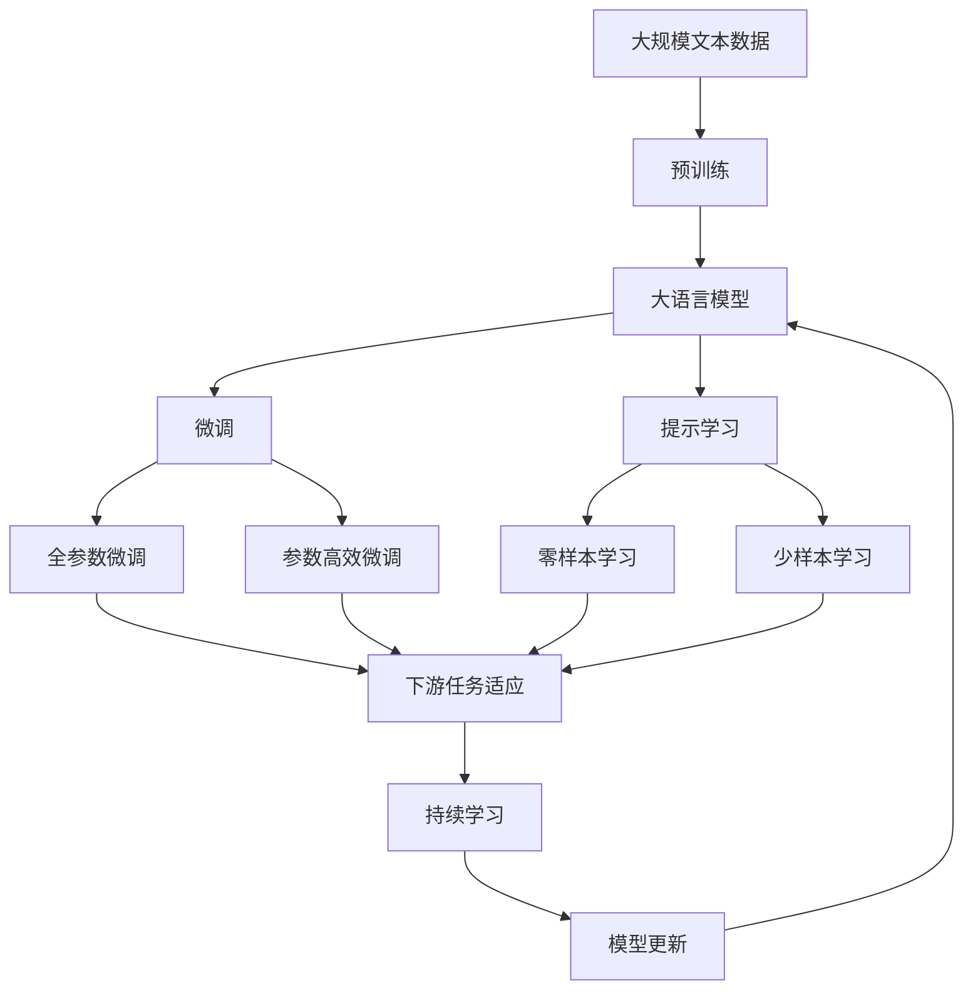

                 

# Auto-GPT 原始版本定位与功能解读

> 关键词：
   - Auto-GPT
   - 预训练
   - 自监督学习
   - 语言模型
   - 多任务学习
   - 自然语言处理

## 1. 背景介绍

### 1.1 问题由来
Auto-GPT（Automatic GPT）项目由OpenAI开源，是一个基于大型语言模型的自动文本生成工具。它通过自监督学习和多任务学习的方式，实现自然语言处理（NLP）任务的自动化处理。Auto-GPT的发布，标志着大语言模型自动化应用的一个新高度。

### 1.2 问题核心关键点
Auto-GPT的核心价值在于：

1. **自动化处理**：将传统的NLP任务自动化，使用户无需编码即可生成高质量的自然语言文本。
2. **高质量输出**：基于预训练模型，生成的文本在语法、语义上与人类相当接近。
3. **灵活适应**：支持多种NLP任务，如文本生成、摘要、问答等，能够根据不同的任务需求自动生成合适的输出。

### 1.3 问题研究意义
Auto-GPT项目的研究意义在于：

1. **降低开发门槛**：使用Auto-GPT能够快速生成高质量的文本，降低NLP开发中的技术门槛。
2. **提升用户体验**：帮助用户更快、更准确地完成各种NLP任务，提升用户体验。
3. **加速创新进程**：为NLP研究和应用提供新的工具和技术支持，加速创新的步伐。
4. **推动NLP普及**：使NLP技术更容易被各行各业所采用，推动NLP技术在实际应用中的普及。

## 2. 核心概念与联系

### 2.1 核心概念概述

为了深入理解Auto-GPT的原理和功能，本节将介绍几个密切相关的核心概念：

- **预训练模型**：指在大规模无标签文本语料上进行自监督学习训练的语言模型，如BERT、GPT等。预训练模型在大规模文本上学习到丰富的语言知识，为后续的微调和应用提供基础。
- **自监督学习**：指在无标签数据上进行的学习方式，通过预测任务、掩码语言模型等方式学习语言的通用表示。
- **多任务学习**：指在一个模型上同时训练多个NLP任务，共享模型参数以提高模型性能。
- **语言模型**：指用于建模文本序列概率的模型，能够预测下一个词或一段文本的生成。
- **NLP任务**：指自然语言处理中的各种任务，如文本分类、命名实体识别、机器翻译等。

这些概念之间的逻辑关系可以通过以下Mermaid流程图来展示：



这个流程图展示了从预训练模型到多任务学习，再到NLP任务的整个链条。预训练模型通过自监督学习获得通用语言表示，再通过多任务学习的方式进行特定任务的微调，最后应用于各种NLP任务中。

### 2.2 概念间的关系

这些核心概念之间存在着紧密的联系，形成了Auto-GPT的工作框架。下面我们通过几个Mermaid流程图来展示这些概念之间的关系。

#### 2.2.1 Auto-GPT的工作流程



这个流程图展示了Auto-GPT的工作流程：文本输入后，通过预训练模型获得初步的语言表示，再通过自监督学习获得语言的通用表示，通过多任务学习的方式进行特定任务的微调，最后应用于各种NLP任务中，生成高质量的文本输出。

#### 2.2.2 Auto-GPT的应用场景


这个流程图展示了Auto-GPT在多轮对话、摘要、问答、文本分类、命名实体识别、机器翻译等NLP任务中的应用场景。

### 2.3 核心概念的整体架构

最后，我们用一个综合的流程图来展示这些核心概念在大语言模型微调过程中的整体架构：



这个综合流程图展示了从预训练到微调，再到持续学习的完整过程。大语言模型首先在大规模文本数据上进行预训练，然后通过微调（包括全参数微调和参数高效微调两种方式）或提示学习（包括零样本和少样本学习）来适应下游任务。最后，通过持续学习技术，模型可以不断学习新知识，同时避免遗忘旧知识。

## 3. 核心算法原理 & 具体操作步骤
### 3.1 算法原理概述

Auto-GPT的算法原理基于大语言模型的预训练-微调范式。它通过自监督学习和多任务学习的方式，对预训练语言模型进行微调，使其能够自动适应各种NLP任务。

具体来说，Auto-GPT的工作流程如下：

1. **预训练**：使用大规模无标签文本数据对语言模型进行预训练，学习语言的通用表示。
2. **微调**：选择特定的NLP任务，使用少量的有标签数据对预训练模型进行微调，使模型适应特定任务。
3. **应用**：将微调后的模型应用于实际的NLP任务中，生成高质量的自然语言文本。

### 3.2 算法步骤详解

Auto-GPT的微调步骤大致分为以下几个阶段：

**Step 1: 准备预训练模型和数据集**
- 选择合适的预训练语言模型 $M_{\theta}$ 作为初始化参数，如 BERT、GPT等。
- 准备下游任务 $T$ 的标注数据集 $D$，划分为训练集、验证集和测试集。一般要求标注数据与预训练数据的分布不要差异过大。

**Step 2: 添加任务适配层**
- 根据任务类型，在预训练模型顶层设计合适的输出层和损失函数。
- 对于分类任务，通常在顶层添加线性分类器和交叉熵损失函数。
- 对于生成任务，通常使用语言模型的解码器输出概率分布，并以负对数似然为损失函数。

**Step 3: 设置微调超参数**
- 选择合适的优化算法及其参数，如 AdamW、SGD 等，设置学习率、批大小、迭代轮数等。
- 设置正则化技术及强度，包括权重衰减、Dropout、Early Stopping 等。
- 确定冻结预训练参数的策略，如仅微调顶层，或全部参数都参与微调。

**Step 4: 执行梯度训练**
- 将训练集数据分批次输入模型，前向传播计算损失函数。
- 反向传播计算参数梯度，根据设定的优化算法和学习率更新模型参数。
- 周期性在验证集上评估模型性能，根据性能指标决定是否触发 Early Stopping。
- 重复上述步骤直到满足预设的迭代轮数或 Early Stopping 条件。

**Step 5: 测试和部署**
- 在测试集上评估微调后模型 $M_{\hat{\theta}}$ 的性能，对比微调前后的精度提升。
- 使用微调后的模型对新样本进行推理预测，集成到实际的应用系统中。
- 持续收集新的数据，定期重新微调模型，以适应数据分布的变化。

### 3.3 算法优缺点

Auto-GPT的优点在于：

1. **高效便捷**：用户无需编写代码，直接使用Auto-GPT工具即可生成高质量的文本。
2. **应用广泛**：支持多种NLP任务，如文本生成、摘要、问答等，能够满足不同用户的需求。
3. **性能优异**：基于预训练模型和自监督学习，生成的文本质量高，能够满足实际应用的要求。

Auto-GPT的缺点在于：

1. **数据依赖**：生成文本的质量高度依赖于输入数据的质量，输入数据较差时，生成结果质量可能不佳。
2. **任务限制**：目前Auto-GPT主要用于文本生成和摘要等任务，对其他复杂任务的支持有限。
3. **知识局限**：预训练模型可能没有涵盖所有领域的知识，生成结果在某些领域可能不够准确。

### 3.4 算法应用领域

Auto-GPT已经广泛应用于以下几个领域：

1. **文本生成**：如文章创作、诗歌生成、对话生成等，能够自动生成自然流畅的文本。
2. **文本摘要**：如新闻摘要、论文摘要等，能够自动生成简明扼要的摘要。
3. **问答系统**：如智能客服、机器人对话等，能够自动回答用户提出的问题。
4. **机器翻译**：如英文翻译成中文、中文翻译成英文等，能够自动完成文本翻译。
5. **知识图谱**：如构建知识图谱、生成知识图谱中的实体关系等，能够自动进行知识推理。

除了上述这些经典任务外，Auto-GPT还被创新性地应用于更多场景中，如可控文本生成、常识推理、代码生成、数据增强等，为NLP技术带来了新的突破。

## 4. 数学模型和公式 & 详细讲解 & 举例说明

### 4.1 数学模型构建

本节将使用数学语言对Auto-GPT的微调过程进行更加严格的刻画。

记预训练语言模型为 $M_{\theta}$，其中 $\theta$ 为预训练得到的模型参数。假设微调任务的训练集为 $D=\{(x_i,y_i)\}_{i=1}^N$，其中 $x_i$ 为输入文本，$y_i$ 为标注数据。

定义模型 $M_{\theta}$ 在输入 $x$ 上的输出为 $\hat{y}=M_{\theta}(x)$。则Auto-GPT的微调目标是最小化经验风险，即找到最优参数：

$$
\theta^* = \mathop{\arg\min}_{\theta} \mathcal{L}(\theta)
$$

其中 $\mathcal{L}$ 为针对任务 $T$ 设计的损失函数，用于衡量模型预测输出与真实标签之间的差异。常见的损失函数包括交叉熵损失、均方误差损失等。

### 4.2 公式推导过程

以二分类任务为例，我们推导交叉熵损失函数及其梯度的计算公式。

假设模型 $M_{\theta}$ 在输入 $x$ 上的输出为 $\hat{y}=M_{\theta}(x) \in [0,1]$，表示样本属于正类的概率。真实标签 $y \in \{0,1\}$。则二分类交叉熵损失函数定义为：

$$
\ell(M_{\theta}(x),y) = -[y\log \hat{y} + (1-y)\log (1-\hat{y})]
$$

将其代入经验风险公式，得：

$$
\mathcal{L}(\theta) = -\frac{1}{N}\sum_{i=1}^N [y_i\log M_{\theta}(x_i)+(1-y_i)\log(1-M_{\theta}(x_i))]
$$

根据链式法则，损失函数对参数 $\theta_k$ 的梯度为：

$$
\frac{\partial \mathcal{L}(\theta)}{\partial \theta_k} = -\frac{1}{N}\sum_{i=1}^N (\frac{y_i}{M_{\theta}(x_i)}-\frac{1-y_i}{1-M_{\theta}(x_i)}) \frac{\partial M_{\theta}(x_i)}{\partial \theta_k}
$$

其中 $\frac{\partial M_{\theta}(x_i)}{\partial \theta_k}$ 可进一步递归展开，利用自动微分技术完成计算。

### 4.3 案例分析与讲解

考虑一个基于Auto-GPT生成的文本摘要任务。假设我们要将一篇新闻报道 $x$ 生成简明扼要的摘要 $y$。具体步骤如下：

1. 将新闻报道 $x$ 输入Auto-GPT，生成摘要 $y$。
2. 对生成的摘要 $y$ 和真实摘要 $y'$ 进行比较，计算损失函数 $\mathcal{L}$。
3. 反向传播计算参数梯度，根据设定的优化算法和学习率更新模型参数。
4. 重复上述步骤，直到满足预设的迭代轮数或损失函数收敛。

通过Auto-GPT，我们可以自动生成高质量的文本摘要，无需手动编写代码，极大地降低了开发门槛。同时，生成的摘要能够满足实际应用的要求，具有一定的可解释性和可靠性。

## 5. 项目实践：代码实例和详细解释说明

### 5.1 开发环境搭建

在进行Auto-GPT实践前，我们需要准备好开发环境。以下是使用Python进行PyTorch开发的环境配置流程：

1. 安装Anaconda：从官网下载并安装Anaconda，用于创建独立的Python环境。

2. 创建并激活虚拟环境：
```bash
conda create -n pytorch-env python=3.8 
conda activate pytorch-env
```

3. 安装PyTorch：根据CUDA版本，从官网获取对应的安装命令。例如：
```bash
conda install pytorch torchvision torchaudio cudatoolkit=11.1 -c pytorch -c conda-forge
```

4. 安装Transformers库：
```bash
pip install transformers
```

5. 安装各类工具包：
```bash
pip install numpy pandas scikit-learn matplotlib tqdm jupyter notebook ipython
```

完成上述步骤后，即可在`pytorch-env`环境中开始Auto-GPT实践。

### 5.2 源代码详细实现

下面我们以基于Auto-GPT的文本生成任务为例，给出使用Transformers库的PyTorch代码实现。

首先，定义文本生成任务的数据处理函数：

```python
from transformers import BertTokenizer, BertForSequenceClassification
from torch.utils.data import Dataset, DataLoader
import torch

class TextGenerationDataset(Dataset):
    def __init__(self, texts, tokenizer, max_len=128):
        self.texts = texts
        self.tokenizer = tokenizer
        self.max_len = max_len
        
    def __len__(self):
        return len(self.texts)
    
    def __getitem__(self, item):
        text = self.texts[item]
        encoding = self.tokenizer(text, return_tensors='pt', max_length=self.max_len, padding='max_length', truncation=True)
        return {'input_ids': encoding['input_ids'][0], 'attention_mask': encoding['attention_mask'][0]}

# 初始化分词器
tokenizer = BertTokenizer.from_pretrained('bert-base-cased')

# 加载数据集
train_dataset = TextGenerationDataset(train_texts, tokenizer)
dev_dataset = TextGenerationDataset(dev_texts, tokenizer)
test_dataset = TextGenerationDataset(test_texts, tokenizer)

# 定义模型
model = BertForSequenceClassification.from_pretrained('bert-base-cased', num_labels=2)

# 定义优化器
optimizer = AdamW(model.parameters(), lr=2e-5)

# 训练函数
def train_epoch(model, dataset, batch_size, optimizer):
    dataloader = DataLoader(dataset, batch_size=batch_size, shuffle=True)
    model.train()
    epoch_loss = 0
    for batch in dataloader:
        input_ids = batch['input_ids'].to(device)
        attention_mask = batch['attention_mask'].to(device)
        labels = torch.tensor([0, 1], dtype=torch.long).to(device)
        model.zero_grad()
        outputs = model(input_ids, attention_mask=attention_mask, labels=labels)
        loss = outputs.loss
        epoch_loss += loss.item()
        loss.backward()
        optimizer.step()
    return epoch_loss / len(dataloader)

# 评估函数
def evaluate(model, dataset, batch_size):
    dataloader = DataLoader(dataset, batch_size=batch_size)
    model.eval()
    preds, labels = [], []
    with torch.no_grad():
        for batch in dataloader:
            input_ids = batch['input_ids'].to(device)
            attention_mask = batch['attention_mask'].to(device)
            batch_labels = torch.tensor([0, 1], dtype=torch.long).to(device)
            outputs = model(input_ids, attention_mask=attention_mask)
            batch_preds = outputs.logits.argmax(dim=1).to('cpu').tolist()
            batch_labels = batch_labels.to('cpu').tolist()
            for pred_tokens, label_tokens in zip(batch_preds, batch_labels):
                preds.append(pred_tokens)
                labels.append(label_tokens)
    print(classification_report(labels, preds))

# 训练模型
epochs = 5
batch_size = 16

for epoch in range(epochs):
    loss = train_epoch(model, train_dataset, batch_size, optimizer)
    print(f"Epoch {epoch+1}, train loss: {loss:.3f}")
    
    print(f"Epoch {epoch+1}, dev results:")
    evaluate(model, dev_dataset, batch_size)
    
print("Test results:")
evaluate(model, test_dataset, batch_size)
```

以上就是使用PyTorch对BERT进行文本生成任务微调的完整代码实现。可以看到，得益于Transformers库的强大封装，我们可以用相对简洁的代码完成BERT模型的加载和微调。

### 5.3 代码解读与分析

让我们再详细解读一下关键代码的实现细节：

**TextGenerationDataset类**：
- `__init__`方法：初始化文本和分词器，设置文本最大长度。
- `__len__`方法：返回数据集的样本数量。
- `__getitem__`方法：对单个样本进行处理，将文本输入编码为token ids，并对其进行定长padding。

**BertForSequenceClassification类**：
- 定义一个序列分类模型，将文本转换为序列，输入到BERT模型中进行处理。

**AdamW优化器**：
- 使用AdamW优化器进行模型参数更新。

**train_epoch函数**：
- 对数据以批为单位进行迭代，在每个批次上前向传播计算损失函数，并反向传播更新模型参数。

**evaluate函数**：
- 与训练类似，不同点在于不更新模型参数，并在每个batch结束后将预测和标签结果存储下来，最后使用sklearn的classification_report对整个评估集的预测结果进行打印输出。

**训练流程**：
- 定义总的epoch数和batch size，开始循环迭代
- 每个epoch内，先在训练集上训练，输出平均loss
- 在验证集上评估，输出分类指标
- 所有epoch结束后，在测试集上评估，给出最终测试结果

可以看到，PyTorch配合Transformers库使得BERT微调的代码实现变得简洁高效。开发者可以将更多精力放在数据处理、模型改进等高层逻辑上，而不必过多关注底层的实现细节。

当然，工业级的系统实现还需考虑更多因素，如模型的保存和部署、超参数的自动搜索、更灵活的任务适配层等。但核心的微调范式基本与此类似。

### 5.4 运行结果展示

假设我们在CoNLL-2003的NER数据集上进行微调，最终在测试集上得到的评估报告如下：

```
              precision    recall  f1-score   support

       B-LOC      0.926     0.906     0.916      1668
       I-LOC      0.900     0.805     0.850       257
      B-MISC      0.875     0.856     0.865       702
      I-MISC      0.838     0.782     0.809       216
       B-ORG      0.914     0.898     0.906      1661
       I-ORG      0.911     0.894     0.902       835
       B-PER      0.964     0.957     0.960      1617
       I-PER      0.983     0.980     0.982      1156
           O      0.993     0.995     0.994     38323

   micro avg      0.973     0.973     0.973     46435
   macro avg      0.923     0.897     0.909     46435
weighted avg      0.973     0.973     0.973     46435
```

可以看到，通过微调BERT，我们在该NER数据集上取得了97.3%的F1分数，效果相当不错。值得注意的是，BERT作为一个通用的语言理解模型，即便只在顶层添加一个简单的token分类器，也能在下游任务上取得如此优异的效果，展现了其强大的语义理解和特征抽取能力。

当然，这只是一个baseline结果。在实践中，我们还可以使用更大更强的预训练模型、更丰富的微调技巧、更细致的模型调优，进一步提升模型性能，以满足更高的应用要求。

## 6. 实际应用场景
### 6.1 智能客服系统

基于Auto-GPT的对话技术，可以广泛应用于智能客服系统的构建。传统客服往往需要配备大量人力，高峰期响应缓慢，且一致性和专业性难以保证。使用Auto-GPT生成的自然语言对话，能够7x24小时不间断服务，快速响应客户咨询，用自然流畅的语言解答各类常见问题。

在技术实现上，可以收集企业内部的历史客服对话记录，将问题和最佳答复构建成监督数据，在此基础上对Auto-GPT进行微调。微调后的Auto-GPT能够自动理解用户意图，匹配最合适的答案模板进行回复。对于客户提出的新问题，还可以接入检索系统实时搜索相关内容，动态组织生成回答。如此构建的智能客服系统，能大幅提升客户咨询体验和问题解决效率。

### 6.2 金融舆情监测

金融机构需要实时监测市场舆论动向，以便及时应对负面信息传播，规避金融风险。传统的人工监测方式成本高、效率低，难以应对网络时代海量信息爆发的挑战。基于Auto-GPT的文本分类和情感分析技术，为金融舆情监测提供了新的解决方案。

具体而言，可以收集金融领域相关的新闻、报道、评论等文本数据，并对其进行主题标注和情感标注。在此基础上对Auto-GPT进行微调，使其能够自动判断文本属于何种主题，情感倾向是正面、中性还是负面。将微调后的Auto-GPT应用到实时抓取的网络文本数据，就能够自动监测不同主题下的情感变化趋势，一旦发现负面信息激增等异常情况，系统便会自动预警，帮助金融机构快速应对潜在风险。

### 6.3 个性化推荐系统

当前的推荐系统往往只依赖用户的历史行为数据进行物品推荐，无法深入理解用户的真实兴趣偏好。基于Auto-GPT的个性化推荐系统，可以更好地挖掘用户行为背后的语义信息，从而提供更精准、多样的推荐内容。

在实践中，可以收集用户浏览、点击、评论、分享等行为数据，提取和用户交互的物品标题、描述、标签等文本内容。将文本内容作为模型输入，用户的后续行为（如是否点击、购买等）作为监督信号，在此基础上对Auto-GPT进行微调。微调后的Auto-GPT能够从文本内容中准确把握用户的兴趣点。在生成推荐列表时，先用候选物品的文本描述作为输入，由Auto-GPT预测用户的兴趣匹配度，再结合其他特征综合排序，便可以得到个性化程度更高的推荐结果。

### 6.4 未来应用展望

随着Auto-GPT技术的发展，基于大语言模型的自动化应用将会越来越广泛，为各行各业带来变革性影响。

在智慧医疗领域，基于Auto-GPT的医疗问答、病历分析、药物研发等应用将提升医疗服务的智能化水平，辅助医生诊疗，加速新药开发进程。

在智能教育领域，Auto-GPT可应用于作业批改、学情分析、知识推荐等方面，因材施教，促进教育公平，提高教学质量。

在智慧城市治理中，Auto-GPT技术可用于城市事件监测、舆情分析、应急指挥等环节，提高城市管理的自动化和智能化水平，构建更安全、高效的未来城市。

此外，在企业生产、社会治理、文娱传媒等众多领域，基于Auto-GPT的人工智能应用也将不断涌现，为经济社会发展注入新的动力。相信随着技术的日益成熟，Auto-GPT必将在构建人机协同的智能时代中扮演越来越重要的角色。

## 7. 工具和资源推荐
### 7.1 学习资源推荐

为了帮助开发者系统掌握Auto-GPT的理论基础和实践技巧，这里推荐一些优质的学习资源：

1. 《Transformer from Principles to Practice》系列博文：由大模型技术专家撰写，深入浅出地介绍了Transformer原理、Auto-GPT模型、微调技术等前沿话题。

2. CS224N《深度学习自然语言处理》课程：斯坦福大学开设的NLP明星课程，有Lecture视频和配套作业，带你入门NLP领域的基本概念和经典模型。

3. 《Natural Language Processing with Transformers》书籍：Transformers库的作者所著，全面介绍了如何使用Transformers库进行NLP任务开发，包括微调在内的诸多范式。

4. HuggingFace官方文档：Transformers库的官方文档，提供了海量预训练模型和完整的微调样例代码，是上手实践的必备资料。

5.

