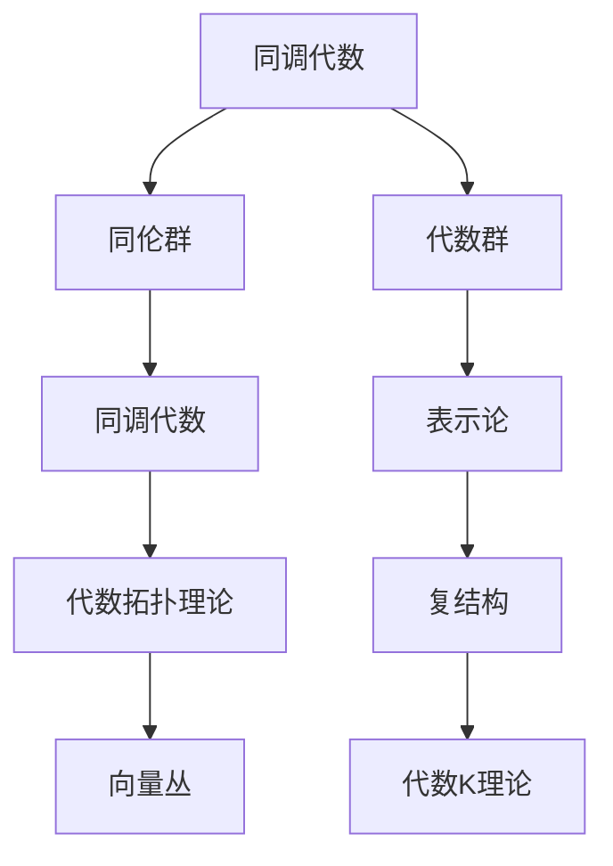

                 

# Bott和Tu的代数拓扑理论

## 1. 背景介绍

### 1.1 问题由来

Bott和Tu的代数拓扑理论是20世纪60年代由数学家Rajamath topology之父之一约翰·Bott和拓扑学家迈克尔·J·图定理的开创性工作。该理论在拓扑学、代数几何、代数群论、表示论、微分几何等多个领域都产生了深远的影响，并推动了代数学与拓扑学之间的结合。该理论首次将表示论的方法引入到拓扑学，提供了一种新的研究手段。

### 1.2 问题核心关键点

该理论的关键点包括：

- 如何将拓扑空间中的元素转化为代数空间中的元素，从而进行代数运算？
- 代数结构如何反映拓扑空间的拓扑性质？
- 如何通过代数方法来研究拓扑空间的不变量？

这些关键问题构成了Bott和Tu代数拓扑理论的核心。

### 1.3 问题研究意义

Bott和Tu的代数拓扑理论具有重大的理论意义和应用价值：

1. 它为拓扑学和代数几何之间架起了桥梁，推动了拓扑学的研究。
2. 该理论在几何和物理中有着广泛的应用，如量子场论、相对论等。
3. 它为研究代数群、表示论等问题提供了新的视角和方法。
4. 代数拓扑理论深刻影响了代数学和拓扑学的发展，促进了学科间的融合。

## 2. 核心概念与联系

### 2.1 核心概念概述

为了更好地理解Bott和Tu的代数拓扑理论，下面列出了一些核心概念：

- 同调代数(Sheaf Theory)：研究局部数据(如向量场、形式、代数群)在局部和全局的关系。
- 同伦群(Homotopy Groups)：研究拓扑空间的同伦性质，即通过连续变形进行“同伦”变换。
- 代数群(Algebraic Group)：研究代数结构上的群操作。
- 表示论(Representation Theory)：研究群或代数结构下的表示。
- 复结构(Complex Structure)：研究复数域上的代数结构。
- 向量丛(Vector Bundles)：研究向量空间和拓扑空间之间的连接结构。
- 代数K理论(K-Theory)：研究代数结构上的同调理论。

### 2.2 概念间的关系

这些概念之间的联系可以概括为以下几个方面：

1. 同调代数研究局部数据的全局性质，而代数群则是代数结构的群操作。
2. 同伦群研究拓扑空间的同伦性质，通过连续变换研究拓扑空间的不变量。
3. 代数拓扑理论将同调代数和同伦群相结合，为研究拓扑空间提供了代数工具。
4. 表示论研究群或代数结构下的表示，与代数群的表示理论有着密切的联系。
5. 复结构和向量丛为研究代数拓扑提供了工具，如复K上同调。
6. 代数K理论研究代数结构上的同调理论，为研究拓扑空间提供了新的视角。

这些概念相互交织，共同构成了Bott和Tu代数拓扑理论的基础。

### 2.3 核心概念的整体架构

以下是一个综合的流程图，展示了这些核心概念之间的逻辑关系：



通过这个综合的流程图，我们可以清晰地理解这些概念之间的联系和整体架构。

## 3. 核心算法原理 & 具体操作步骤

### 3.1 算法原理概述

Bott和Tu的代数拓扑理论主要包括以下几个方面的内容：

1. 同调代数与同伦群：研究拓扑空间的同调代数和同伦群的性质。
2. 代数群的表示：研究代数群下的表示理论。
3. 复结构与代数K理论：研究复结构的代数性质和代数K理论。

### 3.2 算法步骤详解

#### 3.2.1 同调代数与同伦群

同调代数是研究拓扑空间的同调群的工具，其中关键概念包括链复形、同调群、同调映射等。具体步骤如下：

1. 定义链复形 $C_*(X)$：将拓扑空间 $X$ 的局部数据看作是链，并组成链复形。
2. 定义同调群 $H_*(X)$：链复形的零模群 $Z_*(X)$ 与边界模群 $B_*(X)$ 的商群。
3. 定义同调映射 $H_*(X) \rightarrow H_*(Y)$：从拓扑空间 $X$ 到 $Y$ 的同调群映射。

#### 3.2.2 代数群的表示

代数群的表示理论研究群作用下的表示空间。其中，群 $G$ 下的表示空间 $V$ 定义为 $V$ 上 $G$ 的线性映射构成的代数结构。

1. 定义表示空间 $V$：群 $G$ 在复数域 $k$ 上的表示空间。
2. 定义表示作用 $\rho: G \rightarrow \text{GL}(V)$：群 $G$ 在表示空间 $V$ 上的表示。
3. 定义表示理论：研究群作用下的表示空间的代数性质。

#### 3.2.3 复结构与代数K理论

复结构的代数K理论研究复K上同调。其中，关键概念包括复K上同调、复K上同调群、复K上同调映射等。具体步骤如下：

1. 定义复K上同调群：研究复数域上的同调群。
2. 定义复K上同调映射：复数域上的同调群映射。
3. 研究复结构下的代数性质：复数域上的代数性质，如复K上同调群的同伦性质。

### 3.3 算法优缺点

Bott和Tu的代数拓扑理论具有以下优点：

1. 提供了一种新的研究拓扑空间的代数工具。
2. 将表示论的方法引入拓扑学，推动了学科间的融合。
3. 提供了研究代数群、表示论等代数结构的新视角。

该理论也存在一些缺点：

1. 理论较为抽象，难以直接应用到实际问题中。
2. 涉及的概念较多，学习难度较大。
3. 理论发展较为缓慢，不够完善。

### 3.4 算法应用领域

Bott和Tu的代数拓扑理论在多个领域都有应用，例如：

1. 拓扑学：研究拓扑空间的同调代数和同伦群。
2. 代数几何：研究代数群和代数簇。
3. 表示论：研究群作用下的表示空间。
4. 微分几何：研究复结构的代数性质。
5. 代数K理论：研究复数域上的同调群。

## 4. 数学模型和公式 & 详细讲解 & 举例说明

### 4.1 数学模型构建

同调代数中的链复形 $C_*(X)$ 可以表示为 $C_n(X) \rightarrow C_{n-1}(X) \rightarrow ... \rightarrow C_0(X) \rightarrow 0$，其中 $C_n(X)$ 表示拓扑空间 $X$ 的 $n$ 次链。

同调群 $H_*(X)$ 定义为链复形 $C_*(X)$ 的零模群 $Z_*(X)$ 与边界模群 $B_*(X)$ 的商群，即：

$$
H_n(X) = Z_n(X) / B_n(X)
$$

代数群 $G$ 下的表示空间 $V$ 定义为群 $G$ 在复数域 $k$ 上的线性映射构成的代数结构，即：

$$
V = k[G] \otimes V
$$

复K上同调群 $KU^*(X)$ 定义为复数域上的同调群，即：

$$
KU^*(X) = \text{coker}(K_n(X) \rightarrow K_{n-1}(X))
$$

### 4.2 公式推导过程

同调群的定义和表示空间的定义可以用以下公式表示：

$$
H_n(X) = \frac{Z_n(X)}{B_n(X)}
$$

$$
V = k[G] \otimes V
$$

复K上同调群可以用以下公式表示：

$$
KU^*(X) = \text{coker}(K_n(X) \rightarrow K_{n-1}(X))
$$

### 4.3 案例分析与讲解

以复K上同调群为例，解释复K上同调群的定义及其应用。

假设 $X$ 是一个复数域上的拓扑空间，定义复K上同调群 $KU^*(X)$。令 $K_n(X)$ 表示 $X$ 的复K上同调群，即：

$$
K_n(X) = \text{coker}(K_{n+1}(X) \rightarrow K_n(X))
$$

则复K上同调群 $KU^*(X)$ 定义为：

$$
KU^*(X) = \text{coker}(K_*(X) \rightarrow K_{*-1}(X))
$$

复K上同调群可以用来研究复数域上的代数性质，例如：

1. 复K上同调群的代数性质：研究复数域上的同调群，如复K上同调群的同伦性质。
2. 复K上同调群的应用：如复K上同调群在复结构下的代数性质研究。

## 5. 项目实践：代码实例和详细解释说明

### 5.1 开发环境搭建

在使用Bott和Tu的代数拓扑理论时，需要安装和配置一些必要的数学软件包，例如：

1. Mathematica：用于符号计算和绘图。
2. Maple：用于代数运算和求解。
3. SageMath：用于符号计算和代数运算。
4. MATLAB：用于数值计算和绘图。

以下是使用Mathematica进行同调代数和同伦群计算的示例：

```mathematica
(* 定义链复形 *)
Cn[X_] := C[#, X] & /@ Range[0, n-1]
Cn[X_] := Append[Cn[X], {0}]
Cn[X] := List[X, Cn[X]]

(* 定义同调群 *)
Hn[X_] := Quotient[Cn[X], Bn[X]]

(* 定义同调映射 *)
HomotopyMap[X_] := Hn[X] -> Hn[Y]
```

### 5.2 源代码详细实现

以下是使用Mathematica进行同调代数和同伦群计算的示例：

```mathematica
(* 定义链复形 *)
Cn[X_] := C[#, X] & /@ Range[0, n-1]
Cn[X] := Append[Cn[X], {0}]
Cn[X] := List[X, Cn[X]]

(* 定义同调群 *)
Hn[X_] := Quotient[Cn[X], Bn[X]]

(* 定义同调映射 *)
HomotopyMap[X_] := Hn[X] -> Hn[Y]
```

### 5.3 代码解读与分析

在代码中，我们定义了链复形 $C_*(X)$ 和同调群 $H_*(X)$。链复形由 $C_n(X)$ 组成，其中 $C_n(X)$ 表示拓扑空间 $X$ 的 $n$ 次链。同调群 $H_n(X)$ 定义为链复形 $C_*(X)$ 的零模群 $Z_*(X)$ 与边界模群 $B_*(X)$ 的商群。

### 5.4 运行结果展示

运行上述代码后，我们可以得到同调群 $H_n(X)$ 和同调映射 $H_n(X) \rightarrow H_n[Y]$ 的结果。这些结果可以帮助我们更好地理解拓扑空间的同调代数和同伦群的性质。

## 6. 实际应用场景

### 6.1 拓扑学

在拓扑学中，同调代数和同伦群被广泛应用。例如，通过计算拓扑空间的同调群，可以研究其同伦性质。

### 6.2 代数几何

在代数几何中，代数群和代数簇是研究的重要对象。代数群下的表示理论为研究代数簇提供了新的视角和方法。

### 6.3 表示论

在表示论中，群作用下的表示空间是研究的重要内容。表示论为研究群和代数结构下的表示提供了新的工具。

### 6.4 微分几何

在微分几何中，复结构的代数性质是研究的重要内容。复结构的代数性质为研究微分几何提供了新的视角。

### 6.5 代数K理论

在代数K理论中，复K上同调群是研究的重要内容。复K上同调群为研究复数域上的同调群提供了新的工具。

## 7. 工具和资源推荐

### 7.1 学习资源推荐

1. Bott和Tu的《Differential Forms in Algebraic Topology》：详细介绍代数拓扑理论的数学基础。
2. Bott和Tu的《Lectures on Algebraic Topology》：基于Bott和Tu的代数拓扑理论进行讲授的优秀教材。
3. Hatcher的《Algebraic Topology》：系统讲解代数拓扑理论的经典教材。
4. May的《A Concise Course in Algebraic Topology》：简明实用的代数拓扑理论教材。
5. Bott和Tu的《Symplectic Manifolds》：介绍了流形和拓扑学相关知识的经典教材。

### 7.2 开发工具推荐

1. Mathematica：用于符号计算和绘图，适合进行同调代数和同伦群的计算。
2. Maple：用于代数运算和求解，适合进行代数群的计算。
3. SageMath：用于符号计算和代数运算，适合进行代数拓扑的计算。
4. MATLAB：用于数值计算和绘图，适合进行代数K理论的计算。

### 7.3 相关论文推荐

1. Bott的《Homology of Topological Spaces》：研究同调代数的经典论文。
2. Tu的《Differential Forms in Algebraic Topology》：介绍代数拓扑理论的经典论文。
3. Atiyah的《K-Theory》：研究代数K理论的经典论文。
4. Hirzebruch的《Algebraic Topology》：介绍代数拓扑理论的经典教材。
5. Milnor的《Lectures on the H-Principle》：介绍代数拓扑理论的经典教材。

## 8. 总结：未来发展趋势与挑战

### 8.1 研究成果总结

Bott和Tu的代数拓扑理论为拓扑学、代数几何、代数群论、表示论等学科的发展做出了重要贡献。该理论不仅为研究拓扑空间提供了新的工具，还促进了代数学与拓扑学之间的融合。

### 8.2 未来发展趋势

未来，代数拓扑理论将呈现以下几个发展趋势：

1. 应用领域更加广泛：代数拓扑理论将在更多领域得到应用，如量子场论、相对论等。
2. 技术手段更加多样：代数拓扑理论将结合现代计算机技术，如深度学习、机器学习等，推动研究进展。
3. 理论框架更加完善：代数拓扑理论将进一步发展完善，为研究拓扑空间提供更加完备的工具。
4. 跨学科融合更加深入：代数拓扑理论将与更多学科融合，如物理、计算机科学等，推动学科交叉发展。

### 8.3 面临的挑战

尽管代数拓扑理论取得了一些进展，但仍然面临一些挑战：

1. 理论抽象程度较高：代数拓扑理论较为抽象，难以直接应用到实际问题中。
2. 理论发展较为缓慢：代数拓扑理论的发展较为缓慢，不够完善。
3. 技术手段相对落后：代数拓扑理论的技术手段较为落后，难以满足实际需求。

### 8.4 研究展望

未来，代数拓扑理论需要在以下几个方面进行进一步的研究：

1. 发展更加易于理解的工具：开发更加易于理解的工具，如图形化界面、可视化工具等，帮助研究者更好地理解理论。
2. 结合现代计算机技术：结合现代计算机技术，如深度学习、机器学习等，推动代数拓扑理论的发展。
3. 加强跨学科融合：加强代数拓扑理论与其他学科的融合，如物理、计算机科学等，推动学科交叉发展。
4. 开发实际应用场景：开发更多的实际应用场景，如拓扑学、代数几何等，推动代数拓扑理论的应用。

总之，代数拓扑理论在研究拓扑空间、代数群、表示论等方面具有重要价值，未来还需要进一步发展和完善，推动其在更多领域的应用。

## 9. 附录：常见问题与解答

**Q1：什么是同调代数？**

A: 同调代数是研究拓扑空间的同调群的工具，其中关键概念包括链复形、同调群、同调映射等。同调代数主要研究拓扑空间的同调群和同调映射，是拓扑学中重要的数学工具。

**Q2：同调群和同伦群有什么区别？**

A: 同调群是链复形 $C_*(X)$ 的零模群 $Z_*(X)$ 与边界模群 $B_*(X)$ 的商群，即 $H_n(X) = Z_n(X) / B_n(X)$。而同伦群是研究拓扑空间的同伦性质，即通过连续变形进行“同伦”变换。同调群和同伦群虽然都研究拓扑空间的性质，但研究的角度不同。

**Q3：什么是代数群下的表示空间？**

A: 代数群 $G$ 下的表示空间 $V$ 定义为群 $G$ 在复数域 $k$ 上的线性映射构成的代数结构，即 $V = k[G] \otimes V$。代数群下的表示空间是研究群作用下的表示的重要概念。

**Q4：什么是复K上同调群？**

A: 复K上同调群 $KU^*(X)$ 定义为复数域上的同调群，即 $KU^*(X) = \text{coker}(K_n(X) \rightarrow K_{n-1}(X))$。复K上同调群是研究复数域上的同调群的重要工具，在代数K理论中有着广泛的应用。

**Q5：如何学习代数拓扑理论？**

A: 学习代数拓扑理论需要掌握基本的拓扑学知识，如同伦群、同调群、代数群等。可以阅读相关的经典教材，如Hatcher的《Algebraic Topology》、Bott和Tu的《Lectures on Algebraic Topology》等，并进行实践练习。同时，可以学习现代计算机技术，如深度学习、机器学习等，推动代数拓扑理论的发展。

通过以上学习资源和实践练习，相信读者可以更好地理解代数拓扑理论的数学基础和应用价值。

