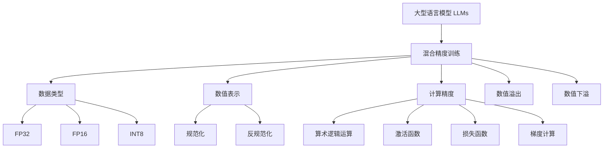

以下是题为《大语言模型原理基础与前沿 混合精度》的技术博客文章正文内容：

# 大语言模型原理基础与前沿 混合精度

## 1. 背景介绍

### 1.1 问题的由来

随着深度学习和自然语言处理技术的不断发展,大型语言模型(Large Language Models, LLMs)已成为当前人工智能领域最炙手可热的研究热点之一。作为一种基于海量文本数据训练而成的通用语言智能模型,LLMs展现出了令人惊叹的语言理解、生成和推理能力,在自然语言处理的各种下游任务中取得了卓越表现。

然而,训练如此庞大规模的语言模型不仅需要消耗大量计算资源,而且对内存和存储的需求也极为巨大。为了在保证模型性能的同时降低资源开销,提高模型的计算效率和部署友好性,研究人员提出了混合精度(Mixed Precision)训练技术。

### 1.2 研究现状

混合精度训练是指在深度神经网络训练过程中,将不同的数值精度(如FP32、FP16等)应用于不同的计算阶段,从而减少内存使用和提高计算速度。对于大型语言模型而言,混合精度训练可以极大缓解其对内存和计算资源的需求,使得训练变得更加高效。

目前,主流的深度学习框架如PyTorch和TensorFlow均已支持混合精度训练。不过,由于大型语言模型的特殊结构和训练方式,如何在保证模型性能的前提下,充分利用混合精度训练的优势,仍是一个值得深入探讨的课题。

### 1.3 研究意义

本文将系统性地介绍大型语言模型的混合精度训练技术,包括其基本原理、实现方法、性能影响因素等,并结合具体的实践案例,为读者提供一个全面而深入的认识。通过本文的学习,读者将能够:

1. 理解混合精度训练在大型语言模型中的应用价值和意义
2. 掌握混合精度训练的核心概念和算法原理
3. 熟悉混合精度训练的实现细节和优化技巧
4. 了解混合精度训练在实际场景中的应用案例

### 1.4 本文结构

本文共分为9个部分,内容安排如下:

1. 背景介绍
2. 核心概念与联系
3. 核心算法原理与具体操作步骤
4. 数学模型和公式详细讲解与举例说明
5. 项目实践:代码实例和详细解释说明
6. 实际应用场景
7. 工具和资源推荐
8. 总结:未来发展趋势与挑战
9. 附录:常见问题与解答

## 2. 核心概念与联系

在探讨大型语言模型的混合精度训练之前,我们需要先了解以下几个核心概念:

- **数据类型**: 在计算机系统中,不同的数据类型(如FP32、FP16、INT8等)占用不同的内存空间,并具有不同的数值表示范围和精度。
- **数值表示**: 浮点数在计算机中通常采用规范化和反规范化的形式进行表示和存储。
- **计算精度**: 在深度学习模型的训练过程中,不同的计算阶段(如算术逻辑运算、激活函数、损失函数、梯度计算等)对数值精度的要求也不尽相同。
- **数值溢出和下溢**: 当浮点数的值超出其数值表示范围时,就会发生数值溢出或下溢,导致精度损失或不正确的计算结果。

混合精度训练技术就是基于上述概念,在大型语言模型的训练过程中,合理分配和调度不同的数据类型和计算精度,从而在保证模型性能的前提下,最大限度地节省内存并提高计算效率。

## 3. 核心算法原理与具体操作步骤

### 3.1 算法原理概述

混合精度训练的核心思想是,在深度神经网络的前向传播(Forward Propagation)和反向传播(Backward Propagation)过程中,使用不同的数据类型和计算精度来执行不同的计算操作。

具体来说,在前向传播阶段,我们可以使用较低精度(如FP16或INT8)的数据类型进行大部分的算术逻辑运算,从而节省内存和提高计算速度。而在反向传播阶段,我们则需要使用较高精度(如FP32)的数据类型来计算梯度,以确保模型收敛的准确性。

此外,对于某些对精度要求较高的计算操作(如激活函数、损失函数等),我们也可以选择使用较高精度的数据类型,以避免精度损失导致的性能下降。

### 3.2 算法步骤详解

混合精度训练算法的具体步骤如下:

1. **数据类型转换**:在开始训练之前,将模型参数和输入数据从FP32转换为较低精度的数据类型(如FP16或INT8)。

2. **前向传播**:使用转换后的低精度数据类型执行前向传播计算,包括卷积、全连接、激活函数等操作。

3. **损失函数计算**:将前向传播的输出结果转换回FP32精度,并使用FP32精度计算损失函数值。

4. **反向传播**:使用FP32精度计算梯度,并将梯度值存储为FP32类型。

5. **模型参数更新**:使用FP32精度的梯度值更新模型参数,并将更新后的参数转换回低精度数据类型,准备进行下一轮的迭代。

在上述过程中,我们可以根据具体的模型结构和硬件条件,对不同的计算操作使用不同的数据类型和精度,从而在保证模型收敛性能的同时,最大限度地提高计算效率。

### 3.3 算法优缺点

**优点**:

- 降低内存占用,加速计算速度
- 保持模型收敛性能不受影响
- 提高模型部署的硬件友好性

**缺点**:

- 增加了数据类型转换的开销
- 对硬件的支持存在一定要求
- 需要针对具体模型结构调整配置

### 3.4 算法应用领域

混合精度训练算法可以广泛应用于各种深度学习模型的训练过程中,尤其是那些对内存和计算资源要求较高的大型模型,如:

- 计算机视觉领域的大型卷积神经网络模型
- 自然语言处理领域的大型transformer模型
- 强化学习领域的大型策略网络模型
- 推荐系统领域的大型embedding模型

除了在模型训练阶段的应用外,混合精度技术也可以用于模型推理加速,从而提高模型在生产环境中的部署效率。

## 4. 数学模型和公式详细讲解与举例说明

### 4.1 数学模型构建

在介绍混合精度训练的数学模型之前,我们先来回顾一下浮点数在计算机中的表示方式。

IEEE 754标准定义了浮点数的表示格式,其中最常用的是32位单精度浮点数(FP32)和64位双精度浮点数(FP64)。一个FP32浮点数可以表示为:

$$
x = (-1)^s \times (1 + \sum_{i=1}^{23} b_i \times 2^{-i}) \times 2^{e-127}
$$

其中:

- $s$为符号位(0表示正数,1表示负数)
- $b_i$为二进制位(0或1)
- $e$为阶码,表示指数部分,取值范围为0~255

根据上述公式,我们可以计算出FP32的数值范围约为$1.18\times 10^{-38}$到$3.40\times 10^{38}$,精度约为7位有效数字。

对于FP16浮点数,它使用1个符号位、5个阶码位和10个尾数位,总共16位。其数值范围约为$6.10\times 10^{-5}$到$6.55\times 10^{4}$,精度约为3位有效数字。

在深度学习模型的训练过程中,我们通常使用32位浮点数(FP32)来存储模型参数和进行计算。但是,对于一些对精度要求不太高的操作(如卷积、全连接等),我们可以使用16位浮点数(FP16)来代替,从而节省一半的内存空间,并提高计算速度。

### 4.2 公式推导过程

现在,我们来推导一下在混合精度训练中,如何在保证模型收敛性能的前提下,将部分计算转换为低精度。

假设我们的模型参数为$\boldsymbol{W}$,输入数据为$\boldsymbol{X}$,模型的前向传播过程可以表示为:

$$
\boldsymbol{Y} = f(\boldsymbol{W}, \boldsymbol{X})
$$

其中$f(\cdot)$代表模型的计算逻辑。

在传统的FP32训练中,我们使用32位浮点数来存储参数$\boldsymbol{W}$和输入$\boldsymbol{X}$,并执行前向传播计算。假设损失函数为$\mathcal{L}(\boldsymbol{Y}, \boldsymbol{Y}_{true})$,则反向传播的梯度计算为:

$$
\frac{\partial \mathcal{L}}{\partial \boldsymbol{W}} = \frac{\partial \mathcal{L}}{\partial \boldsymbol{Y}} \cdot \frac{\partial \boldsymbol{Y}}{\partial \boldsymbol{W}}
$$

在混合精度训练中,我们将参数$\boldsymbol{W}$和输入$\boldsymbol{X}$从FP32转换为FP16,即:

$$
\boldsymbol{W}_{fp16} = \text{convert}(\boldsymbol{W}_{fp32}, \text{FP32} \rightarrow \text{FP16})
$$
$$
\boldsymbol{X}_{fp16} = \text{convert}(\boldsymbol{X}_{fp32}, \text{FP32} \rightarrow \text{FP16})
$$

然后,我们使用FP16精度执行前向传播计算:

$$
\boldsymbol{Y}_{fp16} = f(\boldsymbol{W}_{fp16}, \boldsymbol{X}_{fp16})
$$

由于损失函数对精度要求较高,我们需要将$\boldsymbol{Y}_{fp16}$转换回FP32精度,然后计算损失值:

$$
\mathcal{L}_{fp32} = \mathcal{L}(\text{convert}(\boldsymbol{Y}_{fp16}, \text{FP16} \rightarrow \text{FP32}), \boldsymbol{Y}_{true})
$$

在反向传播阶段,我们使用FP32精度计算梯度:

$$
\frac{\partial \mathcal{L}_{fp32}}{\partial \boldsymbol{W}_{fp32}} = \frac{\partial \mathcal{L}_{fp32}}{\partial \boldsymbol{Y}_{fp32}} \cdot \frac{\partial \boldsymbol{Y}_{fp32}}{\partial \boldsymbol{W}_{fp32}}
$$

最后,我们使用FP32精度的梯度值更新模型参数$\boldsymbol{W}_{fp32}$,并将更新后的参数转换回FP16,以便进行下一轮迭代。

通过上述推导,我们可以看到,在混合精度训练中,我们将大部分的计算转换为低精度(FP16),而只在关键步骤(如损失函数计算和梯度计算)中使用高精度(FP32),从而在保证模型收敛性能的同时,提高了计算效率和内存利用率。

### 4.3 案例分析与讲解

为了更好地理解混合精度训练的原理和实践,我们来分析一个基于Transformer的大型语言模型案例。

假设我们有一个包含12层Transformer解码器的语言模型,每一层解码器包含一个多头注意力机制(Multi-Head Attention)和一个