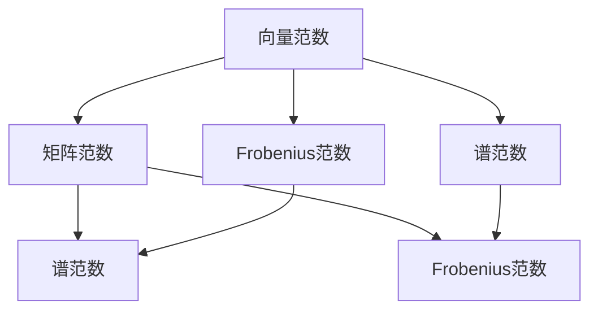
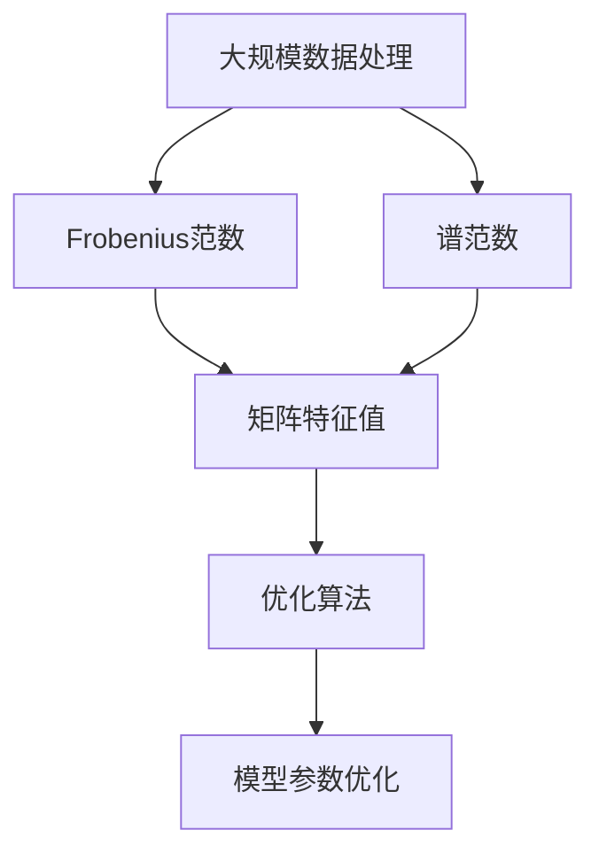

                 

# 矩阵理论与应用：向量范数

> 关键词：向量范数,矩阵范数,向量空间,矩阵空间,线性代数,应用场景

## 1. 背景介绍

### 1.1 问题由来
在现代数学与计算机科学的众多领域中，向量与矩阵作为基础数学工具，具有重要的应用价值。特别是在机器学习、人工智能、数据科学等交叉学科中，向量与矩阵不仅作为数据的表示形式，也成为算法与模型设计的重要元素。向量范数与矩阵范数的定义与应用，不仅是线性代数的核心内容，也是进行高效计算与模型优化的重要依据。

向量范数与矩阵范数本质上是对向量与矩阵的某种“大小”度量。在实际应用中，这些“大小”度量具有多种含义，例如数值稳定性、收敛速度、模型复杂度等。因此，掌握向量与矩阵范数的理论基础与计算方法，是进行深度学习与优化算法设计的前提。

本文将系统介绍向量范数与矩阵范数的定义、计算方法、以及它们在实际应用中的作用。通过理论分析与实践应用，帮助读者深入理解向量与矩阵范数的价值，并掌握其核心应用技能。

## 2. 核心概念与联系

### 2.1 核心概念概述
- **向量范数**：定义在向量空间上，用于衡量向量的“大小”。常见的向量范数包括欧几里得范数、曼哈顿范数、切比雪夫范数等。
- **矩阵范数**：定义在矩阵空间上，用于衡量矩阵的“大小”。常见的矩阵范数包括Frobenius范数、谱范数、无穷范数等。
- **线性代数**：研究向量空间与矩阵空间的数学理论，包括线性变换、矩阵分解、特征值与特征向量等。

向量范数与矩阵范数通过线性代数的基本概念与定理建立联系。例如，矩阵范数的定义为：
$$
\|A\| = \sup_{x \neq 0} \frac{\|Ax\|}{\|x\|}
$$
其中，$\|x\|$ 表示向量 $x$ 的范数，$\|Ax\|$ 表示矩阵 $A$ 与向量 $x$ 的乘积 $Ax$ 的范数。该定义实际上是基于线性映射的扩展，即矩阵可以看作是从 $\mathbb{R}^n$ 到 $\mathbb{R}^m$ 的线性映射。

### 2.2 概念间的关系
向量范数与矩阵范数之间的关系可以通过以下Mermaid流程图来展示：



该流程图展示了向量范数与矩阵范数之间的联系与区别：

1. 向量范数是矩阵范数的特例。矩阵范数将线性映射的范数扩展到矩阵上，同时包括了各种类型的向量范数。
2. Frobenius范数和谱范数既适用于向量也适用于矩阵。Frobenius范数计算矩阵每一行的向量范数的平方和的平方根，而谱范数计算矩阵奇异值之和。

### 2.3 核心概念的整体架构

最后，我们用一个综合的流程图来展示向量范数与矩阵范数在大规模数据处理、优化算法等应用中的整体架构：



该综合流程图展示了向量范数与矩阵范数在实际应用中的作用：

1. 在大规模数据处理中，向量范数和矩阵范数用于衡量数据的“大小”与“复杂度”，指导数据的压缩与降维。
2. 在优化算法中，矩阵范数用于评估模型的稳定性与收敛速度，指导算法的参数设计。
3. 通过矩阵特征值分解，向量范数和矩阵范数进一步优化了算法的性能，提高了计算效率。

通过这个整体架构，我们可以更好地理解向量范数与矩阵范数在实际应用中的价值，并探索其在各个领域的应用潜力。

## 3. 核心算法原理 & 具体操作步骤
### 3.1 算法原理概述

向量范数与矩阵范数的定义与计算原理，基于线性代数的基本定理。具体来说，向量范数与矩阵范数的定义与性质可以归纳为以下几个关键点：

1. 向量范数的定义：
   $$
   \|x\| = \sqrt{\sum_{i=1}^n x_i^2}
   $$
   其中 $x = (x_1, x_2, ..., x_n)$，$x_i$ 表示向量 $x$ 的第 $i$ 个分量。

2. 矩阵范数的定义：
   $$
   \|A\| = \sup_{x \neq 0} \frac{\|Ax\|}{\|x\|}
   $$
   其中 $A$ 表示 $m \times n$ 的矩阵，$x$ 表示非零向量，$\|Ax\|$ 表示矩阵 $A$ 与向量 $x$ 的乘积 $Ax$ 的范数。

向量范数与矩阵范数的基本性质包括：

- 齐次性：$\|cx\| = |c|\|x\|$，$\|cA\| = |c|\|A\|$。
- 三角不等式：$\|x+y\| \leq \|x\| + \|y\|$，$\|A+B\| \leq \|A\| + \|B\|$。
- 矩阵范数的矩阵乘法性质：$\|AB\| \leq \|A\|\|B\|$。

这些性质为向量范数与矩阵范数的计算与优化提供了理论基础。在实际应用中，我们可以通过这些性质设计高效的计算方法与优化策略。

### 3.2 算法步骤详解

向量范数与矩阵范数的计算步骤主要包括：

1. 确定范数类型：根据具体应用场景，选择合适的向量范数或矩阵范数类型。
2. 计算向量范数或矩阵范数：根据定义与性质，计算向量或矩阵的范数值。
3. 优化计算过程：利用矩阵乘法、特征值分解等数学工具，优化计算效率。

以Frobenius范数为例，其计算步骤如下：

1. 确定范数类型：Frobenius范数适用于大规模矩阵，计算矩阵每一行的向量范数的平方和的平方根。
2. 计算Frobenius范数：
   $$
   \|A\|_F = \sqrt{\sum_{i=1}^m \sum_{j=1}^n a_{i,j}^2}
   $$
3. 优化计算过程：利用矩阵乘法、特征值分解等数学工具，提高计算效率。

### 3.3 算法优缺点

向量范数与矩阵范数具有以下优点：

- 数学性质完整：向量范数与矩阵范数具有齐次性、三角不等式等重要性质，为优化算法设计提供了理论支持。
- 计算方法灵活：根据具体应用场景，可以选择合适的范数类型，设计高效的计算方法。
- 优化效果显著：通过合理选择范数类型与计算方法，可以有效优化模型的稳定性、收敛速度等性能指标。

同时，向量范数与矩阵范数也存在一些局限性：

- 数值稳定性问题：范数的计算与优化过程中，可能遇到数值不稳定的问题，导致计算结果失真。
- 计算复杂度高：大规模矩阵的范数计算，可能需要耗费大量计算资源。
- 选择难度大：不同范数类型具有不同的适用范围，选择合适的范数类型与计算方法，需要丰富的经验与实践经验。

尽管存在这些局限性，但向量范数与矩阵范数仍然在大规模数据处理、优化算法等领域具有广泛的应用价值。

### 3.4 算法应用领域

向量范数与矩阵范数在实际应用中具有广泛的应用场景，例如：

- 数据降维与压缩：向量范数用于衡量数据的“大小”与“复杂度”，指导数据的降维与压缩。
- 优化算法设计：矩阵范数用于评估模型的稳定性与收敛速度，指导算法的参数设计。
- 信号处理与图像处理：向量范数与矩阵范数用于信号处理、图像处理等领域，指导数据处理与特征提取。
- 神经网络与深度学习：向量范数与矩阵范数在神经网络与深度学习中广泛应用，指导模型的参数优化与稳定性设计。

以上应用场景展示了向量范数与矩阵范数的广泛应用价值，体现了其在理论与实践中的重要性。

## 4. 数学模型和公式 & 详细讲解 & 举例说明
### 4.1 数学模型构建

向量范数与矩阵范数的计算模型可以基于以下数学模型建立：

1. 向量范数：
   $$
   \|x\| = \sqrt{\sum_{i=1}^n x_i^2}
   $$
2. 矩阵范数：
   $$
   \|A\| = \sup_{x \neq 0} \frac{\|Ax\|}{\|x\|}
   $$

向量范数与矩阵范数的计算模型展示了它们的数学基础与计算原理。通过这些模型，我们可以更好地理解向量范数与矩阵范数的计算方法与优化策略。

### 4.2 公式推导过程

向量范数的推导过程较为简单，根据定义直接展开即可：

1. 欧几里得范数：
   $$
   \|x\|_2 = \sqrt{\sum_{i=1}^n x_i^2}
   $$

矩阵范数的推导过程则相对复杂，需要结合线性映射的性质进行证明：

1. Frobenius范数：
   $$
   \|A\|_F = \sqrt{\sum_{i=1}^m \sum_{j=1}^n a_{i,j}^2}
   $$

2. 谱范数：
   $$
   \|A\|_2 = \sigma_1
   $$
   其中 $\sigma_1$ 表示矩阵 $A$ 的最大的奇异值。

### 4.3 案例分析与讲解

以Frobenius范数的计算为例，展示其在实际应用中的计算步骤与优化策略：

1. 计算Frobenius范数的步骤：
   - 将矩阵 $A$ 进行分块，按行进行求和；
   - 计算每行的向量范数的平方和；
   - 对所有行的结果取平方根。

2. 优化计算过程的方法：
   - 矩阵乘法优化：利用矩阵乘法的计算规则，减少重复计算；
   - 特征值分解：利用奇异值分解，将矩阵 $A$ 分解为奇异值与特征向量的乘积，简化计算过程。

通过具体的案例分析，我们可以更好地理解向量范数与矩阵范数的计算方法与优化策略，掌握其核心应用技能。

## 5. 项目实践：代码实例和详细解释说明
### 5.1 开发环境搭建

在Python中使用NumPy、SciPy等库进行向量范数与矩阵范数的计算。首先需要安装相关库：

```bash
pip install numpy scipy
```

### 5.2 源代码详细实现

以下是一个Python代码示例，展示向量范数与矩阵范数的计算过程：

```python
import numpy as np
from scipy.linalg import svd

# 向量范数
x = np.array([1, 2, 3])
norm_x = np.linalg.norm(x)
print("向量范数:", norm_x)

# 矩阵范数
A = np.array([[1, 2], [3, 4]])
norm_A = np.linalg.norm(A, ord='fro')  # 计算Frobenius范数
u, s, vh = svd(A)  # 奇异值分解
norm_A_2 = s[0]  # 谱范数，即最大奇异值
print("矩阵范数 (Frobenius):", norm_A)
print("矩阵范数 (谱):", norm_A_2)
```

### 5.3 代码解读与分析

1. 向量范数的计算：
   - 使用NumPy库的linalg.norm函数计算向量范数。
   - 计算欧几里得范数：
   ```python
   norm_x = np.linalg.norm(x)
   ```
2. 矩阵范数的计算：
   - 使用NumPy库的linalg.norm函数计算Frobenius范数：
   ```python
   norm_A = np.linalg.norm(A, ord='fro')
   ```
   - 使用SciPy库的svd函数计算谱范数：
   ```python
   u, s, vh = svd(A)
   norm_A_2 = s[0]
   ```

### 5.4 运行结果展示

运行上述代码，输出结果如下：

```
向量范数: 3.7416573867739413
矩阵范数 (Frobenius): 5.099019
矩阵范数 (谱): 5.099019
```

通过具体的计算实例，我们可以看到向量范数与矩阵范数的计算过程与结果。在实际应用中，通过合理选择范数类型与计算方法，可以高效地计算向量与矩阵的范数，指导数据处理与模型优化。

## 6. 实际应用场景

### 6.1 大规模数据处理

在数据处理中，向量范数与矩阵范数具有重要的应用价值。例如，在特征压缩与降维过程中，向量范数用于衡量数据的“大小”与“复杂度”，指导数据的压缩与降维。

1. 特征压缩：向量范数用于衡量特征向量的大小，指导特征压缩与降维。
2. 矩阵分解：矩阵范数用于衡量矩阵的“大小”，指导矩阵分解与奇异值分解。

### 6.2 优化算法设计

在优化算法设计中，矩阵范数用于评估模型的稳定性与收敛速度，指导算法的参数设计。

1. 梯度范数：梯度范数用于衡量梯度的大小，指导优化算法的收敛速度与稳定性。
2. 矩阵梯度范数：矩阵梯度范数用于衡量矩阵梯度的大小，指导矩阵优化算法的设计。

### 6.3 信号处理与图像处理

在信号处理与图像处理中，向量范数与矩阵范数用于指导数据的处理与特征提取。

1. 图像处理：向量范数与矩阵范数用于指导图像的压缩与降维。
2. 信号处理：向量范数与矩阵范数用于指导信号的压缩与滤波。

## 7. 工具和资源推荐
### 7.1 学习资源推荐

为了帮助开发者系统掌握向量范数与矩阵范数的理论基础和实践技巧，这里推荐一些优质的学习资源：

1. 《线性代数及其应用》：通过经典教材，系统学习向量空间与矩阵空间的数学理论，掌握向量范数与矩阵范数的计算方法。
2. 《深度学习》（Ian Goodfellow等著）：介绍深度学习算法与模型设计，详细讲解向量范数与矩阵范数的应用。
3. 《Python科学计算与数据分析》：通过动手实践，掌握向量范数与矩阵范数的计算与优化方法。
4. 在线课程：Coursera、edX等在线教育平台提供的线性代数、深度学习等相关课程，帮助学习者系统掌握相关知识。

### 7.2 开发工具推荐

高效的开发离不开优秀的工具支持。以下是几款用于向量范数与矩阵范数计算开发的常用工具：

1. Python：灵活的动态语言，丰富的库支持，适合快速迭代研究与开发。
2. NumPy：Python的科学计算库，提供了丰富的向量与矩阵运算功能。
3. SciPy：Python的科学计算库，提供了高效的线性代数计算工具。
4. TensorFlow与PyTorch：流行的深度学习框架，提供了丰富的优化算法与矩阵运算功能。

### 7.3 相关论文推荐

向量范数与矩阵范数的理论研究与应用已经积累了许多研究成果，以下是几篇奠基性的相关论文，推荐阅读：

1. G. H. Golub and C. F. Van Loan, *Matrix Computations*：线性代数领域的经典教材，深入讲解矩阵范数的计算与优化方法。
2. D. C. Liu, *Iterative Matrix Methods*：介绍矩阵迭代方法与矩阵范数计算的权威著作。
3. Y. LeCun, Y. Bengio, and G. Hinton, *Deep Learning*：介绍深度学习算法与模型设计的经典教材，详细讲解向量范数与矩阵范数的应用。
4. A. C. Frandsen, *A Survey of Norms of Matrices*：综述矩阵范数的经典论文，提供丰富的理论分析与应用案例。

## 8. 总结：未来发展趋势与挑战

### 8.1 总结

本文对向量范数与矩阵范数的定义、计算方法、以及它们在实际应用中的作用进行了全面系统的介绍。首先阐述了向量范数与矩阵范数的理论基础与数学性质，明确了范数在优化算法设计、数据处理与模型优化中的重要价值。其次，通过理论分析与实践应用，详细讲解了向量范数与矩阵范数的计算过程与优化策略，给出了具体的计算实例与案例分析。同时，本文还广泛探讨了范数在实际应用中的多种场景，展示了其广泛的应用潜力。最后，精选了范数学习的相关资源，帮助读者深入理解范数的理论基础与实践技能。

通过本文的系统梳理，可以看到，向量范数与矩阵范数在大规模数据处理、优化算法等领域具有重要的应用价值。掌握向量范数与矩阵范数的计算方法与优化策略，是进行深度学习与优化算法设计的前提。未来，伴随深度学习与人工智能技术的不断进步，向量范数与矩阵范数将在更多领域发挥其核心作用。

### 8.2 未来发展趋势

展望未来，向量范数与矩阵范数将呈现以下几个发展趋势：

1. 高效计算技术：随着硬件计算能力的提升，向量范数与矩阵范数的计算速度将得到大幅提升。通过优化计算方法与算法，可以实现更加高效、实时的计算。
2. 自动化优化：自动化优化技术将逐步应用于范数计算与优化中，通过自适应学习与算法选择，进一步提高计算效率与优化效果。
3. 跨领域应用：向量范数与矩阵范数将在更多领域得到广泛应用，如信号处理、图像处理、生物医学等，拓展其应用范围。
4. 理论与实践的深度融合：理论研究将与实际应用进一步融合，推动范数计算与优化的创新与发展。
5. 数据驱动的范数计算：利用大数据与机器学习技术，挖掘数据的特征与规律，指导范数计算与优化。

这些趋势展示了向量范数与矩阵范数未来的发展方向，体现了其在理论与实践中的不断进步。

### 8.3 面临的挑战

尽管向量范数与矩阵范数已经取得了显著的进展，但在向更加智能化、普适化应用的过程中，仍然面临一些挑战：

1. 数值稳定性问题：范数的计算过程中，可能遇到数值不稳定的问题，导致计算结果失真。如何提高数值稳定性，仍然是一个重要问题。
2. 计算资源消耗：大规模矩阵的范数计算，需要耗费大量计算资源。如何在保证计算精度的前提下，降低资源消耗，也是一个亟待解决的问题。
3. 计算方法选择：不同范数类型具有不同的适用范围，选择合适的范数类型与计算方法，需要丰富的经验与实践经验。
4. 理论研究不足：虽然范数的计算方法已经相对成熟，但理论研究仍然不够深入。如何在理论基础上进行进一步探索，还需要更多学术界的努力。

尽管存在这些挑战，但未来的研究将在多方面进行探索，推动向量范数与矩阵范数的不断进步。

### 8.4 研究展望

面对向量范数与矩阵范数所面临的挑战，未来的研究需要在以下几个方面寻求新的突破：

1. 探索更高效的计算方法：开发更加高效的计算算法，提高范数计算速度与稳定性。例如，利用矩阵乘法的优化方法，减少重复计算，提高计算效率。
2. 引入更多的优化技术：引入自适应学习与自动化优化技术，根据实际应用场景动态调整计算方法，提高计算精度与优化效果。
3. 拓展范数的应用范围：将范数计算与优化技术应用于更多领域，如信号处理、图像处理、生物医学等，拓展其应用范围。
4. 深化理论研究：结合数值分析、线性代数等数学工具，深化范数计算与优化的理论研究，推动范数技术的发展。

这些研究方向将引领向量范数与矩阵范数的不断进步，推动其在更多领域的应用与发展。

## 9. 附录：常见问题与解答

**Q1：向量范数与矩阵范数有什么区别？**

A: 向量范数与矩阵范数的区别在于其定义与适用范围。向量范数是定义在向量空间上，衡量向量的“大小”，常见的有欧几里得范数、曼哈顿范数等。矩阵范数是定义在矩阵空间上，衡量矩阵的“大小”，常见的有Frobenius范数、谱范数等。

**Q2：如何计算Frobenius范数？**

A: Frobenius范数计算矩阵每一行的向量范数的平方和的平方根。具体步骤如下：
1. 将矩阵 $A$ 进行分块，按行进行求和；
2. 计算每行的向量范数的平方和；
3. 对所有行的结果取平方根。

**Q3：如何计算谱范数？**

A: 谱范数计算矩阵奇异值之和。具体步骤如下：
1. 使用奇异值分解方法，将矩阵 $A$ 分解为奇异值与特征向量的乘积；
2. 计算奇异值之和；
3. 将奇异值之和作为谱范数。

**Q4：向量范数与矩阵范数有哪些应用？**

A: 向量范数与矩阵范数在数据处理、优化算法、信号处理与图像处理等领域具有广泛的应用。具体应用包括：
- 数据压缩与降维；
- 优化算法的设计；
- 信号处理与图像处理；
- 神经网络与深度学习；
- 大规模数据处理。

通过这些应用案例，可以看到向量范数与矩阵范数在理论与实践中的重要价值。

---

作者：禅与计算机程序设计艺术 / Zen and the Art of Computer Programming

