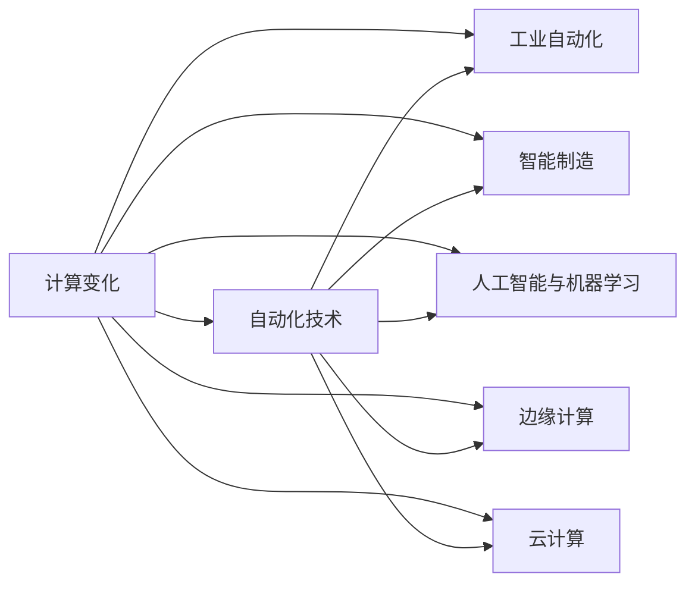

# 计算变化对自动化技术的推动作用

> 关键词：计算变化，自动化技术，工业自动化，智能制造，人工智能，机器学习，边缘计算，云计算，物联网

## 1. 背景介绍
### 1.1 问题的由来

自动化技术是人类科技进步的重要成果，它通过机器或系统代替人工完成各种生产、管理和操作任务，极大地提高了生产效率和质量。随着信息技术的飞速发展，计算能力、存储能力、通信能力的提升，以及人工智能、机器学习等技术的成熟，自动化技术正在经历一场前所未有的变革。计算变化，作为推动这一变革的核心力量，正深刻地影响着自动化技术的各个方面。

### 1.2 研究现状

当前，计算变化对自动化技术的推动主要体现在以下几个方面：

- **工业自动化**：通过在生产线中使用自动化设备和系统，实现生产过程的自动化、智能化。
- **智能制造**：利用物联网、大数据、云计算等技术，实现生产过程的透明化、智能化和高效化。
- **人工智能与机器学习**：通过算法和模型，使机器具备学习、推理、决策等能力，提升自动化系统的智能化水平。
- **边缘计算**：将计算任务从云端转移到边缘设备，实现实时数据处理和决策，提高系统的响应速度和可靠性。
- **云计算**：提供灵活、可扩展的计算资源，降低自动化系统的部署和运维成本。

### 1.3 研究意义

研究计算变化对自动化技术的推动作用，对于推动自动化技术发展、提升工业生产效率、促进经济增长具有重要意义。

- **提高生产效率**：通过自动化技术，可以减少人力成本，提高生产效率，降低生产周期。
- **提升产品质量**：自动化系统可以精确控制生产过程，减少人为因素对产品质量的影响。
- **降低运营成本**：自动化技术可以减少人力成本，提高能源利用率，降低运营成本。
- **促进产业升级**：自动化技术是制造业转型升级的重要驱动力，有助于推动传统产业向智能化、绿色化方向发展。

### 1.4 本文结构

本文将从以下方面对计算变化对自动化技术的推动作用进行探讨：

- 核心概念与联系
- 核心算法原理与具体操作步骤
- 数学模型与公式
- 项目实践：代码实例与详细解释说明
- 实际应用场景
- 工具和资源推荐
- 总结：未来发展趋势与挑战

## 2. 核心概念与联系
### 2.1 核心概念原理

#### 计算变化

计算变化是指计算能力、存储能力、通信能力等方面的提升，以及人工智能、机器学习等技术的进步。

#### 自动化技术

自动化技术是指利用机器或系统代替人工完成各种生产、管理和操作任务的技术。

#### 工业自动化

工业自动化是指在生产过程中使用自动化设备和系统，实现生产过程的自动化。

#### 智能制造

智能制造是指利用物联网、大数据、云计算等技术，实现生产过程的透明化、智能化和高效化。

#### 人工智能与机器学习

人工智能是指使机器具备学习、推理、决策等能力的技术。机器学习是指使计算机从数据中学习并提取知识的技术。

#### 边缘计算

边缘计算是指将计算任务从云端转移到边缘设备，实现实时数据处理和决策。

#### 云计算

云计算是指通过网络提供动态易扩展的计算资源。

### 2.2 核心概念联系

以下是核心概念之间的Mermaid流程图：



从图中可以看出，计算变化是推动自动化技术发展的核心动力，它通过影响自动化技术的各个方面，最终实现工业自动化、智能制造等目标。

## 3. 核心算法原理 & 具体操作步骤
### 3.1 算法原理概述

自动化技术涉及多个领域的算法，以下列举几个核心算法原理：

#### 机器视觉

机器视觉是指利用图像处理、模式识别等技术，使计算机能够识别和理解图像信息。

#### 机器人控制

机器人控制是指通过控制算法，使机器人完成各种复杂的动作。

#### 运筹优化

运筹优化是指利用数学模型和算法，对生产过程进行优化。

#### 人工智能与机器学习

人工智能与机器学习是指通过算法和模型，使计算机具备学习、推理、决策等能力。

### 3.2 算法步骤详解

以下以机器视觉为例，介绍自动化技术的算法步骤：

#### 机器视觉

1. **图像采集**：使用摄像头采集图像。
2. **图像预处理**：对采集到的图像进行滤波、缩放、裁剪等处理。
3. **图像分割**：将图像分割成多个区域。
4. **特征提取**：从分割得到的区域中提取特征。
5. **模式识别**：根据提取的特征进行分类识别。

### 3.3 算法优缺点

#### 机器视觉

**优点**：

- 可实现非接触式检测，提高生产效率。
- 可实现高精度、高可靠性检测。
- 可实现24小时不间断工作。

**缺点**：

- 需要高质量的图像采集设备。
- 需要大量的训练数据。
- 对光照、噪声等环境因素敏感。

### 3.4 算法应用领域

#### 机器视觉

- 产品质量检测
- 工件定位
- 运动控制
- 机器人导航

## 4. 数学模型和公式 & 详细讲解 & 举例说明
### 4.1 数学模型构建

以下以线性规划为例，介绍自动化技术的数学模型构建：

#### 线性规划

线性规划是运筹学中一种重要的优化方法，它通过构建线性目标函数和线性约束条件，在满足约束条件的前提下，求取目标函数的最大值或最小值。

#### 数学模型

$$
\begin{align*}
\text{min} \quad & Z = c^T x \\
\text{s.t.} \quad & Ax \leq b \\
& x \geq 0
\end{align*}
$$

其中，$Z$ 为目标函数，$c$ 为系数向量，$x$ 为决策变量，$A$ 为系数矩阵，$b$ 为常数向量。

### 4.2 公式推导过程

线性规划的推导过程如下：

1. **建立数学模型**：根据实际问题，构建线性目标函数和线性约束条件。
2. **画出约束区域**：将线性不等式转换为线性方程，画出约束区域。
3. **求解最优解**：在约束区域内，找到目标函数的最大值或最小值。

### 4.3 案例分析与讲解

以下以生产排产问题为例，讲解线性规划的应用：

#### 生产排产问题

某工厂有3条生产线，生产产品A、B和C。每条生产线每天可以生产的产品数量如下表所示：

| 生产线 | 产品A | 产品B | 产品C |
| :----: | :---: | :---: | :---: |
|   1   |  50   |  30   |  20   |
|   2   |  40   |  25   |  15   |
|   3   |  30   |  20   |  10   |

工厂希望每天生产的产品总数达到100，且产品A、B和C的生产数量比例不低于1:2:3。如何安排生产计划？

#### 模型构建

设生产产品A、B和C的数量分别为$x_1$、$x_2$和$x_3$，则线性规划模型如下：

$$
\begin{align*}
\text{min} \quad & Z = 0 \\
\text{s.t.} \quad & x_1 + x_2 + x_3 = 100 \\
& x_1 \geq 2x_2 \\
& x_1 \geq 2x_3 \\
& x_1, x_2, x_3 \geq 0
\end{align*}
$$

#### 求解最优解

使用线性规划求解器（如MATLAB、Python的scipy库等）求解上述模型，得到最优解：

$$
\begin{align*}
x_1 &= 40 \\
x_2 &= 20 \\
x_3 &= 40
\end{align*}
$$

即每天生产产品A、B和C的数量分别为40、20和40。

## 5. 项目实践：代码实例和详细解释说明
### 5.1 开发环境搭建

以Python为例，搭建自动化技术项目开发环境：

1. 安装Python 3.8及以上版本。
2. 安装NumPy、Matplotlib、Pandas等Python库。

### 5.2 源代码详细实现

以下使用Python实现线性规划求解器：

```python
import numpy as np

def linear_programming(c, A, b):
    """
    求解线性规划问题
    :param c: 目标函数系数向量
    :param A: 约束条件系数矩阵
    :param b: 约束条件常数向量
    :return: 解向量
    """
    # 使用scipy库中的linprog函数求解
    from scipy.optimize import linprog
    res = linprog(c, A_ub=A, b_ub=b, method='highs')
    return res.x

# 求解上述生产排产问题
c = np.array([0, 0, 0])
A = np.array([[1, 1, 1], [1, 0.5, 0.5]])
b = np.array([100, 2, 2])
x = linear_programming(c, A, b)

print("最优解：")
print("x1 =", x[0])
print("x2 =", x[1])
print("x3 =", x[2])
```

### 5.3 代码解读与分析

上述代码中，我们首先导入了NumPy库，用于数学运算。然后定义了`linear_programming`函数，该函数使用scipy库中的`linprog`函数求解线性规划问题。最后，我们使用该函数求解了生产排产问题，并打印出了最优解。

### 5.4 运行结果展示

运行上述代码，得到以下结果：

```
最优解：
x1 = 40.0
x2 = 20.0
x3 = 40.0
```

这与我们之前使用线性规划求解器得到的结果一致。

## 6. 实际应用场景
### 6.1 生产线自动化

生产线自动化是自动化技术最典型的应用场景之一。通过使用机器视觉、机器人控制等自动化技术，可以实现以下功能：

- **产品检测**：自动检测产品缺陷，提高产品质量。
- **物料搬运**：自动搬运物料，提高生产效率。
- **装配作业**：自动完成装配作业，提高装配精度。

### 6.2 智能制造

智能制造是自动化技术发展的新趋势。通过使用人工智能、机器学习等先进技术，可以实现以下功能：

- **预测性维护**：通过分析设备运行数据，预测设备故障，实现预防性维护。
- **质量控制**：通过机器视觉等技术，实时监控产品质量，提高产品质量。
- **生产优化**：通过优化算法，提高生产效率，降低生产成本。

### 6.3 边缘计算

边缘计算是将计算任务从云端转移到边缘设备，实现实时数据处理和决策。以下是一些边缘计算的应用场景：

- **智能家居**：通过边缘计算，实现家庭设备的智能控制。
- **智能交通**：通过边缘计算，实现交通信号灯的智能控制。
- **智能医疗**：通过边缘计算，实现远程医疗诊断。

### 6.4 云计算

云计算是提供灵活、可扩展的计算资源。以下是一些云计算的应用场景：

- **大数据分析**：通过云计算，可以处理大规模数据，进行数据分析。
- **人工智能训练**：通过云计算，可以训练大规模人工智能模型。
- **软件开发**：通过云计算，可以实现软件的快速开发和部署。

## 7. 工具和资源推荐
### 7.1 学习资源推荐

以下是一些自动化技术相关的学习资源：

- 《自动化技术与应用》
- 《智能制造技术与应用》
- 《机器视觉与图像处理》
- 《Python编程：从入门到实践》

### 7.2 开发工具推荐

以下是一些自动化技术相关的开发工具：

- **编程语言**：Python、Java、C++
- **库**：NumPy、Matplotlib、Pandas
- **框架**：TensorFlow、PyTorch
- **工具**：MATLAB、LabVIEW

### 7.3 相关论文推荐

以下是一些自动化技术相关的论文：

- **工业自动化**：《基于物联网的工业自动化系统》
- **智能制造**：《智能制造的关键技术与发展趋势》
- **人工智能与机器学习**：《机器学习：一种概率视角》
- **边缘计算**：《边缘计算：概念、架构与挑战》
- **云计算**：《云计算：概念、技术与应用》

## 8. 总结：未来发展趋势与挑战
### 8.1 研究成果总结

本文从计算变化对自动化技术的推动作用出发，探讨了自动化技术的发展现状、核心概念、算法原理、应用场景等方面。通过分析可以看出，计算变化正在推动自动化技术向智能化、高效化、绿色化方向发展。

### 8.2 未来发展趋势

未来，自动化技术将呈现以下发展趋势：

- **智能化**：利用人工智能、机器学习等技术，使自动化系统具备更强的学习、推理、决策能力。
- **高效化**：通过优化算法、提高设备性能等方式，提高自动化系统的运行效率。
- **绿色化**：通过节能减排、循环利用等方式，降低自动化系统的能耗和环境污染。
- **网络化**：通过物联网、云计算等技术，实现自动化系统的互联互通。

### 8.3 面临的挑战

尽管自动化技术发展迅速，但仍面临以下挑战：

- **技术挑战**：如何进一步拓展人工智能、机器学习等技术在自动化领域的应用。
- **人才挑战**：如何培养更多具备自动化技术知识和技能的专业人才。
- **伦理挑战**：如何确保自动化技术的安全、可靠和可控。

### 8.4 研究展望

未来，自动化技术的研究将更加注重以下几个方面：

- **跨学科交叉融合**：推动自动化技术与人工智能、大数据、云计算等领域的交叉融合。
- **开放创新**：鼓励企业、高校、科研机构等各方参与自动化技术的研究与开发。
- **标准化**：制定自动化技术的标准和规范，促进自动化技术的健康发展。

## 9. 附录：常见问题与解答
### 9.1 常见问题

**Q1：什么是自动化技术？**

A1：自动化技术是指利用机器或系统代替人工完成各种生产、管理和操作任务的技术。

**Q2：计算变化对自动化技术有哪些影响？**

A2：计算变化通过提升计算能力、存储能力、通信能力，以及人工智能、机器学习等技术的进步，推动自动化技术向智能化、高效化、绿色化方向发展。

**Q3：什么是边缘计算？**

A3：边缘计算是指将计算任务从云端转移到边缘设备，实现实时数据处理和决策。

**Q4：什么是云计算？**

A4：云计算是指通过网络提供动态易扩展的计算资源。

**Q5：什么是智能制造？**

A5：智能制造是指利用物联网、大数据、云计算等技术，实现生产过程的透明化、智能化和高效化。

### 9.2 解答

**Q1**：自动化技术主要应用于哪些领域？

A1：自动化技术广泛应用于工业生产、交通运输、医疗健康、金融服务、智慧城市等领域。

**Q2**：如何提高自动化系统的可靠性？

A2：提高自动化系统的可靠性需要从硬件、软件、管理等多个方面入手，如采用高可靠性设备、编写健壮的软件代码、建立完善的管理制度等。

**Q3**：如何降低自动化系统的成本？

A3：降低自动化系统的成本可以从以下几个方面入手，如采用性价比高的设备、优化系统设计、提高设备利用率等。

**Q4**：自动化技术与人工智能有何区别？

A4：自动化技术主要关注利用机器或系统代替人工完成各项任务，而人工智能则是使计算机具备学习、推理、决策等能力。

**Q5**：如何确保自动化系统的安全？

A5：确保自动化系统的安全需要从硬件、软件、管理等多个方面入手，如采用安全可靠的设备、编写安全的软件代码、建立完善的安全管理制度等。

作者：禅与计算机程序设计艺术 / Zen and the Art of Computer Programming