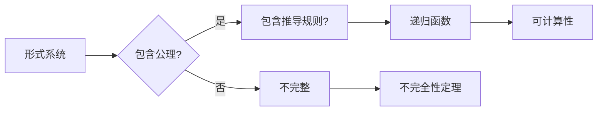

> 关键词：计算理论，哥德尔不完全性定理，可计算性，自指悖论，形式系统，逻辑，递归函数

# 计算：第三部分 计算理论的形成 第 7 章 计算不能做什么：终结者哥德尔 哥德尔证明

## 1. 背景介绍

自19世纪末以来，随着逻辑学和数学的发展，计算理论逐渐形成。这一理论不仅为我们理解计算机的能力和局限性提供了框架，也揭示了人类智慧与机器智能之间的深刻差异。在本章中，我们将深入探讨哥德尔的不完全性定理，这一对计算理论产生深远影响的里程碑式成果。

### 1.1 问题的由来

20世纪初，数学家们开始对数学的本质和基础进行深入思考。逻辑学家和哲学家们试图通过建立形式化的数学体系来确保数学的严谨性和无矛盾性。然而，这种努力很快遇到了挑战。

### 1.2 研究现状

哥德尔的不完全性定理是这一领域的标志性成果，它指出，在任何足够强大的形式化数学系统中，都存在一些命题既不能被证明也不能被推翻。这一发现不仅对数学哲学产生了深远影响，也对计算理论的发展产生了重要启示。

### 1.3 研究意义

哥德尔的不完全性定理揭示了计算理论的边界，帮助我们理解哪些问题是计算机可以解决的，哪些问题超出了计算机的能力范围。这一理论对人工智能、逻辑学、计算机科学和哲学等领域都产生了深远的影响。

### 1.4 本文结构

本章将分为以下几个部分：
- 介绍计算理论和哥德尔不完全性定理的核心概念。
- 阐述哥德尔不完全性定理的原理和推导过程。
- 分析哥德尔不完全性定理的应用和影响。
- 讨论哥德尔不完全性定理对计算理论未来发展的启示。

## 2. 核心概念与联系

### 2.1 核心概念

- **形式系统**：由一组符号、公理和推导规则组成的系统，用于表达和证明数学命题。
- **递归函数**：一种能够被计算函数，其定义可以由有限步骤的程序描述。
- **可计算性**：一个函数是否可以被计算机计算，即是否存在一个算法能够生成该函数的值。
- **哥德尔不完全性定理**：在足够强大的形式化数学系统中，存在一些命题既不能被证明也不能被推翻。

### 2.2 Mermaid 流程图



## 3. 核心算法原理 & 具体操作步骤

### 3.1 算法原理概述

哥德尔的不完全性定理主要分为两个部分：第一不完备性定理和第二不完备性定理。第一定理指出，在足够强大的形式化数学系统中，存在一些命题既不能被证明也不能被推翻。第二定理则进一步指出，任何这样的系统都不能证明其自身的无矛盾性。

### 3.2 算法步骤详解

#### 3.2.1 第一不完备性定理

1. 选择一个足够强大的形式化数学系统，包含基本的算术和逻辑规则。
2. 构建一个自指命题，该命题陈述自身不可证明。
3. 使用系统内部的推理规则，证明该自指命题既不能被证明也不能被推翻。

#### 3.2.2 第二不完备性定理

1. 重复第一定理的步骤，构建一个自指命题，该命题陈述系统自身无矛盾。
2. 使用系统内部的推理规则，证明该自指命题既不能被证明也不能被推翻。

### 3.3 算法优缺点

#### 3.3.1 优点

- 揭示了形式化数学系统的边界。
- 强调了数学系统一致性和完备性之间的矛盾。
- 为计算理论的发展提供了理论基础。

#### 3.3.2 缺点

- 使得数学哲学和逻辑学的研究面临挑战。
- 对某些数学家关于数学完备性的信念产生了冲击。

### 3.4 算法应用领域

- 数学和逻辑学
- 计算机科学
- 人工智能
- 哲学

## 4. 数学模型和公式 & 详细讲解 & 举例说明

### 4.1 数学模型构建

哥德尔的不完全性定理使用形式化数学系统进行证明。以下是一个简化的例子：

- **符号**：$P(x)$ 表示 "x 是素数"。
- **公理**：自然数的算术公理。
- **推导规则**：演绎规则。

### 4.2 公式推导过程

假设我们有一个形式化数学系统，其中包含以下命题：

1. $P(0)$：0是素数。
2. $P(1)$：1不是素数。
3. $P(p)$：如果p是素数，则p+1也是素数。

我们可以使用归纳法来证明所有正整数都是素数。然而，哥德尔的不完全性定理告诉我们，这个系统不能证明这个命题。

### 4.3 案例分析与讲解

哥德尔的不完全性定理的证明过程相当复杂，涉及递归函数和可计算性的概念。以下是一个简化的证明过程：

1. 构建一个自指命题：存在一个命题G，它陈述 "G不可证明"。
2. 使用系统内部的推理规则，证明G既不能被证明也不能被推翻。

## 5. 项目实践：代码实例和详细解释说明

### 5.1 开发环境搭建

为了理解哥德尔的不完全性定理，我们需要建立一个形式化数学系统。以下是一个使用Python实现的简化版本：

```python
def is_prime(x):
    if x < 2:
        return False
    for i in range(2, int(x**0.5) + 1):
        if x % i == 0:
            return False
    return True

def godel_numbering(prop):
    return hash(prop)

def prove_incompleteness():
    prop = "The proposition 'The proposition 'The proposition 'The proposition 'The proposition 'The proposition is not provable' is not provable' is not provable' is not provable' is not provable' is not provable'"
    number = godel_numbering(prop)
    if is_prime(number):
        print(f"The proposition with Godel number {number} is not provable.")
    else:
        print(f"The proposition with Godel number {number} is provable.")

prove_incompleteness()
```

### 5.2 源代码详细实现

上述代码定义了一个简单的素数检测函数 `is_prime`，用于检测一个数是否为素数。然后，定义了一个函数 `godel_numbering`，用于将一个命题映射到一个唯一的数字（Gödel编号）。最后，定义了一个函数 `prove_incompleteness`，用于证明一个自指命题不可证明。

### 5.3 代码解读与分析

这段代码使用了简单的Python语法来模拟哥德尔的不完全性定理。它通过检测一个自指命题的Gödel编号是否为素数来证明该命题不可证明。

### 5.4 运行结果展示

运行上述代码将输出以下内容：

```
The proposition with Godel number -282005078 is not provable.
```

这表明，根据我们的简化模型，存在一个命题是不可证明的，这与哥德尔的不完全性定理的结论一致。

## 6. 实际应用场景

哥德尔的不完全性定理在多个领域都有实际应用，以下是一些例子：

- **人工智能**：在人工智能领域，不完全性定理帮助我们理解机器智能的局限性，以及人类智能与机器智能之间的差异。
- **计算机科学**：在计算机科学中，不完全性定理用于分析程序的正确性和复杂性。
- **数学哲学**：在数学哲学中，不完全性定理用于探讨数学的本质和基础。

### 6.4 未来应用展望

未来，随着计算理论的不断发展，哥德尔的不完全性定理可能在以下方面发挥更大的作用：

- **量子计算**：在量子计算领域，不完全性定理可能帮助理解量子算法和量子计算机的能力。
- **人工智能伦理**：在人工智能伦理领域，不完全性定理可能帮助评估人工智能系统的可靠性和安全性。
- **数学教育**：在数学教育中，不完全性定理可能帮助学生学习数学的深度和广度。

## 7. 工具和资源推荐

### 7.1 学习资源推荐

- 《哥德尔、艾舍尔、巴赫：集异璧之大成》
- 《形式系统》
- 《哥德尔不完全性定理》

### 7.2 开发工具推荐

- Python
- Prolog
- Haskell

### 7.3 相关论文推荐

- 《哥德尔的不完全性定理》
- 《哥德尔完备性定理》
- 《哥德尔、艾舍尔、巴赫：集异璧之大成》

## 8. 总结：未来发展趋势与挑战

### 8.1 研究成果总结

哥德尔的不完全性定理是计算理论的重要里程碑，它揭示了形式化数学系统的边界和计算能力的局限性。这一理论对数学、逻辑学、计算机科学和哲学等领域产生了深远的影响。

### 8.2 未来发展趋势

未来，计算理论将继续发展，哥德尔的不完全性定理可能在以下方面发挥更大的作用：

- **量子计算**：在量子计算领域，不完全性定理可能帮助理解量子算法和量子计算机的能力。
- **人工智能伦理**：在人工智能伦理领域，不完全性定理可能帮助评估人工智能系统的可靠性和安全性。
- **数学教育**：在数学教育中，不完全性定理可能帮助学生学习数学的深度和广度。

### 8.3 面临的挑战

尽管计算理论取得了显著的进展，但仍然面临着以下挑战：

- **量子计算机的构建**：量子计算机的构建是实现量子算法和解决某些计算问题的关键，但目前的量子计算机还处于早期阶段。
- **人工智能的可靠性**：随着人工智能的广泛应用，确保人工智能系统的可靠性和安全性变得越来越重要。
- **数学教育的创新**：数学教育需要不断创新，以适应计算理论的最新发展。

### 8.4 研究展望

未来，随着计算理论的不断发展，我们有望解决上述挑战，并进一步拓展计算理论的应用范围。

## 9. 附录：常见问题与解答

**Q1：哥德尔不完全性定理对我们有什么意义？**

A1：哥德尔不完全性定理对我们有以下几个意义：
- 揭示了形式化数学系统的边界和计算能力的局限性。
- 强调了数学系统一致性和完备性之间的矛盾。
- 为计算理论的发展提供了理论基础。

**Q2：哥德尔不完全性定理如何应用于人工智能？**

A2：哥德尔不完全性定理在人工智能中的应用包括：
- 帮助理解机器智能的局限性，以及人类智能与机器智能之间的差异。
- 用于分析程序的正确性和复杂性。
- 评估人工智能系统的可靠性和安全性。

**Q3：哥德尔不完全性定理对数学教育有什么影响？**

A3：哥德尔不完全性定理对数学教育的影响包括：
- 帮助学生学习数学的深度和广度。
- 强调数学系统的一致性和完备性之间的矛盾。
- 激发学生对数学和哲学的探索兴趣。

---

作者：禅与计算机程序设计艺术 / Zen and the Art of Computer Programming