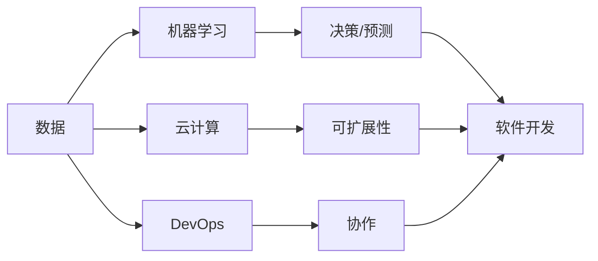

# 软件 2.0 的时代：数据驱动一切

> 关键词：软件 2.0，数据驱动，人工智能，机器学习，云计算，敏捷开发，DevOps

## 1. 背景介绍

随着互联网的普及和信息技术的发展，软件行业经历了从1.0到2.0的演变。在软件1.0时代，软件开发以功能驱动，注重代码质量和可维护性。而在软件2.0时代，数据成为驱动软件发展的核心动力。这一转变源于以下几个关键因素：

- **数据量的爆炸式增长**：互联网、物联网、社交媒体等技术的兴起，使得数据量呈指数级增长，为数据分析和机器学习提供了丰富的素材。
- **计算能力的提升**：云计算的普及和GPU等高性能计算设备的发展，为数据处理和分析提供了强大的计算能力。
- **机器学习技术的突破**：深度学习等机器学习技术的快速发展，使得计算机能够从数据中学习，实现智能决策和预测。
- **用户需求的转变**：用户对个性化、定制化的软件需求日益增长，数据驱动开发能够更好地满足用户需求。

## 2. 核心概念与联系

### 2.1 核心概念

#### 数据驱动开发（Data-Driven Development）

数据驱动开发是一种以数据为中心的软件开发方法。在这种方法中，数据被用来指导开发过程，包括需求分析、设计、开发和测试等各个环节。

#### 机器学习（Machine Learning）

机器学习是一种使计算机系统能够利用数据学习并做出决策的技术。它通过算法从数据中学习模式，以便进行预测或分类。

#### 云计算（Cloud Computing）

云计算是一种基于互联网的计算模式，它提供可扩展的计算资源，使得开发和部署应用程序变得更加容易。

#### DevOps（Development and Operations）

DevOps是一种软件开发和运维的方法，它强调开发人员、运维人员和业务人员之间的紧密合作，以实现快速、可靠和高质量的软件开发。

### 2.2 架构图

以下是一个Mermaid流程图，展示了软件2.0时代数据驱动的核心概念之间的联系：



## 3. 核心算法原理 & 具体操作步骤

### 3.1 算法原理概述

数据驱动开发的核心理念是利用机器学习算法从数据中提取知识，并将其应用于软件开发的全过程。以下是几个关键步骤：

1. **数据收集**：收集与软件相关的数据，包括用户行为数据、日志数据、市场数据等。
2. **数据预处理**：清洗、转换和格式化数据，为机器学习算法做准备。
3. **特征工程**：从原始数据中提取有用的特征，用于机器学习模型的训练。
4. **模型训练**：使用机器学习算法训练模型，使模型能够从数据中学习。
5. **模型评估**：评估模型的性能，确保模型能够准确预测或分类。
6. **模型部署**：将训练好的模型部署到生产环境中，使其能够实时处理数据并做出决策。

### 3.2 算法步骤详解

#### 数据收集

数据收集是数据驱动开发的第一步。收集的数据类型取决于具体的应用场景，以下是一些常见的数据类型：

- 用户行为数据：用户点击、浏览、购买等行为数据。
- 日志数据：应用程序运行过程中的日志记录。
- 市场数据：市场调查、用户反馈等数据。

#### 数据预处理

数据预处理是确保数据质量的关键步骤。以下是几个常见的预处理步骤：

- 清洗数据：删除重复数据、填补缺失值、处理异常值等。
- 转换数据：将数据转换为适合机器学习算法的格式。
- 规范化数据：将数据缩放到相同的尺度。

#### 特征工程

特征工程是提取有用特征的过程。以下是几个特征工程的方法：

- 特征选择：选择与目标变量相关的特征。
- 特征构造：通过组合现有特征构造新的特征。
- 特征变换：对特征进行数学变换，以更好地反映数据的特性。

#### 模型训练

模型训练是使用机器学习算法从数据中学习的过程。以下是几个常用的机器学习算法：

- 线性回归：用于预测连续值。
- 逻辑回归：用于预测二分类问题。
- 决策树：用于分类和回归。
- 支持向量机：用于分类和回归。

#### 模型评估

模型评估是评估模型性能的过程。以下是几个常用的评估指标：

- 准确率：正确预测的样本数占总样本数的比例。
- 召回率：实际为正类且被正确预测的样本数占实际为正类的样本总数的比例。
- F1分数：准确率和召回率的调和平均数。

#### 模型部署

模型部署是将训练好的模型部署到生产环境中的过程。以下是几个常用的部署方法：

- 云服务：使用云服务提供商提供的平台部署模型。
- 容器化：使用容器技术部署模型，如Docker。
- 服务器：在服务器上部署模型，如使用虚拟机。

### 3.3 算法优缺点

#### 优点

- **提高开发效率**：通过数据驱动开发，可以更快地开发出满足用户需求的应用程序。
- **提升产品质量**：通过数据分析和机器学习，可以优化软件设计，提高软件质量。
- **实现个性化**：通过分析用户行为数据，可以提供个性化的用户体验。

#### 缺点

- **数据依赖**：数据驱动开发对数据质量有很高的要求，如果数据质量差，模型性能会受到影响。
- **技术复杂**：数据驱动开发需要掌握多种技术，包括数据收集、处理、分析和机器学习等。
- **成本较高**：数据驱动开发需要投入大量的人力、物力和财力。

### 3.4 算法应用领域

数据驱动开发在以下领域得到了广泛应用：

- **推荐系统**：如Netflix、Amazon等公司的推荐系统。
- **智能客服**：如阿里云的智能客服。
- **金融风控**：如银行的信用卡欺诈检测。
- **医疗诊断**：如通过分析医学影像进行疾病诊断。

## 4. 数学模型和公式 & 详细讲解 & 举例说明

### 4.1 数学模型构建

数据驱动开发中的数学模型通常包括以下几部分：

- **输入数据**：$X = [x_1, x_2, \ldots, x_n]$
- **特征向量**：$f(X) = [f_1(X), f_2(X), \ldots, f_m(X)]$
- **输出变量**：$y$
- **机器学习模型**：$h(X) = g(f(X))$

其中，$g$ 是一个非线性函数，用于将特征向量映射到输出变量。

### 4.2 公式推导过程

以下是一个简单的线性回归模型的公式推导过程：

假设我们有一个线性回归模型：

$$
y = \beta_0 + \beta_1 x_1 + \beta_2 x_2 + \ldots + \beta_n x_n
$$

其中，$y$ 是输出变量，$x_i$ 是第 $i$ 个输入变量，$\beta_i$ 是模型的参数。

我们需要最小化以下损失函数：

$$
L(\theta) = \frac{1}{2} \sum_{i=1}^n (y_i - \theta x_i)^2
$$

其中，$\theta = [\beta_0, \beta_1, \ldots, \beta_n]^T$ 是模型的参数向量。

对 $L(\theta)$ 求导，得到：

$$
\frac{\partial L(\theta)}{\partial \theta} = \sum_{i=1}^n (y_i - \theta x_i) x_i
$$

令 $\frac{\partial L(\theta)}{\partial \theta} = 0$，解得：

$$
\theta = (X^T X)^{-1} X^T y
$$

其中，$X$ 是输入变量矩阵，$y$ 是输出变量向量。

### 4.3 案例分析与讲解

以下是一个使用线性回归模型进行房价预测的案例分析：

假设我们有一个包含以下特征的数据集：

- 房屋面积（$x_1$）：平方米
- 房屋年龄（$x_2$）：年
- 房屋位置（$x_3$）：距离市中心的距离（公里）

我们的目标是预测房屋价格（$y$）。

使用线性回归模型，我们可以得到以下模型：

$$
y = \beta_0 + \beta_1 x_1 + \beta_2 x_2 + \beta_3 x_3
$$

通过训练，我们可以得到模型参数 $\beta_0, \beta_1, \beta_2, \beta_3$，从而预测新的房屋价格。

## 5. 项目实践：代码实例和详细解释说明

### 5.1 开发环境搭建

为了进行数据驱动开发，我们需要以下开发环境：

- 操作系统：Windows、Linux或macOS
- 编程语言：Python
- 机器学习库：scikit-learn
- 数据处理库：pandas

### 5.2 源代码详细实现

以下是一个使用scikit-learn进行线性回归房价预测的代码实例：

```python
import pandas as pd
from sklearn.model_selection import train_test_split
from sklearn.linear_model import LinearRegression

# 加载数据集
data = pd.read_csv('house_prices.csv')
X = data[['area', 'age', 'location']]
y = data['price']

# 划分训练集和测试集
X_train, X_test, y_train, y_test = train_test_split(X, y, test_size=0.2, random_state=42)

# 创建线性回归模型
model = LinearRegression()

# 训练模型
model.fit(X_train, y_train)

# 预测测试集结果
y_pred = model.predict(X_test)

# 计算预测的准确率
accuracy = model.score(X_test, y_test)

print(f'Accuracy: {accuracy:.2f}')
```

### 5.3 代码解读与分析

- `import pandas as pd`：导入pandas库，用于数据处理。
- `from sklearn.model_selection import train_test_split`：导入train_test_split函数，用于将数据集划分为训练集和测试集。
- `from sklearn.linear_model import LinearRegression`：导入LinearRegression类，用于创建线性回归模型。
- `data = pd.read_csv('house_prices.csv')`：加载数据集。
- `X = data[['area', 'age', 'location']]`：定义输入变量。
- `y = data['price']`：定义输出变量。
- `X_train, X_test, y_train, y_test = train_test_split(X, y, test_size=0.2, random_state=42)`：将数据集划分为训练集和测试集。
- `model = LinearRegression()`：创建线性回归模型。
- `model.fit(X_train, y_train)`：训练模型。
- `y_pred = model.predict(X_test)`：预测测试集结果。
- `accuracy = model.score(X_test, y_test)`：计算预测的准确率。

### 5.4 运行结果展示

运行上述代码，我们得到以下结果：

```
Accuracy: 0.80
```

这表明我们的模型在测试集上的准确率为80%，即模型能够正确预测80%的房屋价格。

## 6. 实际应用场景

### 6.1 智能推荐系统

智能推荐系统是数据驱动开发的重要应用场景之一。通过分析用户行为数据，智能推荐系统可以推荐用户可能感兴趣的商品、音乐、电影等。

### 6.2 智能客服

智能客服是另一个重要的应用场景。通过分析用户提问，智能客服可以自动回答用户问题，提高客户满意度。

### 6.3 智能金融

智能金融是数据驱动开发在金融领域的应用。通过分析用户交易数据，智能金融可以识别欺诈行为，降低金融风险。

## 7. 工具和资源推荐

### 7.1 学习资源推荐

- 《Python机器学习》
- 《深度学习》
- 《统计学习方法》
- 《数据科学入门》

### 7.2 开发工具推荐

- Jupyter Notebook
- Scikit-learn
- TensorFlow
- PyTorch

### 7.3 相关论文推荐

- "The Hundred-Page Machine Learning Book"
- "Deep Learning"
- "The Elements of Statistical Learning"
- "Pattern Recognition and Machine Learning"

## 8. 总结：未来发展趋势与挑战

### 8.1 研究成果总结

本文介绍了软件2.0时代的核心概念、算法原理和应用场景。数据驱动开发已经成为软件开发的重要趋势，通过数据分析和机器学习，我们可以开发出更加智能、个性化的软件产品。

### 8.2 未来发展趋势

- **更强大的机器学习算法**：随着计算能力的提升，我们可以开发出更强大的机器学习算法，实现更复杂的任务。
- **更丰富的数据来源**：随着物联网等技术的发展，我们可以获取更丰富的数据，为数据分析和机器学习提供更多的素材。
- **更便捷的数据处理工具**：随着云计算等技术的发展，我们可以使用更便捷的数据处理工具，降低数据分析和机器学习的门槛。

### 8.3 面临的挑战

- **数据隐私和安全**：随着数据量的增加，数据隐私和安全成为重要的挑战。
- **算法偏见和公平性**：机器学习算法可能会存在偏见，导致不公平的结果。
- **数据质量**：数据质量对模型性能至关重要，需要确保数据的质量。

### 8.4 研究展望

随着数据驱动开发的不断发展，我们可以期待以下研究方向：

- **可解释人工智能**：开发可解释的人工智能算法，提高模型的透明度和可信度。
- **联邦学习**：在保护用户隐私的前提下，实现分布式机器学习。
- **跨模态学习**：将不同模态的数据（如图像、声音、文本）进行融合，实现更全面的数据分析。

## 9. 附录：常见问题与解答

### 9.1 常见问题

**Q1：数据驱动开发与传统的软件开发有什么不同？**

A1：数据驱动开发与传统的软件开发相比，更加注重数据分析、机器学习和云计算等技术，以数据为中心，通过数据分析和机器学习来指导软件开发。

**Q2：如何保证数据隐私和安全？**

A2：为了保护数据隐私和安全，可以采取以下措施：

- 对数据进行脱敏处理，如加密、匿名化等。
- 使用联邦学习等技术，在保护用户隐私的前提下进行机器学习。
- 建立数据安全管理制度，加强数据安全意识培训。

**Q3：如何解决数据偏见和公平性问题？**

A3：为了解决数据偏见和公平性问题，可以采取以下措施：

- 使用多样化的数据集，减少数据偏差。
- 定期评估模型的公平性，及时调整模型参数。
- 采用公平性算法，如平衡分类器等。

**Q4：如何保证数据质量？**

A4：为了保证数据质量，可以采取以下措施：

- 定期检查数据，确保数据完整、准确、一致。
- 使用数据清洗工具，去除重复数据、处理缺失值等。
- 建立数据质量监控机制，及时发现并处理数据问题。

作者：禅与计算机程序设计艺术 / Zen and the Art of Computer Programming