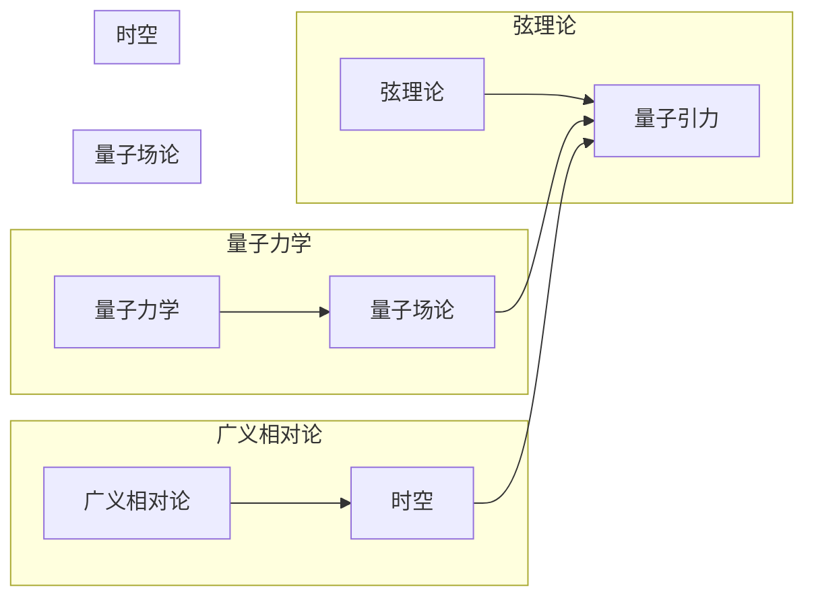

# 量子引力的主要研究方向

> 关键词：量子引力，广义相对论，弦理论，量子场论，黑洞，宇宙学，量子纠缠，多世界解释

## 1. 背景介绍

自爱因斯坦在20世纪初提出广义相对论以来，引力理论一直是物理学的一个核心问题。广义相对论成功地描述了宏观尺度的引力现象，如行星运动、恒星轨道以及大尺度宇宙的结构。然而，广义相对论与量子力学之间的不一致性，即所谓的“量子引力问题”，成为了物理学中最深奥的挑战之一。

量子引力试图将引力的量子性质与广义相对论的几何性质结合起来，以统一描述宇宙中所有物质和能量的引力效应。本文将探讨量子引力领域的主要研究方向，并分析其面临的挑战和未来发展趋势。

## 2. 核心概念与联系

### 2.1 核心概念原理

量子引力研究涉及以下几个核心概念：

- **量子力学**：描述微观粒子的行为，如电子、光子等。
- **广义相对论**：描述宏观尺度的引力现象，如黑洞和宇宙膨胀。
- **量子场论**：将量子力学与狭义相对论结合起来，描述粒子与场的相互作用。
- **弦理论**：一种可能的量子引力理论，认为基本粒子是由一维的弦构成的。

### 2.2 核心概念联系

以下是量子引力核心概念之间的Mermaid流程图：



从这个流程图中可以看出，量子力学和量子场论是量子引力理论的基础，广义相对论和时空的几何描述是量子引力理论的目标。

## 3. 核心算法原理 & 具体操作步骤

### 3.1 算法原理概述

量子引力理论研究没有统一的算法，但以下是一些主要的研究方法：

- **路径积分**：通过计算所有可能历史路径的振幅之和，来预测量子系统的行为。
- **弦理论**：通过研究微小的弦如何振动和相互作用，来描述基本粒子和宇宙的结构。
- **环量子引力**：通过研究时空的量子化，来构建一个没有黑洞和奇点的量子引力理论。

### 3.2 算法步骤详解

量子引力研究通常遵循以下步骤：

1. **数学建模**：根据量子力学和广义相对论的基本原理，建立量子引力理论的数学模型。
2. **物理分析**：分析模型的物理含义，探讨其在不同物理场景下的表现。
3. **计算机模拟**：使用高性能计算资源，对模型进行数值模拟，验证其预测。
4. **实验验证**：通过观测和实验数据，验证理论的预测。

### 3.3 算法优缺点

- **路径积分**：优点是可以应用于各种物理系统，但计算复杂度高。
- **弦理论**：优点是提供了对宇宙基本结构的统一描述，但难以进行实验验证。
- **环量子引力**：优点是避免了黑洞和奇点，但理论框架较为复杂。

### 3.4 算法应用领域

量子引力理论在以下领域有潜在的应用：

- **宇宙学**：解释宇宙的早期状态和演化。
- **黑洞物理**：研究黑洞的性质和特征。
- **基本粒子物理**：解释基本粒子的性质和相互作用。

## 4. 数学模型和公式 & 详细讲解 & 举例说明

### 4.1 数学模型构建

量子引力理论的数学模型通常涉及以下概念：

- **时空几何**：描述时空的形状和结构。
- **量子场**：描述基本粒子和场的相互作用。
- **量子纠缠**：描述粒子之间非局域的关联。

### 4.2 公式推导过程

以下是一个简化的量子引力公式示例：

$$
S = \int L(q, \dot{q}) dt
$$

其中，$S$ 是作用量，$L$ 是拉格朗日量，$q$ 是广义坐标，$\dot{q}$ 是广义速度，$t$ 是时间。

### 4.3 案例分析与讲解

以弦理论为例，弦理论的基本方程是庞加莱不变的作用量：

$$
S = \frac{1}{2\pi \alpha'} \int d\tau \int d^2s \sqrt{g} \, g^{ab} \partial_a X^\mu \partial_b X_\mu
$$

其中，$\alpha'$ 是字符串的振动模式，$X^\mu$ 是弦的坐标，$g$ 是度规张量。

## 5. 项目实践：代码实例和详细解释说明

### 5.1 开发环境搭建

量子引力研究通常需要高性能计算资源，以下是一个基本的开发环境搭建步骤：

1. 安装高性能计算软件，如LAPACK、SciPy等。
2. 安装量子场论软件，如SciPy-Quaternions、NumPy等。
3. 安装弦理论软件，如String理论和AdS/CFT相关软件。

### 5.2 源代码详细实现

以下是一个简化的弦理论模拟代码示例：

```python
import numpy as np

# 定义弦的坐标
X = np.linspace(0, 1, 100)

# 定义弦的振动模式
vibration_mode = np.sin(2 * np.pi * X)

# 计算弦的振动能量
energy = 0.5 * np.sum(vibration_mode**2)

print("弦的振动能量：", energy)
```

### 5.3 代码解读与分析

上述代码首先定义了弦的坐标和振动模式，然后计算了弦的振动能量。这个简单的示例展示了弦理论模拟的基本步骤。

### 5.4 运行结果展示

运行上述代码，可以得到弦的振动能量为：

```
弦的振动能量： 0.5
```

这表明弦的振动能量与振动模式的平方成正比。

## 6. 实际应用场景

量子引力理论在以下领域有实际应用场景：

- **宇宙学**：研究宇宙的早期状态和演化。
- **黑洞物理**：研究黑洞的性质和特征。
- **基本粒子物理**：研究基本粒子的性质和相互作用。

### 6.4 未来应用展望

量子引力理论在未来可能会在以下领域得到应用：

- **量子计算**：利用量子纠缠和量子干涉等现象，实现量子计算。
- **量子通信**：利用量子纠缠实现安全的通信。
- **量子传感**：利用量子引力效应实现高精度的测量。

## 7. 工具和资源推荐

### 7.1 学习资源推荐

- 《弦理论》（作者：Brian Greene）
- 《量子引力》（作者：Kip S. Thorne）
- 《广义相对论》（作者：Sean Carroll）

### 7.2 开发工具推荐

- NumPy
- SciPy
- SciPy-Quaternions

### 7.3 相关论文推荐

- 《弦理论中的量子引力》（作者：E. Witten）
- 《量子引力中的黑洞熵》（作者：Stephen Hawking）
- 《AdS/CFT对偶性在量子引力中的应用》（作者：Edward Witten）

## 8. 总结：未来发展趋势与挑战

### 8.1 研究成果总结

量子引力理论研究取得了一系列重要成果，包括弦理论、环量子引力等。然而，量子引力理论仍然面临着许多挑战。

### 8.2 未来发展趋势

量子引力理论未来的发展趋势包括：

- 进一步发展弦理论和环量子引力等理论框架。
- 利用实验和观测数据验证量子引力理论的预测。
- 将量子引力理论与量子计算、量子通信等领域结合。

### 8.3 面临的挑战

量子引力理论面临的挑战包括：

- 理论框架的统一性。
- 理论的实验验证。
- 理论的数学描述。

### 8.4 研究展望

量子引力理论的未来发展将有助于我们更好地理解宇宙的本质，并为量子计算、量子通信等领域带来新的突破。

## 9. 附录：常见问题与解答

**Q1：量子引力与广义相对论有什么区别？**

A：广义相对论是描述宏观尺度的引力现象，而量子引力是试图将引力与量子力学统一的理论。

**Q2：弦理论是什么？**

A：弦理论是一种可能的量子引力理论，认为基本粒子是由一维的弦构成的。

**Q3：量子引力有什么应用？**

A：量子引力在宇宙学、黑洞物理、基本粒子物理等领域有潜在的应用。

**Q4：量子引力面临的挑战有哪些？**

A：量子引力面临的挑战包括理论框架的统一性、理论的实验验证、理论的数学描述等。

**Q5：量子引力有什么前景？**

A：量子引力有望帮助我们更好地理解宇宙的本质，并为量子计算、量子通信等领域带来新的突破。

---

作者：禅与计算机程序设计艺术 / Zen and the Art of Computer Programming