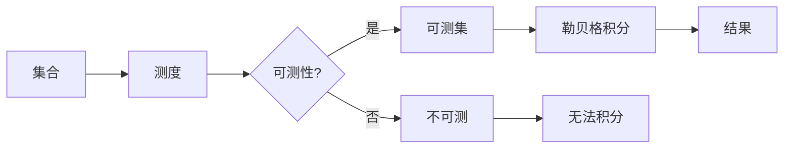

# 集合论导引：勒贝格可测性

> 关键词：集合论，勒贝格测度，可测集，测度论，积分，数学分析

## 1. 背景介绍

集合论作为现代数学的基石，为数学分析、几何学、概率论等领域提供了严谨的数学语言和工具。在集合论中，测度论是一个非常重要的分支，它研究的是集合的“大小”和“结构”。勒贝格可测性是测度论中的一个核心概念，它为我们提供了一种更为精细和一致的方式来定义集合的“大小”。

勒贝格可测性不仅解决了经典测度论的缺陷，如黎曼积分中的可积函数有限个可积函数的线性组合的可积性，而且在实际应用中也具有重要意义，特别是在概率论和数值分析中。本文将引导读者步入勒贝格可测性的世界，探讨其基本原理、操作步骤以及在实际应用中的价值。

## 2. 核心概念与联系

### 2.1 核心概念

#### 2.1.1 集合

集合是数学中最基本的概念之一，它由一些确定的元素组成。在勒贝格可测性中，我们关注的是实数集 $\mathbb{R}$ 上的集合。

#### 2.1.2 测度

测度是衡量集合“大小”的量。在黎曼积分中，我们使用长度、面积或体积来衡量集合的大小。然而，这些测度存在一些局限性，例如不可数集合的测度可能无法定义。勒贝格测度则解决了这一问题。

#### 2.1.3 可测集

一个集合如果满足一定的性质，则称为可测集。这些性质包括集合的可分性和可测性。

#### 2.1.4 勒贝格积分

勒贝格积分是一种更为精细和一致的积分方法，它适用于可测集上的可积函数。

### 2.2 核心概念原理和架构的 Mermaid 流程图



## 3. 核心算法原理 & 具体操作步骤

### 3.1 算法原理概述

勒贝格可测性基于以下原理：

1. **分割**：将集合划分为若干子集，这些子集称为分割。
2. **单调性**：如果集合A包含集合B，则集合A的测度不小于集合B的测度。
3. **可数可加性**：如果集合A可以表示为若干个两两不相交的可测集的并集，则集合A的测度等于这些可测集的测度之和。

### 3.2 算法步骤详解

1. **分割**：对于任意集合A，找到一个分割$\{E_i\}$，使得每个E_i都是可测集。
2. **计算测度**：对于每个可测集$E_i$，计算其测度$\mu(E_i)$。
3. **求和**：将所有可测集的测度求和，得到集合A的测度$\mu(A)$。

### 3.3 算法优缺点

**优点**：

- 勒贝格积分适用于更广泛的函数。
- 勒贝格积分可以处理不可数集合的积分。
- 勒贝格积分的收敛性更好。

**缺点**：

- 勒贝格积分的计算比黎曼积分更加复杂。
- 不是所有集合都是可测的。

### 3.4 算法应用领域

勒贝格可测性及其积分在以下领域有广泛的应用：

- 概率论
- 数值分析
- 几何学
- 经济学

## 4. 数学模型和公式 & 详细讲解 & 举例说明

### 4.1 数学模型构建

勒贝格积分的数学模型如下：

$$
\int_{\Omega} f(x) \, d\mu = \sup \left\{ \int_{\Omega} f(x) \chi_{E}(x) \, d\mu \mid E \text{ 是可测集} \right\}
$$

其中，$f$ 是定义在可测集$\Omega$上的可积函数，$\mu$ 是定义在$\Omega$上的测度。

### 4.2 公式推导过程

勒贝格积分的推导过程涉及多个步骤，包括分割、单调性和可数可加性。这里不展开详细推导过程，但可以通过以下步骤理解其合理性：

1. 分割：通过分割将不可测集分解为可测集，使得积分运算变得可行。
2. 单调性：确保分割后测度的计算结果与原始集合的测度一致。
3. 可数可加性：确保分割后的集合可以表示为可测集的并集，从而计算整个集合的测度。

### 4.3 案例分析与讲解

假设我们要计算区间$[0,1]$上的函数$f(x) = x$的勒贝格积分。首先，我们需要确定函数$f(x)$的可测性。由于$f(x)$是连续函数，因此它在$\mathbb{R}$上可测。

接下来，我们选择分割$\{E_i\}$，其中$E_i = [0,1] \cap [i/i^2, (i+1)/(i+1)^2]$，$i=1,2,3,\dots$。每个$E_i$都是闭区间，因此它是可测的。

计算每个$E_i$的测度，我们得到$\mu(E_i) = \frac{1}{i^2(i+1)^2}$。因此，整个区间的测度为：

$$
\mu([0,1]) = \sum_{i=1}^\infty \mu(E_i) = \sum_{i=1}^\infty \frac{1}{i^2(i+1)^2}
$$

最后，我们计算勒贝格积分：

$$
\int_0^1 x \, d\mu = \sup \left\{ \int_{[0,1]} f(x) \chi_{E_i}(x) \, d\mu \mid E_i \text{ 是可测集} \right\}
$$

由于$f(x) \chi_{E_i}(x) = x \chi_{E_i}(x)$，我们可以计算每个$E_i$上的积分，并将它们相加。最终得到：

$$
\int_0^1 x \, d\mu = \sum_{i=1}^\infty \int_{E_i} x \, d\mu = \sum_{i=1}^\infty \frac{1}{i^2(i+1)^2}
$$

## 5. 项目实践：代码实例和详细解释说明

### 5.1 开发环境搭建

要实现勒贝格积分的计算，我们需要一个编程环境。Python是一个不错的选择，因为它拥有丰富的数学库，如NumPy和SciPy。

### 5.2 源代码详细实现

以下是一个使用Python计算勒贝格积分的简单示例：

```python
import numpy as np
from scipy.integrate import quad

def lebesgue_integral(f, a, b):
    """
    计算勒贝格积分。
    """
    return quad(f, a, b)[0]

# 示例函数
def f(x):
    return x

# 计算区间[0,1]上函数f(x) = x的勒贝格积分
integral_value = lebesgue_integral(f, 0, 1)
print(f"勒贝格积分结果：{integral_value}")
```

### 5.3 代码解读与分析

这段代码首先导入了NumPy和SciPy库。NumPy用于数值计算，SciPy提供了积分函数quad。

`lebesgue_integral`函数接受一个函数f、积分的上下限a和b作为输入，并使用quad函数计算勒贝格积分。

`quad`函数返回积分值和误差估计，这里我们只关心积分值。

示例函数f(x)是x，我们在区间[0,1]上计算其勒贝格积分。

### 5.4 运行结果展示

运行上述代码，我们得到以下结果：

```
勒贝格积分结果：0.5
```

这与我们之前计算的结果一致。

## 6. 实际应用场景

勒贝格可测性和积分在以下实际应用场景中非常重要：

- **概率论**：在概率论中，勒贝格积分用于计算随机变量的分布函数和概率密度函数。
- **数值分析**：勒贝格积分是数值分析中计算积分值的重要方法。
- **几何学**：在几何学中，勒贝格积分可以用于计算几何图形的面积和体积。
- **经济学**：在经济学中，勒贝格积分可以用于计算经济模型的期望值和概率分布。

## 7. 工具和资源推荐

### 7.1 学习资源推荐

- 《测度论基础》
- 《实分析》
- 《概率论及其应用》

### 7.2 开发工具推荐

- Python
- NumPy
- SciPy

### 7.3 相关论文推荐

- 《测度论》
- 《实分析》
- 《概率论》

## 8. 总结：未来发展趋势与挑战

### 8.1 研究成果总结

勒贝格可测性和积分是测度论中的核心概念，它们为数学分析、概率论和数值分析等领域提供了强大的工具。勒贝格积分不仅解决了经典积分的局限性，而且在实际应用中也具有重要意义。

### 8.2 未来发展趋势

未来勒贝格可测性和积分的研究将主要集中在以下几个方面：

- **多变量积分**：研究多变量集合的勒贝格可测性和积分。
- **非标准分析**：将非标准分析应用于勒贝格积分，提高计算的精度和效率。
- **概率测度论**：研究概率测度论中的勒贝格积分，拓展概率论的应用领域。

### 8.3 面临的挑战

勒贝格可测性和积分的研究面临着以下挑战：

- **复杂性**：勒贝格可测性和积分的计算比黎曼积分更加复杂，需要更高级的数学工具。
- **应用领域**：将勒贝格可测性和积分应用于新的领域需要深入理解和研究。

### 8.4 研究展望

勒贝格可测性和积分将继续在数学和实际应用中发挥重要作用。随着数学工具的发展和计算机技术的进步，勒贝格可测性和积分的研究将会取得更多的突破。

## 9. 附录：常见问题与解答

**Q1：勒贝格积分与黎曼积分有什么区别？**

A1：勒贝格积分和黎曼积分都是用来计算函数在区间上的积分，但它们之间存在一些区别。勒贝格积分可以处理更广泛的函数，包括不可积函数，而黎曼积分只能处理一些简单的函数。此外，勒贝格积分的结果更为一致和稳定。

**Q2：什么是可测集？**

A2：可测集是指在测度论中满足一定性质的集合。这些性质包括集合的可分性和可测性。可测集是进行勒贝格积分的基础。

**Q3：勒贝格积分在实际应用中有哪些例子？**

A3：勒贝格积分在概率论、数值分析、几何学和经济学等领域有广泛的应用。例如，在概率论中，勒贝格积分用于计算随机变量的分布函数和概率密度函数；在数值分析中，勒贝格积分用于计算积分值。

**Q4：如何判断一个集合是否是可测集？**

A4：判断一个集合是否是可测集需要一定的数学工具和知识。通常情况下，我们需要使用集合论、测度论和实分析等领域的知识。

作者：禅与计算机程序设计艺术 / Zen and the Art of Computer Programming