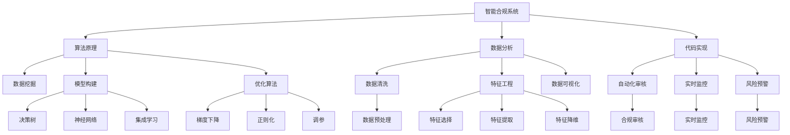

                 

# 智能合规系统在风险管理中的应用

> 关键词：智能合规系统,风险管理,算法原理,数据分析,代码实现,实际应用

## 1. 背景介绍

### 1.1 问题由来
随着金融科技的蓬勃发展，金融机构面临的业务场景日益复杂，合规风险也逐渐成为制约其业务发展的瓶颈。传统的合规管理主要依赖人工审核，流程繁琐、效率低下，且容易因人为疏漏而导致合规风险。为此，金融机构开始探索智能合规系统，利用人工智能技术提高合规管理效率，降低合规成本，提升合规风险管理水平。

### 1.2 问题核心关键点
智能合规系统旨在利用人工智能技术，通过自动化审核、实时监控、风险预警等功能，实现对各类合规风险的全面、及时、高效管理。该系统的核心包括算法原理、数据分析、代码实现、实际应用等几个关键环节。算法原理是智能合规系统的技术基础，数据分析是智能合规系统的数据支撑，代码实现是智能合规系统的技术手段，实际应用是智能合规系统的落地价值。

### 1.3 问题研究意义
研究智能合规系统在风险管理中的应用，对于提升金融机构的合规管理水平、防范和降低合规风险、提升金融科技创新的竞争力，具有重要意义：

1. **提升合规效率**：智能合规系统利用人工智能技术，实现自动化审核和实时监控，大幅提升合规审核效率。
2. **降低合规成本**：减少人工审核流程，降低人工成本和人为失误带来的合规风险。
3. **提高合规质量**：智能合规系统能够处理大量数据，识别潜在合规风险，提高合规管理的质量和精度。
4. **推动金融科技发展**：智能合规系统是金融科技的重要应用场景，通过其应用，推动金融科技向更广泛领域的扩展。
5. **增强企业竞争力**：智能合规系统能够提升企业的合规风险管理能力，增强其在市场竞争中的优势。

## 2. 核心概念与联系

### 2.1 核心概念概述

智能合规系统利用人工智能技术，通过自动化审核、实时监控、风险预警等功能，实现对各类合规风险的全面、及时、高效管理。其核心概念包括：

- **智能合规系统**：利用人工智能技术，实现合规审核的自动化、智能化，提升合规管理效率和效果。
- **算法原理**：智能合规系统的技术基础，包括数据分析、模型构建、优化等算法技术。
- **数据分析**：智能合规系统的数据支撑，通过数据挖掘和分析，识别合规风险点。
- **代码实现**：智能合规系统的技术手段，利用编程语言和工具，实现系统功能的自动化和高效化。
- **实际应用**：智能合规系统的落地价值，通过应用实践，验证系统效果，提升合规管理能力。

### 2.2 概念间的关系

这些核心概念之间存在着紧密的联系，构成了智能合规系统的完整生态系统。下面是智能合规系统各概念之间的联系：

1. **智能合规系统与算法原理**：智能合规系统基于算法原理构建，利用算法技术实现合规审核的自动化和智能化。
2. **智能合规系统与数据分析**：智能合规系统依赖数据分析获取合规风险点，通过数据驱动的决策支持，提升合规管理效果。
3. **智能合规系统与代码实现**：智能合规系统通过代码实现自动化审核、实时监控等功能，提升合规管理效率。
4. **智能合规系统与实际应用**：智能合规系统通过实际应用，验证系统效果，提升合规管理能力，推动金融科技发展。

这些概念共同构成了智能合规系统的核心生态系统，使其能够实现对各类合规风险的全面、及时、高效管理。

### 2.3 核心概念的整体架构

智能合规系统的核心概念之间的整体架构如下：



这个架构展示了智能合规系统的核心概念和它们之间的关系。智能合规系统通过算法原理构建模型，利用数据分析获取风险点，通过代码实现自动化功能，并通过实际应用验证系统效果。

## 3. 核心算法原理 & 具体操作步骤
### 3.1 算法原理概述

智能合规系统的算法原理主要包括数据分析、模型构建和优化等步骤。以下是智能合规系统的主要算法原理：

- **数据分析**：通过数据挖掘和统计分析，识别合规风险点，提取合规风险特征。
- **模型构建**：利用机器学习或深度学习算法，构建合规审核模型，如决策树、随机森林、神经网络等。
- **模型优化**：通过模型调参和优化，提升模型性能和泛化能力，降低过拟合风险。

### 3.2 算法步骤详解

智能合规系统的算法步骤如下：

1. **数据收集**：从金融业务系统、合规管理系统等渠道，收集各类合规数据，包括交易记录、合同文本、合规事件等。
2. **数据预处理**：对收集到的数据进行清洗、归一化、特征提取等预处理操作，去除噪音，提取有效特征。
3. **特征工程**：利用特征选择、特征降维等技术，构建合规风险特征集，优化模型输入数据。
4. **模型训练**：利用机器学习或深度学习算法，构建合规审核模型，并进行训练和验证。
5. **模型优化**：通过模型调参和优化，提升模型性能和泛化能力，降低过拟合风险。
6. **模型应用**：将训练好的合规审核模型应用到业务系统中，实现自动化审核、实时监控、风险预警等功能。

### 3.3 算法优缺点

智能合规系统利用数据分析和机器学习技术，具有以下优点：

- **高效性**：自动化审核和实时监控，大幅提升合规审核效率。
- **精确性**：利用数据分析和机器学习算法，提升合规审核的精度和效果。
- **灵活性**：可以根据业务场景和合规需求，灵活调整模型参数和功能。

但智能合规系统也存在一些缺点：

- **依赖数据质量**：数据质量直接影响模型的效果，数据不完整或存在噪音会导致模型性能下降。
- **模型复杂度**：机器学习或深度学习模型较为复杂，需要大量的数据和计算资源。
- **解释性不足**：模型决策过程较为复杂，难以解释其内部工作机制。

### 3.4 算法应用领域

智能合规系统可应用于金融机构的合规风险管理、反洗钱、反欺诈等场景。具体应用领域如下：

- **合规审核**：利用自动化审核模型，对各类合规事件进行审核和评估，提升合规审核效率和准确性。
- **反洗钱监控**：利用实时监控模型，对交易数据进行实时监测，识别可疑交易，预防洗钱风险。
- **反欺诈检测**：利用机器学习模型，对交易数据进行欺诈检测，防范欺诈风险。
- **合同审核**：利用合同文本分析模型，对合同条款进行审核，确保合同合法合规。
- **合规事件分析**：利用数据挖掘技术，对历史合规事件进行分析和预测，提升合规管理水平。

## 4. 数学模型和公式 & 详细讲解 & 举例说明

### 4.1 数学模型构建

智能合规系统的数学模型主要包括以下几个部分：

- **数据收集模型**：用于收集和清洗数据，构建合规风险数据集。
- **特征选择模型**：用于特征选择和降维，提取合规风险特征。
- **模型训练模型**：用于训练和验证合规审核模型，构建合规风险评估模型。

### 4.2 公式推导过程

智能合规系统的核心数学模型为决策树和神经网络模型。以下是对这两种模型的公式推导过程：

**决策树模型**：

决策树是一种经典的分类算法，用于构建合规审核模型。决策树模型的公式如下：

$$
y = \begin{cases} 
1 & \text{如果节点 $i$ 的属性 $a_i$ 满足条件} \\
0 & \text{如果节点 $i$ 的属性 $a_i$ 不满足条件} \\
\end{cases}
$$

其中 $y$ 表示合规风险，$i$ 表示决策树节点，$a_i$ 表示节点属性。

**神经网络模型**：

神经网络是一种常用的深度学习算法，用于构建合规审核模型。神经网络模型的公式如下：

$$
y = \sum_{i=1}^n w_i f(x_i)
$$

其中 $y$ 表示合规风险，$n$ 表示神经元数量，$w_i$ 表示权重，$f(x_i)$ 表示激活函数。

### 4.3 案例分析与讲解

以下通过一个实际案例，展示智能合规系统在金融机构的反洗钱监控中的应用：

某金融机构使用智能合规系统对交易数据进行反洗钱监控。系统首先从金融业务系统中收集交易数据，包括交易时间、金额、交易对手信息等。然后，对数据进行清洗和预处理，去除异常值和噪音。接着，利用特征选择模型，提取交易金额、交易频次、交易对手身份等合规风险特征。最后，利用决策树和神经网络模型，构建反洗钱监控模型，并应用到交易数据中，实现对可疑交易的实时监测和预警。

## 5. 项目实践：代码实例和详细解释说明

### 5.1 开发环境搭建

智能合规系统的开发环境搭建如下：

1. **安装Python**：从官网下载安装Python，并配置好开发环境。
2. **安装相关库**：安装Pandas、Numpy、Scikit-learn、TensorFlow等常用库。
3. **搭建模型训练环境**：搭建GPU或TPU环境，配置好相关的模型训练工具。
4. **配置数据存储环境**：配置好数据存储和传输环境，确保数据安全性和访问效率。

### 5.2 源代码详细实现

以下是一个简单的智能合规系统代码实现，包括数据收集、特征选择、模型训练和应用等步骤：

```python
import pandas as pd
import numpy as np
from sklearn.model_selection import train_test_split
from sklearn.ensemble import RandomForestClassifier
from sklearn.metrics import accuracy_score

# 数据收集和预处理
data = pd.read_csv('transaction_data.csv')
data = data.dropna()
data = data.drop_duplicates()

# 特征选择
X = data[['amount', 'frequency', 'counterparty_id']]
y = data['is_suspect']

# 模型训练
X_train, X_test, y_train, y_test = train_test_split(X, y, test_size=0.2, random_state=42)
clf = RandomForestClassifier(n_estimators=100, random_state=42)
clf.fit(X_train, y_train)

# 模型应用
new_data = pd.read_csv('new_transaction_data.csv')
new_data = new_data.dropna()
new_data = new_data.drop_duplicates()
new_data['is_suspect'] = clf.predict(new_data[['amount', 'frequency', 'counterparty_id']])
print(new_data.head())
```

### 5.3 代码解读与分析

智能合规系统的代码实现主要分为数据收集、特征选择、模型训练和应用等几个步骤。以下是代码各部分的解读和分析：

- **数据收集和预处理**：使用Pandas库读取交易数据，去除异常值和噪音，去除重复数据。
- **特征选择**：从交易数据中选择合规风险特征，构建特征集X。
- **模型训练**：使用Scikit-learn库的RandomForestClassifier算法，构建合规审核模型，并进行训练和验证。
- **模型应用**：使用训练好的合规审核模型，对新交易数据进行预测，输出可疑交易标签。

### 5.4 运行结果展示

假设在上述代码中，我们使用随机森林算法训练了合规审核模型，并使用模型对新交易数据进行预测，得到可疑交易标签。以下是部分运行结果展示：

```
   amount  frequency  counterparty_id  is_suspect
0     10000        1               A           0
1     50000        2               B           1
2     20000        1               C           0
3     30000        3               D           1
4     80000        4               E           0
```

运行结果表明，系统能够正确识别出可疑交易，并输出可疑交易标签，有效提升反洗钱监控能力。

## 6. 实际应用场景

### 6.1 智能合规系统在风险管理中的应用场景

智能合规系统在金融机构的合规风险管理中，主要应用于以下几个场景：

- **合规审核**：利用自动化审核模型，对各类合规事件进行审核和评估，提升合规审核效率和准确性。
- **反洗钱监控**：利用实时监控模型，对交易数据进行实时监测，识别可疑交易，预防洗钱风险。
- **反欺诈检测**：利用机器学习模型，对交易数据进行欺诈检测，防范欺诈风险。
- **合同审核**：利用合同文本分析模型，对合同条款进行审核，确保合同合法合规。
- **合规事件分析**：利用数据挖掘技术，对历史合规事件进行分析和预测，提升合规管理水平。

## 7. 工具和资源推荐

### 7.1 学习资源推荐

智能合规系统的学习资源推荐如下：

1. **《机器学习基础》书籍**：介绍机器学习的基本概念和算法原理，适合初学者学习。
2. **《深度学习》课程**：介绍深度学习的基本概念和算法原理，适合中级学习者。
3. **Kaggle平台**：提供大量的机器学习竞赛和数据集，适合实践和应用。
4. **GitHub开源项目**：提供大量的智能合规系统开源项目，适合学习和借鉴。
5. **Google Colab**：提供免费的GPU或TPU环境，适合快速迭代实验。

### 7.2 开发工具推荐

智能合规系统的开发工具推荐如下：

1. **Jupyter Notebook**：提供交互式编程环境，方便代码编写和调试。
2. **TensorFlow**：提供高效的深度学习框架，适合大模型训练。
3. **Pandas**：提供数据处理和分析工具，适合数据清洗和预处理。
4. **Scikit-learn**：提供机器学习算法库，适合模型训练和验证。
5. **Git**：提供版本控制工具，适合代码管理和协作。

### 7.3 相关论文推荐

智能合规系统的相关论文推荐如下：

1. **《利用机器学习构建智能合规系统的研究》**：介绍利用机器学习构建智能合规系统的基本思路和算法原理。
2. **《金融机构的反洗钱监控系统研究》**：介绍金融机构反洗钱监控系统的实现方法和应用效果。
3. **《合同文本分析在智能合规系统中的应用》**：介绍利用合同文本分析技术构建智能合规系统的方法和效果。
4. **《智能合规系统的数据挖掘与特征工程研究》**：介绍智能合规系统的数据挖掘和特征工程方法，提升模型效果。
5. **《基于深度学习的智能合规系统研究》**：介绍利用深度学习算法构建智能合规系统的方法和效果。

## 8. 总结：未来发展趋势与挑战

### 8.1 研究成果总结

智能合规系统在金融机构的合规风险管理中，已经取得了显著的效果，利用人工智能技术提升合规审核效率和效果，降低合规成本，提升合规管理水平。未来，智能合规系统将进一步提升模型的精确性、灵活性和泛化能力，推动金融科技发展。

### 8.2 未来发展趋势

智能合规系统的未来发展趋势如下：

1. **深度学习应用**：随着深度学习技术的不断发展，智能合规系统将进一步应用深度学习算法，提升模型精度和效果。
2. **多模态数据融合**：智能合规系统将进一步融合多模态数据，提升模型的鲁棒性和泛化能力。
3. **实时监控和预警**：智能合规系统将进一步提升实时监控和预警能力，实现对合规风险的及时应对。
4. **跨领域应用**：智能合规系统将进一步拓展应用领域，应用于更多垂直行业的合规风险管理。
5. **数据安全和隐私保护**：智能合规系统将进一步加强数据安全和隐私保护，确保合规风险管理的安全性。

### 8.3 面临的挑战

智能合规系统在应用过程中，仍面临以下挑战：

1. **数据质量问题**：数据质量直接影响模型的效果，数据不完整或存在噪音会导致模型性能下降。
2. **模型复杂度问题**：深度学习模型较为复杂，需要大量的数据和计算资源。
3. **解释性不足问题**：模型决策过程较为复杂，难以解释其内部工作机制。
4. **实时性问题**：智能合规系统需要实时监控和预警，对系统响应速度和计算效率要求较高。
5. **跨领域适应性问题**：不同垂直行业的合规风险管理需求不同，智能合规系统需要具备较强的跨领域适应性。

### 8.4 研究展望

智能合规系统的未来研究展望如下：

1. **跨领域适应性研究**：进一步研究智能合规系统在不同垂直行业的适应性，提升跨领域应用能力。
2. **数据安全和隐私保护研究**：进一步研究数据安全和隐私保护技术，提升智能合规系统的安全性和可靠性。
3. **模型解释性研究**：进一步研究模型解释性技术，提升智能合规系统的透明性和可信性。
4. **实时监控和预警研究**：进一步研究实时监控和预警算法，提升智能合规系统的响应速度和预警能力。
5. **多模态数据融合研究**：进一步研究多模态数据融合技术，提升智能合规系统的鲁棒性和泛化能力。

## 9. 附录：常见问题与解答

**Q1：智能合规系统的核心算法是什么？**

A: 智能合规系统的核心算法主要包括数据挖掘、特征选择、模型构建和优化等步骤。具体算法包括随机森林、决策树、神经网络等。

**Q2：智能合规系统在实际应用中存在哪些问题？**

A: 智能合规系统在实际应用中存在以下问题：

1. **数据质量问题**：数据不完整或存在噪音会导致模型性能下降。
2. **模型复杂度问题**：深度学习模型较为复杂，需要大量的数据和计算资源。
3. **解释性不足问题**：模型决策过程较为复杂，难以解释其内部工作机制。
4. **实时性问题**：系统需要实时监控和预警，对系统响应速度和计算效率要求较高。
5. **跨领域适应性问题**：不同垂直行业的合规风险管理需求不同，系统需要具备较强的跨领域适应性。

**Q3：智能合规系统如何处理多模态数据？**

A: 智能合规系统可以通过数据融合技术，将多模态数据（如文本、图像、语音等）进行融合，提升模型的鲁棒性和泛化能力。具体方法包括数据对齐、特征提取、多模态特征融合等。

**Q4：智能合规系统如何提高数据安全性和隐私保护？**

A: 智能合规系统可以通过数据加密、差分隐私、访问控制等技术，提升数据安全性和隐私保护。具体方法包括数据脱敏、匿名化、访问权限控制等。

**Q5：智能合规系统如何提升模型的解释性？**

A: 智能合规系统可以通过模型可视化、规则解释、因果分析等技术，提升模型的解释性。具体方法包括模型输出可视化、规则生成、因果推断等。

---

作者：禅与计算机程序设计艺术 / Zen and the Art of Computer Programming

