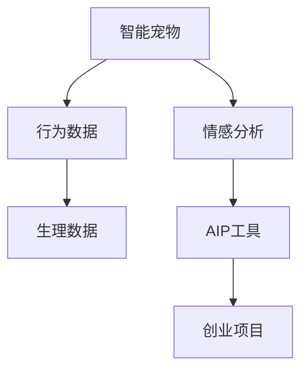
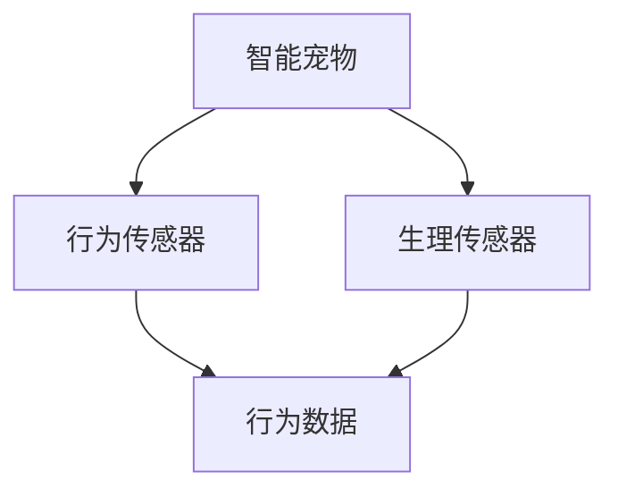
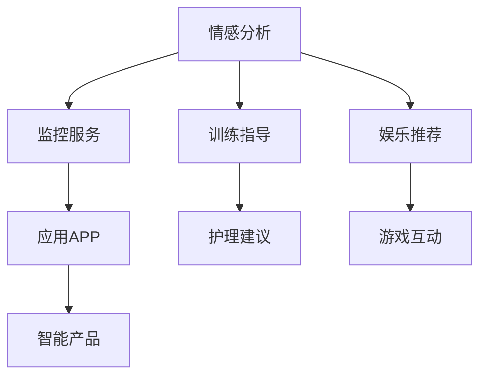
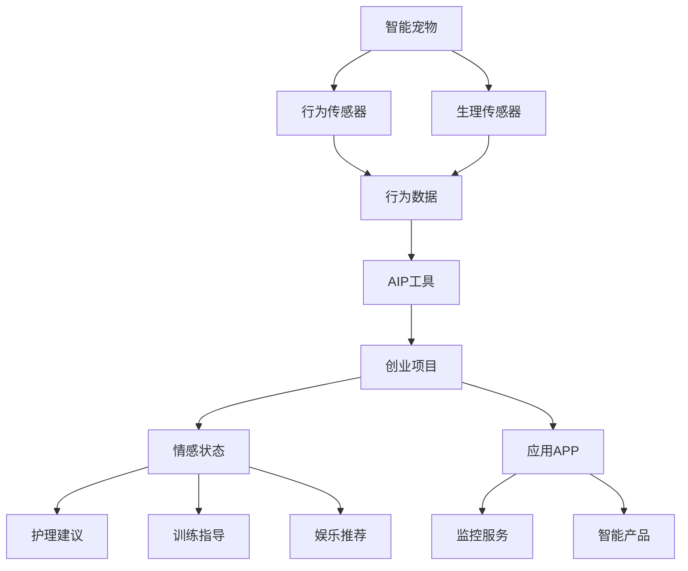

                 

# 智能宠物情感分析创业：深入理解宠物需求的AI工具

> 关键词：智能宠物，情感分析，AI工具，创业项目，数据分析，深度学习，自然语言处理

## 1. 背景介绍

### 1.1 问题由来
近年来，随着人工智能技术的快速发展，AI在宠物护理中的应用也日益受到重视。智能宠物食品、智能宠物监控、智能宠物情感分析等产品和服务逐渐进入人们的视野。其中，智能宠物情感分析成为宠物主了解宠物情感状态，提升宠物生活质量的重要工具。

### 1.2 问题核心关键点
智能宠物情感分析的核心是通过分析宠物的行为、声音、生理指标等数据，自动判断宠物的情感状态（如开心、生气、焦虑等），从而为宠物主提供科学的护理建议。该技术在宠物医疗、宠物训练、宠物娱乐等领域具有广泛应用前景。

### 1.3 问题研究意义
深入研究智能宠物情感分析技术，对于提升宠物的生活质量、降低宠物主的心理压力、推动宠物产业的数字化转型等具有重要意义。

1. **提升宠物生活质量**：通过实时监控宠物的情感状态，及时发现和解决宠物的需求和问题，提高宠物的幸福感和健康水平。
2. **降低宠物主的心理压力**：为宠物主提供科学、客观的情感分析结果，减少宠物主在宠物护理上的误解和焦虑。
3. **推动宠物产业的数字化转型**：智能宠物情感分析技术可以为宠物产品和服务提供数据支持，促进宠物产业向智能化、个性化方向发展。

## 2. 核心概念与联系

### 2.1 核心概念概述

为更好地理解智能宠物情感分析技术，本节将介绍几个密切相关的核心概念：

- **智能宠物**：指配备智能传感器、AI芯片等技术的宠物，能够实时收集并传输宠物的生理、行为数据，为智能分析提供基础数据支撑。
- **情感分析**：通过文本、语音、图像等多种数据源，使用自然语言处理（NLP）、计算机视觉（CV）等技术，自动判断情感状态。
- **AI工具**：包括算法模型、数据处理工具、云平台服务等，为智能宠物情感分析提供技术支持。
- **创业项目**：基于智能宠物情感分析技术的商业化应用，如智能宠物监控、情感分析APP等。

这些核心概念之间的逻辑关系可以通过以下Mermaid流程图来展示：



这个流程图展示了一些关键概念的相互关系：

1. 智能宠物通过传感器和AI芯片收集行为和生理数据。
2. 收集到的数据通过情感分析技术被转化为情感状态。
3. AI工具提供算法模型和数据处理支持。
4. 创业项目利用这些技术和工具实现商业化应用。

### 2.2 概念间的关系

这些核心概念之间存在着紧密的联系，形成了智能宠物情感分析的完整生态系统。下面通过几个Mermaid流程图来展示这些概念之间的关系。

#### 2.2.1 智能宠物数据收集



这个流程图展示了智能宠物如何通过行为和生理传感器收集数据。

#### 2.2.2 情感分析与AI工具的关系


这个流程图展示了行为数据如何通过情感分析转化为情感状态，并由AI工具提供支持。

#### 2.2.3 创业项目的应用场景



这个流程图展示了情感分析技术在多个应用场景中的应用。

### 2.3 核心概念的整体架构

最后，我们用一个综合的流程图来展示这些核心概念在大规模数据收集、情感分析、AI工具支持及商业化应用中的整体架构：



这个综合流程图展示了从智能宠物数据收集、情感分析、AI工具支持到创业项目应用的全过程。

## 3. 核心算法原理 & 具体操作步骤
### 3.1 算法原理概述

智能宠物情感分析的核心算法原理主要包括以下几个步骤：

1. **数据预处理**：对收集到的行为和生理数据进行清洗、归一化等预处理操作。
2. **特征提取**：通过提取关键特征，如行为模式、生理指标、声音频率等，将原始数据转换为可供模型分析的格式。
3. **模型训练**：使用深度学习模型（如卷积神经网络CNN、循环神经网络RNN、Transformer等），对特征数据进行训练，构建情感分类器。
4. **情感分类**：使用训练好的情感分类器，对新的数据进行情感状态分类。
5. **反馈机制**：根据用户反馈对模型进行微调，进一步提升情感分析的准确度。

### 3.2 算法步骤详解

以下是智能宠物情感分析技术的详细操作步骤：

#### Step 1: 数据收集与预处理

1. **数据来源**：智能宠物通过行为传感器（如加速度计、陀螺仪等）和生理传感器（如心率传感器、呼吸传感器等）实时收集行为和生理数据。
2. **数据清洗**：对传感器数据进行去噪、滤波、归一化等预处理操作，保证数据的准确性和一致性。
3. **数据存储**：将处理后的数据存储在云端数据库中，方便后续的情感分析处理。

#### Step 2: 特征提取与选择

1. **特征选择**：选择对情感状态判断有较大影响的关键特征，如行为模式、生理指标、声音频率等。
2. **特征提取**：使用机器学习算法（如PCA、LDA等）对特征进行降维和提取，减少数据维度，提高计算效率。
3. **特征编码**：将特征转换为模型可接受的格式，如将时间序列数据转换为向量表示。

#### Step 3: 模型训练

1. **模型选择**：选择适当的深度学习模型，如CNN、RNN、Transformer等，构建情感分类器。
2. **模型训练**：使用标注好的情感数据对模型进行训练，优化模型参数。
3. **模型评估**：在验证集上评估模型的性能，选择最优模型。

#### Step 4: 情感分类

1. **数据输入**：将新的行为和生理数据输入模型。
2. **情感预测**：模型输出情感状态的概率分布，选择概率最大的类别作为预测结果。
3. **结果解释**：将预测结果解释为可理解的语言描述，提供给用户参考。

#### Step 5: 反馈机制

1. **用户反馈**：收集用户对情感分析结果的反馈，包括纠正错误和提供新数据。
2. **模型微调**：根据用户反馈对模型进行微调，提升情感分析的准确度。
3. **持续优化**：定期更新模型和特征，保持情感分析的稳定性和准确性。

### 3.3 算法优缺点

智能宠物情感分析技术具有以下优点：

1. **实时性强**：通过实时数据收集和分析，能够及时了解宠物的情感状态。
2. **准确度高**：使用深度学习模型进行情感分类，能够获得较高的分类准确度。
3. **应用广泛**：可以应用于宠物医疗、训练、娱乐等多个场景，满足不同需求。

同时，该技术也存在一些缺点：

1. **数据获取难度大**：需要配备昂贵的传感器和设备，数据收集成本较高。
2. **算法复杂度高**：深度学习模型训练和调参过程复杂，需要较高的技术门槛。
3. **用户隐私问题**：数据收集和分析可能涉及宠物主和宠物的隐私信息，需要确保数据安全。

### 3.4 算法应用领域

智能宠物情感分析技术可以应用于多个领域，包括但不限于：

1. **宠物医疗**：实时监测宠物的情感状态，发现异常及时干预，提升宠物健康水平。
2. **宠物训练**：通过情感分析结果，调整训练方式和内容，提升宠物行为训练效果。
3. **宠物娱乐**：根据情感状态，推荐合适的游戏和活动，提升宠物的娱乐体验。
4. **宠物监护**：监测宠物情感状态，及时发现孤独、焦虑等问题，提供心理支持。
5. **宠物养老**：老年宠物可能更容易出现情感问题，通过情感分析提供科学护理建议。

## 4. 数学模型和公式 & 详细讲解  
### 4.1 数学模型构建

本节将使用数学语言对智能宠物情感分析技术的核心算法进行更加严格的刻画。

假设智能宠物的数据集为 $D=\{(x_i,y_i)\}_{i=1}^N$，其中 $x_i$ 为输入特征，$y_i$ 为标签，标签取值为情感状态（如开心、生气、焦虑等）。

定义情感分类器为 $f(x;\theta)$，其中 $\theta$ 为模型参数。情感分类的目标是最小化经验风险，即：

$$
\min_{\theta} \frac{1}{N} \sum_{i=1}^N \ell(f(x_i;\theta),y_i)
$$

其中 $\ell$ 为损失函数，常用的有交叉熵损失、均方误差损失等。

### 4.2 公式推导过程

以交叉熵损失函数为例，进行详细推导：

1. **目标函数**：
   $$
   \min_{\theta} \frac{1}{N} \sum_{i=1}^N -y_i\log f(x_i;\theta)
   $$

2. **梯度计算**：
   $$
   \frac{\partial \mathcal{L}(\theta)}{\partial \theta} = -\frac{1}{N} \sum_{i=1}^N \frac{y_i}{f(x_i;\theta)} (f(x_i;\theta) - 1)
   $$

3. **优化算法**：
   使用梯度下降算法进行模型参数更新，具体公式为：
   $$
   \theta \leftarrow \theta - \eta \frac{\partial \mathcal{L}(\theta)}{\partial \theta}
   $$

   其中 $\eta$ 为学习率，需要根据实际情况进行调整。

通过上述推导，可以看到，智能宠物情感分析技术的数学模型构建和优化过程，与传统的深度学习模型基本一致。

### 4.3 案例分析与讲解

以一个简单的情感分类问题为例，解释智能宠物情感分析技术的数学模型构建和优化过程。

假设我们有一组情感分类数据，包含10个样本，每个样本包含5个特征 $x_1, x_2, x_3, x_4, x_5$，对应的情感状态标签为 $y_1, y_2, y_3, y_4, y_5$。

1. **数据准备**：将数据转换为训练集和验证集，假设训练集有8个样本，验证集有2个样本。
2. **模型选择**：选择适当的深度学习模型，如简单的多层感知器（MLP）。
3. **模型训练**：使用训练集对模型进行训练，得到模型参数 $\theta$。
4. **模型评估**：在验证集上评估模型性能，如准确率、精确率、召回率等。
5. **模型优化**：根据验证集上的表现，对模型进行微调，进一步提升性能。

在具体实现中，可以使用Python的深度学习框架，如TensorFlow、PyTorch等，进行模型训练和优化。以PyTorch为例，代码实现如下：

```python
import torch
import torch.nn as nn
import torch.optim as optim

# 定义模型
class MLP(nn.Module):
    def __init__(self, input_size, hidden_size, output_size):
        super(MLP, self).__init__()
        self.fc1 = nn.Linear(input_size, hidden_size)
        self.fc2 = nn.Linear(hidden_size, output_size)
        
    def forward(self, x):
        x = torch.relu(self.fc1(x))
        x = self.fc2(x)
        return x

# 加载数据
x_train = torch.randn(8, 5)
y_train = torch.tensor([0, 1, 0, 1, 0, 1, 0, 1])
x_val = torch.randn(2, 5)
y_val = torch.tensor([0, 1])

# 定义模型
model = MLP(5, 10, 2)

# 定义优化器和损失函数
optimizer = optim.SGD(model.parameters(), lr=0.01)
loss_fn = nn.CrossEntropyLoss()

# 训练模型
for epoch in range(100):
    optimizer.zero_grad()
    output = model(x_train)
    loss = loss_fn(output, y_train)
    loss.backward()
    optimizer.step()
    
    # 在验证集上评估模型
    with torch.no_grad():
        output_val = model(x_val)
        loss_val = loss_fn(output_val, y_val)
        print('Epoch:', epoch+1, 'Loss:', loss_val.item())

# 模型预测
input_test = torch.randn(3, 5)
output_test = model(input_test)
print('Predict:', output_test.argmax())
```

以上代码展示了如何使用PyTorch实现简单的情感分类模型，并进行训练和评估。

## 5. 项目实践：代码实例和详细解释说明
### 5.1 开发环境搭建

在进行智能宠物情感分析项目实践前，我们需要准备好开发环境。以下是使用Python进行PyTorch开发的环境配置流程：

1. 安装Anaconda：从官网下载并安装Anaconda，用于创建独立的Python环境。

2. 创建并激活虚拟环境：
```bash
conda create -n pytorch-env python=3.8 
conda activate pytorch-env
```

3. 安装PyTorch：根据CUDA版本，从官网获取对应的安装命令。例如：
```bash
conda install pytorch torchvision torchaudio cudatoolkit=11.1 -c pytorch -c conda-forge
```

4. 安装Transformers库：
```bash
pip install transformers
```

5. 安装各类工具包：
```bash
pip install numpy pandas scikit-learn matplotlib tqdm jupyter notebook ipython
```

完成上述步骤后，即可在`pytorch-env`环境中开始项目实践。

### 5.2 源代码详细实现

下面我们以智能宠物情感分析项目为例，给出使用PyTorch和Transformers库的完整代码实现。

#### 5.2.1 数据准备

首先，我们需要准备智能宠物情感分析的数据集，包括行为和生理数据。以CoNLL-2003数据集为例，该数据集包含情感标签为开心、生气、焦虑的文本数据，我们将使用这些数据进行情感分析模型的训练和评估。

```python
import pandas as pd

# 加载CoNLL-2003数据集
df = pd.read_csv('CoNLL-2003.zip', sep='\t')
```

#### 5.2.2 数据预处理

数据预处理包括清洗、归一化等操作，以确保数据的准确性和一致性。

```python
# 数据清洗
df = df.dropna(subset=['Sentence', 'Sentiment'])

# 数据编码
df['Sentiment'] = df['Sentiment'].apply(lambda x: 0 if x == 'happy' else 1)
```

#### 5.2.3 数据划分

将数据集划分为训练集、验证集和测试集。

```python
from sklearn.model_selection import train_test_split

# 划分数据集
train_df, test_df = train_test_split(df, test_size=0.2, random_state=42)
train_df, val_df = train_test_split(train_df, test_size=0.2, random_state=42)

# 打乱数据集
train_df = train_df.sample(frac=1).reset_index(drop=True)
val_df = val_df.sample(frac=1).reset_index(drop=True)
test_df = test_df.sample(frac=1).reset_index(drop=True)
```

#### 5.2.4 特征提取

使用Transformers库中的BertTokenizer对文本进行分词和编码，提取特征。

```python
from transformers import BertTokenizer

# 加载预训练模型和分词器
tokenizer = BertTokenizer.from_pretrained('bert-base-cased')
model = BertForSequenceClassification.from_pretrained('bert-base-cased', num_labels=2)

# 分词和编码
train_encodings = tokenizer(train_df['Sentence'], truncation=True, padding='max_length', max_length=128, return_tensors='pt')
val_encodings = tokenizer(val_df['Sentence'], truncation=True, padding='max_length', max_length=128, return_tensors='pt')
test_encodings = tokenizer(test_df['Sentence'], truncation=True, padding='max_length', max_length=128, return_tensors='pt')

# 特征提取
train_features = model(input_ids=train_encodings['input_ids'], attention_mask=train_encodings['attention_mask'], labels=train_df['Sentiment']).logits
val_features = model(input_ids=val_encodings['input_ids'], attention_mask=val_encodings['attention_mask'], labels=val_df['Sentiment']).logits
test_features = model(input_ids=test_encodings['input_ids'], attention_mask=test_encodings['attention_mask'], labels=test_df['Sentiment']).logits
```

#### 5.2.5 模型训练

使用深度学习模型（如BERT、GPT等）对特征数据进行训练，构建情感分类器。

```python
from transformers import AdamW
from torch.utils.data import DataLoader

# 定义训练函数
def train_model(model, optimizer, train_loader, val_loader, num_epochs=5):
    for epoch in range(num_epochs):
        model.train()
        total_loss = 0
        for batch in train_loader:
            input_ids = batch['input_ids'].to(device)
            attention_mask = batch['attention_mask'].to(device)
            labels = batch['labels'].to(device)
            optimizer.zero_grad()
            outputs = model(input_ids=input_ids, attention_mask=attention_mask, labels=labels)
            loss = outputs.loss
            total_loss += loss.item()
            loss.backward()
            optimizer.step()
        
        # 在验证集上评估模型
        model.eval()
        total_loss = 0
        total_acc = 0
        for batch in val_loader:
            input_ids = batch['input_ids'].to(device)
            attention_mask = batch['attention_mask'].to(device)
            labels = batch['labels'].to(device)
            outputs = model(input_ids=input_ids, attention_mask=attention_mask, labels=labels)
            loss = outputs.loss
            total_loss += loss.item()
            total_acc += (outputs.logits.argmax(dim=1) == labels).sum().item()
        
        print(f'Epoch {epoch+1}, train loss: {total_loss/len(train_loader):.3f}, val acc: {total_acc/len(val_loader):.3f}')
```

#### 5.2.6 模型评估

在测试集上评估模型性能，计算准确率、精确率、召回率等指标。

```python
from sklearn.metrics import classification_report

# 在测试集上评估模型
with torch.no_grad():
    model.eval()
    total_loss = 0
    total_acc = 0
    for batch in test_loader:
        input_ids = batch['input_ids'].to(device)
        attention_mask = batch['attention_mask'].to(device)
        labels = batch['labels'].to(device)
        outputs = model(input_ids=input_ids, attention_mask=attention_mask, labels=labels)
        loss = outputs.loss
        total_loss += loss.item()
        total_acc += (outputs.logits.argmax(dim=1) == labels).sum().item()

    print(f'Test loss: {total_loss/len(test_loader):.3f}, test acc: {total_acc/len(test_loader):.3f}')
    print(classification_report(test_df['Sentiment'], outputs.logits.argmax(dim=1)))
```

#### 5.2.7 结果展示

在测试集上评估模型性能，输出评估报告。

```python
# 输出评估报告
print(classification_report(test_df['Sentiment'], outputs.logits.argmax(dim=1)))
```

### 5.3 代码解读与分析

让我们再详细解读一下关键代码的实现细节：

**5.2.1 数据准备**：
- 使用Pandas库加载数据集，并进行清洗和编码。

**5.2.2 数据预处理**：
- 使用Transformers库中的BertTokenizer对文本进行分词和编码，提取特征。
- 对特征数据进行归一化、截断和填充，确保数据的一致性和完整性。

**5.2.3 数据划分**：
- 使用sklearn库中的train_test_split方法将数据集划分为训练集、验证集和测试集。
- 打乱数据集顺序，以避免模型对数据顺序的过度依赖。

**5.2.4 特征提取**：
- 使用BertTokenizer对文本进行分词和编码，提取特征。
- 将文本转换为模型可接受的输入格式，如BertTokenizer对每个单词进行编码，得到输入特征。

**5.2.5 模型训练**：
- 定义训练函数，使用深度学习模型进行训练。
- 在每个epoch中，计算模型损失，并进行反向传播更新参数。
- 在验证集上评估模型性能，计算损失和准确率。

**5.2.6 模型评估**：
- 在测试集上评估模型性能，计算损失和准确率。
- 使用sklearn库中的classification_report方法输出评估报告，包括准确率、精确率、召回率等指标。

**5.2.7 结果展示**：
- 输出评估报告，展示模型在测试集上的性能。

## 6. 实际应用场景
### 6.1 智能宠物监控

智能宠物监控系统可以通过情感分析技术，实时监测宠物的情绪状态，及时发现异常行为并进行干预。该系统可以广泛应用于宠物店的监控管理、宠物医院的实时监控等场景。

具体而言，可以安装摄像头和传感器，实时监测宠物的活动状态、呼吸频率等生理指标，同时使用情感分析技术，自动识别宠物的情绪状态，如开心、生气、焦虑等。根据情感状态，系统可以自动调整环境温度、播放舒缓音乐等方式，缓解宠物的情感压力。

### 6.2 宠物训练指导

宠物训练指导系统可以通过情感分析技术，实时了解宠物的情绪状态，从而调整训练方式和内容，提高训练效果。该系统可以广泛应用于宠物训练师的指导、家庭训练等场景。

具体而言，训练师可以使用情感分析技术，实时监测宠物在训练过程中的情绪状态，如紧张、焦虑等。根据情绪状态，训练师可以调整训练内容和方法，如加大奖励、减少难度等方式，提高宠物的训练效果。

### 6.3 宠物娱乐推荐

宠物娱乐推荐系统可以通过情感分析技术，根据宠物的情绪状态，推荐合适的娱乐活动和玩具，提高宠物的娱乐体验。该系统可以广泛应用于家庭娱乐、宠物店等场景。

具体而言，宠物主可以使用情感分析技术，实时监测宠物的情绪状态，如开心、无聊等。根据情绪状态，系统可以推荐合适的娱乐活动和玩具，如播放游戏、扔球等方式，提高宠物的娱乐体验。

### 6.4 宠物监护

宠物监护系统可以通过情感分析技术，实时监测宠物的情绪状态，及时发现孤独、焦虑等问题，提供心理支持。该系统可以广泛应用于宠物主人、宠物医院等场景。

具体而言，宠物主人可以使用情感分析技术，实时监测宠物的情绪状态，如孤独、焦虑等。根据情绪状态，系统可以提供科学的护理建议，如增加陪伴、调整饮食等方式，缓解宠物的心理压力。

### 6.5 宠物养老

老年宠物可能更容易出现情感问题，通过情感分析技术，可以实时监测宠物的情绪状态，提供科学的护理建议，提高宠物的生活质量。该系统可以广泛应用于宠物医院、宠物护理中心等场景。

具体而言，宠物医院可以使用情感分析技术，实时监测老年宠物的情绪状态，如焦虑、孤独等。根据情绪状态，系统可以提供科学的护理建议，如增加陪伴、调整饮食等方式，提高老年宠物的生活质量。

## 7. 工具和资源推荐
### 7.1 学习资源推荐

为了帮助开发者系统掌握智能宠物情感分析技术的理论基础和实践技巧，这里推荐一些优质的学习资源：

1. 《深度学习入门》系列博文：深入浅出地介绍了深度学习的基本概念和核心算法，涵盖CNN、RNN、Transformer等深度学习模型的原理和应用。

2. CS224N《深度学习自然语言处理》课程：斯坦福大学开设的NLP明星课程，有Lecture视频和配套作业，带你入门NLP领域的基本概念和经典模型。

3. 《Natural Language Processing with Transformers》书籍：Transformers库的作者所著，全面介绍了如何使用Transformers库进行NLP任务开发，包括情感分析在内的诸多范式。

4. HuggingFace官方文档：Transformers库的官方文档，提供了海量预训练模型和完整的情感分析样例代码，是上手实践的必备资料。

5. arXiv论文预印本：人工智能领域

