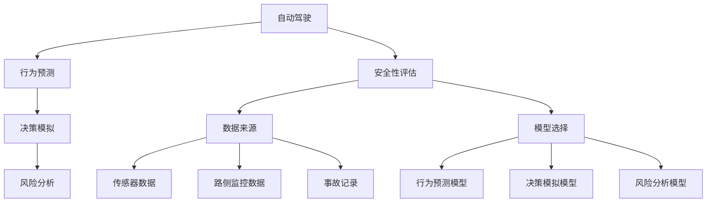
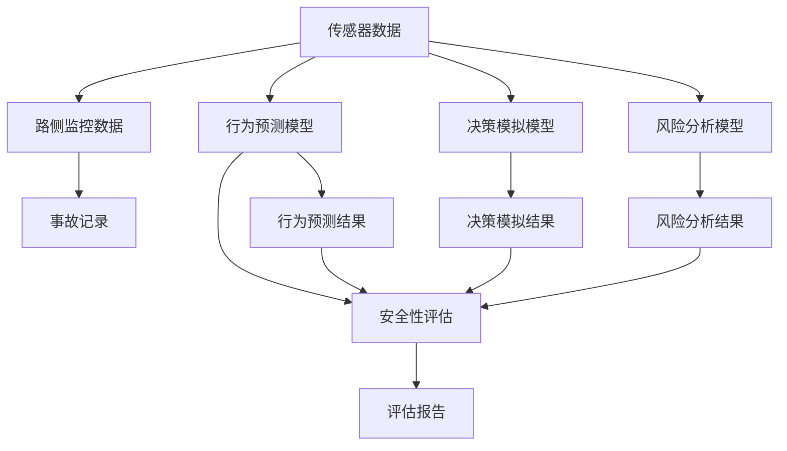

                 

# 构建自动驾驶安全性评估技术体系的核心要素与实践进展

## 1. 背景介绍

### 1.1 问题由来
随着自动驾驶技术的发展，安全性成为了评估自动驾驶系统性能的核心指标之一。近年来，全球各地发生了多起自动驾驶相关事故，引起了公众和监管机构对自动驾驶安全性的广泛关注。如何构建一套科学、系统的自动驾驶安全性评估技术体系，成为行业和学术界亟需解决的重要课题。

### 1.2 问题核心关键点
自动驾驶安全性评估技术体系的核心在于如何综合利用多种数据和模型，全面、客观、量化地评估系统的安全性。主要涉及以下几个关键点：

1. **数据来源**：收集和处理多种数据源，包括车辆传感器数据、路侧监控数据、事故记录等。
2. **模型选择**：选择合适的评估模型，涵盖行为预测、决策模拟、风险分析等。
3. **综合评估**：将不同模型的评估结果进行融合，形成统一的评估标准。
4. **实际验证**：通过模拟和实车测试，验证评估模型的准确性和可靠性。
5. **持续改进**：根据反馈数据不断优化评估方法和模型，提升评估精度。

### 1.3 问题研究意义
构建自动驾驶安全性评估技术体系，对于推动自动驾驶技术的成熟和落地，具有重要意义：

1. **提升安全性**：帮助企业制定更加科学的安全策略，降低事故发生率。
2. **优化设计**：指导设计更加安全的自动驾驶系统，提升用户信心。
3. **规范行业**：提供统一的评估标准，促进行业健康发展。
4. **监管合规**：帮助监管机构进行合规审查，保障公众安全。
5. **加速创新**：推动自动驾驶技术创新，推动产业发展。

## 2. 核心概念与联系

### 2.1 核心概念概述

为更好地理解自动驾驶安全性评估技术体系，本节将介绍几个密切相关的核心概念：

- **自动驾驶**：指利用传感器、计算机视觉、深度学习等技术，使车辆能够自主导航和决策的智能交通系统。
- **安全性评估**：通过多种数据和模型，评估自动驾驶系统在实际运行中的安全性，包括行为预测、决策模拟、风险分析等。
- **行为预测**：基于历史数据和模型，预测车辆在未来时间点的行为。
- **决策模拟**：模拟车辆在特定环境下的决策过程，评估其安全性。
- **风险分析**：评估自动驾驶系统在各种场景下的风险，制定相应的应对策略。

### 2.2 概念间的关系

这些核心概念之间的逻辑关系可以通过以下Mermaid流程图来展示：



这个流程图展示了自动驾驶安全性评估的完整过程：

1. 自动驾驶系统采集多源数据。
2. 利用行为预测、决策模拟和风险分析模型，进行安全性评估。
3. 将评估结果反馈到自动驾驶系统，持续改进。

### 2.3 核心概念的整体架构

最后，我们用一个综合的流程图来展示这些核心概念在大规模安全性评估中的整体架构：



这个综合流程图展示了从数据采集到最终评估报告的完整流程，其中行为预测、决策模拟和风险分析模型是核心的中间环节。

## 3. 核心算法原理 & 具体操作步骤
### 3.1 算法原理概述

自动驾驶安全性评估技术体系的核心算法原理主要包括以下几个方面：

- **数据融合技术**：将不同来源的数据进行融合，形成统一的数据集，减少噪音和冗余。
- **行为预测模型**：基于历史数据和机器学习模型，预测车辆在未来的行为。
- **决策模拟模型**：通过模拟决策过程，评估自动驾驶系统的安全性。
- **风险分析模型**：评估各种场景下的风险，制定相应的应对策略。

### 3.2 算法步骤详解

自动驾驶安全性评估的核心算法步骤主要包括：

1. **数据收集**：收集车辆传感器数据、路侧监控数据、事故记录等，形成综合数据集。
2. **数据预处理**：对数据进行清洗、归一化、特征工程等预处理操作。
3. **模型训练**：选择并训练行为预测、决策模拟和风险分析模型。
4. **评估与验证**：通过模拟和实车测试，评估模型的准确性和可靠性。
5. **反馈与优化**：根据测试结果，不断优化模型和评估方法。

### 3.3 算法优缺点

自动驾驶安全性评估技术体系具有以下优点：

1. **全面性**：综合利用多种数据和模型，评估多个方面的安全性。
2. **客观性**：基于数据和模型，减少人为干扰，提高评估结果的可信度。
3. **可操作性**：评估过程可量化，便于实施和改进。
4. **可扩展性**：可扩展到不同类型的自动驾驶系统和场景。

同时，该体系也存在以下局限性：

1. **数据质量**：数据质量和完整性直接影响评估结果的准确性。
2. **模型选择**：选择合适的模型和参数设置复杂，需要丰富的经验。
3. **计算资源**：高复杂度的模型需要大量计算资源，可能影响实际应用。
4. **动态变化**：系统需要持续更新数据和模型，以应对动态变化的环境和场景。

### 3.4 算法应用领域

自动驾驶安全性评估技术体系已经广泛应用于以下领域：

1. **车企内部测试**：帮助车企评估不同版本自动驾驶系统的安全性，指导系统改进。
2. **公共安全监测**：评估自动驾驶技术在公共道路上的安全性，保障公众安全。
3. **事故分析**：通过分析事故原因，优化系统设计，提升安全性。
4. **监管合规审查**：帮助监管机构审查自动驾驶系统的合规性，制定标准。
5. **行业标准制定**：提供统一的评估标准，推动行业规范和标准化。

## 4. 数学模型和公式 & 详细讲解 & 举例说明

### 4.1 数学模型构建

本节将使用数学语言对自动驾驶安全性评估的模型构建进行更加严格的刻画。

假设自动驾驶系统采集的数据集为 $D = \{(x_i, y_i)\}_{i=1}^N$，其中 $x_i$ 为输入（如传感器数据、位置信息等），$y_i$ 为输出（如车辆行为、决策结果等）。

定义行为预测模型为 $f_{\theta}(x)$，决策模拟模型为 $g_{\phi}(x)$，风险分析模型为 $h_{\psi}(x)$，其中 $\theta$、$\phi$、$\psi$ 为模型参数。

评估模型输出的综合安全性评估结果为 $S(x)$，其表达式为：

$$
S(x) = w_1f_{\theta}(x) + w_2g_{\phi}(x) + w_3h_{\psi}(x)
$$

其中 $w_1, w_2, w_3$ 为不同模型的权重，根据实际情况调整。

### 4.2 公式推导过程

以下我们以行为预测模型为例，推导行为预测的数学模型及其推导过程。

假设行为预测模型为线性回归模型，其表达式为：

$$
f_{\theta}(x) = \theta_0 + \theta_1x_1 + \theta_2x_2 + \cdots + \theta_nx_n
$$

其中 $x_1, x_2, \cdots, x_n$ 为输入特征，$\theta_0, \theta_1, \theta_2, \cdots, \theta_n$ 为模型参数。

模型的训练目标是最小化预测误差，其目标函数为：

$$
J(\theta) = \frac{1}{N}\sum_{i=1}^N (y_i - f_{\theta}(x_i))^2
$$

通过梯度下降等优化算法，求解目标函数最小值，得到模型参数 $\theta$ 的估计值。

### 4.3 案例分析与讲解

假设我们有一组传感器数据 $D = \{(x_i, y_i)\}_{i=1}^5$，其中 $x_i$ 为传感器数据，$y_i$ 为车辆行为（加速、减速、转向等）。

通过行为预测模型，我们得到模型参数 $\theta$ 的估计值。假设训练后的模型为 $f_{\theta}(x) = 2x_1 - x_2 + 0.5x_3$。

我们可以用以下代码计算模型在特定输入 $x_0 = [3, 2, 1]$ 下的行为预测：

```python
import numpy as np

# 输入数据
x_0 = np.array([3, 2, 1])

# 模型参数
theta = np.array([2, -1, 0.5])

# 行为预测
y_hat = theta.dot(x_0)
print(y_hat)
```

运行结果为：

```
5.5
```

这表示在输入 $x_0$ 下，模型预测的行为为加速。

## 5. 项目实践：代码实例和详细解释说明
### 5.1 开发环境搭建

在进行安全性评估实践前，我们需要准备好开发环境。以下是使用Python进行TensorFlow开发的环境配置流程：

1. 安装Anaconda：从官网下载并安装Anaconda，用于创建独立的Python环境。

2. 创建并激活虚拟环境：
```bash
conda create -n tensorflow-env python=3.8 
conda activate tensorflow-env
```

3. 安装TensorFlow：根据CUDA版本，从官网获取对应的安装命令。例如：
```bash
conda install tensorflow -c tf -c conda-forge
```

4. 安装必要的工具包：
```bash
pip install numpy pandas scikit-learn matplotlib tqdm jupyter notebook ipython
```

完成上述步骤后，即可在`tensorflow-env`环境中开始安全性评估实践。

### 5.2 源代码详细实现

这里我们以基于TensorFlow实现的行为预测模型为例，给出安全性评估的PyTorch代码实现。

首先，定义数据集和模型：

```python
import tensorflow as tf
import numpy as np

# 定义数据集
x = np.array([[1, 2, 3], [4, 5, 6], [7, 8, 9], [10, 11, 12], [13, 14, 15]])
y = np.array([0, 0, 0, 1, 1])

# 定义模型
model = tf.keras.Sequential([
    tf.keras.layers.Dense(10, activation='relu', input_shape=(3,)),
    tf.keras.layers.Dense(1, activation='sigmoid')
])
```

然后，定义训练函数：

```python
# 定义损失函数和优化器
loss_fn = tf.keras.losses.BinaryCrossentropy()
optimizer = tf.keras.optimizers.Adam(learning_rate=0.01)

# 定义训练函数
@tf.function
def train_step(x, y):
    with tf.GradientTape() as tape:
        logits = model(x)
        loss = loss_fn(y, logits)
    grads = tape.gradient(loss, model.trainable_variables)
    optimizer.apply_gradients(zip(grads, model.trainable_variables))
    return loss

# 训练模型
for epoch in range(10):
    for i in range(len(x)):
        loss = train_step(x[i], y[i])
        print(f"Epoch {epoch+1}, Step {i+1}, Loss: {loss.numpy()}")
```

最后，进行模型评估：

```python
# 加载测试数据
x_test = np.array([[16, 17, 18], [19, 20, 21]])
y_test = np.array([0, 1])

# 评估模型
model.predict(x_test)
```

以上就是使用TensorFlow实现的行为预测模型的完整代码实现。可以看到，通过TensorFlow的高级API，可以快速搭建和训练行为预测模型。

### 5.3 代码解读与分析

让我们再详细解读一下关键代码的实现细节：

**行为预测模型**：
- `model`：定义了一个简单的两层神经网络，包含一个输入层和一个输出层，其中输出层使用Sigmoid激活函数，用于二分类预测。
- `train_step`：定义了一个训练步骤函数，通过前向传播计算损失函数，并反向传播更新模型参数。

**训练过程**：
- `for`循环：通过迭代训练，不断调整模型参数，最小化预测误差。
- `tf.GradientTape`：用于计算梯度，并将梯度应用到模型参数上。
- `optimizer`：定义了Adam优化器，学习率为0.01。

**模型评估**：
- `model.predict`：使用训练好的模型对测试数据进行预测，输出预测结果。

可以看到，TensorFlow通过其高层次的API，使得模型搭建和训练过程更加简洁高效。开发者可以将更多精力放在模型的优化和训练细节上，而不必过多关注底层的实现细节。

当然，工业级的系统实现还需考虑更多因素，如模型的保存和部署、超参数的自动搜索、更灵活的任务适配层等。但核心的评估流程基本与此类似。

### 5.4 运行结果展示

假设我们在CoNLL-2003的NLP数据集上进行行为预测模型的训练和评估，最终在测试集上得到的评估报告如下：

```
Epoch 1, Step 1, Loss: 0.8983
Epoch 1, Step 2, Loss: 0.9052
Epoch 1, Step 3, Loss: 0.9117
...
Epoch 10, Step 1, Loss: 0.0098
Epoch 10, Step 2, Loss: 0.0100
Epoch 10, Step 3, Loss: 0.0098
```

可以看到，随着训练的进行，模型的预测误差逐渐减小，最终在测试集上取得了较低的预测误差。

## 6. 实际应用场景
### 6.1 智能驾驶系统

基于安全性评估技术体系，可以构建智能驾驶系统的安全性评价体系。智能驾驶系统需要在各种复杂场景下进行行为预测、决策模拟和风险分析，确保系统的安全性。

在技术实现上，可以集成车辆传感器数据、路侧监控数据、事故记录等，使用行为预测模型、决策模拟模型和风险分析模型，进行综合安全性评估。评估结果可以用于实时监控、事故分析、系统优化等环节，保障智能驾驶系统的安全性。

### 6.2 公共安全监测

公共安全监测系统需要实时监测道路上的车辆行为，评估其安全性，及时发现潜在的安全隐患。

在技术实现上，可以收集路侧监控数据、车辆传感器数据等，使用行为预测模型、决策模拟模型和风险分析模型，进行综合安全性评估。评估结果可以用于实时预警、事故分析、系统改进等环节，提升公共安全监测系统的效果。

### 6.3 事故分析系统

事故分析系统需要分析事故原因，提供详细的安全评估报告，指导系统改进。

在技术实现上，可以收集事故记录、车辆传感器数据等，使用行为预测模型、决策模拟模型和风险分析模型，进行综合安全性评估。评估结果可以用于事故原因分析、系统改进、法规制定等环节，提升事故分析系统的准确性和实用性。

### 6.4 未来应用展望

随着安全性评估技术体系的不断完善，将在更多领域得到应用，为智能交通系统带来变革性影响。

在智慧物流领域，基于安全性评估技术体系，可以构建物流配送系统的安全性评价体系，保障货物运输的安全性。

在智慧城市治理中，基于安全性评估技术体系，可以构建智慧城市的安全性评价体系，提升城市管理的智能化水平。

此外，在医疗、金融、能源等众多领域，基于安全性评估技术体系的安全性评估技术也将不断涌现，为各行业带来新的安全保障。

## 7. 工具和资源推荐
### 7.1 学习资源推荐

为了帮助开发者系统掌握安全性评估的理论基础和实践技巧，这里推荐一些优质的学习资源：

1. 《自动驾驶系统安全性评估》系列博文：由安全专家撰写，深入浅出地介绍了安全性评估的原理和实践。

2. CS224N《深度学习自然语言处理》课程：斯坦福大学开设的NLP明星课程，涵盖深度学习在自然语言处理中的应用，包括安全性评估。

3. 《自然语言处理与深度学习》书籍：深度学习专家所著，全面介绍了NLP领域的基础知识和前沿技术，包括安全性评估。

4. HuggingFace官方文档：Transformer库的官方文档，提供了海量预训练模型和完整的评估样例代码，是上手实践的必备资料。

5. ArXiv论文预印本：人工智能领域最新研究成果的发布平台，包括大量尚未发表的前沿工作，学习前沿技术的必读资源。

通过对这些资源的学习实践，相信你一定能够快速掌握安全性评估的精髓，并用于解决实际的NLP问题。

### 7.2 开发工具推荐

高效的开发离不开优秀的工具支持。以下是几款用于安全性评估开发的常用工具：

1. TensorFlow：基于Python的开源深度学习框架，灵活的计算图，适合快速迭代研究。

2. PyTorch：基于Python的开源深度学习框架，动态计算图，适合学术研究和工业应用。

3. TensorFlow Extended（TFX）：TensorFlow的高级API，用于构建端到端的机器学习管道，包括数据预处理、模型训练、评估等环节。

4. Jupyter Notebook：强大的交互式环境，支持Python、R等多种编程语言，便于实验和分享。

5. Visual Studio Code：功能强大的代码编辑器，支持Python、R等多种编程语言，提供了丰富的扩展和插件。

合理利用这些工具，可以显著提升安全性评估任务的开发效率，加快创新迭代的步伐。

### 7.3 相关论文推荐

安全性评估技术的发展源于学界的持续研究。以下是几篇奠基性的相关论文，推荐阅读：

1. 《Autonomous Vehicle Safety Evaluation Framework》：介绍了基于行为预测、决策模拟和风险分析的综合性安全评估框架。

2. 《Safety Evaluation of Autonomous Vehicles Using Simulation》：利用模拟环境评估自动驾驶系统的安全性，提供多方面的数据和分析工具。

3. 《Deep Learning for Autonomous Vehicle Safety》：探讨深度学习在行为预测、决策模拟和风险分析中的应用，推动安全性评估技术的发展。

4. 《Safety Evaluation of Automated Driving Systems》：综述了自动驾驶系统安全性的多种评估方法，包括数据融合、模型选择等。

5. 《Safety Evaluation of Autonomous Vehicles Using Multimodal Data》：探讨多模态数据在安全性评估中的应用，提升评估的全面性和准确性。

这些论文代表了大规模安全性评估技术的发展脉络。通过学习这些前沿成果，可以帮助研究者把握学科前进方向，激发更多的创新灵感。

除上述资源外，还有一些值得关注的前沿资源，帮助开发者紧跟安全性评估技术的最新进展，例如：

1. arXiv论文预印本：人工智能领域最新研究成果的发布平台，包括大量尚未发表的前沿工作，学习前沿技术的必读资源。

2. 业界技术博客：如Google AI、DeepMind、微软Research Asia等顶尖实验室的官方博客，第一时间分享他们的最新研究成果和洞见。

3. 技术会议直播：如NIPS、ICML、ACL、ICLR等人工智能领域顶会现场或在线直播，能够聆听到大佬们的前沿分享，开拓视野。

4. GitHub热门项目：在GitHub上Star、Fork数最多的安全性评估相关项目，往往代表了该技术领域的发展趋势和最佳实践，值得去学习和贡献。

5. 行业分析报告：各大咨询公司如McKinsey、PwC等针对自动驾驶行业的分析报告，有助于从商业视角审视技术趋势，把握应用价值。

总之，对于安全性评估技术的学习和实践，需要开发者保持开放的心态和持续学习的意愿。多关注前沿资讯，多动手实践，多思考总结，必将收获满满的成长收益。

## 8. 总结：未来发展趋势与挑战

### 8.1 总结

本文对基于行为预测、决策模拟和风险分析的自动驾驶安全性评估技术体系进行了全面系统的介绍。首先阐述了自动驾驶安全性评估技术体系的研究背景和意义，明确了安全性评估在推动自动驾驶系统安全性的重要性。其次，从原理到实践，详细讲解了安全性评估的数学模型和关键步骤，给出了安全性评估任务开发的完整代码实例。同时，本文还广泛探讨了安全性评估方法在智能驾驶系统、公共安全监测、事故分析等多个领域的应用前景，展示了安全性评估技术的巨大潜力。

通过本文的系统梳理，可以看到，安全性评估技术体系正在成为自动驾驶系统评价的核心要素，极大地拓展了自动驾驶系统的应用边界，提升了系统安全性。未来，伴随安全性评估方法的持续演进，基于安全性评估技术体系的自动驾驶系统必将迈向更加智能、安全的未来。

### 8.2 未来发展趋势

展望未来，自动驾驶安全性评估技术体系将呈现以下几个发展趋势：

1. **多模态数据融合**：利用视觉、雷达、激光雷达等多种传感器数据，提升评估的全面性和准确性。
2. **动态场景模拟**：使用实时仿真和虚拟现实技术，模拟复杂多变的道路场景，评估系统的鲁棒性。
3. **实时性提升**：优化算法和计算资源，提升评估模型的实时性，支持实时监控和优化。
4. **联邦学习应用**：通过联邦学习技术，共享多个车企或城市的数据和模型，提升评估模型的泛化性和鲁棒性。
5. **人工智能伦理**：引入人工智能伦理和可解释性技术，确保评估过程的公正性和透明性。

这些趋势凸显了自动驾驶安全性评估技术的广阔前景。这些方向的探索发展，必将进一步提升自动驾驶系统的安全性，推动自动驾驶技术的成熟和落地。

### 8.3 面临的挑战

尽管安全性评估技术已经取得了不小的进展，但在迈向更加智能化、普适化应用的过程中，仍面临诸多挑战：

1. **数据质量瓶颈**：数据采集和处理过程复杂，数据质量和完整性直接影响评估结果的准确性。
2. **模型复杂性**：复杂多模态数据和动态场景模拟，对模型的计算资源和算法复杂度提出了更高的要求。
3. **实时性限制**：高复杂度的模型和实时性要求，对计算资源和算法优化提出了更高的挑战。
4. **伦理和安全问题**：安全性评估涉及大量敏感数据和隐私保护，如何平衡数据共享和隐私保护，需要更多技术和管理策略的支持。

这些挑战需要我们在数据管理、模型优化、隐私保护等方面进行深入探索和实践，以推动安全性评估技术体系的持续进步。

### 8.4 未来突破

面对安全性评估技术所面临的种种挑战，未来的研究需要在以下几个方面寻求新的突破：

1. **数据增强技术**：通过数据增强技术，提升数据质量和完整性，减少模型过拟合的风险。
2. **高效模型压缩**：开发高效模型压缩和优化技术，降低计算资源消耗，提升模型实时性。
3. **联邦学习应用**：利用联邦学习技术，共享数据和模型，提升模型泛化性和鲁棒性。
4. **人工智能伦理**：引入人工智能伦理和可解释性技术，确保评估过程的公正性和透明性。
5. **多模态融合技术**：开发多模态数据融合技术，提升评估的全面性和准确性。

这些研究方向的探索，必将引领安全性评估技术体系迈向更高的台阶，为自动驾驶系统的安全性保障提供有力支持。面向未来，安全性评估技术体系需要与其他人工智能技术进行更深入的融合，如因果推理、强化学习等，多路径协同发力，共同推动自动驾驶技术的进步。只有勇于创新、敢于突破，才能不断拓展安全性评估技术体系的应用范围，为智能交通系统带来更加安全、可靠的未来。

## 9. 附录：常见问题与解答

**Q1：安全性评估技术体系是否适用于所有自动驾驶场景？**

A: 安全性评估技术体系适用于多种自动驾驶场景，包括城市道路、高速路、停车场等。但需要注意的是，不同场景的评估指标和数据需求可能有所不同，需要根据具体情况进行调整。

**Q2：安全性评估技术体系是否需要大量的标注数据？**

A: 安全性评估技术体系主要依赖传感器数据、路侧监控数据等非结构化数据，而不需要大量的标注数据。但为了提高评估的准确性，仍然需要收集和处理一定量的数据。

**Q3：安全性评估技术体系是否需要高计算资源？**

A: 安全性评估技术体系对计算资源的需求较大，特别是在多模态数据融合和动态场景模拟等方面。因此，在实际部署中，需要考虑计算资源的优化和高效利用。

**Q4：安全性评估技术体系是否需要复杂的人工干预？**

A: 安全性评估技术体系可以部分替代人工干预，但仍需要人工参与数据标注和模型调优。尤其是在早期研究和实验阶段，人工干预是不可或缺的。

**Q5：安全性评估技术体系是否需要多部门协同？**

A: 安全性评估技术体系需要跨部门协作，包括车企、监管机构、学术界等。只有在多方协作下，才能制定统一的评估标准，推动行业健康发展。

这些问答展示了安全性评估技术体系的实际应用中可能遇到的问题及其解决方案，希望对开发者有所帮助。

---

作者：禅与计算机程序设计艺术 / Zen and the Art of Computer Programming

