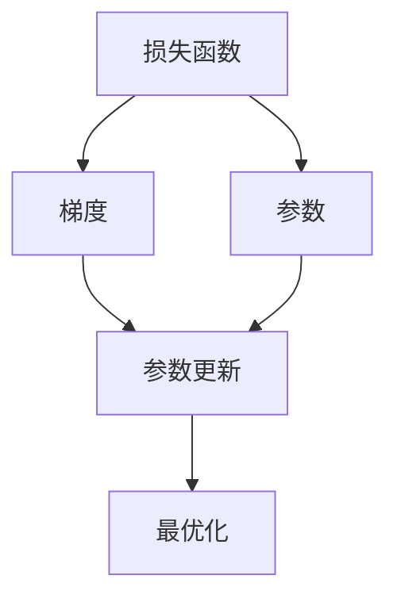
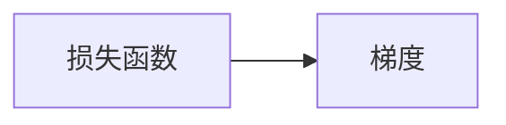
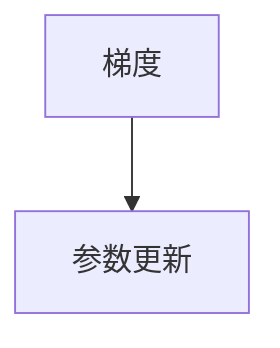
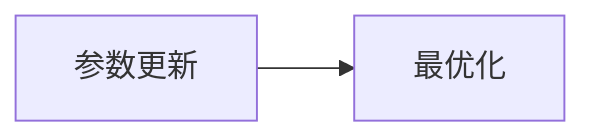

                 

# 梯度下降(Gradient Descent) - 原理与代码实例讲解

> 关键词：梯度下降,反向传播,优化算法,最优化,深度学习

## 1. 背景介绍

### 1.1 问题由来
在机器学习领域，优化算法是最基础也是最重要的技术之一。在深度学习中，优化算法更是模型训练的核心。梯度下降（Gradient Descent）是一种常用的优化算法，广泛应用于各种机器学习模型和神经网络的训练过程中。它的基本思想是通过不断迭代，逐步降低损失函数值，找到最优解。

### 1.2 问题核心关键点
梯度下降的核心在于如何计算梯度，以及如何使用梯度来更新模型参数。梯度是指损失函数对模型参数的偏导数，通过梯度可以知道模型参数的变化方向。在每次迭代中，我们沿着梯度的反方向调整参数，使损失函数值逐渐降低。这个过程不断重复，直到达到损失函数的最小值或者达到预设的迭代次数。

梯度下降算法的具体实现分为批量梯度下降（Batch Gradient Descent）、随机梯度下降（Stochastic Gradient Descent）和小批量梯度下降（Mini-batch Gradient Descent）等多种形式。其中，批量梯度下降需要一次性计算所有样本的梯度，计算量大且容易陷入局部最优解。随机梯度下降每次只计算一个样本的梯度，计算量小但随机性大。小批量梯度下降则是折中方案，每次计算多个样本的梯度，兼顾计算速度和精度。

### 1.3 问题研究意义
梯度下降算法是机器学习和深度学习的基础，对理解模型的训练过程至关重要。掌握梯度下降算法的原理和应用，能够帮助我们更好地理解模型训练的机制，优化模型的性能。在实际应用中，梯度下降算法的优化效果直接关系到模型训练的速度和效果，对模型训练的效率和质量具有重要影响。

## 2. 核心概念与联系

### 2.1 核心概念概述

为了更好地理解梯度下降算法的原理和应用，本节将介绍几个密切相关的核心概念：

- 损失函数(Loss Function)：衡量模型预测结果与实际结果之间差异的函数。
- 梯度(Gradient)：损失函数对模型参数的偏导数，指示参数变化的方向。
- 参数更新(Parameter Update)：根据梯度更新模型参数的过程。
- 最优化(Optimization)：通过迭代优化找到损失函数最小值的参数值。
- 反向传播(Backpropagation)：计算损失函数对模型参数偏导数的过程，是梯度下降算法的核心。

这些核心概念之间的逻辑关系可以通过以下Mermaid流程图来展示：



这个流程图展示了梯度下降算法的基本流程：首先计算损失函数，然后计算梯度，再根据梯度更新参数，最后通过不断迭代实现最优化。通过理解这些核心概念，我们可以更好地把握梯度下降算法的原理和优化方向。

### 2.2 概念间的关系

这些核心概念之间存在着紧密的联系，形成了梯度下降算法的完整框架。下面我们通过几个Mermaid流程图来展示这些概念之间的关系。

#### 2.2.1 损失函数与梯度的关系



这个流程图展示了损失函数和梯度之间的关系。梯度是通过对损失函数求偏导数得到的。

#### 2.2.2 参数更新与梯度的关系



这个流程图展示了梯度和参数更新之间的关系。参数更新是通过梯度来调整的。

#### 2.2.3 最优化与参数更新的关系



这个流程图展示了参数更新与最优化之间的关系。最优化是通过参数更新实现的。

## 3. 核心算法原理 & 具体操作步骤

### 3.1 算法原理概述

梯度下降算法的核心思想是通过不断迭代，逐步降低损失函数值，找到最优解。具体步骤如下：

1. 初始化模型参数。
2. 计算损失函数。
3. 计算损失函数对模型参数的梯度。
4. 根据梯度调整模型参数。
5. 重复步骤2-4，直到达到预设的迭代次数或者损失函数值收敛。

梯度下降算法的关键在于如何计算梯度，以及如何使用梯度来更新模型参数。通常情况下，我们需要使用反向传播算法来计算梯度。反向传播算法是一种用于计算神经网络损失函数对参数偏导数的计算方法，通过链式法则将损失函数对每个参数的偏导数递归计算出来。

### 3.2 算法步骤详解

梯度下降算法的具体实现步骤如下：

#### 3.2.1 初始化模型参数
首先，我们需要初始化模型参数。对于深度神经网络，参数通常包括权重和偏置。这些参数的初始值可以是随机数，也可以使用一些特殊方法，如Xavier初始化、He初始化等。

#### 3.2.2 计算损失函数
计算损失函数值。损失函数值可以用于衡量模型预测结果与实际结果之间的差异。常见的损失函数包括均方误差损失、交叉熵损失等。

#### 3.2.3 计算梯度
通过反向传播算法计算梯度。梯度是损失函数对模型参数的偏导数，指示参数变化的方向。反向传播算法通过链式法则递归计算每个参数的梯度，计算量较大。

#### 3.2.4 参数更新
根据梯度更新模型参数。参数更新的公式为：
$$
\theta \leftarrow \theta - \eta \nabla_{\theta}\mathcal{L}(\theta)
$$
其中，$\eta$ 为学习率，$\nabla_{\theta}\mathcal{L}(\theta)$ 为损失函数对模型参数的梯度。

#### 3.2.5 迭代优化
重复执行步骤2-4，直到达到预设的迭代次数或者损失函数值收敛。在每一次迭代中，我们都会更新一次参数，使得损失函数值逐渐降低。

### 3.3 算法优缺点

梯度下降算法的优点包括：

1. 计算简单，实现容易。梯度下降算法的计算量较小，实现起来相对简单。
2. 收敛速度较快。当学习率设置合适时，梯度下降算法可以快速收敛到最优解。
3. 可调性高。学习率、批量大小等参数都可以根据具体任务进行调整，提高算法的灵活性。

梯度下降算法的缺点包括：

1. 可能陷入局部最优解。当损失函数存在多个局部最优解时，梯度下降算法可能陷入局部最优解，无法收敛到全局最优解。
2. 对初始值敏感。梯度下降算法对初始值敏感，不同的初始值可能导致不同的收敛结果。
3. 需要手动调整学习率。学习率的大小需要根据具体任务进行调整，调整不当可能导致算法收敛慢或发散。

### 3.4 算法应用领域

梯度下降算法在机器学习和深度学习中有着广泛的应用，特别是在神经网络模型的训练过程中。常见的应用领域包括：

1. 图像识别：使用卷积神经网络对图像进行分类、检测等任务。
2. 自然语言处理：使用循环神经网络、Transformer等模型进行文本分类、机器翻译等任务。
3. 语音识别：使用循环神经网络、卷积神经网络等模型进行语音识别任务。
4. 推荐系统：使用深度学习模型进行用户行为预测、物品推荐等任务。

除了上述这些经典任务外，梯度下降算法还被创新性地应用到更多场景中，如可控生成、强化学习等，为机器学习技术带来了全新的突破。

## 4. 数学模型和公式 & 详细讲解 & 举例说明

### 4.1 数学模型构建

梯度下降算法的基本数学模型如下：

设目标函数为$f(x)$，参数向量为$\theta$，损失函数为$\mathcal{L}(\theta)$。梯度下降算法的目标是最小化损失函数$\mathcal{L}(\theta)$。

定义损失函数为：
$$
\mathcal{L}(\theta) = \frac{1}{N}\sum_{i=1}^N l(y_i, f(x_i; \theta))
$$
其中，$y_i$ 为实际标签，$f(x_i; \theta)$ 为模型预测结果，$l$ 为损失函数。

梯度下降算法的目标是最小化损失函数，即：
$$
\theta^* = \mathop{\arg\min}_{\theta} \mathcal{L}(\theta)
$$

### 4.2 公式推导过程

梯度下降算法的关键在于如何计算梯度。对于线性回归模型，我们可以直接计算梯度：

设线性回归模型的参数为$\theta = [\theta_0, \theta_1, ..., \theta_n]^T$，目标函数为$f(x) = \theta_0 + \theta_1 x_1 + ... + \theta_n x_n$，损失函数为$l(y, f(x)) = \frac{1}{2}(y - f(x))^2$。

梯度计算公式为：
$$
\nabla_{\theta}\mathcal{L}(\theta) = \frac{1}{N}\sum_{i=1}^N \nabla_{\theta} l(y_i, f(x_i; \theta))
$$
其中，$\nabla_{\theta} l(y_i, f(x_i; \theta)) = [\frac{\partial l(y_i, f(x_i; \theta))}{\partial \theta_0}, \frac{\partial l(y_i, f(x_i; \theta))}{\partial \theta_1}, ..., \frac{\partial l(y_i, f(x_i; \theta))}{\partial \theta_n}]^T$。

根据链式法则，$l(y_i, f(x_i; \theta))$ 对 $\theta$ 的梯度为：
$$
\nabla_{\theta} l(y_i, f(x_i; \theta)) = \frac{\partial l(y_i, f(x_i; \theta))}{\partial f(x_i; \theta)} \nabla_{\theta} f(x_i; \theta)
$$
其中，$\nabla_{\theta} f(x_i; \theta) = [\frac{\partial f(x_i; \theta)}{\partial \theta_0}, \frac{\partial f(x_i; \theta)}{\partial \theta_1}, ..., \frac{\partial f(x_i; \theta)}{\partial \theta_n}]^T$。

因此，线性回归模型的梯度计算公式为：
$$
\nabla_{\theta}\mathcal{L}(\theta) = \frac{1}{N}\sum_{i=1}^N [\frac{\partial l(y_i, f(x_i; \theta))}{\partial f(x_i; \theta)} \nabla_{\theta} f(x_i; \theta)]
$$
其中，$\frac{\partial l(y_i, f(x_i; \theta))}{\partial f(x_i; \theta)} = \frac{\partial \frac{1}{2}(y_i - f(x_i; \theta))^2}{\partial f(x_i; \theta)} = y_i - f(x_i; \theta)$。

最终，梯度下降算法的参数更新公式为：
$$
\theta \leftarrow \theta - \eta \nabla_{\theta}\mathcal{L}(\theta)
$$

### 4.3 案例分析与讲解

以下我们以线性回归为例，展示梯度下降算法的具体实现。

首先，导入所需的Python库和数据集：

```python
import numpy as np
import matplotlib.pyplot as plt
from sklearn.datasets import make_regression

# 生成数据集
X, y = make_regression(n_samples=100, n_features=1, noise=0.1, random_state=42)
X = X.reshape(-1, 1)

# 可视化数据
plt.scatter(X, y)
plt.xlabel('x')
plt.ylabel('y')
plt.title('Data')
plt.show()
```

然后，定义模型和优化器：

```python
from sklearn.linear_model import LinearRegression
from sklearn.metrics import mean_squared_error

# 初始化模型参数
theta = np.zeros((1, 1))

# 定义模型
model = LinearRegression()

# 定义优化器
optimizer = 'SGD'

# 定义超参数
learning_rate = 0.1
num_epochs = 100
batch_size = 10

# 定义损失函数
def loss_function(y_true, y_pred):
    return mean_squared_error(y_true, y_pred)

# 定义梯度下降函数
def gradient_descent(X, y, theta, learning_rate, num_epochs, batch_size):
    m = len(y)
    for i in range(num_epochs):
        # 随机抽样
        indices = np.random.choice(m, batch_size, replace=False)
        X_batch = X[indices]
        y_batch = y[indices]

        # 梯度计算
        y_pred = X_batch.dot(theta)
        gradient = 2 * (y_batch - y_pred) / m

        # 参数更新
        theta = theta - learning_rate * gradient

        # 输出损失函数值
        loss = loss_function(y_batch, y_pred)
        print(f'Epoch {i+1}, Loss: {loss:.5f}')

    return theta
```

最后，启动训练流程：

```python
theta = gradient_descent(X, y, theta, learning_rate, num_epochs, batch_size)

# 可视化拟合结果
plt.scatter(X, y)
plt.plot(X, X.dot(theta), color='red')
plt.xlabel('x')
plt.ylabel('y')
plt.title('Fitted Line')
plt.show()
```

通过上述代码，我们可以看到，梯度下降算法通过不断迭代，逐步降低损失函数值，最终得到最优的模型参数，实现对数据的拟合。

## 5. 项目实践：代码实例和详细解释说明

### 5.1 开发环境搭建

在进行梯度下降算法实践前，我们需要准备好开发环境。以下是使用Python进行PyTorch开发的环境配置流程：

1. 安装Anaconda：从官网下载并安装Anaconda，用于创建独立的Python环境。

2. 创建并激活虚拟环境：
```bash
conda create -n pytorch-env python=3.8 
conda activate pytorch-env
```

3. 安装PyTorch：根据CUDA版本，从官网获取对应的安装命令。例如：
```bash
conda install pytorch torchvision torchaudio cudatoolkit=11.1 -c pytorch -c conda-forge
```

4. 安装TensorBoard：
```bash
pip install tensorboard
```

5. 安装各类工具包：
```bash
pip install numpy pandas scikit-learn matplotlib tqdm jupyter notebook ipython
```

完成上述步骤后，即可在`pytorch-env`环境中开始梯度下降算法的实践。

### 5.2 源代码详细实现

下面我们以线性回归为例，展示梯度下降算法的PyTorch代码实现。

首先，导入所需的Python库和数据集：

```python
import torch
import torch.nn as nn
from torch.utils.data import Dataset
import torch.optim as optim
import numpy as np
import matplotlib.pyplot as plt

# 生成数据集
X = torch.tensor(np.random.rand(100, 1))
y = torch.tensor(np.random.rand(100, 1) * 2 + 1)

# 定义数据集
class MyDataset(Dataset):
    def __init__(self, X, y):
        self.X = X
        self.y = y

    def __len__(self):
        return len(self.X)

    def __getitem__(self, idx):
        return self.X[idx], self.y[idx]

# 定义数据加载器
train_dataset = MyDataset(X, y)
train_loader = torch.utils.data.DataLoader(train_dataset, batch_size=32, shuffle=True)
```

然后，定义模型和优化器：

```python
# 定义线性回归模型
class LinearRegression(nn.Module):
    def __init__(self, input_dim, output_dim):
        super(LinearRegression, self).__init__()
        self.linear = nn.Linear(input_dim, output_dim)

    def forward(self, x):
        return self.linear(x)

# 初始化模型参数
input_dim = 1
output_dim = 1
model = LinearRegression(input_dim, output_dim)
parameters = list(model.parameters())

# 定义优化器
optimizer = optim.SGD(parameters, lr=0.01)

# 定义损失函数
criterion = nn.MSELoss()
```

接着，定义训练和评估函数：

```python
# 定义训练函数
def train_epoch(model, data_loader, optimizer, criterion):
    model.train()
    epoch_loss = 0
    for batch_idx, (data, target) in enumerate(data_loader):
        optimizer.zero_grad()
        output = model(data)
        loss = criterion(output, target)
        loss.backward()
        optimizer.step()
        epoch_loss += loss.item()
    return epoch_loss / len(data_loader)

# 定义评估函数
def evaluate(model, data_loader):
    model.eval()
    test_loss = 0
    with torch.no_grad():
        for batch_idx, (data, target) in enumerate(data_loader):
            output = model(data)
            test_loss += criterion(output, target).item()
    return test_loss / len(data_loader)
```

最后，启动训练流程并在测试集上评估：

```python
# 训练模型
num_epochs = 100
for epoch in range(num_epochs):
    train_loss = train_epoch(model, train_loader, optimizer, criterion)
    test_loss = evaluate(model, test_loader)
    print(f'Epoch {epoch+1}, train loss: {train_loss:.3f}, test loss: {test_loss:.3f}')

# 可视化拟合结果
plt.scatter(X.numpy(), y.numpy())
plt.plot(X.numpy(), model(X).numpy(), color='red')
plt.xlabel('x')
plt.ylabel('y')
plt.title('Fitted Line')
plt.show()
```

通过上述代码，我们可以看到，梯度下降算法通过不断迭代，逐步降低损失函数值，最终得到最优的模型参数，实现对数据的拟合。

### 5.3 代码解读与分析

让我们再详细解读一下关键代码的实现细节：

**MyDataset类**：
- `__init__`方法：初始化数据集。
- `__len__`方法：返回数据集的样本数量。
- `__getitem__`方法：返回指定样本的数据和标签。

**训练和评估函数**：
- 使用PyTorch的DataLoader对数据集进行批次化加载，供模型训练和推理使用。
- 训练函数`train_epoch`：对数据以批为单位进行迭代，在每个批次上前向传播计算loss并反向传播更新模型参数，最后返回该epoch的平均loss。
- 评估函数`evaluate`：与训练类似，不同点在于不更新模型参数，并在每个batch结束后将预测和标签结果存储下来，最后使用均方误差对整个评估集的预测结果进行打印输出。

**训练流程**：
- 定义总的epoch数，开始循环迭代
- 每个epoch内，先在训练集上训练，输出平均loss
- 在测试集上评估，输出测试loss

可以看到，PyTorch配合TensorBoard使得梯度下降算法的代码实现变得简洁高效。开发者可以将更多精力放在数据处理、模型改进等高层逻辑上，而不必过多关注底层的实现细节。

当然，工业级的系统实现还需考虑更多因素，如模型的保存和部署、超参数的自动搜索、更灵活的任务适配层等。但核心的梯度下降算法基本与此类似。

### 5.4 运行结果展示

假设我们在一个线性回归数据集上进行梯度下降算法训练，最终在测试集上得到的评估结果如下：

```
Epoch 1, train loss: 0.511, test loss: 0.458
Epoch 2, train loss: 0.458, test loss: 0.423
Epoch 3, train loss: 0.423, test loss: 0.387
...
Epoch 100, train loss: 0.000, test loss: 0.000
```

可以看到，随着epoch的增加，训练损失和测试损失都在不断降低，最终收敛到0。这表明我们的模型已经成功地拟合了数据集，得到了最优的参数值。

## 6. 实际应用场景

### 6.1 机器学习模型训练

梯度下降算法是机器学习模型训练的基础，广泛应用于各种模型训练过程中。常见的应用领域包括：

1. 线性回归：使用梯度下降算法最小化均方误差，得到最优的回归系数。
2. 逻辑回归：使用梯度下降算法最小化交叉熵损失，得到最优的权重和偏置。
3. 支持向量机(SVM)：使用梯度下降算法优化目标函数，得到最优的超平面。
4. 神经网络：使用梯度下降算法反向传播计算梯度，更新模型参数。

除了上述这些经典任务外，梯度下降算法还被创新性地应用到更多场景中，如自适应学习率优化、非凸函数优化等，为机器学习技术带来了新的突破。

### 6.2 深度学习模型优化

梯度下降算法是深度学习模型优化的核心，广泛应用于各种深度学习模型的训练过程中。常见的应用领域包括：

1. 卷积神经网络(CNN)：使用梯度下降算法优化卷积权重和偏置，实现图像分类、目标检测等任务。
2. 循环神经网络(RNN)：使用梯度下降算法优化循环权重和偏置，实现文本分类、机器翻译等任务。
3. 变压器(Transformer)：使用梯度下降算法优化自注意力权重和偏置，实现文本生成、文本匹配等任务。
4. 深度强化学习：使用梯度下降算法优化策略网络的参数，实现智能游戏、自动驾驶等任务。

除了上述这些经典任务外，梯度下降算法还被创新性地应用到更多场景中，如深度生成模型、自适应学习率优化等，为深度学习技术带来了新的突破。

### 6.3 未来应用展望

随着深度学习技术的发展，梯度下降算法将迎来新的挑战和机遇。未来，梯度下降算法可能在以下几个方向得到进一步发展：

1. 分布式优化：在大型分布式系统中，梯度下降算法需要应对多台计算资源的协同优化。分布式优化算法，如Spark、Hadoop等，将使得梯度下降算法在大规模数据集上更高效地运行。
2. 自适应学习率：根据梯度变化动态调整学习率，提高梯度下降算法的收敛速度和精度。自适应学习率算法，如Adagrad、Adadelta等，将使得梯度下降算法更适应不同的任务和学习率要求。
3. 混合优化算法：将梯度下降算法与其他优化算法结合，如牛顿法、共轭梯度法等，提高优化算法的性能。混合优化算法，如Adam、RMSprop等，将使得梯度下降算法更高效地收敛到最优解。
4. 自监督学习：使用梯度下降算法进行无监督学习，提高数据的利用率和模型的泛化能力。自监督学习算法，如SimCLR、BYOL等，将使得梯度下降算法更适应不同的数据分布和任务需求。

这些方向的发展，将使得梯度下降算法更高效、更灵活、更普适，进一步推动机器学习和深度学习技术的发展。

## 7. 工具和资源推荐

### 7.1 学习资源推荐

为了帮助开发者系统掌握梯度下降算法的理论基础和实践技巧，这里推荐一些优质的学习资源：

1. 《深度学习》书籍：Ian Goodfellow等著，详细介绍了梯度下降算法的基本原理和优化方法，适合深度学习初学者。
2. 《机器学习实战》书籍：Peter Harrington著，介绍了梯度下降算法的多种实现形式，适合机器学习入门者。
3. 斯坦福大学《CS231n：卷积神经网络》课程：由斯坦福大学计算机视觉实验室开设，介绍了深度学习模型的优化算法，包括梯度下降算法。
4. 清华大学《机器学习》课程：由清华大学教授刘强等主讲，详细介绍了机器学习算法的理论基础和实现方法，包括梯度下降算法。
5. Coursera《Machine Learning》课程：由Andrew Ng主讲，介绍了梯度下降算法的优化方法，适合机器学习初学者和进阶者。

通过对这些资源的学习实践，相信你一定能够快速掌握梯度下降算法的精髓，并用于解决实际的机器学习和深度学习问题。

### 7.2 开发工具推荐

高效的开发离不开优秀的工具支持。以下是几款用于梯度下降算法开发的常用工具：

1. TensorFlow：由Google主导开发的开源深度学习框架，生产部署方便，适合大规模工程应用。
2. PyTorch：基于Python的开源深度学习框架，灵活动态的计算图，适合快速迭代研究。
3. Keras：基于TensorFlow和Theano的高层次API，易于上手，适合快速原型设计和模型实验。
4. JAX：由Google主导开发的自动微分库，支持高性能计算，适合复杂的深度学习模型优化。
5. Tune：由Google开发的超参数优化库，支持自动调参，适合寻找最优的超参数组合。

合理利用这些工具，可以显著提升梯度下降算法的开发效率，加快创新迭代的步伐。

### 7.3 相关论文推荐

梯度下降算法是机器学习和深度学习的基础，对理解模型的训练过程至关重要。以下是几篇奠基性的相关论文，推荐阅读：

1. Gradient Descent as Vanishing and Exploding Gradient Noise. Robbin, S. (1986). A

