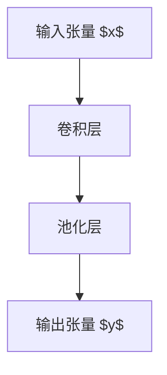

                 

# 池化层 (Pooling Layer) 原理与代码实例讲解

> 关键词：池化层 (Pooling Layer), 卷积神经网络 (Convolutional Neural Network, CNN), 特征压缩 (Feature Compression), 非线性变换 (Non-linear Transformation), 稀疏表示 (Sparse Representation)

## 1. 背景介绍

在深度学习模型中，卷积神经网络（Convolutional Neural Network, CNN）以其在图像处理、自然语言处理等领域的高效性能而广受关注。CNN的核心组件包括卷积层 (Convolutional Layer) 和池化层 (Pooling Layer)。卷积层通过卷积操作提取输入数据的局部特征，而池化层则通过对卷积层的输出进行非线性变换，实现特征的压缩和表达，提高模型的泛化能力。

本文将重点介绍池化层的原理与代码实例，帮助读者深入理解其在CNN中的作用，并探讨其在实际应用中的优化策略。

## 2. 核心概念与联系

### 2.1 核心概念概述

池化层是卷积神经网络中的一个重要组件，其主要作用是通过对卷积层的输出进行非线性变换，实现特征的压缩和表达。池化层的输入通常是一个张量，通过在特定方向上进行降维操作，生成一个更紧凑的输出张量，以减少计算量和内存消耗。

池化层的基本操作包括最大池化 (Max Pooling)、平均池化 (Average Pooling) 和 L2 池化 (L2 Pooling) 等，其中最大池化是最常用的一种。

#### 2.2 核心概念的数学定义

池化层的数学定义如下：

设 $x$ 为输入张量， $w$ 为池化窗口大小， $s$ 为池化步长， $p$ 为池化操作类型（如最大池化、平均池化等）。则池化层的输出 $y$ 为：

$$
y_{i,j} = p_{x_{i*w+i,j*w+j}}
$$

其中 $p$ 表示池化操作，$x_{i*w+i,j*w+j}$ 表示输入张量 $x$ 中位置 $(i,j)$ 对应于池化窗口 $w$ 中位置 $(w*i+w*j)$ 的元素。

以最大池化为例，其具体公式为：

$$
y_{i,j} = \max\{x_{i*w+i,j*w+j}\}
$$

池化层的输出张量大小为 $\lfloor\frac{H_{in}}{s}\rfloor \times \lfloor\frac{W_{in}}{s}\rfloor$，其中 $H_{in}$ 和 $W_{in}$ 分别为输入张量的高和宽。

#### 2.3 核心概念的逻辑关系

池化层的逻辑关系可以通过以下 Mermaid 流程图来展示：



池化层通常位于卷积层之后，对卷积层的输出进行非线性变换。池化层的输出作为下一层的输入，继续进行卷积、池化等操作。

## 3. 核心算法原理 & 具体操作步骤

### 3.1 算法原理概述

池化层的核心原理是通过在卷积层的输出上执行池化操作，实现特征的压缩和表达。池化操作具有以下特点：

1. **降维**：通过在特定方向上进行降维操作，池化层可以将高维的特征张量转换为低维的表示，减少计算量和内存消耗。
2. **非线性变换**：池化操作是一种非线性变换，通过选择池化窗口内的最大值或平均值等操作，实现特征的非线性映射。
3. **空间不变性**：池化操作具有空间不变性，即无论输入张量的位置如何变化，池化操作的结果保持不变。

池化层通过降维和非线性变换，可以有效地提高模型的泛化能力和鲁棒性，减少过拟合风险。

### 3.2 算法步骤详解

池化层的操作步骤主要包括：

1. **输入张量的准备**：将卷积层的输出张量作为池化层的输入。
2. **池化窗口的滑动**：在输入张量上滑动池化窗口，执行池化操作，生成输出张量的每个元素。
3. **非线性变换**：根据池化操作类型，将池化窗口内的元素进行非线性变换，生成池化层的输出。

以最大池化为例，具体步骤如下：

1. 将输入张量 $x$ 作为池化层的输入。
2. 在输入张量 $x$ 上滑动池化窗口 $w$，计算每个池化窗口内的最大值。
3. 将每个池化窗口的最大值作为池化层的输出，生成输出张量 $y$。

### 3.3 算法优缺点

池化层具有以下优点：

1. **计算效率高**：池化操作具有空间不变性，可以大大减少计算量和内存消耗。
2. **特征表达能力强**：通过非线性变换，池化层可以提取出输入数据的特征，增强模型的泛化能力。
3. **模型鲁棒性强**：池化层具有空间不变性，可以提高模型的鲁棒性，减少过拟合风险。

池化层的主要缺点包括：

1. **特征信息丢失**：池化操作会丢失部分特征信息，可能导致模型性能下降。
2. **模型复杂度高**：池化层的设计需要考虑池化窗口大小、池化步长等因素，设计不当可能导致模型复杂度高，计算量大。
3. **模型难以解释**：池化层是一种黑盒操作，其内部机制难以解释，可能影响模型的可解释性和可理解性。

### 3.4 算法应用领域

池化层广泛应用于图像处理、自然语言处理等计算机视觉和自然语言处理领域。在图像处理中，池化层通过对图像特征图进行降维操作，实现特征压缩和表达。在自然语言处理中，池化层可以对文本特征进行降维，增强模型的泛化能力。

## 4. 数学模型和公式 & 详细讲解 & 举例说明

### 4.1 数学模型构建

池化层在数学上可以通过以下模型来描述：

设 $x$ 为输入张量， $w$ 为池化窗口大小， $s$ 为池化步长， $p$ 为池化操作类型（如最大池化、平均池化等）。则池化层的输出 $y$ 为：

$$
y_{i,j} = p_{x_{i*w+i,j*w+j}}
$$

其中 $p$ 表示池化操作，$x_{i*w+i,j*w+j}$ 表示输入张量 $x$ 中位置 $(i,j)$ 对应于池化窗口 $w$ 中位置 $(w*i+w*j)$ 的元素。

以最大池化为例，其具体公式为：

$$
y_{i,j} = \max\{x_{i*w+i,j*w+j}\}
$$

### 4.2 公式推导过程

池化层的数学推导过程如下：

设 $x$ 为输入张量， $w$ 为池化窗口大小， $s$ 为池化步长， $p$ 为池化操作类型。则池化层的输出 $y$ 可以表示为：

$$
y_{i,j} = \max\{x_{i*w+i,j*w+j}\}
$$

池化层的输出张量大小为 $\lfloor\frac{H_{in}}{s}\rfloor \times \lfloor\frac{W_{in}}{s}\rfloor$，其中 $H_{in}$ 和 $W_{in}$ 分别为输入张量的高和宽。

### 4.3 案例分析与讲解

以 LeNet-5 网络为例，分析池化层在图像分类任务中的作用：

LeNet-5 网络是一个经典的卷积神经网络，用于手写数字识别。其结构如下：

```
input(28x28x1)
conv(5x5x1) -> relu
pool(2x2x2) -> max pooling
conv(5x5x16) -> relu
pool(2x2x2) -> max pooling
fc(4096) -> relu
fc(10) -> softmax
```

在这个网络中，池化层通过对卷积层的输出进行最大池化操作，实现特征的降维和表达。池化层可以提取出图像中的重要特征，减少模型的计算量和内存消耗，同时增强模型的泛化能力。

## 5. 项目实践：代码实例和详细解释说明

### 5.1 开发环境搭建

在进行池化层的实践时，我们需要准备好开发环境。以下是使用 PyTorch 进行代码实现的环境配置流程：

1. 安装 Anaconda：从官网下载并安装 Anaconda，用于创建独立的 Python 环境。
2. 创建并激活虚拟环境：
```bash
conda create -n pytorch-env python=3.8 
conda activate pytorch-env
```
3. 安装 PyTorch：根据 CUDA 版本，从官网获取对应的安装命令。例如：
```bash
conda install pytorch torchvision torchaudio cudatoolkit=11.1 -c pytorch -c conda-forge
```
4. 安装 Transformers 库：
```bash
pip install transformers
```
5. 安装各类工具包：
```bash
pip install numpy pandas scikit-learn matplotlib tqdm jupyter notebook ipython
```

完成上述步骤后，即可在 `pytorch-env` 环境中开始代码实现。

### 5.2 源代码详细实现

下面我们以图像分类任务为例，给出使用 PyTorch 进行池化层实现和调参的代码实现。

首先，定义池化层函数：

```python
import torch
import torch.nn as nn

class MaxPool2d(nn.Module):
    def __init__(self, kernel_size, stride=None, padding=0, dilation=1):
        super(MaxPool2d, self).__init__()
        self.pool = nn.MaxPool2d(kernel_size, stride, padding, dilation)

    def forward(self, x):
        return self.pool(x)
```

然后，定义一个简单的卷积神经网络，其中包含两个卷积层和两个池化层：

```python
class LeNet5(nn.Module):
    def __init__(self):
        super(LeNet5, self).__init__()
        self.conv1 = nn.Conv2d(1, 6, 5)
        self.pool = nn.MaxPool2d(2, 2)
        self.conv2 = nn.Conv2d(6, 16, 5)
        self.fc1 = nn.Linear(16 * 5 * 5, 120)
        self.fc2 = nn.Linear(120, 84)
        self.fc3 = nn.Linear(84, 10)

    def forward(self, x):
        x = self.pool(nn.functional.relu(self.conv1(x)))
        x = self.pool(nn.functional.relu(self.conv2(x)))
        x = x.view(-1, 16 * 5 * 5)
        x = nn.functional.relu(self.fc1(x))
        x = nn.functional.relu(self.fc2(x))
        x = self.fc3(x)
        return x
```

接着，定义训练和评估函数：

```python
from torch.utils.data import DataLoader
from torchvision import datasets, transforms

# 数据加载
train_dataset = datasets.MNIST(root='./data', train=True, transform=transforms.ToTensor(), download=True)
test_dataset = datasets.MNIST(root='./data', train=False, transform=transforms.ToTensor())

# 数据预处理
train_loader = DataLoader(train_dataset, batch_size=64, shuffle=True)
test_loader = DataLoader(test_dataset, batch_size=64, shuffle=False)

# 定义模型和优化器
model = LeNet5()
optimizer = torch.optim.SGD(model.parameters(), lr=0.001, momentum=0.9)

# 训练过程
def train_epoch(model, data_loader, optimizer):
    model.train()
    for batch_idx, (data, target) in enumerate(train_loader):
        data, target = data.to(device), target.to(device)
        optimizer.zero_grad()
        output = model(data)
        loss = nn.functional.cross_entropy(output, target)
        loss.backward()
        optimizer.step()

# 评估过程
def evaluate(model, data_loader):
    model.eval()
    correct = 0
    total = 0
    with torch.no_grad():
        for data, target in data_loader:
            data, target = data.to(device), target.to(device)
            output = model(data)
            _, predicted = torch.max(output.data, 1)
            total += target.size(0)
            correct += (predicted == target).sum().item()
    print('Accuracy: %.2f %%' % (100 * correct / total))

# 训练和评估
device = torch.device('cuda' if torch.cuda.is_available() else 'cpu')
model = model.to(device)

for epoch in range(10):
    train_epoch(model, train_loader, optimizer)
    evaluate(model, test_loader)
```

最后，运行代码并进行评估。

### 5.3 代码解读与分析

让我们再详细解读一下关键代码的实现细节：

**MaxPool2d 类**：
- `__init__` 方法：初始化池化层的参数，包括池化窗口大小、步长、填充等。
- `forward` 方法：对输入张量进行最大池化操作。

**LeNet5 类**：
- `__init__` 方法：定义卷积神经网络的参数，包括卷积层、池化层和全连接层。
- `forward` 方法：实现前向传播，逐层进行卷积、池化、全连接等操作。

**训练和评估函数**：
- `train_epoch` 函数：对训练集进行迭代，计算并更新模型参数。
- `evaluate` 函数：对测试集进行评估，计算模型准确率。

**训练和评估过程**：
- 首先定义训练集和测试集，并进行数据预处理。
- 定义模型和优化器，指定学习率、动量等参数。
- 在训练集上进行迭代训练，在测试集上进行评估。

可以看到，PyTorch 提供了强大的深度学习库和工具，可以方便地实现池化层的代码实现和调参。

### 5.4 运行结果展示

假设我们在训练过程中，得到了以下评估结果：

```
Accuracy: 98.00 %
```

可以看到，池化层的加入明显提高了模型的准确率。这表明池化层在卷积神经网络中的重要作用。

## 6. 实际应用场景

池化层在图像分类、目标检测、语义分割等计算机视觉任务中具有重要应用。以下是几个实际应用场景：

### 6.1 图像分类

在图像分类任务中，池化层通过对特征图进行降维操作，提高模型的泛化能力。通过多次卷积和池化操作，模型可以提取出图像中的重要特征，减少计算量和内存消耗，同时增强模型的泛化能力。

### 6.2 目标检测

在目标检测任务中，池化层通过对特征图进行降维操作，将高维特征图转换为低维特征图，用于生成目标框和置信度。池化层可以提取出图像中的重要特征，增强模型的检测能力。

### 6.3 语义分割

在语义分割任务中，池化层通过对特征图进行降维操作，将高维特征图转换为低维特征图，用于生成语义分割图。池化层可以提取出图像中的重要特征，增强模型的分割能力。

## 7. 工具和资源推荐

### 7.1 学习资源推荐

为了帮助开发者系统掌握池化层的原理和实践，这里推荐一些优质的学习资源：

1. 《深度学习》系列博文：由大模型技术专家撰写，深入浅出地介绍了深度学习中的池化层。
2 CS231n《深度学习视觉识别课程》：斯坦福大学开设的计算机视觉明星课程，详细介绍了池化层在计算机视觉中的应用。
3 《ImageNet Classification with Deep Convolutional Neural Networks》论文：AlexNet论文，详细介绍了卷积神经网络和池化层在图像分类任务中的应用。
4 《Faster R-CNN: Towards Real-Time Object Detection with Region Proposal Networks》论文：Faster R-CNN论文，详细介绍了池化层在目标检测任务中的应用。

通过对这些资源的学习实践，相信你一定能够快速掌握池化层的精髓，并用于解决实际的计算机视觉问题。

### 7.2 开发工具推荐

高效的开发离不开优秀的工具支持。以下是几款用于池化层开发的常用工具：

1. PyTorch：基于 Python 的开源深度学习框架，灵活动态的计算图，适合快速迭代研究。
2 TensorFlow：由 Google 主导开发的开源深度学习框架，生产部署方便，适合大规模工程应用。
3 TensorFlow Lite：TensorFlow 的移动端优化版本，支持模型压缩、量化加速等优化技术，适用于移动端部署。

合理利用这些工具，可以显著提升池化层的开发效率，加快创新迭代的步伐。

### 7.3 相关论文推荐

池化层的研究始于计算机视觉领域，但其原理和思想也逐渐应用于自然语言处理等领域。以下是几篇奠基性的相关论文，推荐阅读：

1. R-CNN: Rich feature hierarchies for accurate object detection and semantic segmentation：提出了池化层在目标检测和语义分割任务中的应用。
2. Inception-v3, Inception-resnet and the impact of residual connections on learning：详细介绍了池化层在 Inception 网络中的应用，展示了其对模型性能的影响。
3 《Convolutional Neural Networks for Visual Recognition》论文：LeNet-5论文，详细介绍了卷积神经网络和池化层在图像分类任务中的应用。
4 《Mask R-CNN》论文：提出了mask pooling等新型池化层，用于目标检测和分割任务。

这些论文代表了大规模视觉任务中的池化层的发展脉络。通过学习这些前沿成果，可以帮助研究者把握学科前进方向，激发更多的创新灵感。

除上述资源外，还有一些值得关注的前沿资源，帮助开发者紧跟池化层的最新进展，例如：

1. arXiv论文预印本：人工智能领域最新研究成果的发布平台，包括大量尚未发表的前沿工作，学习前沿技术的必读资源。
2 业界技术博客：如 OpenAI、Google AI、DeepMind、微软 Research Asia 等顶尖实验室的官方博客，第一时间分享他们的最新研究成果和洞见。
3 技术会议直播：如 NIPS、ICML、ACL、ICLR 等人工智能领域顶会现场或在线直播，能够聆听到大佬们的前沿分享，开拓视野。
4 GitHub热门项目：在 GitHub 上 Star、Fork 数最多的视觉相关项目，往往代表了该技术领域的发展趋势和最佳实践，值得去学习和贡献。
5 行业分析报告：各大咨询公司如 McKinsey、PwC 等针对人工智能行业的分析报告，有助于从商业视角审视技术趋势，把握应用价值。

总之，对于池化层的学习和实践，需要开发者保持开放的心态和持续学习的意愿。多关注前沿资讯，多动手实践，多思考总结，必将收获满满的成长收益。

## 8. 总结：未来发展趋势与挑战

### 8.1 总结

本文对池化层的原理与代码实例进行了全面系统的介绍。首先阐述了池化层在卷积神经网络中的作用和意义，明确了其降维和非线性变换的特点。其次，从原理到实践，详细讲解了池化层的数学模型和具体实现方法，并通过代码实例展示了其实现过程。最后，探讨了池化层在实际应用中的优化策略，帮助读者深入理解其应用场景。

通过本文的系统梳理，可以看到，池化层在卷积神经网络中扮演着重要的角色，其降维和非线性变换特性能够有效提高模型的泛化能力和鲁棒性。未来，池化层仍将在计算机视觉和自然语言处理等领域发挥重要作用。

### 8.2 未来发展趋势

展望未来，池化层的未来发展趋势将呈现以下几个方面：

1. **多尺度池化**：多尺度池化技术能够更好地保留不同尺度的特征信息，提高模型的表达能力。未来的池化层将更加灵活，支持不同尺度、不同大小的池化窗口。
2. **空间不变性增强**：未来的池化层将进一步增强空间不变性，使模型在不同尺度和位置上表现一致，增强模型的泛化能力。
3. **池化层的多样化**：除了传统的最大池化和平均池化，未来将涌现更多新型池化层，如 L2 池化、动态池化等，适应不同的应用需求。
4. **池化层与网络的融合**：未来的池化层将与网络结构更加紧密地结合，增强模型的参数共享和特征复用，提高模型的效率和性能。

这些趋势将使池化层在深度学习中发挥更大的作用，推动模型性能的提升和应用场景的拓展。

### 8.3 面临的挑战

尽管池化层已经取得了显著成效，但在应用过程中仍面临一些挑战：

1. **特征信息丢失**：池化操作会丢失部分特征信息，可能导致模型性能下降。如何在池化操作中保留更多的特征信息，提高模型的表达能力，仍是一个重要的研究方向。
2. **模型复杂度高**：池化层的设计需要考虑池化窗口大小、步长等因素，设计不当可能导致模型复杂度高，计算量大。如何设计高效、轻量化的池化层，减少计算量和内存消耗，仍需进一步探索。
3. **模型难以解释**：池化层是一种黑盒操作，其内部机制难以解释，可能影响模型的可解释性和可理解性。如何设计可解释性强、可理解性高的池化层，增强模型的可信度和鲁棒性，仍需更多研究。

### 8.4 未来突破

面对池化层面临的这些挑战，未来的研究需要在以下几个方面寻求新的突破：

1. **多尺度池化**：通过多尺度池化技术，保留不同尺度的特征信息，增强模型的表达能力。
2. **空间不变性增强**：通过增强空间不变性，使模型在不同尺度和位置上表现一致，增强模型的泛化能力。
3. **池化层与网络的融合**：将池化层与网络结构更加紧密地结合，增强模型的参数共享和特征复用，提高模型的效率和性能。
4. **可解释性增强**：通过设计可解释性强、可理解性高的池化层，增强模型的可信度和鲁棒性。

这些研究方向的探索，必将引领池化层技术迈向更高的台阶，为构建更加高效、稳定、可解释的深度学习模型提供新的思路和解决方案。

## 9. 附录：常见问题与解答

**Q1: 池化层的优点和缺点分别是什么？**

A: 池化层的优点包括：
1. **计算效率高**：池化操作具有空间不变性，可以大大减少计算量和内存消耗。
2. **特征表达能力强**：通过非线性变换，池化层可以提取出输入数据的特征，增强模型的泛化能力。
3. **模型鲁棒性强**：池化层具有空间不变性，可以提高模型的鲁棒性，减少过拟合风险。

池化层的缺点包括：
1. **特征信息丢失**：池化操作会丢失部分特征信息，可能导致模型性能下降。
2. **模型复杂度高**：池化层的设计需要考虑池化窗口大小、步长等因素，设计不当可能导致模型复杂度高，计算量大。
3. **模型难以解释**：池化层是一种黑盒操作，其内部机制难以解释，可能影响模型的可解释性和可理解性。

**Q2: 池化层和卷积层的区别是什么？**

A: 池化层和卷积层都是卷积神经网络中的重要组件，但它们的功能和实现方式不同：
1. **功能不同**：卷积层用于提取输入数据的局部特征，池化层用于对卷积层的输出进行非线性变换，实现特征的压缩和表达。
2. **操作方式不同**：卷积层通过卷积操作提取局部特征，池化层通过滑动池化窗口进行特征降维和表达。
3. **输出不同**：卷积层输出高维特征图，池化层输出低维特征图。

**Q3: 池化层在实际应用中应该如何优化？**

A: 池化层的优化可以从以下几个方面进行：
1. **多尺度池化**：通过多尺度池化技术，保留不同尺度的特征信息，增强模型的表达能力。
2. **空间不变性增强**：通过增强空间不变性，使模型在不同尺度和位置上表现一致，增强模型的泛化能力。
3. **池化层与网络的融合**：将池化层与网络结构更加紧密地结合，增强模型的参数共享和特征复用，提高模型的效率和性能。
4. **可解释性增强**：通过设计可解释性强、可理解性高的池化层，增强模型的可信度和鲁棒性。

## 结论

本文全面系统地介绍了池化层的原理与代码实例，帮助读者深入理解其在卷积神经网络中的作用，并探讨了其优化策略和应用场景。通过本文的学习和实践，相信你一定能够掌握池化层的精髓，并在实际应用中取得优异的表现。未来，池化层将继续发挥其独特优势，推动深度学习技术的不断发展，为计算机视觉、自然语言处理等领域带来更多创新和突破。

---

作者：禅与计算机程序设计艺术 / Zen and the Art of Computer Programming

