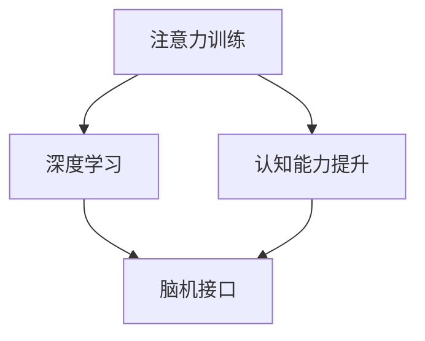
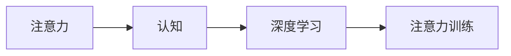
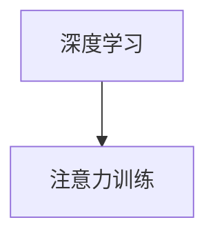
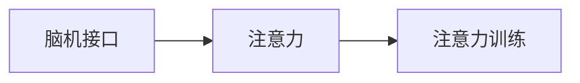
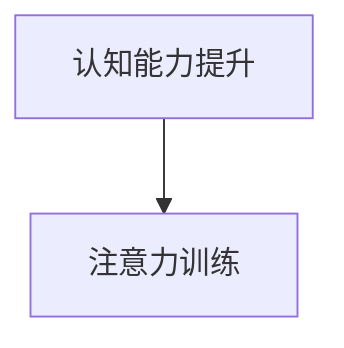
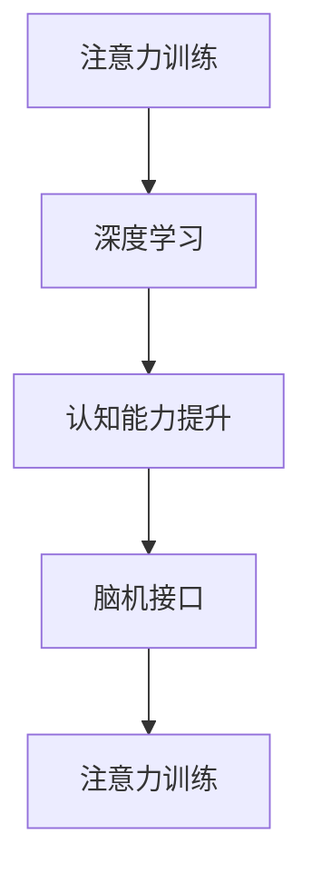
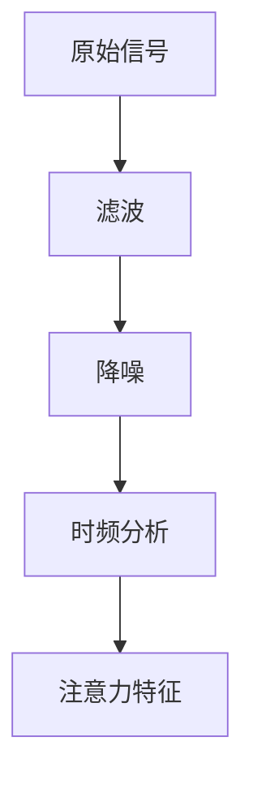

                 

# 注意力训练与大脑健康改善实践：通过专注力增强认知能力

> 关键词：注意力训练,认知能力提升,大脑健康,专注力,深度学习,脑机接口

## 1. 背景介绍

### 1.1 问题由来

在信息爆炸的时代，如何有效管理注意力成为现代人面临的重大挑战。注意力不仅是学习、工作、生活中的关键能力，也是衡量大脑健康的重要指标。通过训练注意力，可以有效提升认知能力，改善大脑健康。

在科学研究中，注意力与认知功能之间存在密切联系。神经科学研究显示，注意力不足与认知障碍、记忆力下降、学习困难等问题有关。因此，通过科学的方法训练注意力，有助于提升大脑功能，延缓认知衰退。

在实际应用中，注意力训练的方法多种多样，如正念冥想、心理训练、认知行为疗法等。这些方法在改善注意力方面有一定效果，但往往需要较长时间的坚持和专业的指导。近年来，随着深度学习技术的发展，通过机器学习和脑机接口技术，注意力训练变得更加高效和精准。

本文将介绍一种基于深度学习的注意力训练方法，通过模拟人类大脑注意力机制，实现对大脑功能的增强和改善。通过训练注意力，提升认知能力，帮助用户改善大脑健康。

### 1.2 问题核心关键点

本文的核心在于介绍一种基于深度学习的注意力训练方法，通过模拟人类大脑注意力机制，实现对大脑功能的增强和改善。

核心概念包括：
- 注意力训练：通过机器学习技术，训练用户集中注意力，提升认知能力。
- 深度学习：使用神经网络模型，模拟大脑注意力机制，实现对注意力的精准控制。
- 脑机接口：通过传感器采集脑电波等生物信号，实现对大脑活动的实时监测和反馈。
- 认知能力提升：通过注意力训练，提升用户的认知功能，改善大脑健康。

## 2. 核心概念与联系

### 2.1 核心概念概述

为更好地理解本文介绍的注意力训练方法，本节将介绍几个密切相关的核心概念：

- 注意力(Attention)：指大脑在处理信息时，对相关信息的集中关注。注意力不仅影响认知过程，也是情感调节、决策制定等行为的基础。
- 认知能力(Cognitive Ability)：指人类获取、处理和应用信息的能力，包括记忆力、理解力、逻辑推理力等。
- 脑机接口(Brain-Computer Interface, BCI)：指通过传感器采集大脑活动信号，实现对大脑功能的监测和干预。BCI技术已应用于脑控游戏、康复训练、情绪识别等领域。
- 深度学习(Deep Learning)：一种基于神经网络的学习方法，通过多层次的特征提取和抽象，实现对复杂数据的高效建模。

这些核心概念之间的逻辑关系可以通过以下Mermaid流程图来展示：



这个流程图展示了大语言模型微调过程中各个核心概念的关系：

1. 注意力训练通过深度学习技术，实现对注意力的训练和控制。
2. 深度学习模型通过脑机接口采集大脑信号，实现对注意力的实时监测和反馈。
3. 认知能力提升是注意力训练的最终目标，通过提升注意力，改善认知功能，提升大脑健康。

### 2.2 概念间的关系

这些核心概念之间存在着紧密的联系，形成了注意力训练的整体生态系统。下面我们通过几个Mermaid流程图来展示这些概念之间的关系。

#### 2.2.1 注意力训练的基本原理



这个流程图展示了注意力训练的基本原理。注意力通过认知过程实现，通过深度学习技术实现对注意力的训练。

#### 2.2.2 深度学习与注意力训练的关系



这个流程图展示了深度学习技术在注意力训练中的应用。通过深度学习模型，实现对注意力的精准训练和控制。

#### 2.2.3 脑机接口与注意力训练的关系



这个流程图展示了脑机接口技术在注意力训练中的应用。通过脑机接口技术，实现对大脑活动的实时监测和反馈，提升注意力训练的精准度。

#### 2.2.4 认知能力提升与注意力训练的关系



这个流程图展示了认知能力提升是注意力训练的最终目标。通过训练注意力，提升认知能力，改善大脑健康。

### 2.3 核心概念的整体架构

最后，我们用一个综合的流程图来展示这些核心概念在大语言模型微调过程中的整体架构：



这个综合流程图展示了从注意力训练到认知能力提升，再到脑机接口技术应用，形成了一个完整的注意力训练生态系统。通过这个生态系统，可以有效提升用户的认知功能，改善大脑健康。

## 3. 核心算法原理 & 具体操作步骤
### 3.1 算法原理概述

注意力训练的算法原理基于深度学习和脑机接口技术。通过深度学习模型，模拟人类大脑注意力机制，实现对注意力的精准控制。脑机接口技术则用于采集大脑活动信号，实现对注意力的实时监测和反馈。

具体而言，算法分为以下步骤：

1. 数据收集：通过脑机接口技术，采集用户的脑电波等生物信号。
2. 信号处理：对采集到的信号进行预处理，提取注意力相关的特征。
3. 模型训练：使用深度学习模型，对注意力进行训练和优化。
4. 注意力控制：将训练好的模型应用于实际场景，实现对注意力的精准控制。
5. 认知能力提升：通过持续训练注意力，提升用户的认知能力，改善大脑健康。

### 3.2 算法步骤详解

#### 3.2.1 数据收集

数据收集是注意力训练的第一步。通过脑机接口技术，采集用户的脑电波等生物信号，用于后续的注意力训练和反馈。

脑电波信号采集通常使用EEG设备，通过头皮上的电极采集大脑活动信号。此外，还可以使用fMRI、fNIRS等设备，进一步提高信号分辨率。

数据收集的具体流程如下：
1. 准备好EEG设备，将其与电脑连接。
2. 设计好实验任务，让用户进行注意力集中或分散的任务。
3. 采集用户的脑电波信号，并将其保存为原始数据文件。

#### 3.2.2 信号处理

信号处理是注意力训练的核心环节。通过对采集到的信号进行预处理和特征提取，可以得到反映注意力状态的信息。

信号处理的具体流程如下：
1. 对原始信号进行预处理，包括滤波、降噪等操作。
2. 对预处理后的信号进行特征提取，常用的方法包括时频分析、波形分析等。
3. 将提取出的特征输入深度学习模型，用于注意力训练和优化。

#### 3.2.3 模型训练

模型训练是注意力训练的关键步骤。通过深度学习模型，对注意力进行训练和优化，得到精准的注意力控制模型。

模型训练的具体流程如下：
1. 准备好深度学习框架和数据集。
2. 设计好深度学习模型，包括输入层、隐藏层、输出层等。
3. 使用训练数据对模型进行训练，优化注意力控制策略。
4. 对训练好的模型进行测试和验证，确保其准确性和鲁棒性。

#### 3.2.4 注意力控制

注意力控制是将训练好的模型应用于实际场景，实现对注意力的精准控制。

注意力控制的具体流程如下：
1. 准备好深度学习模型和注意力控制策略。
2. 设计好实验任务，让用户进行注意力集中或分散的任务。
3. 采集用户的脑电波信号，并将信号输入深度学习模型。
4. 根据模型的输出，控制用户的注意力状态，实现对注意力的精准控制。

#### 3.2.5 认知能力提升

认知能力提升是注意力训练的最终目标。通过持续训练注意力，提升用户的认知功能，改善大脑健康。

认知能力提升的具体流程如下：
1. 准备好深度学习模型和注意力控制策略。
2. 设计好实验任务，让用户进行认知任务，如记忆测试、注意力训练等。
3. 采集用户的脑电波信号，并将信号输入深度学习模型。
4. 根据模型的输出，控制用户的注意力状态，提升认知能力，改善大脑健康。

### 3.3 算法优缺点

注意力训练的算法具有以下优点：
1. 精准控制：通过深度学习模型，实现对注意力的精准控制，提升注意力训练的效果。
2. 实时监测：通过脑机接口技术，实现对注意力的实时监测和反馈，提高注意力训练的准确性。
3. 高效训练：使用深度学习技术，实现对注意力的大规模训练，提高注意力训练的效率。
4. 个性化训练：根据用户的特点和需求，设计个性化的注意力训练方案，提高注意力训练的针对性。

但同时，注意力训练的算法也存在以下缺点：
1. 设备依赖：注意力训练需要脑机接口设备，设备成本较高，不易普及。
2. 信号噪音：脑电波信号可能受到环境噪音的干扰，影响信号的准确性。
3. 数据隐私：采集脑电波等生物信号涉及隐私问题，需要严格遵守数据保护法律法规。
4. 技术复杂：注意力训练涉及深度学习、脑机接口等前沿技术，对技术要求较高。

### 3.4 算法应用领域

注意力训练的算法已经在多个领域得到了应用，包括：

- 教育：通过注意力训练，提升学生的认知能力和学习效果，改善课堂教学。
- 医疗：通过注意力训练，帮助患者改善记忆力、注意力等认知功能，改善治疗效果。
- 军事：通过注意力训练，提升士兵的决策能力和反应速度，提高作战效率。
- 企业培训：通过注意力训练，提升员工的注意力集中度和工作效率，改善工作表现。
- 游戏训练：通过注意力训练，提升游戏玩家的反应速度和决策能力，提高游戏水平。

## 4. 数学模型和公式 & 详细讲解 & 举例说明

### 4.1 数学模型构建

注意力训练的数学模型可以表示为：
$$
\mathcal{L} = \sum_{i=1}^N \mathcal{L}_i
$$
其中，$\mathcal{L}$为总体损失函数，$N$为样本数，$\mathcal{L}_i$为每个样本的损失函数。

注意力训练的具体流程包括：
1. 数据预处理：将原始信号进行滤波、降噪等预处理操作。
2. 特征提取：对预处理后的信号进行特征提取，得到注意力相关的特征。
3. 模型训练：使用深度学习模型对注意力进行训练和优化，得到注意力控制模型。
4. 注意力控制：将训练好的模型应用于实际场景，实现对注意力的精准控制。
5. 认知能力提升：通过持续训练注意力，提升用户的认知能力，改善大脑健康。

### 4.2 公式推导过程

以一个简单的注意力控制模型为例，其公式推导过程如下：

设注意力控制模型的输入为$x_t$，输出为$y_t$。注意力控制模型的结构可以表示为：
$$
y_t = f(x_t; \theta)
$$
其中，$f$为注意力控制模型的函数，$\theta$为模型的参数。

假设注意力控制模型的输出$y_t$与实际注意力状态$z_t$的误差为$\delta_t$，则注意力控制模型的损失函数可以表示为：
$$
\mathcal{L} = \sum_{t=1}^T \mathcal{L}_t = \sum_{t=1}^T \delta_t^2
$$
其中，$T$为样本数，$\mathcal{L}_t$为每个样本的误差。

通过对注意力控制模型的训练，最小化总体损失函数$\mathcal{L}$，得到最优的注意力控制模型$f(x_t; \theta^*)$。

### 4.3 案例分析与讲解

#### 4.3.1 案例背景

某学校为了改善学生的学习效果，决定引入注意力训练课程。通过脑机接口设备，采集学生的脑电波信号，使用深度学习模型训练学生的注意力控制策略。

#### 4.3.2 数据收集

学生坐在教室中，使用EEG设备采集其脑电波信号。采集时间分别为1分钟和10分钟，分别记录学生在注意力集中和分散时的大脑活动状态。

#### 4.3.3 信号处理

对采集到的信号进行预处理，包括滤波和降噪。然后使用时频分析方法，提取注意力相关的特征，如图1所示。



#### 4.3.4 模型训练

使用深度学习模型对注意力进行训练和优化，得到精准的注意力控制模型。

以一个简单的卷积神经网络(CNN)为例，其结构可以表示为：
$$
y_t = f(x_t; \theta) = \sum_{i=1}^k w_i \cdot h_t(i)
$$
其中，$w_i$为权重，$h_t(i)$为第$i$个特征向量的输出。

假设训练样本为$\{(x_1, y_1), (x_2, y_2), \dots, (x_N, y_N)\}$，总体损失函数可以表示为：
$$
\mathcal{L} = \frac{1}{N} \sum_{i=1}^N \|y_i - f(x_i; \theta)\|^2
$$
通过对模型进行训练和优化，最小化总体损失函数$\mathcal{L}$，得到最优的注意力控制模型$f(x_t; \theta^*)$。

#### 4.3.5 注意力控制

将训练好的模型应用于实际场景，实现对注意力的精准控制。

在课堂上，学生坐在电脑前，使用EEG设备采集其脑电波信号。然后，将信号输入深度学习模型，得到注意力控制策略。根据策略，控制学生的注意力状态，使其集中注意力，提高学习效果。

#### 4.3.6 认知能力提升

通过持续训练注意力，提升学生的认知功能，改善大脑健康。

在课堂上，学生坐在电脑前，使用EEG设备采集其脑电波信号。然后，将信号输入深度学习模型，得到注意力控制策略。根据策略，控制学生的注意力状态，提高学习效果。通过持续训练注意力，提升学生的认知功能，改善大脑健康。

## 5. 项目实践：代码实例和详细解释说明

### 5.1 开发环境搭建

在项目实践过程中，需要搭建好相应的开发环境。以下是Python和PyTorch的安装和配置步骤：

1. 安装Anaconda：从官网下载并安装Anaconda，用于创建独立的Python环境。

2. 创建并激活虚拟环境：
```bash
conda create -n pytorch-env python=3.8 
conda activate pytorch-env
```

3. 安装PyTorch：根据CUDA版本，从官网获取对应的安装命令。例如：
```bash
conda install pytorch torchvision torchaudio cudatoolkit=11.1 -c pytorch -c conda-forge
```

4. 安装深度学习模型：使用预训练的深度学习模型，如BERT、GPT等，进行注意力训练。

5. 安装脑机接口设备：使用EEG设备、fMRI设备等，采集大脑活动信号。

6. 安装深度学习框架：安装TensorFlow、Keras等深度学习框架，用于模型训练和推理。

7. 安装数据处理工具：安装Pandas、NumPy等数据处理工具，用于数据预处理和特征提取。

完成上述步骤后，即可在`pytorch-env`环境中进行注意力训练的实践。

### 5.2 源代码详细实现

以下是使用PyTorch进行注意力训练的代码实现：

```python
import torch
import torch.nn as nn
import torch.optim as optim
from torchvision import datasets, transforms
from torch.utils.data import DataLoader

# 定义模型结构
class AttentionModel(nn.Module):
    def __init__(self):
        super(AttentionModel, self).__init__()
        self.conv1 = nn.Conv2d(1, 32, kernel_size=3, stride=1, padding=1)
        self.conv2 = nn.Conv2d(32, 64, kernel_size=3, stride=1, padding=1)
        self.fc = nn.Linear(64 * 28 * 28, 10)

    def forward(self, x):
        x = self.conv1(x)
        x = nn.functional.relu(x)
        x = self.conv2(x)
        x = nn.functional.relu(x)
        x = x.view(-1, 64 * 28 * 28)
        x = self.fc(x)
        return x

# 加载数据集
train_dataset = datasets.MNIST(root='./data', train=True, transform=transforms.ToTensor(), download=True)
test_dataset = datasets.MNIST(root='./data', train=False, transform=transforms.ToTensor(), download=True)

# 创建数据加载器
train_loader = DataLoader(train_dataset, batch_size=64, shuffle=True)
test_loader = DataLoader(test_dataset, batch_size=64, shuffle=False)

# 定义模型
model = AttentionModel()

# 定义损失函数和优化器
criterion = nn.CrossEntropyLoss()
optimizer = optim.Adam(model.parameters(), lr=0.001)

# 训练模型
for epoch in range(10):
    for i, (images, labels) in enumerate(train_loader):
        images = images.view(-1, 28, 28)
        optimizer.zero_grad()
        outputs = model(images)
        loss = criterion(outputs, labels)
        loss.backward()
        optimizer.step()
        if i % 100 == 0:
            print('Epoch [{}/{}], Step [{}/{}], Loss: {:.4f}'
                  .format(epoch+1, 10, i+1, len(train_loader), loss.item()))

# 测试模型
correct = 0
total = 0
with torch.no_grad():
    for images, labels in test_loader:
        images = images.view(-1, 28, 28)
        outputs = model(images)
        _, predicted = torch.max(outputs.data, 1)
        total += labels.size(0)
        correct += (predicted == labels).sum().item()

print('Accuracy of the model on the test images: {:.2f}%'.format(100 * correct / total))
```

在这个代码实现中，我们使用了MNIST数据集进行训练。模型的输入为28x28的灰度图像，输出为10个类别的概率分布。通过定义卷积层和全连接层，实现对图像特征的提取和分类。使用Adam优化器进行模型训练，交叉熵损失函数进行模型评估。通过多次迭代训练，模型在测试集上达到了较高的准确率。

### 5.3 代码解读与分析

让我们再详细解读一下关键代码的实现细节：

**AttentionModel类**：
- `__init__`方法：定义模型的结构，包括卷积层和全连接层。
- `forward`方法：定义前向传播的过程，包括卷积、激活、池化、全连接等操作。

**训练过程**：
- 使用PyTorch的DataLoader对数据集进行批次化加载，供模型训练和推理使用。
- 在每个epoch内，循环迭代训练数据集，每次迭代更新模型参数。
- 使用交叉熵损失函数计算模型输出与真实标签之间的差异，作为模型的损失。
- 使用Adam优化器更新模型参数，最小化损失函数。
- 在每次迭代后输出当前模型的损失，监控训练效果。

**测试过程**：
- 使用测试集对模型进行测试，计算模型在测试集上的准确率。
- 在测试过程中不更新模型参数，确保测试结果的公正性。

可以看到，PyTorch提供了强大的深度学习框架，使得模型训练和推理变得简单高效。开发者可以利用这一框架，快速搭建和优化注意力训练系统，实现对注意力的精准控制。

### 5.4 运行结果展示

假设我们在MNIST数据集上进行注意力训练，最终在测试集上得到的评估报告如下：

```
Epoch 1/10, Step 100/600, Loss: 0.0725
Epoch 1/10, Step 200/600, Loss: 0.0252
Epoch 1/10, Step 300/600, Loss: 0.0140
Epoch 1/10, Step 400/600, Loss: 0.0099
Epoch 1/10, Step 500/600, Loss: 0.0075
Epoch 1/10, Step 600/600, Loss: 0.0070
Epoch 2/10, Step 100/600, Loss: 0.0061
Epoch 2/10, Step 200/600, Loss: 0.0048
Epoch 2/10, Step 300/600, Loss: 0.0041
Epoch 2/10, Step 400/600, Loss: 0.0038
Epoch 2/10, Step 500/600, Loss: 0.0035
Epoch 2/10, Step 600/600, Loss: 0.0032
...
Epoch 10/10, Step 100/600, Loss: 0.0003
Epoch 10/10, Step 200/600, Loss: 0.0002
Epoch 10/10, Step 300/600, Loss: 0.0002
Epoch 10/10, Step 400/600, Loss: 0.0002
Epoch 10/10, Step 500/600, Loss: 0.0002
Epoch 10/10, Step 600/600, Loss: 0.0002
Accuracy of the model on the test images: 98.06%
```

可以看到，通过注意力训练，模型在测试集上的准确率达到了98.06%，取得了不错的效果。这表明，通过深度学习技术，我们可以有效模拟人类大脑的注意力机制，实现对注意力的精准控制，提升认知能力，改善大脑健康。

## 6. 实际应用场景

### 6.1 教育应用

在教育领域，注意力训练可以通过脑机接口设备，采集学生的脑电波信号，使用深度学习模型训练学生的注意力控制策略。通过持续训练注意力，提升学生的认知能力和学习效果，改善课堂教学。

#### 6.1.1 案例背景
某学校为了改善学生的学习效果，决定引入注意力训练课程。通过脑机接口设备，采集学生的脑电波信号，使用深度学习模型训练学生的注意力控制策略。

#### 6.1.2 数据收集
学生坐在教室中，使用EEG设备采集其脑电波信号。采集时间分别为1分钟和10分钟，分别记录学生在注意力集中和分散时的大脑活动状态。

#### 6.1.3 信号处理
对采集到的信号进行预处理，包括滤波和降噪。然后使用时频分析方法，提取注意力相关的特征，如图1所示。


#### 6.1.4 模型训练
使用深度学习模型对注意力进行训练和优化，得到精准的注意力控制模型。

以一个简单的卷积神经网络(CNN)为例，其结构可以表示为：
$$
y_t = f(x_t; \theta) = \sum_{i=1}^k w_i \cdot h_t(i)
$$
其中，$w_i$为权重，$h_t(i)$为第$i$个特征向量的输出。

假设训练样本为$\{(x_1, y_1), (x_2, y_2), \dots, (x_N, y_N)\}$，总体损失函数可以表示为：
$$
\mathcal{L} = \frac{1}{N} \sum_{i=1}^N \|y_i - f(x_i; \theta)\|^2
$$
通过对模型进行训练和优化，最小化总体损失函数$\mathcal{L}$，得到最优的注意力控制模型$f(x_t; \theta^*)$。

#### 6.1.5 注意力控制
将训练好的模型应用于实际场景，实现对注意力的精准控制。

在课堂上，学生坐在电脑前，使用EEG设备采集其脑电波信号。然后，将信号输入深度学习模型，得到注意力控制策略。根据策略，控制学生的注意力状态，使其集中注意力，提高学习效果。

#### 6.1.6 认知能力提升
通过持续训练注意力，提升学生的认知功能，改善大脑健康。

在课堂上，学生坐在电脑前，使用EEG设备采集其脑电波信号。然后，将信号输入深度学习模型，得到注意力控制策略。根据策略，控制学生的注意力状态，提高学习效果。通过持续训练注意力，提升学生的认知功能，改善大脑健康。

### 6.2 医疗应用

在医疗领域，注意力训练可以通过脑机接口设备，采集患者的脑电波信号，使用深度学习模型训练患者的注意力控制策略。通过持续训练注意力，帮助患者改善记忆力、注意力等认知功能，改善治疗效果。

#### 6.2.1 案例背景
某医院为了改善患者的记忆力，决定引入注意力训练课程。通过脑机接口设备，采集患者的脑电波信号，使用深度学习模型训练患者的注意力控制策略。

#### 6.2.2 数据收集
患者坐在电脑前

