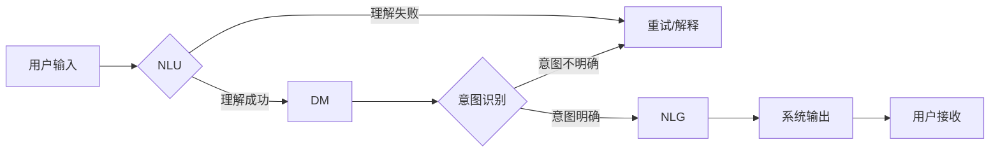

# 自然语言交互在CUI中的优势

> 关键词：自然语言交互，CUI，对话系统，人机对话，用户体验，人工智能，语言模型

## 1. 背景介绍

随着人工智能技术的快速发展，人机交互的方式也在不断演变。从早期的命令行界面（Command Line Interface, CLI）到图形用户界面（Graphical User Interface, GUI），再到如今的自然语言交互（Natural Language Interaction, NLI），人机交互正朝着更加自然、便捷的方向发展。在这个趋势下，基于用户接口（CUI）的自然语言交互技术应运而生，并在提升用户体验、拓展人工智能应用场景等方面展现出巨大潜力。

### 1.1 CUI的兴起

CUI是一种结合了传统用户接口和自然语言交互技术的新型人机交互方式。它允许用户通过自然语言与计算机系统进行交流，无需学习特定的操作指令，从而降低了用户的学习成本，提升了交互效率。

CUI的兴起主要得益于以下因素：

- 人工智能技术的进步，特别是自然语言处理（NLP）技术的飞速发展。
- 互联网和移动互联网的普及，用户对便捷、智能的交互方式的需求日益增长。
- 语音识别、语音合成等技术的成熟，为CUI的实现提供了技术保障。

### 1.2 CUI的优势

相较于传统的CLI和GUI，CUI具有以下显著优势：

- **用户体验更佳**：用户可以通过自然语言进行交流，无需记忆复杂的操作指令，降低了学习成本，提高了交互效率。
- **交互方式更灵活**：用户可以使用语音、文本等多种方式与系统进行交互，适应不同场景和用户需求。
- **应用场景更广泛**：CUI可以应用于智能家居、智能客服、智能办公、教育娱乐等多个领域，具有广泛的应用前景。

## 2. 核心概念与联系

为了更好地理解CUI技术，本节将介绍几个核心概念及其相互之间的联系。

### 2.1 对话系统

对话系统是CUI技术的核心组成部分，它负责理解用户的自然语言输入，并生成相应的自然语言输出，从而与用户进行交互。

**对话系统的主要功能包括**：

- **自然语言理解（NLU）**：将用户的自然语言输入转换为系统可以理解的内部表示。
- **对话管理（DM）**：根据对话上下文和用户意图，选择合适的对话策略。
- **自然语言生成（NLG）**：根据对话上下文和系统意图，生成自然语言输出。

### 2.2 语言模型

语言模型是NLU和NLG的核心组件，它负责预测语言序列的概率分布。

**语言模型的类型包括**：

- **基于统计的模型**：如n-gram模型、神经网络语言模型等。
- **基于规则的模型**：如词汇替换模型、语法规则模型等。
- **基于深度学习的模型**：如循环神经网络（RNN）、长短时记忆网络（LSTM）、变换器（Transformer）等。

### 2.3 Mermaid流程图

以下是一个简单的Mermaid流程图，展示了对话系统的基本工作流程：



## 3. 核心算法原理 & 具体操作步骤

### 3.1 算法原理概述

CUI技术的核心算法主要包括自然语言理解（NLU）、对话管理（DM）和自然语言生成（NLG）。

- **NLU**：NLU的核心是语言模型，它通过分析用户输入的语言序列，识别用户的意图和实体信息。
- **DM**：DM根据NLU的输出和对话上下文，选择合适的对话策略，包括回复内容、回复风格和后续行为等。
- **NLG**：NLG根据DM的输出，生成自然语言回复，并将其输出给用户。

### 3.2 算法步骤详解

以下是CUI技术的基本操作步骤：

1. **用户输入**：用户通过语音或文本方式输入自然语言请求。
2. **NLU处理**：语言模型对用户输入进行分析，识别用户的意图和实体信息。
3. **DM决策**：对话管理根据NLU的输出和对话上下文，选择合适的对话策略。
4. **NLG生成回复**：自然语言生成根据DM的输出，生成自然语言回复。
5. **系统输出**：将生成的自然语言回复输出给用户。
6. **用户接收**：用户接收系统回复，并根据回复内容进行下一步操作。

### 3.3 算法优缺点

**优点**：

- 用户体验更佳：用户可以通过自然语言进行交流，无需记忆复杂的操作指令。
- 交互方式更灵活：用户可以使用语音、文本等多种方式与系统进行交互。
- 应用场景更广泛：CUI可以应用于智能家居、智能客服、智能办公、教育娱乐等多个领域。

**缺点**：

- **技术难度较高**：CUI技术需要整合NLP、语音识别、语音合成等多种技术，技术难度较高。
- **数据依赖性较强**：CUI的性能很大程度上取决于训练数据的质量和数量。
- **成本较高**：CUI技术的开发和应用需要投入较大的成本。

### 3.4 算法应用领域

CUI技术可以应用于以下领域：

- 智能家居：如语音控制智能家电、智能音箱等。
- 智能客服：如自动回答用户咨询、办理业务等。
- 智能办公：如语音会议、文档自动生成等。
- 教育娱乐：如智能教育机器人、智能语音助手等。

## 4. 数学模型和公式 & 详细讲解 & 举例说明

### 4.1 数学模型构建

CUI技术的数学模型主要包括以下部分：

- **语言模型**：用于预测语言序列的概率分布，如n-gram模型、神经网络语言模型等。
- **意图识别模型**：用于识别用户的意图，如基于规则的方法、机器学习的方法等。
- **实体识别模型**：用于识别用户输入中的实体信息，如命名实体识别（NER）等。

### 4.2 公式推导过程

以下是一个简单的n-gram模型概率计算的例子：

$$
P(w_n | w_{n-1}, w_{n-2}, \ldots, w_1) = \frac{P(w_n, w_{n-1}, w_{n-2}, \ldots, w_1)}{P(w_{n-1}, w_{n-2}, \ldots, w_1)}
$$

其中，$w_1, w_2, \ldots, w_n$ 分别表示语言序列中的单词，$P(w_n | w_{n-1}, w_{n-2}, \ldots, w_1)$ 表示在给定前$ n-1 $个单词的情况下，第$ n $个单词出现的概率。

### 4.3 案例分析与讲解

以下是一个简单的CUI技术应用案例：

**场景**：用户使用智能音箱控制智能灯泡的开关。

**用户输入**：用户说“打开客厅的灯泡”。

**NLU处理**：语言模型将用户输入转换为内部表示，识别出意图为“打开灯泡”，实体为“客厅的灯泡”。

**DM决策**：对话管理根据意图和实体信息，选择合适的对话策略，即发送指令给智能灯泡，请求打开灯泡。

**NLG生成回复**：自然语言生成根据DM的输出，生成回复“已为您打开客厅的灯泡”。

**系统输出**：智能音箱输出“已为您打开客厅的灯泡”。

**用户接收**：用户接收系统回复，确认灯泡已打开。

## 5. 项目实践：代码实例和详细解释说明

### 5.1 开发环境搭建

为了实现CUI技术，我们需要搭建以下开发环境：

- 操作系统：Windows、Linux或macOS
- 编程语言：Python
- 依赖库：transformers、torch、speech_recognition、pyaudio等

### 5.2 源代码详细实现

以下是一个简单的CUI项目示例，使用Python和transformers库实现：

```python
from transformers import AutoModelForSeq2SeqLM, AutoTokenizer
import speech_recognition as sr
import pyttsx3

# 加载预训练的语言模型和分词器
model_name = "t5-small"
model = AutoModelForSeq2SeqLM.from_pretrained(model_name)
tokenizer = AutoTokenizer.from_pretrained(model_name)

# 语音识别
def recognize_speech():
    recognizer = sr.Recognizer()
    with sr.Microphone() as source:
        print("请说：")
        audio = recognizer.listen(source)
    try:
        text = recognizer.recognize_google(audio, language="zh-CN")
        print(f"你说：{text}")
        return text
    except sr.UnknownValueError:
        print("无法识别语音")
        return None
    except sr.RequestError as e:
        print(f"请求错误：{e}")
        return None

# 语音合成
def speak_text(text):
    engine = pyttsx3.init()
    engine.say(text)
    engine.runAndWait()

# 对话处理
def process_dialogue(text):
    # 对话生成
    input_ids = tokenizer.encode(text, return_tensors="pt")
    output_ids = model.generate(input_ids)
    output_text = tokenizer.decode(output_ids[0], skip_special_tokens=True)
    print(f"系统：{output_text}")
    return output_text

# 主函数
def main():
    while True:
        user_input = recognize_speech()
        if user_input is None:
            continue
        response = process_dialogue(user_input)
        speak_text(response)

if __name__ == "__main__":
    main()
```

### 5.3 代码解读与分析

上述代码示例中，我们使用transformers库加载了一个预训练的T5模型，用于处理对话生成任务。用户通过麦克风输入语音，经过语音识别转换为文本后，作为输入送入模型进行对话生成。模型生成的文本经过语音合成后，输出给用户。

### 5.4 运行结果展示

运行上述代码，用户可以通过麦克风与智能音箱进行对话，实现简单的交互功能。

## 6. 实际应用场景

### 6.1 智能家居

CUI技术可以应用于智能家居领域，实现智能家电的语音控制。用户可以通过语音指令控制家电的开关、调节亮度、播放音乐等功能，提升家庭生活品质。

### 6.2 智能客服

CUI技术可以应用于智能客服领域，实现自动回答用户咨询、办理业务等功能。用户可以通过语音或文本方式与智能客服进行交互，解决常见问题，提高客服效率。

### 6.3 智能办公

CUI技术可以应用于智能办公领域，实现语音会议、文档自动生成等功能。用户可以通过语音指令控制会议、生成文档，提高办公效率。

### 6.4 未来应用展望

随着人工智能技术的不断发展，CUI技术将在更多领域得到应用，如：

- 教育领域：实现智能教育机器人、智能语音助手等，为学生提供个性化学习体验。
- 健康领域：实现智能健康管理、智能问诊等功能，提升医疗服务水平。
- 金融领域：实现智能投顾、智能客服等功能，提高金融服务效率。

## 7. 工具和资源推荐

### 7.1 学习资源推荐

- 《自然语言处理入门教程》
- 《Python自然语言处理实践》
- 《深度学习自然语言处理》

### 7.2 开发工具推荐

- PyTorch
- TensorFlow
- spaCy
- Hugging Face Transformers

### 7.3 相关论文推荐

- Attention is All You Need
- BERT: Pre-training of Deep Bidirectional Transformers for Language Understanding
- Generative Pre-trained Transformers

## 8. 总结：未来发展趋势与挑战

### 8.1 研究成果总结

本文从背景介绍、核心概念、算法原理、应用场景等方面，对CUI技术在自然语言交互中的优势进行了全面探讨。CUI技术凭借其自然、便捷的交互方式，在智能家居、智能客服、智能办公等领域展现出巨大潜力。

### 8.2 未来发展趋势

未来，CUI技术将呈现以下发展趋势：

- 模型更加智能：随着深度学习技术的不断发展，CUI模型的智能水平将不断提升，能够更好地理解用户意图和情感。
- 交互方式更加丰富：CUI技术将支持更多交互方式，如语音、文本、图像等，满足不同场景和用户需求。
- 应用场景更加广泛：CUI技术将在更多领域得到应用，如教育、医疗、金融等。

### 8.3 面临的挑战

CUI技术在发展过程中也面临着以下挑战：

- 技术挑战：如何提高CUI模型的准确性和鲁棒性，降低误识别率。
- 数据挑战：如何获取高质量、大规模的CUI训练数据。
- 伦理挑战：如何避免CUI技术在应用中出现偏见和歧视等问题。

### 8.4 研究展望

针对CUI技术面临的挑战，未来研究可以从以下方面进行：

- 研究更加鲁棒的CUI模型，提高模型在噪声环境下的识别准确率。
- 开发高效的CUI数据集构建方法，降低数据获取成本。
- 探索CUI技术的伦理问题，确保CUI技术在应用中的公平性和安全性。

## 9. 附录：常见问题与解答

**Q1：CUI技术的主要应用场景有哪些？**

A：CUI技术可以应用于智能家居、智能客服、智能办公、教育、医疗、金融等多个领域。

**Q2：CUI技术的核心算法有哪些？**

A：CUI技术的核心算法包括自然语言理解（NLU）、对话管理（DM）和自然语言生成（NLG）。

**Q3：CUI技术面临的挑战有哪些？**

A：CUI技术面临的挑战包括技术挑战、数据挑战和伦理挑战。

**Q4：如何提高CUI技术的鲁棒性？**

A：提高CUI技术的鲁棒性可以通过以下方法实现：

- 使用更鲁棒的NLP模型，如BERT、GPT等。
- 使用数据增强技术，提高模型的泛化能力。
- 设计更加健壮的对话管理策略，提高模型的抗干扰能力。

**Q5：CUI技术在伦理方面需要注意哪些问题？**

A：CUI技术在伦理方面需要注意以下问题：

- 避免模型偏见和歧视。
- 保护用户隐私。
- 确保CUI技术在应用中的公平性和安全性。

作者：禅与计算机程序设计艺术 / Zen and the Art of Computer Programming