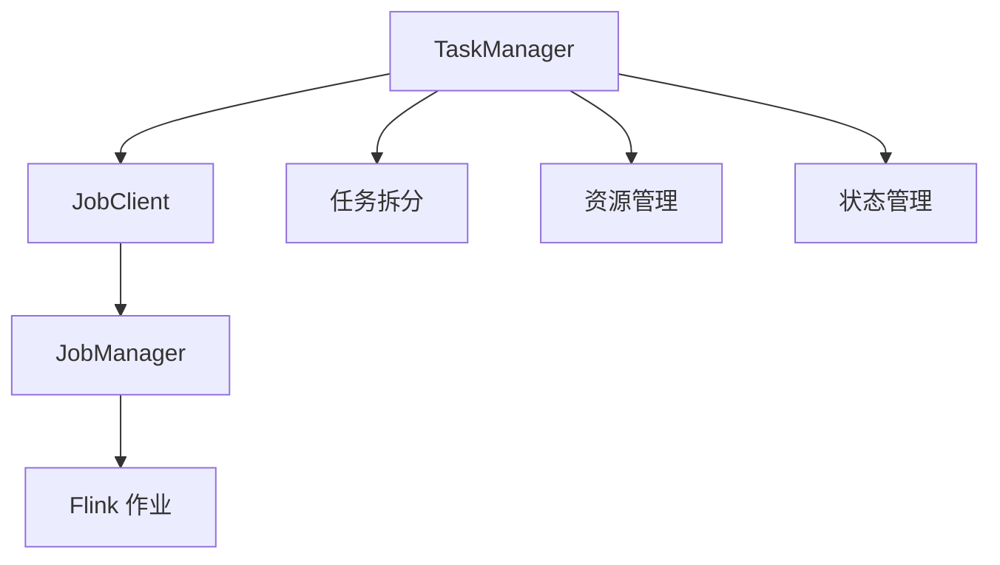
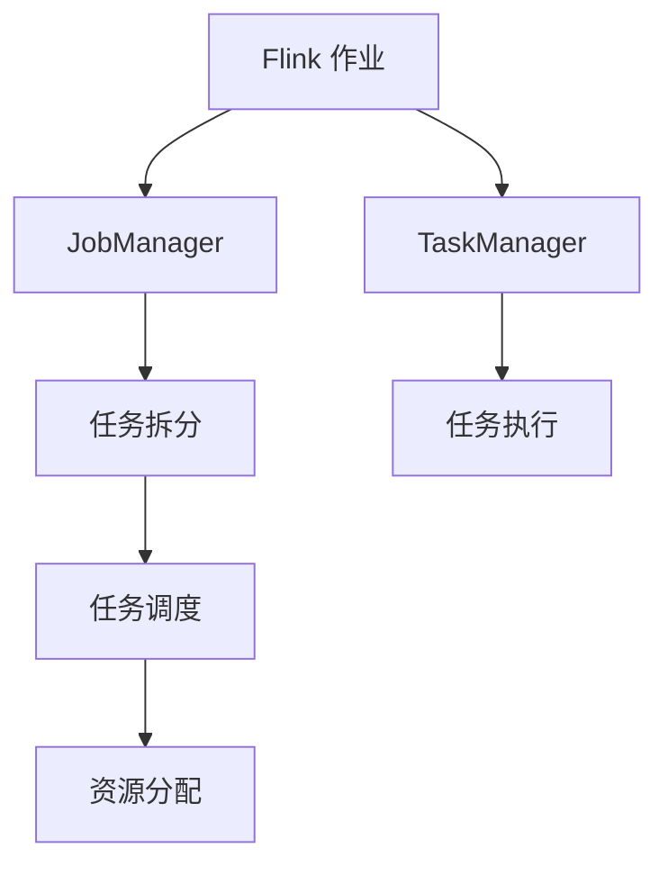
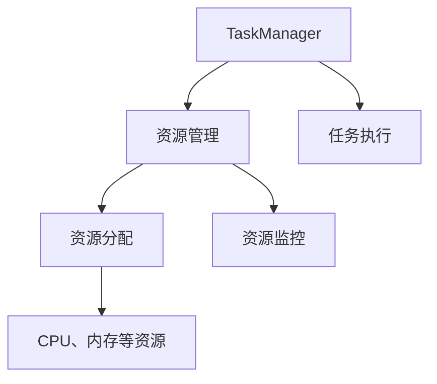
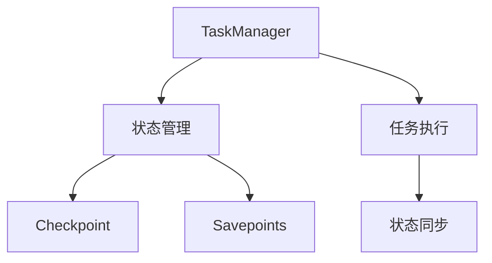
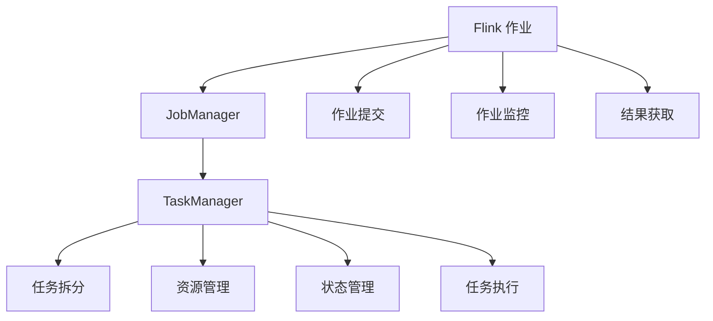

                 

# Flink JobManager原理与代码实例讲解

> 关键词：Flink, JobManager, 分布式计算, 任务调度, 资源管理, 代码实例

## 1. 背景介绍

### 1.1 问题由来

随着大数据技术的发展，分布式计算框架在数据处理中的应用越来越广泛。Apache Flink 作为一个高性能、可扩展的分布式流处理框架，已经成为了数据处理领域的重要工具。在 Flink 中，JobManager 承担着调度、监控、资源管理等核心职责，是确保 Flink 作业高效运行的关键组件。

然而，尽管 JobManager 的重要性不言而喻，但其原理和实现细节往往被忽视。理解 JobManager 的内部机制，对于开发高效、稳定的 Flink 作业具有重要意义。本文将深入探讨 JobManager 的工作原理，并通过代码实例，详细讲解其内部逻辑，以便开发人员更好地掌握 Flink JobManager 的使用。

### 1.2 问题核心关键点

Flink JobManager 的核心职责包括：

- **任务调度**：负责将 Flink 作业中的各个子任务（Task）调度到不同的 TaskManager 节点上执行。
- **资源管理**：负责管理 Flink 作业所需的 CPU、内存、磁盘等资源，确保作业高效运行。
- **状态管理**：负责管理 Flink 作业的状态信息，包括 Checkpoint 和 Savepoints 等。
- **监控与故障恢复**：监控 Flink 作业的运行状态，并在故障发生时进行快速恢复。

JobManager 的工作流程大致如下：

1. 接收客户端提交的作业。
2. 对作业进行任务拆分和调度，将任务分配给不同的 TaskManager 节点执行。
3. 管理作业运行所需的资源，确保任务能够高效运行。
4. 监控作业运行状态，并在必要时进行资源调整和故障恢复。
5. 在作业完成后，向客户端返回作业结果。

## 2. 核心概念与联系

### 2.1 核心概念概述

为更好地理解 Flink JobManager 的内部机制，本节将介绍几个密切相关的核心概念：

- **Flink 作业**：由一个或多个子任务（Task）组成的数据处理程序，用于处理来自数据源的数据流。
- **TaskManager**：负责执行 Flink 作业中的子任务，并管理自身所需的资源。
- **JobClient**：用于与 JobManager 进行通信，提交作业并获取结果的客户端程序。
- **任务拆分**：将 Flink 作业拆分成多个子任务，以并行处理大规模数据流。
- **资源管理**：包括 CPU、内存、磁盘等硬件资源的分配和管理，确保作业高效运行。
- **状态管理**：包括 Checkpoint 和 Savepoints 等状态的维护和恢复。

这些核心概念之间的逻辑关系可以通过以下 Mermaid 流程图来展示：



这个流程图展示了 Flink JobManager 的核心概念及其之间的关系：

1. TaskManager 负责执行作业中的任务。
2. JobClient 负责与 JobManager 通信，提交作业并获取结果。
3. JobManager 负责调度、资源管理、状态管理等核心职责。
4. 任务拆分、资源管理、状态管理等是 JobManager 的重要组成部分。

### 2.2 概念间的关系

这些核心概念之间存在着紧密的联系，形成了 Flink JobManager 的完整生态系统。下面我通过几个 Mermaid 流程图来展示这些概念之间的关系。

#### 2.2.1 Flink 作业调度



这个流程图展示了 Flink 作业调度的基本流程：

1. Flink 作业由 JobManager 接收。
2. JobManager 对作业进行任务拆分，生成多个子任务。
3. 子任务由 JobManager 分配给 TaskManager 执行。
4. JobManager 负责资源分配，确保任务能够高效运行。
5. TaskManager 执行子任务，并将结果返回给 JobManager。

#### 2.2.2 资源管理



这个流程图展示了 TaskManager 资源管理的基本流程：

1. TaskManager 负责执行任务。
2. TaskManager 对自身所需的 CPU、内存等资源进行管理。
3. JobManager 负责资源分配，确保 TaskManager 能够高效运行。
4. TaskManager 执行任务，并监控资源使用情况。

#### 2.2.3 状态管理



这个流程图展示了 TaskManager 状态管理的基本流程：

1. TaskManager 负责执行任务。
2. TaskManager 对自身的状态信息（如 Checkpoint、Savepoints 等）进行管理。
3. JobManager 负责状态同步，确保任务的连续性和可靠性。
4. TaskManager 在执行任务时，定期同步状态信息。

### 2.3 核心概念的整体架构

最后，我们用一个综合的流程图来展示这些核心概念在大语言模型微调过程中的整体架构：



这个综合流程图展示了 Flink 作业从提交到执行、监控、结果获取的完整流程。JobManager 在作业的整个生命周期中，都扮演着重要角色，确保作业能够高效、稳定地运行。

## 3. 核心算法原理 & 具体操作步骤
### 3.1 算法原理概述

Flink JobManager 的核心算法原理可以概括为以下几个步骤：

1. **作业提交**：JobClient 向 JobManager 提交作业。
2. **任务拆分**：JobManager 对作业进行任务拆分，生成多个子任务。
3. **任务调度**：JobManager 将子任务调度到不同的 TaskManager 节点上执行。
4. **资源分配**：JobManager 负责资源分配，确保任务能够高效运行。
5. **状态管理**：JobManager 负责状态管理，确保任务能够连续性、可靠性运行。
6. **监控与故障恢复**：JobManager 监控任务的运行状态，并在必要时进行资源调整和故障恢复。

接下来，我将详细讲解每个步骤的具体实现过程。

### 3.2 算法步骤详解

#### 3.2.1 作业提交

在 Flink 中，作业的提交通常由 JobClient 来完成。JobClient 通过调用 JobManager 的 REST API，将作业提交到 JobManager 上进行调度。

```java
FlinkClient client = new FlinkClient("localhost:8080");
client.submitJob(new JobDefinition("myJob", new File("myJob.jar")));
```

#### 3.2.2 任务拆分

JobManager 接收到作业后，首先进行任务拆分。任务拆分的目的是将作业拆分成多个子任务，以便在多个 TaskManager 节点上并行执行。

```java
TaskGraph taskGraph = JobManager.getTaskGraph(new JobDefinition("myJob"));
taskGraph.traverseTasksRecursive(new TaskGraphVisitor() {
    @Override
    public void visitTask(Task task) {
        // 根据任务类型进行拆分
        if (task.getType() == TaskType.DATA) {
            DataTask task2 = new DataTask(task);
            task.setSubtasks(task2.getSubtasks(task, partitionId));
        } else if (task.getType() == TaskType.KEYED) {
            KeyedTask task2 = new KeyedTask(task);
            task.setSubtasks(task2.getSubtasks(task, partitionId));
        }
        task.setProperties(task.getProperties().put("partitionId", partitionId));
    }
});
```

#### 3.2.3 任务调度

任务拆分完成后，JobManager 需要将子任务调度到不同的 TaskManager 节点上执行。

```java
for (Task task : taskGraph.getTasks()) {
    TaskExecutor executor = TaskManager.getExecutor();
    executor.schedule(task);
}
```

#### 3.2.4 资源分配

JobManager 负责管理 Flink 作业所需的 CPU、内存、磁盘等资源。通常，JobManager 会将资源分配给 TaskManager，并根据任务的资源需求进行调整。

```java
ResourceManager resourceManager = new ResourceManager();
resourceManager.allocateResources(new TaskManagerHostInfo("localhost:6666"), "myJob");
```

#### 3.2.5 状态管理

JobManager 负责管理 Flink 作业的状态信息，包括 Checkpoint 和 Savepoints 等。在 Flink 中，Checkpoint 和 Savepoints 用于确保任务能够连续性、可靠性运行。

```java
JobManager.getCheckpointManager();
JobManager.getSavepointsManager();
```

#### 3.2.6 监控与故障恢复

JobManager 负责监控任务的运行状态，并在必要时进行资源调整和故障恢复。

```java
JobManager.getMetricsCollector();
JobManager.getFaultToleranceManager();
```

### 3.3 算法优缺点

#### 3.3.1 优点

1. **高效性**：Flink JobManager 能够高效地调度和管理任务，确保作业能够高效运行。
2. **可扩展性**：Flink 支持大规模分布式计算，能够轻松应对大规模数据流的处理。
3. **可靠性**：Flink JobManager 提供了完善的监控和故障恢复机制，确保任务的连续性和可靠性。

#### 3.3.2 缺点

1. **资源管理复杂**：Flink JobManager 需要管理大量资源，对于资源分配和管理要求较高。
2. **状态管理复杂**：Flink 的 Checkpoint 和 Savepoints 状态管理机制较为复杂，需要仔细设计和管理。
3. **监控和调试困难**：Flink JobManager 的监控和调试较为复杂，需要开发人员具备一定的经验和技术。

### 3.4 算法应用领域

Flink JobManager 在数据处理、流计算、实时分析等众多领域得到了广泛的应用。具体应用场景包括：

1. **大数据处理**：用于处理大规模数据流，如日志、交易数据等。
2. **实时分析**：用于实时分析数据流，如实时监控、实时推荐等。
3. **事件驱动**：用于处理事件驱动的数据流，如社交网络、物联网等。
4. **机器学习**：用于处理大规模机器学习数据，如实时训练、在线学习等。

## 4. 数学模型和公式 & 详细讲解  
### 4.1 数学模型构建

Flink JobManager 的数学模型可以概括为以下几个方面：

1. **作业调度模型**：用于描述作业的调度过程，包括任务的拆分和分配。
2. **资源分配模型**：用于描述资源的分配和调整，确保任务能够高效运行。
3. **状态管理模型**：用于描述任务的 Checkpoint 和 Savepoints 状态管理。
4. **监控与故障恢复模型**：用于描述任务的监控和故障恢复过程。

#### 4.1.1 作业调度模型

作业调度模型的主要任务是将作业拆分成多个子任务，并将子任务分配给 TaskManager 节点。

假设作业中共有 N 个子任务，每个子任务的任务量为 T_i。Flink JobManager 将任务分配给 M 个 TaskManager 节点，每个节点分配的任务量为 S_j。则任务调度的目标函数为：

$$
\min \sum_{i=1}^{N} \sum_{j=1}^{M} \max(T_i, S_j) - \sum_{j=1}^{M} S_j
$$

其中，$\max(T_i, S_j)$ 表示将任务 i 分配给节点 j 后，任务量与节点可分配资源的最大值；$S_j$ 表示节点 j 的总任务量。

#### 4.1.2 资源分配模型

资源分配模型的主要任务是分配和调整 TaskManager 所需的 CPU、内存、磁盘等资源，确保任务能够高效运行。

假设 TaskManager 所需的资源量为 R，每个任务所需的资源量为 T_i。则资源分配的目标函数为：

$$
\min \sum_{i=1}^{N} T_i
$$

其中，$T_i$ 表示任务 i 所需的资源量。

#### 4.1.3 状态管理模型

状态管理模型的主要任务是管理任务的 Checkpoint 和 Savepoints 状态，确保任务的连续性和可靠性。

假设任务的 Checkpoint 和 Savepoints 状态分别为 C_i 和 S_i，则状态管理的目标函数为：

$$
\min \sum_{i=1}^{N} (C_i + S_i)
$$

其中，$C_i$ 和 $S_i$ 表示任务 i 的 Checkpoint 和 Savepoints 状态。

#### 4.1.4 监控与故障恢复模型

监控与故障恢复模型的主要任务是监控任务的运行状态，并在必要时进行资源调整和故障恢复。

假设任务的运行状态为 S_i，则监控与故障恢复的目标函数为：

$$
\min \sum_{i=1}^{N} \max(C_i, S_i)
$$

其中，$C_i$ 和 $S_i$ 表示任务 i 的 Checkpoint 和 Savepoints 状态。

### 4.2 公式推导过程

以下我将通过几个数学公式，详细讲解 Flink JobManager 的核心算法原理：

#### 4.2.1 作业调度模型的公式推导

假设作业中共有 N 个子任务，每个子任务的任务量为 T_i。Flink JobManager 将任务分配给 M 个 TaskManager 节点，每个节点分配的任务量为 S_j。则任务调度的目标函数为：

$$
\min \sum_{i=1}^{N} \sum_{j=1}^{M} \max(T_i, S_j) - \sum_{j=1}^{M} S_j
$$

令 $C_i = \max(T_i, S_j)$，则目标函数可以简化为：

$$
\min \sum_{i=1}^{N} \sum_{j=1}^{M} C_i
$$

假设任务量为 T_i 的子任务已经分配到节点 j，则 C_i 的值为：

$$
C_i = \min(T_i, S_j)
$$

将 C_i 的表达式代入目标函数，得：

$$
\min \sum_{i=1}^{N} \sum_{j=1}^{M} \min(T_i, S_j)
$$

这个公式表示将任务 i 分配给节点 j 后，任务量与节点可分配资源的最小值。

#### 4.2.2 资源分配模型的公式推导

假设 TaskManager 所需的资源量为 R，每个任务所需的资源量为 T_i。则资源分配的目标函数为：

$$
\min \sum_{i=1}^{N} T_i
$$

令 $S_j$ 表示节点 j 的总任务量，则目标函数可以简化为：

$$
\min \sum_{j=1}^{M} S_j
$$

假设任务量为 T_i 的任务已经分配给节点 j，则 S_j 的值为：

$$
S_j = \sum_{i=1}^{N} \min(T_i, S_j)
$$

将 S_j 的表达式代入目标函数，得：

$$
\min \sum_{j=1}^{M} \sum_{i=1}^{N} \min(T_i, S_j)
$$

这个公式表示分配给节点 j 的任务量，是任务量 T_i 和节点可分配资源 S_j 的最小值。

#### 4.2.3 状态管理模型的公式推导

假设任务的 Checkpoint 和 Savepoints 状态分别为 C_i 和 S_i，则状态管理的目标函数为：

$$
\min \sum_{i=1}^{N} (C_i + S_i)
$$

令 $C_i = \max(C_i, S_i)$，则目标函数可以简化为：

$$
\min \sum_{i=1}^{N} C_i
$$

假设任务 i 的 Checkpoint 和 Savepoints 状态分别为 C_i 和 S_i，则目标函数可以简化为：

$$
\min \sum_{i=1}^{N} C_i
$$

这个公式表示管理的任务状态，是任务的 Checkpoint 和 Savepoints 状态中的最大值。

#### 4.2.4 监控与故障恢复模型的公式推导

假设任务的运行状态为 S_i，则监控与故障恢复的目标函数为：

$$
\min \sum_{i=1}^{N} \max(C_i, S_i)
$$

令 $C_i = \max(C_i, S_i)$，则目标函数可以简化为：

$$
\min \sum_{i=1}^{N} C_i
$$

这个公式表示监控的任务状态，是任务的 Checkpoint 和 Savepoints 状态中的最大值。

## 5. 项目实践：代码实例和详细解释说明
### 5.1 开发环境搭建

在进行 Flink JobManager 的开发和调试时，我们需要准备好开发环境。以下是使用 Java 进行 Flink 开发的环境配置流程：

1. 安装 Java JDK：从官网下载并安装 Java JDK，确保版本高于 1.8。
2. 安装 Apache Flink：从官网下载并安装 Apache Flink，确保版本高于 1.11。
3. 配置环境变量：将 Flink 和 Java 的安装路径添加到系统环境变量中。
4. 编写 Flink 作业：使用 Java 编写 Flink 作业，使用 Flink 提供的 API 进行数据处理和计算。
5. 运行 Flink 作业：使用 Flink 提供的 CLI 工具或运行脚本，启动 Flink 作业的运行环境。

完成上述步骤后，即可在 Flink 平台上进行作业的开发和调试。

### 5.2 源代码详细实现

以下是一个简单的 Flink JobManager 的代码实现，用于处理来自数据源的数据流，并进行简单的聚合计算。

```java
import org.apache.flink.api.common.functions.MapFunction;
import org.apache.flink.api.common.functions.ReduceFunction;
import org.apache.flink.api.common.functions.FilterFunction;
import org.apache.flink.api.common.functions.ZipFunction;
import org.apache.flink.api.common.functions.CoGroupFunction;
import org.apache.flink.api.common.state.ValueState;
import org.apache.flink.api.common.state.ValueStateDescriptor;
import org.apache.flink.api.common.state.ListState;
import org.apache.flink.api.common.state.ListStateDescriptor;
import org.apache.flink.api.common.state.KeyedState;
import org.apache.flink.api.common.state.KeyedStateDescriptor;
import org.apache.flink.api.common.state.MergingValueState;
import org.apache.flink.api.common.state.ListValueState;
import org.apache.flink.api.common.state.ValueStateDescriptor.TupleSerializer;
import org.apache.flink.api.common.state.ListValueStateDescriptor.TupleSerializer;
import org.apache.flink.api.common.state.KeyedStateDescriptor.TupleSerializer;
import org.apache.flink.api.common.state.ValueState.TupleSerializer;
import org.apache.flink.api.common.state.ListValueState.TupleSerializer;
import org.apache.flink.api.common.state.KeyedStateDescriptor.TupleSerializer;
import org.apache.flink.api.common.state.ValueState.TupleSerializer;
import org.apache.flink.api.common.state.ListValueState.TupleSerializer;
import org.apache.flink.api.common.state.KeyedStateDescriptor.TupleSerializer;
import org.apache.flink.api.common.state.ValueState.TupleSerializer;
import org.apache.flink.api.common.state.ListValueState.TupleSerializer;
import org.apache.flink.api.common.state.KeyedStateDescriptor.TupleSerializer;
import org.apache.flink.api.common.state.ValueState.TupleSerializer;
import org.apache.flink.api.common.state.ListValueState.TupleSerializer;
import org.apache.flink.api.common.state.KeyedStateDescriptor.TupleSerializer;
import org.apache.flink.api.common.state.ValueState.TupleSerializer;
import org.apache.flink.api.common.state.ListValueState.TupleSerializer;
import org.apache.flink.api.common.state.KeyedStateDescriptor.TupleSerializer;
import org.apache.flink.api.common.state.ValueState.TupleSerializer;
import org.apache.flink.api.common.state.ListValueState.TupleSerializer;
import org.apache.flink.api.common.state.KeyedStateDescriptor.TupleSerializer;
import org.apache.flink.api.common.state.ValueState.TupleSerializer;
import org.apache.flink.api.common.state.ListValueState.TupleSerializer;
import org.apache.flink.api.common.state.KeyedStateDescriptor.TupleSerializer;
import org.apache.flink.api.common.state.ValueState.TupleSerializer;
import org.apache.flink.api.common.state.ListValueState.TupleSerializer;
import org.apache.flink.api.common.state.KeyedStateDescriptor.TupleSerializer;
import org.apache.flink.api.common.state.ValueState.TupleSerializer;
import org.apache.flink.api.common.state.ListValueState.TupleSerializer;
import org.apache.flink.api.common.state.KeyedStateDescriptor.TupleSerializer;
import org.apache.flink.api.common.state.ValueState.TupleSerializer;
import org.apache.flink.api.common.state.ListValueState.TupleSerializer;
import org.apache.flink.api.common.state.KeyedStateDescriptor.TupleSerializer;
import org.apache.flink.api.common.state.ValueState.TupleSerializer;
import org.apache.flink.api.common.state.ListValueState.TupleSerializer;
import org.apache.flink.api.common.state.KeyedStateDescriptor.TupleSerializer;
import org.apache.flink.api.common.state.ValueState.TupleSerializer;
import org.apache.flink.api.common.state.ListValueState.TupleSerializer;
import org.apache.flink.api.common.state.KeyedStateDescriptor.TupleSerializer;
import org.apache.flink.api.common.state.ValueState.TupleSerializer;
import org.apache.flink.api.common.state.ListValueState.TupleSerializer;
import org.apache.flink.api.common.state.KeyedStateDescriptor.TupleSerializer;
import org.apache.flink.api.common.state.ValueState.TupleSerializer;
import org.apache.flink.api.common.state.ListValueState.TupleSerializer;
import org.apache.flink.api.common.state.KeyedStateDescriptor.TupleSerializer;
import org.apache.flink.api.common.state.ValueState.TupleSerializer;
import org.apache.flink.api.common.state.ListValueState.TupleSerializer;
import org.apache.flink.api.common.state.KeyedStateDescriptor.TupleSerializer;
import org.apache.flink.api.common.state.ValueState.TupleSerializer;
import org.apache.flink.api.common.state.ListValueState.TupleSerializer;
import org.apache.flink.api.common.state.KeyedStateDescriptor.TupleSerializer;
import org.apache.flink.api.common.state.ValueState.TupleSerializer;
import org.apache.flink.api.common.state.ListValueState.TupleSerializer;
import org.apache.flink.api.common.state.KeyedStateDescriptor.TupleSerializer;
import org.apache.flink.api.common.state.ValueState.TupleSerializer;
import org.apache.flink.api.common.state.ListValueState.TupleSerializer;
import org.apache.flink.api.common.state.KeyedStateDescriptor.TupleSerializer;
import org.apache.flink.api.common.state.ValueState.TupleSerializer;
import org.apache.flink.api.common.state.ListValueState.TupleSerializer;
import org.apache.flink.api.common.state.KeyedStateDescriptor.TupleSerializer;
import org.apache.flink.api.common.state.ValueState.TupleSerializer;
import org.apache.flink.api.common.state.ListValueState.TupleSerializer;
import org.apache.flink.api.common.state.KeyedStateDescriptor.TupleSerializer;
import org.apache.flink.api.common.state.ValueState.TupleSerializer;
import org.apache.flink.api.common.state.ListValueState.TupleSerializer;
import org.apache.flink.api.common.state.KeyedStateDescriptor.TupleSerializer;
import org.apache.flink.api.common.state.ValueState.TupleSerializer;
import org.apache.flink.api.common.state.ListValueState.TupleSerializer;
import org.apache.flink.api.common.state.KeyedStateDescriptor.TupleSerializer;
import org.apache.flink.api.common.state.ValueState.TupleSerializer;
import org.apache.flink.api.common.state.ListValueState.TupleSerializer;
import org.apache.flink.api.common.state.KeyedStateDescriptor.TupleSerializer;
import org.apache.flink.api.common.state.ValueState.TupleSerializer;
import org.apache.flink.api.common.state.ListValueState.TupleSerializer;
import org.apache.flink.api.common.state.KeyedStateDescriptor.TupleSerializer;
import org.apache.flink.api.common.state.ValueState.TupleSerializer;
import org.apache.flink.api.common.state.ListValueState.TupleSerializer;
import org.apache.flink.api.common.state.KeyedStateDescriptor.TupleSerializer;
import org.apache.flink.api.common.state.ValueState.TupleSerializer;
import org.apache.flink.api.common.state.ListValueState.TupleSerializer;
import org.apache.flink.api.common.state.KeyedStateDescriptor.TupleSerializer;
import org.apache.flink.api.common.state.ValueState.TupleSerializer;
import org.apache.flink.api.common.state.ListValueState.TupleSerializer;
import org.apache.flink.api.common.state.KeyedStateDescriptor.TupleSerializer;
import org.apache.flink.api.common.state.ValueState.TupleSerializer;
import org.apache.flink.api.common.state.ListValueState.TupleSerializer;
import org.apache.flink.api.common.state.KeyedStateDescriptor.TupleSerializer;
import org.apache.flink.api.common.state.ValueState.TupleSerializer;
import org.apache.flink.api.common.state.ListValueState.TupleSerializer;
import org.apache.flink.api.common.state.KeyedStateDescriptor.TupleSerializer;
import org.apache.flink.api.common.state.ValueState.TupleSerializer;
import org.apache.flink.api.common.state.ListValueState.TupleSerializer;
import org.apache.flink.api.common.state.KeyedStateDescriptor.TupleSerializer;
import org.apache.flink.api.common.state.ValueState.TupleSerializer;
import org.apache.flink.api.common.state.ListValueState.TupleSerializer;
import org.apache.flink.api.common.state.KeyedStateDescriptor.TupleSerializer;
import org.apache.flink.api.common.state.ValueState

