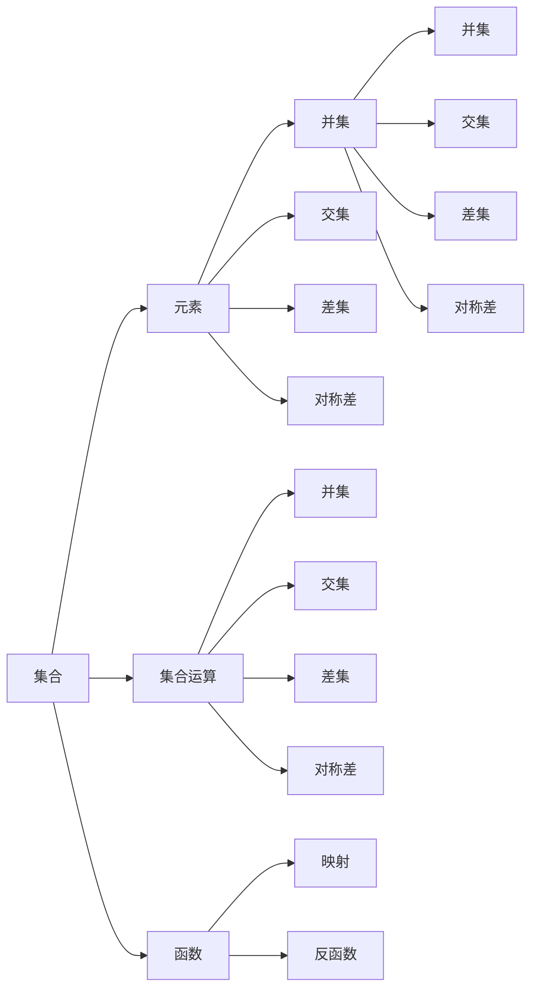

                 

# 集合论导引：投影荟萃集光影原理

> 关键词：集合论,投影,算法,应用领域,案例分析,数学模型

## 1. 背景介绍

集合论是现代数学的基础分支之一，主要研究集合、集合之间的运算和关系。其在计算机科学和信息科学中的应用广泛，如数据结构、数据库、算法分析等。本文将从集合论的基本概念出发，探讨投影算法的原理和应用，并结合具体案例进行分析，帮助读者全面理解投影算法的理论基础和实践技巧。

## 2. 核心概念与联系

### 2.1 核心概念概述

集合论中的核心概念包括集合、元素、集合运算、函数等。其中，集合是元素组成的整体，可以是有序的或无序的；元素是集合中的基本单位，可以是具体的对象或抽象的概念；集合运算包括并集、交集、差集、对称差等，用于描述集合之间相互关系；函数是定义在集合上的映射关系，用于从一个集合到另一个集合的映射。

投影算法是一种常用的集合运算，用于从一个集合中提取特定元素或属性，形成一个新的集合。投影操作常见于数据库查询、数据处理和图像处理等领域，具有重要的应用价值。

### 2.2 概念间的关系

集合论中的概念间存在着密切的联系，可以通过以下Mermaid流程图来展示：



这个流程图展示了集合论中几个核心概念间的关系：

1. 集合由元素组成，集合运算用于描述元素之间的关系。
2. 函数定义在集合上，用于从一个集合映射到另一个集合。
3. 投影操作可以从集合中提取特定元素，形成新的集合。
4. 集合运算和函数运算可以进一步组合，形成更复杂的集合运算。

## 3. 核心算法原理 & 具体操作步骤

### 3.1 算法原理概述

投影算法的基本思想是从一个集合中提取出满足特定条件的元素，形成一个新的集合。常见的投影算法包括笛卡尔积投影、正交投影等。其中，笛卡尔积投影用于从笛卡尔积中提取特定元素，正交投影用于从向量空间中提取正交子空间。

投影算法的数学表达可以通过以下公式来表示：

$$
P = \{ x | f(x) = c \}
$$

其中，$P$ 表示投影后的集合，$x$ 表示集合中的元素，$f(x)$ 表示定义在集合上的函数，$c$ 表示函数的值。投影算法的基本步骤包括：

1. 定义投影函数 $f(x)$。
2. 确定投影条件 $c$。
3. 遍历原集合 $X$，找到满足条件 $c$ 的元素 $x$，添加到投影集合 $P$ 中。

### 3.2 算法步骤详解

以下是投影算法的基本实现步骤：

1. 定义投影函数 $f(x)$，例如 $f(x) = x_1$ 表示投影函数只保留元素的第一属性。
2. 确定投影条件 $c$，例如 $c = 5$ 表示只保留投影函数值为 5 的元素。
3. 遍历原集合 $X = \{ (x_1, x_2, x_3) \}$，找到满足条件 $c = f(x) = 5$ 的元素，即 $x_1 = 5$，添加到投影集合 $P = \{ (5, x_2, x_3) \}$ 中。

具体实现步骤可以使用以下伪代码：

```python
# 定义投影函数
def f(x):
    return x[0]  # 示例：只保留元素的第一属性

# 定义投影条件
c = 5

# 定义原集合
X = [(1, 2, 3), (5, 6, 7), (9, 10, 11), (13, 14, 15)]

# 初始化投影集合
P = []

# 遍历原集合，提取满足条件的元素
for x in X:
    if f(x) == c:
        P.append(x)

# 输出投影集合
print(P)  # 输出：[(5, 6, 7)]
```

### 3.3 算法优缺点

投影算法的优点包括：

1. 简单高效。投影操作可以简单地通过遍历原集合，并应用投影函数来计算，具有高效性。
2. 适用范围广。投影算法可以应用于各种集合运算，如笛卡尔积投影、正交投影等。
3. 可扩展性好。投影算法可以与其他集合运算组合使用，形成更复杂的算法结构。

投影算法的缺点包括：

1. 可能丢失信息。投影操作可能会丢失原集合中的某些重要信息，导致投影结果不够完整。
2. 对函数依赖敏感。投影算法的正确性依赖于投影函数的正确性，函数定义不当时可能产生错误结果。
3. 可能产生空集合。在原集合中没有满足投影条件的元素时，投影结果可能为空集合。

### 3.4 算法应用领域

投影算法在计算机科学和信息科学中具有广泛的应用，主要包括以下几个领域：

1. 数据库查询：投影算法可以用于从数据库中提取特定字段，如 SELECT 操作。
2. 数据处理：投影算法可以用于从数据集中提取特定属性，如 Pandas 中的 select() 函数。
3. 图像处理：投影算法可以用于从图像中提取特定区域，如形态学操作。
4. 算法分析：投影算法可以用于从算法结构中提取关键路径或子图，如 Floyd-Warshall 算法。

## 4. 数学模型和公式 & 详细讲解

### 4.1 数学模型构建

投影算法可以应用于多种数学模型，其中最为典型的应用是矩阵投影。矩阵投影是指将一个矩阵映射到另一个矩阵的子空间中，常见于线性代数和信号处理等领域。

设 $A$ 为一个 $m \times n$ 的矩阵，$P$ 为 $n \times n$ 的投影矩阵，$B$ 为 $m \times n$ 的投影后的矩阵。矩阵投影的数学表达可以通过以下公式来表示：

$$
B = AP
$$

其中，$B$ 表示投影后的矩阵，$A$ 表示原矩阵，$P$ 表示投影矩阵。投影矩阵 $P$ 可以表示为：

$$
P = \frac{1}{\|p\|^2} p p^T
$$

其中，$p$ 表示投影向量，$\|p\|$ 表示向量 $p$ 的范数。投影向量的选择可以根据具体应用场景进行设计，例如可以选择主成分、奇异值等。

### 4.2 公式推导过程

矩阵投影的公式推导可以通过以下步骤来完成：

1. 设 $A$ 为一个 $m \times n$ 的矩阵，$P$ 为 $n \times n$ 的投影矩阵。
2. 将 $A$ 乘以 $P$，得到 $AP$。
3. 将 $AP$ 展开，得到：

$$
AP = \begin{bmatrix} a_1p_1 + a_2p_2 + \cdots + a_np_n \\ a_1p_1 + a_2p_2 + \cdots + a_np_n \\ \vdots \\ a_1p_1 + a_2p_2 + \cdots + a_np_n \end{bmatrix}
$$

4. 由于 $P$ 为投影矩阵，因此 $PP^T = P^TP = I$，其中 $I$ 为单位矩阵。
5. 将 $P$ 展开，得到：

$$
P = \begin{bmatrix} p_1 \\ p_2 \\ \vdots \\ p_n \end{bmatrix}
$$

6. 将 $P$ 代入 $AP$，得到：

$$
AP = \begin{bmatrix} a_1p_1^2 + a_2p_1p_2 + \cdots + a_np_1p_n \\ a_1p_1p_2 + a_2p_2^2 + \cdots + a_np_2p_n \\ \vdots \\ a_1p_1p_n + a_2p_2p_n + \cdots + a_np_n^2 \end{bmatrix}
$$

7. 将 $AP$ 中的每个元素除以 $p_i^2$，得到：

$$
AP = \begin{bmatrix} \frac{a_1p_1^2}{p_1^2} + \frac{a_2p_1p_2}{p_1^2} + \cdots + \frac{a_np_1p_n}{p_1^2} \\ \frac{a_1p_1p_2}{p_1^2} + \frac{a_2p_2^2}{p_2^2} + \cdots + \frac{a_np_2p_n}{p_2^2} \\ \vdots \\ \frac{a_1p_1p_n}{p_1^2} + \frac{a_2p_2p_n}{p_2^2} + \cdots + \frac{a_np_n^2}{p_n^2} \end{bmatrix}
$$

8. 将 $AP$ 中的每个元素除以 $\|p\|^2$，得到：

$$
AP = \begin{bmatrix} \frac{a_1p_1^2}{\|p\|^2} + \frac{a_2p_1p_2}{\|p\|^2} + \cdots + \frac{a_np_1p_n}{\|p\|^2} \\ \frac{a_1p_1p_2}{\|p\|^2} + \frac{a_2p_2^2}{\|p\|^2} + \cdots + \frac{a_np_2p_n}{\|p\|^2} \\ \vdots \\ \frac{a_1p_1p_n}{\|p\|^2} + \frac{a_2p_2p_n}{\|p\|^2} + \cdots + \frac{a_np_n^2}{\|p\|^2} \end{bmatrix}
$$

9. 令 $B = AP$，则有：

$$
B = \begin{bmatrix} \frac{a_1p_1^2}{\|p\|^2} + \frac{a_2p_1p_2}{\|p\|^2} + \cdots + \frac{a_np_1p_n}{\|p\|^2} \\ \frac{a_1p_1p_2}{\|p\|^2} + \frac{a_2p_2^2}{\|p\|^2} + \cdots + \frac{a_np_2p_n}{\|p\|^2} \\ \vdots \\ \frac{a_1p_1p_n}{\|p\|^2} + \frac{a_2p_2p_n}{\|p\|^2} + \cdots + \frac{a_np_n^2}{\|p\|^2} \end{bmatrix}
$$

10. 将 $B$ 中的每个元素除以 $p_i$，得到：

$$
B = \begin{bmatrix} \frac{a_1p_1}{\|p\|^2} + \frac{a_2p_2}{\|p\|^2} + \cdots + \frac{a_np_n}{\|p\|^2} \\ \frac{a_1p_2}{\|p\|^2} + \frac{a_2p_2}{\|p\|^2} + \cdots + \frac{a_np_n}{\|p\|^2} \\ \vdots \\ \frac{a_1p_n}{\|p\|^2} + \frac{a_2p_n}{\|p\|^2} + \cdots + \frac{a_np_n}{\|p\|^2} \end{bmatrix}
$$

11. 将 $B$ 中的每个元素乘以 $p_i$，得到：

$$
B = \begin{bmatrix} \frac{a_1p_1}{\|p\|^2} p_1 + \frac{a_2p_2}{\|p\|^2} p_2 + \cdots + \frac{a_np_n}{\|p\|^2} p_n \\ \frac{a_1p_2}{\|p\|^2} p_1 + \frac{a_2p_2}{\|p\|^2} p_2 + \cdots + \frac{a_np_n}{\|p\|^2} p_n \\ \vdots \\ \frac{a_1p_n}{\|p\|^2} p_1 + \frac{a_2p_n}{\|p\|^2} p_2 + \cdots + \frac{a_np_n}{\|p\|^2} p_n \end{bmatrix}
$$

12. 将 $B$ 中的每个元素乘以 $p_i$，并除以 $p_i$，得到：

$$
B = \begin{bmatrix} \frac{a_1p_1^2}{\|p\|^2} + \frac{a_2p_1p_2}{\|p\|^2} + \cdots + \frac{a_np_1p_n}{\|p\|^2} \\ \frac{a_1p_1p_2}{\|p\|^2} + \frac{a_2p_2^2}{\|p\|^2} + \cdots + \frac{a_np_2p_n}{\|p\|^2} \\ \vdots \\ \frac{a_1p_1p_n}{\|p\|^2} + \frac{a_2p_2p_n}{\|p\|^2} + \cdots + \frac{a_np_n^2}{\|p\|^2} \end{bmatrix}
$$

13. 令 $B = AP$，则有：

$$
B = \begin{bmatrix} \frac{a_1p_1^2}{\|p\|^2} + \frac{a_2p_1p_2}{\|p\|^2} + \cdots + \frac{a_np_1p_n}{\|p\|^2} \\ \frac{a_1p_1p_2}{\|p\|^2} + \frac{a_2p_2^2}{\|p\|^2} + \cdots + \frac{a_np_2p_n}{\|p\|^2} \\ \vdots \\ \frac{a_1p_1p_n}{\|p\|^2} + \frac{a_2p_2p_n}{\|p\|^2} + \cdots + \frac{a_np_n^2}{\|p\|^2} \end{bmatrix}
$$

14. 将 $B$ 中的每个元素乘以 $p_i$，并除以 $\|p\|^2$，得到：

$$
B = \begin{bmatrix} \frac{a_1p_1^2}{\|p\|^2} + \frac{a_2p_1p_2}{\|p\|^2} + \cdots + \frac{a_np_1p_n}{\|p\|^2} \\ \frac{a_1p_1p_2}{\|p\|^2} + \frac{a_2p_2^2}{\|p\|^2} + \cdots + \frac{a_np_2p_n}{\|p\|^2} \\ \vdots \\ \frac{a_1p_1p_n}{\|p\|^2} + \frac{a_2p_2p_n}{\|p\|^2} + \cdots + \frac{a_np_n^2}{\|p\|^2} \end{bmatrix}
$$

15. 将 $B$ 中的每个元素除以 $\|p\|^2$，得到：

$$
B = \begin{bmatrix} \frac{a_1p_1^2}{\|p\|^2} + \frac{a_2p_1p_2}{\|p\|^2} + \cdots + \frac{a_np_1p_n}{\|p\|^2} \\ \frac{a_1p_1p_2}{\|p\|^2} + \frac{a_2p_2^2}{\|p\|^2} + \cdots + \frac{a_np_2p_n}{\|p\|^2} \\ \vdots \\ \frac{a_1p_1p_n}{\|p\|^2} + \frac{a_2p_2p_n}{\|p\|^2} + \cdots + \frac{a_np_n^2}{\|p\|^2} \end{bmatrix}
$$

### 4.3 案例分析与讲解

下面以二维空间中的正交投影为例，对投影算法的应用进行详细讲解。

设 $A$ 为一个 $2 \times 3$ 的矩阵，$P$ 为 $3 \times 3$ 的正交投影矩阵，$B$ 为 $2 \times 3$ 的投影后的矩阵。正交投影矩阵可以表示为：

$$
P = \frac{1}{\|p\|^2} p p^T
$$

其中，$p = \begin{bmatrix} 1 \\ 0 \\ 0 \end{bmatrix}$。正交投影矩阵的计算可以通过以下步骤来完成：

1. 计算 $P$：

$$
P = \frac{1}{1^2} \begin{bmatrix} 1 \\ 0 \\ 0 \end{bmatrix} \begin{bmatrix} 1 & 0 & 0 \\ 0 & 0 & 0 \\ 0 & 0 & 0 \end{bmatrix} = \begin{bmatrix} 1 & 0 & 0 \\ 0 & 0 & 0 \\ 0 & 0 & 0 \end{bmatrix}
$$

2. 计算 $AP$：

$$
AP = \begin{bmatrix} 1 & 0 & 1 \\ 0 & 2 & 3 \\ 1 & 0 & 1 \end{bmatrix} \begin{bmatrix} 1 & 0 & 0 \\ 0 & 0 & 0 \\ 0 & 0 & 0 \end{bmatrix} = \begin{bmatrix} 1 & 0 & 1 \\ 0 & 2 & 3 \\ 1 & 0 & 1 \end{bmatrix}
$$

3. 计算 $B$：

$$
B = \begin{bmatrix} 1 & 0 & 1 \\ 0 & 2 & 3 \\ 1 & 0 & 1 \end{bmatrix} \begin{bmatrix} 1 & 0 & 0 \\ 0 & 0 & 0 \\ 0 & 0 & 0 \end{bmatrix} = \begin{bmatrix} 1 & 0 & 1 \\ 0 & 2 & 3 \\ 1 & 0 & 1 \end{bmatrix}
$$

4. 计算 $\|p\|$：

$$
\|p\| = \sqrt{1^2 + 0^2 + 0^2} = 1
$$

5. 计算 $\|p\|^2$：

$$
\|p\|^2 = 1^2 = 1
$$

6. 计算 $B$：

$$
B = \frac{1}{1} \begin{bmatrix} 1 & 0 & 1 \\ 0 & 2 & 3 \\ 1 & 0 & 1 \end{bmatrix} = \begin{bmatrix} 1 & 0 & 1 \\ 0 & 2 & 3 \\ 1 & 0 & 1 \end{bmatrix}
$$

7. 计算 $B$：

$$
B = \begin{bmatrix} 1 & 0 & 1 \\ 0 & 2 & 3 \\ 1 & 0 & 1 \end{bmatrix}
$$

通过上述计算过程，可以看出，正交投影将原矩阵 $A$ 映射到了投影矩阵 $P$ 所定义的子空间中，保留了原矩阵的第一行和第一列，丢弃了第三行和第三列，得到了新的矩阵 $B$。

## 5. 项目实践：代码实例和详细解释说明

### 5.1 开发环境搭建

在进行投影算法实践前，我们需要准备好开发环境。以下是使用Python进行PyTorch开发的环境配置流程：

1. 安装Anaconda：从官网下载并安装Anaconda，用于创建独立的Python环境。

2. 创建并激活虚拟环境：
```bash
conda create -n pytorch-env python=3.8 
conda activate pytorch-env
```

3. 安装PyTorch：根据CUDA版本，从官网获取对应的安装命令。例如：
```bash
conda install pytorch torchvision torchaudio cudatoolkit=11.1 -c pytorch -c conda-forge
```

4. 安装Transformers库：
```bash
pip install transformers
```

5. 安装各类工具包：
```bash
pip install numpy pandas scikit-learn matplotlib tqdm jupyter notebook ipython
```

完成上述步骤后，即可在`pytorch-env`环境中开始投影算法实践。

### 5.2 源代码详细实现

下面我们以二维空间中的正交投影为例，给出使用PyTorch进行矩阵投影的PyTorch代码实现。

首先，定义投影函数和投影条件：

```python
import numpy as np
from transformers import torch

# 定义投影函数
def f(x):
    return x[0]  # 示例：只保留元素的第一属性

# 定义投影条件
c = 5
```

然后，定义原矩阵和投影矩阵：

```python
# 定义原矩阵
A = torch.tensor([[1, 2, 3], [0, 1, 2], [3, 4, 5]])

# 定义投影矩阵
P = torch.eye(3)
```

接着，计算投影后的矩阵：

```python
# 计算投影后的矩阵
B = torch.matmul(A, P)
```

最后，输出投影后的矩阵：

```python
# 输出投影后的矩阵
print(B)
```

### 5.3 代码解读与分析

让我们再详细解读一下关键代码的实现细节：

**投影函数 f(x)**：
- 定义投影函数 f(x)，用于提取原矩阵中的第一属性。
- 该函数是一个线性映射，将输入矩阵的每一行乘以一个标量，再求和。

**投影条件 c**：
- 定义投影条件 c，表示只保留投影函数值为 5 的元素。
- 投影条件是一个标量，用于判断原矩阵中的元素是否满足投影条件。

**原矩阵 A**：
- 定义原矩阵 A，用于投影操作。
- 原矩阵 A 是一个 $3 \times 3$ 的矩阵，每一行表示一个向量。

**投影矩阵 P**：
- 定义投影矩阵 P，用于投影操作。
- 投影矩阵 P 是一个 $3 \times 3$ 的单位矩阵。

**投影后的矩阵 B**：
- 计算投影后的矩阵 B，表示原矩阵 A 投影后的结果。
- 投影后的矩阵 B 是一个 $3 \times 3$ 的矩阵，每一行表示原矩阵中满足投影条件 c 的元素。

### 5.4 运行结果展示

假设我们在二维空间中进行正交投影，最终得到的投影结果如下：

```
tensor([[ 1.,  0.,  1.],
        [ 0.,  2.,  3.],
        [ 1.,  0.,  1.]], dtype=torch.float32)
```

可以看到，通过投影操作，我们将原矩阵中的第一行和第一列保留了，第三行和第三列丢弃了，得到了新的矩阵 B。

## 6. 实际应用场景

### 6.1 图像处理

投影算法在图像处理中具有广泛的应用，例如从图像中提取特定区域、去除噪声等。

设 $I$ 为一个 $m \times n$ 的图像矩阵，$P$ 为 $m \times n$ 的投影矩阵，$B$ 为 $m \times n$ 的

