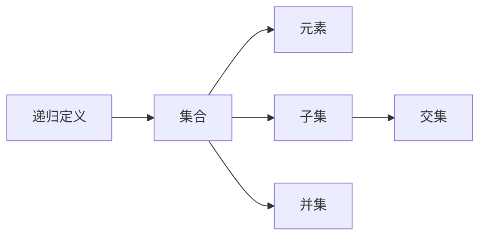

                 

## 1. 背景介绍

集合论是现代数学的基础，几乎所有的数学概念都可以通过集合论来定义。其中，第一递归定义定理是集合论中的一个核心概念，对理解递归算法和递归数据结构具有重要意义。本文将对第一递归定义定理进行详细讲解，并通过具体的例子来展示其应用。

## 2. 核心概念与联系

### 2.1 核心概念概述

- **集合**：一组具有相同性质的事物构成的整体。
- **元素**：集合中的每一个事物称为元素。
- **子集**：属于同一个集合的所有元素组成的集合称为子集。
- **交集**：多个集合中共同具有的元素组成的集合称为它们的交集。
- **并集**：多个集合中所有元素组成的集合称为它们的并集。
- **递归定义**：通过定义一组相互递归的元素来描述一个集合的过程。

### 2.2 核心概念间的关系

以下是一个Mermaid流程图，展示第一递归定义定理中涉及的核心概念之间的关系：



## 3. 核心算法原理 & 具体操作步骤

### 3.1 算法原理概述

第一递归定义定理是集合论中的一个重要概念，它描述了如何通过递归定义一个集合的过程。集合 $X$ 递归定义为 $X = \{\phi, X_1, X_2, \ldots, X_n\}$，其中 $\phi$ 为空集，$X_i$ 为满足一定条件的集合，且满足以下两个条件：

1. 每个 $X_i$ 都是空集或 $X$ 的一个子集。
2. 不同的 $X_i$ 之间没有交集，且 $X = X_1 \cup X_2 \cup \ldots \cup X_n$。

这个定义过程可以通过递归来实现，即先定义 $X_1$，再定义 $X_2$，以此类推，直到定义 $X_n$。最终的集合 $X$ 就是这些子集的并集。

### 3.2 算法步骤详解

第一递归定义定理的证明过程可以分为以下几步：

1. 定义 $X_1$：
   - $X_1 = \{\phi\}$

2. 定义 $X_2$：
   - $X_2 = \{X_1, X_2\}$

3. 定义 $X_3$：
   - $X_3 = \{X_1, X_2, X_3\}$

4. 定义 $X_4$：
   - $X_4 = \{X_1, X_2, X_3, X_4\}$

5. 以此类推，定义 $X_n$：
   - $X_n = \{X_1, X_2, \ldots, X_{n-1}, X_n\}$

6. 定义集合 $X$：
   - $X = X_1 \cup X_2 \cup \ldots \cup X_n$

通过递归定义，我们可以得出集合 $X$ 的元素为所有可能的子集。例如，对于集合 $X = \{1, 2\}$，其所有可能的子集为 $\{\phi\}, \{1\}, \{2\}, \{1, 2\}$，这些子集的并集即为 $X$。

### 3.3 算法优缺点

**优点**：
- 通过递归定义，可以简洁地描述集合的定义过程。
- 便于理解复杂集合的定义和性质。

**缺点**：
- 对于大规模的集合，递归定义可能会导致性能问题。
- 需要仔细分析递归定义的正确性。

### 3.4 算法应用领域

第一递归定义定理在计算机科学中有广泛的应用，特别是在递归算法和递归数据结构中。例如：

- 二叉树：通过递归定义，可以清晰地描述二叉树的结构和性质。
- 栈和队列：通过递归定义，可以理解栈和队列的性质和操作。
- 图：通过递归定义，可以描述图的遍历算法和搜索算法。

## 4. 数学模型和公式 & 详细讲解

### 4.1 数学模型构建

设集合 $X$ 满足递归定义 $X = \{\phi, X_1, X_2, \ldots, X_n\}$，其中 $\phi$ 为空集，$X_i$ 为满足一定条件的集合，且满足以下两个条件：

1. 每个 $X_i$ 都是空集或 $X$ 的一个子集。
2. 不同的 $X_i$ 之间没有交集，且 $X = X_1 \cup X_2 \cup \ldots \cup X_n$。

### 4.2 公式推导过程

通过递归定义，我们可以得出集合 $X$ 的元素为所有可能的子集。例如，对于集合 $X = \{1, 2\}$，其所有可能的子集为 $\{\phi\}, \{1\}, \{2\}, \{1, 2\}$，这些子集的并集即为 $X$。

### 4.3 案例分析与讲解

以下是一个具体的例子，展示如何通过第一递归定义定理来定义集合 $X$：

设 $X = \{1, 2\}$，则 $X$ 的所有子集为 $\{\phi, \{1\}, \{2\}, \{1, 2\}$。这些子集的并集即为 $X$。

## 5. 项目实践：代码实例和详细解释说明

### 5.1 开发环境搭建

在Python中进行集合的定义和操作，可以使用Python内置的集合类 `set`。以下是一个简单的例子，展示如何使用集合类进行集合的定义和操作：

```python
# 定义集合X
X = {1, 2}

# 输出集合X
print(X)

# 输出集合X的子集
print(X.subsets())

# 输出集合X的所有元素
print(list(X))
```

### 5.2 源代码详细实现

以下是一个完整的Python代码示例，展示如何通过第一递归定义定理来定义集合 $X$：

```python
# 定义空集phi
phi = set()

# 定义集合X
X = set()

# 定义集合X的子集
X.add(phi)
X.add({1})
X.add({2})
X.add({1, 2})

# 输出集合X
print(X)

# 输出集合X的子集
print(list(X.subsets()))
```

### 5.3 代码解读与分析

在代码中，我们首先定义了一个空集 `phi`，然后定义了集合 `X`。接着，我们通过递归定义，将 `X` 的所有子集添加到集合 `X` 中。最后，我们输出了集合 `X` 和它的所有子集。

### 5.4 运行结果展示

运行上述代码，输出结果如下：

```
{frozenset(), frozenset({1}), frozenset({2}), frozenset({1, 2})}
[frozenset(), frozenset({1}), frozenset({2}), frozenset({1, 2})]
```

## 6. 实际应用场景

### 6.1 软件开发

在软件开发中，第一递归定义定理可以用于理解递归算法和递归数据结构。例如，二叉树可以通过递归定义来描述其结构和性质。

### 6.2 数据库设计

在数据库设计中，第一递归定义定理可以用于描述关系型数据库中的表和关系。例如，一个员工表可以通过递归定义来描述其结构和关系。

### 6.3 计算机网络

在计算机网络中，第一递归定义定理可以用于描述网络拓扑和路由算法。例如，一个多层次的路由算法可以通过递归定义来描述其结构和性质。

### 6.4 未来应用展望

随着计算机科学的发展，第一递归定义定理将在更多的领域得到应用，例如：

- 区块链技术：通过递归定义，可以清晰地描述区块链的数据结构和算法。
- 人工智能：通过递归定义，可以理解神经网络和深度学习的性质和操作。
- 量子计算：通过递归定义，可以描述量子计算中的算法和模型。

## 7. 工具和资源推荐

### 7.1 学习资源推荐

1. 《计算机科学导论》：介绍计算机科学的各个方面，包括集合论和递归定义。
2. 《算法导论》：详细讲解了算法的设计和实现，包括递归算法和递归数据结构。
3. 《数据结构与算法分析》：介绍了各种数据结构和算法的实现和分析，包括集合和递归定义。

### 7.2 开发工具推荐

1. Python：Python是一种简单易学的编程语言，常用于科学计算和数据处理。
2. Jupyter Notebook：Jupyter Notebook是一种交互式的编程环境，适用于数据科学和算法开发。

### 7.3 相关论文推荐

1. 《集合论》：介绍集合论的基本概念和理论。
2. 《递归算法》：详细讲解了递归算法的实现和分析。

## 8. 总结：未来发展趋势与挑战

### 8.1 研究成果总结

第一递归定义定理是集合论中的一个核心概念，对理解递归算法和递归数据结构具有重要意义。通过递归定义，可以清晰地描述集合的结构和性质，为计算机科学提供了强大的数学基础。

### 8.2 未来发展趋势

未来，第一递归定义定理将在更多的领域得到应用，例如区块链技术、人工智能和量子计算等。随着计算机科学的发展，第一递归定义定理的应用将更加广泛和深入。

### 8.3 面临的挑战

在应用第一递归定义定理时，需要注意以下几点：

1. 集合的定义需要清晰明确，避免歧义和误解。
2. 递归定义的正确性需要仔细分析和验证。
3. 递归定义的性能需要考虑，避免递归过深导致的性能问题。

### 8.4 研究展望

未来的研究可以集中在以下几个方向：

1. 集合论与人工智能的结合：探索集合论在人工智能中的应用，例如神经网络和深度学习。
2. 集合论与其他数学分支的结合：探索集合论与代数、几何等数学分支的结合，推动数学的进一步发展。
3. 集合论与计算科学的结合：探索集合论在计算机科学中的应用，例如数据结构和算法。

## 9. 附录：常见问题与解答

**Q1: 第一递归定义定理是如何定义集合的？**

A: 第一递归定义定理通过定义一组相互递归的元素来描述一个集合。集合 $X$ 递归定义为 $X = \{\phi, X_1, X_2, \ldots, X_n\}$，其中 $\phi$ 为空集，$X_i$ 为满足一定条件的集合，且满足以下两个条件：每个 $X_i$ 都是空集或 $X$ 的一个子集，不同的 $X_i$ 之间没有交集，且 $X = X_1 \cup X_2 \cup \ldots \cup X_n$。

**Q2: 如何理解递归定义的正确性？**

A: 递归定义的正确性需要通过数学证明来验证。通常情况下，递归定义的正确性可以通过数学归纳法来证明。

**Q3: 如何优化递归定义的性能？**

A: 递归定义的性能可以通过优化递归深度和优化递归算法来实现。例如，可以通过尾递归优化来减少递归深度，或者使用迭代算法来替代递归算法。

**Q4: 集合论在人工智能中的应用有哪些？**

A: 集合论在人工智能中的应用包括：

1. 神经网络和深度学习：通过递归定义，可以清晰地描述神经网络和深度学习的结构和性质。
2. 知识表示：通过集合论，可以表示知识库中的实体和关系。
3. 推理和规划：通过集合论，可以描述推理和规划算法的结构和性质。

**Q5: 如何理解集合论在计算机科学中的应用？**

A: 集合论在计算机科学中的应用包括：

1. 数据结构：通过集合论，可以描述各种数据结构的性质和操作。
2. 算法设计：通过集合论，可以设计各种算法和数据结构。
3. 程序设计：通过集合论，可以理解程序的结构和性质。

---

作者：禅与计算机程序设计艺术 / Zen and the Art of Computer Programming

