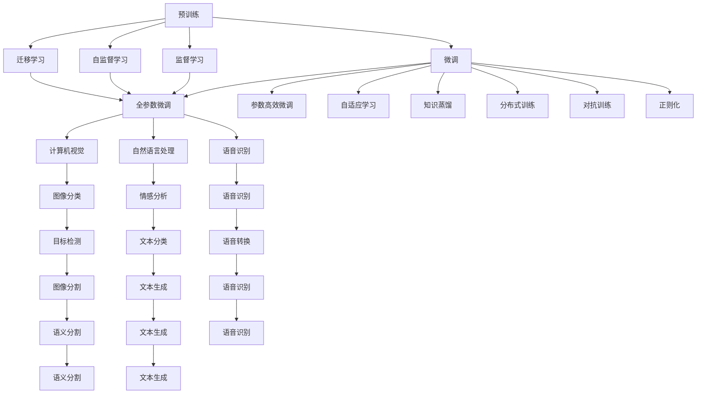
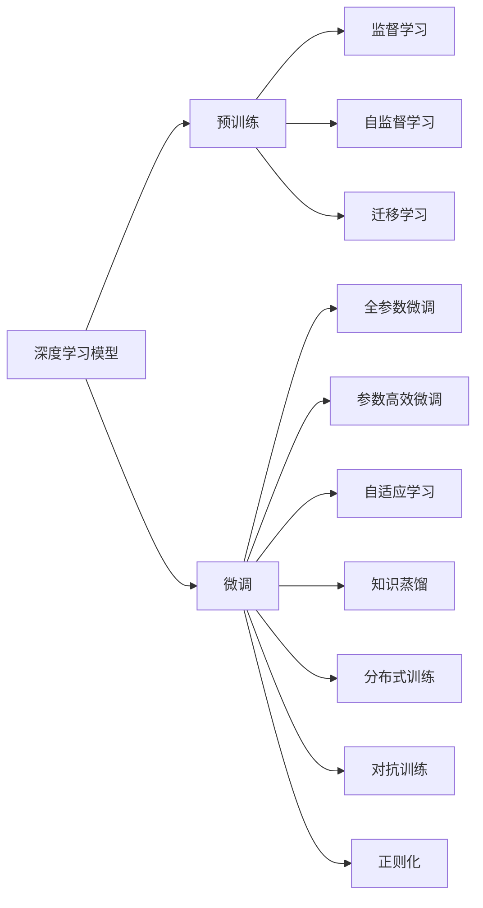
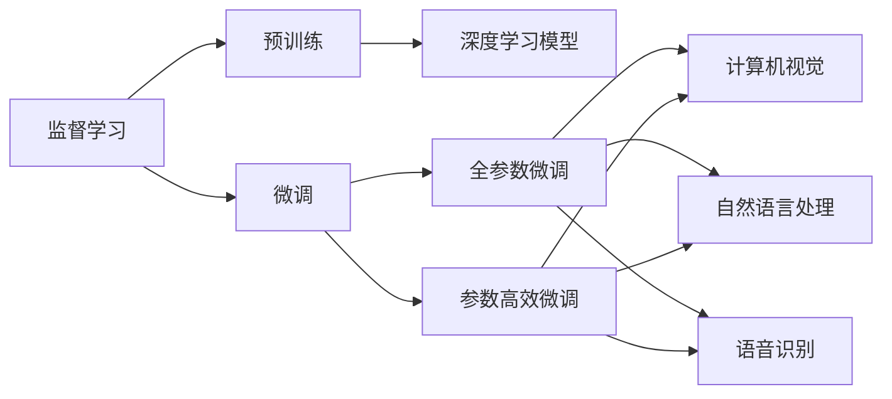
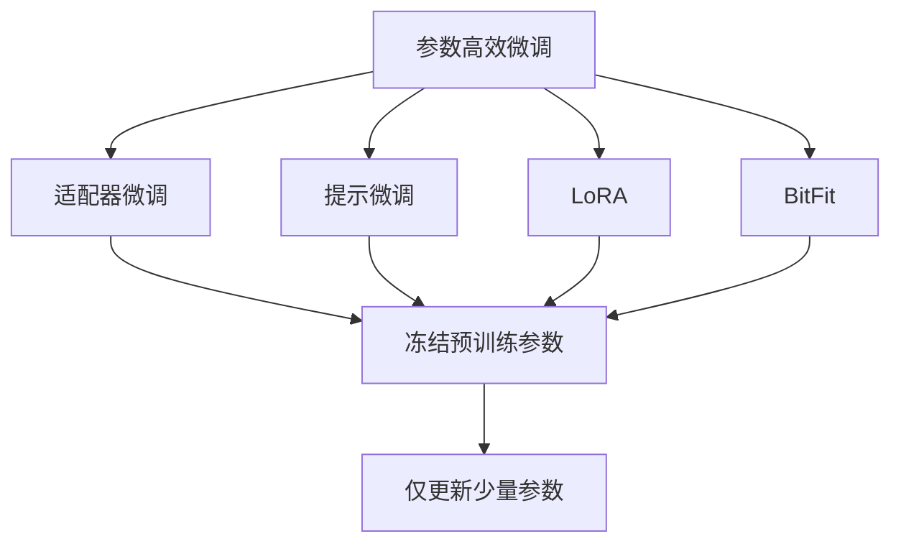
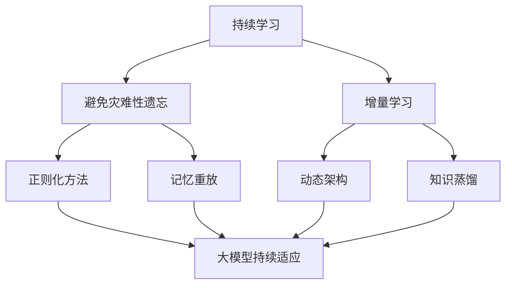
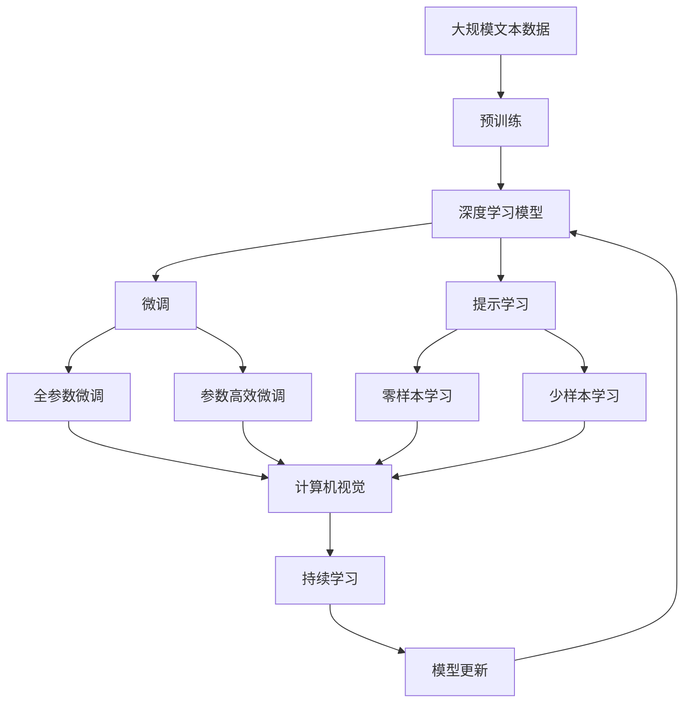

                 

# 预训练与微调：AI模型优化策略

> 关键词：
- 预训练 (Pretraining)
- 微调 (Fine-Tuning)
- 监督学习 (Supervised Learning)
- 迁移学习 (Transfer Learning)
- 自监督学习 (Self-Supervised Learning)
- 深度学习 (Deep Learning)
- 神经网络 (Neural Network)
- 模型压缩 (Model Compression)
- 模型蒸馏 (Model Distillation)
- 优化算法 (Optimization Algorithm)
- 学习率 (Learning Rate)
- 梯度下降 (Gradient Descent)
- 正则化 (Regularization)
- 模型泛化 (Model Generalization)
- 数据增强 (Data Augmentation)
- 对抗训练 (Adversarial Training)
- 参数高效微调 (Parameter-Efficient Fine-Tuning, PEFT)
- 知识蒸馏 (Knowledge Distillation)
- 领域自适应 (Domain Adaptation)
- 分布式训练 (Distributed Training)
- 强化学习 (Reinforcement Learning)

## 1. 背景介绍

### 1.1 问题由来

在人工智能的发展历程中，预训练与微调是一对重要的概念，它们共同构成了深度学习模型优化的两大核心策略。预训练指的是在大规模无标签数据上训练模型，学习到通用的知识表示，而微调则是指在预训练的基础上，使用带标签数据对模型进行有监督学习，使模型在特定任务上表现更好。预训练与微调相辅相成，相互促进，极大地推动了深度学习模型的性能提升。

预训练和微调的思想可以追溯到1988年Sepp Hochreiter和Jürgen Schmidhuber提出的深度学习模型，但直到2010年后，随着计算资源的普及和数据量的爆炸式增长，预训练和微调才真正进入了大规模应用阶段。这一时期的深度学习模型以卷积神经网络（CNN）和循环神经网络（RNN）为主，广泛应用于计算机视觉、自然语言处理、语音识别等领域，并取得了显著的成果。

然而，预训练与微调并非一帆风顺。早期的预训练模型如多层感知器（MLP）和卷积神经网络（CNN）在性能上表现有限，预训练所需的数据量和计算资源巨大。随着深度学习模型的发展，预训练技术逐渐成熟，深度神经网络（DNN）、残差网络（ResNet）等结构被提出，使得大规模预训练成为可能。此外，自监督学习、迁移学习等技术的发展，也为预训练与微调提供了更多的选择。

目前，预训练与微调已成为深度学习模型优化的重要手段，广泛应用于计算机视觉、自然语言处理、语音识别等多个领域。预训练与微调不仅能够提升模型的性能，还能降低对标注数据的需求，使得深度学习模型能够在数据量有限的场景下表现良好。

### 1.2 问题核心关键点

预训练与微调的核心关键点在于如何将大规模无标签数据与少量带标签数据相结合，最大化模型的泛化能力和适应性。这一过程中，预训练和微调之间的关系、学习策略的选择、优化算法的设计、正则化技术的应用等都是需要考虑的重要因素。

具体而言，预训练与微调的核心关键点包括：
- 如何选择合适的预训练数据和模型结构。
- 如何在预训练和微调之间进行平衡，避免过拟合和欠拟合。
- 如何选择和设计优化算法，提高训练效率和模型性能。
- 如何应用正则化技术，防止模型过拟合。
- 如何设计任务适配层，将预训练模型转化为适合特定任务的模型。

## 2. 核心概念与联系

### 2.1 核心概念概述

为更好地理解预训练与微调的方法，本节将介绍几个密切相关的核心概念：

- 预训练 (Pretraining)：在大规模无标签数据上训练深度学习模型，学习通用的知识表示。常见的预训练任务包括自监督学习任务如语言模型、视觉任务如自编码器、迁移学习任务如多任务学习等。
- 微调 (Fine-Tuning)：在预训练的基础上，使用少量带标签数据对模型进行有监督学习，使模型在特定任务上表现更好。微调通常包括对模型参数的微调、任务适配层的添加等。
- 监督学习 (Supervised Learning)：使用带标签数据训练模型，使其能够进行预测或分类。
- 迁移学习 (Transfer Learning)：将一个领域学到的知识迁移到另一个领域，以减少在新领域上的学习量。
- 自监督学习 (Self-Supervised Learning)：使用未标注数据进行监督学习，如语言模型、自编码器等。
- 深度学习 (Deep Learning)：通过多层神经网络进行学习和推理，具有强大的特征表示能力。
- 神经网络 (Neural Network)：由神经元节点和连接构成的网络，用于处理数据和进行计算。
- 模型压缩 (Model Compression)：通过量化、剪枝、蒸馏等方法减小模型参数量，提高计算效率和模型性能。
- 模型蒸馏 (Model Distillation)：通过将大规模模型的知识迁移到小规模模型，提高小规模模型的性能。
- 优化算法 (Optimization Algorithm)：用于调整模型参数，使其最小化损失函数。
- 学习率 (Learning Rate)：控制模型参数更新速度的超参数，影响模型收敛速度。
- 梯度下降 (Gradient Descent)：通过计算损失函数对模型参数的梯度，反向传播更新模型参数。
- 正则化 (Regularization)：通过添加惩罚项或限制模型参数大小，防止过拟合。
- 模型泛化 (Model Generalization)：模型在新数据上的表现，能够很好地泛化到未见过的数据。
- 数据增强 (Data Augmentation)：通过改变数据集中的数据形式，增加数据多样性，提高模型鲁棒性。
- 对抗训练 (Adversarial Training)：通过加入对抗样本，提高模型鲁棒性。
- 参数高效微调 (Parameter-Efficient Fine-Tuning, PEFT)：在微调过程中，只更新少量参数，固定大部分预训练权重不变，以提高微调效率和避免过拟合。
- 知识蒸馏 (Knowledge Distillation)：通过将大规模模型的知识迁移到小规模模型，提高小规模模型的性能。
- 领域自适应 (Domain Adaptation)：使模型在不同领域之间进行迁移学习，提高模型的适应性。
- 分布式训练 (Distributed Training)：将模型并行训练，提高训练效率。
- 强化学习 (Reinforcement Learning)：通过奖励机制优化模型，使其能够适应复杂环境。

这些核心概念之间的逻辑关系可以通过以下Mermaid流程图来展示：



这个流程图展示了大语言模型的预训练与微调过程，以及与之相关的概念和应用场景。

### 2.2 概念间的关系

这些核心概念之间存在着紧密的联系，形成了深度学习模型优化的完整生态系统。下面我们通过几个Mermaid流程图来展示这些概念之间的关系。

#### 2.2.1 深度学习模型优化



这个流程图展示了深度学习模型优化的基本流程。深度学习模型通过预训练学习到通用的知识表示，通过微调适应特定任务，通过监督学习、自监督学习和迁移学习获取更多的知识表示，通过全参数微调、参数高效微调、自适应学习、知识蒸馏、分布式训练、对抗训练和正则化等方法提高模型性能。

#### 2.2.2 监督学习与微调的关系



这个流程图展示了监督学习与微调的关系。深度学习模型通过监督学习获得带标签数据，预训练学习到通用的知识表示，微调通过有监督学习适应特定任务，全参数微调和参数高效微调通过优化参数和任务适配层提高模型性能。

#### 2.2.3 参数高效微调方法



这个流程图展示了几种常见的参数高效微调方法。这些方法的共同特点是冻结大部分预训练参数，只更新少量参数，从而提高微调效率和避免过拟合。

#### 2.2.4 持续学习在大模型中的应用



这个流程图展示了持续学习在大模型中的应用。持续学习的主要目标是避免灾难性遗忘和实现增量学习。通过正则化方法、记忆重放、动态架构和知识蒸馏等技术，可以使大模型持续适应新的任务和数据。

### 2.3 核心概念的整体架构

最后，我们用一个综合的流程图来展示这些核心概念在大模型预训练与微调过程中的整体架构：



这个综合流程图展示了从预训练到微调，再到持续学习的完整过程。深度学习模型通过预训练学习到通用的知识表示，通过微调适应特定任务，通过提示学习实现零样本和少样本学习，通过全参数微调和参数高效微调提高模型性能，通过持续学习保持模型适应性，最终实现模型的优化。

## 3. 核心算法原理 & 具体操作步骤
### 3.1 算法原理概述

预训练与微调的核心算法原理在于深度学习模型的参数共享和优化。预训练阶段，模型在大规模无标签数据上学习到通用的知识表示，这些知识表示被认为具有普遍的适用性，可以在不同任务之间共享。微调阶段，模型在少量带标签数据上进一步学习，以适应特定任务，从而获得更好的性能。

具体而言，预训练与微调的算法原理如下：

1. 预训练阶段，深度学习模型在大规模无标签数据上学习到通用的知识表示，这些知识表示能够应用于多个任务。

2. 微调阶段，在预训练的基础上，深度学习模型在少量带标签数据上进行有监督学习，以适应特定任务。

3. 在微调过程中，深度学习模型通过梯度下降等优化算法更新参数，最小化损失函数。

4. 在预训练和微调之间，可以通过知识蒸馏等方法，将预训练模型的知识迁移到微调模型上，提高微调模型的性能。

5. 在微调过程中，可以通过参数高效微调等方法，减少微调所需的时间和资源。

### 3.2 算法步骤详解

基于监督学习的深度学习模型优化流程，一般包括以下几个关键步骤：

**Step 1: 准备预训练模型和数据集**
- 选择合适的深度学习模型作为初始化参数，如卷积神经网络（CNN）、循环神经网络（RNN）、Transformer等。
- 准备带标签数据集，划分为训练集、验证集和测试集。一般要求带标签数据与预训练数据的分布不要差异过大。

**Step 2: 选择优化算法和超参数**
- 选择合适的优化算法及其参数，如SGD、Adam等，设置学习率、批大小、迭代轮数等。
- 设置正则化技术及强度，包括权重衰减、Dropout、Early Stopping等。
- 确定冻结预训练参数的策略，如仅微调顶层，或全部参数都参与微调。

**Step 3: 执行梯度训练**
- 将训练集数据分批次输入模型，前向传播计算损失函数。
- 反向传播计算参数梯度，根据设定的优化算法和学习率更新模型参数。
- 周期性在验证集上评估模型性能，根据性能指标决定是否触发 Early Stopping。
- 重复上述步骤直到满足预设的迭代轮数或 Early Stopping 条件。

**Step 4: 测试和部署**
- 在测试集上评估微调后模型，对比微调前后的精度提升。
- 使用微调后的模型对新样本进行推理预测，集成到实际的应用系统中。
- 持续收集新的数据，定期重新微调模型，以适应数据分布的变化。

以上是基于监督学习的深度学习模型优化的一般流程。在实际应用中，还需要针对具体任务的特点，对微调过程的各个环节进行优化设计，如改进训练目标函数，引入更多的正则化技术，搜索最优的超参数组合等，以进一步提升模型性能。

### 3.3 算法优缺点

基于监督学习的深度学习模型优化方法具有以下优点：

1. 简单高效。只需准备少量带标签数据，即可对预训练模型进行快速适配，获得较大的性能提升。
2. 通用适用。适用于各种深度学习任务，包括分类、匹配、生成等，设计简单的任务适配层即可实现微调。
3. 参数高效。利用参数高效微调技术，在固定大部分预训练参数的情况下，仍可取得不错的提升。
4. 效果显著。在学术界和工业界的诸多任务上，基于微调的方法已经刷新了最先进的性能指标。

同时，该方法也存在一定的局限性：

1. 依赖带标签数据。微调的效果很大程度上取决于带标签数据的质量和数量，获取高质量带标签数据的成本较高。
2. 迁移能力有限。当目标任务与预训练数据的分布差异较大时，微调的性能提升有限。
3. 负面效果传递。预训练模型的固有偏见、有害信息等，可能通过微调传递到下游任务，造成负面影响。
4. 可解释性不足。微调模型的决策过程通常缺乏可解释性，难以对其推理逻辑进行分析和调试。

尽管存在这些局限性，但就目前而言，基于监督学习的深度学习模型优化方法仍是大模型应用的最主流范式。未来相关研究的重点在于如何进一步降低微调对带标签数据的依赖，提高模型的少样本学习和跨领域迁移能力，同时兼顾可解释性和伦理安全性等因素。

### 3.4 算法应用领域

基于深度学习模型的预训练与微调方法，在计算机视觉、自然语言处理、语音识别等多个领域已经得到了广泛的应用，覆盖了几乎所有常见任务，例如：

- 计算机视觉：如图像分类、目标检测、图像分割等。通过微调使模型学习图像-标签映射。
- 自然语言处理：如文本分类、情感分析、问答系统等。通过微调使模型学习文本-标签映射。
- 语音识别：如语音识别、语音转换等。通过微调使模型学习语音-文本映射。
- 生成模型：如文本生成、图像生成等。通过微调使模型学习生成任务。
- 强化学习：如游戏智能、机器人控制等。通过微调使模型学习在特定环境下的行为策略。

除了上述这些经典任务外，深度学习模型预训练与微调技术还在更多场景中得到应用，如可控文本生成、知识推理、代码生成、数据增强等，为深度学习技术带来了全新的突破。随着预训练模型和微调方法的不断进步，相信深度学习技术将在更广阔的应用领域大放异彩。

## 4. 数学模型和公式 & 详细讲解 & 举例说明

### 4.1 数学模型构建

本节将使用数学语言对深度学习模型优化过程进行更加严格的刻画。

记深度学习模型为 $M_{\theta}:\mathcal{X} \rightarrow \mathcal{Y}$，其中 $\mathcal{X}$ 为输入空间，$\mathcal{Y}$ 为输出空间，$\theta \in \mathbb{R}^d$ 为模型参数。假设微调任务的训练集为 $D=\{(x_i,y_i)\}_{i=1}^N, x_i \in \mathcal{X}, y_i \in \mathcal{Y}$。

定义模型 $M_{\theta}$ 在数据样本 $(x,y)$ 上的损失函数为 $\ell(M_{\theta}(x),y)$，则在数据集 $D$ 上的经验风险为：

$$
\mathcal{L}(\theta) = \frac{1}{N} \sum_{i=1}^N \ell(M_{\theta}(x_i),y_i)
$$

微调的目标是最小化经验风险，即找到最优参数：

$$
\theta^* = \mathop{\arg\min}_{\theta} \mathcal{L}(\theta)
$$

在实践中，我们通常使用基于梯度的优化算法（如SGD、Adam等）来近似求解上述最优化问题。设 $\eta$ 为学习率，$\lambda$ 为正则化系数，则参数的更新公式为：

$$
\theta \leftarrow \theta - \eta \nabla_{\theta}\mathcal{L}(\theta) - \eta\lambda\theta
$$

其中 $\nabla_{\theta}\mathcal{L}(\theta)$ 为损失函数对参数 $\theta$ 的梯度，可通过反向传播算法高效计算。

### 4.2 公式推导过程

以下我们以二分类任务为例，推导交叉熵损失函数及其梯度的计算公式。

假设模型 $M_{\theta}$ 在输入 $x$ 上的输出为 $\hat{y}=M_{\theta}(x) \in [0,1]$，表示样本属于正类的概率。真实标签 $y \in \{0,1\}$。则二分类交叉熵损失函数定义为：

$$
\ell(M_{\theta}(x),y) = -[y\log \hat{y} + (1-y)\log (1-\hat{y})]
$$

将其代入经验风险公式，得：

$$
\mathcal{L}(\theta) = -\frac{1}{N}\sum_{i=1}^N [y_i\log M_{\theta}(x_i)+(1-y_i)\log(1-M_{\theta}(x_i))]
$$

根据链式法则，损失函数对参数 $\theta_k$ 的梯度为：

$$
\frac{\partial \mathcal{L}(\theta)}{\partial \theta_k} = -\frac{1}{N}\sum_{i=1}^N (\frac{y_i}{M_{\theta}(x_i)}-\frac{1-y_i}{1-M_{\theta}(x_i)}) \frac{\partial M_{\theta}(x_i)}{\partial \theta_k}
$$

其中 $\frac{\partial M_{\theta}(x_i)}{\partial \theta_k}$ 可进一步递归展开，利用自动微分技术完成计算。

在得到损失函数的梯度后，即可带入参数更新公式，完成模型的迭代优化。重复上述过程直至收敛，最终得到适应下游任务的最优模型参数 $\theta^*$。

### 4.3 案例分析与讲解

这里以ImageNet数据集上的卷积神经网络（CNN）模型为例，展示深度学习模型的预训练与微调过程。

首先，定义CNN模型：

```python
import torch.nn as nn

class CNN(nn.Module):
    def __init__(self):
        super(CNN, self).__init__()
        self.conv1 = nn.Conv2d(3, 64, kernel_size=3, padding=1)
        self.pool1 = nn.MaxPool2d(kernel_size=2, stride=2)
        self.conv2 = nn.Conv2d(64, 128, kernel_size=3, padding=1)
        self.pool2 = nn.MaxPool2d(kernel_size=2, stride=2)
        self.fc1 = nn.Linear(128*8*8, 256)
        self.fc2 = nn.Linear(256, 10)
        self.relu = nn.ReLU()

    def forward(self, x):
        x = self.relu(self.pool1(self.conv1(x)))
        x = self.relu(self.pool2(self.conv2(x)))
        x = x.view(-1, 128*8*8)
        x = self.relu(self.fc1(x))
        x = self.fc2(x)
        return x
```

然后，定义数据加载函数：

```python
import torch
import torchvision.transforms as transforms
from torchvision.datasets import CIFAR10

transform = transforms.Compose([
    transforms.ToTensor(),
    transforms.Normalize((0.5, 0.5, 0.5), (0.5, 0.5, 0.5))
])

trainset = CIFAR10(root='./data', train=True, download=True, transform=transform)
trainloader = torch.utils.data.DataLoader(trainset, batch_size=128, shuffle=True)

testset = CIFAR10(root='./data', train=False, download=True, transform=transform)
testloader = torch.utils.data.DataLoader(testset, batch_size=128, shuffle=False)
```

接着，定义优化器和模型：

```python
import torch.optim as optim

model = CNN()
criterion = nn.CrossEntropyLoss()
optimizer = optim.SGD(model.parameters(), lr=0.001, momentum=0.9)

device = torch.device('cuda' if torch.cuda.is_available() else 'cpu')
model.to(device)
```

最后，训练模型：

```python
epochs = 10

for epoch in range(epochs):
    running_loss = 0.0
    for i, data in enumerate(trainloader, 0):
        inputs, labels = data
        inputs, labels = inputs.to(device), labels.to(device)
        optimizer.zero_grad()
        outputs = model(inputs)
        loss = criterion(outputs, labels)
        loss.backward()
        optimizer.step()
        running_loss += loss.item()
        if i % 100 == 99:
            print('[%d, %5d] loss: %.3f' %
                  (epoch + 1, i + 1, running_loss / 100))
            running_loss = 0.0
```

以上是一个简单的CNN模型在ImageNet数据集上的预训练与微调过程。在预训练阶段，模型在大规模无标签数据上学习到通用的知识表示。在微调阶段，模型在少量带标签数据上进行有监督学习，以适应特定任务。通过反向传播算法，模型不断调整参数，最小化损失函数，直至收敛。

## 5. 项目实践：代码实例和详细解释说明

### 5.1 开发环境搭建

在进行深度学习模型的预训练与微调实践前，我们需要准备好开发环境。以下是使用Python进行PyTorch开发的环境配置流程：

1. 安装Anaconda：从官网下载并安装Anaconda，用于创建独立的Python环境。

2. 创建并激活虚拟环境：
```bash
conda create -n pytorch-env python=3.8 
conda activate pytorch-env
```

3. 安装PyTorch：根据CUDA版本，从官网获取对应的安装命令。例如：
```bash
conda install pytorch torchvision torchaudio cudatoolkit=11.1 -c pytorch -c conda-forge
```

4. 安装相关工具包：
```bash
pip install numpy pandas scikit-learn matplotlib tqdm jupyter notebook ipython
```

完成上述步骤后，即可在`pytorch-env`环境中开始预训练与微调实践。

### 5.2 源代码详细实现

这里以ImageNet数据集上的卷积神经网络（CNN）模型为例，展示深度学习模型的预训练与微调过程。

首先，定义CNN模型：

```python
import torch.nn as nn

class CNN(nn.Module):
    

