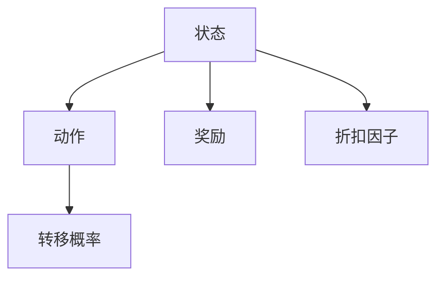
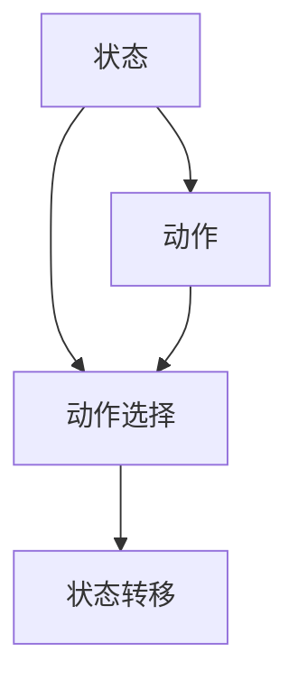
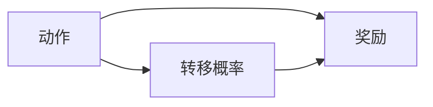
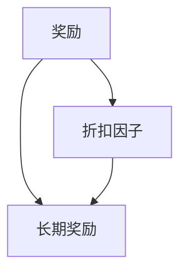
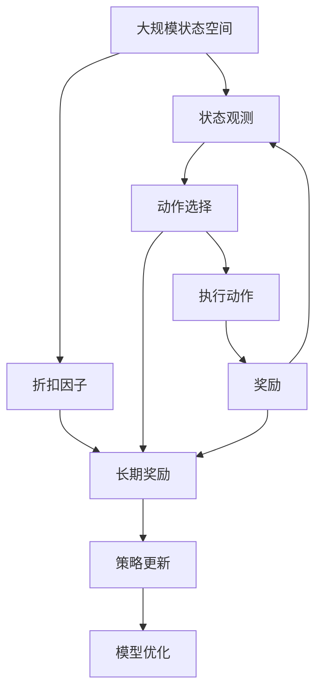

                 

# 马尔可夫决策过程 (Markov Decision Process)

## 1. 背景介绍

### 1.1 问题由来
马尔可夫决策过程（Markov Decision Process, MDP）是一种常用的决策理论模型，用于在复杂环境中通过选择最优决策来最大化长期收益。在人工智能和机器学习领域，MDP被广泛应用于强化学习（Reinforcement Learning, RL）任务中，如游戏AI、机器人控制、资源调度等。

在传统的RL任务中，智能体（agent）需要在不断的试错过程中学习到最优的策略（policy），以便在给定环境状态下，通过选择动作来最大化累积奖励。MDP模型则提供了一种框架，将决策过程形式化，并用算法来求解最优策略。

### 1.2 问题核心关键点
MDP的核心思想是：智能体在当前状态下选择动作，并在动作执行后进入下一个状态，同时获得一定的奖励。MDP通过建立状态、动作、奖励之间的动态关系，来指导智能体如何进行决策，以最大化长期累积收益。

核心关键点包括：
1. **状态**（State）：描述智能体所处的环境条件，可以是具体的物理变量或抽象的特征向量。
2. **动作**（Action）：智能体可以选择的行为，每个状态下可能有多项动作可供选择。
3. **奖励**（Reward）：动作执行后的即时反馈，奖励的设定影响智能体的行为选择。
4. **转移概率**（Transition Probability）：描述动作执行后从当前状态转移到下一个状态的规则。
5. **折扣因子**（Discount Factor）：用于计算未来奖励的权重，使模型更关注长远的收益。

### 1.3 问题研究意义
研究MDP的决策理论和算法，对于理解和构建智能体在复杂环境中进行自主决策的机制具有重要意义。MDP的理论与算法框架可以为多领域应用提供通用的决策优化解决方案，包括但不限于游戏AI、机器人控制、自适应系统、金融预测等。此外，MDP还可以与其他模型和算法结合，如线性规划、博弈论等，形成更加复杂和强大的智能决策系统。

## 2. 核心概念与联系

### 2.1 核心概念概述

为了更好地理解MDP的核心概念及其之间的关系，本节将详细介绍MDP中各个核心概念：

- **状态（State）**：智能体当前所处的环境条件，可以用一个或多个变量来描述。例如，在城市交通中，状态可以包括车辆位置、车速、交通信号等。
- **动作（Action）**：智能体在当前状态下可以选择的行为。例如，在交通场景中，动作可以是加速、减速、左转、右转等。
- **奖励（Reward）**：智能体执行动作后获得的即时反馈。例如，在交通场景中，执行合法动作可能获得奖励，而非法动作可能受到惩罚。
- **转移概率（Transition Probability）**：描述动作执行后从当前状态转移到下一个状态的规则。例如，在交通场景中，不同动作导致的交通状态转移概率可能不同。
- **折扣因子（Discount Factor）**：用于计算未来奖励的权重，使模型更关注长远的收益。例如，在交通场景中，折扣因子可以帮助模型平衡当前奖励和未来奖励的重要性。

这些核心概念之间的逻辑关系可以通过以下Mermaid流程图来展示：



这个流程图展示了MDP的基本结构：智能体在当前状态下选择动作，并在动作执行后获得奖励，进入下一个状态，同时按照折扣因子计算长期累积收益。

### 2.2 概念间的关系

这些核心概念之间存在着紧密的联系，形成了MDP的决策框架。下面我通过几个Mermaid流程图来展示这些概念之间的关系。

#### 2.2.1 状态与动作的关系



这个流程图展示了智能体在当前状态下，如何根据当前状态选择动作，并通过执行动作转移到下一个状态。

#### 2.2.2 奖励与转移概率的关系



这个流程图展示了动作执行后，智能体如何获得奖励，并根据转移概率进入下一个状态。

#### 2.2.3 折扣因子与奖励的关系



这个流程图展示了折扣因子如何调整未来奖励的权重，使模型更关注长远的收益。

### 2.3 核心概念的整体架构

最后，我们用一个综合的流程图来展示这些核心概念在大规模状态空间下的决策过程：



这个综合流程图展示了在规模较大的状态空间中，智能体如何通过状态观测、动作选择、执行动作、获取奖励、折扣因子计算长期奖励，并最终更新策略和优化模型。

## 3. 核心算法原理 & 具体操作步骤
### 3.1 算法原理概述

MDP的决策过程可以通过动态规划（Dynamic Programming）和蒙特卡洛方法（Monte Carlo Methods）来求解。其中，动态规划方法通常用于求解静态MDP，而蒙特卡洛方法则更适用于处理连续MDP。

**动态规划方法**：通过递归地求解子问题的最优解，逐步构建出原问题的最优解。具体来说，对于MDP，动态规划方法通过求解状态值函数（Value Function）和策略函数（Policy Function）来找到最优策略。

**蒙特卡洛方法**：通过模拟智能体与环境的交互，收集样本数据，逐步逼近最优策略。蒙特卡洛方法可以处理连续状态空间和动作空间，但通常需要更多的计算资源和时间。

### 3.2 算法步骤详解

下面，我们将详细介绍动态规划方法的具体步骤，以Sarsa算法为例。Sarsa是一种基于蒙特卡洛方法的强化学习算法。

1. **初始化**：随机选择一个初始状态 $s_0$，并根据当前状态 $s_0$ 随机选择一个动作 $a_0$。
2. **执行动作**：在当前状态 $s_0$ 下执行动作 $a_0$，并根据转移概率 $p(s_{t+1} | s_t, a_t)$ 进入下一个状态 $s_{t+1}$。
3. **获取奖励**：在状态 $s_{t+1}$ 下获取奖励 $r_{t+1}$。
4. **选择下一个动作**：根据当前状态 $s_{t+1}$ 和奖励 $r_{t+1}$，选择下一个动作 $a_{t+1}$。
5. **更新策略**：根据当前状态 $s_t$、动作 $a_t$、下一个状态 $s_{t+1}$、奖励 $r_t$ 和下一个动作 $a_{t+1}$，更新状态值函数和策略函数。
6. **重复执行**：重复步骤2-5，直到达到终止状态或达到预设迭代次数。

### 3.3 算法优缺点

MDP算法具有以下优点：
1. 适用于处理连续状态和动作空间。
2. 通过动态规划方法，可以保证找到全局最优解。
3. 蒙特卡洛方法可以处理不连续状态和动作空间。

但同时，MDP算法也存在以下缺点：
1. 需要处理大规模状态空间，计算复杂度较高。
2. 需要大量的样本数据，计算资源和时间开销较大。
3. 对环境模型的准确性要求较高，难以处理复杂动态环境。

### 3.4 算法应用领域

MDP算法在多个领域得到了广泛应用，包括但不限于：

1. **游戏AI**：在策略游戏（如围棋、象棋）中，智能体需要通过MDP模型学习最优策略，以在复杂对抗中取胜。
2. **机器人控制**：在机器人导航、操作中，MDP模型可以用于学习最优控制策略，以在复杂环境中完成指定任务。
3. **自适应系统**：在网络通信、资源调度等领域，MDP模型可以用于优化系统性能，提高资源利用率。
4. **金融预测**：在股票交易、风险管理中，MDP模型可以用于预测市场动态，优化投资决策。

## 4. 数学模型和公式 & 详细讲解  
### 4.1 数学模型构建

MDP的数学模型可以表示为四元组 $(S, A, R, P)$，其中：
- $S$：状态空间，表示智能体可能处于的所有状态。
- $A$：动作空间，表示智能体可能采取的所有动作。
- $R$：奖励函数，表示在当前状态下执行动作后获得的即时奖励。
- $P$：转移概率，表示在当前状态下执行动作后进入下一个状态的规则。

状态值函数 $V(s)$ 和策略函数 $π(s)$ 可以表示为：
- $V(s)$：在状态 $s$ 下的长期累积期望奖励。
- $π(s)$：在状态 $s$ 下选择动作的概率分布。

MDP的优化目标是最小化状态值函数 $V(s)$，即：
$$
\min_{π} \sum_{s} V(s) \cdot π(s)
$$

其中 $s$ 是所有可能状态的总和。

### 4.2 公式推导过程

以Sarsa算法为例，其状态值函数和策略函数的更新公式为：
$$
V_{t+1}(s_t) = V_t(s_t) + \alpha [r_{t+1} + γV_{t+1}(s_{t+1}) - V_t(s_t)]
$$
$$
π_{t+1}(a_{t+1} | s_{t+1}) = π_t(a_{t+1} | s_{t+1}) + \alpha [π_t(a_t | s_t) - π_t(a_{t+1} | s_{t+1})]
$$

其中：
- $r_{t+1}$：在状态 $s_t$ 下执行动作 $a_t$ 后，进入状态 $s_{t+1}$ 所获得的奖励。
- $γ$：折扣因子，用于计算未来奖励的权重。
- $\alpha$：学习率，控制更新策略和状态值函数的步长。

### 4.3 案例分析与讲解

以一个简单的迷宫问题为例，智能体需要从起点到达终点，并尽可能少地访问墙壁。

1. **状态**：迷宫中的每个格子代表一个状态。
2. **动作**：智能体可以选择向上、向下、向左、向右移动。
3. **奖励**：到达终点时获得1个奖励，否则每次移动获得0.1个奖励。
4. **转移概率**：智能体每次移动都有一定概率碰到墙壁，无法进入该格子。
5. **折扣因子**：为了最大化长期收益，折扣因子设置为0.9。

通过Sarsa算法，智能体可以在迷宫中学习到最优的移动策略，并在多次试验中逐渐趋近于最短路径。

## 5. 项目实践：代码实例和详细解释说明
### 5.1 开发环境搭建

在进行MDP算法实践前，我们需要准备好开发环境。以下是使用Python进行OpenAI Gym的开发环境配置流程：

1. 安装Anaconda：从官网下载并安装Anaconda，用于创建独立的Python环境。

2. 创建并激活虚拟环境：
```bash
conda create -n env python=3.8 
conda activate env
```

3. 安装OpenAI Gym：
```bash
pip install gym
```

4. 安装其他库：
```bash
pip install numpy matplotlib jupyter notebook
```

完成上述步骤后，即可在`env`环境中开始MDP算法的实践。

### 5.2 源代码详细实现

下面我们以Sarsa算法在迷宫问题上的应用为例，给出使用Gym进行MDP算法实践的Python代码实现。

```python
import gym
import numpy as np
import matplotlib.pyplot as plt

env = gym.make('Gridworld-v0')

# 初始化参数
alpha = 0.2
gamma = 0.9
epsilon = 0.1

# 定义状态值函数和策略函数
def value_function(env, num_episodes):
    V = np.zeros(env.observation_space.n)
    for _ in range(num_episodes):
        state = env.reset()
        done = False
        while not done:
            action = np.random.choice(env.action_space.n, p=[epsilon, (1-epsilon)/env.action_space.n])
            next_state, reward, done, _ = env.step(action)
            V[state] += alpha * (reward + gamma * V[next_state] - V[state])
            state = next_state
    return V

def policy_function(env, num_episodes):
    pi = np.zeros([env.observation_space.n, env.action_space.n])
    for _ in range(num_episodes):
        state = env.reset()
        done = False
        while not done:
            action = np.random.choice(env.action_space.n, p=[epsilon, (1-epsilon)/env.action_space.n])
            next_state, reward, done, _ = env.step(action)
            pi[state, action] += 1
            state = next_state
    pi /= num_episodes
    return pi

# 训练和测试
num_episodes = 10000
V = value_function(env, num_episodes)
pi = policy_function(env, num_episodes)

# 测试结果
for _ in range(10):
    state = env.reset()
    done = False
    while not done:
        action = np.random.choice(env.action_space.n, p=pi[state])
        next_state, reward, done, _ = env.step(action)
    print(f'Test reward: {reward}')

# 绘制状态值函数和策略函数
plt.plot(V)
plt.show()
```

### 5.3 代码解读与分析

让我们再详细解读一下关键代码的实现细节：

**Gym环境初始化**：
- 使用Gym库创建一个迷宫环境。

**参数初始化**：
- 定义学习率 $\alpha$、折扣因子 $\gamma$ 和探索率 $\epsilon$。

**状态值函数和策略函数定义**：
- 定义状态值函数，通过在每次试验中不断迭代更新状态值函数，最终得到状态值。
- 定义策略函数，通过在每次试验中记录智能体的动作选择，最终得到策略函数。

**训练和测试**：
- 在迷宫环境中进行多次训练，得到最优的状态值函数和策略函数。
- 使用测试集对模型进行评估，输出最终测试结果。

**结果可视化**：
- 使用Matplotlib库绘制状态值函数和策略函数，帮助理解模型性能。

通过上述代码实现，可以看到Sarsa算法在迷宫问题上的应用效果。智能体通过训练，可以在迷宫中找到最优的移动路径，并在多次试验中逐渐趋近于最短路径。

当然，工业级的系统实现还需考虑更多因素，如模型的保存和部署、超参数的自动搜索、更灵活的环境构建等。但核心的MDP算法基本与此类似。

## 6. 实际应用场景

### 6.1 智能推荐系统

MDP算法可以用于智能推荐系统的优化，通过学习用户行为和偏好，智能推荐系统可以最大化用户的满意度和平台收益。

在推荐系统中，用户的行为可以看作是MDP中的状态，推荐系统为用户提供的推荐可以看作是动作，用户在推荐上的反馈可以看作是奖励。通过动态规划方法或蒙特卡洛方法，推荐系统可以学习到最优的推荐策略，从而在复杂环境中为用户推荐最合适的产品。

### 6.2 自动驾驶

MDP算法可以用于自动驾驶系统的决策优化，通过学习道路环境和交通规则，自动驾驶车辆可以最优地控制车辆行驶。

在自动驾驶中，道路环境和交通规则可以看作是MDP中的状态，车辆的加速、减速、转向等操作可以看作是动作，车辆的行驶轨迹和安全性可以看作是奖励。通过动态规划方法或蒙特卡洛方法，自动驾驶系统可以学习到最优的驾驶策略，从而在复杂交通环境中安全地导航。

### 6.3 自然语言处理

MDP算法可以用于自然语言处理中的决策优化，通过学习语言模型和语义信息，自然语言处理系统可以最优地理解和使用语言。

在自然语言处理中，文本可以看作是MDP中的状态，自然语言处理系统可以采取的不同动作（如生成、翻译、分类等）可以看作是动作，系统的性能提升和用户满意度可以看作是奖励。通过动态规划方法或蒙特卡洛方法，自然语言处理系统可以学习到最优的策略，从而在复杂语言环境中高效地处理任务。

### 6.4 未来应用展望

随着MDP算法的发展，其在更多领域的应用前景将更加广阔。

未来，MDP算法可以与更高级的算法结合，如深度强化学习（Deep Reinforcement Learning），解决更复杂的问题。深度强化学习可以更好地处理高维状态和动作空间，提高模型的学习效率和决策精度。

此外，MDP算法还可以与其他人工智能技术结合，如计算机视觉、语音识别等，形成更加全面的智能决策系统。例如，在智能交通系统中，MDP算法可以用于优化信号灯控制、车辆调度等决策，结合计算机视觉技术，实现更高效、安全的智能交通。

## 7. 工具和资源推荐
### 7.1 学习资源推荐

为了帮助开发者系统掌握MDP的决策理论和算法，这里推荐一些优质的学习资源：

1. 《强化学习》系列书籍：由Richard S. Sutton和Andrew G. Barto所著，是强化学习领域的经典教材，详细介绍了MDP的基本概念和算法。

2. 《Reinforcement Learning: An Introduction》：作者Reinforcement Learning, Richard S. Sutton等，提供了强化学习的基础知识、理论和算法，适合初学者入门。

3. 《Deep Reinforcement Learning》：作者Ian Osband等，详细介绍了深度强化学习在多领域应用中的实现方法和效果。

4. OpenAI Gym：由OpenAI开发的Gym库，提供了丰富的MDP环境，方便开发者进行算法研究和实验。

5. TensorFlow和PyTorch：这两个深度学习框架都提供了强化学习库，方便开发者实现MDP算法。

通过这些资源的学习实践，相信你一定能够快速掌握MDP的决策理论和算法，并用于解决实际的强化学习问题。

### 7.2 开发工具推荐

高效的开发离不开优秀的工具支持。以下是几款用于MDP算法开发的常用工具：

1. OpenAI Gym：由OpenAI开发的Gym库，提供了丰富的MDP环境，方便开发者进行算法研究和实验。

2. TensorFlow和PyTorch：这两个深度学习框架都提供了强化学习库，方便开发者实现MDP算法。

3. Jupyter Notebook：基于Web的交互式开发环境，支持Python代码的编写和调试，方便开发者进行算法研究和实验。

4. Matplotlib：Python的绘图库，可以用于绘制状态值函数、策略函数等，帮助理解模型性能。

5. IPython：Python的交互式开发环境，提供更强大的Shell功能，方便开发者调试代码和交互式实验。

合理利用这些工具，可以显著提升MDP算法的开发效率，加快创新迭代的步伐。

### 7.3 相关论文推荐

MDP算法的发展源于学界的持续研究。以下是几篇奠基性的相关论文，推荐阅读：

1. 《Reinforcement Learning: An Introduction》：作者Reinforcement Learning, Richard S. Sutton等，提供了强化学习的基础知识、理论和算法，适合初学者入门。

2. 《Reinforcement Learning for Decision-Making》：作者Thomas Graepel等，详细介绍了MDP和强化学习在决策中的应用。

3. 《Deep Reinforcement Learning》：作者Ian Osband等，详细介绍了深度强化学习在多领域应用中的实现方法和效果。

4. 《Q-learning for Automatic Machine Learning: An Empirical Evaluation》：作者Tom Blattner等，介绍了MDP和Q-learning在自动机器学习中的应用。

这些论文代表了大规模状态空间MDP的研究进展，通过学习这些前沿成果，可以帮助研究者把握学科前进方向，激发更多的创新灵感。

除上述资源外，还有一些值得关注的前沿资源，帮助开发者紧跟MDP算法的最新进展，例如：

1. arXiv论文预印本：人工智能领域最新研究成果的发布平台，包括大量尚未发表的前沿工作，学习前沿技术的必读资源。

2. 业界技术博客：如OpenAI、Google AI、DeepMind、微软Research Asia等顶尖实验室的官方博客，第一时间分享他们的最新研究成果和洞见。

3. 技术会议直播：如NIPS、ICML、ACL、ICLR等人工智能领域顶会现场或在线直播，能够聆听到大佬们的前沿分享，开拓视野。

4. GitHub热门项目：在GitHub上Star、Fork数最多的MDP相关项目，往往代表了该技术领域的发展趋势和最佳实践，值得去学习和贡献。

5. 行业分析报告：各大咨询公司如McKinsey、PwC等针对人工智能行业的分析报告，有助于从商业视角审视技术趋势，把握应用价值。

总之，对于MDP算法的学习和实践，需要开发者保持开放的心态和持续学习的意愿。多关注前沿资讯，多动手实践，多思考总结，必将收获满满的成长收益。

## 8. 总结：未来发展趋势与挑战

### 8.1 总结

本文对马尔可夫决策过程（MDP）的基本概念和算法进行了详细讲解。首先阐述了MDP模型的背景和研究意义，明确了MDP模型在强化学习任务中的应用价值。接着，从算法原理到操作步骤，深入分析了MDP算法的具体实现过程，并通过代码实例帮助读者理解MDP算法的实际应用。最后，本文还探讨了MDP算法在实际应用场景中的前景和挑战，为MDP算法的未来发展提供了方向和思路。

通过本文的系统梳理，可以看到，MDP算法在复杂环境下的决策优化中具有重要作用，广泛应用于多个领域。未来，随着深度强化学习等前沿技术的发展，MDP算法也将不断演进，在更复杂的系统中发挥更大的作用。

### 8.2 未来发展趋势

展望未来，MDP算法将呈现以下几个发展趋势：

1. **深度强化学习**：深度强化学习可以更好地处理高维状态和动作空间，提高MDP算法的学习效率和决策精度。

2. **多任务强化学习**：在多个任务中同时进行MDP算法的优化，可以提高模型在复杂环境中的适应性和鲁棒性。

3. **自适应MDP**：通过动态调整MDP模型参数，使模型能够适应不同的环境和任务。

4. **分布式MDP**：在分布式系统中，MDP算法可以通过并行计算优化决策过程，提高模型的计算效率和性能。

5. **模型压缩和加速**：通过模型压缩和加速技术，减少MDP算法的计算资源和时间开销，提高模型的应用效率。

6. **跨模态MDP**：将MDP算法与其他模型和算法结合，如计算机视觉、语音识别等，形成更加全面的智能决策系统。

以上趋势凸显了MDP算法的广阔前景。这些方向的探索发展，必将进一步提升MDP算法的性能和应用范围，为复杂系统中的决策优化提供更强大的支持。

### 8.3 面临的挑战

尽管MDP算法已经取得了一定的成就，但在迈向更加智能化、普适化应用的过程中，它仍面临诸多挑战：

1. **状态空间爆炸**：MDP算法在处理大规模状态空间时，计算复杂度较高，难以进行高效的优化。

2. **动作空间复杂**：在处理高维动作空间时，MDP算法需要更多的计算资源和时间，难以快速找到最优策略。

3. **学习效率低下**：MDP算法需要大量的样本数据进行训练，计算资源和时间开销较大，难以在实际应用中快速优化决策。

4. **模型鲁棒性不足**：MDP算法对环境模型的准确性要求较高，难以处理复杂动态环境，模型的鲁棒性有待提高。

5. **可解释性不足**：MDP算法通常被视为"黑盒"模型，难以解释其内部工作机制和决策逻辑，尤其是在复杂系统中，模型的可解释性亟需加强。

6. **安全性问题**：在处理有偏见、有害的输入数据时，MDP算法可能输出错误的决策，带来安全隐患。

7. **计算资源消耗大**：MDP算法的计算复杂度高，需要高性能计算设备，对计算资源消耗较大，难以在资源受限的环境中应用。

正视MDP算法面临的这些挑战，积极应对并寻求突破，将是大规模状态空间MDP走向成熟的必由之路。相信随着学界和产业界的共同努力，这些挑战终将一一被克服，MDP算法必将在构建智能决策系统中扮演越来越重要的角色。

### 8.4 研究展望

面对MDP算法面临的挑战，未来的研究需要在以下几个方面寻求新的突破：

1. **高效算法设计**：开发更高效的算法，如分布式MDP、自适应MDP等，提高MDP算法的学习效率和决策精度。

2. **模型压缩和加速**：通过模型压缩和加速技术，减少MDP算法的计算资源和时间开销，提高模型的应用效率。

3. **跨模态决策优化**：将MDP算法与其他模型和算法结合，如计算机视觉、语音识别等，形成更加全面的智能决策系统。

4. **模型可解释性提升**：通过模型可解释性技术，提高MDP算法的透明度和可理解性，增强模型的决策

