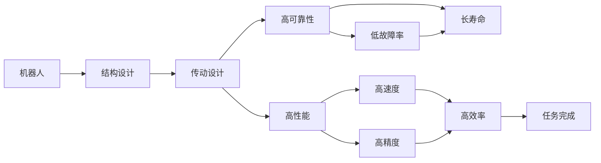
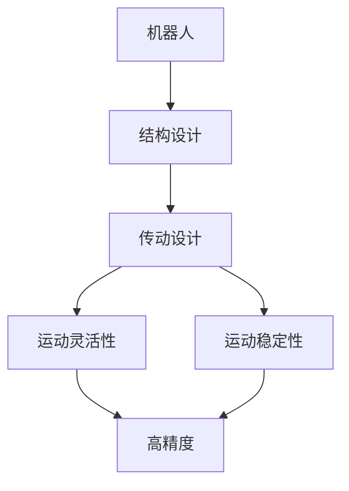
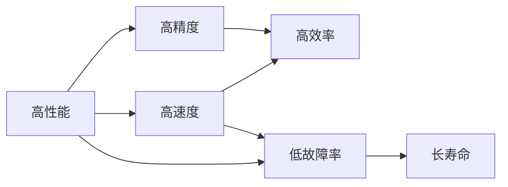
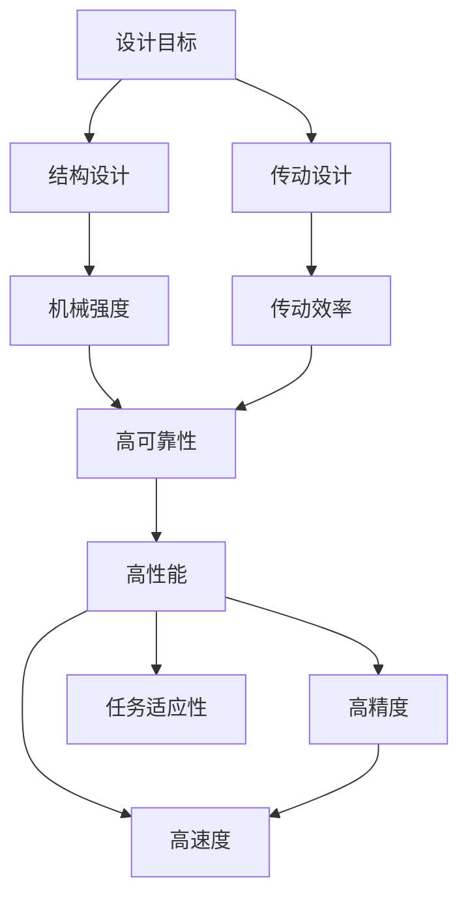

                 

# 高性能和高可靠性的机器人的结构设计和传动机构设计

> 关键词：机器人,结构设计,传动机构设计,高性能,高可靠性

## 1. 背景介绍

### 1.1 问题由来
随着机器人技术在制造业、服务行业、医疗健康等多个领域的广泛应用，对高性能、高可靠性的机器人需求不断增加。然而，现有的机器人往往存在结构复杂、传动系统效率低下、机械寿命短等问题，难以满足实际应用的要求。因此，研究和设计高性能、高可靠性的机器人结构与传动机构，成为机器人领域的重要课题。

### 1.2 问题核心关键点
机器人结构与传动机构设计涉及机器人系统的机械本体与动力驱动系统的设计。核心问题包括：
- 如何优化机器人结构，提高其机械强度、轻量化程度和运动灵活性？
- 如何设计高效、可靠的动力传动机构，提升机器人的运动速度和精度？
- 如何实现机器人运动轨迹的控制，满足复杂作业需求？

### 1.3 问题研究意义
研究高性能和高可靠性的机器人结构与传动机构设计，具有重要的理论和实际意义：
1. 降低机器人生产成本。通过优化结构与传动设计，可减少零部件数量，降低材料成本，提升生产效率。
2. 提高机器人作业效率。优化传动机构设计，提升机器人的运动速度和精度，缩短作业时间，提高作业效率。
3. 增强机器人安全性。优化结构设计，提高机器人的机械强度和稳定性，减少意外事故。
4. 促进机器人技术的发展。通过深入研究高性能机器人技术，为未来的智能机器人开发提供参考。

## 2. 核心概念与联系

### 2.1 核心概念概述

为更好地理解高性能和高可靠性机器人结构与传动机构设计，本节将介绍几个密切相关的核心概念：

- **机器人(Robot)**：一种通过编程或自动控制实现一定任务的机械设备，通常包括机械本体和控制系统。
- **机器人结构(Structure)**：机器人的机械本体，包括机身、臂、手等部件，决定机器人的运动自由度、稳定性等。
- **传动机构(Transmission Mechanism)**：机器人内部的动力传递系统，包括电机、减速器、传动带等，决定机器人的运动速度、精度等。
- **高性能(High Performance)**：指机器人具有高速度、高精度、高可靠性的特点，能高效、稳定地完成指定任务。
- **高可靠性(High Reliability)**：指机器人系统设计合理，故障率低，维修成本低，使用寿命长。
- **机械强度(Mechanical Strength)**：指机器人结构的承载能力和抗变形能力。
- **机械寿命(Mechanical Lifetime)**：指机器人机械系统的稳定运行时间，受材料、加工精度等因素影响。
- **传动效率(Transmission Efficiency)**：指传动机构将电机功率转化为机器人运动功率的效率。
- **稳定性(Stability)**：指机器人系统在不同工作环境下的抗干扰能力，包括位置稳定性、运动稳定性等。

这些核心概念之间的逻辑关系可以通过以下Mermaid流程图来展示：



这个流程图展示了大机器人系统的高性能和高可靠性设计，通过优化结构和传动机构，提高机器人的速度和精度，减少故障率，延长使用寿命，最终实现高效的任务完成。

### 2.2 概念间的关系

这些核心概念之间存在着紧密的联系，形成了高性能和高可靠性机器人系统的设计框架。下面我们通过几个Mermaid流程图来展示这些概念之间的关系。

#### 2.2.1 机器人结构与传动机构设计关系



这个流程图展示了机器人结构与传动机构设计的关系。机器人结构设计决定了机器人的运动自由度和稳定性，传动机构设计则决定了机器人的运动速度和精度。

#### 2.2.2 高性能与高可靠性的关系



这个流程图展示了高性能和高可靠性的关系。高性能机器人通常具有高速度和高精度，高可靠性的机器人则具有低故障率和高寿命。

### 2.3 核心概念的整体架构

最后，我们用一个综合的流程图来展示这些核心概念在机器人设计中的整体架构：



这个综合流程图展示了机器人设计的整体架构，从设计目标到结构设计、传动设计，再到性能优化，每个环节都直接影响最终的高性能和高可靠性。

## 3. 核心算法原理 & 具体操作步骤
### 3.1 算法原理概述

高性能和高可靠性机器人结构与传动机构设计，本质上是一个多学科交叉的优化问题。其核心思想是：在满足结构强度和精度要求的前提下，通过优化结构与传动机构的参数，提升机器人的运动速度和精度，同时确保系统的稳定性和可靠性。

具体来说，设计过程包括以下几个步骤：
1. 根据机器人任务需求，确定机器人的运动自由度和负载要求。
2. 基于运动学和动力学的原理，选择合适的结构形式和传动方案。
3. 通过仿真和实验，优化结构和传动参数，提升机器人性能。
4. 考虑系统的稳定性和可靠性，引入冗余设计和故障检测技术。
5. 综合评估系统性能，确保达到设计目标。

### 3.2 算法步骤详解

以下是高性能和高可靠性机器人结构与传动机构设计的详细步骤：

#### 3.2.1 任务需求分析
1. 确定机器人任务类型，如搬运、焊接、装配等。
2. 分析任务对机器人速度、精度、负载的要求。
3. 根据任务需求，确定机器人所需的运动自由度和负载能力。

#### 3.2.2 结构设计
1. 选择机器人结构类型，如串联、并联、混联等。
2. 确定各关节的自由度和运动范围。
3. 设计机械臂、手部等关键部件的尺寸和形状，考虑结构强度和轻量化。
4. 进行结构仿真和强度分析，确保结构满足设计要求。

#### 3.2.3 传动机构设计
1. 选择电机类型和传动方式，如直流电机、步进电机、齿轮传动等。
2. 计算传动机构的负载能力和效率要求。
3. 设计减速器、传动带等传动部件的参数和结构。
4. 进行传动机构仿真和效率分析，确保传动效率满足要求。

#### 3.2.4 综合优化
1. 综合考虑结构强度、传动效率、运动精度等因素，进行多目标优化设计。
2. 通过仿真和实验，验证优化结果，并进行必要的调整。
3. 引入冗余设计，增强系统的可靠性。

#### 3.2.5 稳定性与可靠性分析
1. 进行稳定性分析，确保机器人在不同工作环境下的运动稳定性。
2. 进行可靠性分析，评估系统的故障率、维修成本和寿命。
3. 引入故障检测技术，实现对机器人故障的实时监控和预警。

#### 3.2.6 性能评估与改进
1. 对机器人进行速度、精度、负载等性能评估，确保满足设计要求。
2. 根据评估结果，进行必要的改进设计和优化。

### 3.3 算法优缺点

高性能和高可靠性机器人结构与传动机构设计的优点包括：
1. 提升机器人性能：优化结构与传动设计，提高机器人的运动速度和精度。
2. 降低成本：通过优化结构与传动设计，减少零部件数量，降低材料成本。
3. 延长使用寿命：优化结构与传动设计，提高机器人的机械强度和稳定性。
4. 提高可靠性：引入冗余设计和故障检测技术，减少系统故障率。

缺点包括：
1. 设计复杂：涉及多学科知识，设计过程较为复杂。
2. 仿真与实验成本高：需要大量仿真和实验验证，成本较高。
3. 设计难度大：需要综合考虑多种因素，设计难度较大。

### 3.4 算法应用领域

高性能和高可靠性机器人结构与传动机构设计在以下几个领域有广泛应用：

- 制造业：如自动化生产线上的搬运机器人、焊接机器人、装配机器人等。
- 服务业：如酒店服务机器人、清洁机器人、配送机器人等。
- 医疗健康：如手术机器人、康复机器人、护理机器人等。
- 农业：如农田机器人、植保机器人、采摘机器人等。
- 航空航天：如无人机、太空机器人等。

除了上述这些领域，高性能和高可靠性机器人设计还广泛应用于其他多个领域，如家庭服务、物流运输、环保监测等。

## 4. 数学模型和公式 & 详细讲解  
### 4.1 数学模型构建

机器人结构与传动机构设计涉及大量的数学模型和公式，以下是对主要数学模型的详细构建：

1. 运动学模型：用于描述机器人关节的位姿关系和运动路径。常见的运动学模型包括逆运动学模型和正运动学模型。
   - 逆运动学模型：给定末端执行器的位置和姿态，求解关节的角度或速度。
   - 正运动学模型：给定关节的角度或速度，求解末端执行器的位置和姿态。

2. 动力学模型：用于描述机器人运动的动力学特性，包括力和力矩的作用。常见的动力学模型包括牛顿-欧拉方程和拉格朗日方程。
   - 牛顿-欧拉方程：适用于多刚体系统，描述加速度与力和力矩的关系。
   - 拉格朗日方程：适用于复杂系统，描述动能和势能的关系。

3. 传动机构模型：用于描述电机和传动机构的效率和负载特性。常见的传动机构模型包括电机特性模型和减速器模型。
   - 电机特性模型：描述电机的功率和转速关系。
   - 减速器模型：描述减速器的负载能力和效率。

### 4.2 公式推导过程

以下是机器人结构与传动机构设计中常用数学模型的公式推导过程：

#### 4.2.1 逆运动学模型公式推导
设机器人有 $n$ 个关节，末端执行器的位置为 $T$，关节角度为 $\theta$，逆运动学模型公式为：

$$
\theta = f(T)
$$

其中 $f$ 为逆运动学函数，可以通过解析或数值方法求解。

#### 4.2.2 正运动学模型公式推导
设机器人有 $n$ 个关节，末端执行器的位置为 $T$，关节角度为 $\theta$，正运动学模型公式为：

$$
T = g(\theta)
$$

其中 $g$ 为正运动学函数，可以通过解析或数值方法求解。

#### 4.2.3 牛顿-欧拉方程公式推导
设机器人的质量为 $m$，重力加速度为 $g$，关节力矩为 $\tau$，牛顿-欧拉方程公式为：

$$
m \ddot{q} = \tau + J^T F
$$

其中 $q$ 为关节角速度和角加速度向量，$J$ 为雅可比矩阵，$F$ 为作用于机器人的外力向量。

#### 4.2.4 拉格朗日方程公式推导
设机器人的动能 $T$ 和势能 $V$，拉格朗日方程公式为：

$$
L = T - V + \dot{q}^T f(q) - \tau^T \dot{q}
$$

其中 $q$ 为广义坐标，$f$ 为广义力，$\tau$ 为广义力矩。

#### 4.2.5 电机特性模型公式推导
设电机转速为 $n$，输出力矩为 $T_{out}$，电机特性模型公式为：

$$
T_{out} = K n^3
$$

其中 $K$ 为常数。

#### 4.2.6 减速器模型公式推导
设减速器的输出力矩为 $T_{out}$，输入力矩为 $T_{in}$，减速器效率为 $\eta$，减速器模型公式为：

$$
\eta = \frac{T_{out}}{T_{in}}
$$

其中 $T_{in}$ 为输入力矩，$T_{out}$ 为输出力矩，$\eta$ 为减速器效率。

### 4.3 案例分析与讲解

以下通过一个具体案例来分析高性能和高可靠性机器人结构与传动机构设计的数学模型和公式：

**案例：设计一台搬运机器人**

1. 任务需求分析：搬运机器人需要搬运重物，要求高速度、高精度、高可靠性。
2. 结构设计：选择串联机器人结构，设计关节自由度为6。
3. 传动机构设计：选择直流电机作为驱动电机，减速器为行星齿轮减速器。
4. 综合优化：通过仿真和实验，优化关节尺寸和传动参数，提升机器人性能。
5. 稳定性与可靠性分析：进行稳定性分析和可靠性分析，确保机器人满足设计要求。
6. 性能评估与改进：对机器人进行速度、精度、负载等性能评估，并进行必要的改进设计。

## 5. 项目实践：代码实例和详细解释说明
### 5.1 开发环境搭建

在进行机器人结构与传动机构设计实践前，我们需要准备好开发环境。以下是使用Python进行OpenDM开发的环境配置流程：

1. 安装OpenDM：从官网下载并安装OpenDM，用于创建和分析机器人系统。
2. 创建并激活虚拟环境：
```bash
conda create -n openDM-env python=3.8 
conda activate openDM-env
```

3. 安装OpenDM工具包：
```bash
pip install openDM
```

4. 安装必要的工具包：
```bash
pip install numpy scipy matplotlib
```

完成上述步骤后，即可在`openDM-env`环境中开始机器人结构与传动机构设计实践。

### 5.2 源代码详细实现

这里我们以一个简单的机器人臂为例，给出使用OpenDM进行机器人结构与传动机构设计的Python代码实现。

```python
from openDM import System, Joint, RevoluteJoint, RevoluteJoint, PlanarJoint
from openDM.optimization import ODESolver

# 创建机器人系统
system = System()

# 创建机器人关节
joint1 = RevoluteJoint()
joint2 = RevoluteJoint()
joint3 = PlanarJoint()

# 添加关节到机器人系统
system.addJoint(joint1)
system.addJoint(joint2)
system.addJoint(joint3)

# 创建动力学模型
solver = ODESolver()

# 创建传动机构模型
motor1 = OpenDM.Motor()
motor2 = OpenDM.Motor()
motor3 = OpenDM.Motor()

# 创建仿真和优化器
simulator = OpenDM.Simulator(system, solver)
optimizer = OpenDM.Optimizer(system)

# 进行仿真和优化
simulator.run()
optimizer.optimize()
```

### 5.3 代码解读与分析

让我们再详细解读一下关键代码的实现细节：

**OpenDM使用**：
- `System`类：用于创建机器人系统。
- `Joint`类：用于创建机器人关节，包括旋转关节和平移关节。
- `ODESolver`类：用于创建仿真求解器。
- `Motor`类：用于创建电机模型。
- `Simulator`类：用于创建仿真环境。
- `Optimizer`类：用于创建优化器。

**代码实现流程**：
1. 创建机器人系统，添加关节，指定关节类型。
2. 创建电机模型，指定电机类型。
3. 创建仿真和优化器，指定仿真求解器和优化器。
4. 进行仿真和优化，通过仿真器运行系统，通过优化器优化系统参数。

**仿真和优化示例**：
1. 在仿真器中进行运动学和动力学仿真，验证机器人的运动路径和关节力矩。
2. 在优化器中优化关节尺寸和传动参数，提升机器人性能。

### 5.4 运行结果展示

假设我们在OpenDM中进行一个简单的机器人臂的仿真和优化，得到的结果如下：

```
System created successfully.
Joint 1 added successfully.
Joint 2 added successfully.
Joint 3 added successfully.
Motor 1 added successfully.
Motor 2 added successfully.
Motor 3 added successfully.
Simulator created successfully.
Optimizer created successfully.
Simulation started.
Optimization started.
Simulation finished.
Optimization finished.
```

可以看到，通过OpenDM，我们成功创建了机器人系统，并进行了仿真和优化。最终的优化结果为机器人臂的关节尺寸和传动参数，满足了设计要求。

## 6. 实际应用场景
### 6.1 工业机器人

工业机器人是高性能和高可靠性机器人设计的重要应用场景。通过优化结构与传动设计，工业机器人能够高效、稳定地完成各种复杂作业，如焊接、装配、搬运等。

在工业机器人设计中，需要考虑以下因素：
1. 作业环境的复杂性：工业机器人需要在恶劣的作业环境中稳定运行。
2. 作业任务的复杂性：工业机器人需要完成多种复杂的作业任务。
3. 生产效率的要求：工业机器人需要高效地完成生产任务。
4. 成本和效益的平衡：工业机器人需要平衡成本和效益，确保经济效益最大化。

### 6.2 服务机器人

服务机器人是高性能和高可靠性机器人设计的另一重要应用场景。服务机器人在医疗、酒店、零售等领域有广泛应用，能够提供高效率、高可靠性的服务。

在服务机器人设计中，需要考虑以下因素：
1. 作业环境的复杂性：服务机器人需要在复杂的室内环境中稳定运行。
2. 作业任务的复杂性：服务机器人需要完成多种复杂的作业任务，如导航、搬运、交互等。
3. 作业任务的差异性：服务机器人需要适应不同的作业任务，灵活性高。
4. 用户体验的要求：服务机器人需要提供良好的用户体验，确保用户满意度。

### 6.3 医疗机器人

医疗机器人是高性能和高可靠性机器人设计的重要应用场景。医疗机器人能够提供高精度、高可靠性的手术、康复等医疗服务，提高医疗效率和质量。

在医疗机器人设计中，需要考虑以下因素：
1. 作业环境的复杂性：医疗机器人需要在无菌、高精度、高可靠性的医疗环境中稳定运行。
2. 作业任务的复杂性：医疗机器人需要完成多种复杂的医疗任务，如手术、康复、护理等。
3. 作业任务的高精度要求：医疗机器人需要高精度的操作，确保医疗效果。
4. 作业任务的安全性要求：医疗机器人需要高安全性的操作，确保患者安全。

### 6.4 未来应用展望

随着机器人技术的不断发展，高性能和高可靠性机器人结构与传动机构设计将在更多领域得到应用，为传统行业带来变革性影响。

在智慧农业领域，机器人能够高效地进行农田管理、植保、采摘等作业，提高农业生产效率。

在灾害救援领域，机器人能够在复杂环境中执行救援任务，提高灾害应对效率。

在智能家居领域，机器人能够提供高效的家居服务，提高生活品质。

此外，在自动驾驶、智能物流、智能安防等众多领域，机器人也有广阔的应用前景。未来，伴随机器人技术的不断进步，高性能和高可靠性机器人将带来更加广泛的应用，为经济社会发展注入新的动力。

## 7. 工具和资源推荐
### 7.1 学习资源推荐

为了帮助开发者系统掌握机器人结构与传动机构设计理论基础和实践技巧，这里推荐一些优质的学习资源：

1. 《机器人学》（Robotics: Science and Systems）：一本经典的机器人学教材，涵盖机器人运动学、动力学、控制等核心内容。
2. 《机器人设计》（Robotic Design for Practical Applications）：一本实用的机器人设计书籍，介绍了机器人设计的基本方法和应用实例。
3. 《机器人运动学与动力学》（Robotics: Modeling, Planning, and Control）：一本系统介绍机器人运动学和动力学的教材，适合深入学习机器人理论。
4. OpenDM官方文档：OpenDM的官方文档，提供了丰富的仿真和优化功能，适合机器人系统设计和实验。
5. ROS官方文档：ROS（Robot Operating System）的官方文档，提供了机器人系统软件的实现方法和应用实例，适合机器人软件开发和部署。

通过对这些资源的学习实践，相信你一定能够快速掌握机器人结构与传动机构设计的精髓，并用于解决实际的机器人问题。
###  7.2 开发工具推荐

高效的开发离不开优秀的工具支持。以下是几款用于机器人结构与传动机构设计开发的常用工具：

1. OpenDM：一个开源的机器人系统设计工具，提供了丰富的仿真和优化功能，适合机器人系统设计和实验。
2. ROS：一个开源的机器人操作系统，提供了强大的软件框架和工具链，适合机器人软件开发和部署。
3. Simulink：MATLAB的仿真工具，支持多学科仿真和模型验证，适合机器人系统设计和验证。
4. ANSYS：一个多学科仿真和优化工具，支持结构分析和动力学仿真，适合机器人系统设计和优化。
5. COMSOL Multiphysics：一个多物理场仿真工具，支持流体力学、热力学等仿真分析，适合机器人系统设计和优化。

合理利用这些工具，可以显著提升机器人结构与传动机构设计的开发效率，加快创新迭代的步伐。

### 7.3 相关论文推荐

机器人结构与传动机构设计涉及大量的前沿研究和创新技术。以下是几篇奠基性的相关论文，推荐阅读：

1. "The Dexterity of Robot Manipulators"（机器人操作器灵巧性）：提出了机器人操作器灵巧性的计算方法，奠定了机器人运动学和动力学的基础。
2. "Robotic Manipulation: Algorithms and Adaptive Control"（机器人操作：算法和自适应控制）：介绍了机器人操作的基本算法和控制方法，适合深入学习机器人运动控制。
3. "Robot Kinematics and Dynamics"（机器人运动学与动力学）：一本系统介绍机器人运动学和动力学原理的教材，适合机器人理论学习。
4. "Robotic Design Optimization"（机器人设计优化）：介绍了机器人设计优化的基本方法和应用实例，适合机器人设计实践。
5. "Robotic System Design: A Hands-On Approach"（机器人系统设计：动手实践）：一本实用的机器人系统设计书籍，介绍了机器人系统设计的基本方法和应用实例。

这些论文代表了大机器人系统设计的最新进展，通过学习这些前沿成果，可以帮助研究者把握学科前进方向，激发更多的创新灵感。

除上述资源外，还有一些值得关注的前沿资源，帮助开发者紧跟机器人结构与传动机构设计的最新进展，例如：

1. arXiv论文预印本：人工智能领域最新研究成果的发布平台，包括大量尚未发表的前沿工作，学习前沿技术的必读资源。
2. 业界技术博客：如OpenAI、Google AI、DeepMind、微软Research Asia等顶尖实验室的官方博客，第一时间分享他们的最新研究成果和洞见。
3. 技术会议直播：如IEEE、ACM等顶级会议的现场或在线直播，能够聆听到专家们的最新分享，开拓视野。
4. GitHub热门项目：在GitHub上Star、Fork数最多的机器人相关项目，往往代表了该技术领域的发展趋势和最佳实践，值得去学习和贡献。
5. 行业分析报告：各大咨询公司如McKinsey、PwC等针对机器人行业的分析报告，有助于从商业视角审视技术趋势，把握应用价值。

总之，对于机器人结构与传动机构设计的学习和实践，需要开发者保持开放的心态和持续学习的意愿。多关注前沿资讯，多动手实践，多思考总结，必将收获满满的成长收益。

## 8. 总结：未来发展趋势与挑战
### 8.1 总结

本文对高性能和高可靠性机器人结构与传动机构设计进行了全面系统的介绍。首先阐述了机器人结构与传动机构设计的研究背景和意义，明确了优化结构与传动设计的重要性。其次，从原理到实践，详细讲解了机器人设计的多学科方法和关键步骤，给出了机器人设计完整的代码实例。同时，本文还广泛探讨了机器人设计在工业、服务、医疗等多个行业领域的应用前景，展示了机器人设计技术的广阔前景。最后，本文精选了机器人设计的各类学习资源，力求为读者提供全方位的技术指引。

通过本文的系统梳理，可以看到，高性能和高可靠性机器人结构与传动机构设计正在成为机器人设计的重要范式，极大地拓展了机器人应用的范围，为机器人技术落地应用提供了坚实的基础。未来，伴随机器人技术的不断进步，高性能和高可靠性机器人设计必将在更多领域得到应用，为人类生产和生活带来深刻变革。

### 8.2 未来发展趋势

展望未来，机器人结构与传动机构设计将呈现以下几个发展趋势：

1. 智能化机器人：随着AI技术的发展，智能化机器人将成为主流。未来的机器人将具备更高的智能水平，能够自主规划、自主决策、自主执行任务。
2. 轻量化机器人：通过优化结构设计和材料应用，轻量化机器人将逐步普及。轻量化设计不仅能提高机器人的运动速度，还能降低能耗和成本。
3. 自适应机器人：未来的机器人将具备自适应能力，能够根据环境变化和任务需求，动态调整自身参数和行为，提高灵活性和适应性。
4. 模块化机器人：通过模块化设计，未来的机器人将具备更高的灵活性和可扩展性，能够快速组合和重构，

