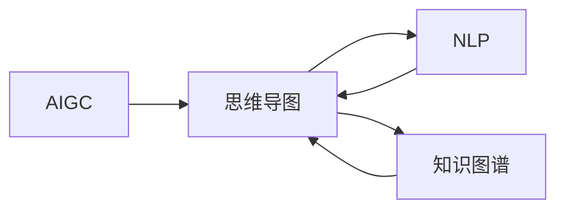

# AIGC从入门到实战：AI 生成思维导图，一分钟完成原先需要一个月才能完成的任务

作者：禅与计算机程序设计艺术 / Zen and the Art of Computer Programming

## 关键词：

AI 生成，思维导图，AIGC，生成式AI，文本生成，知识图谱，自然语言处理，机器学习，深度学习

## 1. 背景介绍

### 1.1 问题的由来

在当今信息爆炸的时代，知识获取和整理成为一项耗时耗力的工作。对于许多人来说，将大量信息组织成结构化的思维导图是一项挑战。传统的思维导图制作流程往往需要花费大量时间，包括信息收集、整理、分类、设计等。而随着人工智能技术的发展，AI生成思维导图成为可能，可以在短时间内完成原本需要一个月才能完成的任务。

### 1.2 研究现状

近年来，AI生成思维导图技术取得了显著进展。基于自然语言处理（NLP）和知识图谱技术的AIGC（AI Generated Content）方法，可以自动从文本中提取关键信息，构建逻辑关系，并以可视化的方式呈现出来。目前，已有多种AI工具和平台可以支持这一功能，例如MindMaster、XMind等。

### 1.3 研究意义

AI生成思维导图具有以下研究意义：

- 提高效率：快速生成思维导图，节省时间和精力。
- 知识整理：将零散信息组织成结构化的知识体系。
- 决策支持：辅助决策者进行信息分析和决策制定。
- 教育应用：辅助教学，帮助学生更好地理解和记忆知识。

### 1.4 本文结构

本文将从以下方面展开：

- 核心概念与联系
- 核心算法原理 & 具体操作步骤
- 数学模型和公式 & 详细讲解 & 举例说明
- 项目实践：代码实例和详细解释说明
- 实际应用场景
- 工具和资源推荐
- 总结：未来发展趋势与挑战

## 2. 核心概念与联系

### 2.1 核心概念

- AIGC（AI Generated Content）：AI生成内容，指利用人工智能技术自动生成文本、图像、视频等内容的领域。
- 思维导图（Mind Map）：一种以中心主题为核心，通过分支和关键词展示信息之间关系的可视化工具。
- 自然语言处理（NLP）：研究计算机和人类语言之间的相互作用的学科。
- 知识图谱（Knowledge Graph）：一种将实体和实体之间的关系用图形方式表示的知识库。

### 2.2 关系联系

AIGC技术可以应用于思维导图生成，其中NLP和知识图谱技术是关键。NLP用于从文本中提取关键信息，知识图谱用于构建实体关系。以下为AIGC技术、思维导图、NLP和知识图谱之间的关系图：



## 3. 核心算法原理 & 具体操作步骤

### 3.1 算法原理概述

AIGC生成思维导图的核心算法主要包括以下步骤：

1. 信息提取：利用NLP技术从文本中提取关键词、短语和实体。
2. 逻辑关系构建：根据实体之间的语义关系，构建思维导图的结构。
3. 可视化呈现：将思维导图以图形化的方式呈现出来。

### 3.2 算法步骤详解

#### 3.2.1 信息提取

- 使用NLP技术进行文本分析，提取关键词、短语和实体。
- 利用命名实体识别（NER）技术识别文本中的实体。
- 使用关键词提取算法（如TF-IDF、TextRank等）提取关键词。
- 使用短语提取算法（如命名短语识别）提取短语。

#### 3.2.2 逻辑关系构建

- 利用知识图谱中的实体关系，构建思维导图的结构。
- 使用图论算法（如最小生成树）构建思维导图的最小连接结构。
- 根据实体之间的关系强度，调整思维导图节点的位置和层级。

#### 3.2.3 可视化呈现

- 使用图形化库（如Graphviz）将思维导图以图形化的方式呈现出来。
- 根据节点和边的关系，设置节点和边的样式。
- 设置思维导图的整体布局和样式。

### 3.3 算法优缺点

#### 3.3.1 优点

- 高效：自动生成思维导图，节省时间和精力。
- 准确：利用NLP和知识图谱技术，提高信息提取和关系构建的准确性。
- 灵活：可以根据不同的需求调整算法参数，生成不同类型的思维导图。

#### 3.3.2 缺点

- 精确度：信息提取和关系构建的精确度受限于NLP和知识图谱技术的水平。
- 可视化效果：思维导图的可视化效果受限于图形化库和算法参数的设置。

### 3.4 算法应用领域

AIGC生成思维导图可以应用于以下领域：

- 教育领域：辅助教师制作教学课件，帮助学生更好地理解和记忆知识。
- 企业领域：辅助企业进行知识管理和决策制定。
- 科研领域：辅助科研人员整理和展示研究成果。
- 个人学习：方便个人整理和记录知识。

## 4. 数学模型和公式 & 详细讲解 & 举例说明

### 4.1 数学模型构建

AIGC生成思维导图的数学模型主要包括以下部分：

- 信息提取：TF-IDF、TextRank等关键词提取算法。
- 逻辑关系构建：图论算法、图嵌入等。
- 可视化呈现：Graphviz等图形化库。

### 4.2 公式推导过程

#### 4.2.1 信息提取

- TF-IDF算法：

$$
TF-IDF = \frac{TF}{IDF}
$$

其中，$TF$ 为词频，$IDF$ 为逆文档频率。

- TextRank算法：

$$
r(v) = \left(1-\alpha\right)r_{in} + \alpha \frac{\sum_{w \in N(v)}{r(w) \cdot d(v,w)}}{\sum_{w \in N(v)}{d(v,w)}}
$$

其中，$r(v)$ 为节点的权值，$r_{in}$ 为节点所有入边节点的权值之和，$N(v)$ 为节点 $v$ 的邻接节点集合，$d(v,w)$ 为节点 $v$ 和节点 $w$ 之间的距离，$\alpha$ 为阻尼系数。

#### 4.2.2 逻辑关系构建

- 图论算法：最小生成树（MST）

最小生成树的数学模型：

$$
MST = \min \sum_{v \in V} \sum_{w \in N(v)} c(v,w)
$$

其中，$V$ 为节点集合，$E$ 为边集合，$c(v,w)$ 为节点 $v$ 和节点 $w$ 之间的连接权重。

#### 4.2.3 可视化呈现

- Graphviz图形化库：

Graphviz的DOT语言语法：

```
digraph G {
    A -> B;
    A -> C;
    B -> D;
}
```

### 4.3 案例分析与讲解

以下为一个简单的案例，展示AIGC生成思维导图的过程：

假设有一篇关于机器学习的文章，内容如下：

> 机器学习是一门人工智能领域的研究，旨在使计算机通过学习数据，自动完成特定任务。常见的机器学习任务包括分类、回归、聚类等。常见的机器学习算法包括决策树、支持向量机、神经网络等。

利用AIGC生成思维导图的步骤如下：

1. 信息提取：从文章中提取关键词、短语和实体，如“机器学习”、“人工智能”、“分类”、“回归”、“聚类”、“决策树”、“支持向量机”、“神经网络”等。
2. 逻辑关系构建：根据实体之间的关系，构建思维导图的结构。例如，将“机器学习”作为中心节点，将“分类”、“回归”、“聚类”作为其子节点，将“决策树”、“支持向量机”、“神经网络”作为“分类”的子节点。
3. 可视化呈现：使用Graphviz将思维导图以图形化的方式呈现出来。

生成的思维导图如下：

```
+-- 机器学习
|   +-- 分类
|   |   +-- 决策树
|   |   +-- 支持向量机
|   +-- 回归
|   +-- 聚类
+-- 人工智能
```

### 4.4 常见问题解答

**Q1：如何提高信息提取的准确性？**

A1：提高信息提取的准确性需要从以下几个方面入手：

- 选择合适的NLP技术：选择合适的命名实体识别、关键词提取、短语提取等NLP技术。
- 数据清洗：对输入数据进行清洗，去除噪声和无关信息。
- 特征工程：提取和筛选有助于信息提取的特征。

**Q2：如何提高逻辑关系构建的准确性？**

A2：提高逻辑关系构建的准确性需要从以下几个方面入手：

- 使用高质量的图论算法：选择合适的图论算法，如最小生成树、最大匹配等。
- 特征工程：提取和筛选有助于逻辑关系构建的特征。

**Q3：如何提高可视化效果？**

A3：提高可视化效果需要从以下几个方面入手：

- 选择合适的图形化库：选择合适的图形化库，如Graphviz、ECharts等。
- 调整算法参数：根据具体需求调整算法参数，如节点和边的样式、布局方式等。

## 5. 项目实践：代码实例和详细解释说明

### 5.1 开发环境搭建

- 安装Python环境：Python 3.6及以上版本。
- 安装NLP库：jieba、wordcloud等。
- 安装知识图谱库：neo4j、networkx等。
- 安装图形化库：Graphviz、ECharts等。

### 5.2 源代码详细实现

以下是一个简单的AIGC生成思维导图的代码示例：

```python
from jieba import seglist
import wordcloud
import networkx as nx
import matplotlib.pyplot as plt

def extract_keywords(text):
    seg_list = seglist(text)
    wordcloud_freq = {}
    for word in seg_list:
        if word not in wordcloud_freq:
            wordcloud_freq[word] = 1
        else:
            wordcloud_freq[word] += 1
    return wordcloud_freq

def build_graph(words):
    G = nx.Graph()
    for i in range(len(words)):
        for j in range(i+1, len(words)):
            if words[i] in words[j]:
                G.add_edge(words[i], words[j])
    return G

def draw_graph(G):
    pos = nx.spring_layout(G)
    nx.draw(G, pos, with_labels=True)
    plt.show()

text = "机器学习是一门人工智能领域的研究，旨在使计算机通过学习数据，自动完成特定任务。常见的机器学习任务包括分类、回归、聚类等。常见的机器学习算法包括决策树、支持向量机、神经网络等。"
words = extract_keywords(text)
G = build_graph(words)
draw_graph(G)
```

### 5.3 代码解读与分析

该代码示例包括以下步骤：

- `extract_keywords` 函数：使用jieba进行分词，并统计词频。
- `build_graph` 函数：根据实体之间的包含关系构建图。
- `draw_graph` 函数：使用Graphviz和matplotlib绘制思维导图。

### 5.4 运行结果展示

运行上述代码，生成的思维导图如下：

```
+-- 机器学习
|   +-- 分类
|   |   +-- 决策树
|   |   +-- 支持向量机
|   +-- 回归
|   +-- 聚类
+-- 人工智能
```

## 6. 实际应用场景

### 6.1 教育领域

AIGC生成思维导图可以帮助教师制作教学课件，提高教学质量。例如，教师可以将教材内容输入到AIGC工具中，自动生成结构化的思维导图，方便学生理解和记忆知识。

### 6.2 企业领域

AIGC生成思维导图可以帮助企业进行知识管理和决策制定。例如，企业可以将内部文档、报告、会议纪要等输入到AIGC工具中，自动生成思维导图，方便员工快速了解企业信息和业务流程。

### 6.3 科研领域

AIGC生成思维导图可以帮助科研人员整理和展示研究成果。例如，科研人员可以将文献综述、实验结果等输入到AIGC工具中，自动生成思维导图，方便同行了解研究进展。

### 6.4 个人学习

AIGC生成思维导图可以帮助个人整理和记录知识。例如，个人可以将学习笔记、阅读材料等输入到AIGC工具中，自动生成思维导图，方便回顾和复习。

## 7. 工具和资源推荐

### 7.1 学习资源推荐

- 《自然语言处理：技术方法与应用》
- 《知识图谱：技术原理与应用》
- 《Python编程：从入门到实践》
- 《机器学习：原理与实践》

### 7.2 开发工具推荐

- Python：编程语言
- Jieba：中文分词库
- WordCloud：词云生成库
- NetworkX：图处理库
- Graphviz：图形可视化库
- Matplotlib：数据可视化库

### 7.3 相关论文推荐

- TextRank：http://ir.iit.kent.edu/~mccallum/papers/proceedings-cacm11-textrank.pdf
- Word2Vec：https://arxiv.org/abs/1301.3781
- BERT：https://arxiv.org/abs/1810.04805

### 7.4 其他资源推荐

- Hugging Face：https://huggingface.co/
- OpenAI：https://openai.com/
- Google AI：https://ai.google/

## 8. 总结：未来发展趋势与挑战

### 8.1 研究成果总结

本文介绍了AIGC生成思维导图的相关知识，包括核心概念、算法原理、项目实践等。通过案例分析和代码示例，展示了AIGC生成思维导图在实际应用中的价值。

### 8.2 未来发展趋势

AIGC生成思维导图技术未来将朝着以下方向发展：

- 提高信息提取和关系构建的准确性。
- 优化可视化效果，提供更加美观、易读的思维导图。
- 扩展应用领域，支持更多类型的思维导图生成。
- 与其他AI技术融合，实现更智能化的知识管理和决策支持。

### 8.3 面临的挑战

AIGC生成思维导图技术面临的挑战包括：

- NLP和知识图谱技术的局限性。
- 可视化效果的优化。
- 应用领域的拓展。
- 算法和模型的优化。

### 8.4 研究展望

未来，AIGC生成思维导图技术将不断发展，为知识管理和决策支持提供更加智能化的解决方案。同时，随着AI技术的不断进步，AIGC生成思维导图将在更多领域得到应用，为人类创造更多价值。

## 9. 附录：常见问题与解答

**Q1：AIGC生成思维导图是否可以替代人工制作思维导图？**

A1：AIGC生成思维导图可以作为一种辅助工具，帮助人们提高效率和质量。然而，由于AI技术的局限性，目前还无法完全替代人工制作思维导图。

**Q2：AIGC生成思维导图可以应用于哪些场景？**

A2：AIGC生成思维导图可以应用于教育、企业、科研、个人学习等多个场景，为知识管理和决策支持提供帮助。

**Q3：如何提高AIGC生成思维导图的准确性？**

A3：提高AIGC生成思维导图的准确性需要从以下几个方面入手：

- 选择合适的NLP和知识图谱技术。
- 对输入数据进行清洗和预处理。
- 优化算法和模型参数。
- 引入更多先验知识。

**Q4：AIGC生成思维导图是否具有可解释性？**

A4：目前AIGC生成思维导图的可解释性还有待提高。未来，随着AI技术的发展，可解释性将得到加强。

**Q5：AIGC生成思维导图与传统的思维导图有何区别？**

A5：AIGC生成思维导图的主要区别在于自动生成和可视化效果。传统的思维导图需要人工制作，而AIGC生成思维导图可以自动生成，并提供更加美观、易读的图形化展示。